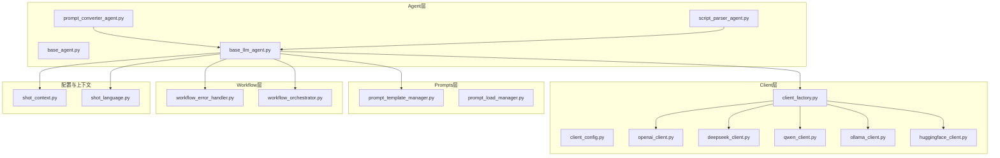
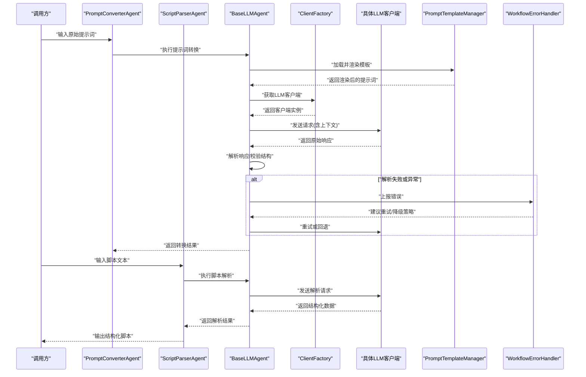
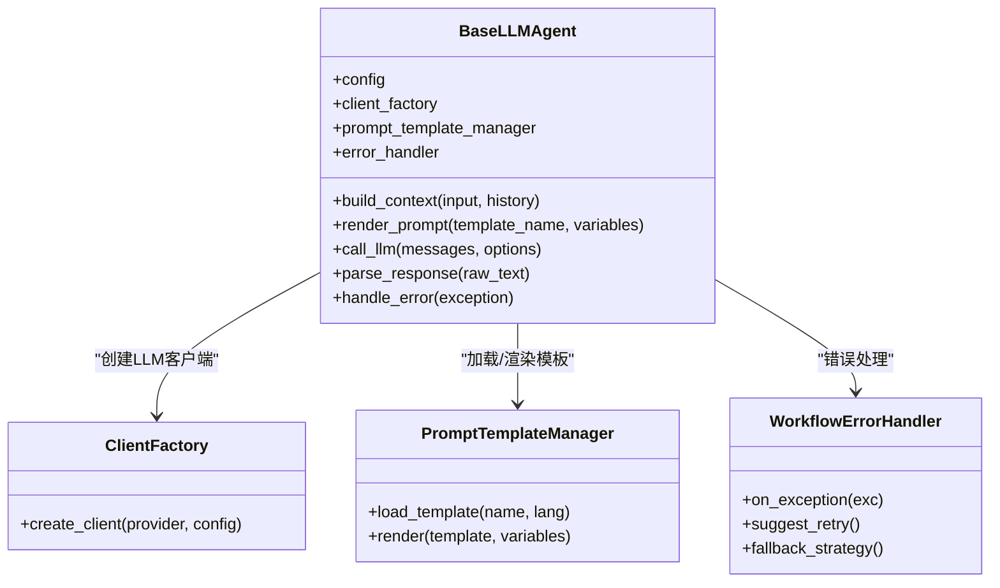
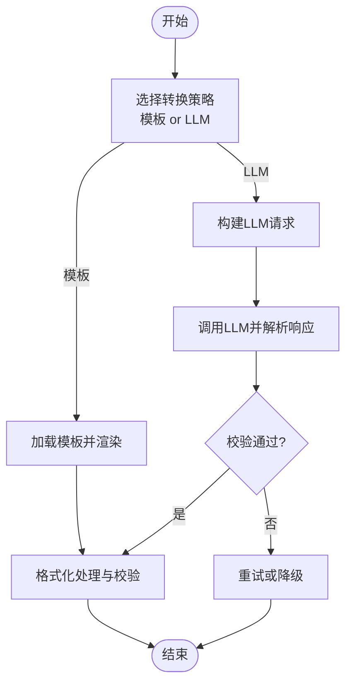
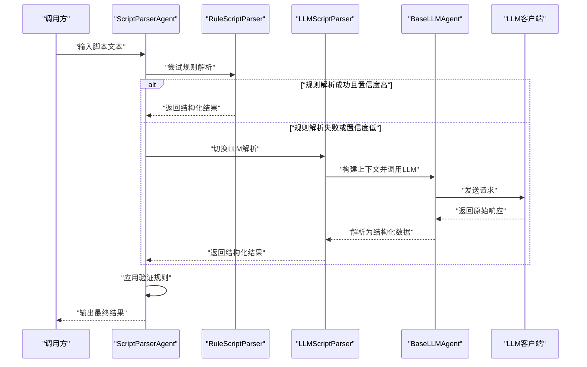
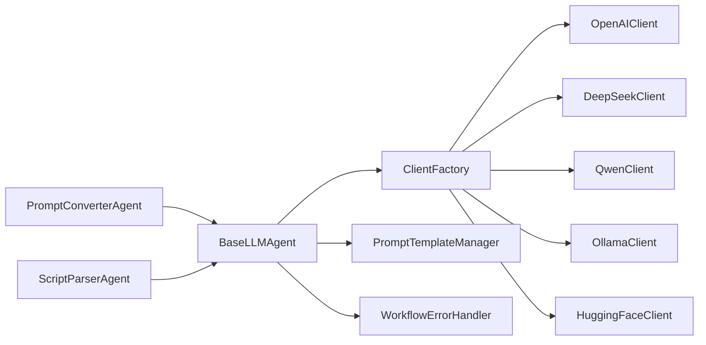

# LLM Agent实现

<cite>
**本文引用的文件**   
- [base_llm_agent.py](file://src/penshot/neopen/agent/base_llm_agent.py)
- [prompt_converter_agent.py](file://src/penshot/neopen/agent/prompt_converter_agent.py)
- [script_parser_agent.py](file://src/penshot/neopen/agent/script_parser_agent.py)
- [base_agent.py](file://src/penshot/neopen/agent/base_agent.py)
- [base_models.py](file://src/penshot/neopen/agent/base_models.py)
- [llm_prompt_converter.py](file://src/penshot/neopen/agent/prompt_converter/llm_prompt_converter.py)
- [template_prompt_converter.py](file://src/penshot/neopen/agent/prompt_converter/template_prompt_converter.py)
- [prompt_converter_factory.py](file://src/penshot/neopen/agent/prompt_converter/prompt_converter_factory.py)
- [prompt_template_manager.py](file://src/penshot/neopen/prompts/prompt_template_manager.py)
- [prompt_load_manager.py](file://src/penshot/neopen/prompts/prompt_load_manager.py)
- [llm_script_parser.py](file://src/penshot/neopen/agent/script_parser/llm_script_parser.py)
- [rule_script_parser.py](file://src/penshot/neopen/agent/script_parser/rule_script_parser.py)
- [base_script_parser.py](file://src/penshot/neopen/agent/script_parser/base_script_parser.py)
- [script_parser_models.py](file://src/penshot/neopen/agent/script_parser/script_parser_models.py)
- [client_config.py](file://src/penshot/neopen/client/client_config.py)
- [client_factory.py](file://src/penshot/neopen/client/client_factory.py)
- [openai_client.py](file://src/penshot/neopen/client/llm/openai_client.py)
- [deepseek_client.py](file://src/penshot/neopen/client/llm/deepseek_client.py)
- [qwen_client.py](file://src/penshot/neopen/client/llm/qwen_client.py)
- [ollama_client.py](file://src/penshot/neopen/client/llm/ollama_client.py)
- [huggingface_client.py](file://src/penshot/neopen/client/llm/huggingface_client.py)
- [workflow_error_handler.py](file://src/penshot/neopen/agent/workflow/workflow_error_handler.py)
- [workflow_orchestrator.py](file://src/penshot/neopen/agent/workflow/workflow_orchestrator.py)
- [shot_context.py](file://src/penshot/neopen/shot_context.py)
- [shot_language.py](file://src/penshot/neopen/shot_language.py)
</cite>

## 目录
1. [简介](#简介)
2. [项目结构](#项目结构)
3. [核心组件](#核心组件)
4. [架构总览](#架构总览)
5. [详细组件分析](#详细组件分析)
6. [依赖关系分析](#依赖关系分析)
7. [性能考虑](#性能考虑)
8. [故障排除指南](#故障排除指南)
9. [结论](#结论)
10. [附录](#附录)

## 简介
本文件面向LLM Agent的实现与使用，聚焦以下目标：
- 深入解析BaseLLMAgent类的设计与实现，涵盖大语言模型集成、提示词模板管理、上下文构建、响应解析与错误恢复机制。
- 详解PromptConverterAgent的工作流程，包括提示词转换策略、格式化处理与多语言支持。
- 阐述ScriptParserAgent的实现细节，包括脚本解析逻辑、结构化数据提取与验证规则应用。
- 提供配置选项、性能优化技巧与故障排除方法。
- 给出扩展与定制LLM功能的完整示例路径（以源码位置引用为主）。

## 项目结构
本项目采用分层与按功能域组织相结合的结构：
- agent层：定义通用Agent基类与各领域Agent（如PromptConverterAgent、ScriptParserAgent等）
- client层：封装不同LLM提供商的客户端（OpenAI、DeepSeek、Qwen、Ollama、HuggingFace等）
- prompts层：集中管理提示词模板加载与管理
- workflow层：工作流编排、错误处理、状态管理等
- config层：全局配置与模型参数
- knowledge层：知识检索与记忆模块（可选）
- tools层：工具函数与外部能力封装

图表来源
- [base_llm_agent.py:1-200](file://src/penshot/neopen/agent/base_llm_agent.py#L1-L200)
- [prompt_converter_agent.py:1-200](file://src/penshot/neopen/agent/prompt_converter_agent.py#L1-L200)
- [script_parser_agent.py:1-200](file://src/penshot/neopen/agent/script_parser_agent.py#L1-L200)
- [client_factory.py:1-120](file://src/penshot/neopen/client/client_factory.py#L1-L120)
- [prompt_template_manager.py:1-120](file://src/penshot/neopen/prompts/prompt_template_manager.py#L1-L120)
- [workflow_error_handler.py:1-120](file://src/penshot/neopen/agent/workflow/workflow_error_handler.py#L1-L120)
- [workflow_orchestrator.py:1-120](file://src/penshot/neopen/agent/workflow/workflow_orchestrator.py#L1-L120)
- [shot_context.py:1-120](file://src/penshot/neopen/shot_context.py#L1-L120)
- [shot_language.py:1-120](file://src/penshot/neopen/shot_language.py#L1-L120)

章节来源
- [base_agent.py:1-120](file://src/penshot/neopen/agent/base_agent.py#L1-L120)
- [base_llm_agent.py:1-200](file://src/penshot/neopen/agent/base_llm_agent.py#L1-L200)
- [client_factory.py:1-120](file://src/penshot/neopen/client/client_factory.py#L1-L120)
- [prompt_template_manager.py:1-120](file://src/penshot/neopen/prompts/prompt_template_manager.py#L1-L120)
- [workflow_error_handler.py:1-120](file://src/penshot/neopen/agent/workflow/workflow_error_handler.py#L1-L120)
- [workflow_orchestrator.py:1-120](file://src/penshot/neopen/agent/workflow/workflow_orchestrator.py#L1-L120)
- [shot_context.py:1-120](file://src/penshot/neopen/shot_context.py#L1-L120)
- [shot_language.py:1-120](file://src/penshot/neopen/shot_language.py#L1-L120)

## 核心组件
本节概述关键组件的职责与交互关系：
- BaseLLMAgent：统一抽象LLM调用、提示词渲染、上下文组装、结果解析与重试/修复策略
- PromptConverterAgent：将原始提示词转换为结构化或目标格式的提示词，支持模板与LLM两种策略
- ScriptParserAgent：从自然语言脚本中提取结构化信息，支持LLM与规则两种解析器
- Client工厂与具体客户端：屏蔽不同LLM提供商差异，提供统一的请求/响应接口
- Prompts管理器：加载、缓存与选择提示词模板，支持多语言版本
- Workflow错误处理器：捕获异常、记录日志、触发重试或降级策略

章节来源
- [base_llm_agent.py:1-200](file://src/penshot/neopen/agent/base_llm_agent.py#L1-L200)
- [prompt_converter_agent.py:1-200](file://src/penshot/neopen/agent/prompt_converter_agent.py#L1-L200)
- [script_parser_agent.py:1-200](file://src/penshot/neopen/agent/script_parser_agent.py#L1-L200)
- [client_factory.py:1-120](file://src/penshot/neopen/client/client_factory.py#L1-L120)
- [prompt_template_manager.py:1-120](file://src/penshot/neopen/prompts/prompt_template_manager.py#L1-L120)
- [workflow_error_handler.py:1-120](file://src/penshot/neopen/agent/workflow/workflow_error_handler.py#L1-L120)

## 架构总览
下图展示了LLM Agent的整体架构与数据流向：

图表来源
- [prompt_converter_agent.py:1-200](file://src/penshot/neopen/agent/prompt_converter_agent.py#L1-L200)
- [script_parser_agent.py:1-200](file://src/penshot/neopen/agent/script_parser_agent.py#L1-L200)
- [base_llm_agent.py:1-200](file://src/penshot/neopen/agent/base_llm_agent.py#L1-L200)
- [client_factory.py:1-120](file://src/penshot/neopen/client/client_factory.py#L1-L120)
- [prompt_template_manager.py:1-120](file://src/penshot/neopen/prompts/prompt_template_manager.py#L1-L120)
- [workflow_error_handler.py:1-120](file://src/penshot/neopen/agent/workflow/workflow_error_handler.py#L1-L120)

## 详细组件分析

### BaseLLMAgent类实现原理
BaseLLMAgent作为所有LLM驱动的Agent的基类，承担以下职责：
- 大语言模型集成：通过ClientFactory动态选择并初始化具体LLM客户端，统一请求参数与响应格式
- 提示词模板管理：结合PromptTemplateManager加载指定版本的提示词模板，并按语言与环境变量进行渲染
- 上下文构建：整合ShotContext与语言设置，生成包含系统指令、用户输入与历史信息的消息序列
- 响应解析：对LLM返回的文本进行结构化解析（JSON/自定义格式），并进行字段校验与类型转换
- 错误恢复：基于WorkflowErrorHandler捕获网络异常、超时、鉴权失败、格式错误等，执行重试、降级或人工干预策略

图表来源
- [base_llm_agent.py:1-200](file://src/penshot/neopen/agent/base_llm_agent.py#L1-L200)
- [client_factory.py:1-120](file://src/penshot/neopen/client/client_factory.py#L1-L120)
- [prompt_template_manager.py:1-120](file://src/penshot/neopen/prompts/prompt_template_manager.py#L1-L120)
- [workflow_error_handler.py:1-120](file://src/penshot/neopen/agent/workflow/workflow_error_handler.py#1-L120)

章节来源
- [base_llm_agent.py:1-200](file://src/penshot/neopen/agent/base_llm_agent.py#L1-L200)
- [base_models.py:1-120](file://src/penshot/neopen/agent/base_models.py#L1-L120)
- [shot_context.py:1-120](file://src/penshot/neopen/shot_context.py#L1-L120)
- [shot_language.py:1-120](file://src/penshot/neopen/shot_language.py#L1-L120)

### PromptConverterAgent工作流程
PromptConverterAgent负责将原始提示词转换为符合下游任务要求的结构化或格式化提示词。其核心流程如下：
- 提示词转换策略：支持“模板转换”与“LLM转换”两种模式，由PromptConverterFactory根据配置选择
- 格式化处理：对输出进行规范化（如JSON Schema校验、字段补齐、去重等）
- 多语言支持：依据当前语言环境选择对应语言的提示词模板，确保语义一致性

图表来源
- [prompt_converter_agent.py:1-200](file://src/penshot/neopen/agent/prompt_converter_agent.py#L1-L200)
- [llm_prompt_converter.py:1-120](file://src/penshot/neopen/agent/prompt_converter/llm_prompt_converter.py#L1-L120)
- [template_prompt_converter.py:1-120](file://src/penshot/neopen/agent/prompt_converter/template_prompt_converter.py#L1-L120)
- [prompt_converter_factory.py:1-120](file://src/penshot/neopen/agent/prompt_converter/prompt_converter_factory.py#L1-L120)
- [prompt_template_manager.py:1-120](file://src/penshot/neopen/prompts/prompt_template_manager.py#L1-L120)

章节来源
- [prompt_converter_agent.py:1-200](file://src/penshot/neopen/agent/prompt_converter_agent.py#L1-L200)
- [llm_prompt_converter.py:1-120](file://src/penshot/neopen/agent/prompt_converter/llm_prompt_converter.py#L1-L120)
- [template_prompt_converter.py:1-120](file://src/penshot/neopen/agent/prompt_converter/template_prompt_converter.py#L1-L120)
- [prompt_converter_factory.py:1-120](file://src/penshot/neopen/agent/prompt_converter/prompt_converter_factory.py#L1-L120)
- [prompt_load_manager.py:1-120](file://src/penshot/neopen/prompts/prompt_load_manager.py#L1-L120)

### ScriptParserAgent实现细节
ScriptParserAgent用于从自然语言脚本中提取结构化信息，支持两种解析器：
- LLM解析器：利用大模型理解语义并输出结构化数据
- 规则解析器：基于正则表达式与预定义规则进行快速提取

核心要点：
- 脚本解析逻辑：先尝试规则解析，若置信度不足则回退至LLM解析
- 结构化数据提取：将提取结果映射到标准数据模型，便于后续处理
- 验证规则应用：对关键字段进行必填性、类型与范围校验，不满足时触发修复或人工审核

图表来源
- [script_parser_agent.py:1-200](file://src/penshot/neopen/agent/script_parser_agent.py#L1-L200)
- [rule_script_parser.py:1-120](file://src/penshot/neopen/agent/script_parser/rule_script_parser.py#L1-L120)
- [llm_script_parser.py:1-120](file://src/penshot/neopen/agent/script_parser/llm_script_parser.py#L1-L120)
- [base_script_parser.py:1-120](file://src/penshot/neopen/agent/script_parser/base_script_parser.py#L1-L120)
- [script_parser_models.py:1-120](file://src/penshot/neopen/agent/script_parser/script_parser_models.py#L1-L120)
- [base_llm_agent.py:1-200](file://src/penshot/neopen/agent/base_llm_agent.py#L1-L200)

章节来源
- [script_parser_agent.py:1-200](file://src/penshot/neopen/agent/script_parser_agent.py#L1-L200)
- [rule_script_parser.py:1-120](file://src/penshot/neopen/agent/script_parser/rule_script_parser.py#L1-L120)
- [llm_script_parser.py:1-120](file://src/penshot/neopen/agent/script_parser/llm_script_parser.py#L1-L120)
- [base_script_parser.py:1-120](file://src/penshot/neopen/agent/script_parser/base_script_parser.py#L1-L120)
- [script_parser_models.py:1-120](file://src/penshot/neopen/agent/script_parser/script_parser_models.py#L1-L120)

## 依赖关系分析
各组件之间的耦合与内聚情况如下：
- BaseLLMAgent与ClientFactory、PromptTemplateManager、WorkflowErrorHandler存在强依赖，但通过接口隔离降低耦合
- PromptConverterAgent与ScriptParserAgent均依赖BaseLLMAgent，形成清晰的继承层次
- ClientFactory聚合多个具体客户端实现，遵循开闭原则，新增提供商无需修改现有代码
- Prompts层独立于业务逻辑，便于维护与版本化

图表来源
- [base_llm_agent.py:1-200](file://src/penshot/neopen/agent/base_llm_agent.py#L1-L200)
- [client_factory.py:1-120](file://src/penshot/neopen/client/client_factory.py#L1-L120)
- [openai_client.py:1-120](file://src/penshot/neopen/client/llm/openai_client.py#L1-L120)
- [deepseek_client.py:1-120](file://src/penshot/neopen/client/llm/deepseek_client.py#L1-L120)
- [qwen_client.py:1-120](file://src/penshot/neopen/client/llm/qwen_client.py#L1-L120)
- [ollama_client.py:1-120](file://src/penshot/neopen/client/llm/ollama_client.py#L1-L120)
- [huggingface_client.py:1-120](file://src/penshot/neopen/client/llm/huggingface_client.py#L1-L120)

章节来源
- [base_llm_agent.py:1-200](file://src/penshot/neopen/agent/base_llm_agent.py#L1-L200)
- [client_factory.py:1-120](file://src/penshot/neopen/client/client_factory.py#L1-L120)

## 性能考虑
- 客户端连接池与复用：通过ClientFactory统一管理连接，避免频繁握手开销
- 提示词模板缓存：在PromptTemplateManager中缓存已加载模板，减少I/O与解析成本
- 并发与限流：在调用LLM时启用并发控制与速率限制，防止服务过载
- 响应解析优化：优先使用轻量级解析器（如规则解析），仅在必要时调用LLM
- 错误快速失败：对可恢复错误实施指数退避重试，对不可恢复错误立即降级

[本节为通用指导，不涉及具体文件分析]

## 故障排除指南
常见问题与定位步骤：
- 鉴权失败：检查ClientConfig中的密钥与端点配置是否正确
- 超时或网络异常：查看WorkflowErrorHandler日志，确认是否触发重试或降级
- 响应格式错误：确认PromptTemplateManager加载的模板是否与期望输出一致
- 解析失败：检查ScriptParserAgent的规则置信度阈值与LLM返回结构是否符合预期

章节来源
- [workflow_error_handler.py:1-120](file://src/penshot/neopen/agent/workflow/workflow_error_handler.py#L1-L120)
- [client_config.py:1-120](file://src/penshot/neopen/client/client_config.py#L1-L120)
- [prompt_template_manager.py:1-120](file://src/penshot/neopen/prompts/prompt_template_manager.py#L1-L120)
- [script_parser_agent.py:1-200](file://src/penshot/neopen/agent/script_parser_agent.py#L1-L200)

## 结论
BaseLLMAgent提供了统一的LLM集成框架，结合PromptConverterAgent与ScriptParserAgent实现了灵活的提示词转换与脚本解析能力。通过ClientFactory与PromptTemplateManager的解耦设计，系统具备良好的可扩展性与可维护性。在生产环境中，建议结合性能优化与故障排除策略，确保稳定高效运行。

[本节为总结性内容，不涉及具体文件分析]

## 附录

### 配置选项
- 模型提供商选择：在ClientConfig中指定provider（如openai、deepseek、qwen、ollama、huggingface）
- 基础URL与API密钥：根据提供商要求配置endpoint与secret
- 超时与重试：设置timeout、max_retries、backoff_factor等参数
- 提示词模板版本：在PromptTemplateManager中指定v1.x/v2.x等版本路径
- 语言设置：通过ShotLanguage选择zh/en等多语言模板

章节来源
- [client_config.py:1-120](file://src/penshot/neopen/client/client_config.py#L1-L120)
- [prompt_template_manager.py:1-120](file://src/penshot/neopen/prompts/prompt_template_manager.py#L1-L120)
- [shot_language.py:1-120](file://src/penshot/neopen/shot_language.py#L1-L120)

### 扩展与定制示例路径
- 新增LLM客户端：参考openai_client.py实现新的ProviderClient，并在client_factory.py注册
- 自定义提示词模板：在prompts目录下添加新模板文件，并通过prompt_template_manager.py加载
- 扩展解析规则：在rule_script_parser.py中添加新的正则表达式与验证逻辑
- 集成工作流节点：在workflow_orchestrator.py中注册新的Agent节点

章节来源
- [openai_client.py:1-120](file://src/penshot/neopen/client/llm/openai_client.py#L1-L120)
- [client_factory.py:1-120](file://src/penshot/neopen/client/client_factory.py#L1-L120)
- [prompt_template_manager.py:1-120](file://src/penshot/neopen/prompts/prompt_template_manager.py#L1-L120)
- [rule_script_parser.py:1-120](file://src/penshot/neopen/agent/script_parser/rule_script_parser.py#L1-L120)
- [workflow_orchestrator.py:1-120](file://src/penshot/neopen/agent/workflow/workflow_orchestrator.py#L1-L120)