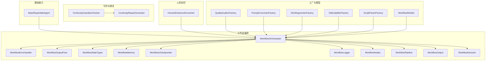
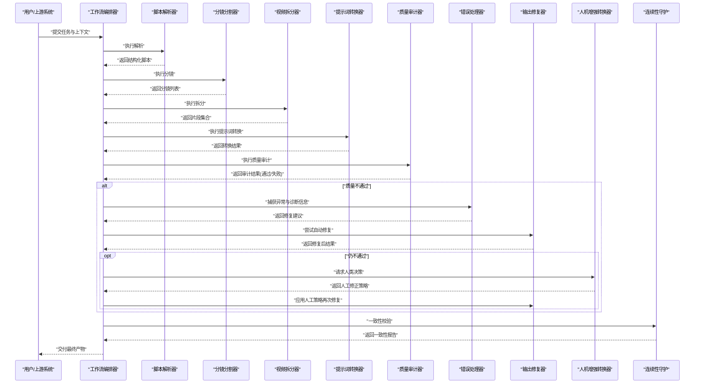
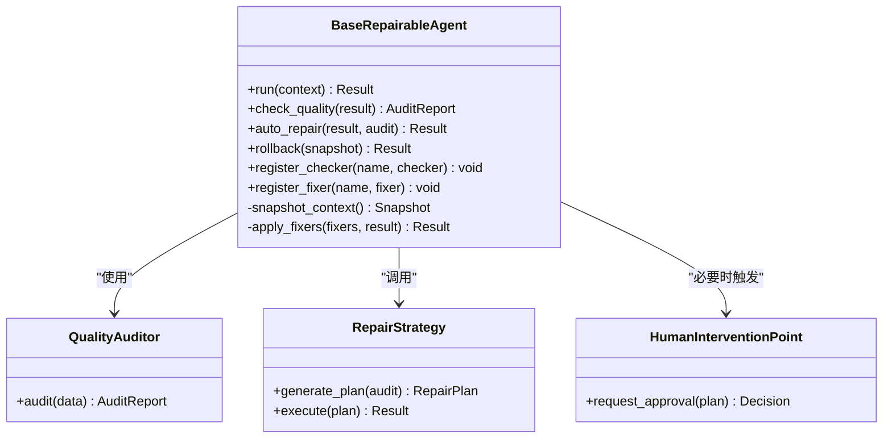
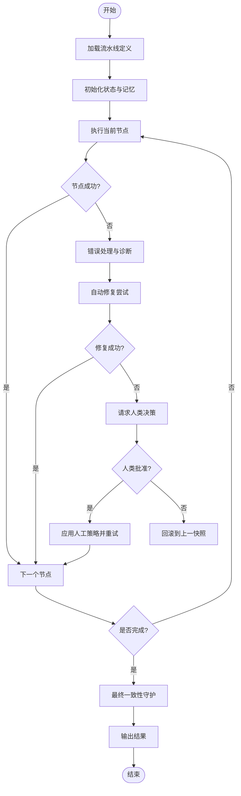
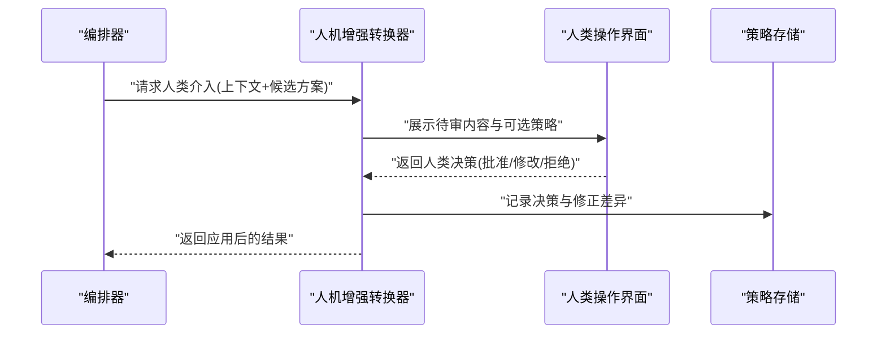
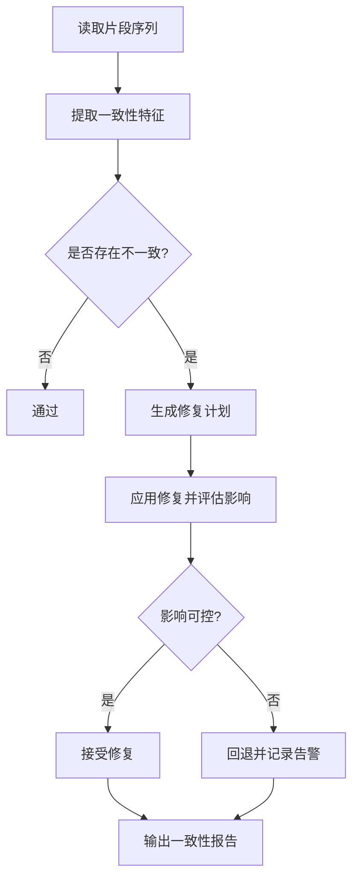
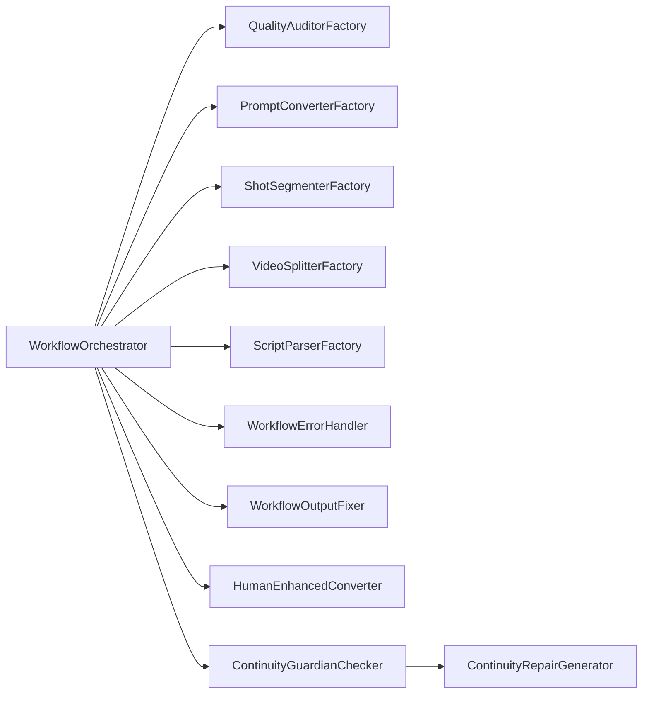

# 可修复Agent架构

<cite>
**本文引用的文件**   
- [base_repairable_agent.py](file://src/penshot/neopen/agent/base_repairable_agent.py)
- [human_enhanced_converter.py](file://src/penshot/neopen/agent/human_decision/human_enhanced_converter.py)
- [workflow_orchestrator.py](file://src/penshot/neopen/agent/workflow/workflow_orchestrator.py)
- [workflow_error_handler.py](file://src/penshot/neopen/agent/workflow/workflow_error_handler.py)
- [workflow_output_fixer.py](file://src/penshot/neopen/agent/workflow/workflow_output_fixer.py)
- [continuity_guardian_checker.py](file://src/penshot/neopen/agent/continuity_guardian/continuity_guardian_checker.py)
- [continuity_repair_generator.py](file://src/penshot/neopen/agent/continuity_guardian/continuity_repair_generator.py)
- [quality_auditor_factory.py](file://src/penshot/neopen/agent/quality_auditor/quality_auditor_factory.py)
- [prompt_converter_factory.py](file://src/penshot/neopen/agent/prompt_converter/prompt_converter_factory.py)
- [shot_segmenter_factory.py](file://src/penshot/neopen/agent/shot_segmenter/shot_segmenter_factory.py)
- [video_splitter_factory.py](file://src/penshot/neopen/agent/video_splitter/video_splitter_factory.py)
- [script_parser_factory.py](file://src/penshot/neopen/agent/script_parser/__init__.py)
- [workflow_state_types.py](file://src/penshot/neopen/agent/workflow/workflow_state_types.py)
- [workflow_models.py](file://src/penshot/neopen/agent/workflow/workflow_models.py)
- [workflow_memory.py](file://src/penshot/neopen/agent/workflow/workflow_memory.py)
- [workflow_checkpointer.py](file://src/penshot/neopen/agent/workflow/workflow_checkpointer.py)
- [workflow_logger.py](file://src/penshot/neopen/agent/workflow/workflow_logger.py)
- [workflow_nodes.py](file://src/penshot/neopen/agent/workflow/workflow_nodes.py)
- [workflow_pipeline.py](file://src/penshot/neopen/agent/workflow/workflow_pipeline.py)
- [workflow_output.py](file://src/penshot/neopen/agent/workflow/workflow_output.py)
- [workflow_decision.py](file://src/penshot/neopen/agent/workflow/workflow_decision.py)
</cite>

## 目录
1. [简介](#简介)
2. [项目结构](#项目结构)
3. [核心组件](#核心组件)
4. [架构总览](#架构总览)
5. [详细组件分析](#详细组件分析)
6. [依赖关系分析](#依赖关系分析)
7. [性能考量](#性能考量)
8. [故障排查指南](#故障排查指南)
9. [结论](#结论)
10. [附录：开发指南与示例](#附录开发指南与示例)

## 简介
本文件面向“可修复Agent”的架构设计与实现，围绕以下目标展开：
- 深入解释 BaseRepairableAgent 的设计理念：质量检查机制、自动修复策略、人工干预点设计。
- 详细说明修复流程的实现原理：错误检测、修复方案生成、结果验证、回滚机制。
- 阐述 HumanEnhancedConverter 的人机协作模式：人类决策集成、反馈学习、质量控制。
- 提供可修复Agent的开发指南：如何实现修复逻辑、配置修复策略、监控修复效果。
- 给出完整的代码示例路径，展示如何构建具备自愈能力的智能Agent系统。

## 项目结构
本项目采用分层与按功能域组织相结合的结构。与“可修复Agent”直接相关的核心模块位于 neopen/agent 下，包括：
- 基础能力层：BaseRepairableAgent 提供通用的自检、修复、回滚、审计等能力。
- 工作流编排层：WorkflowOrchestrator 负责节点调度、状态管理、错误处理与输出修复。
- 人机协同层：HumanEnhancedConverter 将人类决策注入到转换流程中，形成闭环的质量控制。
- 专项守护器：ContinuityGuardianChecker/ContinuityRepairGenerator 用于跨片段一致性守护与修复。
- 工厂与模型：各子系统的 Factory 统一创建具体实现；State/Model 定义贯穿流程的数据契约。

图表来源
- [workflow_orchestrator.py:1-200](file://src/penshot/neopen/agent/workflow/workflow_orchestrator.py#L1-L200)
- [workflow_error_handler.py:1-120](file://src/penshot/neopen/agent/workflow/workflow_error_handler.py#L1-L120)
- [workflow_output_fixer.py:1-120](file://src/penshot/neopen/agent/workflow/workflow_output_fixer.py#L1-L120)
- [workflow_state_types.py:1-120](file://src/penshot/neopen/agent/workflow/workflow_state_types.py#L1-L120)
- [workflow_memory.py:1-120](file://src/penshot/neopen/agent/workflow/workflow_memory.py#L1-L120)
- [workflow_checkpointer.py:1-120](file://src/penshot/neopen/agent/workflow/workflow_checkpointer.py#L1-L120)
- [workflow_logger.py:1-120](file://src/penshot/neopen/agent/workflow/workflow_logger.py#L1-L120)
- [workflow_nodes.py:1-120](file://src/penshot/neopen/agent/workflow/workflow_nodes.py#L1-L120)
- [workflow_pipeline.py:1-120](file://src/penshot/neopen/agent/workflow/workflow_pipeline.py#L1-L120)
- [workflow_output.py:1-120](file://src/penshot/neopen/agent/workflow/workflow_output.py#L1-L120)
- [workflow_decision.py:1-120](file://src/penshot/neopen/agent/workflow/workflow_decision.py#L1-L120)
- [human_enhanced_converter.py:1-200](file://src/penshot/neopen/agent/human_decision/human_enhanced_converter.py#L1-L200)
- [continuity_guardian_checker.py:1-200](file://src/penshot/neopen/agent/continuity_guardian/continuity_guardian_checker.py#L1-L200)
- [continuity_repair_generator.py:1-200](file://src/penshot/neopen/agent/continuity_guardian/continuity_repair_generator.py#L1-L200)
- [quality_auditor_factory.py:1-120](file://src/penshot/neopen/agent/quality_auditor/quality_auditor_factory.py#L1-L120)
- [prompt_converter_factory.py:1-120](file://src/penshot/neopen/agent/prompt_converter/prompt_converter_factory.py#L1-L120)
- [shot_segmenter_factory.py:1-120](file://src/penshot/neopen/agent/shot_segmenter/shot_segmenter_factory.py#L1-L120)
- [video_splitter_factory.py:1-120](file://src/penshot/neopen/agent/video_splitter/video_splitter_factory.py#L1-L120)
- [script_parser_factory.py:1-120](file://src/penshot/neopen/agent/script_parser/__init__.py#L1-L120)
- [workflow_models.py:1-200](file://src/penshot/neopen/agent/workflow/workflow_models.py#L1-L200)

章节来源
- [workflow_orchestrator.py:1-200](file://src/penshot/neopen/agent/workflow/workflow_orchestrator.py#L1-L200)
- [workflow_state_types.py:1-120](file://src/penshot/neopen/agent/workflow/workflow_state_types.py#L1-L120)
- [workflow_models.py:1-200](file://src/penshot/neopen/agent/workflow/workflow_models.py#L1-L200)

## 核心组件
- BaseRepairableAgent：提供统一的“自检-修复-回滚-审计”骨架，支持可插拔的质量检查器与修复器，暴露最小化接口供上层编排调用。
- WorkflowOrchestrator：编排多阶段任务（解析、分镜、拆分、提示词转换、质量审计等），维护状态、记忆、检查点、日志与决策分支。
- HumanEnhancedConverter：在关键转换步骤引入人类决策，支持人工修正、反馈收集与策略微调，形成“机器执行+人类把关”的混合模式。
- ContinuityGuardianChecker/ContinuityRepairGenerator：对长脚本或跨片段的一致性进行守护与修复，保障整体连贯性。
- 各类Factory：为不同子系统（质量审计、提示词转换、分镜、视频拆分、脚本解析）提供统一创建入口，便于替换实现与动态装配。

章节来源
- [base_repairable_agent.py:1-200](file://src/penshot/neopen/agent/base_repairable_agent.py#L1-L200)
- [workflow_orchestrator.py:1-200](file://src/penshot/neopen/agent/workflow/workflow_orchestrator.py#L1-L200)
- [human_enhanced_converter.py:1-200](file://src/penshot/neopen/agent/human_decision/human_enhanced_converter.py#L1-L200)
- [continuity_guardian_checker.py:1-200](file://src/penshot/neopen/agent/continuity_guardian/continuity_guardian_checker.py#L1-L200)
- [continuity_repair_generator.py:1-200](file://src/penshot/neopen/agent/continuity_guardian/continuity_repair_generator.py#L1-L200)
- [quality_auditor_factory.py:1-120](file://src/penshot/neopen/agent/quality_auditor/quality_auditor_factory.py#L1-L120)
- [prompt_converter_factory.py:1-120](file://src/penshot/neopen/agent/prompt_converter/prompt_converter_factory.py#L1-L120)
- [shot_segmenter_factory.py:1-120](file://src/penshot/neopen/agent/shot_segmenter/shot_segmenter_factory.py#L1-L120)
- [video_splitter_factory.py:1-120](file://src/penshot/neopen/agent/video_splitter/video_splitter_factory.py#L1-L120)
- [script_parser_factory.py:1-120](file://src/penshot/neopen/agent/script_parser/__init__.py#L1-L120)

## 架构总览
下图展示了“可修复Agent”的整体数据与控制流：从输入进入编排器，依次经过解析、分镜、拆分、转换与质量审计；若任一环节失败或质量不达标，则触发错误处理与输出修复；必要时引入人类决策；最终通过一致性守护确保跨片段连贯。

图表来源
- [workflow_orchestrator.py:1-200](file://src/penshot/neopen/agent/workflow/workflow_orchestrator.py#L1-L200)
- [workflow_error_handler.py:1-120](file://src/penshot/neopen/agent/workflow/workflow_error_handler.py#L1-L120)
- [workflow_output_fixer.py:1-120](file://src/penshot/neopen/agent/workflow/workflow_output_fixer.py#L1-L120)
- [human_enhanced_converter.py:1-200](file://src/penshot/neopen/agent/human_decision/human_enhanced_converter.py#L1-L200)
- [continuity_guardian_checker.py:1-200](file://src/penshot/neopen/agent/continuity_guardian/continuity_guardian_checker.py#L1-L200)

## 详细组件分析

### BaseRepairableAgent：可修复基类
设计理念
- 质量检查机制：内置可扩展的检查器注册表，支持规则型与LLM型检查器，统一返回通过/失败及诊断信息。
- 自动修复策略：基于检查结果选择修复器链，支持重试、降级、局部重算与增量更新。
- 人工干预点：在关键阈值或多次失败时，主动挂起并等待人类确认或修正。
- 回滚机制：在执行前保存快照，失败时恢复到最近一致状态，保证幂等与可恢复性。

关键职责
- 生命周期钩子：before_run、after_run、on_failure、on_recovery。
- 策略配置：最大重试次数、修复超时、回滚窗口、审计开关。
- 审计与日志：记录每次检查与修复的轨迹，便于追踪与复盘。

图表来源
- [base_repairable_agent.py:1-200](file://src/penshot/neopen/agent/base_repairable_agent.py#L1-L200)

章节来源
- [base_repairable_agent.py:1-200](file://src/penshot/neopen/agent/base_repairable_agent.py#L1-L200)

### WorkflowOrchestrator：编排与自愈中枢
职责
- 节点编排：根据流水线定义顺序执行各阶段（解析、分镜、拆分、转换、审计）。
- 状态与记忆：维护全局状态、中间结果与上下文，支持断点续跑。
- 错误处理：捕获异常、分类错误、触发修复或降级。
- 输出修复：针对结构性错误（如JSON格式、字段缺失）进行自动修复。
- 决策分支：依据审计结果与人类决策决定继续、重试或终止。

图表来源
- [workflow_orchestrator.py:1-200](file://src/penshot/neopen/agent/workflow/workflow_orchestrator.py#L1-L200)
- [workflow_error_handler.py:1-120](file://src/penshot/neopen/agent/workflow/workflow_error_handler.py#L1-L120)
- [workflow_output_fixer.py:1-120](file://src/penshot/neopen/agent/workflow/workflow_output_fixer.py#L1-L120)
- [workflow_state_types.py:1-120](file://src/penshot/neopen/agent/workflow/workflow_state_types.py#L1-L120)
- [workflow_memory.py:1-120](file://src/penshot/neopen/agent/workflow/workflow_memory.py#L1-L120)
- [workflow_checkpointer.py:1-120](file://src/penshot/neopen/agent/workflow/workflow_checkpointer.py#L1-L120)
- [workflow_logger.py:1-120](file://src/penshot/neopen/agent/workflow/workflow_logger.py#L1-L120)
- [workflow_nodes.py:1-120](file://src/penshot/neopen/agent/workflow/workflow_nodes.py#L1-L120)
- [workflow_pipeline.py:1-120](file://src/penshot/neopen/agent/workflow/workflow_pipeline.py#L1-L120)
- [workflow_output.py:1-120](file://src/penshot/neopen/agent/workflow/workflow_output.py#L1-L120)
- [workflow_decision.py:1-120](file://src/penshot/neopen/agent/workflow/workflow_decision.py#L1-L120)

章节来源
- [workflow_orchestrator.py:1-200](file://src/penshot/neopen/agent/workflow/workflow_orchestrator.py#L1-L200)
- [workflow_state_types.py:1-120](file://src/penshot/neopen/agent/workflow/workflow_state_types.py#L1-L120)
- [workflow_models.py:1-200](file://src/penshot/neopen/agent/workflow/workflow_models.py#L1-L200)

### HumanEnhancedConverter：人机协作模式
模式要点
- 人类决策集成：在关键转换步骤暂停，向人类展示待审内容并提供修改建议。
- 反馈学习：收集人类修正行为，沉淀为策略模板或权重调整，提升后续自动化率。
- 质量控制：人类审批作为最终闸门，确保高风险变更受控。

交互流程

图表来源
- [human_enhanced_converter.py:1-200](file://src/penshot/neopen/agent/human_decision/human_enhanced_converter.py#L1-L200)

章节来源
- [human_enhanced_converter.py:1-200](file://src/penshot/neopen/agent/human_decision/human_enhanced_converter.py#L1-L200)

### ContinuityGuardian：一致性守护与修复
职责
- 连续性检查：对比相邻片段的关键要素（风格、术语、时间线等）是否一致。
- 修复生成：针对不一致点生成修复计划，优先采用最小改动原则。
- 回退策略：当修复导致更大范围不一致时，回退到上一稳定版本。

图表来源
- [continuity_guardian_checker.py:1-200](file://src/penshot/neopen/agent/continuity_guardian/continuity_guardian_checker.py#L1-L200)
- [continuity_repair_generator.py:1-200](file://src/penshot/neopen/agent/continuity_guardian/continuity_repair_generator.py#L1-L200)

章节来源
- [continuity_guardian_checker.py:1-200](file://src/penshot/neopen/agent/continuity_guardian/continuity_guardian_checker.py#L1-L200)
- [continuity_repair_generator.py:1-200](file://src/penshot/neopen/agent/continuity_guardian/continuity_repair_generator.py#L1-L200)

### 工厂与模型：统一装配与契约
- 工厂类：QualityAuditorFactory、PromptConverterFactory、ShotSegmenterFactory、VideoSplitterFactory、ScriptParserFactory 提供统一创建入口，屏蔽具体实现差异，支持运行时切换。
- 模型与状态：WorkflowModels 与 WorkflowStateTypes 定义跨组件的数据契约与状态流转，确保编排器与各节点之间的解耦与可测试性。

章节来源
- [quality_auditor_factory.py:1-120](file://src/penshot/neopen/agent/quality_auditor/quality_auditor_factory.py#L1-L120)
- [prompt_converter_factory.py:1-120](file://src/penshot/neopen/agent/prompt_converter/prompt_converter_factory.py#L1-L120)
- [shot_segmenter_factory.py:1-120](file://src/penshot/neopen/agent/shot_segmenter/shot_segmenter_factory.py#L1-L120)
- [video_splitter_factory.py:1-120](file://src/penshot/neopen/agent/video_splitter/video_splitter_factory.py#L1-L120)
- [script_parser_factory.py:1-120](file://src/penshot/neopen/agent/script_parser/__init__.py#L1-L120)
- [workflow_models.py:1-200](file://src/penshot/neopen/agent/workflow/workflow_models.py#L1-L200)
- [workflow_state_types.py:1-120](file://src/penshot/neopen/agent/workflow/workflow_state_types.py#L1-L120)

## 依赖关系分析
- 低耦合高内聚：各子系统通过工厂创建，避免硬编码依赖；编排器仅依赖抽象接口与模型契约。
- 明确边界：错误处理、输出修复、记忆与检查点各自独立，便于替换与扩展。
- 潜在循环依赖风险：需确保工厂与模型之间无环引用；编排器与守护器之间通过事件/回调通信而非直接强耦合。

图表来源
- [workflow_orchestrator.py:1-200](file://src/penshot/neopen/agent/workflow/workflow_orchestrator.py#L1-L200)
- [quality_auditor_factory.py:1-120](file://src/penshot/neopen/agent/quality_auditor/quality_auditor_factory.py#L1-L120)
- [prompt_converter_factory.py:1-120](file://src/penshot/neopen/agent/prompt_converter/prompt_converter_factory.py#L1-L120)
- [shot_segmenter_factory.py:1-120](file://src/penshot/neopen/agent/shot_segmenter/shot_segmenter_factory.py#L1-L120)
- [video_splitter_factory.py:1-120](file://src/penshot/neopen/agent/video_splitter/video_splitter_factory.py#L1-L120)
- [script_parser_factory.py:1-120](file://src/penshot/neopen/agent/script_parser/__init__.py#L1-L120)
- [workflow_error_handler.py:1-120](file://src/penshot/neopen/agent/workflow/workflow_error_handler.py#L1-L120)
- [workflow_output_fixer.py:1-120](file://src/penshot/neopen/agent/workflow/workflow_output_fixer.py#L1-L120)
- [human_enhanced_converter.py:1-200](file://src/penshot/neopen/agent/human_decision/human_enhanced_converter.py#L1-L200)
- [continuity_guardian_checker.py:1-200](file://src/penshot/neopen/agent/continuity_guardian/continuity_guardian_checker.py#L1-L200)
- [continuity_repair_generator.py:1-200](file://src/penshot/neopen/agent/continuity_guardian/continuity_repair_generator.py#L1-L200)

章节来源
- [workflow_orchestrator.py:1-200](file://src/penshot/neopen/agent/workflow/workflow_orchestrator.py#L1-L200)

## 性能考量
- 并行与批处理：对无依赖的节点可并行执行；批量质量审计可减少LLM调用次数。
- 缓存与去重：对相同输入的结果进行缓存，避免重复计算；对修复策略进行命中缓存。
- 增量修复：仅对受影响片段进行重算，降低整体开销。
- 资源限制：设置并发上限、超时与熔断，防止雪崩效应。
- 观测与指标：记录修复成功率、平均修复时长、人类介入率等指标，持续优化。

[本节为通用指导，无需特定文件来源]

## 故障排查指南
常见问题与定位方法
- 节点执行失败：查看错误处理器日志与诊断信息，确认是否为结构性错误（如JSON格式）或业务逻辑错误。
- 修复无效：检查修复器链优先级与条件匹配，确认是否触发了错误的修复策略。
- 人类决策未生效：确认人机增强转换器是否正确接收并应用了人类修正策略。
- 一致性不通过：审查连续性守护器的特征提取与修复计划，必要时放宽阈值或增加规则。
- 回滚异常：检查检查点完整性与快照粒度，确保回滚目标存在且有效。

建议的排查步骤
- 启用详细日志与审计输出，定位失败节点与修复轨迹。
- 复现最小用例，隔离问题范围。
- 逐步关闭自动修复，观察是否由某修复器引起。
- 引入人类决策作为临时旁路，验证问题根因。
- 回归测试：修复后运行端到端用例，确保不再复发。

章节来源
- [workflow_error_handler.py:1-120](file://src/penshot/neopen/agent/workflow/workflow_error_handler.py#L1-L120)
- [workflow_output_fixer.py:1-120](file://src/penshot/neopen/agent/workflow/workflow_output_fixer.py#L1-L120)
- [workflow_checkpointer.py:1-120](file://src/penshot/neopen/agent/workflow/workflow_checkpointer.py#L1-L120)
- [workflow_logger.py:1-120](file://src/penshot/neopen/agent/workflow/workflow_logger.py#L1-L120)

## 结论
可修复Agent通过“自检-修复-回滚-审计”的闭环机制，结合人类决策与一致性守护，显著提升了系统在复杂场景下的鲁棒性与可维护性。以BaseRepairableAgent为核心、WorkflowOrchestrator为中枢、HumanEnhancedConverter为协作纽带，配合工厂化装配与清晰的模型契约，形成了可扩展、可观测、可回滚的智能Agent体系。

[本节为总结性内容，无需特定文件来源]

## 附录：开发指南与示例

### 如何实现修复逻辑
- 定义修复器：实现统一的修复接口，包含修复计划生成与执行两个阶段。
- 注册修复器：在BaseRepairableAgent中注册修复器名称与实例，指定触发条件与优先级。
- 编写单元测试：覆盖正常修复、边界条件与失败回滚路径。

参考路径
- [base_repairable_agent.py:1-200](file://src/penshot/neopen/agent/base_repairable_agent.py#L1-L200)
- [workflow_output_fixer.py:1-120](file://src/penshot/neopen/agent/workflow/workflow_output_fixer.py#L1-L120)

### 如何配置修复策略
- 策略参数：最大重试次数、修复超时、回滚窗口、审计开关。
- 策略路由：根据错误类型与严重级别选择不同修复器链。
- 策略持久化：将人类决策与修复效果沉淀为策略模板，供后续复用。

参考路径
- [workflow_orchestrator.py:1-200](file://src/penshot/neopen/agent/workflow/workflow_orchestrator.py#L1-L200)
- [workflow_decision.py:1-120](file://src/penshot/neopen/agent/workflow/workflow_decision.py#L1-L120)
- [human_enhanced_converter.py:1-200](file://src/penshot/neopen/agent/human_decision/human_enhanced_converter.py#L1-L200)

### 如何监控修复效果
- 指标采集：修复成功率、平均修复时长、人类介入率、回滚次数。
- 日志与审计：记录每次修复的输入、计划、执行结果与差异。
- 可视化看板：展示趋势与热点，辅助持续优化。

参考路径
- [workflow_logger.py:1-120](file://src/penshot/neopen/agent/workflow/workflow_logger.py#L1-L120)
- [workflow_memory.py:1-120](file://src/penshot/neopen/agent/workflow/workflow_memory.py#L1-L120)
- [workflow_output.py:1-120](file://src/penshot/neopen/agent/workflow/workflow_output.py#L1-L120)

### 完整示例：构建具备自愈能力的智能Agent系统
- 组装工厂：通过各Factory创建解析、分镜、拆分、转换与审计的具体实现。
- 配置编排：定义流水线节点顺序、错误处理策略与人类介入阈值。
- 启动运行：提交任务与上下文，观察编排器执行轨迹与修复日志。
- 回归验证：运行端到端用例，确保修复后结果满足质量要求。

参考路径
- [quality_auditor_factory.py:1-120](file://src/penshot/neopen/agent/quality_auditor/quality_auditor_factory.py#L1-L120)
- [prompt_converter_factory.py:1-120](file://src/penshot/neopen/agent/prompt_converter/prompt_converter_factory.py#L1-L120)
- [shot_segmenter_factory.py:1-120](file://src/penshot/neopen/agent/shot_segmenter/shot_segmenter_factory.py#L1-L120)
- [video_splitter_factory.py:1-120](file://src/penshot/neopen/agent/video_splitter/video_splitter_factory.py#L1-L120)
- [script_parser_factory.py:1-120](file://src/penshot/neopen/agent/script_parser/__init__.py#L1-L120)
- [workflow_orchestrator.py:1-200](file://src/penshot/neopen/agent/workflow/workflow_orchestrator.py#L1-L200)
- [workflow_state_types.py:1-120](file://src/penshot/neopen/agent/workflow/workflow_state_types.py#L1-L120)
- [workflow_models.py:1-200](file://src/penshot/neopen/agent/workflow/workflow_models.py#L1-L200)