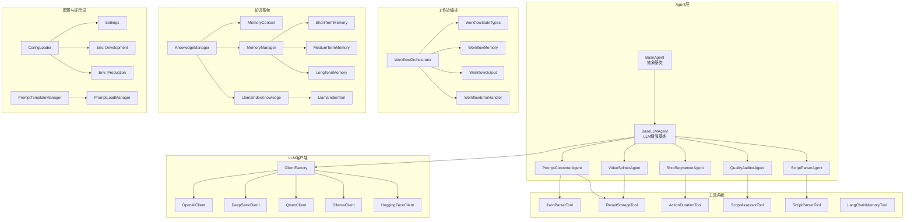
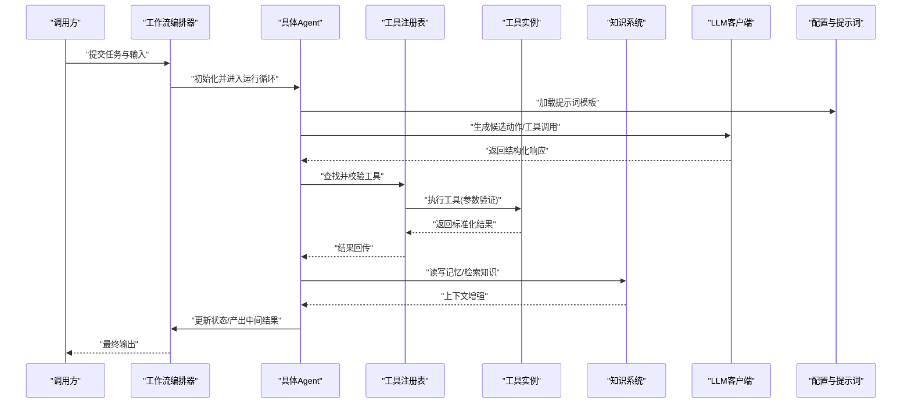
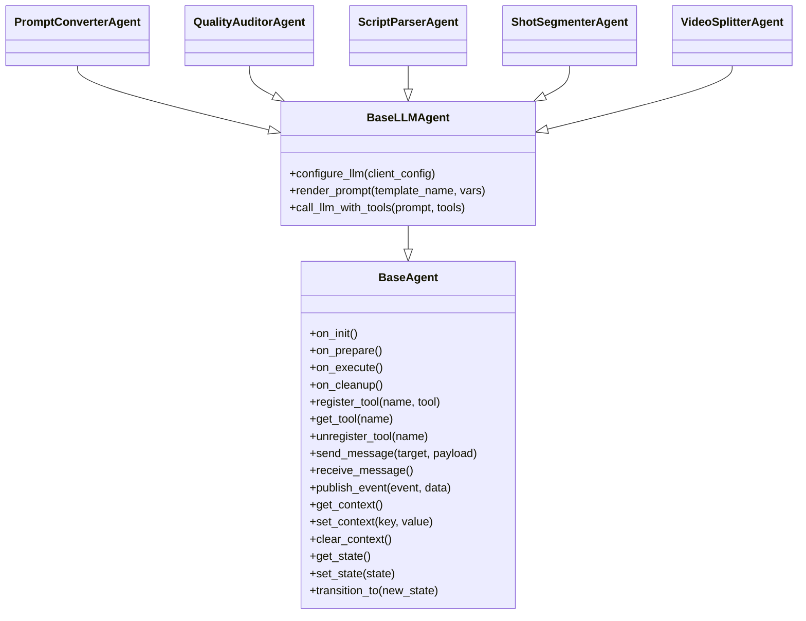
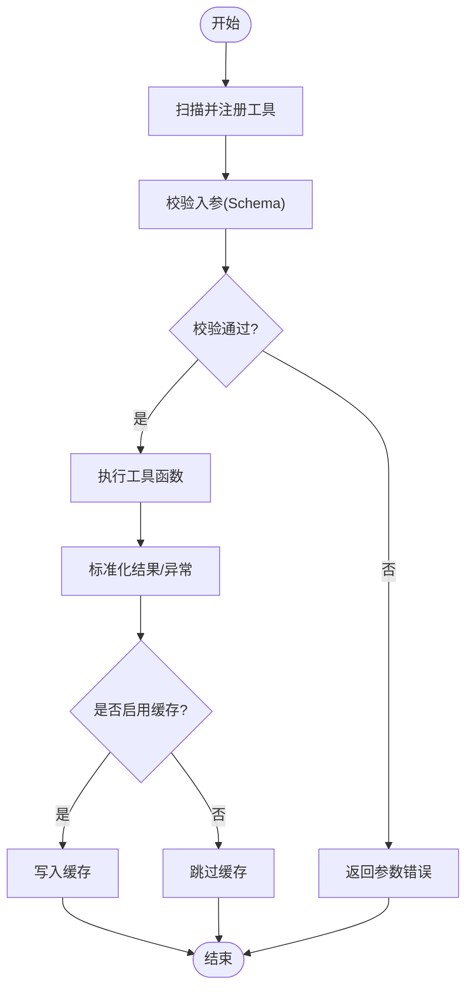
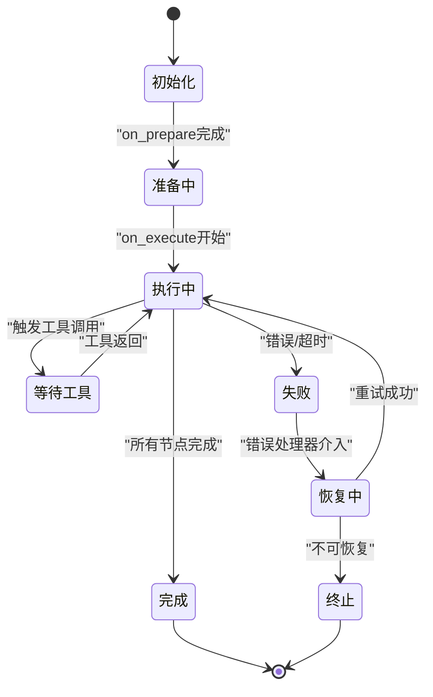
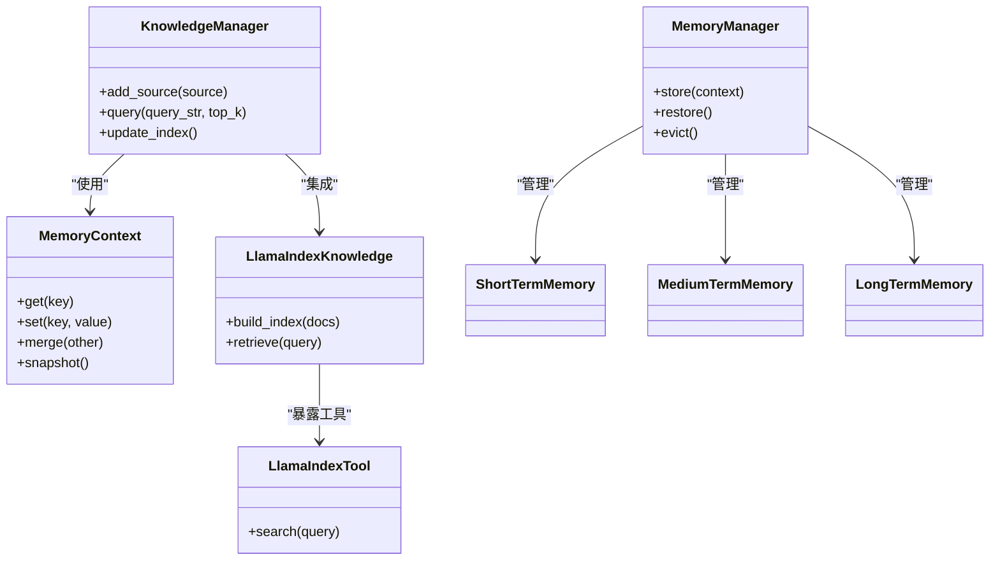
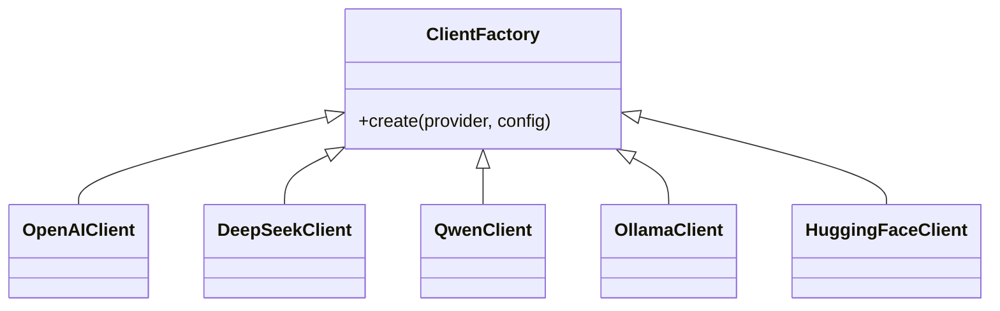
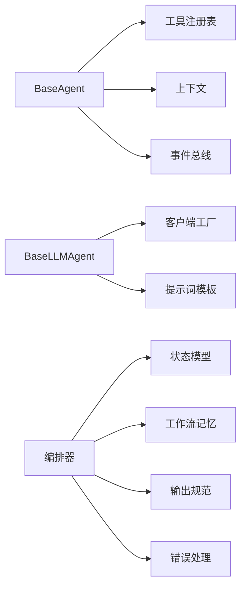

# 基础Agent设计

<cite>
**本文引用的文件**   
- [base_agent.py](file://src/penshot/neopen/agent/base_agent.py)
- [base_llm_agent.py](file://src/penshot/neopen/agent/base_llm_agent.py)
- [base_models.py](file://src/penshot/neopen/agent/base_models.py)
- [prompt_converter_agent.py](file://src/penshot/neopen/agent/prompt_converter_agent.py)
- [quality_auditor_agent.py](file://src/penshot/neopen/agent/quality_auditor_agent.py)
- [script_parser_agent.py](file://src/penshot/neopen/agent/script_parser_agent.py)
- [shot_segmenter_agent.py](file://src/penshot/neopen/agent/shot_segmenter_agent.py)
- [video_splitter_agent.py](file://src/penshot/neopen/agent/video_splitter_agent.py)
- [workflow_orchestrator.py](file://src/penshot/neopen/agent/workflow/workflow_orchestrator.py)
- [workflow_state_types.py](file://src/penshot/neopen/agent/workflow/workflow_state_types.py)
- [workflow_memory.py](file://src/penshot/neopen/agent/workflow/workflow_memory.py)
- [workflow_output.py](file://src/penshot/neopen/agent/workflow/workflow_output.py)
- [workflow_error_handler.py](file://src/penshot/neopen/agent/workflow/workflow_error_handler.py)
- [json_parser_tool.py](file://src/penshot/neopen/tools/json_parser_tool.py)
- [result_storage_tool.py](file://src/penshot/neopen/tools/result_storage_tool.py)
- [action_duration_tool.py](file://src/penshot/neopen/tools/action_duration_tool.py)
- [script_assessor_tool.py](file://src/penshot/neopen/tools/script_assessor_tool.py)
- [script_parser_tool.py](file://src/penshot/neopen/tools/script_parser_tool.py)
- [langchain_memory_tool.py](file://src/penshot/neopen/tools/langchain_memory_tool.py)
- [knowledge_manager.py](file://src/penshot/neopen/knowledge/knowledge_manager.py)
- [memory_context.py](file://src/penshot/neopen/knowledge/memory/memory_context.py)
- [memory_manager.py](file://src/penshot/neopen/knowledge/memory/memory_manager.py)
- [long_term_memory.py](file://src/penshot/neopen/knowledge/memory/long_term_memory.py)
- [medium_term_memory.py](file://src/penshot/neopen/knowledge/memory/medium_term_memory.py)
- [short_term_memory.py](file://src/penshot/neopen/knowledge/memory/short_term_memory.py)
- [llama_index_knowledge.py](file://src/penshot/neopen/knowledge/llamaIndex/llama_index_knowledge.py)
- [llama_index_tool.py](file://src/penshot/neopen/knowledge/llamaIndex/llama_index_tool.py)
- [client_factory.py](file://src/penshot/neopen/client/client_factory.py)
- [deepseek_client.py](file://src/penshot/neopen/client/deepseek_client.py)
- [huggingface_client.py](file://src/penshot/neopen/client/huggingface_client.py)
- [ollama_client.py](file://src/penshot/neopen/client/ollama_client.py)
- [openai_client.py](file://src/penshot/neopen/client/openai_client.py)
- [qwen_client.py](file://src/penshot/neopen/client/qwen_client.py)
- [config_loader.py](file://src/penshot/config/config_loader.py)
- [settings.yaml](file://src/penshot/config/settings.yaml)
- [development.yaml](file://src/penshot/config/env/development.yaml)
- [production.yaml](file://src/penshot/config/env/production.yaml)
- [prompt_template_manager.py](file://src/penshot/prompts/prompt_template_manager.py)
- [prompt_load_manager.py](file://src/penshot/prompts/prompt_load_manager.py)
</cite>

## 目录
1. [简介](#简介)
2. [项目结构](#项目结构)
3. [核心组件](#核心组件)
4. [架构总览](#架构总览)
5. [详细组件分析](#详细组件分析)
6. [依赖关系分析](#依赖关系分析)
7. [性能考量](#性能考量)
8. [故障排查指南](#故障排查指南)
9. [结论](#结论)
10. [附录](#附录)

## 简介
本文件聚焦于“基础Agent设计”，围绕BaseAgent抽象类的设计模式与核心接口展开，系统阐述Agent生命周期管理、工具注册机制、消息传递协议；详细说明初始化流程、状态管理机制、上下文环境设置；并深入解析工具系统的实现原理（工具发现、参数验证、执行结果处理）。最后提供Agent开发指南与最佳实践，帮助开发者快速构建可复用的Agent组件。

## 项目结构
本项目采用分层与领域驱动相结合的组织方式：
- Agent层：定义通用Agent抽象与具体Agent实现，封装生命周期、状态、上下文与工具调用。
- 工作流编排：通过Orchestrator协调多节点任务，管理状态机、记忆与输出。
- 工具系统：统一注册、发现、校验与执行工具，支持JSON解析、结果存储、脚本评估等。
- 知识系统：集成短期/中期/长期记忆与外部知识库检索。
- LLM客户端：多厂商LLM客户端工厂化接入。
- 配置与提示词：集中式配置加载与模板管理。

图表来源
- [base_agent.py:1-200](file://src/penshot/neopen/agent/base_agent.py#L1-L200)
- [base_llm_agent.py:1-200](file://src/penshot/neopen/agent/base_llm_agent.py#L1-L200)
- [workflow_orchestrator.py:1-200](file://src/penshot/neopen/agent/workflow/workflow_orchestrator.py#L1-L200)
- [workflow_state_types.py:1-200](file://src/penshot/neopen/agent/workflow/workflow_state_types.py#L1-L200)
- [workflow_memory.py:1-200](file://src/penshot/neopen/agent/workflow/workflow_memory.py#L1-L200)
- [workflow_output.py:1-200](file://src/penshot/neopen/agent/workflow/workflow_output.py#L1-L200)
- [workflow_error_handler.py:1-200](file://src/penshot/neopen/agent/workflow/workflow_error_handler.py#L1-L200)
- [json_parser_tool.py:1-200](file://src/penshot/neopen/tools/json_parser_tool.py#L1-L200)
- [result_storage_tool.py:1-200](file://src/penshot/neopen/tools/result_storage_tool.py#L1-L200)
- [action_duration_tool.py:1-200](file://src/penshot/neopen/tools/action_duration_tool.py#L1-L200)
- [script_assessor_tool.py:1-200](file://src/penshot/neopen/tools/script_assessor_tool.py#L1-L200)
- [script_parser_tool.py:1-200](file://src/penshot/neopen/tools/script_parser_tool.py#L1-L200)
- [langchain_memory_tool.py:1-200](file://src/penshot/neopen/tools/langchain_memory_tool.py#L1-L200)
- [knowledge_manager.py:1-200](file://src/penshot/neopen/knowledge/knowledge_manager.py#L1-L200)
- [memory_context.py:1-200](file://src/penshot/neopen/knowledge/memory/memory_context.py#L1-L200)
- [memory_manager.py:1-200](file://src/penshot/neopen/knowledge/memory/memory_manager.py#L1-L200)
- [long_term_memory.py:1-200](file://src/penshot/neopen/knowledge/memory/long_term_memory.py#L1-L200)
- [medium_term_memory.py:1-200](file://src/penshot/neopen/knowledge/memory/medium_term_memory.py#L1-L200)
- [short_term_memory.py:1-200](file://src/penshot/neopen/knowledge/memory/short_term_memory.py#L1-L200)
- [llama_index_knowledge.py:1-200](file://src/penshot/neopen/knowledge/llamaIndex/llama_index_knowledge.py#L1-L200)
- [llama_index_tool.py:1-200](file://src/penshot/neopen/knowledge/llamaIndex/llama_index_tool.py#L1-L200)
- [client_factory.py:1-200](file://src/penshot/neopen/client/client_factory.py#L1-L200)
- [openai_client.py:1-200](file://src/penshot/neopen/client/openai_client.py#L1-L200)
- [deepseek_client.py:1-200](file://src/penshot/neopen/client/deepseek_client.py#L1-L200)
- [qwen_client.py:1-200](file://src/penshot/neopen/client/qwen_client.py#L1-L200)
- [ollama_client.py:1-200](file://src/penshot/neopen/client/ollama_client.py#L1-L200)
- [huggingface_client.py:1-200](file://src/penshot/neopen/client/huggingface_client.py#L1-L200)
- [config_loader.py:1-200](file://src/penshot/config/config_loader.py#L1-L200)
- [settings.yaml:1-200](file://src/penshot/config/settings.yaml#L1-L200)
- [development.yaml:1-200](file://src/penshot/config/env/development.yaml#L1-L200)
- [production.yaml:1-200](file://src/penshot/config/env/production.yaml#L1-L200)
- [prompt_template_manager.py:1-200](file://src/penshot/prompts/prompt_template_manager.py#L1-L200)
- [prompt_load_manager.py:1-200](file://src/penshot/prompts/prompt_load_manager.py#L1-L200)

章节来源
- [base_agent.py:1-200](file://src/penshot/neopen/agent/base_agent.py#L1-L200)
- [base_llm_agent.py:1-200](file://src/penshot/neopen/agent/base_llm_agent.py#L1-L200)
- [workflow_orchestrator.py:1-200](file://src/penshot/neopen/agent/workflow/workflow_orchestrator.py#L1-L200)
- [client_factory.py:1-200](file://src/penshot/neopen/client/client_factory.py#L1-L200)
- [config_loader.py:1-200](file://src/penshot/config/config_loader.py#L1-L200)

## 核心组件
- BaseAgent抽象类：定义Agent通用能力，包括生命周期钩子、工具注册表、消息总线接口、上下文访问器、状态机入口。
- BaseLLMAgent：在BaseAgent基础上增加LLM客户端注入、提示词渲染、函数调用/工具调用的统一封装。
- 具体Agent：如PromptConverterAgent、QualityAuditorAgent、ScriptParserAgent、ShotSegmenterAgent、VideoSplitterAgent，分别面向不同业务域，复用基类能力。
- 工作流编排：Orchestrator负责节点调度、状态持久化、错误恢复与输出聚合。
- 工具系统：统一注册与发现，参数校验、执行与结果标准化。
- 知识系统：记忆上下文与多粒度记忆管理，结合外部知识库检索。
- LLM客户端：多厂商客户端工厂化接入，屏蔽差异。
- 配置与提示词：集中加载与环境切换，模板管理与动态渲染。

章节来源
- [base_agent.py:1-200](file://src/penshot/neopen/agent/base_agent.py#L1-L200)
- [base_llm_agent.py:1-200](file://src/penshot/neopen/agent/base_llm_agent.py#L1-L200)
- [prompt_converter_agent.py:1-200](file://src/penshot/neopen/agent/prompt_converter_agent.py#L1-L200)
- [quality_auditor_agent.py:1-200](file://src/penshot/neopen/agent/quality_auditor_agent.py#L1-L200)
- [script_parser_agent.py:1-200](file://src/penshot/neopen/agent/script_parser_agent.py#L1-L200)
- [shot_segmenter_agent.py:1-200](file://src/penshot/neopen/agent/shot_segmenter_agent.py#L1-L200)
- [video_splitter_agent.py:1-200](file://src/penshot/neopen/agent/video_splitter_agent.py#L1-L200)

## 架构总览
下图展示从请求到Agent执行、工具调用、知识检索与LLM交互的端到端流程。

图表来源
- [workflow_orchestrator.py:1-200](file://src/penshot/neopen/agent/workflow/workflow_orchestrator.py#L1-L200)
- [base_llm_agent.py:1-200](file://src/penshot/neopen/agent/base_llm_agent.py#L1-L200)
- [json_parser_tool.py:1-200](file://src/penshot/neopen/tools/json_parser_tool.py#L1-L200)
- [result_storage_tool.py:1-200](file://src/penshot/neopen/tools/result_storage_tool.py#L1-L200)
- [knowledge_manager.py:1-200](file://src/penshot/neopen/knowledge/knowledge_manager.py#L1-L200)
- [client_factory.py:1-200](file://src/penshot/neopen/client/client_factory.py#L1-L200)
- [prompt_template_manager.py:1-200](file://src/penshot/prompts/prompt_template_manager.py#L1-L200)

## 详细组件分析

### BaseAgent抽象类与核心接口
- 设计模式
  - 模板方法：定义Agent运行骨架（初始化→准备→执行→收尾），子类仅覆盖关键步骤。
  - 策略模式：工具注册表与执行策略解耦，便于扩展新工具。
  - 观察者模式：状态变更事件通知编排器与日志系统。
- 核心接口
  - 生命周期钩子：on_init、on_prepare、on_execute、on_cleanup。
  - 工具注册：register_tool、get_tool、unregister_tool。
  - 消息协议：send_message、receive_message、publish_event。
  - 上下文访问：get_context、set_context、clear_context。
  - 状态管理：get_state、set_state、transition_to。
- 复杂度与健壮性
  - 工具注册为O(1)查找；消息分发基于事件路由，避免强耦合。
  - 状态转换包含前置校验与后置副作用，保证一致性。

图表来源
- [base_agent.py:1-200](file://src/penshot/neopen/agent/base_agent.py#L1-L200)
- [base_llm_agent.py:1-200](file://src/penshot/neopen/agent/base_llm_agent.py#L1-L200)
- [prompt_converter_agent.py:1-200](file://src/penshot/neopen/agent/prompt_converter_agent.py#L1-L200)
- [quality_auditor_agent.py:1-200](file://src/penshot/neopen/agent/quality_auditor_agent.py#L1-L200)
- [script_parser_agent.py:1-200](file://src/penshot/neopen/agent/script_parser_agent.py#L1-L200)
- [shot_segmenter_agent.py:1-200](file://src/penshot/neopen/agent/shot_segmenter_agent.py#L1-L200)
- [video_splitter_agent.py:1-200](file://src/penshot/neopen/agent/video_splitter_agent.py#L1-L200)

章节来源
- [base_agent.py:1-200](file://src/penshot/neopen/agent/base_agent.py#L1-L200)
- [base_llm_agent.py:1-200](file://src/penshot/neopen/agent/base_llm_agent.py#L1-L200)

### 工具系统实现原理
- 工具发现
  - 通过注册表集中维护工具元数据（名称、描述、参数Schema、执行函数）。
  - 支持按命名空间或标签筛选，便于模块化组织。
- 参数验证
  - 基于Schema进行类型、必填项、范围校验，失败时返回结构化错误。
- 执行与结果处理
  - 统一包装异常，标准化返回格式（成功/失败、数据体、诊断信息）。
  - 可选缓存与幂等键，减少重复计算。

图表来源
- [json_parser_tool.py:1-200](file://src/penshot/neopen/tools/json_parser_tool.py#L1-L200)
- [result_storage_tool.py:1-200](file://src/penshot/neopen/tools/result_storage_tool.py#L1-L200)
- [action_duration_tool.py:1-200](file://src/penshot/neopen/tools/action_duration_tool.py#L1-L200)
- [script_assessor_tool.py:1-200](file://src/penshot/neopen/tools/script_assessor_tool.py#L1-L200)
- [script_parser_tool.py:1-200](file://src/penshot/neopen/tools/script_parser_tool.py#L1-L200)
- [langchain_memory_tool.py:1-200](file://src/penshot/neopen/tools/langchain_memory_tool.py#L1-L200)

章节来源
- [json_parser_tool.py:1-200](file://src/penshot/neopen/tools/json_parser_tool.py#L1-L200)
- [result_storage_tool.py:1-200](file://src/penshot/neopen/tools/result_storage_tool.py#L1-L200)
- [action_duration_tool.py:1-200](file://src/penshot/neopen/tools/action_duration_tool.py#L1-L200)
- [script_assessor_tool.py:1-200](file://src/penshot/neopen/tools/script_assessor_tool.py#L1-L200)
- [script_parser_tool.py:1-200](file://src/penshot/neopen/tools/script_parser_tool.py#L1-L200)
- [langchain_memory_tool.py:1-200](file://src/penshot/neopen/tools/langchain_memory_tool.py#L1-L200)

### 工作流编排与状态管理
- 编排器职责
  - 节点调度、依赖解析、重试与熔断、错误分类与恢复。
  - 状态持久化与检查点，支持中断恢复。
- 状态模型
  - 明确的状态枚举与迁移规则，禁止非法跳转。
  - 状态变更事件驱动日志与监控。
- 记忆与输出
  - 工作流级记忆用于跨节点共享上下文。
  - 输出规范化与版本兼容。

图表来源
- [workflow_orchestrator.py:1-200](file://src/penshot/neopen/agent/workflow/workflow_orchestrator.py#L1-L200)
- [workflow_state_types.py:1-200](file://src/penshot/neopen/agent/workflow/workflow_state_types.py#L1-L200)
- [workflow_memory.py:1-200](file://src/penshot/neopen/agent/workflow/workflow_memory.py#L1-L200)
- [workflow_output.py:1-200](file://src/penshot/neopen/agent/workflow/workflow_output.py#L1-L200)
- [workflow_error_handler.py:1-200](file://src/penshot/neopen/agent/workflow/workflow_error_handler.py#L1-L200)

章节来源
- [workflow_orchestrator.py:1-200](file://src/penshot/neopen/agent/workflow/workflow_orchestrator.py#L1-L200)
- [workflow_state_types.py:1-200](file://src/penshot/neopen/agent/workflow/workflow_state_types.py#L1-L200)
- [workflow_memory.py:1-200](file://src/penshot/neopen/agent/workflow/workflow_memory.py#L1-L200)
- [workflow_output.py:1-200](file://src/penshot/neopen/agent/workflow/workflow_output.py#L1-L200)
- [workflow_error_handler.py:1-200](file://src/penshot/neopen/agent/workflow/workflow_error_handler.py#L1-L200)

### 知识系统与上下文环境
- 记忆层次
  - 短期记忆：会话内高频上下文。
  - 中期记忆：任务相关片段与摘要。
  - 长期记忆：持久化知识与经验沉淀。
- 上下文管理
  - MemoryContext提供统一读写接口，支持过滤与合并。
  - MemoryManager负责生命周期与容量控制。
- 外部知识
  - LlamaIndex集成向量检索与重排，提升召回质量。
  - LlamaIndexTool将检索能力暴露为工具供Agent调用。

图表来源
- [knowledge_manager.py:1-200](file://src/penshot/neopen/knowledge/knowledge_manager.py#L1-L200)
- [memory_context.py:1-200](file://src/penshot/neopen/knowledge/memory/memory_context.py#L1-L200)
- [memory_manager.py:1-200](file://src/penshot/neopen/knowledge/memory/memory_manager.py#L1-L200)
- [short_term_memory.py:1-200](file://src/penshot/neopen/knowledge/memory/short_term_memory.py#L1-L200)
- [medium_term_memory.py:1-200](file://src/penshot/neopen/knowledge/memory/medium_term_memory.py#L1-L200)
- [long_term_memory.py:1-200](file://src/penshot/neopen/knowledge/memory/long_term_memory.py#L1-L200)
- [llama_index_knowledge.py:1-200](file://src/penshot/neopen/knowledge/llamaIndex/llama_index_knowledge.py#L1-L200)
- [llama_index_tool.py:1-200](file://src/penshot/neopen/knowledge/llamaIndex/llama_index_tool.py#L1-L200)

章节来源
- [knowledge_manager.py:1-200](file://src/penshot/neopen/knowledge/knowledge_manager.py#L1-L200)
- [memory_context.py:1-200](file://src/penshot/neopen/knowledge/memory/memory_context.py#L1-L200)
- [memory_manager.py:1-200](file://src/penshot/neopen/knowledge/memory/memory_manager.py#L1-L200)
- [short_term_memory.py:1-200](file://src/penshot/neopen/knowledge/memory/short_term_memory.py#L1-L200)
- [medium_term_memory.py:1-200](file://src/penshot/neopen/knowledge/memory/medium_term_memory.py#L1-L200)
- [long_term_memory.py:1-200](file://src/penshot/neopen/knowledge/memory/long_term_memory.py#L1-L200)
- [llama_index_knowledge.py:1-200](file://src/penshot/neopen/knowledge/llamaIndex/llama_index_knowledge.py#L1-L200)
- [llama_index_tool.py:1-200](file://src/penshot/neopen/knowledge/llamaIndex/llama_index_tool.py#L1-L200)

### LLM客户端与配置提示词
- 客户端工厂
  - 根据配置选择具体厂商实现，统一接口屏蔽差异。
- 配置与环境
  - settings.yaml集中定义默认值，development.yaml与production.yaml覆盖差异化配置。
  - ConfigLoader负责加载与合并。
- 提示词模板
  - PromptTemplateManager与PromptLoadManager协同，支持多语言与版本化。

图表来源
- [client_factory.py:1-200](file://src/penshot/neopen/client/client_factory.py#L1-L200)
- [openai_client.py:1-200](file://src/penshot/neopen/client/openai_client.py#L1-L200)
- [deepseek_client.py:1-200](file://src/penshot/neopen/client/deepseek_client.py#L1-L200)
- [qwen_client.py:1-200](file://src/penshot/neopen/client/qwen_client.py#L1-L200)
- [ollama_client.py:1-200](file://src/penshot/neopen/client/ollama_client.py#L1-L200)
- [huggingface_client.py:1-200](file://src/penshot/neopen/client/huggingface_client.py#L1-L200)
- [config_loader.py:1-200](file://src/penshot/config/config_loader.py#L1-L200)
- [settings.yaml:1-200](file://src/penshot/config/settings.yaml#L1-L200)
- [development.yaml:1-200](file://src/penshot/config/env/development.yaml#L1-L200)
- [production.yaml:1-200](file://src/penshot/config/env/production.yaml#L1-L200)
- [prompt_template_manager.py:1-200](file://src/penshot/prompts/prompt_template_manager.py#L1-L200)
- [prompt_load_manager.py:1-200](file://src/penshot/prompts/prompt_load_manager.py#L1-L200)

章节来源
- [client_factory.py:1-200](file://src/penshot/neopen/client/client_factory.py#L1-L200)
- [config_loader.py:1-200](file://src/penshot/config/config_loader.py#L1-L200)
- [settings.yaml:1-200](file://src/penshot/config/settings.yaml#L1-L200)
- [development.yaml:1-200](file://src/penshot/config/env/development.yaml#L1-L200)
- [production.yaml:1-200](file://src/penshot/config/env/production.yaml#L1-L200)
- [prompt_template_manager.py:1-200](file://src/penshot/prompts/prompt_template_manager.py#L1-L200)
- [prompt_load_manager.py:1-200](file://src/penshot/prompts/prompt_load_manager.py#L1-L200)

## 依赖关系分析
- 松耦合
  - Agent与工具通过注册表解耦；Agent与LLM通过工厂与统一接口解耦。
- 高内聚
  - 每个Agent专注单一业务目标，内部组合必要工具与知识。
- 潜在风险
  - 工具Schema变更需同步更新注册表与文档。
  - 状态迁移需严格测试，避免死锁或不可达状态。

图表来源
- [base_agent.py:1-200](file://src/penshot/neopen/agent/base_agent.py#L1-L200)
- [base_llm_agent.py:1-200](file://src/penshot/neopen/agent/base_llm_agent.py#L1-L200)
- [workflow_orchestrator.py:1-200](file://src/penshot/neopen/agent/workflow/workflow_orchestrator.py#L1-L200)
- [workflow_state_types.py:1-200](file://src/penshot/neopen/agent/workflow/workflow_state_types.py#L1-L200)
- [workflow_memory.py:1-200](file://src/penshot/neopen/agent/workflow/workflow_memory.py#L1-L200)
- [workflow_output.py:1-200](file://src/penshot/neopen/agent/workflow/workflow_output.py#L1-L200)
- [workflow_error_handler.py:1-200](file://src/penshot/neopen/agent/workflow/workflow_error_handler.py#L1-L200)
- [client_factory.py:1-200](file://src/penshot/neopen/client/client_factory.py#L1-L200)
- [prompt_template_manager.py:1-200](file://src/penshot/prompts/prompt_template_manager.py#L1-L200)

章节来源
- [base_agent.py:1-200](file://src/penshot/neopen/agent/base_agent.py#L1-L200)
- [base_llm_agent.py:1-200](file://src/penshot/neopen/agent/base_llm_agent.py#L1-L200)
- [workflow_orchestrator.py:1-200](file://src/penshot/neopen/agent/workflow/workflow_orchestrator.py#L1-L200)

## 性能考量
- 工具侧
  - 对耗时操作启用缓存与去重键，降低重复开销。
  - 参数校验尽早失败，避免无效计算。
- LLM侧
  - 合理设置最大令牌数与温度，平衡质量与成本。
  - 批量请求与连接池复用，减少握手开销。
- 工作流侧
  - 并行节点执行与超时熔断，提高吞吐。
  - 状态压缩与增量持久化，降低IO压力。
- 知识侧
  - 索引按需重建与增量更新，避免全量重建。
  - 检索Top-K与重排策略调优，提升命中率。

[本节为通用指导，不直接分析具体文件]

## 故障排查指南
- 常见问题
  - 工具未找到：检查注册表命名与导入路径。
  - 参数校验失败：核对Schema与入参类型。
  - LLM调用失败：确认密钥、配额与网络连通性。
  - 状态卡住：查看状态迁移日志与错误处理器输出。
- 定位手段
  - 开启调试日志，记录工具调用链路与参数。
  - 打印状态快照与工作流检查点。
  - 隔离问题工具，最小化复现用例。

章节来源
- [workflow_error_handler.py:1-200](file://src/penshot/neopen/agent/workflow/workflow_error_handler.py#L1-L200)
- [workflow_memory.py:1-200](file://src/penshot/neopen/agent/workflow/workflow_memory.py#L1-L200)
- [workflow_output.py:1-200](file://src/penshot/neopen/agent/workflow/workflow_output.py#L1-L200)

## 结论
BaseAgent以模板方法与策略模式为核心，配合统一的工具注册与消息协议，形成可扩展的Agent基础设施。通过工作流编排、知识系统与多厂商LLM客户端的协作，可实现复杂任务的稳定执行。遵循本文的开发指南与最佳实践，可高效构建高质量、可复用的Agent组件。

[本节为总结，不直接分析具体文件]

## 附录

### Agent开发指南（继承BaseAgent）
- 步骤
  - 继承BaseAgent或BaseLLMAgent，按需覆盖生命周期钩子。
  - 在on_prepare中注册所需工具，确保Schema完整。
  - 在on_execute中编排逻辑，必要时调用LLM与工具。
  - 在on_cleanup中释放资源与持久化状态。
- 示例参考路径
  - [prompt_converter_agent.py:1-200](file://src/penshot/neopen/agent/prompt_converter_agent.py#L1-L200)
  - [quality_auditor_agent.py:1-200](file://src/penshot/neopen/agent/quality_auditor_agent.py#L1-L200)
  - [script_parser_agent.py:1-200](file://src/penshot/neopen/agent/script_parser_agent.py#L1-L200)
  - [shot_segmenter_agent.py:1-200](file://src/penshot/neopen/agent/shot_segmenter_agent.py#L1-L200)
  - [video_splitter_agent.py:1-200](file://src/penshot/neopen/agent/video_splitter_agent.py#L1-L200)

章节来源
- [prompt_converter_agent.py:1-200](file://src/penshot/neopen/agent/prompt_converter_agent.py#L1-L200)
- [quality_auditor_agent.py:1-200](file://src/penshot/neopen/agent/quality_auditor_agent.py#L1-L200)
- [script_parser_agent.py:1-200](file://src/penshot/neopen/agent/script_parser_agent.py#L1-L200)
- [shot_segmenter_agent.py:1-200](file://src/penshot/neopen/agent/shot_segmenter_agent.py#L1-L200)
- [video_splitter_agent.py:1-200](file://src/penshot/neopen/agent/video_splitter_agent.py#L1-L200)

### 工具注册与使用最佳实践
- 命名规范：模块_功能_工具，保持唯一性与可读性。
- Schema先行：先定义参数约束，再实现执行逻辑。
- 幂等设计：为可重复执行的工具提供幂等键。
- 错误语义：区分参数错误、运行时错误与上游服务错误。

章节来源
- [json_parser_tool.py:1-200](file://src/penshot/neopen/tools/json_parser_tool.py#L1-L200)
- [result_storage_tool.py:1-200](file://src/penshot/neopen/tools/result_storage_tool.py#L1-L200)
- [action_duration_tool.py:1-200](file://src/penshot/neopen/tools/action_duration_tool.py#L1-L200)
- [script_assessor_tool.py:1-200](file://src/penshot/neopen/tools/script_assessor_tool.py#L1-L200)
- [script_parser_tool.py:1-200](file://src/penshot/neopen/tools/script_parser_tool.py#L1-L200)
- [langchain_memory_tool.py:1-200](file://src/penshot/neopen/tools/langchain_memory_tool.py#L1-L200)

### 配置与环境切换建议
- 使用settings.yaml定义默认值，通过环境变量或配置文件覆盖。
- 开发环境与生产环境分离，避免敏感信息泄露。
- 提示词模板按版本管理，确保向后兼容。

章节来源
- [config_loader.py:1-200](file://src/penshot/config/config_loader.py#L1-L200)
- [settings.yaml:1-200](file://src/penshot/config/settings.yaml#L1-L200)
- [development.yaml:1-200](file://src/penshot/config/env/development.yaml#L1-L200)
- [production.yaml:1-200](file://src/penshot/config/env/production.yaml#L1-L200)
- [prompt_template_manager.py:1-200](file://src/penshot/prompts/prompt_template_manager.py#L1-L200)
- [prompt_load_manager.py:1-200](file://src/penshot/prompts/prompt_load_manager.py#L1-L200)