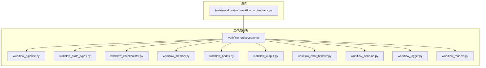
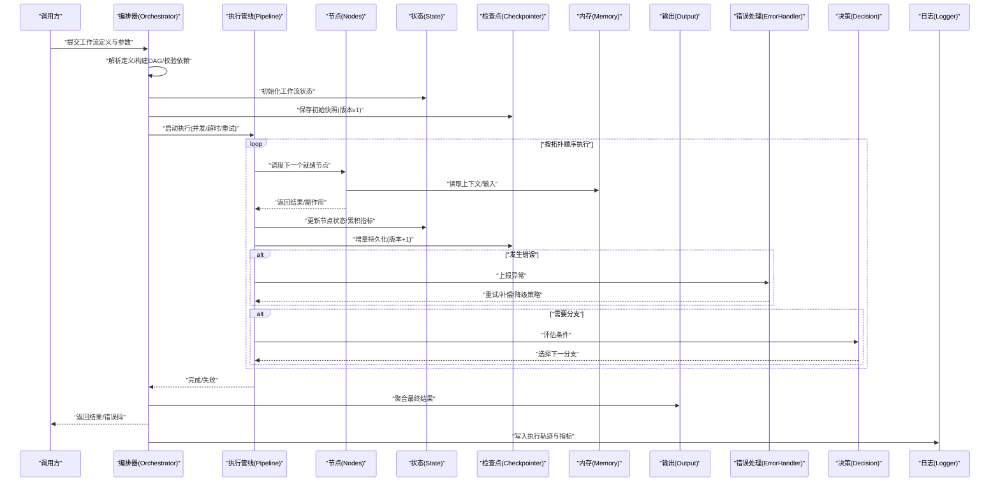
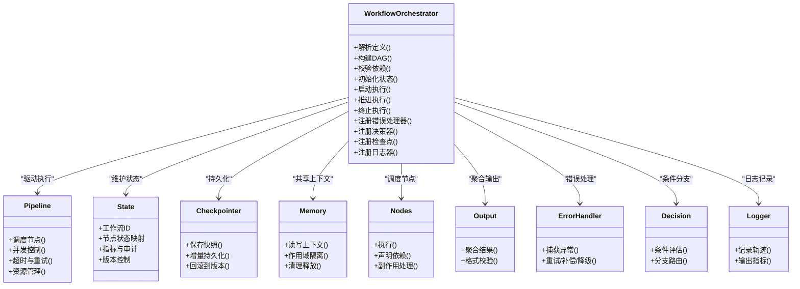
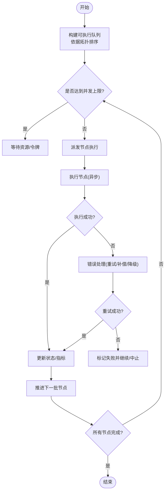
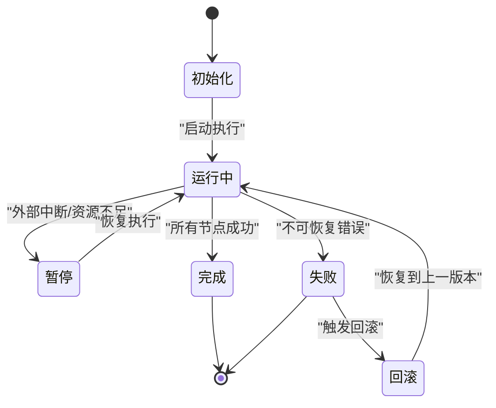
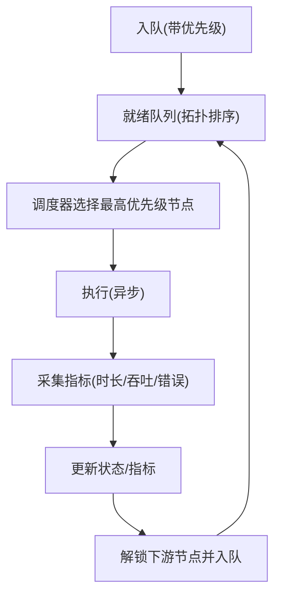
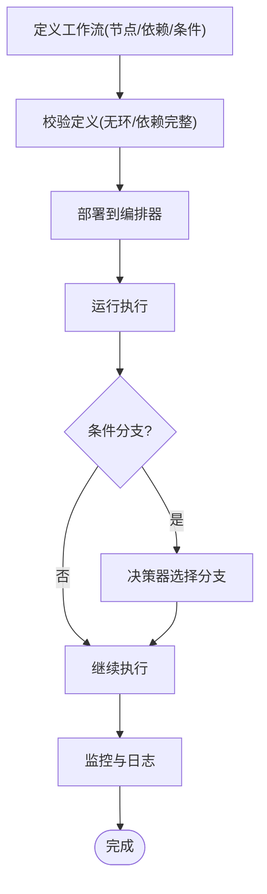
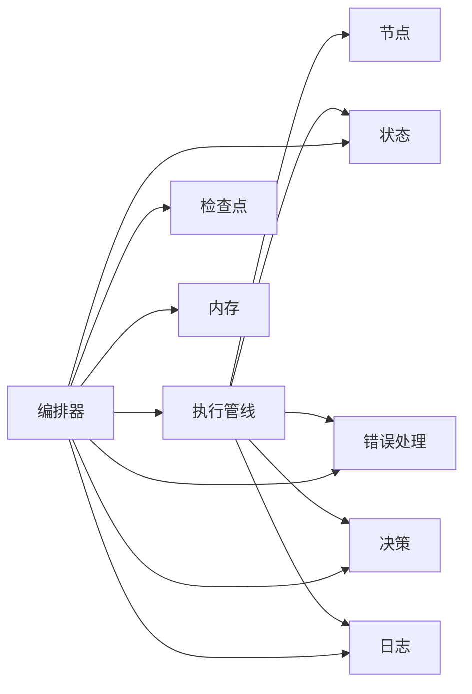

# 工作流系统架构

<cite>
**本文引用的文件**   
- [workflow_orchestrator.py](file://src/penshot/neopen/agent/workflow/workflow_orchestrator.py)
- [workflow_pipeline.py](file://src/penshot/neopen/agent/workflow/workflow_pipeline.py)
- [workflow_state_types.py](file://src/penshot/neopen/agent/workflow/workflow_state_types.py)
- [workflow_checkpointer.py](file://src/penshot/neopen/agent/workflow/workflow_checkpointer.py)
- [workflow_memory.py](file://src/penshot/neopen/agent/workflow/workflow_memory.py)
- [workflow_nodes.py](file://src/penshot/neopen/agent/workflow/workflow_nodes.py)
- [workflow_output.py](file://src/penshot/neopen/agent/workflow/workflow_output.py)
- [workflow_error_handler.py](file://src/penshot/neopen/agent/workflow/workflow_error_handler.py)
- [workflow_decision.py](file://src/penshot/neopen/agent/workflow/workflow_decision.py)
- [workflow_logger.py](file://src/penshot/neopen/agent/workflow/workflow_logger.py)
- [workflow_models.py](file://src/penshot/neopen/agent/workflow/workflow_models.py)
- [test_workflow_orchestrator.py](file://tests/workflow/test_workflow_orchestrator.py)
</cite>

## 目录
1. [简介](#简介)
2. [项目结构](#项目结构)
3. [核心组件](#核心组件)
4. [架构总览](#架构总览)
5. [详细组件分析](#详细组件分析)
6. [依赖关系分析](#依赖关系分析)
7. [性能考量](#性能考量)
8. [故障排查指南](#故障排查指南)
9. [结论](#结论)
10. [附录](#附录)

## 简介
本文件面向工作流系统的架构与实现，聚焦以下目标：
- 深入解释 WorkflowOrchestrator 的设计原理：工作流定义、节点编排、依赖管理。
- 详细说明 Pipeline 执行机制：异步处理、并发控制、资源管理。
- 阐述状态管理系统：状态持久化、回滚机制、版本控制。
- 解释任务调度与监控：任务队列、优先级管理、性能监控。
- 提供定制与扩展指南：自定义节点开发、条件分支配置、错误处理策略。
- 通过流程图与时序图说明关键交互过程。

## 项目结构
工作流相关代码集中在 src/penshot/neopen/agent/workflow 目录下，围绕 Orchestrator（编排器）、Pipeline（执行管线）、State（状态）、Checkpointer（检查点）、Memory（内存上下文）、Nodes（节点集合）、Output（输出）、Error（错误处理）、Decision（决策）、Logger（日志）等模块组织。测试位于 tests/workflow 下，用于验证编排器的行为。

图表来源
- [workflow_orchestrator.py](file://src/penshot/neopen/agent/workflow/workflow_orchestrator.py)
- [workflow_pipeline.py](file://src/penshot/neopen/agent/workflow/workflow_pipeline.py)
- [workflow_state_types.py](file://src/penshot/neopen/agent/workflow/workflow_state_types.py)
- [workflow_checkpointer.py](file://src/penshot/neopen/agent/workflow/workflow_checkpointer.py)
- [workflow_memory.py](file://src/penshot/neopen/agent/workflow/workflow_memory.py)
- [workflow_nodes.py](file://src/penshot/neopen/agent/workflow/workflow_nodes.py)
- [workflow_output.py](file://src/penshot/neopen/agent/workflow/workflow_output.py)
- [workflow_error_handler.py](file://src/penshot/neopen/agent/workflow/workflow_error_handler.py)
- [workflow_decision.py](file://src/penshot/neopen/agent/workflow/workflow_decision.py)
- [workflow_logger.py](file://src/penshot/neopen/agent/workflow/workflow_logger.py)
- [workflow_models.py](file://src/penshot/neopen/agent/workflow/workflow_models.py)
- [test_workflow_orchestrator.py](file://tests/workflow/test_workflow_orchestrator.py)

章节来源
- [workflow_orchestrator.py](file://src/penshot/neopen/agent/workflow/workflow_orchestrator.py)
- [workflow_pipeline.py](file://src/penshot/neopen/agent/workflow/workflow_pipeline.py)
- [workflow_state_types.py](file://src/penshot/neopen/agent/workflow/workflow_state_types.py)
- [workflow_checkpointer.py](file://src/penshot/neopen/agent/workflow/workflow_checkpointer.py)
- [workflow_memory.py](file://src/penshot/neopen/agent/workflow/workflow_memory.py)
- [workflow_nodes.py](file://src/penshot/neopen/agent/workflow/workflow_nodes.py)
- [workflow_output.py](file://src/penshot/neopen/agent/workflow/workflow_output.py)
- [workflow_error_handler.py](file://src/penshot/neopen/agent/workflow/workflow_error_handler.py)
- [workflow_decision.py](file://src/penshot/neopen/agent/workflow/workflow_decision.py)
- [workflow_logger.py](file://src/penshot/neopen/agent/workflow/workflow_logger.py)
- [workflow_models.py](file://src/penshot/neopen/agent/workflow/workflow_models.py)
- [test_workflow_orchestrator.py](file://tests/workflow/test_workflow_orchestrator.py)

## 核心组件
- 编排器（WorkflowOrchestrator）：负责解析工作流定义、构建有向无环图（DAG）、调度节点执行、维护运行期状态、协调错误与恢复。
- 执行管线（Pipeline）：封装异步执行、并发控制、资源池、超时与重试策略，驱动 DAG 的拓扑排序与并行执行。
- 状态类型（State Types）：定义工作流实例的状态模型、字段语义与不变式约束。
- 检查点（Checkpointer）：提供状态快照、增量持久化、版本管理与回滚能力。
- 内存上下文（Memory）：在单次或跨次执行中共享数据，支持读写隔离与清理。
- 节点（Nodes）：可插拔的任务单元，定义输入输出契约、副作用与依赖声明。
- 输出（Output）：统一收集与格式化最终结果，支持多源聚合与校验。
- 错误处理（Error Handler）：捕获异常、分类错误、触发重试/补偿/降级策略。
- 决策（Decision）：基于当前状态与规则进行分支选择与路由。
- 日志（Logger）：结构化记录执行轨迹、指标与审计信息。
- 模型（Models）：工作流定义、节点元数据、依赖关系等数据结构。

章节来源
- [workflow_orchestrator.py](file://src/penshot/neopen/agent/workflow/workflow_orchestrator.py)
- [workflow_pipeline.py](file://src/penshot/neopen/agent/workflow/workflow_pipeline.py)
- [workflow_state_types.py](file://src/penshot/neopen/agent/workflow/workflow_state_types.py)
- [workflow_checkpointer.py](file://src/penshot/neopen/agent/workflow/workflow_checkpointer.py)
- [workflow_memory.py](file://src/penshot/neopen/agent/workflow/workflow_memory.py)
- [workflow_nodes.py](file://src/penshot/neopen/agent/workflow/workflow_nodes.py)
- [workflow_output.py](file://src/penshot/neopen/agent/workflow/workflow_output.py)
- [workflow_error_handler.py](file://src/penshot/neopen/agent/workflow/workflow_error_handler.py)
- [workflow_decision.py](file://src/penshot/neopen/agent/workflow/workflow_decision.py)
- [workflow_logger.py](file://src/penshot/neopen/agent/workflow/workflow_logger.py)
- [workflow_models.py](file://src/penshot/neopen/agent/workflow/workflow_models.py)

## 架构总览
下图展示了工作流从定义到执行的端到端流程，包括编排、调度、执行、状态持久化与输出聚合。

图表来源
- [workflow_orchestrator.py](file://src/penshot/neopen/agent/workflow/workflow_orchestrator.py)
- [workflow_pipeline.py](file://src/penshot/neopen/agent/workflow/workflow_pipeline.py)
- [workflow_state_types.py](file://src/penshot/neopen/agent/workflow/workflow_state_types.py)
- [workflow_checkpointer.py](file://src/penshot/neopen/agent/workflow/workflow_checkpointer.py)
- [workflow_memory.py](file://src/penshot/neopen/agent/workflow/workflow_memory.py)
- [workflow_nodes.py](file://src/penshot/neopen/agent/workflow/workflow_nodes.py)
- [workflow_output.py](file://src/penshot/neopen/agent/workflow/workflow_output.py)
- [workflow_error_handler.py](file://src/penshot/neopen/agent/workflow/workflow_error_handler.py)
- [workflow_decision.py](file://src/penshot/neopen/agent/workflow/workflow_decision.py)
- [workflow_logger.py](file://src/penshot/neopen/agent/workflow/workflow_logger.py)

## 详细组件分析

### 编排器（WorkflowOrchestrator）设计
- 职责
  - 解析工作流定义（节点、边、条件、策略）。
  - 构建并校验 DAG，确保无环与依赖完整。
  - 维护运行期状态，协调 Pipeline 的执行生命周期。
  - 集成错误处理、决策分支、检查点与日志。
- 关键概念
  - 工作流定义：包含节点列表、依赖关系、执行策略（并发度、超时、重试）。
  - 节点编排：基于拓扑排序确定执行顺序，支持并行批次。
  - 依赖管理：显式声明上游节点输出作为下游输入，保证数据一致性。
- 典型流程
  - 初始化：加载定义、创建状态、生成初始检查点。
  - 调度：将可执行节点加入执行队列，等待资源与锁。
  - 推进：节点完成后更新状态，触发后续节点解锁。
  - 终止：所有节点完成或不可恢复错误时结束。

图表来源
- [workflow_orchestrator.py](file://src/penshot/neopen/agent/workflow/workflow_orchestrator.py)
- [workflow_pipeline.py](file://src/penshot/neopen/agent/workflow/workflow_pipeline.py)
- [workflow_state_types.py](file://src/penshot/neopen/agent/workflow/workflow_state_types.py)
- [workflow_checkpointer.py](file://src/penshot/neopen/agent/workflow/workflow_checkpointer.py)
- [workflow_memory.py](file://src/penshot/neopen/agent/workflow/workflow_memory.py)
- [workflow_nodes.py](file://src/penshot/neopen/agent/workflow/workflow_nodes.py)
- [workflow_output.py](file://src/penshot/neopen/agent/workflow/workflow_output.py)
- [workflow_error_handler.py](file://src/penshot/neopen/agent/workflow/workflow_error_handler.py)
- [workflow_decision.py](file://src/penshot/neopen/agent/workflow/workflow_decision.py)
- [workflow_logger.py](file://src/penshot/neopen/agent/workflow/workflow_logger.py)

章节来源
- [workflow_orchestrator.py](file://src/penshot/neopen/agent/workflow/workflow_orchestrator.py)
- [workflow_models.py](file://src/penshot/neopen/agent/workflow/workflow_models.py)

### 执行管线（Pipeline）机制
- 异步处理
  - 使用协程/线程池驱动节点执行，避免阻塞主循环。
  - 支持超时控制与取消信号，防止长时间占用资源。
- 并发控制
  - 基于令牌桶或信号量限制最大并发度。
  - 按拓扑层级分批执行，确保依赖满足后再推进。
- 资源管理
  - 为每个节点分配独立上下文，避免共享状态污染。
  - 执行后自动释放临时资源，清理内存引用。
- 重试与幂等
  - 对可重试错误进行指数退避重试。
  - 要求节点实现幂等性，避免重复执行导致副作用。

图表来源
- [workflow_pipeline.py](file://src/penshot/neopen/agent/workflow/workflow_pipeline.py)
- [workflow_state_types.py](file://src/penshot/neopen/agent/workflow/workflow_state_types.py)
- [workflow_error_handler.py](file://src/penshot/neopen/agent/workflow/workflow_error_handler.py)

章节来源
- [workflow_pipeline.py](file://src/penshot/neopen/agent/workflow/workflow_pipeline.py)

### 状态管理系统
- 状态模型
  - 工作流级状态：ID、版本、整体进度、指标与审计信息。
  - 节点级状态：输入/输出引用、执行结果、错误信息、耗时。
- 持久化与回滚
  - 检查点保存全量快照与增量差异，支持快速恢复。
  - 版本控制允许回滚到指定版本，保障可观测性与可重现性。
- 一致性
  - 原子更新：状态变更与检查点写入在同一事务内完成。
  - 冲突解决：并发更新采用乐观锁或版本号比较。

图表来源
- [workflow_state_types.py](file://src/penshot/neopen/agent/workflow/workflow_state_types.py)
- [workflow_checkpointer.py](file://src/penshot/neopen/agent/workflow/workflow_checkpointer.py)

章节来源
- [workflow_state_types.py](file://src/penshot/neopen/agent/workflow/workflow_state_types.py)
- [workflow_checkpointer.py](file://src/penshot/neopen/agent/workflow/workflow_checkpointer.py)

### 任务调度与监控
- 任务队列
  - 基于拓扑排序的优先级队列，优先调度入度为 0 的节点。
  - 支持动态插入与取消，适应运行时变化。
- 优先级管理
  - 根据节点权重、SLA 或用户指定优先级调整调度顺序。
  - 高优先级节点可抢占低优先级资源（需幂等保障）。
- 性能监控
  - 记录节点执行时长、吞吐、错误率与资源占用。
  - 暴露指标接口供外部监控系统采集。

图表来源
- [workflow_pipeline.py](file://src/penshot/neopen/agent/workflow/workflow_pipeline.py)
- [workflow_logger.py](file://src/penshot/neopen/agent/workflow/workflow_logger.py)

章节来源
- [workflow_pipeline.py](file://src/penshot/neopen/agent/workflow/workflow_pipeline.py)
- [workflow_logger.py](file://src/penshot/neopen/agent/workflow/workflow_logger.py)

### 定制与扩展指南
- 自定义节点开发
  - 遵循节点契约：声明输入/输出、依赖、副作用与重试策略。
  - 实现幂等执行：同一输入多次执行应产生一致结果。
  - 使用内存上下文传递中间数据，避免全局变量。
- 条件分支配置
  - 在定义中声明条件表达式与分支路径。
  - 决策器评估当前状态与输入，选择下一节点集。
- 错误处理策略
  - 细粒度错误分类：网络、解析、业务逻辑、资源不足。
  - 组合策略：重试、补偿、降级、告警。
  - 错误上报至日志与监控系统，便于定位与复盘。

图表来源
- [workflow_models.py](file://src/penshot/neopen/agent/workflow/workflow_models.py)
- [workflow_decision.py](file://src/penshot/neopen/agent/workflow/workflow_decision.py)
- [workflow_error_handler.py](file://src/penshot/neopen/agent/workflow/workflow_error_handler.py)
- [workflow_logger.py](file://src/penshot/neopen/agent/workflow/workflow_logger.py)

章节来源
- [workflow_nodes.py](file://src/penshot/neopen/agent/workflow/workflow_nodes.py)
- [workflow_decision.py](file://src/penshot/neopen/agent/workflow/workflow_decision.py)
- [workflow_error_handler.py](file://src/penshot/neopen/agent/workflow/workflow_error_handler.py)
- [workflow_logger.py](file://src/penshot/neopen/agent/workflow/workflow_logger.py)

## 依赖关系分析
- 耦合与内聚
  - 编排器对外暴露最小接口，内部依赖各子系统，保持高内聚。
  - 节点与管线松耦合，通过标准契约交互，易于替换与扩展。
- 直接/间接依赖
  - 编排器直接依赖管线、状态、检查点、内存、错误处理、决策、日志。
  - 管线间接依赖节点与状态，通过事件驱动推进。
- 外部集成点
  - 检查点可能对接存储后端（本地/远程），需抽象接口以适配不同介质。
  - 日志与监控可接入第三方系统（如 Prometheus、ELK）。

图表来源
- [workflow_orchestrator.py](file://src/penshot/neopen/agent/workflow/workflow_orchestrator.py)
- [workflow_pipeline.py](file://src/penshot/neopen/agent/workflow/workflow_pipeline.py)
- [workflow_state_types.py](file://src/penshot/neopen/agent/workflow/workflow_state_types.py)
- [workflow_checkpointer.py](file://src/penshot/neopen/agent/workflow/workflow_checkpointer.py)
- [workflow_memory.py](file://src/penshot/neopen/agent/workflow/workflow_memory.py)
- [workflow_nodes.py](file://src/penshot/neopen/agent/workflow/workflow_nodes.py)
- [workflow_error_handler.py](file://src/penshot/neopen/agent/workflow/workflow_error_handler.py)
- [workflow_decision.py](file://src/penshot/neopen/agent/workflow/workflow_decision.py)
- [workflow_logger.py](file://src/penshot/neopen/agent/workflow/workflow_logger.py)

章节来源
- [workflow_orchestrator.py](file://src/penshot/neopen/agent/workflow/workflow_orchestrator.py)
- [workflow_pipeline.py](file://src/penshot/neopen/agent/workflow/workflow_pipeline.py)

## 性能考量
- 并发度调优
  - 根据 CPU/IO 特性设置合适的并发上限，避免过度竞争。
  - 对 IO 密集型节点提高并发，CPU 密集型节点适度降低。
- 超时与重试
  - 合理设置节点超时阈值，结合指数退避减少雪崩风险。
  - 对幂等节点启用重试，非幂等节点需谨慎。
- 资源隔离
  - 为不同节点分配独立上下文与资源池，避免相互影响。
  - 及时释放大对象引用，降低内存峰值。
- 监控与可观测性
  - 采集关键指标（延迟、吞吐、错误率、资源占用）。
  - 建立告警规则，及时发现性能退化与异常。

[本节为通用指导，不直接分析具体文件]

## 故障排查指南
- 常见问题
  - 死锁与饥饿：检查依赖环与优先级策略，确保拓扑有序与公平调度。
  - 资源泄漏：确认节点执行后清理上下文与大对象引用。
  - 状态不一致：核对检查点版本与状态更新的事务性。
- 诊断步骤
  - 查看日志轨迹，定位失败节点与错误类型。
  - 检查状态快照，对比前后版本差异。
  - 复现实例，缩小范围至特定节点或输入。
- 恢复策略
  - 使用检查点回滚到稳定版本。
  - 针对可重试错误进行有限次数重试。
  - 对不可恢复错误进行补偿或降级，保证系统可用性。

章节来源
- [workflow_error_handler.py](file://src/penshot/neopen/agent/workflow/workflow_error_handler.py)
- [workflow_checkpointer.py](file://src/penshot/neopen/agent/workflow/workflow_checkpointer.py)
- [workflow_logger.py](file://src/penshot/neopen/agent/workflow/workflow_logger.py)

## 结论
该工作流系统通过清晰的编排器与管线分离、完善的狀態管理与检查点机制、灵活的错误处理与决策分支，以及全面的监控与日志体系，实现了高可靠、可扩展、可观测的工作流执行环境。建议在生产环境中结合业务特征调优并发与超时策略，完善指标与告警，持续优化节点幂等性与资源管理。

[本节为总结，不直接分析具体文件]

## 附录
- 参考测试用例
  - 编排器行为验证：覆盖正常执行、错误分支、回滚与恢复场景。
  - 建议补充边界条件测试：空定义、单节点、复杂分支与深度依赖。

章节来源
- [test_workflow_orchestrator.py](file://tests/workflow/test_workflow_orchestrator.py)