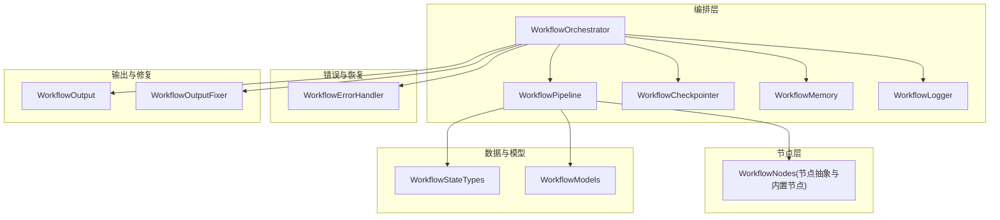
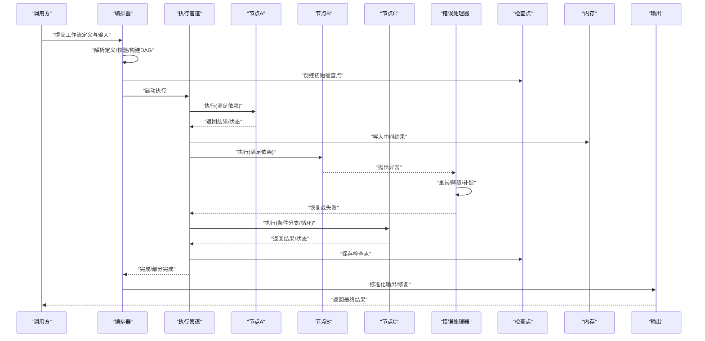
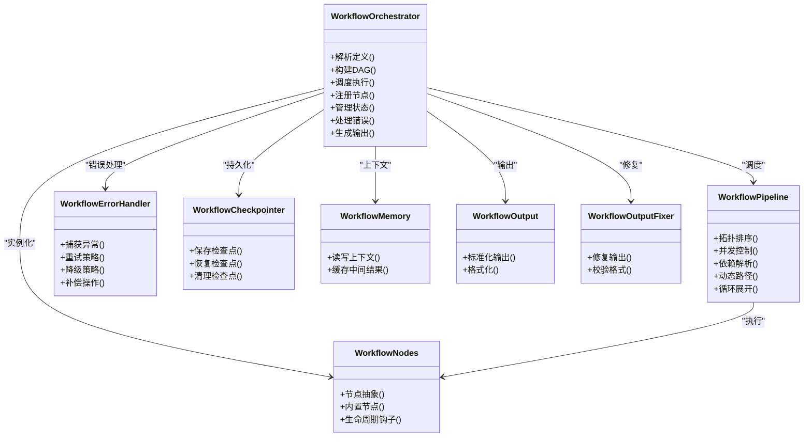
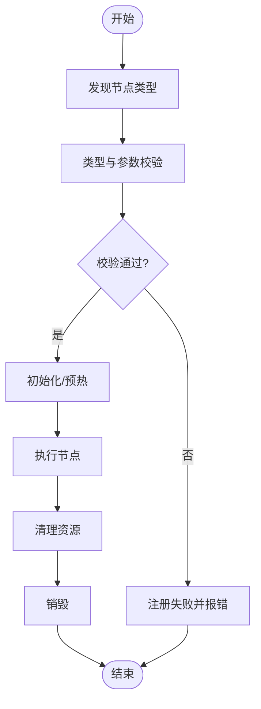
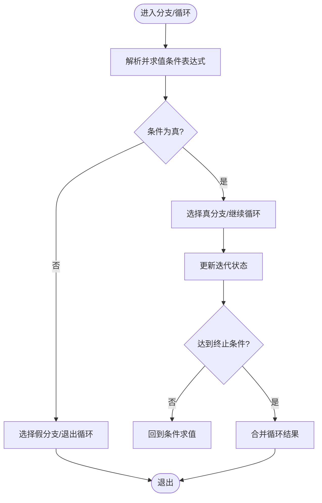
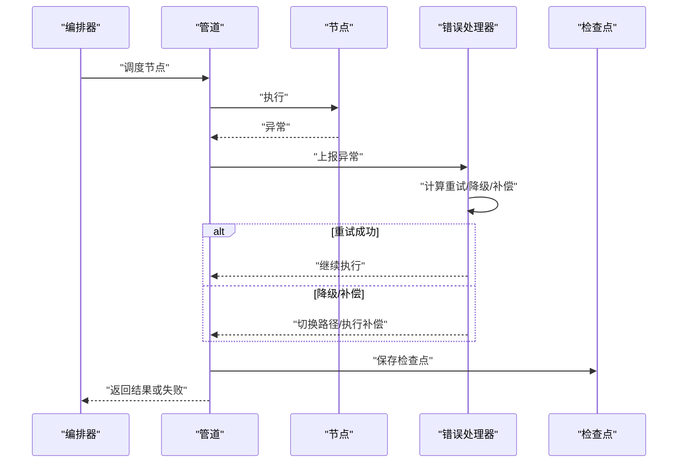
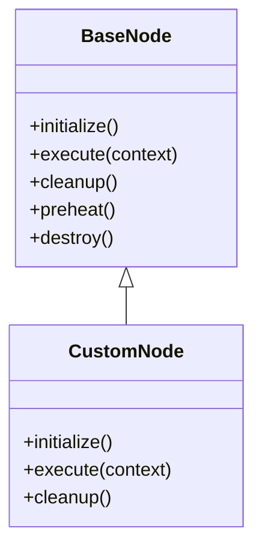
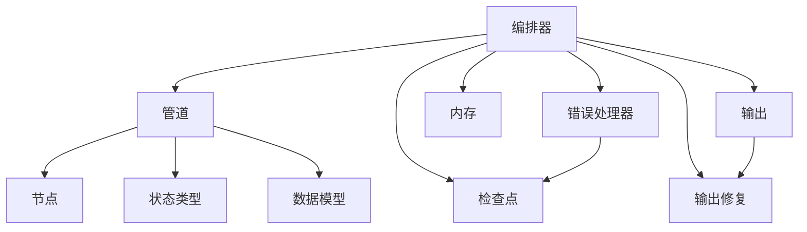

# 工作流编排器

<cite>
**本文引用的文件**   
- [workflow_orchestrator.py](file://src/penshot/neopen/agent/workflow/workflow_orchestrator.py)
- [workflow_nodes.py](file://src/penshot/neopen/agent/workflow/workflow_nodes.py)
- [workflow_pipeline.py](file://src/penshot/neopen/agent/workflow/workflow_pipeline.py)
- [workflow_state_types.py](file://src/penshot/neopen/agent/workflow/workflow_state_types.py)
- [workflow_models.py](file://src/penshot/neopen/agent/workflow/workflow_models.py)
- [workflow_error_handler.py](file://src/penshot/neopen/agent/workflow/workflow_error_handler.py)
- [workflow_checkpointer.py](file://src/penshot/neopen/agent/workflow/workflow_checkpointer.py)
- [workflow_memory.py](file://src/penshot/neopen/agent/workflow/workflow_memory.py)
- [workflow_output.py](file://src/penshot/neopen/agent/workflow/workflow_output.py)
- [workflow_output_fixer.py](file://src/penshot/neopen/agent/workflow/workflow_output_fixer.py)
- [workflow_logger.py](file://src/penshot/neopen/agent/workflow/workflow_logger.py)
- [test_workflow_orchestrator.py](file://tests/workflow/test_workflow_orchestrator.py)
</cite>

## 目录
1. [简介](#简介)
2. [项目结构](#项目结构)
3. [核心组件](#核心组件)
4. [架构总览](#架构总览)
5. [详细组件分析](#详细组件分析)
6. [依赖关系分析](#依赖关系分析)
7. [性能考量](#性能考量)
8. [故障排查指南](#故障排查指南)
9. [结论](#结论)
10. [附录](#附录)

## 简介
本文件围绕工作流编排器的设计与实现，系统性阐述 WorkflowOrchestrator 的核心设计、节点注册与发现机制、执行顺序控制、条件分支与循环逻辑、错误处理与重试策略，以及自定义节点开发指南。文档同时提供架构图与时序图，帮助读者快速理解编排过程与关键路径。

## 项目结构
工作流相关代码集中在 neopen.agent.workflow 包中，采用分层与职责分离的设计：
- 编排层：负责解析工作流定义、构建有向无环图（DAG）、调度节点执行、管理状态与检查点。
- 节点层：定义节点抽象、内置节点类型、节点生命周期钩子。
- 管道层：封装拓扑排序、并行度控制、资源隔离等执行细节。
- 数据模型与状态：统一的数据结构与状态类型，确保可序列化与一致性。
- 错误处理与恢复：异常捕获、降级策略、补偿操作、重试与回滚。
- 输出与修复：标准化输出、后处理与修复。
- 日志与内存：结构化日志、上下文记忆与中间结果缓存。

**图表来源**
- [workflow_orchestrator.py](file://src/penshot/neopen/agent/workflow/workflow_orchestrator.py)
- [workflow_pipeline.py](file://src/penshot/neopen/agent/workflow/workflow_pipeline.py)
- [workflow_checkpointer.py](file://src/penshot/neopen/agent/workflow/workflow_checkpointer.py)
- [workflow_memory.py](file://src/penshot/neopen/agent/workflow/workflow_memory.py)
- [workflow_logger.py](file://src/penshot/neopen/agent/workflow/workflow_logger.py)
- [workflow_nodes.py](file://src/penshot/neopen/agent/workflow/workflow_nodes.py)
- [workflow_state_types.py](file://src/penshot/neopen/agent/workflow/workflow_state_types.py)
- [workflow_models.py](file://src/penshot/neopen/agent/workflow/workflow_models.py)
- [workflow_error_handler.py](file://src/penshot/neopen/agent/workflow/workflow_error_handler.py)
- [workflow_output.py](file://src/penshot/neopen/agent/workflow/workflow_output.py)
- [workflow_output_fixer.py](file://src/penshot/neopen/agent/workflow/workflow_output_fixer.py)

**章节来源**
- [workflow_orchestrator.py](file://src/penshot/neopen/agent/workflow/workflow_orchestrator.py)
- [workflow_pipeline.py](file://src/penshot/neopen/agent/workflow/workflow_pipeline.py)
- [workflow_nodes.py](file://src/penshot/neopen/agent/workflow/workflow_nodes.py)
- [workflow_state_types.py](file://src/penshot/neopen/agent/workflow/workflow_state_types.py)
- [workflow_models.py](file://src/penshot/neopen/agent/workflow/workflow_models.py)
- [workflow_error_handler.py](file://src/penshot/neopen/agent/workflow/workflow_error_handler.py)
- [workflow_checkpointer.py](file://src/penshot/neopen/agent/workflow/workflow_checkpointer.py)
- [workflow_memory.py](file://src/penshot/neopen/agent/workflow/workflow_memory.py)
- [workflow_output.py](file://src/penshot/neopen/agent/workflow/workflow_output.py)
- [workflow_output_fixer.py](file://src/penshot/neopen/agent/workflow/workflow_output_fixer.py)
- [workflow_logger.py](file://src/penshot/neopen/agent/workflow/workflow_logger.py)

## 核心组件
- WorkflowOrchestrator：编排入口，负责加载工作流定义、构建 DAG、调度执行、管理状态与检查点、协调错误处理与输出。
- WorkflowPipeline：执行引擎，负责拓扑排序、并发控制、依赖解析、动态路径选择与循环展开。
- WorkflowNodes：节点抽象与内置节点集合，提供统一的接口与生命周期钩子。
- WorkflowStateTypes/WorkflowModels：统一的状态与数据模型，保证序列化与一致性。
- WorkflowErrorHandler：异常捕获、重试、降级与补偿策略的统一入口。
- WorkflowCheckpointer：持久化检查点，支持断点续跑与回滚。
- WorkflowMemory：运行时上下文与中间结果缓存。
- WorkflowOutput/WorkflowOutputFixer：标准化输出与后处理修复。
- WorkflowLogger：结构化日志与审计追踪。

**章节来源**
- [workflow_orchestrator.py](file://src/penshot/neopen/agent/workflow/workflow_orchestrator.py)
- [workflow_pipeline.py](file://src/penshot/neopen/agent/workflow/workflow_pipeline.py)
- [workflow_nodes.py](file://src/penshot/neopen/agent/workflow/workflow_nodes.py)
- [workflow_state_types.py](file://src/penshot/neopen/agent/workflow/workflow_state_types.py)
- [workflow_models.py](file://src/penshot/neopen/agent/workflow/workflow_models.py)
- [workflow_error_handler.py](file://src/penshot/neopen/agent/workflow/workflow_error_handler.py)
- [workflow_checkpointer.py](file://src/penshot/neopen/agent/workflow/workflow_checkpointer.py)
- [workflow_memory.py](file://src/penshot/neopen/agent/workflow/workflow_memory.py)
- [workflow_output.py](file://src/penshot/neopen/agent/workflow/workflow_output.py)
- [workflow_output_fixer.py](file://src/penshot/neopen/agent/workflow/workflow_output_fixer.py)
- [workflow_logger.py](file://src/penshot/neopen/agent/workflow/workflow_logger.py)

## 架构总览
下图展示了编排器在运行时的主要交互：编排器从定义中解析出节点与边，构建 DAG；管道根据依赖关系进行拓扑排序与并发调度；节点执行过程中通过内存共享中间结果；错误处理器统一捕获异常并执行重试或补偿；检查点定期持久化；最终由输出模块生成标准化结果。

**图表来源**
- [workflow_orchestrator.py](file://src/penshot/neopen/agent/workflow/workflow_orchestrator.py)
- [workflow_pipeline.py](file://src/penshot/neopen/agent/workflow/workflow_pipeline.py)
- [workflow_error_handler.py](file://src/penshot/neopen/agent/workflow/workflow_error_handler.py)
- [workflow_checkpointer.py](file://src/penshot/neopen/agent/workflow/workflow_checkpointer.py)
- [workflow_memory.py](file://src/penshot/neopen/agent/workflow/workflow_memory.py)
- [workflow_output.py](file://src/penshot/neopen/agent/workflow/workflow_output.py)
- [workflow_output_fixer.py](file://src/penshot/neopen/agent/workflow/workflow_output_fixer.py)

## 详细组件分析

### WorkflowOrchestrator 核心设计
- 工作流定义语法
  - 节点声明：包含唯一标识、类型、参数、依赖列表、条件表达式、循环配置等。
  - 边声明：描述节点间的依赖关系，支持可选边用于条件分支。
  - 全局配置：并行度、超时、重试次数、降级策略、检查点策略等。
- 节点依赖关系管理与执行顺序控制
  - 基于 DAG 的拓扑排序，确保前置节点完成后才触发后续节点。
  - 支持并行执行受控于最大并发度与资源配额。
  - 动态路径选择：根据条件表达式与运行时状态决定执行路径。
  - 循环逻辑：支持固定次数或条件终止的循环，内部维护迭代状态与退出条件。
- 节点注册机制
  - 节点发现：扫描内置节点与外部注册的节点类型，建立类型到实现的映射。
  - 类型验证：在定义阶段校验节点类型是否存在、参数是否合法、依赖是否可达。
  - 生命周期管理：初始化、预热、执行、清理、销毁钩子，便于资源管理与监控。
- 错误处理与重试机制
  - 异常捕获：统一包装节点执行异常，记录上下文与堆栈。
  - 重试策略：指数退避、最大重试次数、幂等性要求。
  - 降级策略：当上游不可用时使用默认值或替代路径。
  - 补偿操作：对已完成的副作用进行反向操作，保证一致性。
- 输出与修复
  - 标准化输出：将各节点输出转换为统一结构，便于下游消费。
  - 输出修复：自动修正常见格式问题，提升鲁棒性。

**图表来源**
- [workflow_orchestrator.py](file://src/penshot/neopen/agent/workflow/workflow_orchestrator.py)
- [workflow_pipeline.py](file://src/penshot/neopen/agent/workflow/workflow_pipeline.py)
- [workflow_nodes.py](file://src/penshot/neopen/agent/workflow/workflow_nodes.py)
- [workflow_error_handler.py](file://src/penshot/neopen/agent/workflow/workflow_error_handler.py)
- [workflow_checkpointer.py](file://src/penshot/neopen/agent/workflow/workflow_checkpointer.py)
- [workflow_memory.py](file://src/penshot/neopen/agent/workflow/workflow_memory.py)
- [workflow_output.py](file://src/penshot/neopen/agent/workflow/workflow_output.py)
- [workflow_output_fixer.py](file://src/penshot/neopen/agent/workflow/workflow_output_fixer.py)

**章节来源**
- [workflow_orchestrator.py](file://src/penshot/neopen/agent/workflow/workflow_orchestrator.py)
- [workflow_pipeline.py](file://src/penshot/neopen/agent/workflow/workflow_pipeline.py)
- [workflow_nodes.py](file://src/penshot/neopen/agent/workflow/workflow_nodes.py)
- [workflow_error_handler.py](file://src/penshot/neopen/agent/workflow/workflow_error_handler.py)
- [workflow_checkpointer.py](file://src/penshot/neopen/agent/workflow/workflow_checkpointer.py)
- [workflow_memory.py](file://src/penshot/neopen/agent/workflow/workflow_memory.py)
- [workflow_output.py](file://src/penshot/neopen/agent/workflow/workflow_output.py)
- [workflow_output_fixer.py](file://src/penshot/neopen/agent/workflow/workflow_output_fixer.py)

### 节点注册机制
- 节点发现
  - 内置节点：在包内集中注册，启动时自动加载。
  - 外部节点：通过工厂或装饰器方式注册，支持热更新。
- 类型验证
  - 定义阶段校验节点类型是否存在、参数是否符合模型约束。
  - 依赖可达性检查，避免环路与悬空依赖。
- 生命周期管理
  - 初始化：准备资源、加载配置。
  - 预热：预计算或缓存常用数据。
  - 执行：业务逻辑主体。
  - 清理：释放资源、写日志。
  - 销毁：彻底释放，防止泄漏。

**图表来源**
- [workflow_nodes.py](file://src/penshot/neopen/agent/workflow/workflow_nodes.py)
- [workflow_orchestrator.py](file://src/penshot/neopen/agent/workflow/workflow_orchestrator.py)

**章节来源**
- [workflow_nodes.py](file://src/penshot/neopen/agent/workflow/workflow_nodes.py)
- [workflow_orchestrator.py](file://src/penshot/neopen/agent/workflow/workflow_orchestrator.py)

### 条件分支与循环逻辑
- 条件表达式解析
  - 支持布尔表达式与上下文变量访问，如节点输出字段、全局配置。
  - 解析阶段进行语法校验，执行阶段进行语义求值。
- 动态路径选择
  - 根据条件结果选择不同边，形成多条可能路径。
  - 支持短路评估与惰性求值，减少不必要的计算。
- 循环逻辑
  - 固定次数循环：按迭代计数推进，每轮更新状态。
  - 条件终止循环：依据表达式判断是否继续。
  - 循环内状态隔离与合并，避免污染其他分支。

**图表来源**
- [workflow_pipeline.py](file://src/penshot/neopen/agent/workflow/workflow_pipeline.py)
- [workflow_orchestrator.py](file://src/penshot/neopen/agent/workflow/workflow_orchestrator.py)

**章节来源**
- [workflow_pipeline.py](file://src/penshot/neopen/agent/workflow/workflow_pipeline.py)
- [workflow_orchestrator.py](file://src/penshot/neopen/agent/workflow/workflow_orchestrator.py)

### 错误处理与重试机制
- 异常捕获
  - 统一包装节点执行异常，附带上下文信息（节点ID、输入摘要、时间戳）。
- 重试策略
  - 指数退避与抖动，避免雪崩。
  - 幂等性要求：重试需保证结果一致。
- 降级策略
  - 当上游不可用或超时，使用默认值或替代路径继续执行。
- 补偿操作
  - 对已完成副作用进行反向操作，保证事务一致性。
- 检查点与回滚
  - 定期保存检查点，失败时可恢复到最近一致状态。

**图表来源**
- [workflow_error_handler.py](file://src/penshot/neopen/agent/workflow/workflow_error_handler.py)
- [workflow_checkpointer.py](file://src/penshot/neopen/agent/workflow/workflow_checkpointer.py)
- [workflow_pipeline.py](file://src/penshot/neopen/agent/workflow/workflow_pipeline.py)
- [workflow_orchestrator.py](file://src/penshot/neopen/agent/workflow/workflow_orchestrator.py)

**章节来源**
- [workflow_error_handler.py](file://src/penshot/neopen/agent/workflow/workflow_error_handler.py)
- [workflow_checkpointer.py](file://src/penshot/neopen/agent/workflow/workflow_checkpointer.py)
- [workflow_pipeline.py](file://src/penshot/neopen/agent/workflow/workflow_pipeline.py)
- [workflow_orchestrator.py](file://src/penshot/neopen/agent/workflow/workflow_orchestrator.py)

### 自定义节点开发指南
- 接口规范
  - 继承节点抽象基类，实现必要方法：初始化、执行、清理。
  - 声明输入输出模式，遵循统一数据模型。
  - 可选：实现预热与销毁钩子，优化资源使用。
- 最佳实践
  - 幂等性：确保多次执行结果一致。
  - 错误边界：明确异常类型与恢复策略。
  - 日志与指标：记录关键步骤与耗时。
  - 配置驱动：通过参数化提高复用性。
- 测试方法
  - 单元测试：覆盖正常路径与异常路径。
  - 集成测试：模拟上下游节点与外部依赖。
  - 回归测试：验证条件分支与循环行为。
  - 性能测试：评估并发与吞吐。

**图表来源**
- [workflow_nodes.py](file://src/penshot/neopen/agent/workflow/workflow_nodes.py)

**章节来源**
- [workflow_nodes.py](file://src/penshot/neopen/agent/workflow/workflow_nodes.py)
- [test_workflow_orchestrator.py](file://tests/workflow/test_workflow_orchestrator.py)

## 依赖关系分析
- 组件耦合
  - 编排器强依赖管道、错误处理器、检查点、内存、输出模块。
  - 管道依赖节点抽象与状态模型。
  - 错误处理器与检查点协作实现恢复能力。
- 直接依赖
  - 编排器 -> 管道、错误处理器、检查点、内存、输出、输出修复。
  - 管道 -> 节点、状态模型、数据模型。
- 间接依赖
  - 日志模块贯穿所有组件，提供审计与诊断。
- 外部依赖
  - 序列化库、并发原语、文件系统或对象存储（检查点持久化）。

**图表来源**
- [workflow_orchestrator.py](file://src/penshot/neopen/agent/workflow/workflow_orchestrator.py)
- [workflow_pipeline.py](file://src/penshot/neopen/agent/workflow/workflow_pipeline.py)
- [workflow_error_handler.py](file://src/penshot/neopen/agent/workflow/workflow_error_handler.py)
- [workflow_checkpointer.py](file://src/penshot/neopen/agent/workflow/workflow_checkpointer.py)
- [workflow_memory.py](file://src/penshot/neopen/agent/workflow/workflow_memory.py)
- [workflow_output.py](file://src/penshot/neopen/agent/workflow/workflow_output.py)
- [workflow_output_fixer.py](file://src/penshot/neopen/agent/workflow/workflow_output_fixer.py)
- [workflow_nodes.py](file://src/penshot/neopen/agent/workflow/workflow_nodes.py)
- [workflow_state_types.py](file://src/penshot/neopen/agent/workflow/workflow_state_types.py)
- [workflow_models.py](file://src/penshot/neopen/agent/workflow/workflow_models.py)

**章节来源**
- [workflow_orchestrator.py](file://src/penshot/neopen/agent/workflow/workflow_orchestrator.py)
- [workflow_pipeline.py](file://src/penshot/neopen/agent/workflow/workflow_pipeline.py)
- [workflow_error_handler.py](file://src/penshot/neopen/agent/workflow/workflow_error_handler.py)
- [workflow_checkpointer.py](file://src/penshot/neopen/agent/workflow/workflow_checkpointer.py)
- [workflow_memory.py](file://src/penshot/neopen/agent/workflow/workflow_memory.py)
- [workflow_output.py](file://src/penshot/neopen/agent/workflow/workflow_output.py)
- [workflow_output_fixer.py](file://src/penshot/neopen/agent/workflow/workflow_output_fixer.py)
- [workflow_nodes.py](file://src/penshot/neopen/agent/workflow/workflow_nodes.py)
- [workflow_state_types.py](file://src/penshot/neopen/agent/workflow/workflow_state_types.py)
- [workflow_models.py](file://src/penshot/neopen/agent/workflow/workflow_models.py)

## 性能考量
- 并发控制
  - 合理设置最大并发度，避免资源争用与上下文切换开销。
  - 使用任务队列与背压机制，防止过载。
- 内存管理
  - 及时释放中间结果，避免内存泄漏。
  - 大对象分块处理与流式传输。
- I/O 优化
  - 检查点异步写入与批量持久化。
  - 网络请求合并与连接池复用。
- 算法复杂度
  - 拓扑排序 O(V+E)，循环展开与条件分支评估尽量惰性。
  - 条件表达式求值缓存，减少重复计算。

[本节为通用指导，不直接分析具体文件]

## 故障排查指南
- 常见问题
  - 节点类型未注册：检查注册表与导入路径。
  - 依赖环路：使用拓扑排序检测并提示冲突边。
  - 条件表达式语法错误：在定义阶段进行语法校验。
  - 重试风暴：调整退避策略与最大重试次数。
  - 检查点损坏：校验完整性并提供重建流程。
- 调试建议
  - 启用结构化日志，记录节点执行轨迹与异常堆栈。
  - 使用内存快照定位状态不一致。
  - 最小化复现用例，逐步缩小范围。

**章节来源**
- [workflow_logger.py](file://src/penshot/neopen/agent/workflow/workflow_logger.py)
- [workflow_error_handler.py](file://src/penshot/neopen/agent/workflow/workflow_error_handler.py)
- [workflow_checkpointer.py](file://src/penshot/neopen/agent/workflow/workflow_checkpointer.py)
- [test_workflow_orchestrator.py](file://tests/workflow/test_workflow_orchestrator.py)

## 结论
工作流编排器以清晰的层次与职责分离实现了高内聚、低耦合的可扩展架构。通过 DAG 驱动的依赖管理、条件分支与循环逻辑、完善的错误处理与重试机制，以及标准化的输出与修复，系统具备强大的编排能力与鲁棒性。自定义节点开发遵循统一接口与最佳实践，有助于快速扩展业务能力。

[本节为总结，不直接分析具体文件]

## 附录
- 术语
  - 编排器：负责整体调度与状态管理的核心组件。
  - 管道：执行引擎，负责拓扑排序与并发控制。
  - 节点：可插拔的业务单元，具有统一生命周期。
  - 检查点：持久化的执行状态快照。
  - 条件分支：基于表达式的动态路径选择。
  - 循环：带迭代状态与终止条件的重复执行。

[本节为概念说明，不直接分析具体文件]