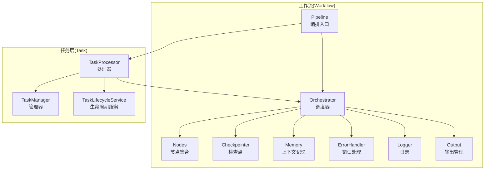
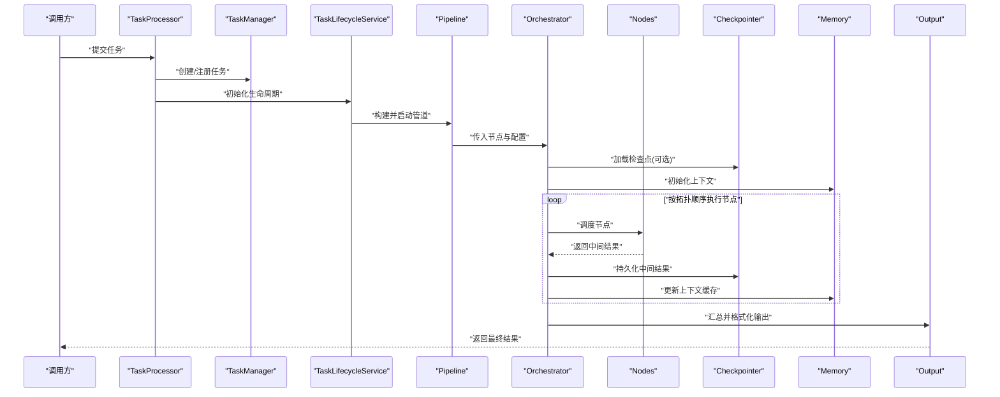
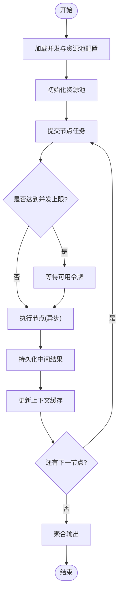
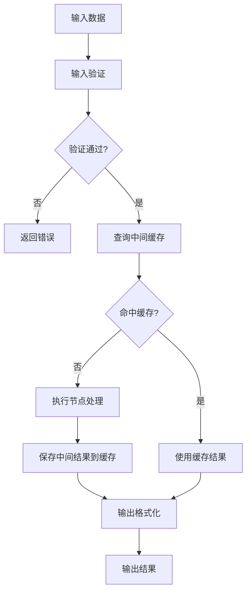
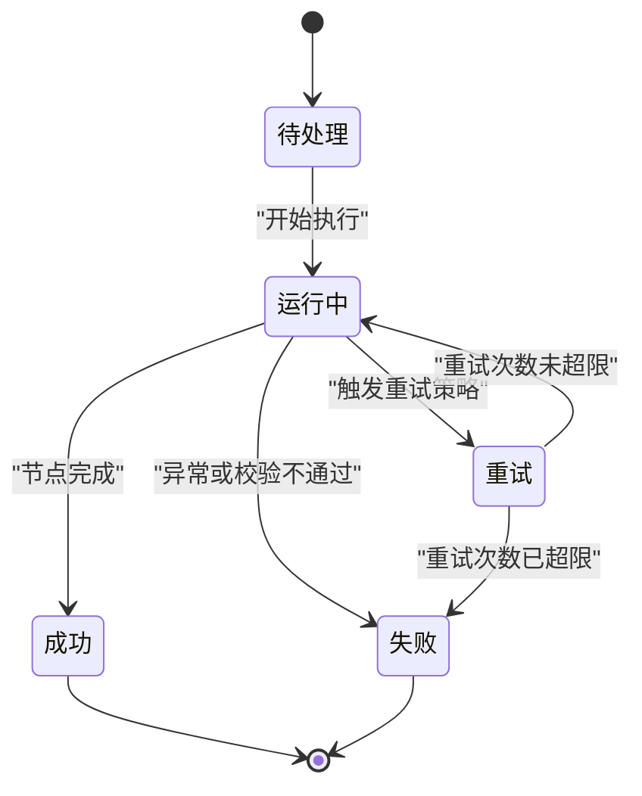
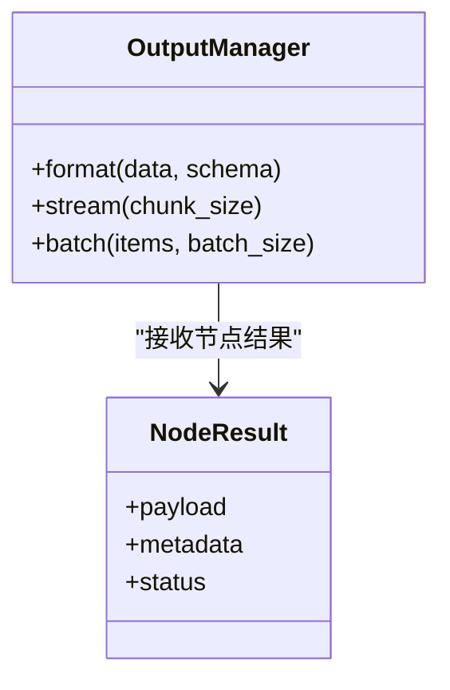
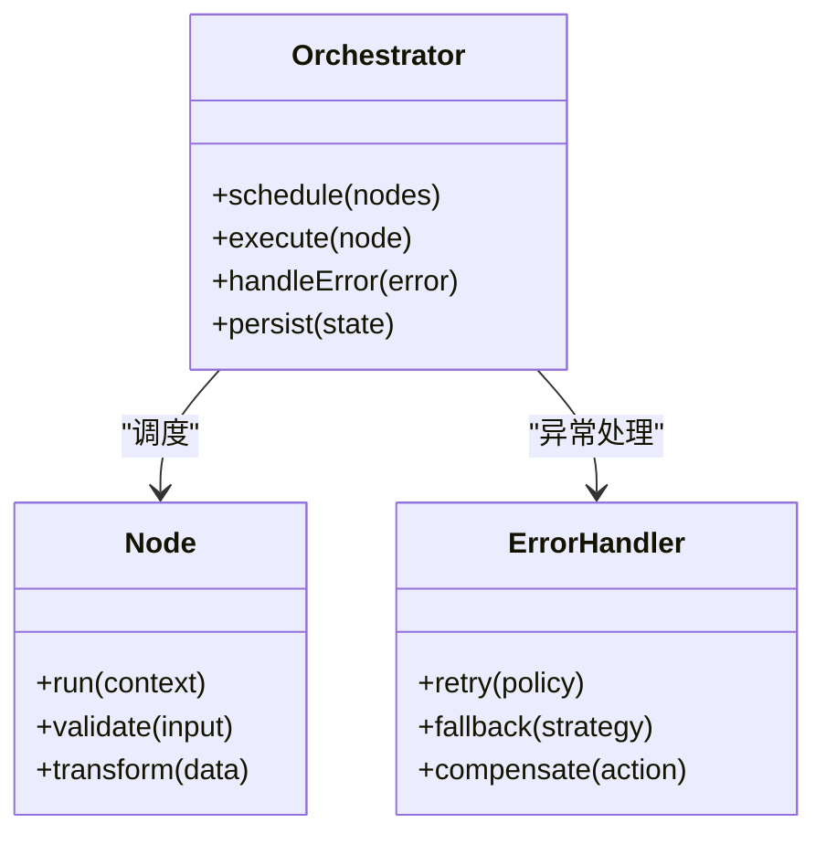
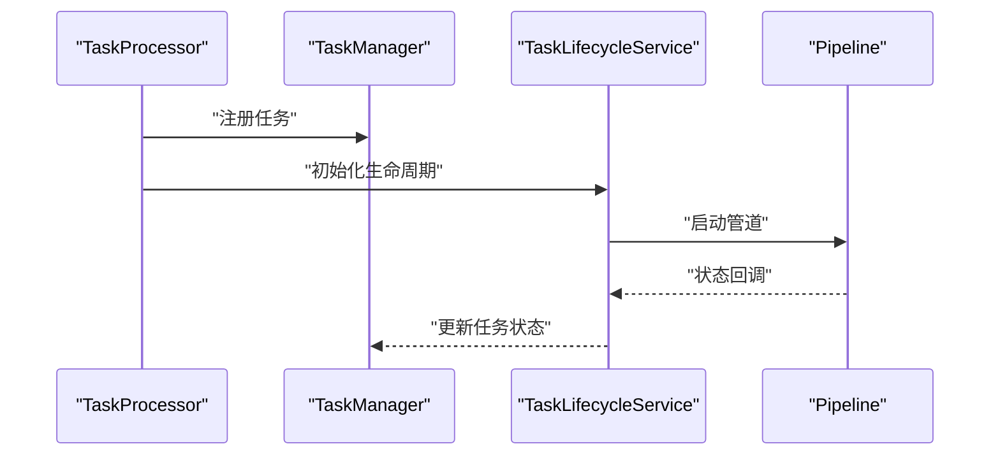
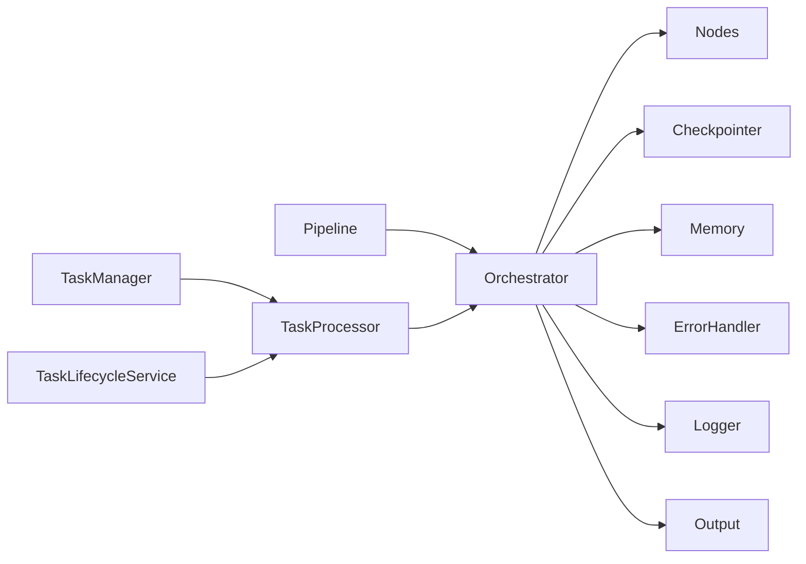

# 执行管道

<cite>
**本文引用的文件**   
- [workflow_pipeline.py](file://src/penshot/neopen/agent/workflow/workflow_pipeline.py)
- [workflow_orchestrator.py](file://src/penshot/neopen/agent/workflow/workflow_orchestrator.py)
- [workflow_state_types.py](file://src/penshot/neopen/agent/workflow/workflow_state_types.py)
- [workflow_models.py](file://src/penshot/neopen/agent/workflow/workflow_models.py)
- [workflow_nodes.py](file://src/penshot/neopen/agent/workflow/workflow_nodes.py)
- [workflow_output.py](file://src/penshot/neopen/agent/workflow/workflow_output.py)
- [workflow_checkpointer.py](file://src/penshot/neopen/agent/workflow/workflow_checkpointer.py)
- [workflow_memory.py](file://src/penshot/neopen/agent/workflow/workflow_memory.py)
- [workflow_error_handler.py](file://src/penshot/neopen/agent/workflow/workflow_error_handler.py)
- [workflow_logger.py](file://src/penshot/neopen/agent/workflow/workflow_logger.py)
- [task_processor.py](file://src/penshot/neopen/task/task_processor.py)
- [task_manager.py](file://src/penshot/neopen/task/task_manager.py)
- [task_lifecycle_service.py](file://src/penshot/neopen/task/task_lifecycle_service.py)
- [test_workflow_orchestrator.py](file://tests/workflow/test_workflow_orchestrator.py)
</cite>

## 目录
1. [简介](#简介)
2. [项目结构](#项目结构)
3. [核心组件](#核心组件)
4. [架构总览](#架构总览)
5. [详细组件分析](#详细组件分析)
6. [依赖分析](#依赖分析)
7. [性能考虑](#性能考虑)
8. [故障排查指南](#故障排查指南)
9. [结论](#结论)
10. [附录](#附录)

## 简介
本文件聚焦于“执行管道”的设计与实现，围绕以下目标展开：
- 解释 Pipeline 的执行模型：异步处理机制、并发控制策略、资源池管理。
- 说明数据流转过程：输入验证、中间结果缓存、输出格式化。
- 阐述状态类型系统：状态枚举定义、状态转换规则、持久化策略。
- 解释输出管理机制：多格式支持、流式输出、批量处理。
- 提供性能优化指南：内存管理、批处理配置、监控指标。
- 通过数据流图与状态转换图展示执行过程。

## 项目结构
与执行管道相关的代码主要位于 workflow 子模块以及任务编排层（task）中。关键文件包括：
- 管道编排与节点：workflow_pipeline.py、workflow_orchestrator.py、workflow_nodes.py
- 状态与模型：workflow_state_types.py、workflow_models.py
- 输出与检查点：workflow_output.py、workflow_checkpointer.py
- 记忆与错误处理：workflow_memory.py、workflow_error_handler.py、workflow_logger.py
- 任务层集成：task_processor.py、task_manager.py、task_lifecycle_service.py
- 测试用例：test_workflow_orchestrator.py

图表来源
- [workflow_pipeline.py](file://src/penshot/neopen/agent/workflow/workflow_pipeline.py)
- [workflow_orchestrator.py](file://src/penshot/neopen/agent/workflow/workflow_orchestrator.py)
- [workflow_nodes.py](file://src/penshot/neopen/agent/workflow/workflow_nodes.py)
- [workflow_checkpointer.py](file://src/penshot/neopen/agent/workflow/workflow_checkpointer.py)
- [workflow_memory.py](file://src/penshot/neopen/agent/workflow/workflow_memory.py)
- [workflow_error_handler.py](file://src/penshot/neopen/agent/workflow/workflow_error_handler.py)
- [workflow_logger.py](file://src/penshot/neopen/agent/workflow/workflow_logger.py)
- [workflow_output.py](file://src/penshot/neopen/agent/workflow/workflow_output.py)
- [task_processor.py](file://src/penshot/neopen/task/task_processor.py)
- [task_manager.py](file://src/penshot/neopen/task/task_manager.py)
- [task_lifecycle_service.py](file://src/penshot/neopen/task/task_lifecycle_service.py)

章节来源
- [workflow_pipeline.py](file://src/penshot/neopen/agent/workflow/workflow_pipeline.py)
- [workflow_orchestrator.py](file://src/penshot/neopen/agent/workflow/workflow_orchestrator.py)
- [workflow_state_types.py](file://src/penshot/neopen/agent/workflow/workflow_state_types.py)
- [workflow_models.py](file://src/penshot/neopen/agent/workflow/workflow_models.py)
- [workflow_nodes.py](file://src/penshot/neopen/agent/workflow/workflow_nodes.py)
- [workflow_output.py](file://src/penshot/neopen/agent/workflow/workflow_output.py)
- [workflow_checkpointer.py](file://src/penshot/neopen/agent/workflow/workflow_checkpointer.py)
- [workflow_memory.py](file://src/penshot/neopen/agent/workflow/workflow_memory.py)
- [workflow_error_handler.py](file://src/penshot/neopen/agent/workflow/workflow_error_handler.py)
- [workflow_logger.py](file://src/penshot/neopen/agent/workflow/workflow_logger.py)
- [task_processor.py](file://src/penshot/neopen/task/task_processor.py)
- [task_manager.py](file://src/penshot/neopen/task/task_manager.py)
- [task_lifecycle_service.py](file://src/penshot/neopen/task/task_lifecycle_service.py)

## 核心组件
- Pipeline：作为执行管道的统一入口，负责组装节点、配置执行参数、启动编排。
- Orchestrator：负责节点调度、并发控制、错误恢复、检查点写入与读取、输出收集。
- Nodes：可插拔的节点集合，每个节点完成单一职责的处理步骤。
- State Types & Models：定义状态枚举、状态数据结构、节点间传递的数据契约。
- Output Manager：负责多格式输出、流式输出、批量聚合。
- Checkpointer：负责中间结果的持久化与断点续跑。
- Memory：维护执行上下文与中间缓存。
- ErrorHandler & Logger：统一的异常捕获、重试策略与可观测性记录。

章节来源
- [workflow_pipeline.py](file://src/penshot/neopen/agent/workflow/workflow_pipeline.py)
- [workflow_orchestrator.py](file://src/penshot/neopen/agent/workflow/workflow_orchestrator.py)
- [workflow_state_types.py](file://src/penshot/neopen/agent/workflow/workflow_state_types.py)
- [workflow_models.py](file://src/penshot/neopen/agent/workflow/workflow_models.py)
- [workflow_nodes.py](file://src/penshot/neopen/agent/workflow/workflow_nodes.py)
- [workflow_output.py](file://src/penshot/neopen/agent/workflow/workflow_output.py)
- [workflow_checkpointer.py](file://src/penshot/neopen/agent/workflow/workflow_checkpointer.py)
- [workflow_memory.py](file://src/penshot/neopen/agent/workflow/workflow_memory.py)
- [workflow_error_handler.py](file://src/penshot/neopen/agent/workflow/workflow_error_handler.py)
- [workflow_logger.py](file://src/penshot/neopen/agent/workflow/workflow_logger.py)

## 架构总览
下图展示了从任务提交到管道执行的端到端流程，包含任务层与工作流层的交互。

图表来源
- [task_processor.py](file://src/penshot/neopen/task/task_processor.py)
- [task_manager.py](file://src/penshot/neopen/task/task_manager.py)
- [task_lifecycle_service.py](file://src/penshot/neopen/task/task_lifecycle_service.py)
- [workflow_pipeline.py](file://src/penshot/neopen/agent/workflow/workflow_pipeline.py)
- [workflow_orchestrator.py](file://src/penshot/neopen/agent/workflow/workflow_orchestrator.py)
- [workflow_nodes.py](file://src/penshot/neopen/agent/workflow/workflow_nodes.py)
- [workflow_checkpointer.py](file://src/penshot/neopen/agent/workflow/workflow_checkpointer.py)
- [workflow_memory.py](file://src/penshot/neopen/agent/workflow/workflow_memory.py)
- [workflow_output.py](file://src/penshot/neopen/agent/workflow/workflow_output.py)

## 详细组件分析

### 执行模型与并发控制
- 异步处理机制：Orchestrator 在节点调度时采用异步方式执行，避免阻塞主线程；对 I/O 密集或耗时操作使用异步任务队列。
- 并发控制策略：通过并发度上限与令牌桶/信号量控制并行节点数量，防止资源争用与过载。
- 资源池管理：对外部依赖（如 LLM 客户端、数据库连接）进行连接池复用，限制最大并发请求数，降低抖动。

图表来源
- [workflow_orchestrator.py](file://src/penshot/neopen/agent/workflow/workflow_orchestrator.py)
- [workflow_checkpointer.py](file://src/penshot/neopen/agent/workflow/workflow_checkpointer.py)
- [workflow_memory.py](file://src/penshot/neopen/agent/workflow/workflow_memory.py)

章节来源
- [workflow_orchestrator.py](file://src/penshot/neopen/agent/workflow/workflow_orchestrator.py)
- [workflow_checkpointer.py](file://src/penshot/neopen/agent/workflow/workflow_checkpointer.py)
- [workflow_memory.py](file://src/penshot/neopen/agent/workflow/workflow_memory.py)

### 数据流转过程
- 输入验证：Pipeline 在入口处校验输入结构与必填字段，失败则快速返回错误。
- 中间结果缓存：Memory 维护键值缓存，节点可按需读写，减少重复计算。
- 输出格式化：Output 根据配置将中间结果转换为 JSON、文本或其他格式，支持流式增量输出。

图表来源
- [workflow_pipeline.py](file://src/penshot/neopen/agent/workflow/workflow_pipeline.py)
- [workflow_memory.py](file://src/penshot/neopen/agent/workflow/workflow_memory.py)
- [workflow_output.py](file://src/penshot/neopen/agent/workflow/workflow_output.py)

章节来源
- [workflow_pipeline.py](file://src/penshot/neopen/agent/workflow/workflow_pipeline.py)
- [workflow_memory.py](file://src/penshot/neopen/agent/workflow/workflow_memory.py)
- [workflow_output.py](file://src/penshot/neopen/agent/workflow/workflow_output.py)

### 状态类型系统与转换规则
- 状态枚举：定义任务与节点的状态（例如：待处理、运行中、成功、失败、重试等）。
- 状态转换规则：由 Orchestrator 驱动，节点完成后根据结果决定下一步状态与分支。
- 持久化策略：Checkpointer 定期将状态快照落盘，支持断点续跑与回滚。

图表来源
- [workflow_state_types.py](file://src/penshot/neopen/agent/workflow/workflow_state_types.py)
- [workflow_orchestrator.py](file://src/penshot/neopen/agent/workflow/workflow_orchestrator.py)
- [workflow_checkpointer.py](file://src/penshot/neopen/agent/workflow/workflow_checkpointer.py)

章节来源
- [workflow_state_types.py](file://src/penshot/neopen/agent/workflow/workflow_state_types.py)
- [workflow_orchestrator.py](file://src/penshot/neopen/agent/workflow/workflow_orchestrator.py)
- [workflow_checkpointer.py](file://src/penshot/neopen/agent/workflow/workflow_checkpointer.py)

### 输出管理机制
- 多格式支持：Output 支持 JSON、文本、结构化对象等多种输出格式，便于下游消费。
- 流式输出：对于长任务，支持分块推送结果，提升用户体验与响应速度。
- 批量处理：当节点产出为列表时，Output 可进行批量聚合与分页输出。

图表来源
- [workflow_output.py](file://src/penshot/neopen/agent/workflow/workflow_output.py)
- [workflow_models.py](file://src/penshot/neopen/agent/workflow/workflow_models.py)

章节来源
- [workflow_output.py](file://src/penshot/neopen/agent/workflow/workflow_output.py)
- [workflow_models.py](file://src/penshot/neopen/agent/workflow/workflow_models.py)

### 节点与编排
- 节点设计：每个节点遵循统一接口，输入输出与状态变更清晰，便于组合与替换。
- 编排策略：Orchestrator 依据拓扑关系与依赖关系调度节点，支持条件分支与循环。
- 错误处理：ErrorHandler 统一捕获异常，执行重试、降级与补偿逻辑。

图表来源
- [workflow_orchestrator.py](file://src/penshot/neopen/agent/workflow/workflow_orchestrator.py)
- [workflow_nodes.py](file://src/penshot/neopen/agent/workflow/workflow_nodes.py)
- [workflow_error_handler.py](file://src/penshot/neopen/agent/workflow/workflow_error_handler.py)

章节来源
- [workflow_orchestrator.py](file://src/penshot/neopen/agent/workflow/workflow_orchestrator.py)
- [workflow_nodes.py](file://src/penshot/neopen/agent/workflow/workflow_nodes.py)
- [workflow_error_handler.py](file://src/penshot/neopen/agent/workflow/workflow_error_handler.py)

### 任务层集成
- TaskProcessor：协调任务创建、生命周期管理与管道启动。
- TaskManager：负责任务的注册、查询与状态同步。
- TaskLifecycleService：封装任务的生命周期钩子（开始、完成、失败），与管道状态保持一致。

图表来源
- [task_processor.py](file://src/penshot/neopen/task/task_processor.py)
- [task_manager.py](file://src/penshot/neopen/task/task_manager.py)
- [task_lifecycle_service.py](file://src/penshot/neopen/task/task_lifecycle_service.py)

章节来源
- [task_processor.py](file://src/penshot/neopen/task/task_processor.py)
- [task_manager.py](file://src/penshot/neopen/task/task_manager.py)
- [task_lifecycle_service.py](file://src/penshot/neopen/task/task_lifecycle_service.py)

## 依赖分析
- 组件耦合：Orchestrator 强依赖 Nodes、Checkpointer、Memory、ErrorHandler、Logger、Output；Pipeline 作为门面简化外部调用。
- 间接依赖：Task 层通过 Processor 与 Orchestrator 协作，保持职责分离。
- 外部依赖：LLM 客户端、存储后端、消息队列等在节点内部使用，通过资源池与限流保护。

图表来源
- [workflow_pipeline.py](file://src/penshot/neopen/agent/workflow/workflow_pipeline.py)
- [workflow_orchestrator.py](file://src/penshot/neopen/agent/workflow/workflow_orchestrator.py)
- [workflow_nodes.py](file://src/penshot/neopen/agent/workflow/workflow_nodes.py)
- [workflow_checkpointer.py](file://src/penshot/neopen/agent/workflow/workflow_checkpointer.py)
- [workflow_memory.py](file://src/penshot/neopen/agent/workflow/workflow_memory.py)
- [workflow_error_handler.py](file://src/penshot/neopen/agent/workflow/workflow_error_handler.py)
- [workflow_logger.py](file://src/penshot/neopen/agent/workflow/workflow_logger.py)
- [workflow_output.py](file://src/penshot/neopen/agent/workflow/workflow_output.py)
- [task_processor.py](file://src/penshot/neopen/task/task_processor.py)
- [task_manager.py](file://src/penshot/neopen/task/task_manager.py)
- [task_lifecycle_service.py](file://src/penshot/neopen/task/task_lifecycle_service.py)

章节来源
- [workflow_pipeline.py](file://src/penshot/neopen/agent/workflow/workflow_pipeline.py)
- [workflow_orchestrator.py](file://src/penshot/neopen/agent/workflow/workflow_orchestrator.py)
- [task_processor.py](file://src/penshot/neopen/task/task_processor.py)
- [task_manager.py](file://src/penshot/neopen/task/task_manager.py)
- [task_lifecycle_service.py](file://src/penshot/neopen/task/task_lifecycle_service.py)

## 性能考虑
- 内存管理
  - 使用 Memory 缓存中间结果，避免重复计算；合理设置 TTL 与容量上限，防止内存泄漏。
  - 大对象输出采用流式传输，减少一次性内存占用。
- 批处理配置
  - 调整节点批大小与输出批次，平衡吞吐与延迟。
  - 对 I/O 密集型节点启用连接池与请求合并。
- 监控指标
  - 记录节点执行时长、成功率、重试次数、缓存命中率、输出体积等指标。
  - 结合 Logger 与外部监控系统（如 Prometheus/Grafana）进行可视化。

[本节为通用指导，无需具体文件引用]

## 故障排查指南
- 常见问题
  - 节点超时：检查并发上限与资源池大小，确认外部服务可用性。
  - 状态不一致：核对 Checkpointer 的快照一致性，必要时回滚到最近稳定版本。
  - 输出异常：验证 Output 的格式配置与 Schema，确保节点输出符合契约。
- 定位方法
  - 查看 Logger 的详细日志，关注错误堆栈与上下文信息。
  - 使用 ErrorHandler 的重试与降级策略，观察是否触发补偿动作。
  - 通过测试用例复现问题，缩小范围至特定节点或配置项。

章节来源
- [workflow_error_handler.py](file://src/penshot/neopen/agent/workflow/workflow_error_handler.py)
- [workflow_logger.py](file://src/penshot/neopen/agent/workflow/workflow_logger.py)
- [test_workflow_orchestrator.py](file://tests/workflow/test_workflow_orchestrator.py)

## 结论
执行管道以 Pipeline 为入口，Orchestrator 为核心调度器，配合 Nodes、Memory、Checkpointer、Output、ErrorHandler 与 Logger 形成高内聚、低耦合的可扩展架构。通过异步执行、并发控制与资源池管理，系统在吞吐与稳定性之间取得良好平衡；状态类型系统与持久化策略保障了可观测性与可恢复性；输出管理机制满足多样化消费场景。建议在生产环境中完善监控与告警，持续优化批处理与缓存策略。

[本节为总结性内容，无需具体文件引用]

## 附录
- 术语表
  - Pipeline：执行管道的统一入口与装配器。
  - Orchestrator：负责节点调度、并发控制与错误恢复。
  - Node：单一职责的处理单元。
  - Checkpointer：中间结果与状态的持久化组件。
  - Memory：执行上下文与中间缓存。
  - Output：输出格式化与流式/批量输出管理。
  - ErrorHandler：统一异常处理与重试策略。
  - Logger：日志记录与可观测性。

[本节为概念性内容，无需具体文件引用]