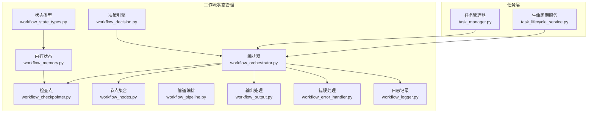
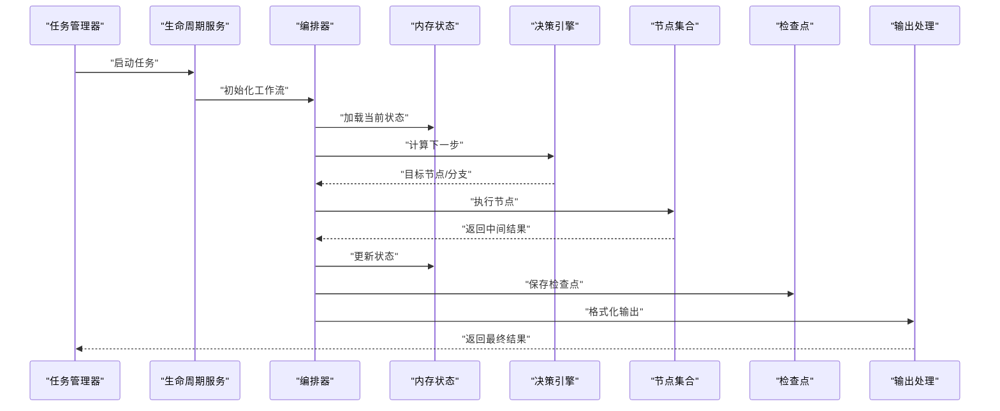
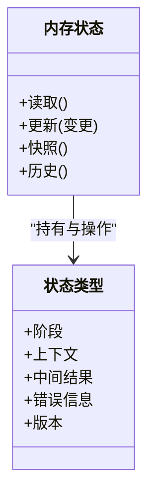
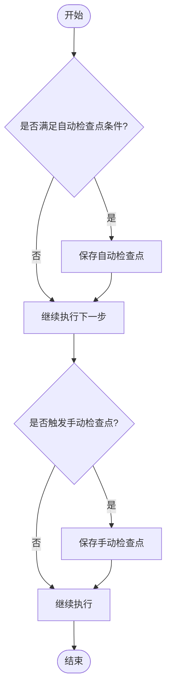
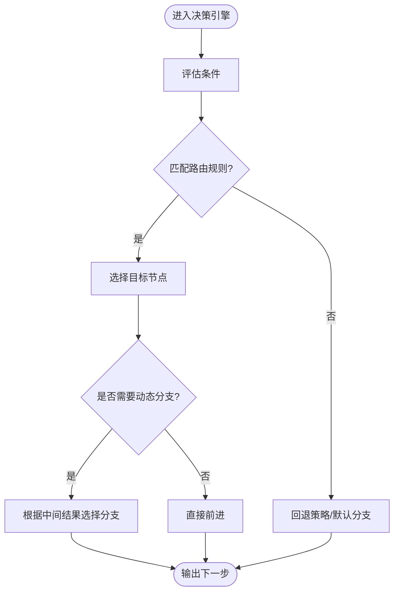
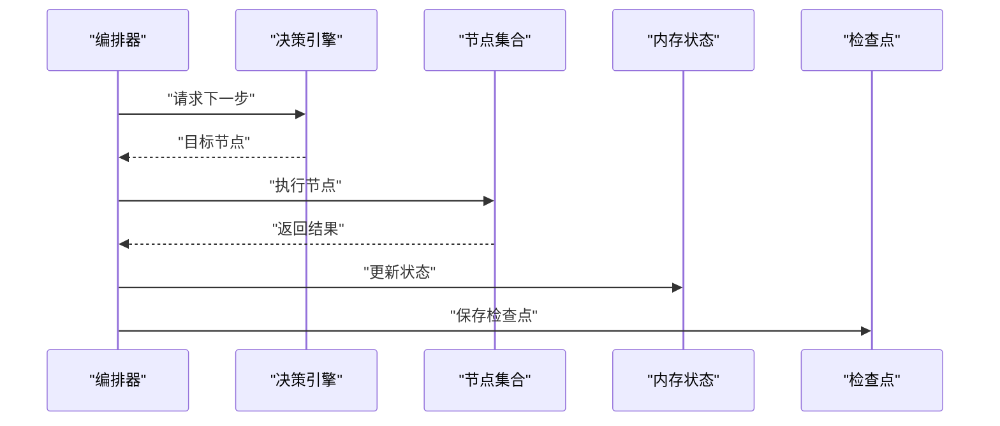
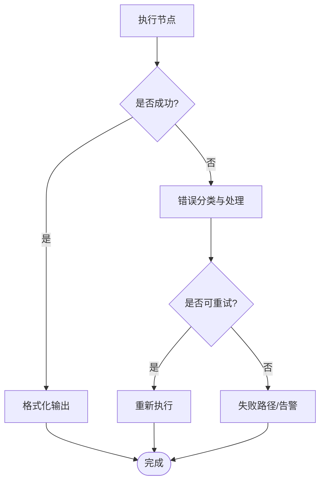
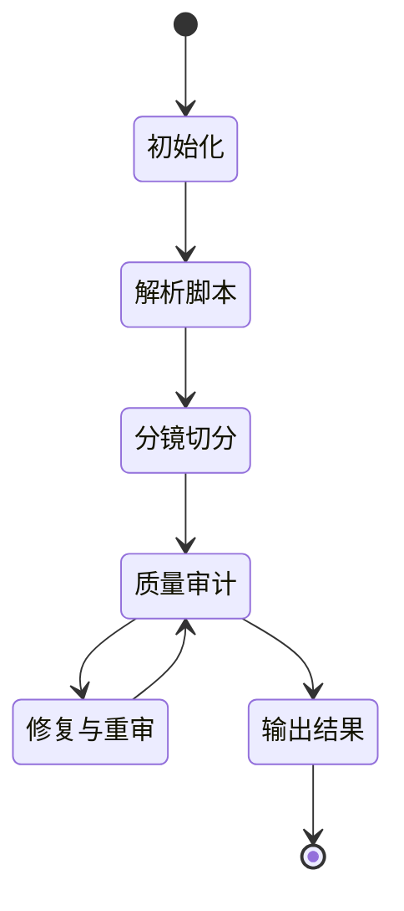
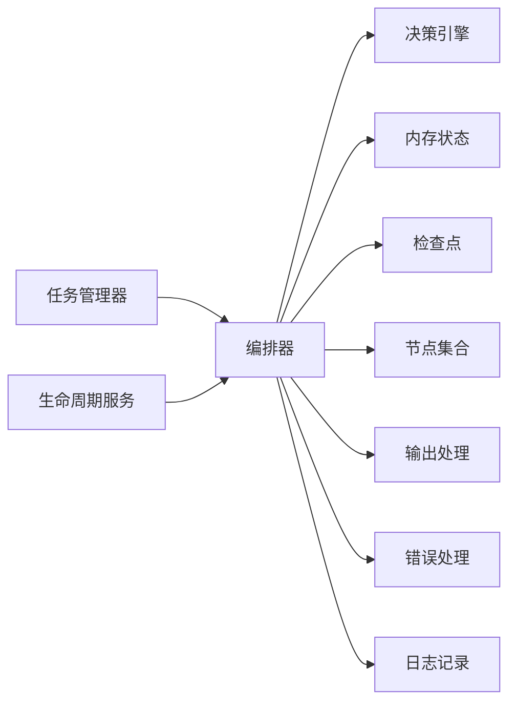

# 状态管理系统

<cite>
**本文引用的文件**   
- [workflow_state_types.py](file://src/penshot/neopen/agent/workflow/workflow_state_types.py)
- [workflow_memory.py](file://src/penshot/neopen/agent/workflow/workflow_memory.py)
- [workflow_checkpointer.py](file://src/penshot/neopen/agent/workflow/workflow_checkpointer.py)
- [workflow_decision.py](file://src/penshot/neopen/agent/workflow/workflow_decision.py)
- [workflow_orchestrator.py](file://src/penshot/neopen/agent/workflow/workflow_orchestrator.py)
- [workflow_nodes.py](file://src/penshot/neopen/agent/workflow/workflow_nodes.py)
- [workflow_pipeline.py](file://src/penshot/neopen/agent/workflow/workflow_pipeline.py)
- [workflow_output.py](file://src/penshot/neopen/agent/workflow/workflow_output.py)
- [workflow_error_handler.py](file://src/penshot/neopen/agent/workflow/workflow_error_handler.py)
- [workflow_logger.py](file://src/penshot/neopen/agent/workflow/workflow_logger.py)
- [task_manager.py](file://src/penshot/neopen/task/task_manager.py)
- [task_lifecycle_service.py](file://src/penshot/neopen/task/task_lifecycle_service.py)
- [test_workflow_orchestrator.py](file://tests/workflow/test_workflow_orchestrator.py)
</cite>

## 目录
1. [简介](#简介)
2. [项目结构](#项目结构)
3. [核心组件](#核心组件)
4. [架构总览](#架构总览)
5. [详细组件分析](#详细组件分析)
6. [依赖关系分析](#依赖关系分析)
7. [性能考量](#性能考量)
8. [故障排查指南](#故障排查指南)
9. [结论](#结论)
10. [附录](#附录)

## 简介
本文件围绕“状态管理系统”进行系统化说明，覆盖工作流状态的存储机制（内存、持久化、分布式同步）、检查点系统（自动/手动创建与恢复）、决策引擎（条件判断、路由规则、动态分支）、状态版本控制（兼容性、迁移、回滚），以及监控与调试工具（快照、变更追踪、可视化）。文档同时提供状态机图与检查点流程图，帮助读者快速理解状态流转与关键流程。

## 项目结构
状态管理相关代码集中在 workflow 子模块中，并与任务生命周期服务协同工作：
- 状态类型与模型：定义工作流状态的数据结构与字段语义
- 内存状态：进程内状态读写与并发安全
- 检查点：将状态序列化到磁盘或外部存储，支持自动与手动策略
- 决策引擎：基于当前状态与上下文计算下一步节点与分支
- 编排器：驱动节点执行、状态推进、错误处理与检查点落盘
- 节点与管道：封装具体业务逻辑与数据转换
- 输出与日志：标准化结果输出与可观测性

图表来源
- [workflow_state_types.py](file://src/penshot/neopen/agent/workflow/workflow_state_types.py)
- [workflow_memory.py](file://src/penshot/neopen/agent/workflow/workflow_memory.py)
- [workflow_checkpointer.py](file://src/penshot/neopen/agent/workflow/workflow_checkpointer.py)
- [workflow_decision.py](file://src/penshot/neopen/agent/workflow/workflow_decision.py)
- [workflow_orchestrator.py](file://src/penshot/neopen/agent/workflow/workflow_orchestrator.py)
- [workflow_nodes.py](file://src/penshot/neopen/agent/workflow/workflow_nodes.py)
- [workflow_pipeline.py](file://src/penshot/neopen/agent/workflow/workflow_pipeline.py)
- [workflow_output.py](file://src/penshot/neopen/agent/workflow/workflow_output.py)
- [workflow_error_handler.py](file://src/penshot/neopen/agent/workflow/workflow_error_handler.py)
- [workflow_logger.py](file://src/penshot/neopen/agent/workflow/workflow_logger.py)
- [task_manager.py](file://src/penshot/neopen/task/task_manager.py)
- [task_lifecycle_service.py](file://src/penshot/neopen/task/task_lifecycle_service.py)

章节来源
- [workflow_state_types.py](file://src/penshot/neopen/agent/workflow/workflow_state_types.py)
- [workflow_memory.py](file://src/penshot/neopen/agent/workflow/workflow_memory.py)
- [workflow_checkpointer.py](file://src/penshot/neopen/agent/workflow/workflow_checkpointer.py)
- [workflow_decision.py](file://src/penshot/neopen/agent/workflow/workflow_decision.py)
- [workflow_orchestrator.py](file://src/penshot/neopen/agent/workflow/workflow_orchestrator.py)
- [workflow_nodes.py](file://src/penshot/neopen/agent/workflow/workflow_nodes.py)
- [workflow_pipeline.py](file://src/penshot/neopen/agent/workflow/workflow_pipeline.py)
- [workflow_output.py](file://src/penshot/neopen/agent/workflow/workflow_output.py)
- [workflow_error_handler.py](file://src/penshot/neopen/agent/workflow/workflow_error_handler.py)
- [workflow_logger.py](file://src/penshot/neopen/agent/workflow/workflow_logger.py)
- [task_manager.py](file://src/penshot/neopen/task/task_manager.py)
- [task_lifecycle_service.py](file://src/penshot/neopen/task/task_lifecycle_service.py)

## 核心组件
- 状态类型与模型：定义工作流运行时的数据结构，包括阶段、元数据、中间结果、错误信息、版本等
- 内存状态：提供线程安全的读写接口，维护当前状态快照与变更历史
- 检查点：负责状态序列化与反序列化，支持自动触发与手动干预，并实现恢复流程
- 决策引擎：根据当前状态与上下文计算下一节点、分支与参数，支持条件判断与路由规则
- 编排器：协调节点执行、状态推进、异常处理、检查点落盘与输出格式化
- 节点与管道：封装具体业务步骤，按顺序或并行组合为流水线
- 输出与日志：统一结果格式与结构化日志，便于追踪与可视化

章节来源
- [workflow_state_types.py](file://src/penshot/neopen/agent/workflow/workflow_state_types.py)
- [workflow_memory.py](file://src/penshot/neopen/agent/workflow/workflow_memory.py)
- [workflow_checkpointer.py](file://src/penshot/neopen/agent/workflow/workflow_checkpointer.py)
- [workflow_decision.py](file://src/penshot/neopen/agent/workflow/workflow_decision.py)
- [workflow_orchestrator.py](file://src/penshot/neopen/agent/workflow/workflow_orchestrator.py)
- [workflow_nodes.py](file://src/penshot/neopen/agent/workflow/workflow_nodes.py)
- [workflow_pipeline.py](file://src/penshot/neopen/agent/workflow/workflow_pipeline.py)
- [workflow_output.py](file://src/penshot/neopen/agent/workflow/workflow_output.py)
- [workflow_error_handler.py](file://src/penshot/neopen/agent/workflow/workflow_error_handler.py)
- [workflow_logger.py](file://src/penshot/neopen/agent/workflow/workflow_logger.py)

## 架构总览
下图展示状态在内存、检查点与编排器之间的流转，以及与任务生命周期的集成。

图表来源
- [workflow_orchestrator.py](file://src/penshot/neopen/agent/workflow/workflow_orchestrator.py)
- [workflow_memory.py](file://src/penshot/neopen/agent/workflow/workflow_memory.py)
- [workflow_decision.py](file://src/penshot/neopen/agent/workflow/workflow_decision.py)
- [workflow_nodes.py](file://src/penshot/neopen/agent/workflow/workflow_nodes.py)
- [workflow_checkpointer.py](file://src/penshot/neopen/agent/workflow/workflow_checkpointer.py)
- [workflow_output.py](file://src/penshot/neopen/agent/workflow/workflow_output.py)
- [task_manager.py](file://src/penshot/neopen/task/task_manager.py)
- [task_lifecycle_service.py](file://src/penshot/neopen/task/task_lifecycle_service.py)

## 详细组件分析

### 状态类型与内存状态
- 状态类型定义了工作流运行时的最小必要字段，如阶段标识、上下文、中间结果、错误信息与版本标记
- 内存状态提供原子更新、快照读取与变更历史追加能力，确保并发访问下的可见性与一致性
- 典型操作包括：读取当前状态、应用增量变更、生成快照、清理过期历史

图表来源
- [workflow_state_types.py](file://src/penshot/neopen/agent/workflow/workflow_state_types.py)
- [workflow_memory.py](file://src/penshot/neopen/agent/workflow/workflow_memory.py)

章节来源
- [workflow_state_types.py](file://src/penshot/neopen/agent/workflow/workflow_state_types.py)
- [workflow_memory.py](file://src/penshot/neopen/agent/workflow/workflow_memory.py)

### 检查点系统（自动/手动与恢复）
- 自动检查点：在关键节点完成后或达到阈值时触发，避免长任务中断导致的状态丢失
- 手动检查点：由上层调用方显式保存，用于阶段性归档或对外暴露
- 恢复流程：从最近有效检查点重建内存状态，必要时执行迁移以兼容新版本

图表来源
- [workflow_checkpointer.py](file://src/penshot/neopen/agent/workflow/workflow_checkpointer.py)
- [workflow_orchestrator.py](file://src/penshot/neopen/agent/workflow/workflow_orchestrator.py)

章节来源
- [workflow_checkpointer.py](file://src/penshot/neopen/agent/workflow/workflow_checkpointer.py)
- [workflow_orchestrator.py](file://src/penshot/neopen/agent/workflow/workflow_orchestrator.py)

### 决策引擎（条件判断、路由规则、动态分支）
- 条件判断：基于状态字段与上下文配置评估布尔表达式
- 路由规则：将条件映射到目标节点或分支路径
- 动态分支：运行时根据中间结果选择不同后续节点，支持多路分流与合并

图表来源
- [workflow_decision.py](file://src/penshot/neopen/agent/workflow/workflow_decision.py)
- [workflow_orchestrator.py](file://src/penshot/neopen/agent/workflow/workflow_orchestrator.py)

章节来源
- [workflow_decision.py](file://src/penshot/neopen/agent/workflow/workflow_decision.py)
- [workflow_orchestrator.py](file://src/penshot/neopen/agent/workflow/workflow_orchestrator.py)

### 编排器与节点/管道
- 编排器负责调度节点执行、状态推进、错误捕获与检查点落盘
- 节点封装具体业务逻辑，输入输出遵循统一契约
- 管道将多个节点组合为有序或并行的执行序列，支持重试与超时控制

图表来源
- [workflow_orchestrator.py](file://src/penshot/neopen/agent/workflow/workflow_orchestrator.py)
- [workflow_decision.py](file://src/penshot/neopen/agent/workflow/workflow_decision.py)
- [workflow_nodes.py](file://src/penshot/neopen/agent/workflow/workflow_nodes.py)
- [workflow_memory.py](file://src/penshot/neopen/agent/workflow/workflow_memory.py)
- [workflow_checkpointer.py](file://src/penshot/neopen/agent/workflow/workflow_checkpointer.py)

章节来源
- [workflow_orchestrator.py](file://src/penshot/neopen/agent/workflow/workflow_orchestrator.py)
- [workflow_nodes.py](file://src/penshot/neopen/agent/workflow/workflow_nodes.py)
- [workflow_pipeline.py](file://src/penshot/neopen/agent/workflow/workflow_pipeline.py)

### 输出与错误处理
- 输出处理：对最终结果进行标准化、校验与格式化，便于下游消费
- 错误处理：捕获节点异常、分类错误类型、记录上下文并决定是否重试或终止

图表来源
- [workflow_output.py](file://src/penshot/neopen/agent/workflow/workflow_output.py)
- [workflow_error_handler.py](file://src/penshot/neopen/agent/workflow/workflow_error_handler.py)

章节来源
- [workflow_output.py](file://src/penshot/neopen/agent/workflow/workflow_output.py)
- [workflow_error_handler.py](file://src/penshot/neopen/agent/workflow/workflow_error_handler.py)

### 状态机图（示例）
以下状态机展示了常见的工作流阶段流转，实际节点名称与转移条件以决策引擎为准。

[此图为概念性示意，不直接映射具体源码文件]

## 依赖关系分析
- 编排器依赖决策引擎、内存状态、检查点、节点集合、输出与错误处理
- 任务管理器与生命周期服务通过编排器驱动工作流执行
- 日志记录贯穿各组件，提供可观测性

图表来源
- [task_manager.py](file://src/penshot/neopen/task/task_manager.py)
- [task_lifecycle_service.py](file://src/penshot/neopen/task/task_lifecycle_service.py)
- [workflow_orchestrator.py](file://src/penshot/neopen/agent/workflow/workflow_orchestrator.py)
- [workflow_decision.py](file://src/penshot/neopen/agent/workflow/workflow_decision.py)
- [workflow_memory.py](file://src/penshot/neopen/agent/workflow/workflow_memory.py)
- [workflow_checkpointer.py](file://src/penshot/neopen/agent/workflow/workflow_checkpointer.py)
- [workflow_nodes.py](file://src/penshot/neopen/agent/workflow/workflow_nodes.py)
- [workflow_output.py](file://src/penshot/neopen/agent/workflow/workflow_output.py)
- [workflow_error_handler.py](file://src/penshot/neopen/agent/workflow/workflow_error_handler.py)
- [workflow_logger.py](file://src/penshot/neopen/agent/workflow/workflow_logger.py)

章节来源
- [task_manager.py](file://src/penshot/neopen/task/task_manager.py)
- [task_lifecycle_service.py](file://src/penshot/neopen/task/task_lifecycle_service.py)
- [workflow_orchestrator.py](file://src/penshot/neopen/agent/workflow/workflow_orchestrator.py)

## 性能考量
- 内存状态应限制历史长度与快照频率，避免内存膨胀
- 检查点写入采用异步或批量化策略，降低主流程延迟
- 决策引擎的条件评估与路由规则需保持轻量，复杂逻辑下沉至缓存或预计算
- 节点执行支持并发与超时控制，结合重试与熔断提升鲁棒性
- 输出处理尽量使用流式与惰性计算，减少一次性对象构建

[本节为通用指导，不直接分析具体文件]

## 故障排查指南
- 常见问题定位
  - 状态不一致：检查内存状态更新与检查点落盘的时序，确认是否存在并发竞争
  - 检查点损坏：验证序列化格式与版本兼容性，必要时执行迁移或回滚
  - 决策死循环：审查条件与路由规则，增加最大迭代次数与退出条件
  - 节点异常：查看错误分类与日志上下文，确认是否可重试或需要人工介入
- 诊断工具
  - 状态快照：导出当前状态与历史变更，辅助复现问题
  - 变更追踪：记录每次状态更新的来源与差异，便于回溯
  - 可视化界面：将状态机与检查点时间线可视化，直观呈现执行轨迹

章节来源
- [workflow_error_handler.py](file://src/penshot/neopen/agent/workflow/workflow_error_handler.py)
- [workflow_logger.py](file://src/penshot/neopen/agent/workflow/workflow_logger.py)
- [workflow_memory.py](file://src/penshot/neopen/agent/workflow/workflow_memory.py)
- [workflow_checkpointer.py](file://src/penshot/neopen/agent/workflow/workflow_checkpointer.py)

## 结论
该状态管理系统以清晰的职责划分与模块化设计实现了可靠的工作流状态管理。通过内存状态、检查点与决策引擎的协作，系统在可靠性、可扩展性与可观测性方面具备良好基础。建议在生产环境中完善分布式同步与可视化监控，进一步提升运维效率与稳定性。

[本节为总结性内容，不直接分析具体文件]

## 附录
- 测试参考
  - 编排器行为与边界用例可在测试文件中找到，有助于理解预期行为与异常场景

章节来源
- [test_workflow_orchestrator.py](file://tests/workflow/test_workflow_orchestrator.py)