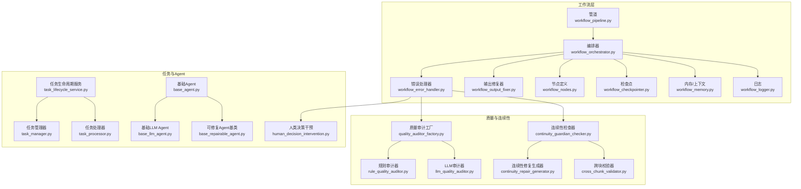
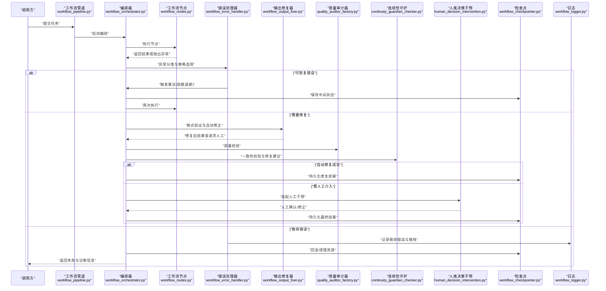
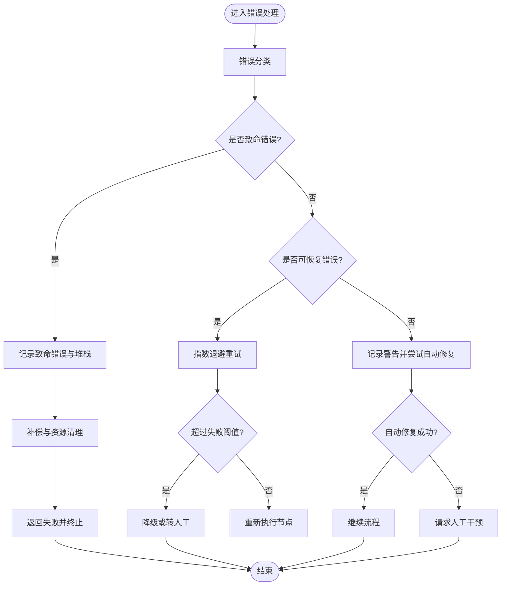
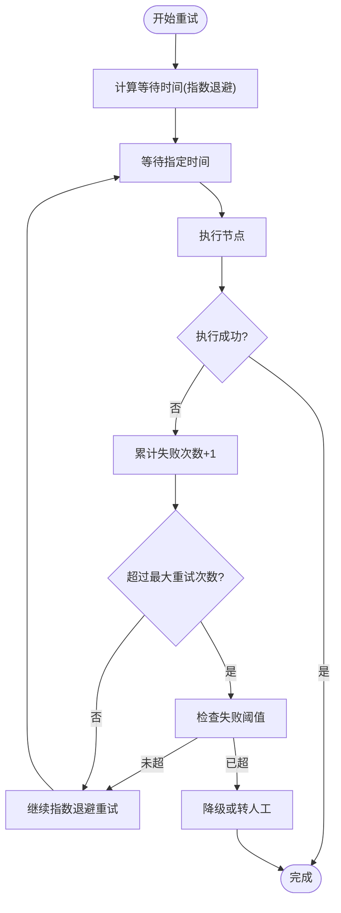
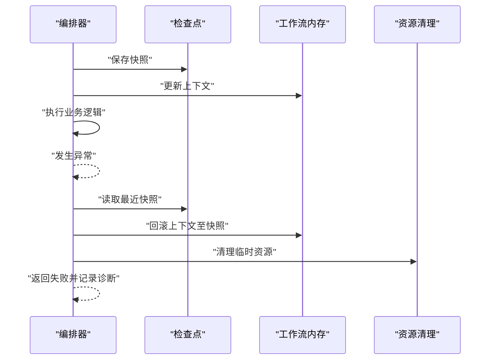
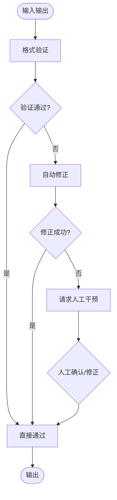
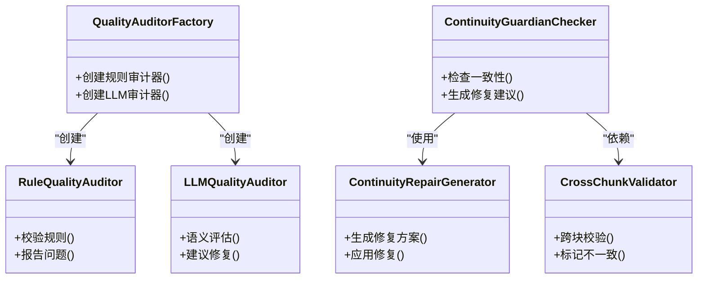
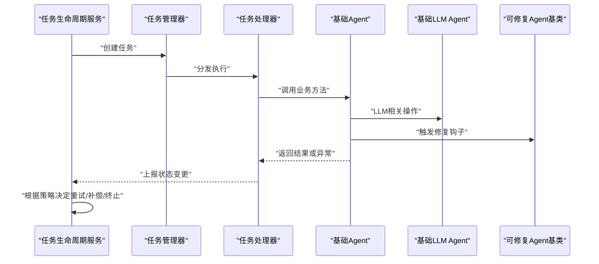
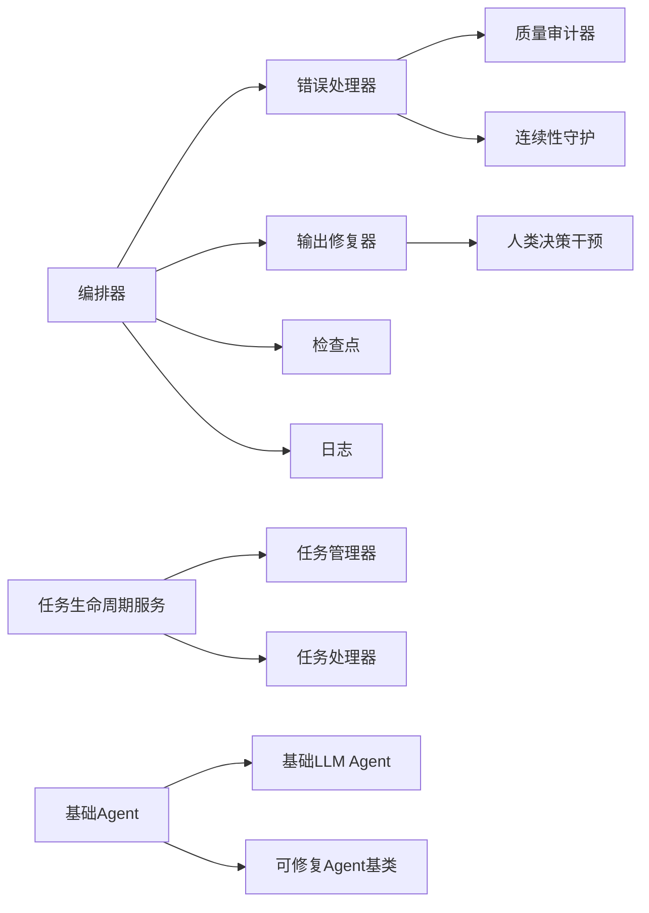

# 错误处理与恢复

<cite>
**本文引用的文件**   
- [workflow_error_handler.py](file://src/penshot/neopen/agent/workflow/workflow_error_handler.py)
- [workflow_output_fixer.py](file://src/penshot/neopen/agent/workflow/workflow_output_fixer.py)
- [workflow_orchestrator.py](file://src/penshot/neopen/agent/workflow/workflow_orchestrator.py)
- [workflow_pipeline.py](file://src/penshot/neopen/agent/workflow/workflow_pipeline.py)
- [workflow_state_types.py](file://src/penshot/neopen/agent/workflow/workflow_state_types.py)
- [workflow_logger.py](file://src/penshot/neopen/agent/workflow/workflow_logger.py)
- [base_agent.py](file://src/penshot/neopen/agent/base_agent.py)
- [base_llm_agent.py](file://src/penshot/neopen/agent/base_llm_agent.py)
- [base_repairable_agent.py](file://src/penshot/neopen/agent/base_repairable_agent.py)
- [human_decision_intervention.py](file://src/penshot/neopen/agent/human_decision/human_decision_intervention.py)
- [continuity_guardian_checker.py](file://src/penshot/neopen/agent/continuity_guardian/continuity_guardian_checker.py)
- [continuity_repair_generator.py](file://src/penshot/neopen/agent/continuity_guardian/continuity_repair_generator.py)
- [cross_chunk_validator.py](file://src/penshot/neopen/agent/continuity_guardian/cross_chunk_validator.py)
- [quality_auditor_factory.py](file://src/penshot/neopen/agent/quality_auditor/quality_auditor_factory.py)
- [rule_quality_auditor.py](file://src/penshot/neopen/agent/quality_auditor/rule_quality_auditor.py)
- [llm_quality_auditor.py](file://src/penshot/neopen/agent/quality_auditor/llm_quality_auditor.py)
- [shot_segmenter_factory.py](file://src/penshot/neopen/agent/shot_segmenter/shot_segmenter_factory.py)
- [video_splitter_factory.py](file://src/penshot/neopen/agent/video_splitter/video_splitter_factory.py)
- [prompt_converter_factory.py](file://src/penshot/neopen/agent/prompt_converter/prompt_converter_factory.py)
- [script_parser_factory.py](file://src/penshot/neopen/agent/script_parser/script_parser_factory.py)
- [task_lifecycle_service.py](file://src/penshot/neopen/agent/task/task_lifecycle_service.py)
- [task_manager.py](file://src/penshot/neopen/agent/task/task_manager.py)
- [task_processor.py](file://src/penshot/neopen/agent/task/task_processor.py)
- [workflow_checkpointer.py](file://src/penshot/neopen/agent/workflow/workflow_checkpointer.py)
- [workflow_memory.py](file://src/penshot/neopen/agent/workflow/workflow_memory.py)
- [workflow_models.py](file://src/penshot/neopen/agent/workflow/workflow_models.py)
- [workflow_nodes.py](file://src/penshot/neopen/agent/workflow/workflow_nodes.py)
- [workflow_output.py](file://src/penshot/neopen/agent/workflow/workflow_output.py)
- [workflow_decision.py](file://src/penshot/neopen/agent/workflow/workflow_decision.py)
</cite>

## 目录
1. [引言](#引言)
2. [项目结构](#项目结构)
3. [核心组件](#核心组件)
4. [架构总览](#架构总览)
5. [详细组件分析](#详细组件分析)
6. [依赖关系分析](#依赖关系分析)
7. [性能考虑](#性能考虑)
8. [故障诊断指南](#故障诊断指南)
9. [结论](#结论)
10. [附录](#附录)

## 引言
本文件聚焦于“错误处理与恢复”机制，围绕以下目标展开：
- 错误分类体系：致命错误、可恢复错误、警告信息的识别与处理策略
- 重试机制：指数退避算法、最大重试次数、失败阈值控制
- 补偿操作：事务回滚、数据一致性保证、资源清理
- 输出修复机制：格式验证、自动修正、人工干预接口
- 故障诊断工具：错误日志分析、堆栈跟踪、性能瓶颈定位
- 可视化说明：错误处理流程图与重试策略图

## 项目结构
错误处理与恢复能力主要分布在工作流编排层、任务生命周期服务、质量审计器、连续性守护器以及通用 Agent 基类中。关键位置如下：
- 工作流错误处理与输出修复：workflow_error_handler.py、workflow_output_fixer.py
- 工作流编排与节点执行：workflow_orchestrator.py、workflow_pipeline.py、workflow_nodes.py
- 状态与模型：workflow_state_types.py、workflow_models.py
- 日志与检查点：workflow_logger.py、workflow_checkpointer.py、workflow_memory.py
- 质量审计与规则校验：quality_auditor_factory.py、rule_quality_auditor.py、llm_quality_auditor.py
- 连续性守护与修复：continuity_guardian_checker.py、continuity_repair_generator.py、cross_chunk_validator.py
- 人类决策与干预：human_decision_intervention.py
- 任务生命周期与处理器：task_lifecycle_service.py、task_manager.py、task_processor.py
- 通用 Agent 基类：base_agent.py、base_llm_agent.py、base_repairable_agent.py

图表来源
- [workflow_error_handler.py](file://src/penshot/neopen/agent/workflow/workflow_error_handler.py)
- [workflow_output_fixer.py](file://src/penshot/neopen/agent/workflow/workflow_output_fixer.py)
- [workflow_orchestrator.py](file://src/penshot/neopen/agent/workflow/workflow_orchestrator.py)
- [workflow_pipeline.py](file://src/penshot/neopen/agent/workflow/workflow_pipeline.py)
- [workflow_nodes.py](file://src/penshot/neopen/agent/workflow/workflow_nodes.py)
- [workflow_checkpointer.py](file://src/penshot/neopen/agent/workflow/workflow_checkpointer.py)
- [workflow_memory.py](file://src/penshot/neopen/agent/workflow/workflow_memory.py)
- [workflow_logger.py](file://src/penshot/neopen/agent/workflow/workflow_logger.py)
- [quality_auditor_factory.py](file://src/penshot/neopen/agent/quality_auditor/quality_auditor_factory.py)
- [rule_quality_auditor.py](file://src/penshot/neopen/agent/quality_auditor/rule_quality_auditor.py)
- [llm_quality_auditor.py](file://src/penshot/neopen/agent/quality_auditor/llm_quality_auditor.py)
- [continuity_guardian_checker.py](file://src/penshot/neopen/agent/continuity_guardian/continuity_guardian_checker.py)
- [continuity_repair_generator.py](file://src/penshot/neopen/agent/continuity_guardian/continuity_repair_generator.py)
- [cross_chunk_validator.py](file://src/penshot/neopen/agent/continuity_guardian/cross_chunk_validator.py)
- [human_decision_intervention.py](file://src/penshot/neopen/agent/human_decision/human_decision_intervention.py)
- [task_lifecycle_service.py](file://src/penshot/neopen/agent/task/task_lifecycle_service.py)
- [task_manager.py](file://src/penshot/neopen/agent/task/task_manager.py)
- [task_processor.py](file://src/penshot/neopen/agent/task/task_processor.py)
- [base_agent.py](file://src/penshot/neopen/agent/base_agent.py)
- [base_llm_agent.py](file://src/penshot/neopen/agent/base_llm_agent.py)
- [base_repairable_agent.py](file://src/penshot/neopen/agent/base_repairable_agent.py)

章节来源
- [workflow_error_handler.py](file://src/penshot/neopen/agent/workflow/workflow_error_handler.py)
- [workflow_output_fixer.py](file://src/penshot/neopen/agent/workflow/workflow_output_fixer.py)
- [workflow_orchestrator.py](file://src/penshot/neopen/agent/workflow/workflow_orchestrator.py)
- [workflow_pipeline.py](file://src/penshot/neopen/agent/workflow/workflow_pipeline.py)
- [workflow_nodes.py](file://src/penshot/neopen/agent/workflow/workflow_nodes.py)
- [workflow_checkpointer.py](file://src/penshot/neopen/agent/workflow/workflow_checkpointer.py)
- [workflow_memory.py](file://src/penshot/neopen/agent/workflow/workflow_memory.py)
- [workflow_logger.py](file://src/penshot/neopen/agent/workflow/workflow_logger.py)
- [quality_auditor_factory.py](file://src/penshot/neopen/agent/quality_auditor/quality_auditor_factory.py)
- [rule_quality_auditor.py](file://src/penshot/neopen/agent/quality_auditor/rule_quality_auditor.py)
- [llm_quality_auditor.py](file://src/penshot/neopen/agent/quality_auditor/llm_quality_auditor.py)
- [continuity_guardian_checker.py](file://src/penshot/neopen/agent/continuity_guardian/continuity_guardian_checker.py)
- [continuity_repair_generator.py](file://src/penshot/neopen/agent/continuity_guardian/continuity_repair_generator.py)
- [cross_chunk_validator.py](file://src/penshot/neopen/agent/continuity_guardian/cross_chunk_validator.py)
- [human_decision_intervention.py](file://src/penshot/neopen/agent/human_decision/human_decision_intervention.py)
- [task_lifecycle_service.py](file://src/penshot/neopen/agent/task/task_lifecycle_service.py)
- [task_manager.py](file://src/penshot/neopen/agent/task/task_manager.py)
- [task_processor.py](file://src/penshot/neopen/agent/task/task_processor.py)
- [base_agent.py](file://src/penshot/neopen/agent/base_agent.py)
- [base_llm_agent.py](file://src/penshot/neopen/agent/base_llm_agent.py)
- [base_repairable_agent.py](file://src/penshot/neopen/agent/base_repairable_agent.py)

## 核心组件
- 错误处理器（workflow_error_handler.py）：负责捕获异常、分类错误、触发重试或降级、记录诊断信息并协调后续修复路径。
- 输出修复器（workflow_output_fixer.py）：对下游节点的输出进行格式校验与自动修正，必要时触发人工干预流程。
- 编排器（workflow_orchestrator.py）：统一调度节点执行、错误路由、重试与补偿、检查点持久化与恢复。
- 管道（workflow_pipeline.py）：封装端到端执行入口，串联编排器与错误处理、输出修复、日志与检查点。
- 质量审计器（quality_auditor_factory.py、rule_quality_auditor.py、llm_quality_auditor.py）：提供规则与LLM双轨质量校验，为错误分类与修复建议提供依据。
- 连续性守护器（continuity_guardian_checker.py、continuity_repair_generator.py、cross_chunk_validator.py）：保障跨块一致性，生成修复方案并参与恢复。
- 人类决策干预（human_decision_intervention.py）：在自动修复不可达时，提供人工确认与修正的接口。
- 任务生命周期服务（task_lifecycle_service.py）、任务管理器（task_manager.py）、任务处理器（task_processor.py）：管理任务状态迁移、重试边界与补偿动作。
- 通用 Agent 基类（base_agent.py、base_llm_agent.py、base_repairable_agent.py）：为各业务 Agent 提供统一的错误上报、重试与修复钩子。

章节来源
- [workflow_error_handler.py](file://src/penshot/neopen/agent/workflow/workflow_error_handler.py)
- [workflow_output_fixer.py](file://src/penshot/neopen/agent/workflow/workflow_output_fixer.py)
- [workflow_orchestrator.py](file://src/penshot/neopen/agent/workflow/workflow_orchestrator.py)
- [workflow_pipeline.py](file://src/penshot/neopen/agent/workflow/workflow_pipeline.py)
- [quality_auditor_factory.py](file://src/penshot/neopen/agent/quality_auditor/quality_auditor_factory.py)
- [rule_quality_auditor.py](file://src/penshot/neopen/agent/quality_auditor/rule_quality_auditor.py)
- [llm_quality_auditor.py](file://src/penshot/neopen/agent/quality_auditor/llm_quality_auditor.py)
- [continuity_guardian_checker.py](file://src/penshot/neopen/agent/continuity_guardian/continuity_guardian_checker.py)
- [continuity_repair_generator.py](file://src/penshot/neopen/agent/continuity_guardian/continuity_repair_generator.py)
- [cross_chunk_validator.py](file://src/penshot/neopen/agent/continuity_guardian/cross_chunk_validator.py)
- [human_decision_intervention.py](file://src/penshot/neopen/agent/human_decision/human_decision_intervention.py)
- [task_lifecycle_service.py](file://src/penshot/neopen/agent/task/task_lifecycle_service.py)
- [task_manager.py](file://src/penshot/neopen/agent/task/task_manager.py)
- [task_processor.py](file://src/penshot/neopen/agent/task/task_processor.py)
- [base_agent.py](file://src/penshot/neopen/agent/base_agent.py)
- [base_llm_agent.py](file://src/penshot/neopen/agent/base_llm_agent.py)
- [base_repairable_agent.py](file://src/penshot/neopen/agent/base_repairable_agent.py)

## 架构总览
错误处理与恢复贯穿“执行—检测—分类—重试/修复—补偿—落盘”的全链路。编排器作为中枢，将错误处理器与输出修复器接入到节点执行前后；质量审计与连续性守护提供二次校验与修复建议；人类决策作为兜底；检查点与日志确保可观测性与可恢复性。

图表来源
- [workflow_pipeline.py](file://src/penshot/neopen/agent/workflow/workflow_pipeline.py)
- [workflow_orchestrator.py](file://src/penshot/neopen/agent/workflow/workflow_orchestrator.py)
- [workflow_nodes.py](file://src/penshot/neopen/agent/workflow/workflow_nodes.py)
- [workflow_error_handler.py](file://src/penshot/neopen/agent/workflow/workflow_error_handler.py)
- [workflow_output_fixer.py](file://src/penshot/neopen/agent/workflow/workflow_output_fixer.py)
- [quality_auditor_factory.py](file://src/penshot/neopen/agent/quality_auditor/quality_auditor_factory.py)
- [continuity_guardian_checker.py](file://src/penshot/neopen/agent/continuity_guardian/continuity_guardian_checker.py)
- [human_decision_intervention.py](file://src/penshot/neopen/agent/human_decision/human_decision_intervention.py)
- [workflow_checkpointer.py](file://src/penshot/neopen/agent/workflow/workflow_checkpointer.py)
- [workflow_logger.py](file://src/penshot/neopen/agent/workflow/workflow_logger.py)

## 详细组件分析

### 错误分类体系与处理策略
- 致命错误：系统级不可恢复异常（如配置缺失、外部依赖完全不可用）。处理策略包括立即终止、记录完整堆栈、触发补偿与资源清理、向调用方返回明确失败信息。
- 可恢复错误：临时性异常（如网络抖动、限流、超时）。处理策略包括指数退避重试、失败阈值控制、降级执行、保留中间状态以便恢复。
- 警告信息：非阻塞性问题（如字段缺失但可补全、格式轻微偏差）。处理策略包括记录告警、尝试自动修复、必要时提示人工关注。

图表来源
- [workflow_error_handler.py](file://src/penshot/neopen/agent/workflow/workflow_error_handler.py)
- [workflow_orchestrator.py](file://src/penshot/neopen/agent/workflow/workflow_orchestrator.py)
- [workflow_output_fixer.py](file://src/penshot/neopen/agent/workflow/workflow_output_fixer.py)
- [human_decision_intervention.py](file://src/penshot/neopen/agent/human_decision/human_decision_intervention.py)

章节来源
- [workflow_error_handler.py](file://src/penshot/neopen/agent/workflow/workflow_error_handler.py)
- [workflow_orchestrator.py](file://src/penshot/neopen/agent/workflow/workflow_orchestrator.py)
- [workflow_output_fixer.py](file://src/penshot/neopen/agent/workflow/workflow_output_fixer.py)
- [human_decision_intervention.py](file://src/penshot/neopen/agent/human_decision/human_decision_intervention.py)

### 重试机制：指数退避、最大重试次数与失败阈值
- 指数退避：每次重试等待时间按指数增长，避免雪崩与过载。
- 最大重试次数：防止无限重试导致资源耗尽。
- 失败阈值：当连续失败次数达到阈值时，触发降级或人工干预。

图表来源
- [workflow_error_handler.py](file://src/penshot/neopen/agent/workflow/workflow_error_handler.py)
- [workflow_orchestrator.py](file://src/penshot/neopen/agent/workflow/workflow_orchestrator.py)

章节来源
- [workflow_error_handler.py](file://src/penshot/neopen/agent/workflow/workflow_error_handler.py)
- [workflow_orchestrator.py](file://src/penshot/neopen/agent/workflow/workflow_orchestrator.py)

### 补偿操作：事务回滚、数据一致性与资源清理
- 事务回滚：在关键步骤失败时，撤销已写入的状态，确保原子性。
- 数据一致性：通过质量审计与连续性守护双重校验，保证输出结构与跨块一致性。
- 资源清理：释放临时文件、网络连接、缓存条目等，避免泄漏。

图表来源
- [workflow_orchestrator.py](file://src/penshot/neopen/agent/workflow/workflow_orchestrator.py)
- [workflow_checkpointer.py](file://src/penshot/neopen/agent/workflow/workflow_checkpointer.py)
- [workflow_memory.py](file://src/penshot/neopen/agent/workflow/workflow_memory.py)

章节来源
- [workflow_orchestrator.py](file://src/penshot/neopen/agent/workflow/workflow_orchestrator.py)
- [workflow_checkpointer.py](file://src/penshot/neopen/agent/workflow/workflow_checkpointer.py)
- [workflow_memory.py](file://src/penshot/neopen/agent/workflow/workflow_memory.py)

### 输出修复机制：格式验证、自动修正与人工干预
- 格式验证：基于模型与规则对输出结构进行严格校验。
- 自动修正：对常见格式问题进行智能修复（如补齐缺失字段、规范化枚举值）。
- 人工干预：当自动修复不可达时，提供界面或接口供人工确认与修正。

图表来源
- [workflow_output_fixer.py](file://src/penshot/neopen/agent/workflow/workflow_output_fixer.py)
- [human_decision_intervention.py](file://src/penshot/neopen/agent/human_decision/human_decision_intervention.py)

章节来源
- [workflow_output_fixer.py](file://src/penshot/neopen/agent/workflow/workflow_output_fixer.py)
- [human_decision_intervention.py](file://src/penshot/neopen/agent/human_decision/human_decision_intervention.py)

### 质量审计与连续性守护
- 质量审计：规则审计器与LLM审计器协同，提供结构化校验与语义合理性判断。
- 连续性守护：跨块校验器与修复生成器保障长脚本或分块处理的连贯性。

图表来源
- [quality_auditor_factory.py](file://src/penshot/neopen/agent/quality_auditor/quality_auditor_factory.py)
- [rule_quality_auditor.py](file://src/penshot/neopen/agent/quality_auditor/rule_quality_auditor.py)
- [llm_quality_auditor.py](file://src/penshot/neopen/agent/quality_auditor/llm_quality_auditor.py)
- [continuity_guardian_checker.py](file://src/penshot/neopen/agent/continuity_guardian/continuity_guardian_checker.py)
- [continuity_repair_generator.py](file://src/penshot/neopen/agent/continuity_guardian/continuity_repair_generator.py)
- [cross_chunk_validator.py](file://src/penshot/neopen/agent/continuity_guardian/cross_chunk_validator.py)

章节来源
- [quality_auditor_factory.py](file://src/penshot/neopen/agent/quality_auditor/quality_auditor_factory.py)
- [rule_quality_auditor.py](file://src/penshot/neopen/agent/quality_auditor/rule_quality_auditor.py)
- [llm_quality_auditor.py](file://src/penshot/neopen/agent/quality_auditor/llm_quality_auditor.py)
- [continuity_guardian_checker.py](file://src/penshot/neopen/agent/continuity_guardian/continuity_guardian_checker.py)
- [continuity_repair_generator.py](file://src/penshot/neopen/agent/continuity_guardian/continuity_repair_generator.py)
- [cross_chunk_validator.py](file://src/penshot/neopen/agent/continuity_guardian/cross_chunk_validator.py)

### 任务生命周期与通用 Agent 基类
- 任务生命周期服务：管理任务从创建、执行、重试、补偿到完成的完整状态机。
- 任务管理器与处理器：负责任务调度、并发控制与具体执行逻辑。
- 通用 Agent 基类：为各业务 Agent 提供统一的错误上报、重试与修复钩子，便于扩展与复用。

图表来源
- [task_lifecycle_service.py](file://src/penshot/neopen/agent/task/task_lifecycle_service.py)
- [task_manager.py](file://src/penshot/neopen/agent/task/task_manager.py)
- [task_processor.py](file://src/penshot/neopen/agent/task/task_processor.py)
- [base_agent.py](file://src/penshot/neopen/agent/base_agent.py)
- [base_llm_agent.py](file://src/penshot/neopen/agent/base_llm_agent.py)
- [base_repairable_agent.py](file://src/penshot/neopen/agent/base_repairable_agent.py)

章节来源
- [task_lifecycle_service.py](file://src/penshot/neopen/agent/task/task_lifecycle_service.py)
- [task_manager.py](file://src/penshot/neopen/agent/task/task_manager.py)
- [task_processor.py](file://src/penshot/neopen/agent/task/task_processor.py)
- [base_agent.py](file://src/penshot/neopen/agent/base_agent.py)
- [base_llm_agent.py](file://src/penshot/neopen/agent/base_llm_agent.py)
- [base_repairable_agent.py](file://src/penshot/neopen/agent/base_repairable_agent.py)

## 依赖关系分析
错误处理与恢复涉及多模块协作，关键依赖如下：
- 编排器依赖错误处理器、输出修复器、检查点与日志
- 错误处理器依赖质量审计器与连续性守护以辅助决策
- 输出修复器依赖人类决策干预以完成兜底修复
- 任务生命周期服务依赖任务管理器与处理器，并与通用 Agent 基类紧密耦合

图表来源
- [workflow_orchestrator.py](file://src/penshot/neopen/agent/workflow/workflow_orchestrator.py)
- [workflow_error_handler.py](file://src/penshot/neopen/agent/workflow/workflow_error_handler.py)
- [workflow_output_fixer.py](file://src/penshot/neopen/agent/workflow/workflow_output_fixer.py)
- [workflow_checkpointer.py](file://src/penshot/neopen/agent/workflow/workflow_checkpointer.py)
- [workflow_logger.py](file://src/penshot/neopen/agent/workflow/workflow_logger.py)
- [quality_auditor_factory.py](file://src/penshot/neopen/agent/quality_auditor/quality_auditor_factory.py)
- [continuity_guardian_checker.py](file://src/penshot/neopen/agent/continuity_guardian/continuity_guardian_checker.py)
- [human_decision_intervention.py](file://src/penshot/neopen/agent/human_decision/human_decision_intervention.py)
- [task_lifecycle_service.py](file://src/penshot/neopen/agent/task/task_lifecycle_service.py)
- [task_manager.py](file://src/penshot/neopen/agent/task/task_manager.py)
- [task_processor.py](file://src/penshot/neopen/agent/task/task_processor.py)
- [base_agent.py](file://src/penshot/neopen/agent/base_agent.py)
- [base_llm_agent.py](file://src/penshot/neopen/agent/base_llm_agent.py)
- [base_repairable_agent.py](file://src/penshot/neopen/agent/base_repairable_agent.py)

章节来源
- [workflow_orchestrator.py](file://src/penshot/neopen/agent/workflow/workflow_orchestrator.py)
- [workflow_error_handler.py](file://src/penshot/neopen/agent/workflow/workflow_error_handler.py)
- [workflow_output_fixer.py](file://src/penshot/neopen/agent/workflow/workflow_output_fixer.py)
- [workflow_checkpointer.py](file://src/penshot/neopen/agent/workflow/workflow_checkpointer.py)
- [workflow_logger.py](file://src/penshot/neopen/agent/workflow/workflow_logger.py)
- [quality_auditor_factory.py](file://src/penshot/neopen/agent/quality_auditor/quality_auditor_factory.py)
- [continuity_guardian_checker.py](file://src/penshot/neopen/agent/continuity_guardian/continuity_guardian_checker.py)
- [human_decision_intervention.py](file://src/penshot/neopen/agent/human_decision/human_decision_intervention.py)
- [task_lifecycle_service.py](file://src/penshot/neopen/agent/task/task_lifecycle_service.py)
- [task_manager.py](file://src/penshot/neopen/agent/task/task_manager.py)
- [task_processor.py](file://src/penshot/neopen/agent/task/task_processor.py)
- [base_agent.py](file://src/penshot/neopen/agent/base_agent.py)
- [base_llm_agent.py](file://src/penshot/neopen/agent/base_llm_agent.py)
- [base_repairable_agent.py](file://src/penshot/neopen/agent/base_repairable_agent.py)

## 性能考虑
- 重试间隔与并发度：合理设置指数退避基数与上限，避免在高负载下放大延迟。
- 检查点粒度：平衡持久化频率与性能开销，关键步骤前落盘。
- 质量审计成本：规则审计优先，LLM审计按需启用，减少不必要的推理调用。
- 资源清理：及时释放临时资源，避免内存与句柄泄漏影响长期运行稳定性。

## 故障诊断指南
- 错误日志分析：通过工作流日志记录错误类型、上下文与重试轨迹，便于快速定位根因。
- 堆栈跟踪：在致命错误路径中记录完整堆栈，结合检查点快照还原执行现场。
- 性能瓶颈定位：统计重试次数、等待时间与节点耗时，识别热点与退化路径。
- 人工干预记录：记录人工修正内容与原因，形成知识库用于后续自动修复优化。

章节来源
- [workflow_logger.py](file://src/penshot/neopen/agent/workflow/workflow_logger.py)
- [workflow_checkpointer.py](file://src/penshot/neopen/agent/workflow/workflow_checkpointer.py)
- [workflow_error_handler.py](file://src/penshot/neopen/agent/workflow/workflow_error_handler.py)
- [human_decision_intervention.py](file://src/penshot/neopen/agent/human_decision/human_decision_intervention.py)

## 结论
本项目的错误处理与恢复机制以编排器为核心，结合错误处理器、输出修复器、质量审计与连续性守护，构建了覆盖“检测—分类—重试—修复—补偿—落盘”的闭环。通过指数退避重试、失败阈值控制与人工干预兜底，系统在可靠性与可用性之间取得良好平衡。配合完善的日志与检查点，故障诊断与恢复效率显著提升。

## 附录
- 相关模型与状态定义参考：
  - [workflow_state_types.py](file://src/penshot/neopen/agent/workflow/workflow_state_types.py)
  - [workflow_models.py](file://src/penshot/neopen/agent/workflow/workflow_models.py)
  - [workflow_decision.py](file://src/penshot/neopen/agent/workflow/workflow_decision.py)
  - [workflow_output.py](file://src/penshot/neopen/agent/workflow/workflow_output.py)

章节来源
- [workflow_state_types.py](file://src/penshot/neopen/agent/workflow/workflow_state_types.py)
- [workflow_models.py](file://src/penshot/neopen/agent/workflow/workflow_models.py)
- [workflow_decision.py](file://src/penshot/neopen/agent/workflow/workflow_decision.py)
- [workflow_output.py](file://src/penshot/neopen/agent/workflow/workflow_output.py)