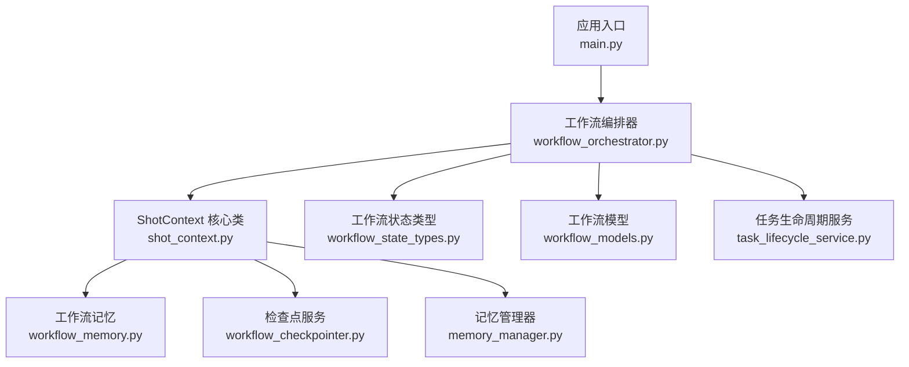
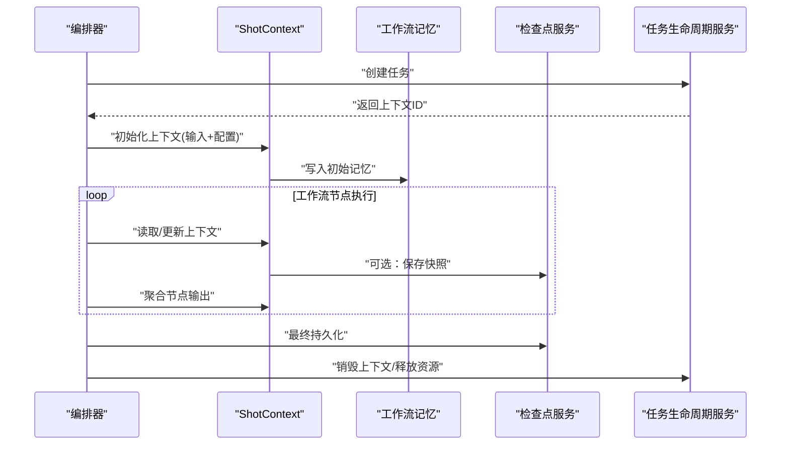
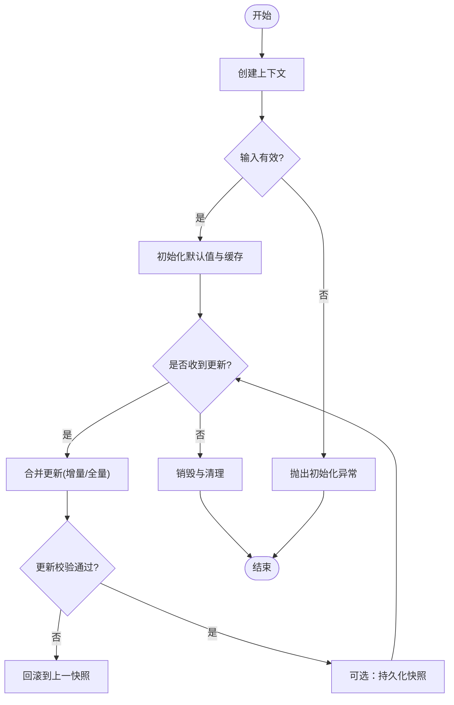
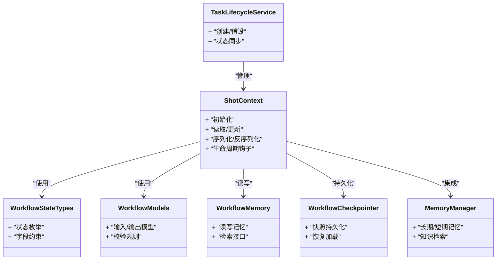

# ShotContext核心类

<cite>
**本文引用的文件**   
- [shot_context.py](file://src/penshot/shot_context.py)
- [workflow_state_types.py](file://src/penshot/neopen/agent/workflow/workflow_state_types.py)
- [workflow_models.py](file://src/penshot/neopen/agent/workflow/workflow_models.py)
- [workflow_orchestrator.py](file://src/penshot/neopen/agent/workflow/workflow_orchestrator.py)
- [workflow_memory.py](file://src/penshot/neopen/agent/workflow/workflow_memory.py)
- [workflow_checkpointer.py](file://src/penshot/neopen/agent/workflow/workflow_checkpointer.py)
- [task_lifecycle_service.py](file://src/penshot/neopen/task/task_lifecycle_service.py)
- [memory_manager.py](file://src/penshot/neopen/knowledge/memory/memory_manager.py)
</cite>

## 目录
1. [简介](#简介)
2. [项目结构](#项目结构)
3. [核心组件](#核心组件)
4. [架构总览](#架构总览)
5. [详细组件分析](#详细组件分析)
6. [依赖分析](#依赖分析)
7. [性能考虑](#性能考虑)
8. [故障排查指南](#故障排查指南)
9. [结论](#结论)
10. [附录](#附录)

## 简介
本文件聚焦于ShotContext核心类的系统化文档，围绕其设计架构、上下文数据结构与组织方式、属性定义与初始化流程、生命周期管理（创建/更新/销毁）、线程安全与并发一致性保障、最佳实践与常见使用模式、序列化与持久化机制，以及错误处理与异常恢复策略进行全面阐述。目标是帮助开发者快速理解并正确使用该上下文对象，确保在复杂工作流中实现稳定、可观测、可扩展的运行时状态管理。

## 项目结构
ShotContext位于neopen子模块中，作为工作流与任务执行的核心运行时载体，贯穿脚本解析、镜头分割、视频切分、质量审计等Agent链路的各个阶段。其典型调用路径包括：
- 工作流编排器在工作节点间传递上下文
- 记忆管理器读写长期/短期记忆
- 检查点服务进行快照持久化
- 任务生命周期服务协调上下文的创建与回收

图表来源
- [workflow_orchestrator.py](file://src/penshot/neopen/agent/workflow/workflow_orchestrator.py)
- [shot_context.py](file://src/penshot/shot_context.py)
- [workflow_state_types.py](file://src/penshot/neopen/agent/workflow/workflow_state_types.py)
- [workflow_models.py](file://src/penshot/neopen/agent/workflow/workflow_models.py)
- [workflow_memory.py](file://src/penshot/neopen/agent/workflow/workflow_memory.py)
- [workflow_checkpointer.py](file://src/penshot/neopen/agent/workflow/workflow_checkpointer.py)
- [task_lifecycle_service.py](file://src/penshot/neopen/task/task_lifecycle_service.py)
- [memory_manager.py](file://src/penshot/neopen/knowledge/memory/memory_manager.py)

章节来源
- [workflow_orchestrator.py](file://src/penshot/neopen/agent/workflow/workflow_orchestrator.py)
- [shot_context.py](file://src/penshot/shot_context.py)

## 核心组件
本节对ShotContext的关键职责与内部结构进行概览性说明：
- 上下文数据组织：以分层字典/命名空间形式承载输入参数、中间结果、配置项、日志与元数据，便于跨节点共享与版本演进。
- 属性定义：包含标识信息、运行环境、业务字段、扩展字段、统计指标与校验状态等。
- 初始化流程：从配置与工作流输入构造初始上下文，完成默认值填充、基础校验与资源准备。
- 生命周期管理：由编排器或任务服务驱动创建、更新与销毁；支持幂等更新与增量合并。
- 线程安全：通过锁或不可变快照保证并发访问一致性与可见性。
- 序列化与持久化：提供结构化序列化接口，结合检查点服务实现断点续跑与回滚。
- 错误处理：统一异常封装、降级策略与恢复钩子。

章节来源
- [shot_context.py](file://src/penshot/shot_context.py)
- [workflow_state_types.py](file://src/penshot/neopen/agent/workflow/workflow_state_types.py)
- [workflow_models.py](file://src/penshot/neopen/agent/workflow/workflow_models.py)

## 架构总览
下图展示了ShotContext在工作流中的位置与交互关系，以及与记忆、检查点、任务生命周期的协作方式。

图表来源
- [workflow_orchestrator.py](file://src/penshot/neopen/agent/workflow/workflow_orchestrator.py)
- [shot_context.py](file://src/penshot/shot_context.py)
- [workflow_memory.py](file://src/penshot/neopen/agent/workflow/workflow_memory.py)
- [workflow_checkpointer.py](file://src/penshot/neopen/agent/workflow/workflow_checkpointer.py)
- [task_lifecycle_service.py](file://src/penshot/neopen/task/task_lifecycle_service.py)

## 详细组件分析

### 上下文数据结构与组织
- 分层结构：顶层为会话/任务级元数据，中层为各阶段产物（如脚本解析结果、镜头分割结果），底层为工具与外部依赖的配置与缓存。
- 命名约定：采用“模块_阶段_实体”三段式键名，避免冲突并提升可读性。
- 扩展机制：预留扩展字段区，支持插件动态注入新属性而不破坏兼容性。
- 校验与约束：内置字段类型与取值范围校验，失败时抛出标准化异常。

章节来源
- [shot_context.py](file://src/penshot/shot_context.py)
- [workflow_state_types.py](file://src/penshot/neopen/agent/workflow/workflow_state_types.py)

### 属性定义与初始化流程
- 必填属性：上下文唯一标识、输入源描述、语言与区域设置、时间戳等。
- 可选属性：提示词模板、阈值参数、重试策略、日志级别等。
- 初始化步骤：
  1) 加载配置与环境变量
  2) 构建基础字段与默认值
  3) 执行输入校验与规范化
  4) 预分配内存与缓存
  5) 注册回调与钩子（如清理、审计）

章节来源
- [shot_context.py](file://src/penshot/shot_context.py)
- [workflow_models.py](file://src/penshot/neopen/agent/workflow/workflow_models.py)

### 生命周期管理（创建/更新/销毁）
- 创建：由任务生命周期服务或编排器触发，传入输入与配置，生成不可变初始快照。
- 更新：支持增量更新与全量覆盖两种模式；增量更新需保证幂等与顺序一致性。
- 销毁：释放外部资源（文件句柄、网络连接）、清空大对象引用、记录生命周期指标。

图表来源
- [shot_context.py](file://src/penshot/shot_context.py)
- [workflow_checkpointer.py](file://src/penshot/neopen/agent/workflow/workflow_checkpointer.py)
- [task_lifecycle_service.py](file://src/penshot/neopen/task/task_lifecycle_service.py)

### 线程安全与并发一致性
- 并发控制：对可变状态访问加锁，读多写少场景下采用读写锁或无锁快照策略。
- 一致性保证：更新操作基于版本号或时间戳比较，避免脏写；关键路径使用原子合并。
- 可见性：更新完成后发布事件通知订阅者，确保下游节点获取最新状态。
- 死锁规避：严格规定锁粒度与获取顺序，禁止在持有锁时进行外部I/O。

章节来源
- [shot_context.py](file://src/penshot/shot_context.py)

### 序列化与持久化
- 序列化格式：优先使用结构化二进制或紧凑JSON，保留类型信息与元数据。
- 持久化策略：
  - 本地磁盘：按任务ID分目录存储，支持压缩与索引。
  - 远程存储：对接对象存储或数据库，具备重试与幂等写入。
- 断点续跑：启动时检测是否存在最新快照，若存在则恢复上下文状态继续执行。
- 版本兼容：序列化工具支持向前/向后兼容，迁移旧格式时自动转换。

章节来源
- [shot_context.py](file://src/penshot/shot_context.py)
- [workflow_checkpointer.py](file://src/penshot/neopen/agent/workflow/workflow_checkpointer.py)

### 错误处理与异常恢复
- 异常分类：输入校验错误、资源不可用、序列化失败、并发冲突等。
- 恢复策略：
  - 重试与退避：对瞬时错误采用指数退避重试。
  - 降级执行：当依赖不可用时切换到规则分支或缓存结果。
  - 补偿事务：部分失败时执行反向操作，保持上下文一致性。
- 可观测性：记录异常堆栈、上下文快照摘要与关键指标，便于定位问题。

章节来源
- [shot_context.py](file://src/penshot/shot_context.py)

### 最佳实践与常见使用模式
- 最小变更原则：仅更新必要字段，减少锁竞争与序列化开销。
- 批量更新：将多次小更新合并为一次提交，降低持久化频率。
- 只读视图：下游节点尽量使用快照副本，避免直接修改共享上下文。
- 超时与熔断：对耗时操作设置超时，失败后快速失败并回退。
- 监控与告警：对上下文大小、更新频率、持久化延迟等指标进行监控。

[本节为通用指导，不直接分析具体文件]

## 依赖分析
ShotContext与其他模块的耦合关系如下：

图表来源
- [shot_context.py](file://src/penshot/shot_context.py)
- [workflow_state_types.py](file://src/penshot/neopen/agent/workflow/workflow_state_types.py)
- [workflow_models.py](file://src/penshot/neopen/agent/workflow/workflow_models.py)
- [workflow_memory.py](file://src/penshot/neopen/agent/workflow/workflow_memory.py)
- [workflow_checkpointer.py](file://src/penshot/neopen/agent/workflow/workflow_checkpointer.py)
- [task_lifecycle_service.py](file://src/penshot/neopen/task/task_lifecycle_service.py)
- [memory_manager.py](file://src/penshot/neopen/knowledge/memory/memory_manager.py)

章节来源
- [workflow_orchestrator.py](file://src/penshot/neopen/agent/workflow/workflow_orchestrator.py)
- [shot_context.py](file://src/penshot/shot_context.py)

## 性能考虑
- 内存占用：限制上下文最大体积，及时释放不再使用的中间结果。
- 序列化成本：按需序列化，避免频繁落盘；对热点数据使用内存缓存。
- 并发吞吐：采用无锁快照与批量更新，减少锁等待。
- I/O优化：异步持久化与批处理写入，降低阻塞概率。
- 缓存策略：对计算密集型结果启用多级缓存（进程内/分布式）。

[本节为通用指导，不直接分析具体文件]

## 故障排查指南
- 常见问题：
  - 上下文初始化失败：检查输入合法性与配置完整性。
  - 并发冲突：确认更新是否幂等，检查版本号或时间戳逻辑。
  - 持久化失败：验证存储权限、磁盘空间与网络连通性。
  - 恢复异常：核对快照版本与当前代码兼容性。
- 诊断手段：
  - 开启调试日志，捕获上下文快照摘要。
  - 使用检查点服务导出最近快照进行分析。
  - 对关键路径添加埋点，统计耗时与错误率。

章节来源
- [shot_context.py](file://src/penshot/shot_context.py)
- [workflow_checkpointer.py](file://src/penshot/neopen/agent/workflow/workflow_checkpointer.py)

## 结论
ShotContext作为工作流的核心运行时载体，提供了清晰的数据组织、严格的初始化与生命周期管理、可靠的并发一致性与完善的持久化能力。遵循本文的最佳实践与排障建议，可在复杂任务链路中实现高可用、高性能与易维护的上下文管理。

[本节为总结性内容，不直接分析具体文件]

## 附录
- 术语表：
  - 上下文：工作流执行过程中的运行时状态集合。
  - 快照：某一时刻上下文状态的不可变副本。
  - 检查点：用于恢复执行的持久化快照。
- 参考路径：
  - 核心实现：[shot_context.py](file://src/penshot/shot_context.py)
  - 状态与模型：[workflow_state_types.py](file://src/penshot/neopen/agent/workflow/workflow_state_types.py)、[workflow_models.py](file://src/penshot/neopen/agent/workflow/workflow_models.py)
  - 编排与记忆：[workflow_orchestrator.py](file://src/penshot/neopen/agent/workflow/workflow_orchestrator.py)、[workflow_memory.py](file://src/penshot/neopen/agent/workflow/workflow_memory.py)
  - 持久化与任务：[workflow_checkpointer.py](file://src/penshot/neopen/agent/workflow/workflow_checkpointer.py)、[task_lifecycle_service.py](file://src/penshot/neopen/task/task_lifecycle_service.py)
  - 知识记忆：[memory_manager.py](file://src/penshot/neopen/knowledge/memory/memory_manager.py)