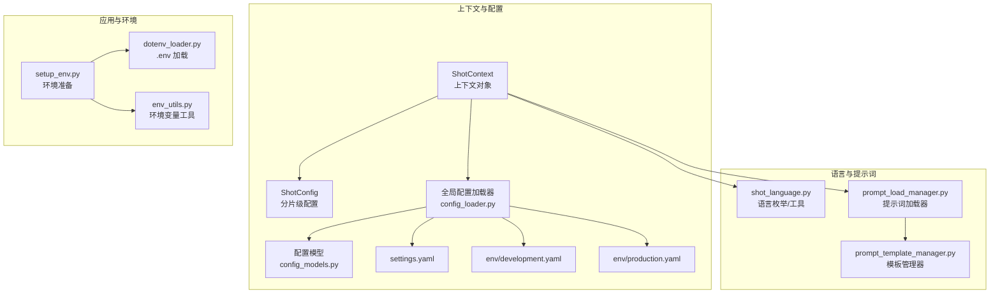
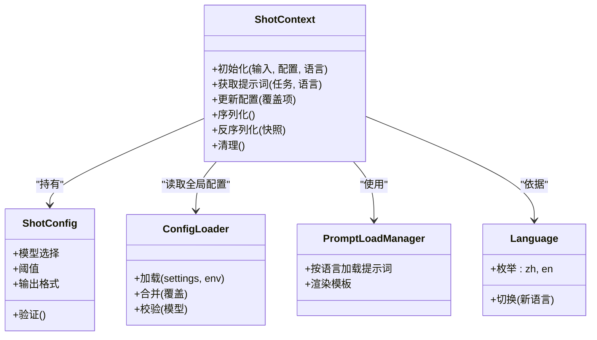
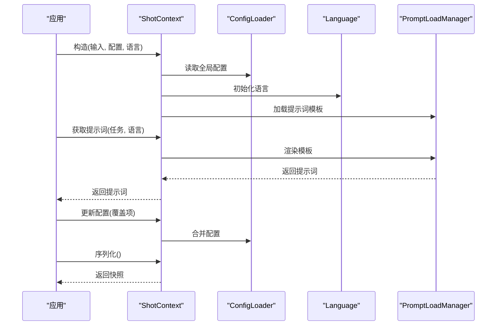
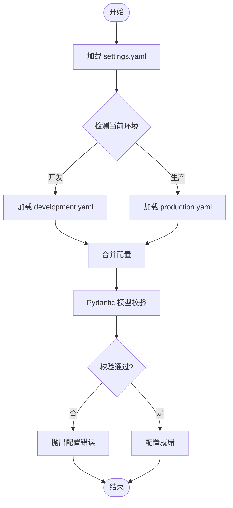
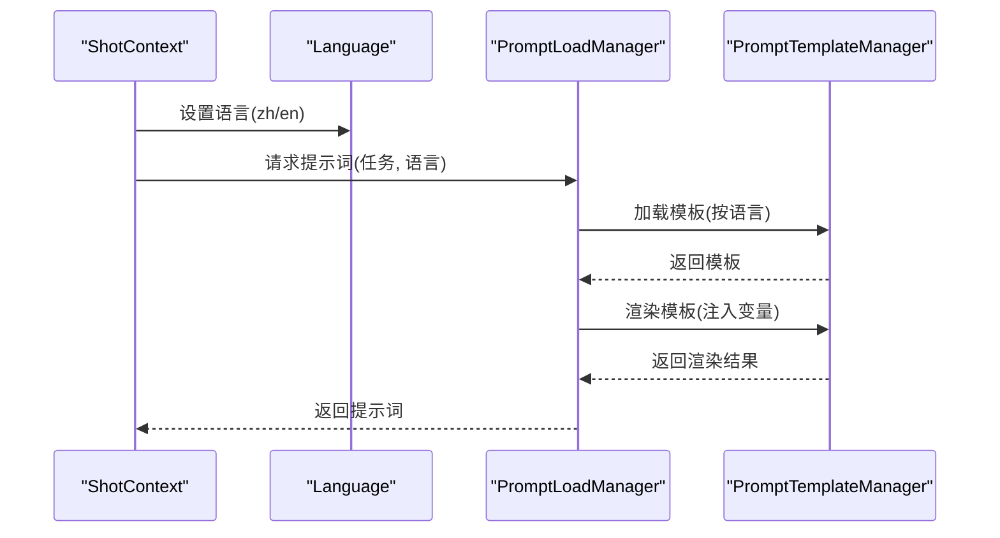
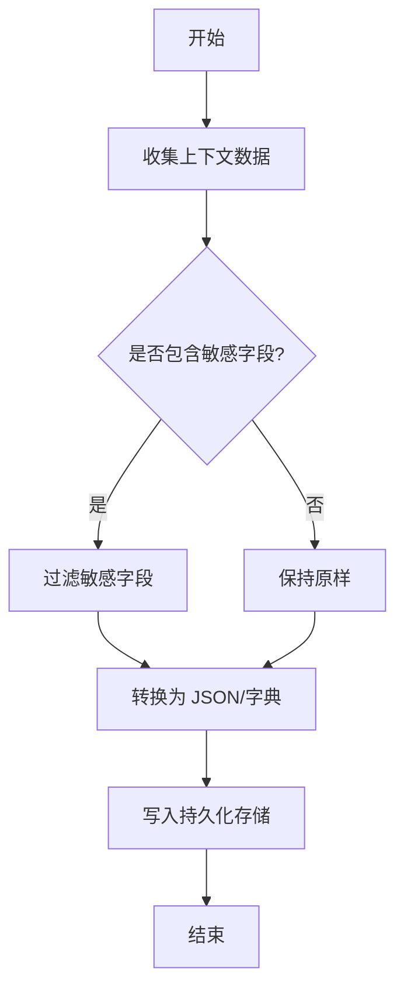
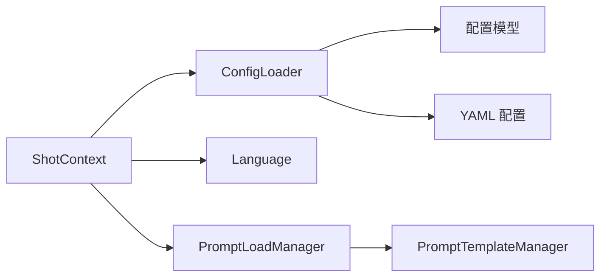

# 上下文管理

<cite>
**本文引用的文件**   
- [src/penshot/neopen/shot_context.py](file://src/penshot/neopen/shot_context.py)
- [src/penshot/neopen/shot_config.py](file://src/penshot/neopen/shot_config.py)
- [src/penshot/neopen/shot_language.py](file://src/penshot/neopen/shot_language.py)
- [src/penshot/config/config.py](file://src/penshot/config/config.py)
- [src/penshot/config/config_loader.py](file://src/penshot/config/config_loader.py)
- [src/penshot/config/config_models.py](file://src/penshot/config/config_models.py)
- [src/penshot/config/settings.yaml](file://src/penshot/config/settings.yaml)
- [src/penshot/config/env/development.yaml](file://src/penshot/config/env/development.yaml)
- [src/penshot/config/env/production.yaml](file://src/penshot/config/env/production.yaml)
- [src/penshot/app/setup_env.py](file://src/penshot/app/setup_env.py)
- [src/penshot/utils/dotenv_loader.py](file://src/penshot/utils/dotenv_loader.py)
- [src/penshot/utils/env_utils.py](file://src/penshot/utils/env_utils.py)
- [src/penshot/neopen/prompts/prompt_load_manager.py](file://src/penshot/neopen/prompts/prompt_load_manager.py)
- [src/penshot/neopen/prompts/prompt_template_manager.py](file://src/penshot/neopen/prompts/prompt_template_manager.py)
- [examples/direct_usage.py](file://examples/direct_usage.py)
</cite>

## 目录
1. [简介](#简介)
2. [项目结构](#项目结构)
3. [核心组件](#核心组件)
4. [架构总览](#架构总览)
5. [详细组件分析](#详细组件分析)
6. [依赖关系分析](#依赖关系分析)
7. [性能考虑](#性能考虑)
8. [故障排查指南](#故障排查指南)
9. [结论](#结论)
10. [附录](#附录)

## 简介
本文件围绕“上下文管理系统”展开，聚焦以下目标：
- 深入解析 ShotContext 类的设计与实现，包括上下文数据的组织结构、生命周期管理、线程安全机制。
- 阐述配置管理系统：多环境配置加载、动态配置更新、配置验证规则。
- 说明语言支持系统：多语言提示词管理、本地化策略、语言切换机制。
- 提供上下文初始化与使用的代码示例路径、最佳实践与常见陷阱。
- 覆盖上下文的序列化、持久化与恢复的实现细节。

## 项目结构
与上下文管理相关的核心模块分布在 neopen 子包与 config 子包中：
- 上下文与配置：ShotContext、ShotConfig、全局配置加载器与模型定义。
- 语言与提示词：PromptLoadManager、PromptTemplateManager、语言枚举与工具。
- 应用与环境：环境变量加载、设置注入、运行时环境准备。
- 示例与集成：直接调用示例，展示如何创建和使用上下文。

图表来源
- [src/penshot/neopen/shot_context.py](file://src/penshot/neopen/shot_context.py)
- [src/penshot/neopen/shot_config.py](file://src/penshot/neopen/shot_config.py)
- [src/penshot/config/config_loader.py](file://src/penshot/config/config_loader.py)
- [src/penshot/config/config_models.py](file://src/penshot/config/config_models.py)
- [src/penshot/config/settings.yaml](file://src/penshot/config/settings.yaml)
- [src/penshot/config/env/development.yaml](file://src/penshot/config/env/development.yaml)
- [src/penshot/config/env/production.yaml](file://src/penshot/config/env/production.yaml)
- [src/penshot/neopen/shot_language.py](file://src/penshot/neopen/shot_language.py)
- [src/penshot/neopen/prompts/prompt_load_manager.py](file://src/penshot/neopen/prompts/prompt_load_manager.py)
- [src/penshot/neopen/prompts/prompt_template_manager.py](file://src/penshot/neopen/prompts/prompt_template_manager.py)
- [src/penshot/app/setup_env.py](file://src/penshot/app/setup_env.py)
- [src/penshot/utils/dotenv_loader.py](file://src/penshot/utils/dotenv_loader.py)
- [src/penshot/utils/env_utils.py](file://src/penshot/utils/env_utils.py)

章节来源
- [src/penshot/neopen/shot_context.py](file://src/penshot/neopen/shot_context.py)
- [src/penshot/config/config_loader.py](file://src/penshot/config/config_loader.py)
- [src/penshot/neopen/prompts/prompt_load_manager.py](file://src/penshot/neopen/prompts/prompt_load_manager.py)
- [examples/direct_usage.py](file://examples/direct_usage.py)

## 核心组件
本节对关键组件进行概览性说明，后续章节将给出更深入的实现分析与图示。

- ShotContext：封装一次“分片处理”的完整运行期上下文，包含输入数据、中间结果、配置、语言与提示词、日志与追踪信息、以及用于序列化的元数据。
- ShotConfig：分片级配置对象，承载该次处理的参数（如模型选择、阈值、输出格式等），通常由全局配置派生或覆盖。
- 配置加载器与模型：负责从 settings.yaml 与环境特定 YAML 文件中加载配置，并通过 Pydantic 模型进行校验与类型转换。
- 语言与提示词：通过语言枚举与提示词加载器，按当前语言选择并渲染对应提示词模板。
- 环境准备：在应用启动时加载 .env、设置环境变量、注入默认配置，确保上下文可用。

章节来源
- [src/penshot/neopen/shot_context.py](file://src/penshot/neopen/shot_context.py)
- [src/penshot/neopen/shot_config.py](file://src/penshot/neopen/shot_config.py)
- [src/penshot/config/config_loader.py](file://src/penshot/config/config_loader.py)
- [src/penshot/config/config_models.py](file://src/penshot/config/config_models.py)
- [src/penshot/neopen/shot_language.py](file://src/penshot/neopen/shot_language.py)
- [src/penshot/neopen/prompts/prompt_load_manager.py](file://src/penshot/neopen/prompts/prompt_load_manager.py)
- [src/penshot/app/setup_env.py](file://src/penshot/app/setup_env.py)

## 架构总览
下图展示了上下文在应用中的位置及其与配置、语言、提示词的关系。

图表来源
- [src/penshot/neopen/shot_context.py](file://src/penshot/neopen/shot_context.py)
- [src/penshot/neopen/shot_config.py](file://src/penshot/neopen/shot_config.py)
- [src/penshot/config/config_loader.py](file://src/penshot/config/config_loader.py)
- [src/penshot/neopen/prompts/prompt_load_manager.py](file://src/penshot/neopen/prompts/prompt_load_manager.py)
- [src/penshot/neopen/shot_language.py](file://src/penshot/neopen/shot_language.py)

## 详细组件分析

### ShotContext 设计与实现
- 数据结构组织
  - 输入与中间状态：以字典或结构化对象保存，便于扩展与序列化。
  - 配置引用：指向 ShotConfig 实例，支持局部覆盖。
  - 语言与提示词：根据当前语言选择提示词模板并渲染。
  - 元数据与追踪：记录版本、时间戳、会话ID、错误信息等。
- 生命周期管理
  - 初始化阶段：加载配置、初始化语言与提示词、校验输入。
  - 运行阶段：提供方法更新上下文、获取提示词、写入中间结果。
  - 结束阶段：清理临时资源、生成最终快照。
- 线程安全机制
  - 若上下文被多线程共享，应使用锁保护可变状态；否则推荐每线程/协程独立实例。
  - 对外暴露的写操作建议加锁或采用不可变更新模式。
- 序列化、持久化与恢复
  - 序列化：将上下文转换为可持久化的字典或 JSON。
  - 持久化：保存到文件或外部存储（例如数据库）。
  - 恢复：从快照重建上下文，必要时重新加载提示词与配置。

图表来源
- [src/penshot/neopen/shot_context.py](file://src/penshot/neopen/shot_context.py)
- [src/penshot/config/config_loader.py](file://src/penshot/config/config_loader.py)
- [src/penshot/neopen/shot_language.py](file://src/penshot/neopen/shot_language.py)
- [src/penshot/neopen/prompts/prompt_load_manager.py](file://src/penshot/neopen/prompts/prompt_load_manager.py)

章节来源
- [src/penshot/neopen/shot_context.py](file://src/penshot/neopen/shot_context.py)

### 配置管理系统
- 多环境配置加载
  - 基础配置：settings.yaml 提供默认值。
  - 环境覆盖：env/development.yaml、env/production.yaml 提供差异化配置。
  - 加载顺序：先加载基础配置，再按当前环境合并覆盖。
- 动态配置更新
  - 运行时可通过覆盖项合并到当前配置，避免重启服务。
  - 建议对敏感字段（如密钥）做最小权限访问与审计。
- 配置验证规则
  - 使用 Pydantic 模型定义字段类型、默认值与约束。
  - 加载后执行校验，失败则抛出明确错误，便于快速定位问题。

图表来源
- [src/penshot/config/config_loader.py](file://src/penshot/config/config_loader.py)
- [src/penshot/config/config_models.py](file://src/penshot/config/config_models.py)
- [src/penshot/config/settings.yaml](file://src/penshot/config/settings.yaml)
- [src/penshot/config/env/development.yaml](file://src/penshot/config/env/development.yaml)
- [src/penshot/config/env/production.yaml](file://src/penshot/config/env/production.yaml)

章节来源
- [src/penshot/config/config_loader.py](file://src/penshot/config/config_loader.py)
- [src/penshot/config/config_models.py](file://src/penshot/config/config_models.py)
- [src/penshot/config/settings.yaml](file://src/penshot/config/settings.yaml)
- [src/penshot/config/env/development.yaml](file://src/penshot/config/env/development.yaml)
- [src/penshot/config/env/production.yaml](file://src/penshot/config/env/production.yaml)

### 语言支持系统
- 多语言提示词管理
  - 提示词按语言与版本组织，通过 PromptLoadManager 统一加载。
  - 支持模板渲染，将上下文变量注入到提示词中。
- 本地化策略
  - 语言枚举集中管理，避免硬编码字符串。
  - 缺失语言回退策略：优先当前语言，其次默认语言。
- 语言切换机制
  - 在上下文内切换语言后，自动刷新相关提示词缓存。
  - 切换时需保证已加载所需语言的提示词模板。

图表来源
- [src/penshot/neopen/shot_language.py](file://src/penshot/neopen/shot_language.py)
- [src/penshot/neopen/prompts/prompt_load_manager.py](file://src/penshot/neopen/prompts/prompt_load_manager.py)
- [src/penshot/neopen/prompts/prompt_template_manager.py](file://src/penshot/neopen/prompts/prompt_template_manager.py)

章节来源
- [src/penshot/neopen/shot_language.py](file://src/penshot/neopen/shot_language.py)
- [src/penshot/neopen/prompts/prompt_load_manager.py](file://src/penshot/neopen/prompts/prompt_load_manager.py)
- [src/penshot/neopen/prompts/prompt_template_manager.py](file://src/penshot/neopen/prompts/prompt_template_manager.py)

### 上下文初始化与使用示例
- 初始化步骤
  - 准备环境变量与基础配置。
  - 构建 ShotConfig（可选覆盖）。
  - 指定语言并构造 ShotContext。
- 使用流程
  - 获取提示词并执行任务。
  - 更新上下文状态与中间结果。
  - 完成时序列化并持久化快照。
- 示例路径
  - 参考直接调用示例，了解如何创建上下文、设置语言、获取提示词与序列化。

章节来源
- [examples/direct_usage.py](file://examples/direct_usage.py)
- [src/penshot/app/setup_env.py](file://src/penshot/app/setup_env.py)
- [src/penshot/utils/dotenv_loader.py](file://src/penshot/utils/dotenv_loader.py)
- [src/penshot/utils/env_utils.py](file://src/penshot/utils/env_utils.py)

### 最佳实践与常见陷阱
- 最佳实践
  - 为每个并发任务创建独立的上下文实例，避免共享可变状态。
  - 使用配置模型校验，尽早发现不合法配置。
  - 语言切换前确认对应语言提示词已加载。
  - 序列化前清理敏感信息（如密钥、临时文件路径）。
- 常见陷阱
  - 跨线程共享未加锁的上下文导致竞态条件。
  - 动态更新配置后未刷新提示词缓存。
  - 缺少回退语言导致提示词渲染失败。
  - 序列化大对象造成内存压力，建议分页或流式处理。

[本节为通用指导，不直接分析具体文件]

### 上下文序列化、持久化与恢复
- 序列化
  - 将上下文转为字典/JSON，保留必要元数据与中间结果。
  - 过滤敏感字段，确保数据安全。
- 持久化
  - 保存到文件系统或数据库，附带版本号与时间戳。
- 恢复
  - 从快照重建上下文，必要时重新加载配置与提示词。
  - 校验快照完整性与兼容性。

[此图为概念流程，无需图表来源]

章节来源
- [src/penshot/neopen/shot_context.py](file://src/penshot/neopen/shot_context.py)

## 依赖关系分析
- 组件耦合
  - ShotContext 依赖配置加载器、语言与提示词管理器，形成松耦合的组合关系。
  - 配置加载器依赖 Pydantic 模型与环境 YAML 文件。
- 外部依赖
  - 配置文件（YAML）、环境变量（.env）、提示词模板（按语言与版本）。
- 潜在循环依赖
  - 应避免上下文与提示词管理器互相强引用，建议使用接口或工厂解耦。

图表来源
- [src/penshot/neopen/shot_context.py](file://src/penshot/neopen/shot_context.py)
- [src/penshot/config/config_loader.py](file://src/penshot/config/config_loader.py)
- [src/penshot/config/config_models.py](file://src/penshot/config/config_models.py)
- [src/penshot/neopen/prompts/prompt_load_manager.py](file://src/penshot/neopen/prompts/prompt_load_manager.py)
- [src/penshot/neopen/prompts/prompt_template_manager.py](file://src/penshot/neopen/prompts/prompt_template_manager.py)

章节来源
- [src/penshot/neopen/shot_context.py](file://src/penshot/neopen/shot_context.py)
- [src/penshot/config/config_loader.py](file://src/penshot/config/config_loader.py)
- [src/penshot/neopen/prompts/prompt_load_manager.py](file://src/penshot/neopen/prompts/prompt_load_manager.py)

## 性能考虑
- 配置加载
  - 预编译与缓存提示词模板，减少重复 I/O。
  - 按需加载环境配置，避免一次性加载所有环境。
- 上下文操作
  - 使用不可变更新模式减少锁竞争。
  - 大对象序列化时采用增量写入或压缩。
- 语言切换
  - 缓存各语言提示词，切换时仅替换指针，避免重复渲染。

[本节为通用指导，不直接分析具体文件]

## 故障排查指南
- 配置错误
  - 检查 settings.yaml 与环境的差异键值，确认 Pydantic 模型约束。
  - 查看加载顺序与覆盖逻辑，确认优先级正确。
- 语言与提示词
  - 确认当前语言对应的提示词模板存在且可渲染。
  - 检查模板变量是否齐全，避免空值或缺失键。
- 线程安全
  - 若出现竞态条件，检查是否存在共享上下文且未加锁。
  - 改为每线程/协程独立实例或引入读写锁。
- 序列化与恢复
  - 校验快照版本与兼容性，避免旧格式无法恢复。
  - 过滤敏感字段，防止泄露。

章节来源
- [src/penshot/config/config_loader.py](file://src/penshot/config/config_loader.py)
- [src/penshot/config/config_models.py](file://src/penshot/config/config_models.py)
- [src/penshot/neopen/prompts/prompt_load_manager.py](file://src/penshot/neopen/prompts/prompt_load_manager.py)
- [src/penshot/neopen/shot_context.py](file://src/penshot/neopen/shot_context.py)

## 结论
本文件系统化梳理了上下文管理系统的核心设计：ShotContext 的数据组织与生命周期、配置管理的多环境与动态更新、语言支持与提示词渲染、以及序列化与恢复流程。遵循最佳实践与注意事项，可在保证线程安全与性能的同时，提升系统的可维护性与可扩展性。

[本节为总结，不直接分析具体文件]

## 附录
- 示例与入口
  - 直接调用示例：展示如何初始化上下文、设置语言、获取提示词与序列化。
  - 环境准备：加载 .env、设置环境变量、注入默认配置。

章节来源
- [examples/direct_usage.py](file://examples/direct_usage.py)
- [src/penshot/app/setup_env.py](file://src/penshot/app/setup_env.py)
- [src/penshot/utils/dotenv_loader.py](file://src/penshot/utils/dotenv_loader.py)
- [src/penshot/utils/env_utils.py](file://src/penshot/utils/env_utils.py)