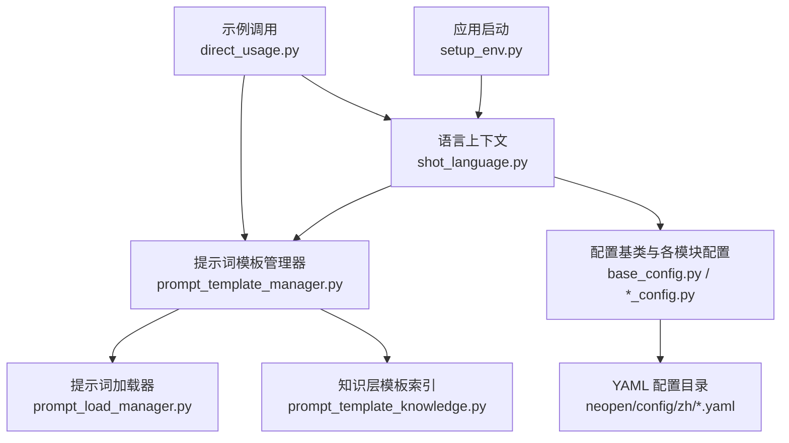
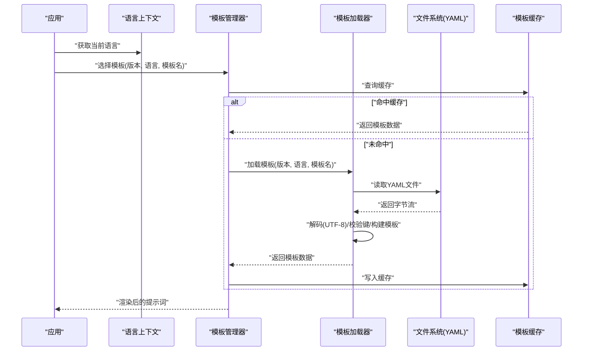
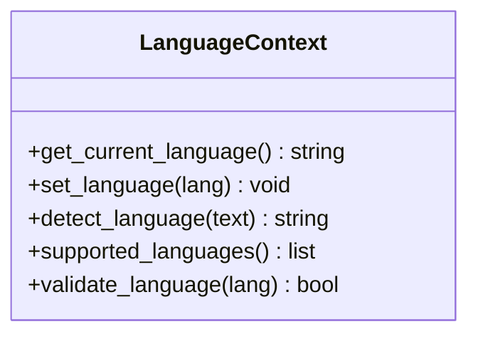
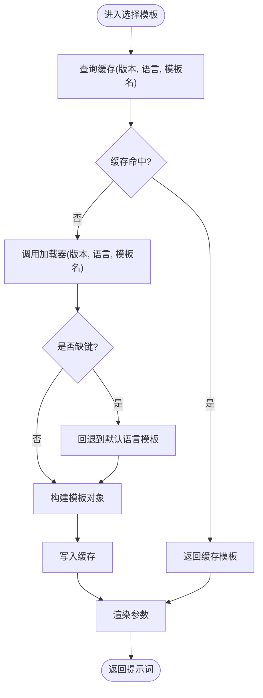
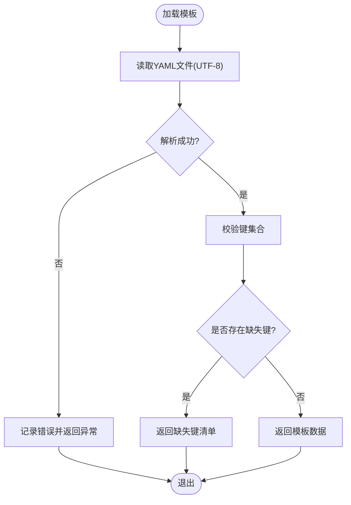
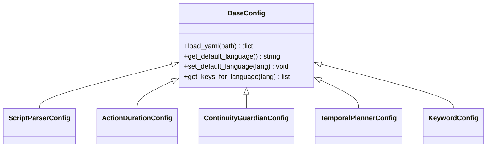
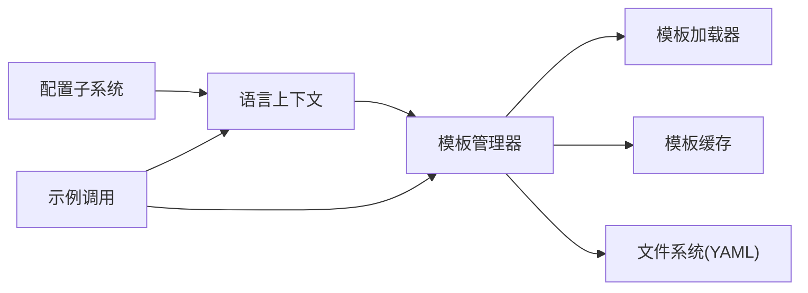

# 语言支持系统

<cite>
**本文引用的文件**   
- [src/penshot/neopen/shot_language.py](file://src/penshot/neopen/shot_language.py)
- [src/penshot/neopen/prompts/prompt_template_manager.py](file://src/penshot/neopen/prompts/prompt_template_manager.py)
- [src/penshot/neopen/prompts/prompt_load_manager.py](file://src/penshot/neopen/prompts/prompt_load_manager.py)
- [src/penshot/neopen/config/base_config.py](file://src/penshot/neopen/config/base_config.py)
- [src/penshot/neopen/config/script_parser_config.py](file://src/penshot/neopen/config/script_parser_config.py)
- [src/penshot/neopen/config/action_duration_config.py](file://src/penshot/neopen/config/action_duration_config.py)
- [src/penshot/neopen/config/continuity_guardian_config.py](file://src/penshot/neopen/config/continuity_guardian_config.py)
- [src/penshot/neopen/config/temporal_planner_config.py](file://src/penshot/neopen/config/temporal_planner_config.py)
- [src/penshot/neopen/config/keyword_config.py](file://src/penshot/neopen/config/keyword_config.py)
- [src/penshot/neopen/config/__init__.py](file://src/penshot/neopen/config/__init__.py)
- [src/penshot/utils/env_utils.py](file://src/penshot/utils/env_utils.py)
- [src/penshot/app/setup_env.py](file://src/penshot/app/setup_env.py)
- [src/penshot/neopen/knowledge/template/prompt_template_knowledge.py](file://src/penshot/neopen/knowledge/template/prompt_template_knowledge.py)
- [examples/direct_usage.py](file://examples/direct_usage.py)
</cite>

## 目录
1. [简介](#简介)
2. [项目结构](#项目结构)
3. [核心组件](#核心组件)
4. [架构总览](#架构总览)
5. [详细组件分析](#详细组件分析)
6. [依赖关系分析](#依赖关系分析)
7. [性能考虑](#性能考虑)
8. [故障排查指南](#故障排查指南)
9. [结论](#结论)
10. [附录](#附录)

## 简介
本文件面向“语言支持系统”的设计与实现，聚焦多语言提示词管理机制、运行时语言切换、缓存与回退策略、配置文件结构与扩展指南。该系统围绕以下目标展开：
- 统一的多语言提示词管理：按版本与语言组织模板，提供稳定的加载与选择接口。
- 运行时语言切换：在应用运行期动态变更语言并影响后续提示词渲染。
- 配置驱动的语言行为：通过YAML配置控制不同模块的默认语言、键值映射与回退顺序。
- 可扩展性：新增语言或新模块时，遵循约定式路径与最小侵入原则。

## 项目结构
语言相关能力主要分布在如下位置：
- 语言上下文与枚举：定义当前语言、语言检测与切换入口。
- 提示词模板管理：按版本与语言组织YAML模板，提供加载、选择与渲染接口。
- 配置模型：为各业务模块提供基于YAML的配置加载与默认语言设置。
- 环境初始化：在应用启动阶段注入环境变量与默认语言。
- 示例与集成：演示如何在任务或工作流中读取当前语言并渲染对应模板。

图表来源
- [src/penshot/app/setup_env.py](file://src/penshot/app/setup_env.py)
- [src/penshot/neopen/shot_language.py](file://src/penshot/neopen/shot_language.py)
- [src/penshot/neopen/prompts/prompt_template_manager.py](file://src/penshot/neopen/prompts/prompt_template_manager.py)
- [src/penshot/neopen/prompts/prompt_load_manager.py](file://src/penshot/neopen/prompts/prompt_load_manager.py)
- [src/penshot/neopen/config/base_config.py](file://src/penshot/neopen/config/base_config.py)
- [src/penshot/neopen/config/script_parser_config.py](file://src/penshot/neopen/config/script_parser_config.py)
- [src/penshot/neopen/config/action_duration_config.py](file://src/penshot/neopen/config/action_duration_config.py)
- [src/penshot/neopen/config/continuity_guardian_config.py](file://src/penshot/neopen/config/continuity_guardian_config.py)
- [src/penshot/neopen/config/temporal_planner_config.py](file://src/penshot/neopen/config/temporal_planner_config.py)
- [src/penshot/neopen/config/keyword_config.py](file://src/penshot/neopen/config/keyword_config.py)
- [src/penshot/neopen/knowledge/template/prompt_template_knowledge.py](file://src/penshot/neopen/knowledge/template/prompt_template_knowledge.py)
- [examples/direct_usage.py](file://examples/direct_usage.py)

章节来源
- [src/penshot/app/setup_env.py](file://src/penshot/app/setup_env.py)
- [src/penshot/neopen/shot_language.py](file://src/penshot/neopen/shot_language.py)
- [src/penshot/neopen/prompts/prompt_template_manager.py](file://src/penshot/neopen/prompts/prompt_template_manager.py)
- [src/penshot/neopen/prompts/prompt_load_manager.py](file://src/penshot/neopen/prompts/prompt_load_manager.py)
- [src/penshot/neopen/config/base_config.py](file://src/penshot/neopen/config/base_config.py)
- [src/penshot/neopen/config/script_parser_config.py](file://src/penshot/neopen/config/script_parser_config.py)
- [src/penshot/neopen/config/action_duration_config.py](file://src/penshot/neopen/config/action_duration_config.py)
- [src/penshot/neopen/config/continuity_guardian_config.py](file://src/penshot/neopen/config/continuity_guardian_config.py)
- [src/penshot/neopen/config/temporal_planner_config.py](file://src/penshot/neopen/config/temporal_planner_config.py)
- [src/penshot/neopen/config/keyword_config.py](file://src/penshot/neopen/config/keyword_config.py)
- [src/penshot/neopen/knowledge/template/prompt_template_knowledge.py](file://src/penshot/neopen/knowledge/template/prompt_template_knowledge.py)
- [examples/direct_usage.py](file://examples/direct_usage.py)

## 核心组件
- 语言上下文（Language Context）
  - 职责：维护当前语言、提供语言检测与切换接口、暴露全局可读的语言状态。
  - 关键点：线程安全、可被上层服务快速读取；支持从环境变量或配置推导默认语言。
- 提示词模板管理器（Prompt Template Manager）
  - 职责：根据“版本+语言+模板名”选择并加载YAML模板；负责渲染参数替换；维护模板缓存。
  - 关键点：版本隔离（v1.x/v2.x）、语言子目录、缺失键回退到默认语言、模板级缓存。
- 提示词加载器（Prompt Loader）
  - 职责：解析YAML文件、校验键存在性、处理编码与异常、返回结构化模板数据。
  - 关键点：UTF-8强制、错误信息包含定位信息（文件/键）。
- 配置基类与各模块配置（Base Config & Module Configs）
  - 职责：为脚本解析、动作时长、连续性守护、时间规划、关键词等模块提供YAML配置加载与默认语言。
  - 关键点：每个模块可指定默认语言与语言键集合；支持覆盖默认语言。
- 环境初始化（Setup Env）
  - 职责：在进程启动时注入默认语言与环境变量，确保后续组件可用。
- 知识层模板索引（Template Knowledge）
  - 职责：对模板进行索引与检索，辅助快速定位模板资源。
- 示例调用（Direct Usage）
  - 职责：演示如何获取当前语言、渲染模板、传递参数。

章节来源
- [src/penshot/neopen/shot_language.py](file://src/penshot/neopen/shot_language.py)
- [src/penshot/neopen/prompts/prompt_template_manager.py](file://src/penshot/neopen/prompts/prompt_template_manager.py)
- [src/penshot/neopen/prompts/prompt_load_manager.py](file://src/penshot/neopen/prompts/prompt_load_manager.py)
- [src/penshot/neopen/config/base_config.py](file://src/penshot/neopen/config/base_config.py)
- [src/penshot/neopen/config/script_parser_config.py](file://src/penshot/neopen/config/script_parser_config.py)
- [src/penshot/neopen/config/action_duration_config.py](file://src/penshot/neopen/config/action_duration_config.py)
- [src/penshot/neopen/config/continuity_guardian_config.py](file://src/penshot/neopen/config/continuity_guardian_config.py)
- [src/penshot/neopen/config/temporal_planner_config.py](file://src/penshot/neopen/config/temporal_planner_config.py)
- [src/penshot/neopen/config/keyword_config.py](file://src/penshot/neopen/config/keyword_config.py)
- [src/penshot/neopen/knowledge/template/prompt_template_knowledge.py](file://src/penshot/neopen/knowledge/template/prompt_template_knowledge.py)
- [examples/direct_usage.py](file://examples/direct_usage.py)

## 架构总览
语言支持系统的整体交互如下：
- 启动阶段：环境初始化设置默认语言，语言上下文生效。
- 请求阶段：业务组件通过语言上下文获取当前语言，由模板管理器按“版本+语言+模板名”选择模板。
- 加载阶段：模板加载器解析YAML，若缺键则按回退策略查找默认语言模板。
- 渲染阶段：将业务参数注入模板，生成最终提示词文本。
- 缓存阶段：已加载模板按“版本+语言+模板名”缓存，避免重复I/O。

图表来源
- [src/penshot/neopen/shot_language.py](file://src/penshot/neopen/shot_language.py)
- [src/penshot/neopen/prompts/prompt_template_manager.py](file://src/penshot/neopen/prompts/prompt_template_manager.py)
- [src/penshot/neopen/prompts/prompt_load_manager.py](file://src/penshot/neopen/prompts/prompt_load_manager.py)

## 详细组件分析

### 语言上下文（Language Context）
- 功能要点
  - 提供当前语言的读取与设置接口。
  - 支持从环境变量或配置推导默认语言。
  - 暴露语言列表与兼容性检查方法。
- 设计模式
  - 单例/全局访问点：便于跨模块共享语言状态。
  - 观察者/事件（可选）：当语言切换时通知依赖方刷新缓存。
- 关键流程
  - 初始化：读取环境变量与配置，确定默认语言。
  - 切换：更新当前语言，触发模板缓存失效或重建。
  - 检测：根据输入内容或上下文推断语言（如需要）。

图表来源
- [src/penshot/neopen/shot_language.py](file://src/penshot/neopen/shot_language.py)

章节来源
- [src/penshot/neopen/shot_language.py](file://src/penshot/neopen/shot_language.py)

### 提示词模板管理器（Prompt Template Manager）
- 功能要点
  - 按“版本+语言+模板名”选择模板。
  - 渲染模板参数，生成最终提示词。
  - 维护模板缓存，减少重复I/O。
- 回退机制
  - 若目标语言缺少键，回退到默认语言（通常为中文或英文）。
  - 若模板不存在，抛出明确错误并记录定位信息。
- 缓存策略
  - 以“版本+语言+模板名”为键缓存模板数据。
  - 语言切换时可选择性清空相关缓存。

图表来源
- [src/penshot/neopen/prompts/prompt_template_manager.py](file://src/penshot/neopen/prompts/prompt_template_manager.py)
- [src/penshot/neopen/prompts/prompt_load_manager.py](file://src/penshot/neopen/prompts/prompt_load_manager.py)

章节来源
- [src/penshot/neopen/prompts/prompt_template_manager.py](file://src/penshot/neopen/prompts/prompt_template_manager.py)
- [src/penshot/neopen/prompts/prompt_load_manager.py](file://src/penshot/neopen/prompts/prompt_load_manager.py)

### 提示词加载器（Prompt Loader）
- 功能要点
  - 解析YAML文件，校验键存在性。
  - 强制UTF-8编码，处理异常并返回结构化模板数据。
  - 提供键存在性与缺失键报告，便于回退逻辑使用。
- 错误处理
  - 文件不存在：返回明确错误信息。
  - 编码错误：捕获并转换为可读异常。
  - 键缺失：列出缺失键，供上层决定回退策略。

图表来源
- [src/penshot/neopen/prompts/prompt_load_manager.py](file://src/penshot/neopen/prompts/prompt_load_manager.py)

章节来源
- [src/penshot/neopen/prompts/prompt_load_manager.py](file://src/penshot/neopen/prompts/prompt_load_manager.py)

### 配置基类与各模块配置（Base Config & Module Configs）
- 功能要点
  - 为各模块提供YAML配置加载与默认语言设置。
  - 支持覆盖默认语言与语言键集合。
  - 提供统一的配置访问接口。
- 典型模块
  - 脚本解析配置：默认语言、关键词映射、分块策略。
  - 动作时长配置：默认语言、动作类型映射。
  - 连续性守护配置：默认语言、一致性规则。
  - 时间规划配置：默认语言、时间粒度。
  - 关键词配置：默认语言、同义词映射。

图表来源
- [src/penshot/neopen/config/base_config.py](file://src/penshot/neopen/config/base_config.py)
- [src/penshot/neopen/config/script_parser_config.py](file://src/penshot/neopen/config/script_parser_config.py)
- [src/penshot/neopen/config/action_duration_config.py](file://src/penshot/neopen/config/action_duration_config.py)
- [src/penshot/neopen/config/continuity_guardian_config.py](file://src/penshot/neopen/config/continuity_guardian_config.py)
- [src/penshot/neopen/config/temporal_planner_config.py](file://src/penshot/neopen/config/temporal_planner_config.py)
- [src/penshot/neopen/config/keyword_config.py](file://src/penshot/neopen/config/keyword_config.py)

章节来源
- [src/penshot/neopen/config/base_config.py](file://src/penshot/neopen/config/base_config.py)
- [src/penshot/neopen/config/script_parser_config.py](file://src/penshot/neopen/config/script_parser_config.py)
- [src/penshot/neopen/config/action_duration_config.py](file://src/penshot/neopen/config/action_duration_config.py)
- [src/penshot/neopen/config/continuity_guardian_config.py](file://src/penshot/neopen/config/continuity_guardian_config.py)
- [src/penshot/neopen/config/temporal_planner_config.py](file://src/penshot/neopen/config/temporal_planner_config.py)
- [src/penshot/neopen/config/keyword_config.py](file://src/penshot/neopen/config/keyword_config.py)

### 环境初始化（Setup Env）
- 功能要点
  - 在应用启动时注入默认语言与环境变量。
  - 确保语言上下文与配置子系统可用。
- 最佳实践
  - 使用显式环境变量覆盖默认值。
  - 在容器化部署中通过环境变量注入语言偏好。

章节来源
- [src/penshot/app/setup_env.py](file://src/penshot/app/setup_env.py)
- [src/penshot/utils/env_utils.py](file://src/penshot/utils/env_utils.py)

### 知识层模板索引（Template Knowledge）
- 功能要点
  - 对模板进行索引与检索，辅助快速定位模板资源。
  - 与模板管理器协作，提升选择效率。

章节来源
- [src/penshot/neopen/knowledge/template/prompt_template_knowledge.py](file://src/penshot/neopen/knowledge/template/prompt_template_knowledge.py)

### 示例调用（Direct Usage）
- 功能要点
  - 演示如何获取当前语言、渲染模板、传递参数。
  - 展示语言切换后模板选择的即时效果。

章节来源
- [examples/direct_usage.py](file://examples/direct_usage.py)

## 依赖关系分析
- 组件耦合
  - 语言上下文为所有组件提供语言状态，属于低耦合高内聚。
  - 模板管理器依赖加载器与缓存，形成清晰的分层。
  - 配置子系统独立于模板系统，但可为模板选择提供默认语言。
- 外部依赖
  - YAML解析库（用于加载配置文件与模板）。
  - 文件系统（读取YAML模板与配置）。
- 潜在循环依赖
  - 应避免模板管理器反向依赖语言上下文导致循环；建议通过构造函数注入或全局只读访问。

图表来源
- [src/penshot/neopen/shot_language.py](file://src/penshot/neopen/shot_language.py)
- [src/penshot/neopen/prompts/prompt_template_manager.py](file://src/penshot/neopen/prompts/prompt_template_manager.py)
- [src/penshot/neopen/prompts/prompt_load_manager.py](file://src/penshot/neopen/prompts/prompt_load_manager.py)
- [src/penshot/neopen/config/base_config.py](file://src/penshot/neopen/config/base_config.py)
- [examples/direct_usage.py](file://examples/direct_usage.py)

章节来源
- [src/penshot/neopen/shot_language.py](file://src/penshot/neopen/shot_language.py)
- [src/penshot/neopen/prompts/prompt_template_manager.py](file://src/penshot/neopen/prompts/prompt_template_manager.py)
- [src/penshot/neopen/prompts/prompt_load_manager.py](file://src/penshot/neopen/prompts/prompt_load_manager.py)
- [src/penshot/neopen/config/base_config.py](file://src/penshot/neopen/config/base_config.py)
- [examples/direct_usage.py](file://examples/direct_usage.py)

## 性能考虑
- 模板缓存
  - 以“版本+语言+模板名”为键缓存模板数据，避免重复I/O。
  - 语言切换时可选择性清空相关缓存，保证一致性。
- I/O优化
  - 批量加载常用模板，预热缓存。
  - 使用异步I/O（可选）降低阻塞。
- 内存占用
  - 限制缓存大小，采用LRU策略淘汰冷模板。
- 渲染性能
  - 预编译模板字符串，减少运行时解析开销。

[本节为通用指导，不直接分析具体文件]

## 故障排查指南
- 常见问题
  - 模板缺失：确认模板文件存在且位于正确的版本与语言子目录。
  - 键缺失：检查YAML键是否与模板管理器期望一致，必要时启用回退。
  - 编码错误：确保YAML文件使用UTF-8编码。
  - 语言无效：验证语言代码是否在支持列表中。
- 诊断步骤
  - 打印当前语言与支持的語言列表。
  - 查看模板加载日志，确认文件路径与键存在性。
  - 检查环境初始化是否设置了默认语言。
- 恢复措施
  - 回退到默认语言模板。
  - 清理模板缓存并重试。
  - 修正YAML格式与编码。

章节来源
- [src/penshot/neopen/prompts/prompt_load_manager.py](file://src/penshot/neopen/prompts/prompt_load_manager.py)
- [src/penshot/neopen/shot_language.py](file://src/penshot/neopen/shot_language.py)
- [src/penshot/app/setup_env.py](file://src/penshot/app/setup_env.py)

## 结论
语言支持系统通过“语言上下文+模板管理器+加载器+配置子系统”的分层设计，实现了多语言提示词的统一管理、运行时切换与稳定回退。配合缓存策略与严格的编码校验，系统在易用性、性能与可靠性之间取得平衡。新增语言或模块时，遵循约定式路径与最小侵入原则即可快速扩展。

[本节为总结，不直接分析具体文件]

## 附录

### 语言配置文件结构（YAML规范）
- 组织方式
  - 按模块划分配置目录，每个模块包含默认语言与键集合。
  - 模板按“版本+语言”组织，例如 v1.x/en、v1.x/zh。
- 键值对约定
  - 使用一致的命名空间，避免冲突。
  - 为每个键提供默认值，便于回退。
- 示例路径
  - neopen/config/zh/*.yaml（中文配置）
  - prompts/v1.x/en/*.yaml（英文模板）
  - prompts/v1.x/zh/*.yaml（中文模板）

章节来源
- [src/penshot/neopen/config/base_config.py](file://src/penshot/neopen/config/base_config.py)
- [src/penshot/neopen/config/script_parser_config.py](file://src/penshot/neopen/config/script_parser_config.py)
- [src/penshot/neopen/config/action_duration_config.py](file://src/penshot/neopen/config/action_duration_config.py)
- [src/penshot/neopen/config/continuity_guardian_config.py](file://src/penshot/neopen/config/continuity_guardian_config.py)
- [src/penshot/neopen/config/temporal_planner_config.py](file://src/penshot/neopen/config/temporal_planner_config.py)
- [src/penshot/neopen/config/keyword_config.py](file://src/penshot/neopen/config/keyword_config.py)

### 语言扩展开发指南
- 新增语言支持步骤
  - 在模板目录创建新语言子目录（如 ja），复制并本地化模板。
  - 在配置子系统中注册新语言，设置默认语言与键集合。
  - 更新语言上下文的支持列表与兼容性检查。
  - 编写单元测试，验证模板加载与回退逻辑。
- 最佳实践
  - 保持键名一致，仅翻译值。
  - 提供完整的键集合，避免运行时回退过多。
  - 使用UTF-8编码，避免特殊字符问题。
  - 在CI中加入语言完整性检查。

章节来源
- [src/penshot/neopen/shot_language.py](file://src/penshot/neopen/shot_language.py)
- [src/penshot/neopen/prompts/prompt_template_manager.py](file://src/penshot/neopen/prompts/prompt_template_manager.py)
- [src/penshot/neopen/config/base_config.py](file://src/penshot/neopen/config/base_config.py)

### 语言兼容性检查与字符编码处理
- 兼容性检查
  - 验证语言代码是否在支持列表中。
  - 检查模板与配置的键集合是否完整。
- 字符编码处理
  - 强制UTF-8编码，捕获并转换异常。
  - 在日志中输出清晰的错误定位信息。

章节来源
- [src/penshot/neopen/shot_language.py](file://src/penshot/neopen/shot_language.py)
- [src/penshot/neopen/prompts/prompt_load_manager.py](file://src/penshot/neopen/prompts/prompt_load_manager.py)

### 国际化最佳实践
- 设计原则
  - 分离内容与呈现，模板仅负责占位与结构。
  - 使用明确的键命名空间，避免歧义。
- 运维建议
  - 建立语言覆盖率指标，监控缺失键。
  - 定期审计模板与配置的一致性。
  - 在发布前执行端到端语言测试。

[本节为通用指导，不直接分析具体文件]