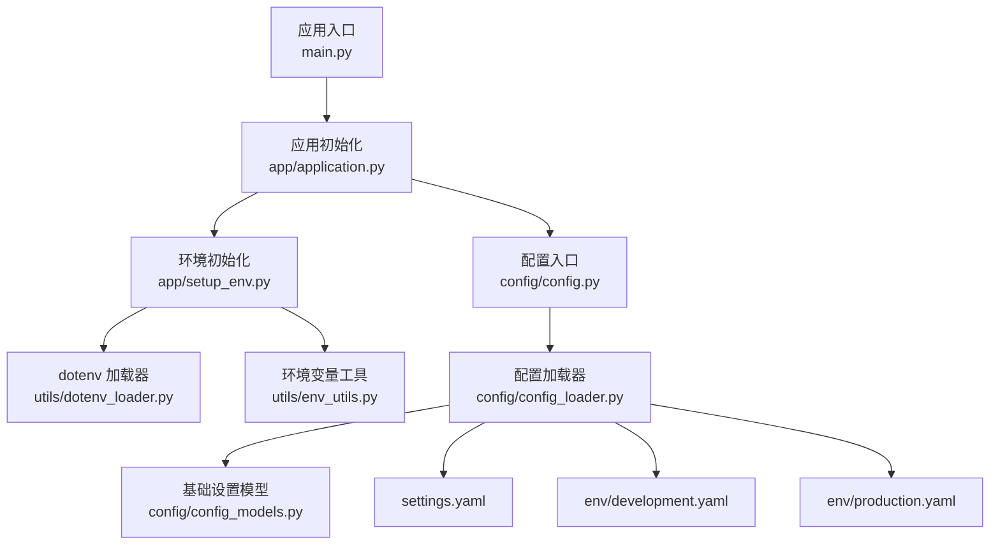
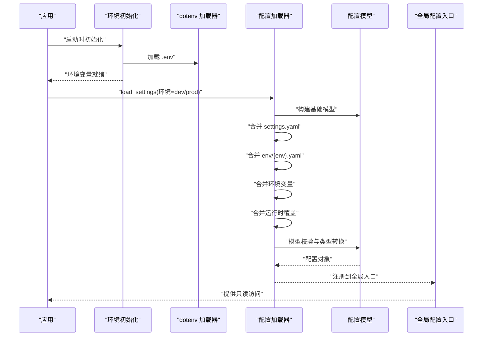
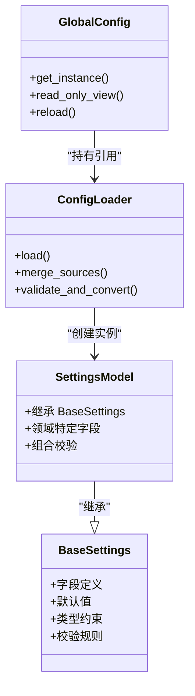
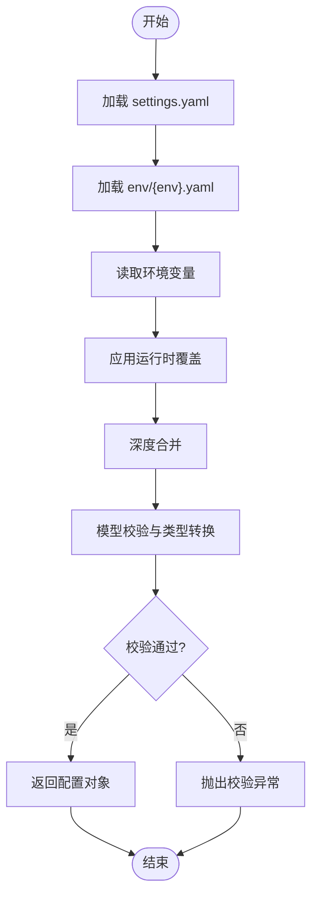
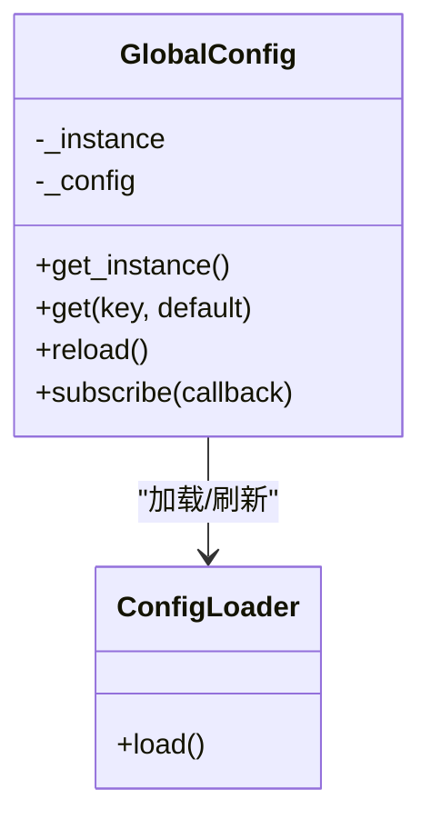
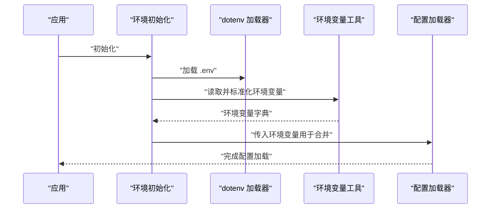
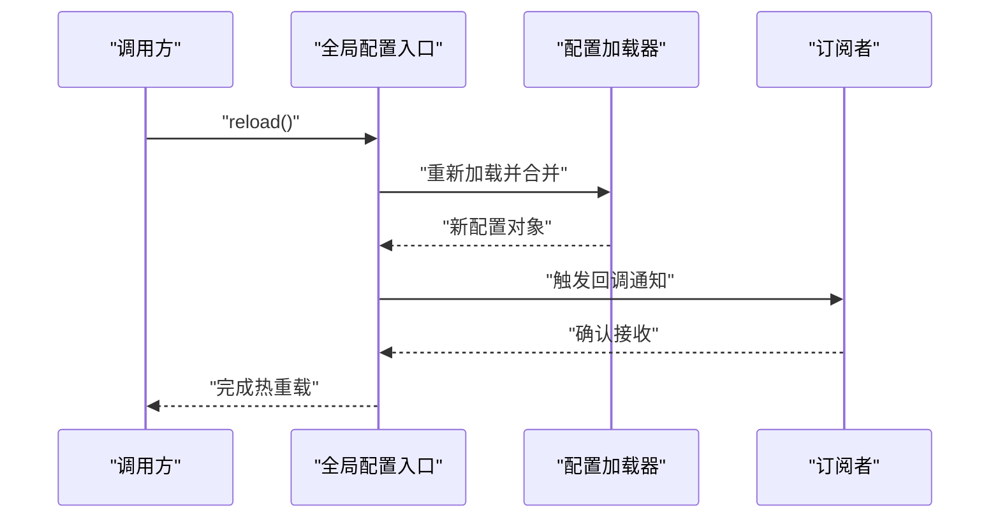
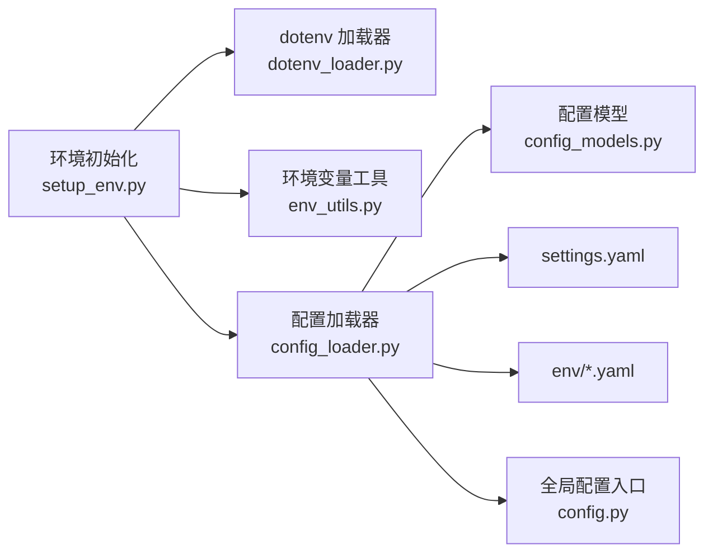

# 配置管理系统

<cite>
**本文引用的文件**   
- [src/penshot/config/config.py](file://src/penshot/config/config.py)
- [src/penshot/config/config_loader.py](file://src/penshot/config/config_loader.py)
- [src/penshot/config/config_models.py](file://src/penshot/config/config_models.py)
- [src/penshot/config/settings.yaml](file://src/penshot/config/settings.yaml)
- [src/penshot/config/env/development.yaml](file://src/penshot/config/env/development.yaml)
- [src/penshot/config/env/production.yaml](file://src/penshot/config/env/production.yaml)
- [src/penshot/app/setup_env.py](file://src/penshot/app/setup_env.py)
- [src/penshot/utils/dotenv_loader.py](file://src/penshot/utils/dotenv_loader.py)
- [src/penshot/utils/env_utils.py](file://src/penshot/utils/env_utils.py)
- [tests/test_config.py](file://tests/test_config.py)
</cite>

## 目录
1. [简介](#简介)
2. [项目结构](#项目结构)
3. [核心组件](#核心组件)
4. [架构总览](#架构总览)
5. [详细组件分析](#详细组件分析)
6. [依赖关系分析](#依赖关系分析)
7. [性能考虑](#性能考虑)
8. [故障排查指南](#故障排查指南)
9. [结论](#结论)
10. [附录](#附录)

## 简介
本文件面向“配置管理系统”，围绕配置文件加载、环境变量集成、动态配置更新、多环境差异化、配置验证与类型转换、优先级策略、默认值处理与安全最佳实践进行系统化说明。文档同时提供可操作的示例路径，帮助开发者快速扩展自定义配置项并实现热重载能力。

## 项目结构
配置相关代码集中在 src/penshot/config 目录下，包含：
- 配置模型与校验（Pydantic）
- 配置加载器（YAML + 环境变量 + 运行时覆盖）
- 全局配置入口（单例访问）
- 多环境 YAML 片段（开发/生产）
- 应用启动时环境初始化脚本
- 工具层 dotenv 与环境变量读取辅助

图示来源
- [src/penshot/app/setup_env.py](file://src/penshot/app/setup_env.py)
- [src/penshot/utils/dotenv_loader.py](file://src/penshot/utils/dotenv_loader.py)
- [src/penshot/utils/env_utils.py](file://src/penshot/utils/env_utils.py)
- [src/penshot/config/config.py](file://src/penshot/config/config.py)
- [src/penshot/config/config_loader.py](file://src/penshot/config/config_loader.py)
- [src/penshot/config/config_models.py](file://src/penshot/config/config_models.py)
- [src/penshot/config/settings.yaml](file://src/penshot/config/settings.yaml)
- [src/penshot/config/env/development.yaml](file://src/penshot/config/env/development.yaml)
- [src/penshot/config/env/production.yaml](file://src/penshot/config/env/production.yaml)

章节来源
- [src/penshot/config/config.py](file://src/penshot/config/config.py)
- [src/penshot/config/config_loader.py](file://src/penshot/config/config_loader.py)
- [src/penshot/config/config_models.py](file://src/penshot/config/config_models.py)
- [src/penshot/config/settings.yaml](file://src/penshot/config/settings.yaml)
- [src/penshot/config/env/development.yaml](file://src/penshot/config/env/development.yaml)
- [src/penshot/config/env/production.yaml](file://src/penshot/config/env/production.yaml)
- [src/penshot/app/setup_env.py](file://src/penshot/app/setup_env.py)
- [src/penshot/utils/dotenv_loader.py](file://src/penshot/utils/dotenv_loader.py)
- [src/penshot/utils/env_utils.py](file://src/penshot/utils/env_utils.py)

## 核心组件
- 配置模型（Pydantic）：定义配置字段、类型、默认值与校验规则，确保配置在加载阶段即完成强类型校验。
- 配置加载器：负责合并多个数据源（YAML 文件、环境变量、运行时覆盖），按优先级生成最终配置对象。
- 全局配置入口：提供单例式访问接口，供业务模块统一获取配置。
- 多环境支持：通过 env 子目录的 YAML 片段与环境变量选择，实现不同环境的差异化配置。
- 环境变量集成：支持从 .env 或系统环境变量注入配置，便于容器化部署与密钥管理。
- 动态更新与热重载：提供运行时更新接口与监听机制，使关键配置在不重启进程的情况下生效。

章节来源
- [src/penshot/config/config_models.py](file://src/penshot/config/config_models.py)
- [src/penshot/config/config_loader.py](file://src/penshot/config/config_loader.py)
- [src/penshot/config/config.py](file://src/penshot/config/config.py)
- [src/penshot/config/env/development.yaml](file://src/penshot/config/env/development.yaml)
- [src/penshot/config/env/production.yaml](file://src/penshot/config/env/production.yaml)
- [src/penshot/app/setup_env.py](file://src/penshot/app/setup_env.py)
- [src/penshot/utils/dotenv_loader.py](file://src/penshot/utils/dotenv_loader.py)
- [src/penshot/utils/env_utils.py](file://src/penshot/utils/env_utils.py)

## 架构总览
配置系统的整体流程如下：
- 应用启动时，先加载 .env 文件，再根据环境变量选择对应环境 YAML 片段。
- 加载器将 settings.yaml、环境 YAML、环境变量与运行时覆盖进行合并。
- Pydantic 模型对合并后的字典进行类型转换与校验，生成不可变配置对象。
- 全局配置入口暴露只读视图；如需热重载，可通过更新接口刷新内部缓存并通知订阅者。

图示来源
- [src/penshot/app/setup_env.py](file://src/penshot/app/setup_env.py)
- [src/penshot/utils/dotenv_loader.py](file://src/penshot/utils/dotenv_loader.py)
- [src/penshot/config/config_loader.py](file://src/penshot/config/config_loader.py)
- [src/penshot/config/config_models.py](file://src/penshot/config/config_models.py)
- [src/penshot/config/config.py](file://src/penshot/config/config.py)

## 详细组件分析

### 配置模型与校验（Pydantic）
- 设计要点
  - 使用 Pydantic 模型定义配置字段、类型与默认值。
  - 通过 validators 与 field constraints 实现强校验（如范围、枚举、必填）。
  - 支持嵌套结构与列表/映射类型，便于表达复杂配置。
- 数据类型转换
  - 自动将字符串转换为布尔、整数、浮点、列表等类型。
  - 对缺失字段采用默认值，避免运行时异常。
- 可扩展性
  - 新增配置项只需在模型中声明字段与约束，无需改动加载逻辑。

图示来源
- [src/penshot/config/config_models.py](file://src/penshot/config/config_models.py)
- [src/penshot/config/config_loader.py](file://src/penshot/config/config_loader.py)
- [src/penshot/config/config.py](file://src/penshot/config/config.py)

章节来源
- [src/penshot/config/config_models.py](file://src/penshot/config/config_models.py)

### 配置加载器（多源合并与优先级）
- 数据源与优先级（从高到低）
  1. 运行时覆盖（调用方传入的键值对）
  2. 环境变量（以约定前缀区分命名空间）
  3. 环境 YAML 片段（env/{env}.yaml）
  4. 基础 settings.yaml
  5. 模型默认值
- 合并策略
  - 深度合并：对嵌套字典递归合并，避免上层覆盖下层全部结构。
  - 冲突解决：高优先级覆盖低优先级同名键。
  - 类型安全：合并后统一交由模型进行类型转换与校验。
- 错误处理
  - 当字段缺失或类型不匹配时抛出明确异常，便于定位问题。

图示来源
- [src/penshot/config/config_loader.py](file://src/penshot/config/config_loader.py)
- [src/penshot/config/settings.yaml](file://src/penshot/config/settings.yaml)
- [src/penshot/config/env/development.yaml](file://src/penshot/config/env/development.yaml)
- [src/penshot/config/env/production.yaml](file://src/penshot/config/env/production.yaml)
- [src/penshot/config/config_models.py](file://src/penshot/config/config_models.py)

章节来源
- [src/penshot/config/config_loader.py](file://src/penshot/config/config_loader.py)
- [src/penshot/config/settings.yaml](file://src/penshot/config/settings.yaml)
- [src/penshot/config/env/development.yaml](file://src/penshot/config/env/development.yaml)
- [src/penshot/config/env/production.yaml](file://src/penshot/config/env/production.yaml)

### 全局配置入口与只读访问
- 职责
  - 提供单例访问，避免重复加载与内存浪费。
  - 对外暴露只读视图，防止业务侧误改配置。
  - 封装热重载接口，内部维护最新配置快照。
- 使用方式
  - 通过全局入口获取配置对象，按需读取字段。
  - 在需要热重载的场景，调用更新方法并触发回调通知。

图示来源
- [src/penshot/config/config.py](file://src/penshot/config/config.py)
- [src/penshot/config/config_loader.py](file://src/penshot/config/config_loader.py)

章节来源
- [src/penshot/config/config.py](file://src/penshot/config/config.py)

### 环境变量集成与 .env 加载
- 加载顺序
  - 应用启动时优先加载 .env 文件，随后读取系统环境变量。
  - 环境变量可按命名空间映射到配置键（例如前缀分隔）。
- 典型用途
  - 敏感信息（密钥、连接串）通过环境变量注入。
  - 运行期参数（日志级别、超时时间）通过环境变量覆盖。
- 工具支持
  - dotenv 加载器负责解析 .env 文件。
  - 环境变量工具提供便捷读取与类型转换。

图示来源
- [src/penshot/app/setup_env.py](file://src/penshot/app/setup_env.py)
- [src/penshot/utils/dotenv_loader.py](file://src/penshot/utils/dotenv_loader.py)
- [src/penshot/utils/env_utils.py](file://src/penshot/utils/env_utils.py)
- [src/penshot/config/config_loader.py](file://src/penshot/config/config_loader.py)

章节来源
- [src/penshot/app/setup_env.py](file://src/penshot/app/setup_env.py)
- [src/penshot/utils/dotenv_loader.py](file://src/penshot/utils/dotenv_loader.py)
- [src/penshot/utils/env_utils.py](file://src/penshot/utils/env_utils.py)

### 多环境配置支持（开发/测试/生产）
- 环境选择
  - 通过环境变量指定当前环境（如 dev、test、prod）。
  - 加载器据此选择对应的 env/{env}.yaml 片段。
- 差异化配置
  - 开发环境：更详细的日志、调试开关、本地服务地址。
  - 测试环境：轻量资源、模拟后端、快速失败策略。
  - 生产环境：最小化日志、严格校验、高性能参数。
- 建议
  - 将公共配置放入 settings.yaml，环境差异放入 env/{env}.yaml。
  - 敏感配置一律通过环境变量注入，避免写入仓库。

章节来源
- [src/penshot/config/env/development.yaml](file://src/penshot/config/env/development.yaml)
- [src/penshot/config/env/production.yaml](file://src/penshot/config/env/production.yaml)
- [src/penshot/config/config_loader.py](file://src/penshot/config/config_loader.py)

### 配置验证规则与数据类型转换
- 验证规则
  - 必填字段、取值范围、枚举值、正则表达式等。
  - 跨字段联合校验（如某条件开启时必须提供其他字段）。
- 类型转换
  - 字符串到布尔、整数、浮点数、列表、映射的自动转换。
  - 对非法输入给出清晰错误信息，便于运维排障。
- 扩展方式
  - 在模型中新增字段与约束即可，无需修改加载器。

章节来源
- [src/penshot/config/config_models.py](file://src/penshot/config/config_models.py)

### 动态配置更新与热重载
- 设计思路
  - 全局配置入口维护一份当前有效配置快照。
  - 提供 reload 接口，重新执行加载与合并流程，替换快照。
  - 支持订阅机制，配置变更时通知已注册的回调函数。
- 适用场景
  - 日志级别、功能开关、阈值参数等可热更新的配置。
  - 不适用于影响进程生命周期或底层资源的配置。
- 注意事项
  - 热重载需保证幂等与线程安全。
  - 对正在进行的任务应平滑过渡，避免中断。

图示来源
- [src/penshot/config/config.py](file://src/penshot/config/config.py)
- [src/penshot/config/config_loader.py](file://src/penshot/config/config_loader.py)

章节来源
- [src/penshot/config/config.py](file://src/penshot/config/config.py)
- [src/penshot/config/config_loader.py](file://src/penshot/config/config_loader.py)

### 配置优先级策略与默认值处理
- 优先级（从高到低）
  1. 运行时覆盖
  2. 环境变量
  3. 环境 YAML 片段
  4. 基础 settings.yaml
  5. 模型默认值
- 默认值处理
  - 模型为每个字段提供合理默认值，降低配置复杂度。
  - 未提供的字段不会导致异常，而是回退到默认值。
- 最佳实践
  - 将稳定不变的值放在模型默认值中。
  - 将环境差异化的值放在 env/{env}.yaml。
  - 将敏感与运行期可变值放在环境变量。

章节来源
- [src/penshot/config/config_loader.py](file://src/penshot/config/config_loader.py)
- [src/penshot/config/config_models.py](file://src/penshot/config/config_models.py)

### 安全配置最佳实践
- 敏感信息
  - 使用环境变量或外部密钥管理服务注入，禁止硬编码。
  - 避免在日志中输出敏感字段。
- 权限控制
  - 限制 .env 文件与配置文件的访问权限。
  - 在生产环境中禁用不必要的调试开关。
- 校验与审计
  - 启用严格的配置校验，拒绝非法值。
  - 记录配置变更事件，便于审计与回溯。

[本节为通用指导，不直接分析具体文件]

## 依赖关系分析
- 组件耦合
  - 全局配置入口依赖配置加载器，加载器依赖配置模型与环境工具。
  - 环境初始化脚本协调 dotenv 与环境变量工具，为加载器提供输入。
- 外部依赖
  - Pydantic 用于模型与校验。
  - YAML 解析库用于读取配置文件。
  - Python 标准库 os/environ 用于环境变量访问。
- 潜在循环依赖
  - 应避免在模型中反向导入加载器或全局入口，保持单向依赖。

图示来源
- [src/penshot/app/setup_env.py](file://src/penshot/app/setup_env.py)
- [src/penshot/utils/dotenv_loader.py](file://src/penshot/utils/dotenv_loader.py)
- [src/penshot/utils/env_utils.py](file://src/penshot/utils/env_utils.py)
- [src/penshot/config/config_loader.py](file://src/penshot/config/config_loader.py)
- [src/penshot/config/config_models.py](file://src/penshot/config/config_models.py)
- [src/penshot/config/config.py](file://src/penshot/config/config.py)
- [src/penshot/config/settings.yaml](file://src/penshot/config/settings.yaml)
- [src/penshot/config/env/development.yaml](file://src/penshot/config/env/development.yaml)
- [src/penshot/config/env/production.yaml](file://src/penshot/config/env/production.yaml)

章节来源
- [src/penshot/config/config_loader.py](file://src/penshot/config/config_loader.py)
- [src/penshot/config/config_models.py](file://src/penshot/config/config_models.py)
- [src/penshot/config/config.py](file://src/penshot/config/config.py)
- [src/penshot/app/setup_env.py](file://src/penshot/app/setup_env.py)
- [src/penshot/utils/dotenv_loader.py](file://src/penshot/utils/dotenv_loader.py)
- [src/penshot/utils/env_utils.py](file://src/penshot/utils/env_utils.py)

## 性能考虑
- 加载时机
  - 建议在应用启动阶段一次性加载，避免频繁 IO 与解析开销。
- 合并效率
  - 深度合并应尽量局部更新，避免全量重建大对象。
- 缓存策略
  - 全局配置入口缓存最近一次成功加载的配置快照。
- 热重载成本
  - 仅对必要配置启用热重载，减少回调与同步开销。
- 并发安全
  - 读写分离：读取走只读视图，更新走原子替换。

[本节为通用指导，不直接分析具体文件]

## 故障排查指南
- 常见问题
  - 字段缺失或类型不匹配：检查 settings.yaml 与 env/{env}.yaml 是否完整，核对环境变量命名与前缀。
  - 热重载无效：确认是否调用了正确的更新接口，检查订阅者是否正确注册。
  - 敏感信息泄露：检查日志输出与错误堆栈，确保未打印敏感字段。
- 定位步骤
  - 查看加载日志，确认各数据源是否被正确读取。
  - 打印合并前的中间结果，定位覆盖冲突。
  - 使用单元测试复现问题，缩小范围。
- 参考用例
  - 测试用例展示了常见配置场景与边界情况，可作为排障参考。

章节来源
- [tests/test_config.py](file://tests/test_config.py)

## 结论
本配置管理系统以 Pydantic 模型为核心，结合多源合并与严格校验，实现了高内聚、低耦合、可扩展的配置体系。通过环境变量与 .env 集成，满足容器化与密钥管理需求；通过热重载与订阅机制，支持运行时动态调整。遵循优先级策略与安全最佳实践，可在多环境下稳定运行并提供良好运维体验。

## 附录
- 自定义配置项添加步骤
  - 在配置模型中新增字段与约束。
  - 在 settings.yaml 或 env/{env}.yaml 中补充默认值或环境差异。
  - 通过环境变量覆盖运行期参数。
  - 如有热重载需求，在订阅者中处理变更回调。
- 配置热重载实现要点
  - 提供 reload 接口，内部重新执行加载与合并。
  - 原子替换全局配置快照，保证并发安全。
  - 通知订阅者，由业务侧决定如何处理变更。

[本节为操作指引，不直接分析具体文件]