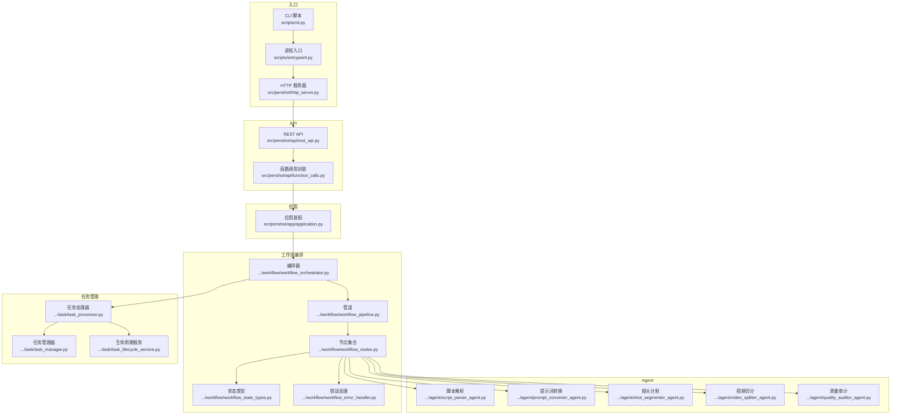
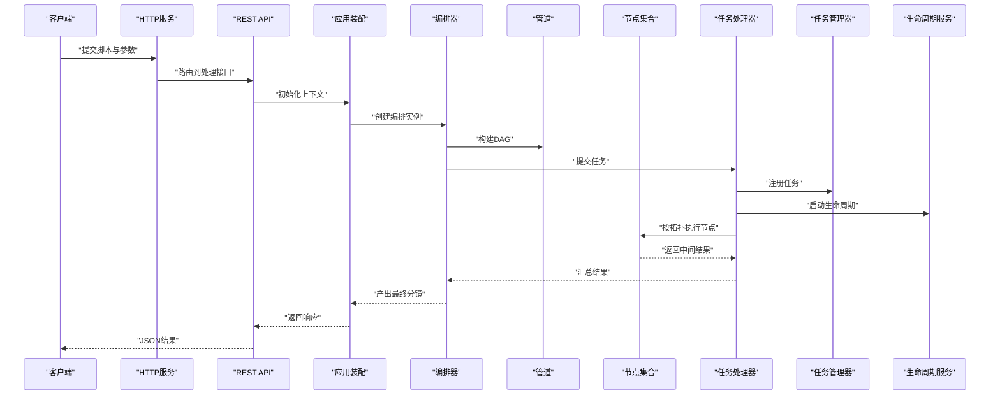
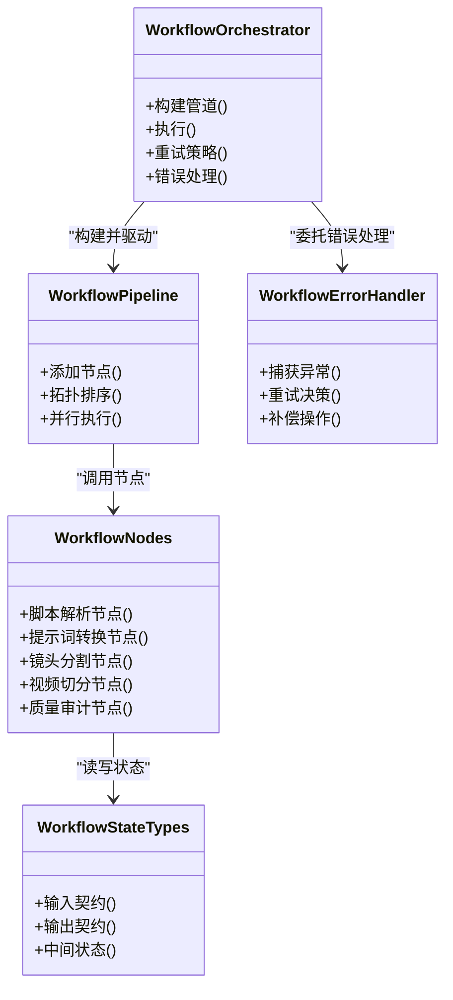
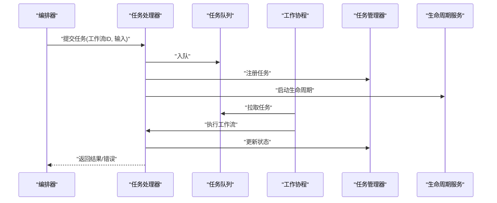
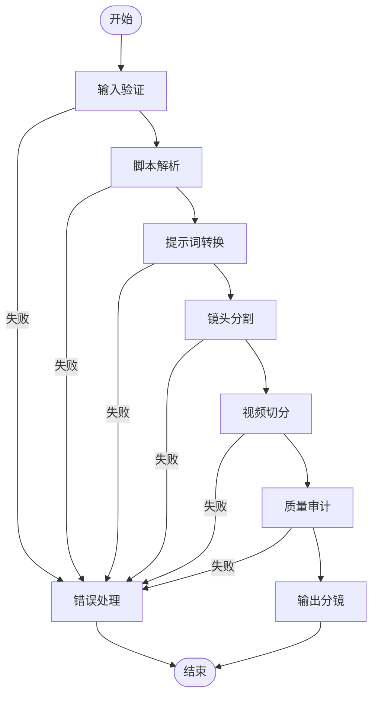
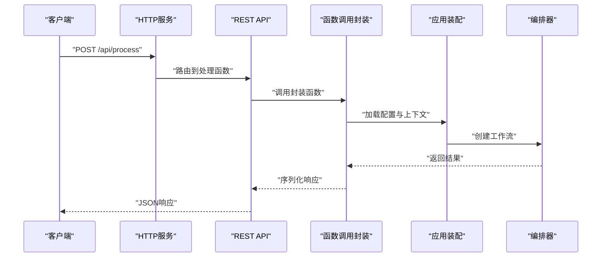
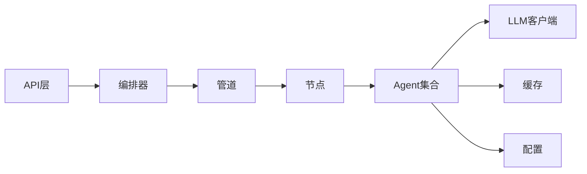

# 数据处理流程

<cite>
**本文引用的文件**   
- [main.py](file://main.py)
- [http_server.py](file://src/penshot/http_server.py)
- [application.py](file://src/penshot/app/application.py)
- [workflow_orchestrator.py](file://src/penshot/neopen/agent/workflow/workflow_orchestrator.py)
- [workflow_pipeline.py](file://src/penshot/neopen/agent/workflow/workflow_pipeline.py)
- [workflow_nodes.py](file://src/penshot/neopen/agent/workflow/workflow_nodes.py)
- [workflow_state_types.py](file://src/penshot/neopen/agent/workflow/workflow_state_types.py)
- [workflow_error_handler.py](file://src/penshot/neopen/agent/workflow/workflow_error_handler.py)
- [task_processor.py](file://src/penshot/neopen/task/task_processor.py)
- [task_manager.py](file://src/penshot/neopen/task/task_manager.py)
- [task_lifecycle_service.py](file://src/penshot/neopen/task/task_lifecycle_service.py)
- [script_parser_agent.py](file://src/penshot/neopen/agent/script_parser_agent.py)
- [prompt_converter_agent.py](file://src/penshot/neopen/agent/prompt_converter_agent.py)
- [shot_segmenter_agent.py](file://src/penshot/neopen/agent/shot_segmenter_agent.py)
- [video_splitter_agent.py](file://src/penshot/neopen/agent/video_splitter_agent.py)
- [quality_auditor_agent.py](file://src/penshot/neopen/agent/quality_auditor_agent.py)
- [rest_api.py](file://src/penshot/api/rest_api.py)
- [function_calls.py](file://src/penshot/api/function_calls.py)
- [entrypoint.py](file://scripts/entrypoint.py)
- [cli.py](file://scripts/cli.py)
</cite>

## 目录
1. [简介](#简介)
2. [项目结构](#项目结构)
3. [核心组件](#核心组件)
4. [架构总览](#架构总览)
5. [详细组件分析](#详细组件分析)
6. [依赖关系分析](#依赖关系分析)
7. [性能考虑](#性能考虑)
8. [故障排查指南](#故障排查指南)
9. [结论](#结论)
10. [附录](#附录)

## 简介
本文件聚焦于“从原始脚本输入到最终分镜输出”的完整数据处理流程，覆盖数据验证、预处理、解析、生成、审核等阶段的数据转换过程；阐述工作流管道的设计模式（节点间数据传递机制、错误处理策略、重试逻辑）；解释任务处理器的实现原理（异步处理、并发控制、资源管理）；并提供关键步骤的输入输出格式示例与时序图，以及性能优化建议与故障排查指南。

## 项目结构
系统采用分层与模块化组织：
- 入口层：命令行与HTTP服务入口
- API层：REST接口与函数调用封装
- 应用层：应用装配与环境初始化
- 工作流编排层：状态机、管道、节点、错误处理、检查点
- 任务管理层：任务生命周期、调度、持久化
- Agent层：脚本解析、提示词转换、镜头分割、视频切分、质量审计
- 工具与配置：LLM客户端、缓存、知识、提示模板、配置加载

图表来源
- [http_server.py](file://src/penshot/http_server.py)
- [rest_api.py](file://src/penshot/api/rest_api.py)
- [function_calls.py](file://src/penshot/api/function_calls.py)
- [application.py](file://src/penshot/app/application.py)
- [workflow_orchestrator.py](file://src/penshot/neopen/agent/workflow/workflow_orchestrator.py)
- [workflow_pipeline.py](file://src/penshot/neopen/agent/workflow/workflow_pipeline.py)
- [workflow_nodes.py](file://src/penshot/neopen/agent/workflow/workflow_nodes.py)
- [workflow_state_types.py](file://src/penshot/neopen/agent/workflow/workflow_state_types.py)
- [workflow_error_handler.py](file://src/penshot/neopen/agent/workflow/workflow_error_handler.py)
- [task_processor.py](file://src/penshot/neopen/task/task_processor.py)
- [task_manager.py](file://src/penshot/neopen/task/task_manager.py)
- [task_lifecycle_service.py](file://src/penshot/neopen/task/task_lifecycle_service.py)
- [script_parser_agent.py](file://src/penshot/neopen/agent/script_parser_agent.py)
- [prompt_converter_agent.py](file://src/penshot/neopen/agent/prompt_converter_agent.py)
- [shot_segmenter_agent.py](file://src/penshot/neopen/agent/shot_segmenter_agent.py)
- [video_splitter_agent.py](file://src/penshot/neopen/agent/video_splitter_agent.py)
- [quality_auditor_agent.py](file://src/penshot/neopen/agent/quality_auditor_agent.py)

章节来源
- [http_server.py](file://src/penshot/http_server.py)
- [rest_api.py](file://src/penshot/api/rest_api.py)
- [function_calls.py](file://src/penshot/api/function_calls.py)
- [application.py](file://src/penshot/app/application.py)
- [workflow_orchestrator.py](file://src/penshot/neopen/agent/workflow/workflow_orchestrator.py)
- [workflow_pipeline.py](file://src/penshot/neopen/agent/workflow/workflow_pipeline.py)
- [workflow_nodes.py](file://src/penshot/neopen/agent/workflow/workflow_nodes.py)
- [workflow_state_types.py](file://src/penshot/neopen/agent/workflow/workflow_state_types.py)
- [workflow_error_handler.py](file://src/penshot/neopen/agent/workflow/workflow_error_handler.py)
- [task_processor.py](file://src/penshot/neopen/task/task_processor.py)
- [task_manager.py](file://src/penshot/neopen/task/task_manager.py)
- [task_lifecycle_service.py](file://src/penshot/neopen/task/task_lifecycle_service.py)
- [script_parser_agent.py](file://src/penshot/neopen/agent/script_parser_agent.py)
- [prompt_converter_agent.py](file://src/penshot/neopen/agent/prompt_converter_agent.py)
- [shot_segmenter_agent.py](file://src/penshot/neopen/agent/shot_segmenter_agent.py)
- [video_splitter_agent.py](file://src/penshot/neopen/agent/video_splitter_agent.py)
- [quality_auditor_agent.py](file://src/penshot/neopen/agent/quality_auditor_agent.py)

## 核心组件
- 工作流编排器：负责定义并驱动整个数据处理流水线，协调节点执行、状态流转、错误恢复与重试。
- 工作流管道：将多个节点按拓扑顺序组合为可执行的有向无环图（DAG），支持并行与串行混合。
- 节点集合：每个业务阶段对应一个或多个节点，如脚本解析、提示词转换、镜头分割、视频切分、质量审计。
- 状态类型：统一描述各阶段输入输出契约，确保节点间数据传递一致。
- 错误处理：集中式异常捕获、降级策略、重试与补偿。
- 任务处理器：将工作流实例化为任务，提供异步执行、并发控制、资源管理与持久化。
- 任务管理器与生命周期服务：负责任务注册、调度、状态跟踪、清理与监控。
- API与服务：REST接口与函数调用封装，暴露端到端处理能力。

章节来源
- [workflow_orchestrator.py](file://src/penshot/neopen/agent/workflow/workflow_orchestrator.py)
- [workflow_pipeline.py](file://src/penshot/neopen/agent/workflow/workflow_pipeline.py)
- [workflow_nodes.py](file://src/penshot/neopen/agent/workflow/workflow_nodes.py)
- [workflow_state_types.py](file://src/penshot/neopen/agent/workflow/workflow_state_types.py)
- [workflow_error_handler.py](file://src/penshot/neopen/agent/workflow/workflow_error_handler.py)
- [task_processor.py](file://src/penshot/neopen/task/task_processor.py)
- [task_manager.py](file://src/penshot/neopen/task/task_manager.py)
- [task_lifecycle_service.py](file://src/penshot/neopen/task/task_lifecycle_service.py)
- [rest_api.py](file://src/penshot/api/rest_api.py)
- [function_calls.py](file://src/penshot/api/function_calls.py)

## 架构总览
整体采用“请求-编排-任务-节点”的分层架构：
- 请求进入后由API层校验与路由，随后交由应用装配上下文与工作流编排器。
- 编排器根据状态模型构建管道，依次或并行执行节点。
- 任务处理器以异步方式调度节点执行，结合任务管理器进行状态持久化与生命周期管理。
- 节点内部调用具体Agent完成业务处理，并通过状态对象在节点间传递数据。

图表来源
- [http_server.py](file://src/penshot/http_server.py)
- [rest_api.py](file://src/penshot/api/rest_api.py)
- [application.py](file://src/penshot/app/application.py)
- [workflow_orchestrator.py](file://src/penshot/neopen/agent/workflow/workflow_orchestrator.py)
- [workflow_pipeline.py](file://src/penshot/neopen/agent/workflow/workflow_pipeline.py)
- [workflow_nodes.py](file://src/penshot/neopen/agent/workflow/workflow_nodes.py)
- [task_processor.py](file://src/penshot/neopen/task/task_processor.py)
- [task_manager.py](file://src/penshot/neopen/task/task_manager.py)
- [task_lifecycle_service.py](file://src/penshot/neopen/task/task_lifecycle_service.py)

## 详细组件分析

### 工作流编排器与管道
- 设计模式：基于DAG的有向无环图管道，节点之间通过统一状态对象传递数据。
- 节点间数据传递：使用状态类型定义的字段作为契约，上游节点写入，下游节点读取。
- 错误处理策略：集中式错误处理器捕获异常，支持重试、回退与补偿。
- 重试逻辑：对可重试错误（如网络抖动、限流）进行指数退避重试，不可重试错误直接失败。
- 并发控制：同一层级节点可并行执行，跨层级严格串行，避免状态竞争。

图表来源
- [workflow_orchestrator.py](file://src/penshot/neopen/agent/workflow/workflow_orchestrator.py)
- [workflow_pipeline.py](file://src/penshot/neopen/agent/workflow/workflow_pipeline.py)
- [workflow_nodes.py](file://src/penshot/neopen/agent/workflow/workflow_nodes.py)
- [workflow_state_types.py](file://src/penshot/neopen/agent/workflow/workflow_state_types.py)
- [workflow_error_handler.py](file://src/penshot/neopen/agent/workflow/workflow_error_handler.py)

章节来源
- [workflow_orchestrator.py](file://src/penshot/neopen/agent/workflow/workflow_orchestrator.py)
- [workflow_pipeline.py](file://src/penshot/neopen/agent/workflow/workflow_pipeline.py)
- [workflow_nodes.py](file://src/penshot/neopen/agent/workflow/workflow_nodes.py)
- [workflow_state_types.py](file://src/penshot/neopen/agent/workflow/workflow_state_types.py)
- [workflow_error_handler.py](file://src/penshot/neopen/agent/workflow/workflow_error_handler.py)

### 任务处理器与生命周期
- 异步处理：任务处理器以异步方式提交与执行工作流，避免阻塞主线程。
- 并发控制：通过任务队列与信号量限制并发度，防止资源耗尽。
- 资源管理：为每个任务分配独立上下文，完成后释放资源，避免泄漏。
- 持久化：任务状态与中间结果持久化，支持断点续跑与回溯。
- 生命周期服务：负责任务的创建、运行、暂停、恢复与销毁。

图表来源
- [task_processor.py](file://src/penshot/neopen/task/task_processor.py)
- [task_manager.py](file://src/penshot/neopen/task/task_manager.py)
- [task_lifecycle_service.py](file://src/penshot/neopen/task/task_lifecycle_service.py)

章节来源
- [task_processor.py](file://src/penshot/neopen/task/task_processor.py)
- [task_manager.py](file://src/penshot/neopen/task/task_manager.py)
- [task_lifecycle_service.py](file://src/penshot/neopen/task/task_lifecycle_service.py)

### 节点与Agent映射
- 脚本解析节点：调用脚本解析Agent，将原始文本转换为结构化片段。
- 提示词转换节点：调用提示词转换Agent，将结构化片段转为提示词。
- 镜头分割节点：调用镜头分割Agent，依据语义与节奏划分镜头。
- 视频切分节点：调用视频切分Agent，按镜头边界切分视频。
- 质量审计节点：调用质量审计Agent，对输出进行规则与AI双重校验。

图表来源
- [workflow_nodes.py](file://src/penshot/neopen/agent/workflow/workflow_nodes.py)
- [script_parser_agent.py](file://src/penshot/neopen/agent/script_parser_agent.py)
- [prompt_converter_agent.py](file://src/penshot/neopen/agent/prompt_converter_agent.py)
- [shot_segmenter_agent.py](file://src/penshot/neopen/agent/shot_segmenter_agent.py)
- [video_splitter_agent.py](file://src/penshot/neopen/agent/video_splitter_agent.py)
- [quality_auditor_agent.py](file://src/penshot/neopen/agent/quality_auditor_agent.py)

章节来源
- [workflow_nodes.py](file://src/penshot/neopen/agent/workflow/workflow_nodes.py)
- [script_parser_agent.py](file://src/penshot/neopen/agent/script_parser_agent.py)
- [prompt_converter_agent.py](file://src/penshot/neopen/agent/prompt_converter_agent.py)
- [shot_segmenter_agent.py](file://src/penshot/neopen/agent/shot_segmenter_agent.py)
- [video_splitter_agent.py](file://src/penshot/neopen/agent/video_splitter_agent.py)
- [quality_auditor_agent.py](file://src/penshot/neopen/agent/quality_auditor_agent.py)

### API与服务入口
- REST API：提供统一的HTTP接口，接收脚本与参数，返回分镜结果。
- 函数调用封装：将工作流能力封装为可调用的函数，便于集成到其他系统。
- 应用装配：初始化配置、日志、缓存、知识库等环境依赖。

图表来源
- [http_server.py](file://src/penshot/http_server.py)
- [rest_api.py](file://src/penshot/api/rest_api.py)
- [function_calls.py](file://src/penshot/api/function_calls.py)
- [application.py](file://src/penshot/app/application.py)
- [workflow_orchestrator.py](file://src/penshot/neopen/agent/workflow/workflow_orchestrator.py)

章节来源
- [http_server.py](file://src/penshot/http_server.py)
- [rest_api.py](file://src/penshot/api/rest_api.py)
- [function_calls.py](file://src/penshot/api/function_calls.py)
- [application.py](file://src/penshot/app/application.py)

## 依赖关系分析
- 低耦合高内聚：API层仅依赖编排器与任务处理器；编排器依赖管道与节点；节点依赖各自Agent。
- 外部依赖：LLM客户端、缓存、知识库、配置加载器等通过抽象接口注入，便于替换与测试。
- 潜在循环依赖：通过状态对象解耦节点间直接引用，避免循环导入。

图表来源
- [rest_api.py](file://src/penshot/api/rest_api.py)
- [workflow_orchestrator.py](file://src/penshot/neopen/agent/workflow/workflow_orchestrator.py)
- [workflow_pipeline.py](file://src/penshot/neopen/agent/workflow/workflow_pipeline.py)
- [workflow_nodes.py](file://src/penshot/neopen/agent/workflow/workflow_nodes.py)
- [script_parser_agent.py](file://src/penshot/neopen/agent/script_parser_agent.py)
- [prompt_converter_agent.py](file://src/penshot/neopen/agent/prompt_converter_agent.py)
- [shot_segmenter_agent.py](file://src/penshot/neopen/agent/shot_segmenter_agent.py)
- [video_splitter_agent.py](file://src/penshot/neopen/agent/video_splitter_agent.py)
- [quality_auditor_agent.py](file://src/penshot/neopen/agent/quality_auditor_agent.py)

章节来源
- [rest_api.py](file://src/penshot/api/rest_api.py)
- [workflow_orchestrator.py](file://src/penshot/neopen/agent/workflow/workflow_orchestrator.py)
- [workflow_pipeline.py](file://src/penshot/neopen/agent/workflow/workflow_pipeline.py)
- [workflow_nodes.py](file://src/penshot/neopen/agent/workflow/workflow_nodes.py)
- [script_parser_agent.py](file://src/penshot/neopen/agent/script_parser_agent.py)
- [prompt_converter_agent.py](file://src/penshot/neopen/agent/prompt_converter_agent.py)
- [shot_segmenter_agent.py](file://src/penshot/neopen/agent/shot_segmenter_agent.py)
- [video_splitter_agent.py](file://src/penshot/neopen/agent/video_splitter_agent.py)
- [quality_auditor_agent.py](file://src/penshot/neopen/agent/quality_auditor_agent.py)

## 性能考虑
- 并行执行：对无依赖的节点进行并行处理，缩短端到端时延。
- 批处理：批量脚本输入合并处理，提高吞吐。
- 缓存命中：对重复提示词与中间结果启用缓存，减少LLM调用。
- 资源上限：限制并发度与内存占用，防止OOM。
- 超时与熔断：对慢节点设置超时与熔断，保障整体可用性。
- 增量处理：长脚本分块处理，降低单次处理压力。

[本节为通用指导，不直接分析具体文件]

## 故障排查指南
- 常见错误分类：
  - 输入验证失败：检查字段完整性与类型约束。
  - 解析失败：查看脚本结构与关键词匹配情况。
  - 生成失败：确认LLM客户端可用性与配额。
  - 审计失败：审查规则阈值与评分标准。
- 定位方法：
  - 查看任务状态与中间结果，定位失败节点。
  - 启用详细日志，追踪节点输入输出。
  - 使用检查点恢复，逐步回放。
- 恢复策略：
  - 重试可重试错误，必要时降级为规则模式。
  - 人工介入修正输入或参数，重新触发。

章节来源
- [workflow_error_handler.py](file://src/penshot/neopen/agent/workflow/workflow_error_handler.py)
- [task_processor.py](file://src/penshot/neopen/task/task_processor.py)
- [task_manager.py](file://src/penshot/neopen/task/task_manager.py)
- [task_lifecycle_service.py](file://src/penshot/neopen/task/task_lifecycle_service.py)

## 结论
本系统通过编排器与管道将多阶段处理串联为稳定可靠的数据处理流水线，借助任务处理器实现异步与并发控制，配合错误处理与重试策略提升鲁棒性。节点与Agent的清晰分工使得扩展与维护更为便捷。建议在大规模场景下进一步优化并行度、缓存命中率与资源上限，以提升整体性能与稳定性。

[本节为总结，不直接分析具体文件]

## 附录

### 关键处理步骤的输入输出格式示例
- 脚本解析
  - 输入：原始脚本文本、语言选项、解析策略
  - 输出：结构化片段列表（含场景、对话、动作等元信息）
- 提示词转换
  - 输入：结构化片段、风格模板、目标语言
  - 输出：标准化提示词序列
- 镜头分割
  - 输入：提示词序列、分割策略、时长估算
  - 输出：镜头边界与时间戳
- 视频切分
  - 输入：视频路径、镜头边界
  - 输出：分段视频文件与索引
- 质量审计
  - 输入：分镜结果、规则集、评分阈值
  - 输出：审计报告与合格标记

[本节为概念说明，不直接分析具体文件]

### 时序图：端到端处理

图表来源
- [http_server.py](file://src/penshot/http_server.py)
- [rest_api.py](file://src/penshot/api/rest_api.py)
- [application.py](file://src/penshot/app/application.py)
- [workflow_orchestrator.py](file://src/penshot/neopen/agent/workflow/workflow_orchestrator.py)
- [workflow_pipeline.py](file://src/penshot/neopen/agent/workflow/workflow_pipeline.py)
- [workflow_nodes.py](file://src/penshot/neopen/agent/workflow/workflow_nodes.py)
- [task_processor.py](file://src/penshot/neopen/task/task_processor.py)
- [task_manager.py](file://src/penshot/neopen/task/task_manager.py)
- [task_lifecycle_service.py](file://src/penshot/neopen/task/task_lifecycle_service.py)