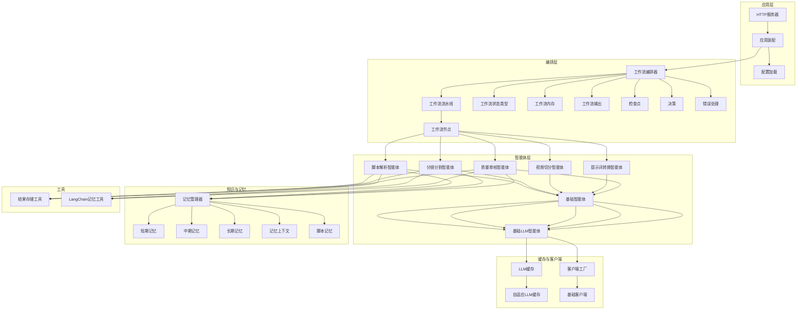
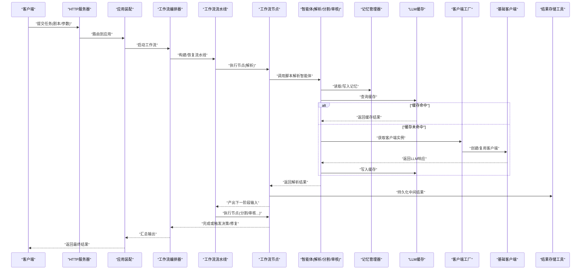
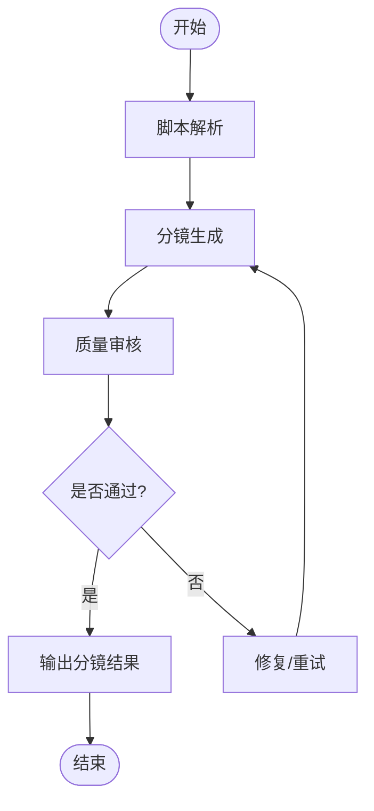
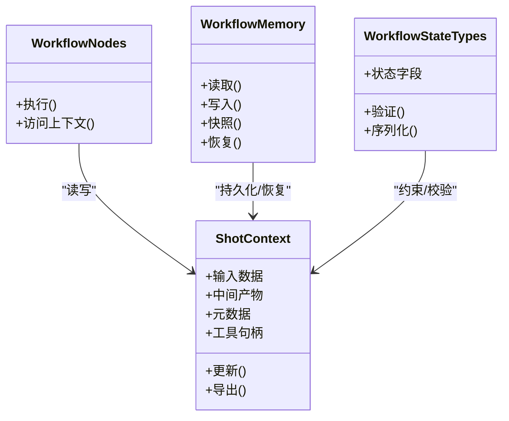
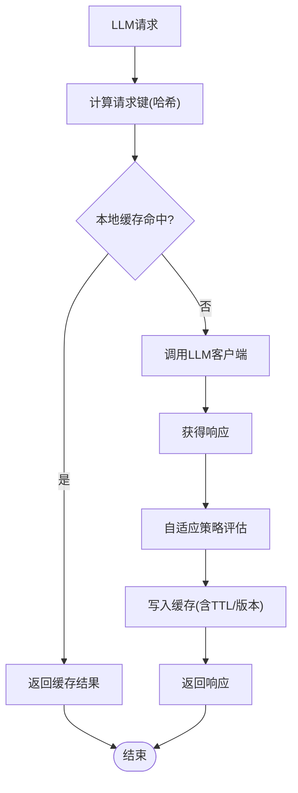
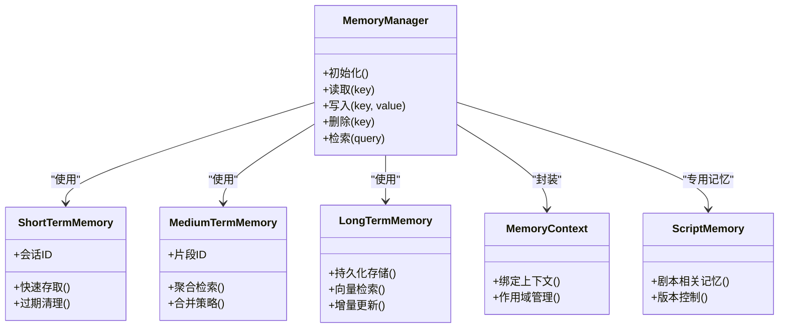
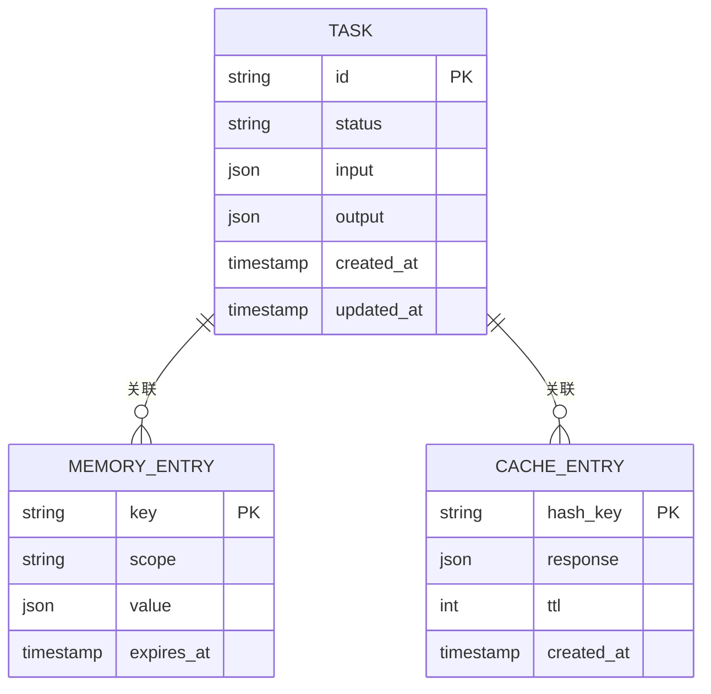
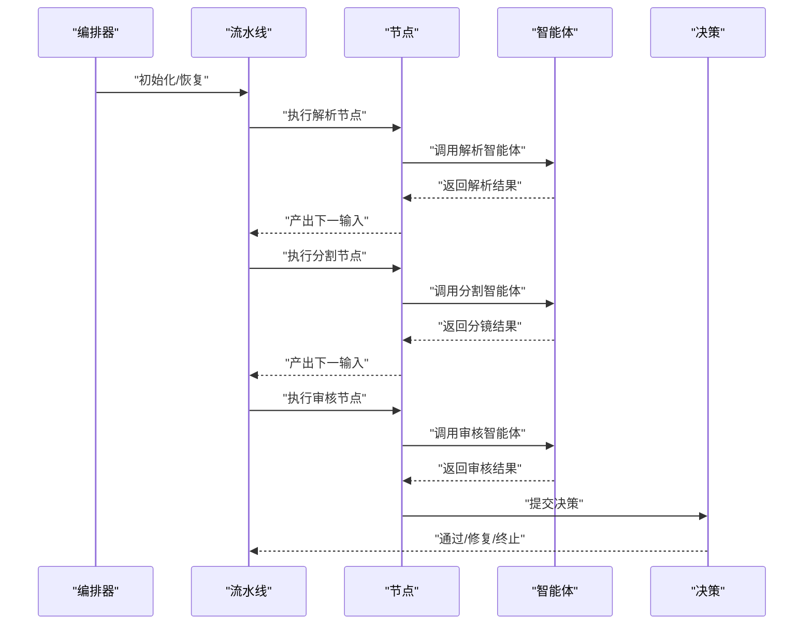
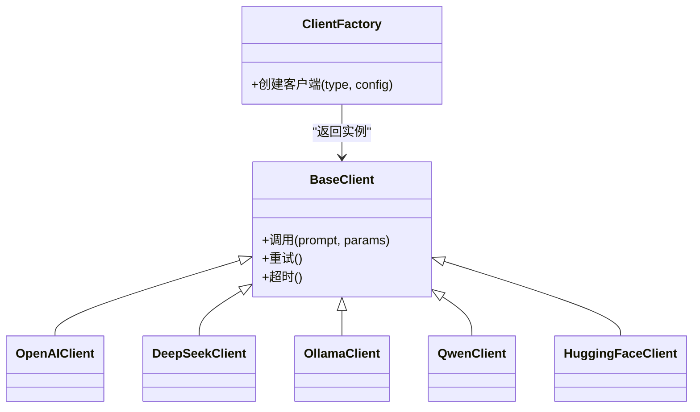
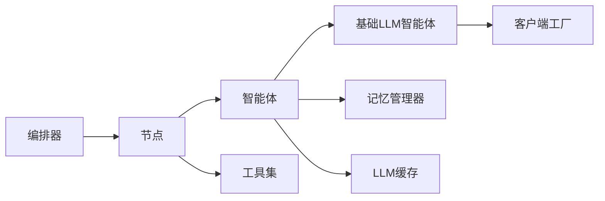

# 数据流架构

<cite>
**本文引用的文件**   
- [src/penshot/app/application.py](file://src/penshot/app/application.py)
- [src/penshot/agent/workflow/workflow_orchestrator.py](file://src/penshot/agent/workflow/workflow_orchestrator.py)
- [src/penshot/agent/workflow/workflow_pipeline.py](file://src/penshot/agent/workflow/workflow_pipeline.py)
- [src/penshot/agent/workflow/workflow_state_types.py](file://src/penshot/agent/workflow/workflow_state_types.py)
- [src/penshot/agent/workflow/workflow_memory.py](file://src/penshot/agent/workflow/workflow_memory.py)
- [src/penshot/agent/workflow/workflow_nodes.py](file://src/penshot/agent/workflow/workflow_nodes.py)
- [src/penshot/agent/workflow/workflow_output.py](file://src/penshot/agent/workflow/workflow_output.py)
- [src/penshot/agent/workflow/workflow_checkpointer.py](file://src/penshot/agent/workflow/workflow_checkpointer.py)
- [src/penshot/agent/script_parser_agent.py](file://src/penshot/agent/script_parser_agent.py)
- [src/penshot/agent/shot_segmenter_agent.py](file://src/penshot/agent/shot_segmenter_agent.py)
- [src/penshot/agent/quality_auditor_agent.py](file://src/penshot/agent/quality_auditor_agent.py)
- [src/penshot/agent/video_splitter_agent.py](file://src/penshot/agent/video_splitter_agent.py)
- [src/penshot/agent/prompt_converter_agent.py](file://src/penshot/agent/prompt_converter_agent.py)
- [src/penshot/agent/base_llm_agent.py](file://src/penshot/agent/base_llm_agent.py)
- [src/penshot/agent/base_agent.py](file://src/penshot/agent/base_agent.py)
- [src/penshot/agent/workflow/workflow_decision.py](file://src/penshot/agent/workflow/workflow_decision.py)
- [src/penshot/agent/workflow/workflow_error_handler.py](file://src/penshot/agent/workflow/workflow_error_handler.py)
- [src/penshot/knowledge/memory/memory_manager.py](file://src/penshot/knowledge/memory/memory_manager.py)
- [src/penshot/knowledge/memory/short_term_memory.py](file://src/penshot/knowledge/memory/short_term_memory.py)
- [src/penshot/knowledge/memory/medium_term_memory.py](file://src/penshot/knowledge/memory/medium_term_memory.py)
- [src/penshot/knowledge/memory/long_term_memory.py](file://src/penshot/knowledge/memory/long_term_memory.py)
- [src/penshot/knowledge/memory/memory_context.py](file://src/penshot/knowledge/memory/memory_context.py)
- [src/penshot/knowledge/memory/memory_models.py](file://src/penshot/knowledge/memory/memory_models.py)
- [src/penshot/knowledge/memory/script_memory.py](file://src/penshot/knowledge/memory/script_memory.py)
- [src/penshot/app/cache/llm_cache.py](file://src/penshot/app/cache/llm_cache.py)
- [src/penshot/app/cache/adaptive_llm_cache.py](file://src/penshot/app/cache/adaptive_llm_cache.py)
- [src/penshot/client/client_factory.py](file://src/penshot/client/client_factory.py)
- [src/penshot/client/base_client.py](file://src/penshot/client/base_client.py)
- [src/penshot/tools/result_storage_tool.py](file://src/penshot/tools/result_storage_tool.py)
- [src/penshot/tools/langchain_memory_tool.py](file://src/penshot/tools/langchain_memory_tool.py)
- [src/penshot/config/config_loader.py](file://src/penshot/config/config_loader.py)
- [src/penshot/config/config_models.py](file://src/penshot/config/config_models.py)
- [src/penshot/utils/hash_utils.py](file://src/penshot/utils/hash_utils.py)
- [src/penshot/utils/file_utils.py](file://src/penshot/utils/file_utils.py)
- [src/penshot/http_server.py](file://src/penshot/http_server.py)
- [examples/json_demo/script_parser_result.json](file://examples/json_demo/script_parser_result.json)
- [examples/json_demo/shot_segmenter_result.json](file://examples/json_demo/shot_segmenter_result.json)
- [examples/json_demo/quality_auditor_result.json](file://examples/json_demo/quality_auditor_result.json)
</cite>

## 目录
1. [简介](#简介)
2. [项目结构](#项目结构)
3. [核心组件](#核心组件)
4. [架构总览](#架构总览)
5. [详细组件分析](#详细组件分析)
6. [依赖关系分析](#依赖关系分析)
7. [性能考虑](#性能考虑)
8. [故障排查指南](#故障排查指南)
9. [结论](#结论)
10. [附录](#附录)

## 简介
本文件聚焦于视频分镜代理的数据流架构，覆盖从输入到输出的完整数据处理路径：脚本解析、分镜生成、质量审核。文档同时阐述上下文管理机制（ShotContext）、多级缓存系统、记忆系统（短期/中期/长期）的存储与检索机制，并提供数据模型定义与序列化格式说明，辅以数据流图与架构图帮助理解关键处理路径。

## 项目结构
仓库采用分层与按功能域组织相结合的结构：
- 应用层：HTTP服务、应用装配、配置加载
- 工作流编排：状态机、节点、流水线、检查点、输出、决策与错误处理
- 智能体：脚本解析、分镜分割、视频切分、提示词转换、质量审核等
- 知识/记忆：短期/中期/长期记忆、脚本记忆、记忆上下文与管理器
- 缓存：LLM缓存与自适应缓存
- 客户端：多后端LLM客户端工厂与基类
- 工具：结果存储、LangChain记忆工具等
- 示例与测试：JSON示例、端到端与单元测试

图表来源
- [src/penshot/http_server.py](file://src/penshot/http_server.py)
- [src/penshot/app/application.py](file://src/penshot/app/application.py)
- [src/penshot/agent/workflow/workflow_orchestrator.py](file://src/penshot/agent/workflow/workflow_orchestrator.py)
- [src/penshot/agent/workflow/workflow_pipeline.py](file://src/penshot/agent/workflow/workflow_pipeline.py)
- [src/penshot/agent/workflow/workflow_state_types.py](file://src/penshot/agent/workflow/workflow_state_types.py)
- [src/penshot/agent/workflow/workflow_memory.py](file://src/penshot/agent/workflow/workflow_memory.py)
- [src/penshot/agent/workflow/workflow_nodes.py](file://src/penshot/agent/workflow/workflow_nodes.py)
- [src/penshot/agent/workflow/workflow_output.py](file://src/penshot/agent/workflow/workflow_output.py)
- [src/penshot/agent/workflow/workflow_checkpointer.py](file://src/penshot/agent/workflow/workflow_checkpointer.py)
- [src/penshot/agent/workflow/workflow_decision.py](file://src/penshot/agent/workflow/workflow_decision.py)
- [src/penshot/agent/workflow/workflow_error_handler.py](file://src/penshot/agent/workflow/workflow_error_handler.py)
- [src/penshot/agent/script_parser_agent.py](file://src/penshot/agent/script_parser_agent.py)
- [src/penshot/agent/shot_segmenter_agent.py](file://src/penshot/agent/shot_segmenter_agent.py)
- [src/penshot/agent/video_splitter_agent.py](file://src/penshot/agent/video_splitter_agent.py)
- [src/penshot/agent/prompt_converter_agent.py](file://src/penshot/agent/prompt_converter_agent.py)
- [src/penshot/agent/quality_auditor_agent.py](file://src/penshot/agent/quality_auditor_agent.py)
- [src/penshot/agent/base_agent.py](file://src/penshot/agent/base_agent.py)
- [src/penshot/agent/base_llm_agent.py](file://src/penshot/agent/base_llm_agent.py)
- [src/penshot/knowledge/memory/memory_manager.py](file://src/penshot/knowledge/memory/memory_manager.py)
- [src/penshot/knowledge/memory/short_term_memory.py](file://src/penshot/knowledge/memory/short_term_memory.py)
- [src/penshot/knowledge/memory/medium_term_memory.py](file://src/penshot/knowledge/memory/medium_term_memory.py)
- [src/penshot/knowledge/memory/long_term_memory.py](file://src/penshot/knowledge/memory/long_term_memory.py)
- [src/penshot/knowledge/memory/memory_context.py](file://src/penshot/knowledge/memory/memory_context.py)
- [src/penshot/knowledge/memory/memory_models.py](file://src/penshot/knowledge/memory/memory_models.py)
- [src/penshot/knowledge/memory/script_memory.py](file://src/penshot/knowledge/memory/script_memory.py)
- [src/penshot/app/cache/llm_cache.py](file://src/penshot/app/cache/llm_cache.py)
- [src/penshot/app/cache/adaptive_llm_cache.py](file://src/penshot/app/cache/adaptive_llm_cache.py)
- [src/penshot/client/client_factory.py](file://src/penshot/client/client_factory.py)
- [src/penshot/client/base_client.py](file://src/penshot/client/base_client.py)
- [src/penshot/tools/result_storage_tool.py](file://src/penshot/tools/result_storage_tool.py)
- [src/penshot/tools/langchain_memory_tool.py](file://src/penshot/tools/langchain_memory_tool.py)
- [src/penshot/config/config_loader.py](file://src/penshot/config/config_loader.py)
- [src/penshot/config/config_models.py](file://src/penshot/config/config_models.py)

章节来源
- [src/penshot/http_server.py](file://src/penshot/http_server.py)
- [src/penshot/app/application.py](file://src/penshot/app/application.py)
- [src/penshot/agent/workflow/workflow_orchestrator.py](file://src/penshot/agent/workflow/workflow_orchestrator.py)
- [src/penshot/agent/workflow/workflow_pipeline.py](file://src/penshot/agent/workflow/workflow_pipeline.py)
- [src/penshot/agent/workflow/workflow_state_types.py](file://src/penshot/agent/workflow/workflow_state_types.py)
- [src/penshot/agent/workflow/workflow_memory.py](file://src/penshot/agent/workflow/workflow_memory.py)
- [src/penshot/agent/workflow/workflow_nodes.py](file://src/penshot/agent/workflow/workflow_nodes.py)
- [src/penshot/agent/workflow/workflow_output.py](file://src/penshot/agent/workflow/workflow_output.py)
- [src/penshot/agent/workflow/workflow_checkpointer.py](file://src/penshot/agent/workflow/workflow_checkpointer.py)
- [src/penshot/agent/workflow/workflow_decision.py](file://src/penshot/agent/workflow/workflow_decision.py)
- [src/penshot/agent/workflow/workflow_error_handler.py](file://src/penshot/agent/workflow/workflow_error_handler.py)
- [src/penshot/knowledge/memory/memory_manager.py](file://src/penshot/knowledge/memory/memory_manager.py)
- [src/penshot/app/cache/llm_cache.py](file://src/penshot/app/cache/llm_cache.py)
- [src/penshot/app/cache/adaptive_llm_cache.py](file://src/penshot/app/cache/adaptive_llm_cache.py)
- [src/penshot/client/client_factory.py](file://src/penshot/client/client_factory.py)
- [src/penshot/client/base_client.py](file://src/penshot/client/base_client.py)
- [src/penshot/tools/result_storage_tool.py](file://src/penshot/tools/result_storage_tool.py)
- [src/penshot/tools/langchain_memory_tool.py](file://src/penshot/tools/langchain_memory_tool.py)
- [src/penshot/config/config_loader.py](file://src/penshot/config/config_loader.py)
- [src/penshot/config/config_models.py](file://src/penshot/config/config_models.py)

## 核心组件
- 工作流编排器：负责调度脚本解析、分镜分割、视频切分、提示词转换、质量审核等节点，维护执行顺序、分支与重试策略。
- 工作流状态与内存：集中保存中间产物、上下文、临时变量与持久化快照，支持断点续跑与可观测性。
- 智能体层：封装各阶段业务逻辑，统一通过基础LLM智能体访问不同后端，并复用提示模板与工具。
- 记忆系统：提供短期会话记忆、中期片段记忆与长期知识库记忆的统一接口，供智能体按需读写。
- 缓存系统：对LLM调用进行多级缓存（本地/自适应），减少重复请求与延迟。
- 客户端工厂：根据配置动态选择具体LLM客户端，屏蔽底层差异。
- 工具集：结果存储、LangChain记忆工具等，增强智能体的外部能力。

章节来源
- [src/penshot/agent/workflow/workflow_orchestrator.py](file://src/penshot/agent/workflow/workflow_orchestrator.py)
- [src/penshot/agent/workflow/workflow_state_types.py](file://src/penshot/agent/workflow/workflow_state_types.py)
- [src/penshot/agent/workflow/workflow_memory.py](file://src/penshot/agent/workflow/workflow_memory.py)
- [src/penshot/agent/base_llm_agent.py](file://src/penshot/agent/base_llm_agent.py)
- [src/penshot/knowledge/memory/memory_manager.py](file://src/penshot/knowledge/memory/memory_manager.py)
- [src/penshot/app/cache/llm_cache.py](file://src/penshot/app/cache/llm_cache.py)
- [src/penshot/client/client_factory.py](file://src/penshot/client/client_factory.py)
- [src/penshot/tools/result_storage_tool.py](file://src/penshot/tools/result_storage_tool.py)
- [src/penshot/tools/langchain_memory_tool.py](file://src/penshot/tools/langchain_memory_tool.py)

## 架构总览
下图展示从HTTP入口到最终输出的端到端数据流，包括编排、智能体、记忆、缓存与持久化的交互。

图表来源
- [src/penshot/http_server.py](file://src/penshot/http_server.py)
- [src/penshot/app/application.py](file://src/penshot/app/application.py)
- [src/penshot/agent/workflow/workflow_orchestrator.py](file://src/penshot/agent/workflow/workflow_orchestrator.py)
- [src/penshot/agent/workflow/workflow_pipeline.py](file://src/penshot/agent/workflow/workflow_pipeline.py)
- [src/penshot/agent/workflow/workflow_nodes.py](file://src/penshot/agent/workflow/workflow_nodes.py)
- [src/penshot/agent/script_parser_agent.py](file://src/penshot/agent/script_parser_agent.py)
- [src/penshot/agent/shot_segmenter_agent.py](file://src/penshot/agent/shot_segmenter_agent.py)
- [src/penshot/agent/quality_auditor_agent.py](file://src/penshot/agent/quality_auditor_agent.py)
- [src/penshot/knowledge/memory/memory_manager.py](file://src/penshot/knowledge/memory/memory_manager.py)
- [src/penshot/app/cache/llm_cache.py](file://src/penshot/app/cache/llm_cache.py)
- [src/penshot/client/client_factory.py](file://src/penshot/client/client_factory.py)
- [src/penshot/client/base_client.py](file://src/penshot/client/base_client.py)
- [src/penshot/tools/result_storage_tool.py](file://src/penshot/tools/result_storage_tool.py)

## 详细组件分析

### 数据流路径：脚本解析 → 分镜生成 → 质量审核
- 输入：原始剧本文本或结构化输入
- 脚本解析：将自然语言剧本转换为结构化片段（场景、对话、动作等）
- 分镜生成：基于解析结果生成分镜序列（镜头时长、转场、视角等）
- 质量审核：对分镜进行规则与语义一致性校验，必要时触发修复或回退

图表来源
- [src/penshot/agent/script_parser_agent.py](file://src/penshot/agent/script_parser_agent.py)
- [src/penshot/agent/shot_segmenter_agent.py](file://src/penshot/agent/shot_segmenter_agent.py)
- [src/penshot/agent/quality_auditor_agent.py](file://src/penshot/agent/quality_auditor_agent.py)
- [src/penshot/agent/workflow/workflow_nodes.py](file://src/penshot/agent/workflow/workflow_nodes.py)
- [src/penshot/agent/workflow/workflow_decision.py](file://src/penshot/agent/workflow/workflow_decision.py)

章节来源
- [src/penshot/agent/script_parser_agent.py](file://src/penshot/agent/script_parser_agent.py)
- [src/penshot/agent/shot_segmenter_agent.py](file://src/penshot/agent/shot_segmenter_agent.py)
- [src/penshot/agent/quality_auditor_agent.py](file://src/penshot/agent/quality_auditor_agent.py)
- [src/penshot/agent/workflow/workflow_nodes.py](file://src/penshot/agent/workflow/workflow_nodes.py)
- [src/penshot/agent/workflow/workflow_decision.py](file://src/penshot/agent/workflow/workflow_decision.py)

### 上下文管理机制：ShotContext设计与数据共享
- ShotContext作为跨节点共享的运行时上下文，承载输入、中间产物、元数据与工具句柄
- 工作流内存与工作流状态类型共同保证上下文的一致性与可序列化
- 节点间通过上下文传递数据，避免全局变量与隐式耦合

图表来源
- [src/penshot/agent/workflow/workflow_state_types.py](file://src/penshot/agent/workflow/workflow_state_types.py)
- [src/penshot/agent/workflow/workflow_memory.py](file://src/penshot/agent/workflow/workflow_memory.py)
- [src/penshot/agent/workflow/workflow_nodes.py](file://src/penshot/agent/workflow/workflow_nodes.py)

章节来源
- [src/penshot/agent/workflow/workflow_state_types.py](file://src/penshot/agent/workflow/workflow_state_types.py)
- [src/penshot/agent/workflow/workflow_memory.py](file://src/penshot/agent/workflow/workflow_memory.py)
- [src/penshot/agent/workflow/workflow_nodes.py](file://src/penshot/agent/workflow/workflow_nodes.py)

### 缓存系统设计：多级缓存与失效机制
- 本地缓存：以请求键为索引，存储LLM响应，避免重复计算
- 自适应缓存：根据命中率、成本与延迟动态调整策略（如TTL、容量、淘汰策略）
- 失效机制：基于内容哈希或版本标记实现细粒度失效；在配置变更或上游数据变化时主动清理

图表来源
- [src/penshot/app/cache/llm_cache.py](file://src/penshot/app/cache/llm_cache.py)
- [src/penshot/app/cache/adaptive_llm_cache.py](file://src/penshot/app/cache/adaptive_llm_cache.py)
- [src/penshot/utils/hash_utils.py](file://src/penshot/utils/hash_utils.py)

章节来源
- [src/penshot/app/cache/llm_cache.py](file://src/penshot/app/cache/llm_cache.py)
- [src/penshot/app/cache/adaptive_llm_cache.py](file://src/penshot/app/cache/adaptive_llm_cache.py)
- [src/penshot/utils/hash_utils.py](file://src/penshot/utils/hash_utils.py)

### 记忆系统架构：短期/中期/长期记忆
- 短期记忆：会话级上下文，用于当前任务内的快速存取
- 中期记忆：片段级记忆，跨多个节点或子流程共享
- 长期记忆：持久化知识库，支持检索与增量更新
- 记忆上下文：统一封装读写接口，屏蔽底层存储差异

图表来源
- [src/penshot/knowledge/memory/memory_manager.py](file://src/penshot/knowledge/memory/memory_manager.py)
- [src/penshot/knowledge/memory/short_term_memory.py](file://src/penshot/knowledge/memory/short_term_memory.py)
- [src/penshot/knowledge/memory/medium_term_memory.py](file://src/penshot/knowledge/memory/medium_term_memory.py)
- [src/penshot/knowledge/memory/long_term_memory.py](file://src/penshot/knowledge/memory/long_term_memory.py)
- [src/penshot/knowledge/memory/memory_context.py](file://src/penshot/knowledge/memory/memory_context.py)
- [src/penshot/knowledge/memory/script_memory.py](file://src/penshot/knowledge/memory/script_memory.py)

章节来源
- [src/penshot/knowledge/memory/memory_manager.py](file://src/penshot/knowledge/memory/memory_manager.py)
- [src/penshot/knowledge/memory/short_term_memory.py](file://src/penshot/knowledge/memory/short_term_memory.py)
- [src/penshot/knowledge/memory/medium_term_memory.py](file://src/penshot/knowledge/memory/medium_term_memory.py)
- [src/penshot/knowledge/memory/long_term_memory.py](file://src/penshot/knowledge/memory/long_term_memory.py)
- [src/penshot/knowledge/memory/memory_context.py](file://src/penshot/knowledge/memory/memory_context.py)
- [src/penshot/knowledge/memory/script_memory.py](file://src/penshot/knowledge/memory/script_memory.py)

### 数据模型与序列化格式
- JSON示例：脚本解析、分镜分割、质量审核的输出结构参考示例文件
- API传输格式：HTTP接口请求/响应遵循统一的JSON结构，包含任务标识、输入、中间状态与最终结果
- 数据库映射：记忆与结果持久化采用结构化字段，便于检索与审计
- 序列化策略：工作流状态与上下文需可序列化，支持检查点与恢复

图表来源
- [examples/json_demo/script_parser_result.json](file://examples/json_demo/script_parser_result.json)
- [examples/json_demo/shot_segmenter_result.json](file://examples/json_demo/shot_segmenter_result.json)
- [examples/json_demo/quality_auditor_result.json](file://examples/json_demo/quality_auditor_result.json)
- [src/penshot/tools/result_storage_tool.py](file://src/penshot/tools/result_storage_tool.py)
- [src/penshot/app/cache/llm_cache.py](file://src/penshot/app/cache/llm_cache.py)

章节来源
- [examples/json_demo/script_parser_result.json](file://examples/json_demo/script_parser_result.json)
- [examples/json_demo/shot_segmenter_result.json](file://examples/json_demo/shot_segmenter_result.json)
- [examples/json_demo/quality_auditor_result.json](file://examples/json_demo/quality_auditor_result.json)
- [src/penshot/tools/result_storage_tool.py](file://src/penshot/tools/result_storage_tool.py)
- [src/penshot/app/cache/llm_cache.py](file://src/penshot/app/cache/llm_cache.py)

### 工作流编排与节点执行
- 编排器负责构建流水线、注册节点、处理分支与重试
- 节点执行器调用对应智能体，读写上下文与记忆，落盘中间结果
- 决策模块根据审核结果决定继续、修复或终止

图表来源
- [src/penshot/agent/workflow/workflow_orchestrator.py](file://src/penshot/agent/workflow/workflow_orchestrator.py)
- [src/penshot/agent/workflow/workflow_pipeline.py](file://src/penshot/agent/workflow/workflow_pipeline.py)
- [src/penshot/agent/workflow/workflow_nodes.py](file://src/penshot/agent/workflow/workflow_nodes.py)
- [src/penshot/agent/workflow/workflow_decision.py](file://src/penshot/agent/workflow/workflow_decision.py)
- [src/penshot/agent/script_parser_agent.py](file://src/penshot/agent/script_parser_agent.py)
- [src/penshot/agent/shot_segmenter_agent.py](file://src/penshot/agent/shot_segmenter_agent.py)
- [src/penshot/agent/quality_auditor_agent.py](file://src/penshot/agent/quality_auditor_agent.py)

章节来源
- [src/penshot/agent/workflow/workflow_orchestrator.py](file://src/penshot/agent/workflow/workflow_orchestrator.py)
- [src/penshot/agent/workflow/workflow_pipeline.py](file://src/penshot/agent/workflow/workflow_pipeline.py)
- [src/penshot/agent/workflow/workflow_nodes.py](file://src/penshot/agent/workflow/workflow_nodes.py)
- [src/penshot/agent/workflow/workflow_decision.py](file://src/penshot/agent/workflow/workflow_decision.py)
- [src/penshot/agent/script_parser_agent.py](file://src/penshot/agent/script_parser_agent.py)
- [src/penshot/agent/shot_segmenter_agent.py](file://src/penshot/agent/shot_segmenter_agent.py)
- [src/penshot/agent/quality_auditor_agent.py](file://src/penshot/agent/quality_auditor_agent.py)

### 客户端与LLM集成
- 客户端工厂根据配置选择具体LLM客户端（OpenAI、DeepSeek、Ollama、Qwen、HuggingFace等）
- 基础客户端提供统一接口，上层智能体无需关心后端差异
- 缓存位于智能体与客户端之间，降低重复调用成本

图表来源
- [src/penshot/client/client_factory.py](file://src/penshot/client/client_factory.py)
- [src/penshot/client/base_client.py](file://src/penshot/client/base_client.py)

章节来源
- [src/penshot/client/client_factory.py](file://src/penshot/client/client_factory.py)
- [src/penshot/client/base_client.py](file://src/penshot/client/base_client.py)

### 工具与外部能力
- 结果存储工具：将中间与最终结果持久化，支持查询与审计
- LangChain记忆工具：与LangChain生态集成，扩展记忆读写能力

章节来源
- [src/penshot/tools/result_storage_tool.py](file://src/penshot/tools/result_storage_tool.py)
- [src/penshot/tools/langchain_memory_tool.py](file://src/penshot/tools/langchain_memory_tool.py)

## 依赖关系分析
- 编排层依赖智能体层与记忆/缓存/工具子系统
- 智能体层依赖基础LLM智能体与客户端工厂
- 记忆子系统由管理器统一协调短期/中期/长期记忆
- 缓存子系统位于智能体与客户端之间，提升整体吞吐

图表来源
- [src/penshot/agent/workflow/workflow_orchestrator.py](file://src/penshot/agent/workflow/workflow_orchestrator.py)
- [src/penshot/agent/workflow/workflow_nodes.py](file://src/penshot/agent/workflow/workflow_nodes.py)
- [src/penshot/agent/base_llm_agent.py](file://src/penshot/agent/base_llm_agent.py)
- [src/penshot/client/client_factory.py](file://src/penshot/client/client_factory.py)
- [src/penshot/knowledge/memory/memory_manager.py](file://src/penshot/knowledge/memory/memory_manager.py)
- [src/penshot/app/cache/llm_cache.py](file://src/penshot/app/cache/llm_cache.py)
- [src/penshot/tools/result_storage_tool.py](file://src/penshot/tools/result_storage_tool.py)

章节来源
- [src/penshot/agent/workflow/workflow_orchestrator.py](file://src/penshot/agent/workflow/workflow_orchestrator.py)
- [src/penshot/agent/workflow/workflow_nodes.py](file://src/penshot/agent/workflow/workflow_nodes.py)
- [src/penshot/agent/base_llm_agent.py](file://src/penshot/agent/base_llm_agent.py)
- [src/penshot/client/client_factory.py](file://src/penshot/client/client_factory.py)
- [src/penshot/knowledge/memory/memory_manager.py](file://src/penshot/knowledge/memory/memory_manager.py)
- [src/penshot/app/cache/llm_cache.py](file://src/penshot/app/cache/llm_cache.py)
- [src/penshot/tools/result_storage_tool.py](file://src/penshot/tools/result_storage_tool.py)

## 性能考虑
- 缓存优先：在智能体侧启用本地与自适应缓存，显著降低重复请求延迟与成本
- 批量与并行：在流水线中尽可能并行执行无依赖节点，缩短端到端耗时
- 记忆裁剪：定期清理短期记忆与过期条目，控制内存占用
- 检查点：长任务启用检查点，失败后可快速恢复，避免重复计算
- 客户端优化：合理设置超时与重试次数，避免雪崩效应

[本节为通用指导，不直接分析具体文件]

## 故障排查指南
- 工作流错误处理：捕获异常、记录日志、触发修复或降级策略
- 检查点与恢复：确认检查点写入成功，恢复时校验状态完整性
- 缓存问题：核对键哈希一致性、TTL与失效策略，必要时手动清理
- 记忆读写：验证作用域与过期时间，确保上下文一致
- 客户端连接：检查配置与网络连通性，观察重试与熔断行为

章节来源
- [src/penshot/agent/workflow/workflow_error_handler.py](file://src/penshot/agent/workflow/workflow_error_handler.py)
- [src/penshot/agent/workflow/workflow_checkpointer.py](file://src/penshot/agent/workflow/workflow_checkpointer.py)
- [src/penshot/app/cache/llm_cache.py](file://src/penshot/app/cache/llm_cache.py)
- [src/penshot/knowledge/memory/memory_manager.py](file://src/penshot/knowledge/memory/memory_manager.py)
- [src/penshot/client/base_client.py](file://src/penshot/client/base_client.py)

## 结论
该数据流架构通过编排器统一调度、智能体模块化实现、记忆系统分层管理与多级缓存优化，实现了从脚本解析到分镜生成再到质量审核的完整闭环。上下文机制保障数据共享与一致性，检查点与错误处理提升鲁棒性。建议在生产环境中结合监控指标持续优化缓存策略与记忆清理策略，以提升吞吐与稳定性。

[本节为总结，不直接分析具体文件]

## 附录
- 配置加载与模型：通过配置加载器与配置模型统一管理环境参数与功能开关
- 文件与路径工具：辅助结果与中间产物的持久化与路径管理

章节来源
- [src/penshot/config/config_loader.py](file://src/penshot/config/config_loader.py)
- [src/penshot/config/config_models.py](file://src/penshot/config/config_models.py)
- [src/penshot/utils/file_utils.py](file://src/penshot/utils/file_utils.py)