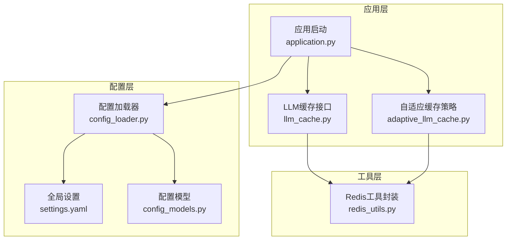
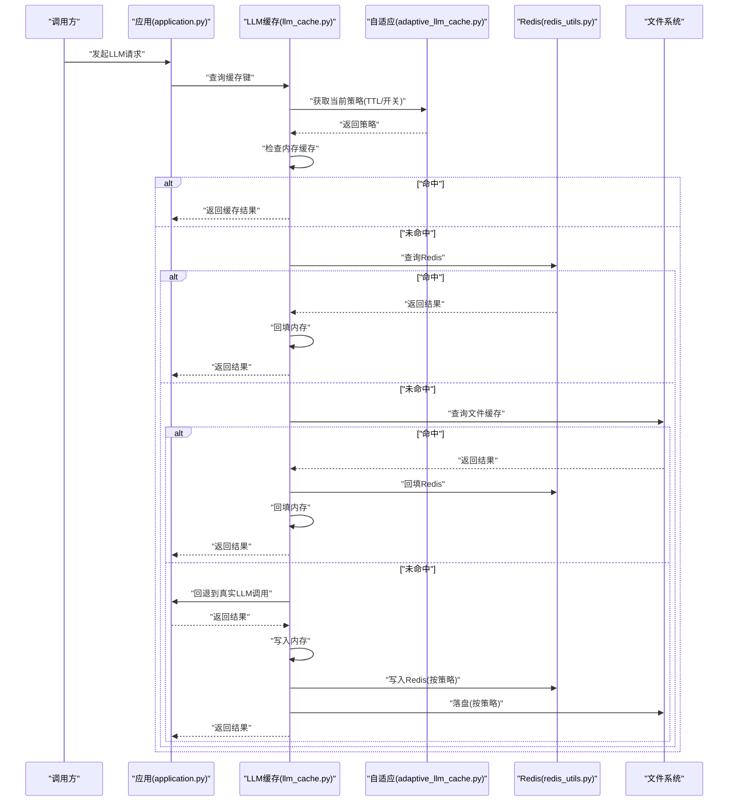
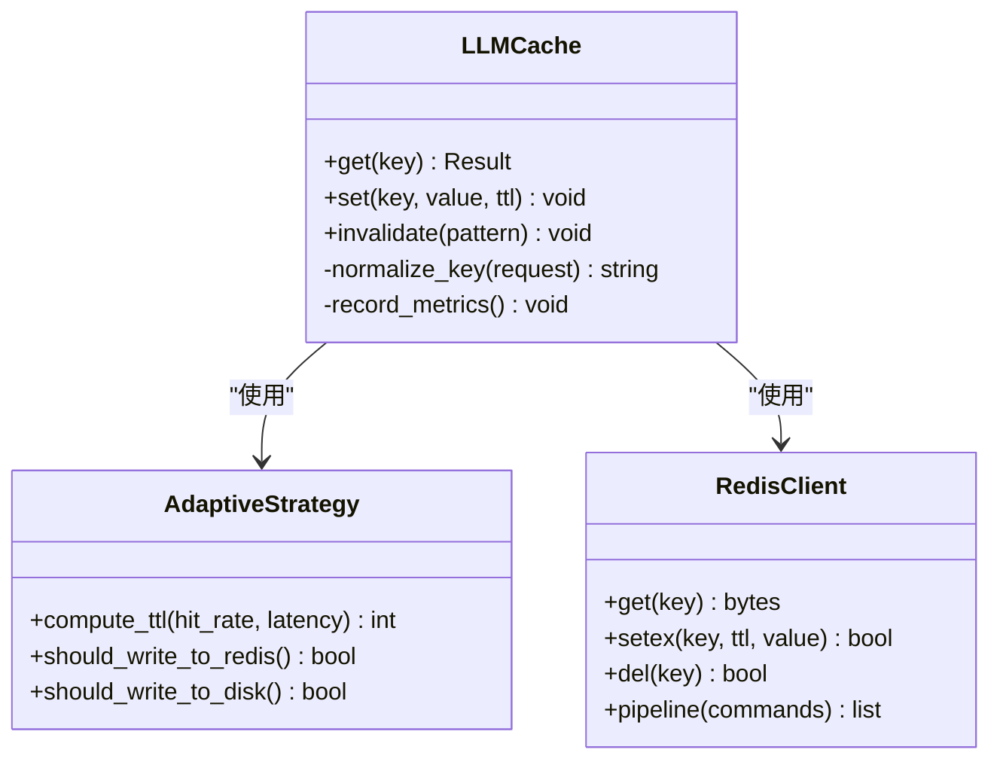
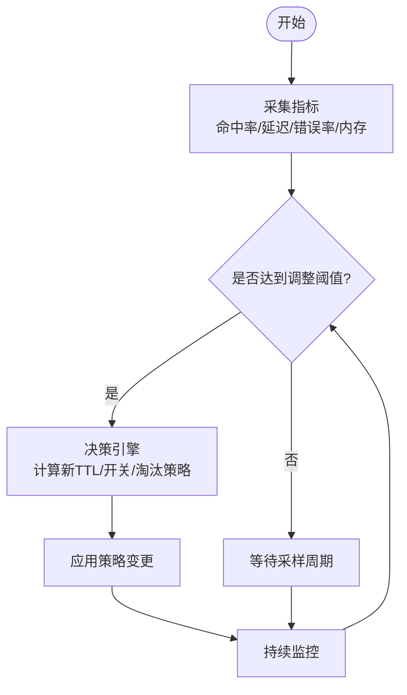
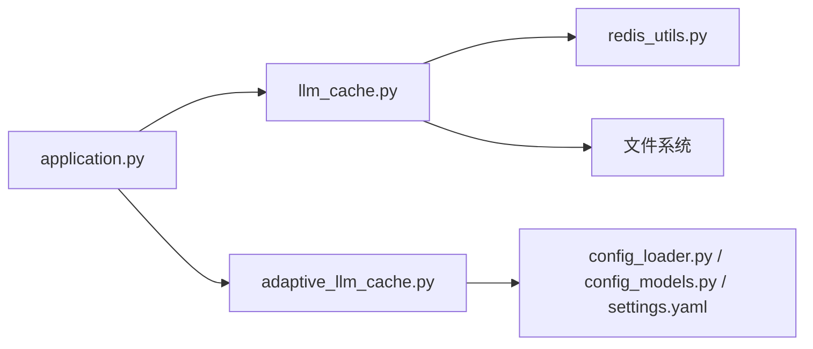

# 缓存策略

<cite>
**本文引用的文件**   
- [src/penshot/app/cache/adaptive_llm_cache.py](file://src/penshot/app/cache/adaptive_llm_cache.py)
- [src/penshot/app/cache/llm_cache.py](file://src/penshot/app/cache/llm_cache.py)
- [src/penshot/utils/redis_utils.py](file://src/penshot/utils/redis_utils.py)
- [src/penshot/config/settings.yaml](file://src/penshot/config/settings.yaml)
- [src/penshot/config/config_loader.py](file://src/penshot/config/config_loader.py)
- [src/penshot/config/config_models.py](file://src/penshot/config/config_models.py)
- [src/penshot/app/application.py](file://src/penshot/app/application.py)
</cite>

## 目录
1. [简介](#简介)
2. [项目结构](#项目结构)
3. [核心组件](#核心组件)
4. [架构总览](#架构总览)
5. [详细组件分析](#详细组件分析)
6. [依赖关系分析](#依赖关系分析)
7. [性能考虑](#性能考虑)
8. [故障排查指南](#故障排查指南)
9. [结论](#结论)
10. [附录](#附录)

## 简介
本文件围绕“多级缓存架构与自适应算法”展开，系统性阐述内存缓存、Redis缓存、文件缓存的层次结构与选择策略；解释自适应缓存算法（命中率监控、动态调整、过期时间管理）；说明LLM响应缓存机制（请求去重、结果复用、失效策略）；并提供配置选项与性能调优指南（内存优化、并发控制、分布式同步），以及监控指标与故障恢复机制。

## 项目结构
缓存相关代码主要位于应用层缓存模块与工具层Redis封装中，并通过配置系统加载参数。整体组织方式如下：
- 应用层缓存
  - LLM缓存抽象与实现
  - 自适应缓存策略
- 工具层
  - Redis客户端封装
- 配置层
  - 全局设置与模型定义
  - 配置加载器
- 应用入口
  - 应用初始化与生命周期管理

图表来源
- [src/penshot/app/application.py](file://src/penshot/app/application.py)
- [src/penshot/app/cache/llm_cache.py](file://src/penshot/app/cache/llm_cache.py)
- [src/penshot/app/cache/adaptive_llm_cache.py](file://src/penshot/app/cache/adaptive_llm_cache.py)
- [src/penshot/utils/redis_utils.py](file://src/penshot/utils/redis_utils.py)
- [src/penshot/config/settings.yaml](file://src/penshot/config/settings.yaml)
- [src/penshot/config/config_loader.py](file://src/penshot/config/config_loader.py)
- [src/penshot/config/config_models.py](file://src/penshot/config/config_models.py)

章节来源
- [src/penshot/app/application.py](file://src/penshot/app/application.py)
- [src/penshot/app/cache/llm_cache.py](file://src/penshot/app/cache/llm_cache.py)
- [src/penshot/app/cache/adaptive_llm_cache.py](file://src/penshot/app/cache/adaptive_llm_cache.py)
- [src/penshot/utils/redis_utils.py](file://src/penshot/utils/redis_utils.py)
- [src/penshot/config/settings.yaml](file://src/penshot/config/settings.yaml)
- [src/penshot/config/config_loader.py](file://src/penshot/config/config_loader.py)
- [src/penshot/config/config_models.py](file://src/penshot/config/config_models.py)

## 核心组件
- LLM缓存接口
  - 提供统一的缓存读写与失效能力，屏蔽底层存储差异（内存/Redis/文件）。
  - 关键职责：生成稳定键、命中判断、写入结果、更新统计、触发失效。
- 自适应缓存策略
  - 在接口基础上引入自适应逻辑：根据命中率、延迟、资源占用等指标动态调整TTL、淘汰策略、是否启用某级缓存。
  - 关键职责：指标采集、阈值判定、策略切换、回退与保护。
- Redis工具封装
  - 统一连接池、序列化、错误重试、超时与降级处理。
  - 关键职责：连接管理、原子操作、批量命令、异常隔离。
- 配置系统
  - 通过YAML与模型类加载并校验缓存相关参数（如各级缓存开关、TTL、容量、限流等）。
  - 关键职责：读取配置、类型校验、默认值合并、热更新支持。

章节来源
- [src/penshot/app/cache/llm_cache.py](file://src/penshot/app/cache/llm_cache.py)
- [src/penshot/app/cache/adaptive_llm_cache.py](file://src/penshot/app/cache/adaptive_llm_cache.py)
- [src/penshot/utils/redis_utils.py](file://src/penshot/utils/redis_utils.py)
- [src/penshot/config/config_loader.py](file://src/penshot/config/config_loader.py)
- [src/penshot/config/config_models.py](file://src/penshot/config/config_models.py)
- [src/penshot/config/settings.yaml](file://src/penshot/config/settings.yaml)

## 架构总览
多级缓存分层设计遵循“就近优先、快速失败、可观测、可回退”的原则：
- 第一层：进程内内存缓存
  - 优点：极低延迟、零网络开销
  - 缺点：进程重启丢失、单机容量有限
- 第二层：Redis分布式缓存
  - 优点：跨进程共享、持久化可选、高可用
  - 缺点：网络延迟、外部依赖
- 第三层：文件缓存（本地磁盘）
  - 优点：容量大、持久化强
  - 缺点：I/O延迟较高、不适合热点高频访问

图表来源
- [src/penshot/app/application.py](file://src/penshot/app/application.py)
- [src/penshot/app/cache/llm_cache.py](file://src/penshot/app/cache/llm_cache.py)
- [src/penshot/app/cache/adaptive_llm_cache.py](file://src/penshot/app/cache/adaptive_llm_cache.py)
- [src/penshot/utils/redis_utils.py](file://src/penshot/utils/redis_utils.py)

## 详细组件分析

### LLM缓存接口（llm_cache.py）
- 设计要点
  - 键生成：对请求参数进行规范化与哈希，确保相同语义的请求产生相同键。
  - 命中流程：内存→Redis→文件→真实LLM，逐级回退。
  - 写入策略：按自适应策略决定写入哪些层级及TTL。
  - 失效策略：支持按前缀/标签批量失效、单键失效、基于时间的TTL自动过期。
  - 统计上报：记录命中/未命中、各层耗时、错误率，供自适应策略使用。
- 复杂度与性能
  - 键生成：O(n)（n为输入长度）
  - 单次查询：O(1)（内存/Redis）+ O(log n)或O(1)（取决于底层实现）
  - 写入：多副本写，注意幂等与一致性权衡
- 错误处理
  - 网络异常：快速失败并回退至下一层或真实调用
  - 序列化异常：降级为明文或跳过该层
  - 配额/限流：指数退避与熔断

图表来源
- [src/penshot/app/cache/llm_cache.py](file://src/penshot/app/cache/llm_cache.py)
- [src/penshot/app/cache/adaptive_llm_cache.py](file://src/penshot/app/cache/adaptive_llm_cache.py)
- [src/penshot/utils/redis_utils.py](file://src/penshot/utils/redis_utils.py)

章节来源
- [src/penshot/app/cache/llm_cache.py](file://src/penshot/app/cache/llm_cache.py)

### 自适应缓存策略（adaptive_llm_cache.py）
- 监控指标
  - 命中率（总体与各层）
  - P50/P95/P99延迟
  - 错误率与超时率
  - 内存占用与对象数量
  - Redis连接数与慢查询
- 动态调整
  - TTL自适应：命中率低且延迟高时缩短TTL；反之延长
  - 层级开关：当Redis不可用时自动关闭二级缓存，仅保留内存与文件
  - 淘汰策略：LRU/LFU切换，依据热点分布与内存压力
- 过期时间管理
  - 基础TTL + 随机抖动，避免雪崩
  - 分级TTL：短命（高频变更）、长命（静态模板）、超长（冷数据）
- 保护机制
  - 熔断：连续错误超过阈值暂停写Redis
  - 限流：对写路径限速，防止放大效应
  - 降级：只读模式，允许读但不写

图表来源
- [src/penshot/app/cache/adaptive_llm_cache.py](file://src/penshot/app/cache/adaptive_llm_cache.py)

章节来源
- [src/penshot/app/cache/adaptive_llm_cache.py](file://src/penshot/app/cache/adaptive_llm_cache.py)

### Redis工具封装（redis_utils.py）
- 功能特性
  - 连接池与多实例支持
  - 序列化/反序列化工具
  - 超时、重试、熔断、降级
  - 批量操作与管道优化
- 可靠性
  - 断线重连与心跳检测
  - 错误分类与告警
  - 安全：敏感信息脱敏与审计日志

章节来源
- [src/penshot/utils/redis_utils.py](file://src/penshot/utils/redis_utils.py)

### 配置系统（settings.yaml / config_loader.py / config_models.py）
- 配置项建议
  - 缓存开关：enable_memory、enable_redis、enable_file
  - TTL策略：base_ttl、ttl_jitter、tiered_ttl
  - 容量与淘汰：memory_max_items、eviction_policy
  - 连接与限流：redis_pool_size、redis_timeout、write_rate_limit
  - 监控与告警：metrics_interval、alert_thresholds
- 加载与校验
  - YAML解析与类型转换
  - 默认值合并与环境变量覆盖
  - 运行时热更新（可选）

章节来源
- [src/penshot/config/settings.yaml](file://src/penshot/config/settings.yaml)
- [src/penshot/config/config_loader.py](file://src/penshot/config/config_loader.py)
- [src/penshot/config/config_models.py](file://src/penshot/config/config_models.py)

## 依赖关系分析
- 耦合关系
  - 应用层依赖缓存接口与自适应策略
  - 缓存接口依赖Redis工具与文件系统
  - 自适应策略依赖配置系统与监控指标
- 外部依赖
  - Redis服务可用性直接影响二级缓存行为
  - 文件系统权限与空间影响三级缓存稳定性

图表来源
- [src/penshot/app/application.py](file://src/penshot/app/application.py)
- [src/penshot/app/cache/llm_cache.py](file://src/penshot/app/cache/llm_cache.py)
- [src/penshot/app/cache/adaptive_llm_cache.py](file://src/penshot/app/cache/adaptive_llm_cache.py)
- [src/penshot/utils/redis_utils.py](file://src/penshot/utils/redis_utils.py)
- [src/penshot/config/config_loader.py](file://src/penshot/config/config_loader.py)
- [src/penshot/config/config_models.py](file://src/penshot/config/config_models.py)
- [src/penshot/config/settings.yaml](file://src/penshot/config/settings.yaml)

章节来源
- [src/penshot/app/application.py](file://src/penshot/app/application.py)
- [src/penshot/app/cache/llm_cache.py](file://src/penshot/app/cache/llm_cache.py)
- [src/penshot/app/cache/adaptive_llm_cache.py](file://src/penshot/app/cache/adaptive_llm_cache.py)
- [src/penshot/utils/redis_utils.py](file://src/penshot/utils/redis_utils.py)
- [src/penshot/config/config_loader.py](file://src/penshot/config/config_loader.py)
- [src/penshot/config/config_models.py](file://src/penshot/config/config_models.py)
- [src/penshot/config/settings.yaml](file://src/penshot/config/settings.yaml)

## 性能考虑
- 内存使用优化
  - 限制内存缓存条目上限，采用LRU/LFU淘汰
  - 压缩大对象或仅缓存摘要，必要时落盘
- 并发访问控制
  - 读写锁分离，减少锁粒度
  - 预取与预热：启动阶段加载热点键
- 分布式缓存同步
  - 使用Redis原子操作保证一致性
  - 事件通知（Pub/Sub）驱动跨节点失效
- 网络与I/O
  - 合理设置超时与重试次数
  - 批量命令与管道降低RTT
- 自适应调优
  - 基于历史命中率与延迟动态调整TTL与层级开关
  - 针对突发流量启用熔断与限流

[本节为通用指导，不直接分析具体文件]

## 故障排查指南
- 常见问题定位
  - 命中率骤降：检查键生成是否稳定、TTL是否过短、是否频繁失效
  - 延迟升高：观察Redis慢查询、连接池耗尽、序列化开销
  - 内存飙升：确认内存缓存上限与淘汰策略是否生效
- 恢复策略
  - 快速回滚：临时关闭自适应，固定TTL与层级开关
  - 降级模式：仅保留内存缓存，禁用写Redis/文件
  - 清理风暴：分批失效，避免一次性删除导致雪崩
- 监控与告警
  - 指标：命中率、P95/P99延迟、错误率、内存占用、Redis连接数
  - 阈值：连续错误、延迟突增、内存超阈触发告警

章节来源
- [src/penshot/app/cache/adaptive_llm_cache.py](file://src/penshot/app/cache/adaptive_llm_cache.py)
- [src/penshot/utils/redis_utils.py](file://src/penshot/utils/redis_utils.py)

## 结论
本缓存策略系统以“多级缓存+自适应算法”为核心，兼顾性能、一致性与可运维性。通过严格的键规范、稳健的回退链路、完善的监控与保护机制，能够在不同负载与故障场景下保持稳定与高效。建议在生产环境结合业务特征持续调优TTL、淘汰策略与层级开关，并完善告警与演练预案。

[本节为总结性内容，不直接分析具体文件]

## 附录
- 术语
  - TTL：生存时间
  - LRU/LFU：最近最少使用/最不经常使用
  - 雪崩：大量键同时过期导致后端瞬时压力
  - 熔断：连续错误后暂停写操作
- 最佳实践清单
  - 键规范化与版本化
  - 小步快跑的热更新策略
  - 全链路埋点与可视化看板
  - 定期压测与回归验证

[本节为补充信息，不直接分析具体文件]