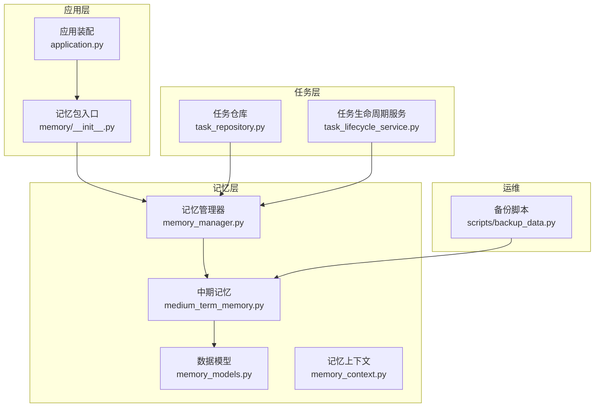
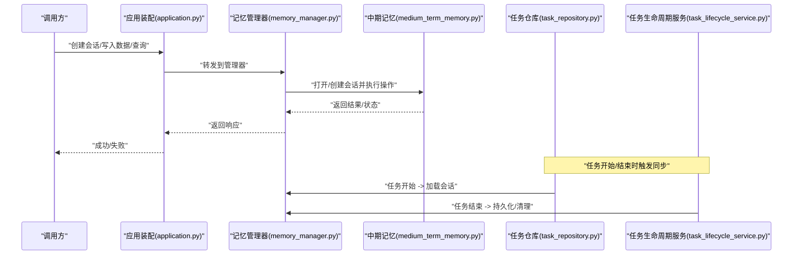
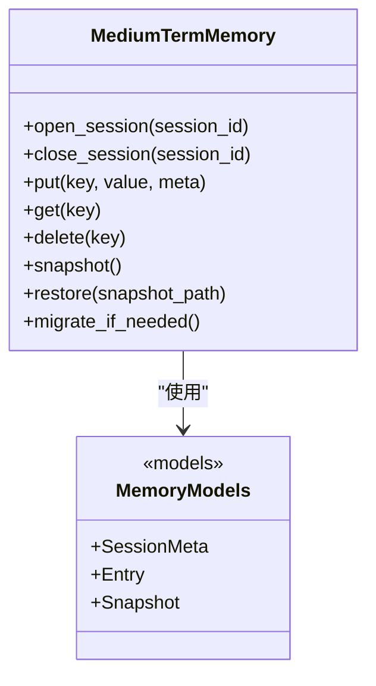
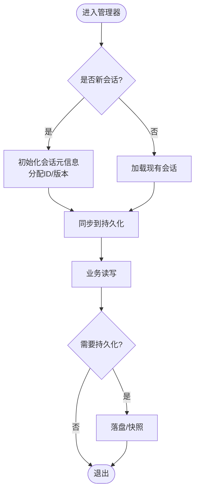
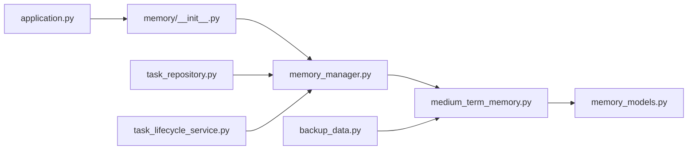

# 中期记忆

<cite>
**本文引用的文件**   
- [src/penshot/knowledge/memory/medium_term_memory.py](file://src/penshot/knowledge/memory/medium_term_memory.py)
- [src/penshot/knowledge/memory/memory_manager.py](file://src/penshot/knowledge/memory/memory_manager.py)
- [src/penshot/knowledge/memory/memory_models.py](file://src/penshot/knowledge/memory/memory_models.py)
- [src/penshot/knowledge/memory/memory_context.py](file://src/penshot/knowledge/memory/memory_context.py)
- [src/penshot/knowledge/memory/__init__.py](file://src/penshot/knowledge/memory/__init__.py)
- [src/penshot/task/task_repository.py](file://src/penshot/task/task_repository.py)
- [src/penshot/task/task_lifecycle_service.py](file://src/penshot/task/task_lifecycle_service.py)
- [src/penshot/app/application.py](file://src/penshot/app/application.py)
- [scripts/backup_data.py](file://scripts/backup_data.py)
</cite>

## 目录
1. [简介](#简介)
2. [项目结构](#项目结构)
3. [核心组件](#核心组件)
4. [架构总览](#架构总览)
5. [详细组件分析](#详细组件分析)
6. [依赖关系分析](#依赖关系分析)
7. [性能考量](#性能考量)
8. [故障排查指南](#故障排查指南)
9. [结论](#结论)
10. [附录](#附录)

## 简介
本文件围绕“中期记忆”子系统，系统性阐述其设计目标、实现原理与使用方式。中期记忆聚焦于会话级持久化、跨请求数据共享与状态保持，提供稳定的会话生命周期管理、序列化与版本兼容策略，以及面向上层任务与工作流的API接口。文档同时覆盖并发访问控制、数据一致性保证、备份恢复与迁移等工程实践要点。

## 项目结构
中期记忆位于知识模块的 memory 子包中，并与任务层、应用启动流程紧密集成：
- 记忆核心：medium_term_memory.py（会话存储与操作）、memory_models.py（数据模型）、memory_context.py（上下文注入）
- 会话编排：memory_manager.py（会话创建、同步、清理）
- 对外暴露：memory/__init__.py（统一入口）
- 任务集成：task_repository.py、task_lifecycle_service.py（任务读写与生命周期钩子）
- 应用装配：application.py（服务初始化与依赖注入）
- 运维脚本：scripts/backup_data.py（备份与恢复）

图表来源
- [src/penshot/knowledge/memory/medium_term_memory.py](file://src/penshot/knowledge/memory/medium_term_memory.py)
- [src/penshot/knowledge/memory/memory_manager.py](file://src/penshot/knowledge/memory/memory_manager.py)
- [src/penshot/knowledge/memory/memory_models.py](file://src/penshot/knowledge/memory/memory_models.py)
- [src/penshot/knowledge/memory/memory_context.py](file://src/penshot/knowledge/memory/memory_context.py)
- [src/penshot/knowledge/memory/__init__.py](file://src/penshot/knowledge/memory/__init__.py)
- [src/penshot/task/task_repository.py](file://src/penshot/task/task_repository.py)
- [src/penshot/task/task_lifecycle_service.py](file://src/penshot/task/task_lifecycle_service.py)
- [src/penshot/app/application.py](file://src/penshot/app/application.py)
- [scripts/backup_data.py](file://scripts/backup_data.py)

章节来源
- [src/penshot/knowledge/memory/medium_term_memory.py](file://src/penshot/knowledge/memory/medium_term_memory.py)
- [src/penshot/knowledge/memory/memory_manager.py](file://src/penshot/knowledge/memory/memory_manager.py)
- [src/penshot/knowledge/memory/memory_models.py](file://src/penshot/knowledge/memory/memory_models.py)
- [src/penshot/knowledge/memory/memory_context.py](file://src/penshot/knowledge/memory/memory_context.py)
- [src/penshot/knowledge/memory/__init__.py](file://src/penshot/knowledge/memory/__init__.py)
- [src/penshot/task/task_repository.py](file://src/penshot/task/task_repository.py)
- [src/penshot/task/task_lifecycle_service.py](file://src/penshot/task/task_lifecycle_service.py)
- [src/penshot/app/application.py](file://src/penshot/app/application.py)
- [scripts/backup_data.py](file://scripts/backup_data.py)

## 核心组件
- 中期记忆（Medium Term Memory）
  - 职责：维护会话级状态，提供键值/结构化数据的持久化与读取；支持跨请求共享同一会话上下文；负责序列化、版本兼容与错误处理。
  - 关键能力：会话ID绑定、增量更新、快照保存、查询过滤、事务性写入（在单进程内）。
- 记忆管理器（Memory Manager）
  - 职责：会话生命周期管理（创建、激活、同步、销毁）；资源清理；并发安全控制；与任务生命周期对接。
- 数据模型（Memory Models）
  - 职责：定义会话元信息、条目结构、版本字段、校验规则；为序列化/反序列化提供契约。
- 记忆上下文（Memory Context）
  - 职责：在当前执行上下文中注入当前会话ID与访问句柄，便于各组件无侵入地读写中期记忆。
- 任务集成
  - 任务仓库：在任务开始/结束阶段触发记忆同步或落盘。
  - 任务生命周期服务：在任务状态变更时调用记忆管理器进行状态对齐。
- 应用装配
  - 在应用启动时初始化记忆后端、注册生命周期钩子、暴露API。
- 备份恢复
  - 提供按会话或全量的导出/导入能力，用于迁移与灾备。

章节来源
- [src/penshot/knowledge/memory/medium_term_memory.py](file://src/penshot/knowledge/memory/medium_term_memory.py)
- [src/penshot/knowledge/memory/memory_manager.py](file://src/penshot/knowledge/memory/memory_manager.py)
- [src/penshot/knowledge/memory/memory_models.py](file://src/penshot/knowledge/memory/memory_models.py)
- [src/penshot/knowledge/memory/memory_context.py](file://src/penshot/knowledge/memory/memory_context.py)
- [src/penshot/task/task_repository.py](file://src/penshot/task/task_repository.py)
- [src/penshot/task/task_lifecycle_service.py](file://src/penshot/task/task_lifecycle_service.py)
- [src/penshot/app/application.py](file://src/penshot/app/application.py)

## 架构总览
中期记忆采用“会话为中心”的架构：每个会话拥有独立命名空间，所有条目携带会话标识；通过记忆管理器协调会话的创建、同步与清理；任务层在生命周期关键点触发持久化；应用层完成依赖注入与API挂载；运维脚本提供备份恢复能力。

图表来源
- [src/penshot/app/application.py](file://src/penshot/app/application.py)
- [src/penshot/knowledge/memory/memory_manager.py](file://src/penshot/knowledge/memory/memory_manager.py)
- [src/penshot/knowledge/memory/medium_term_memory.py](file://src/penshot/knowledge/memory/medium_term_memory.py)
- [src/penshot/task/task_repository.py](file://src/penshot/task/task_repository.py)
- [src/penshot/task/task_lifecycle_service.py](file://src/penshot/task/task_lifecycle_service.py)

## 详细组件分析

### 中期记忆（Medium Term Memory）
- 设计目标
  - 会话级持久化：以会话为单位隔离数据，确保跨请求一致可见。
  - 跨请求共享：通过会话ID定位同一上下文，避免重复计算与状态丢失。
  - 状态保持：在任务中断或重启后仍可恢复工作进度。
- 实现要点
  - 数据结构：会话元信息 + 条目集合（键值/结构化），包含版本号、时间戳、校验和等元数据。
  - 序列化格式：稳定可演进的结构化格式（如JSON/YAML），保留向后兼容字段。
  - 版本兼容：通过 schema_version 字段与迁移逻辑，支持旧格式平滑升级。
  - 错误处理：读写异常捕获、回滚策略、幂等写入。
- 复杂度与性能
  - 读路径：O(1)~O(logN) 取决于索引策略；写路径：增量合并+批量落盘。
  - 优化点：缓存热点会话、延迟落盘、压缩大对象。

图表来源
- [src/penshot/knowledge/memory/medium_term_memory.py](file://src/penshot/knowledge/memory/medium_term_memory.py)
- [src/penshot/knowledge/memory/memory_models.py](file://src/penshot/knowledge/memory/memory_models.py)

章节来源
- [src/penshot/knowledge/memory/medium_term_memory.py](file://src/penshot/knowledge/memory/medium_term_memory.py)
- [src/penshot/knowledge/memory/memory_models.py](file://src/penshot/knowledge/memory/memory_models.py)

### 记忆管理器（Memory Manager）
- 职责
  - 会话创建/销毁：分配唯一会话ID，初始化上下文。
  - 状态同步：在任务边界将内存态与持久化态对齐。
  - 资源清理：释放锁、关闭连接、清理临时文件。
  - 并发控制：单会话串行化写入，多会话并行访问。
- 与任务层的集成
  - 任务开始：加载会话至内存，建立上下文。
  - 任务结束：持久化最新状态，必要时生成快照。
  - 异常路径：记录错误、回滚未提交变更、标记会话不可用。

图表来源
- [src/penshot/knowledge/memory/memory_manager.py](file://src/penshot/knowledge/memory/memory_manager.py)

章节来源
- [src/penshot/knowledge/memory/memory_manager.py](file://src/penshot/knowledge/memory/memory_manager.py)

### 数据模型（Memory Models）
- 会话元信息
  - 字段建议：会话ID、创建时间、更新时间、schema_version、状态、摘要哈希。
- 条目结构
  - 字段建议：键、值、类型、版本、时间戳、标签/分类、校验和。
- 快照结构
  - 字段建议：会话ID、快照ID、时间戳、条目列表、完整性校验。
- 版本兼容
  - 通过 schema_version 驱动迁移；新增字段默认空值；废弃字段保留但忽略。

章节来源
- [src/penshot/knowledge/memory/memory_models.py](file://src/penshot/knowledge/memory/memory_models.py)

### 记忆上下文（Memory Context）
- 作用
  - 在当前线程/协程范围内注入当前会话ID与访问句柄，使工具链无需显式传递会话参数。
- 行为
  - 进入任务时设置上下文；任务结束自动清理；异常时确保上下文被正确释放。

章节来源
- [src/penshot/knowledge/memory/memory_context.py](file://src/penshot/knowledge/memory/memory_context.py)

### 任务集成（Task Repository & Lifecycle Service）
- 任务仓库
  - 在任务开始/结束时调用记忆管理器进行加载/持久化，保证任务状态与记忆一致。
- 任务生命周期服务
  - 监听任务状态变化，触发记忆同步、告警或清理。

章节来源
- [src/penshot/task/task_repository.py](file://src/penshot/task/task_repository.py)
- [src/penshot/task/task_lifecycle_service.py](file://src/penshot/task/task_lifecycle_service.py)

### 应用装配（Application）
- 启动流程
  - 初始化配置与日志
  - 构建记忆后端与管理器
  - 注册任务生命周期钩子
  - 暴露REST/MCP等API
- 依赖注入
  - 通过容器或工厂模式注入记忆实例，避免全局状态耦合。

章节来源
- [src/penshot/app/application.py](file://src/penshot/app/application.py)

### 备份与恢复（Backup Script）
- 功能
  - 导出指定会话或全部会话的数据为归档文件
  - 从归档文件导入并重建会话
  - 校验完整性与版本兼容性
- 使用场景
  - 环境迁移、灾难恢复、离线分析

章节来源
- [scripts/backup_data.py](file://scripts/backup_data.py)

## 依赖关系分析
- 内部依赖
  - 记忆管理器依赖中期记忆与数据模型
  - 任务层依赖记忆管理器进行状态同步
  - 应用装配依赖记忆包入口进行初始化
- 外部依赖
  - 文件系统/数据库（由中期记忆具体实现决定）
  - 序列化库（JSON/YAML等）
- 潜在循环依赖
  - 应避免任务层直接依赖中期记忆细节，仅通过管理器交互

图表来源
- [src/penshot/app/application.py](file://src/penshot/app/application.py)
- [src/penshot/knowledge/memory/__init__.py](file://src/penshot/knowledge/memory/__init__.py)
- [src/penshot/knowledge/memory/memory_manager.py](file://src/penshot/knowledge/memory/memory_manager.py)
- [src/penshot/knowledge/memory/medium_term_memory.py](file://src/penshot/knowledge/memory/medium_term_memory.py)
- [src/penshot/knowledge/memory/memory_models.py](file://src/penshot/knowledge/memory/memory_models.py)
- [src/penshot/task/task_repository.py](file://src/penshot/task/task_repository.py)
- [src/penshot/task/task_lifecycle_service.py](file://src/penshot/task/task_lifecycle_service.py)
- [scripts/backup_data.py](file://scripts/backup_data.py)

章节来源
- [src/penshot/knowledge/memory/__init__.py](file://src/penshot/knowledge/memory/__init__.py)
- [src/penshot/knowledge/memory/memory_manager.py](file://src/penshot/knowledge/memory/memory_manager.py)
- [src/penshot/knowledge/memory/medium_term_memory.py](file://src/penshot/knowledge/memory/medium_term_memory.py)
- [src/penshot/knowledge/memory/memory_models.py](file://src/penshot/knowledge/memory/memory_models.py)
- [src/penshot/task/task_repository.py](file://src/penshot/task/task_repository.py)
- [src/penshot/task/task_lifecycle_service.py](file://src/penshot/task/task_lifecycle_service.py)
- [src/penshot/app/application.py](file://src/penshot/app/application.py)
- [scripts/backup_data.py](file://scripts/backup_data.py)

## 性能考量
- 读写路径优化
  - 热会话常驻内存，冷会话按需加载
  - 批量写入与延迟落盘，减少IO抖动
- 序列化成本
  - 对大对象采用分块/压缩策略
  - 选择性字段持久化，避免冗余
- 并发与一致性
  - 单会话串行写入，多会话并行访问
  - 幂等操作与重试机制，避免重复写入
- 监控与指标
  - 记录读写耗时、命中率、落盘频率、错误率

[本节为通用指导，不直接分析具体文件]

## 故障排查指南
- 常见问题
  - 会话无法加载：检查会话ID有效性、文件权限、版本不兼容
  - 写入失败：确认磁盘空间、序列化格式、锁冲突
  - 状态不一致：核对任务生命周期钩子是否触发、是否存在异常分支未持久化
- 诊断步骤
  - 查看会话元信息与最近更新时间
  - 对比快照与当前状态差异
  - 启用更详细的日志输出，定位异常堆栈
- 恢复策略
  - 使用备份脚本恢复到最近可用快照
  - 若版本不兼容，先执行迁移再恢复

章节来源
- [src/penshot/knowledge/memory/medium_term_memory.py](file://src/penshot/knowledge/memory/medium_term_memory.py)
- [src/penshot/knowledge/memory/memory_manager.py](file://src/penshot/knowledge/memory/memory_manager.py)
- [scripts/backup_data.py](file://scripts/backup_data.py)

## 结论
中期记忆以会话为核心，结合记忆管理器与任务生命周期，实现了跨请求的状态保持与一致性。通过明确的数据模型与序列化策略，系统具备良好的可扩展性与版本兼容性。配合备份恢复与完善的错误处理，可在生产环境中稳定运行。

[本节为总结性内容，不直接分析具体文件]

## 附录

### API 参考（概念性说明）
- 会话操作
  - 创建会话：输入可选初始数据，返回会话ID
  - 删除会话：清理会话及其关联资源
  - 列出会话：按条件过滤返回会话清单
- 数据操作
  - 写入：键值/结构化数据，支持元数据与版本
  - 读取：按键或范围查询，支持分页与排序
  - 删除：按键删除或批量删除
- 迁移与备份
  - 迁移：检测并升级到最新schema版本
  - 备份：导出会话数据为归档文件
  - 恢复：从归档文件重建会话

[本节为概念性说明，不直接分析具体文件]