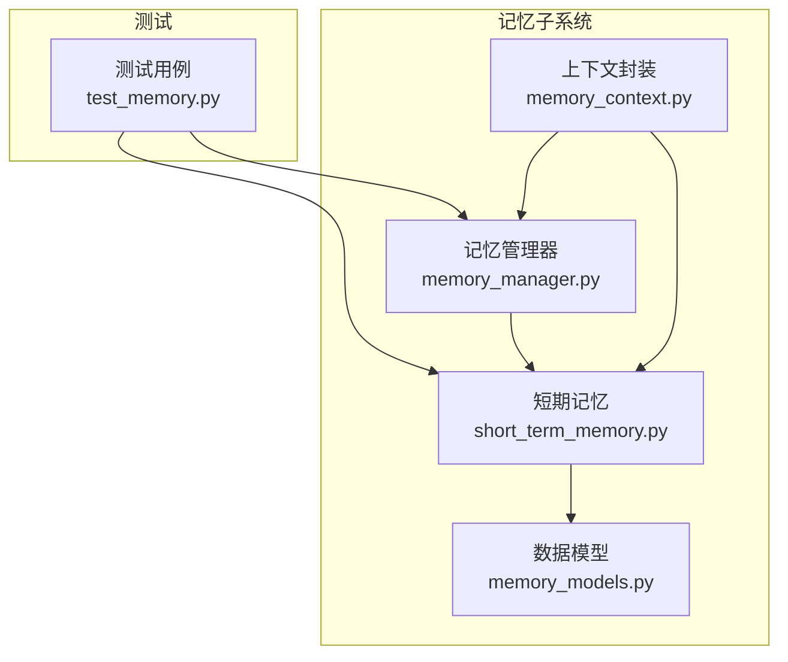
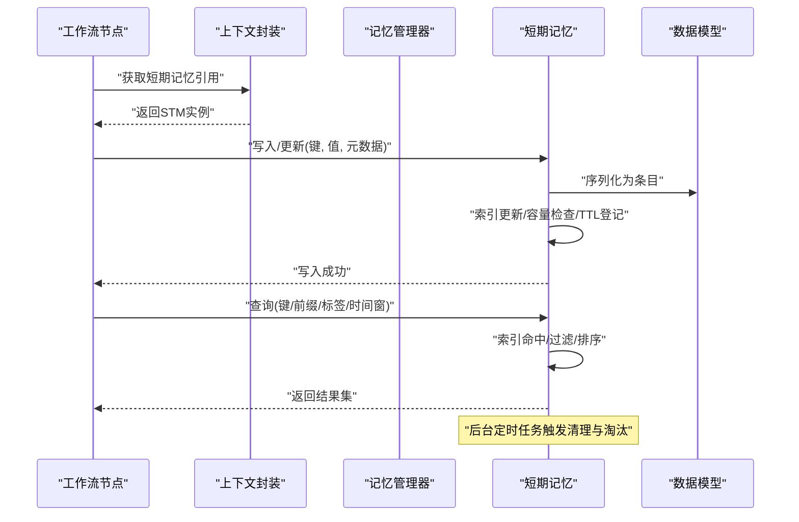
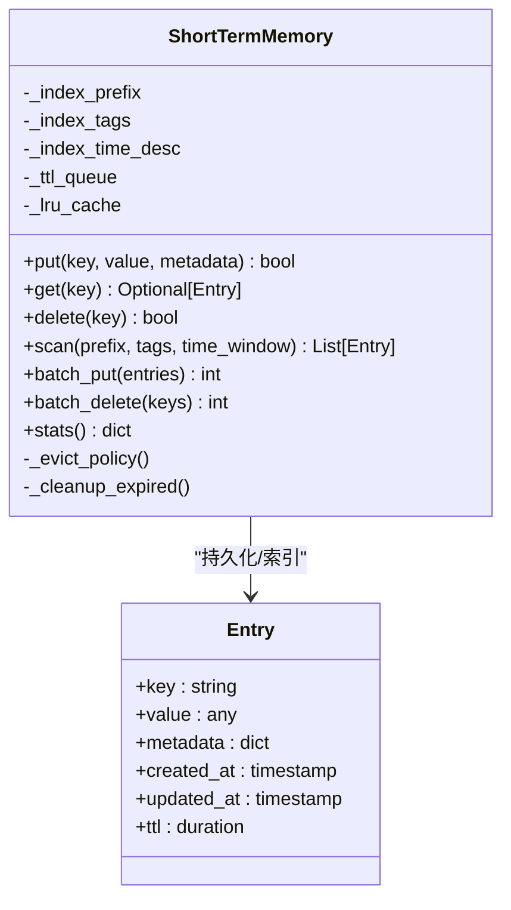
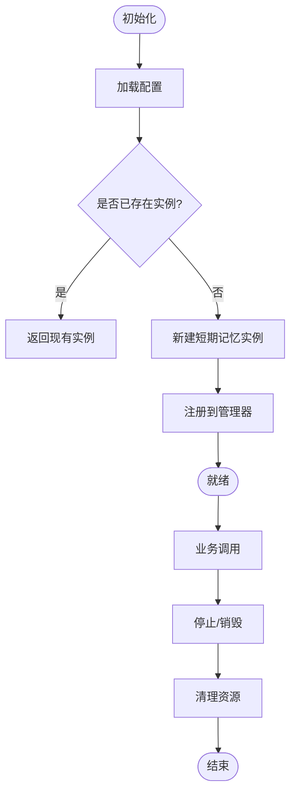
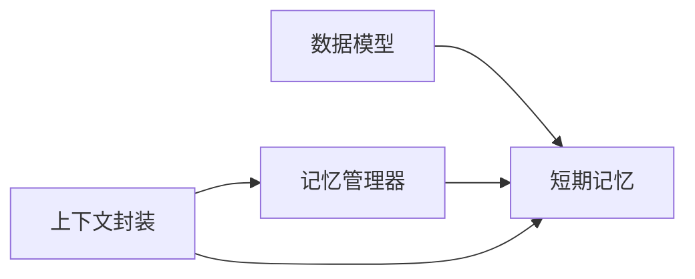

# 短期记忆

<cite>
**本文引用的文件**   
- [short_term_memory.py](file://src/penshot/knowledge/memory/short_term_memory.py)
- [memory_manager.py](file://src/penshot/knowledge/memory/memory_manager.py)
- [memory_models.py](file://src/penshot/knowledge/memory/memory_models.py)
- [memory_context.py](file://src/penshot/knowledge/memory/memory_context.py)
- [test_memory.py](file://tests/task/test_memory.py)
</cite>

## 目录
1. [简介](#简介)
2. [项目结构](#项目结构)
3. [核心组件](#核心组件)
4. [架构总览](#架构总览)
5. [详细组件分析](#详细组件分析)
6. [依赖分析](#依赖分析)
7. [性能考虑](#性能考虑)
8. [故障恢复指南](#故障恢复指南)
9. [结论](#结论)
10. [附录](#附录)

## 简介
本文件围绕“短期记忆”子系统，系统性阐述其设计目标、实现原理与使用方式。短期记忆用于在任务执行期间提供低延迟的内存存储与检索能力，支撑工作流节点间的数据共享、中间结果缓存与上下文传递。文档覆盖以下方面：
- 实时数据存储与快速检索机制
- 内存管理与容量控制策略
- 存储结构与索引优化
- 生命周期管理（自动清理、过期处理）
- API 接口与使用示例（写入、查询、批量处理）
- 性能优化建议与故障恢复机制

## 项目结构
短期记忆位于知识模块的记忆子系统中，相关文件如下：
- short_term_memory.py：短期记忆核心实现
- memory_manager.py：记忆管理器，负责多实例/会话级协调
- memory_models.py：数据模型定义（条目、元数据等）
- memory_context.py：上下文封装，便于在工作流中注入与访问
- test_memory.py：单元测试，覆盖典型读写与边界场景

图表来源
- [short_term_memory.py](file://src/penshot/knowledge/memory/short_term_memory.py)
- [memory_manager.py](file://src/penshot/knowledge/memory/memory_manager.py)
- [memory_models.py](file://src/penshot/knowledge/memory/memory_models.py)
- [memory_context.py](file://src/penshot/knowledge/memory/memory_context.py)
- [test_memory.py](file://tests/task/test_memory.py)

章节来源
- [short_term_memory.py](file://src/penshot/knowledge/memory/short_term_memory.py)
- [memory_manager.py](file://src/penshot/knowledge/memory/memory_manager.py)
- [memory_models.py](file://src/penshot/knowledge/memory/memory_models.py)
- [memory_context.py](file://src/penshot/knowledge/memory/memory_context.py)
- [test_memory.py](file://tests/task/test_memory.py)

## 核心组件
- 短期记忆（ShortTermMemory）
  - 职责：提供线程安全的键值/结构化数据存取；支持按前缀/标签/时间窗检索；维护容量上限与过期策略；暴露批量操作接口。
  - 关键特性：低延迟读路径、可配置的 TTL、LRU/容量淘汰、可选索引加速。
- 记忆管理器（MemoryManager）
  - 职责：创建与管理多个短期记忆实例（如按会话/任务隔离）；统一配置下发；生命周期钩子（启动/停止/清理）。
- 数据模型（MemoryModels）
  - 职责：定义条目结构、元数据（时间戳、TTL、标签、版本）、序列化/反序列化契约。
- 上下文封装（MemoryContext）
  - 职责：将短期记忆注入到工作流上下文，提供便捷访问方法，屏蔽底层细节。

章节来源
- [short_term_memory.py](file://src/penshot/knowledge/memory/short_term_memory.py)
- [memory_manager.py](file://src/penshot/knowledge/memory/memory_manager.py)
- [memory_models.py](file://src/penshot/knowledge/memory/memory_models.py)
- [memory_context.py](file://src/penshot/knowledge/memory/memory_context.py)

## 架构总览
短期记忆作为进程内内存存储，面向工作流节点提供高并发、低延迟的读写服务。整体交互如下：

图表来源
- [short_term_memory.py](file://src/penshot/knowledge/memory/short_term_memory.py)
- [memory_manager.py](file://src/penshot/knowledge/memory/memory_manager.py)
- [memory_models.py](file://src/penshot/knowledge/memory/memory_models.py)
- [memory_context.py](file://src/penshot/knowledge/memory/memory_context.py)

## 详细组件分析

### 短期记忆（ShortTermMemory）
- 设计目标
  - 低延迟：热点键 O(1) 读取，批量扫描基于索引与过滤。
  - 可控容量：通过最大条目数或内存阈值触发淘汰。
  - 过期治理：TTL 驱动清理，避免长期驻留。
  - 线程安全：并发读写互斥，保证一致性。
- 存储结构
  - 主存储：键到条目的映射，支持原子更新与删除。
  - 索引：前缀索引、标签集合、时间倒序索引，用于范围查询与筛选。
  - 队列：过期条目队列，供定时清理消费。
- 索引优化
  - 写时增量更新索引，避免全量重建。
  - 对高频前缀/标签建立轻量计数，辅助快速判断存在性。
- 缓存策略
  - 本地 LRU 二级缓存（可选），提升热点键命中率。
  - 缓存失效与主存储保持一致。
- 生命周期管理
  - 自动清理：周期性扫描过期队列并释放内存。
  - 容量控制：达到上限时按最近最少使用或最旧过期优先淘汰。
  - 优雅关闭：停止新写入，完成剩余清理后释放资源。
- 错误处理
  - 非法键/空值校验失败返回明确错误码。
  - 并发冲突采用乐观锁或版本号控制。
  - 资源不足时降级为只读或拒绝写入。

图表来源
- [short_term_memory.py](file://src/penshot/knowledge/memory/short_term_memory.py)
- [memory_models.py](file://src/penshot/knowledge/memory/memory_models.py)

章节来源
- [short_term_memory.py](file://src/penshot/knowledge/memory/short_term_memory.py)
- [memory_models.py](file://src/penshot/knowledge/memory/memory_models.py)

### 记忆管理器（MemoryManager）
- 职责
  - 工厂模式创建短期记忆实例，支持按会话/任务隔离。
  - 统一加载配置（容量、TTL、索引开关、缓存开关）。
  - 提供全局注册表与生命周期钩子（启动/停止/健康检查）。
- 关键行为
  - 按需懒加载实例，减少冷启动开销。
  - 实例销毁时触发内部清理与统计上报。
  - 监控指标：条目数、命中率、淘汰次数、清理耗时。

图表来源
- [memory_manager.py](file://src/penshot/knowledge/memory/memory_manager.py)
- [short_term_memory.py](file://src/penshot/knowledge/memory/short_term_memory.py)

章节来源
- [memory_manager.py](file://src/penshot/knowledge/memory/memory_manager.py)

### 数据模型（MemoryModels）
- 条目（Entry）
  - 字段：键、值、元数据、创建/更新时间、TTL。
  - 约束：键唯一；TTL 非负；元数据为扁平字典。
- 元数据（Metadata）
  - 字段：标签列表、优先级、来源标识、版本。
  - 用途：索引构建、审计追踪、冲突解决。
- 序列化
  - 二进制/JSON 双格式支持，便于调试与扩展。

章节来源
- [memory_models.py](file://src/penshot/knowledge/memory/memory_models.py)

### 上下文封装（MemoryContext）
- 职责
  - 在工作流上下文中注入短期记忆引用。
  - 提供便捷方法：with_memory、get_memory、clear_session 等。
- 集成点
  - 与工作流编排器协作，确保每个任务拥有独立短期记忆视图。

章节来源
- [memory_context.py](file://src/penshot/knowledge/memory/memory_context.py)

### 使用示例与API说明
- 写入
  - put(key, value, metadata=None)：写入或更新条目，返回布尔表示成功。
  - batch_put(entries)：批量写入，返回成功数量。
- 查询
  - get(key)：按键精确查询。
  - scan(prefix, tags=None, time_window=None)：按前缀/标签/时间窗检索。
- 删除
  - delete(key)：删除指定键。
  - batch_delete(keys)：批量删除，返回成功数量。
- 统计
  - stats()：返回条目数、命中率、淘汰次数、清理耗时等。

参考测试用例以了解典型用法与边界条件。

章节来源
- [short_term_memory.py](file://src/penshot/knowledge/memory/short_term_memory.py)
- [test_memory.py](file://tests/task/test_memory.py)

## 依赖分析
- 内部依赖
  - 短期记忆依赖数据模型进行序列化与校验。
  - 记忆管理器依赖短期记忆实例，并提供生命周期管理。
  - 上下文封装依赖短期记忆与记忆管理器，简化上层调用。
- 外部依赖
  - 标准库：线程同步原语、时间/队列工具。
  - 可选：高性能序列化库、内存监控库。

图表来源
- [short_term_memory.py](file://src/penshot/knowledge/memory/short_term_memory.py)
- [memory_manager.py](file://src/penshot/knowledge/memory/memory_manager.py)
- [memory_models.py](file://src/penshot/knowledge/memory/memory_models.py)
- [memory_context.py](file://src/penshot/knowledge/memory/memory_context.py)

章节来源
- [short_term_memory.py](file://src/penshot/knowledge/memory/short_term_memory.py)
- [memory_manager.py](file://src/penshot/knowledge/memory/memory_manager.py)
- [memory_models.py](file://src/penshot/knowledge/memory/memory_models.py)
- [memory_context.py](file://src/penshot/knowledge/memory/memory_context.py)

## 性能考虑
- 读路径优化
  - 热点键启用 LRU 二级缓存，降低主存储访问压力。
  - 前缀/标签索引预计算，避免全表扫描。
- 写路径优化
  - 批量写入合并索引更新，减少锁竞争。
  - 惰性索引构建：仅对常用维度建索引。
- 容量与淘汰
  - 基于 LRU 与 TTL 的组合淘汰策略，平衡命中率与内存占用。
  - 动态阈值：根据系统负载调整容量上限。
- 清理与回收
  - 后台清理任务分片执行，避免长事务阻塞。
  - 清理完成后立即释放对象引用，促进 GC。
- 监控与调优
  - 暴露命中率、淘汰率、清理耗时等指标。
  - 针对热点键进行局部预热与分区隔离。

## 故障恢复指南
- 常见异常
  - 键冲突：采用版本号或 CAS 语义解决。
  - 容量溢出：触发淘汰并记录告警，必要时拒绝写入。
  - 并发竞争：加锁或无锁数据结构保障一致性。
- 恢复策略
  - 幂等写入：重复写入不改变最终状态。
  - 快照与回滚：定期导出快照，崩溃后可恢复到最近一致点。
  - 健康检查：周期性自检，发现不一致时触发修复流程。
- 排障步骤
  - 查看统计信息定位瓶颈（命中率、淘汰率）。
  - 检查清理任务是否正常运行。
  - 核对 TTL 与容量配置是否符合预期。

章节来源
- [short_term_memory.py](file://src/penshot/knowledge/memory/short_term_memory.py)
- [memory_manager.py](file://src/penshot/knowledge/memory/memory_manager.py)

## 结论
短期记忆以进程内内存为核心，结合索引与缓存策略，为工作流提供低延迟、可控容量的数据共享能力。通过完善的生命周期管理与监控指标，可在复杂任务场景中稳定运行。建议在生产环境开启二级缓存与精细化监控，并根据负载动态调整容量与清理频率。

## 附录
- 术语
  - TTL：生存时间，超过后条目将被清理。
  - LRU：最近最少使用，淘汰策略之一。
  - 索引：用于加速范围与条件查询的数据结构。
- 相关文档
  - 工作流编排与上下文注入参见上下文封装与记忆管理器。
  - 数据模型扩展遵循条目与元数据契约。