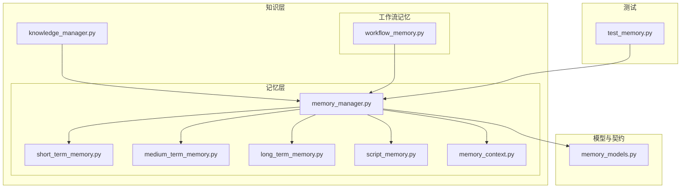
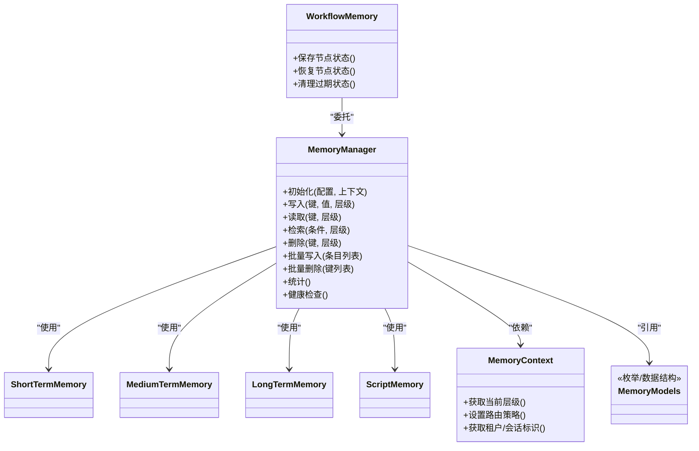
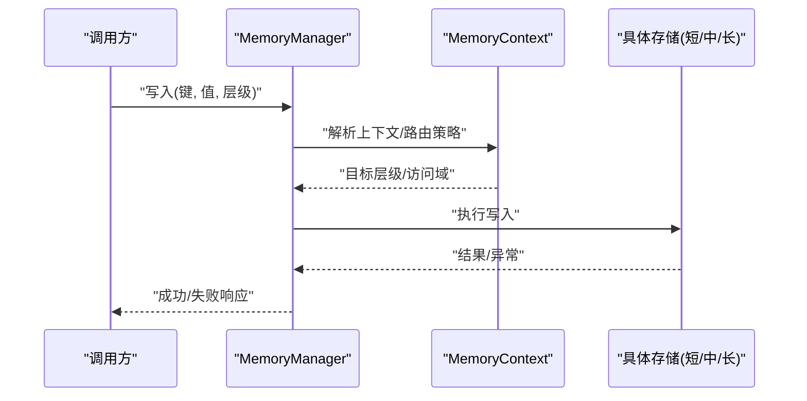
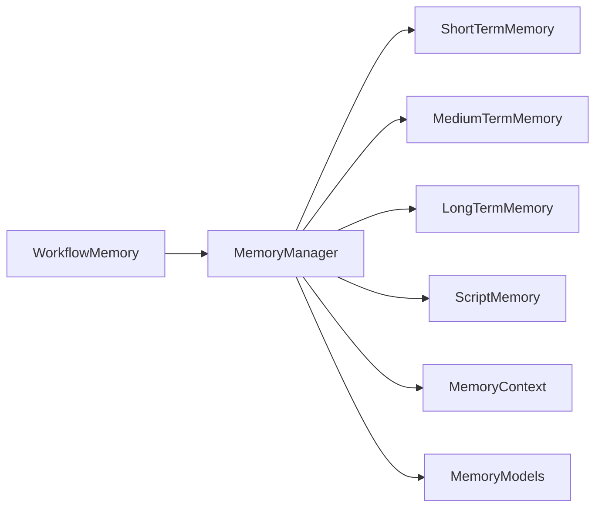

# 记忆管理器

<cite>
**本文引用的文件**   
- [memory_manager.py](file://src/penshot/neopen/knowledge/memory/memory_manager.py)
- [long_term_memory.py](file://src/penshot/neopen/knowledge/memory/long_term_memory.py)
- [medium_term_memory.py](file://src/penshot/neopen/knowledge/memory/medium_term_memory.py)
- [short_term_memory.py](file://src/penshot/neopen/knowledge/memory/short_term_memory.py)
- [memory_models.py](file://src/penshot/neopen/knowledge/memory/memory_models.py)
- [script_memory.py](file://src/penshot/neopen/knowledge/memory/script_memory.py)
- [memory_context.py](file://src/penshot/neopen/knowledge/memory/memory_context.py)
- [workflow_memory.py](file://src/penshot/neopen/knowledge/workflow/workflow_memory.py)
- [knowledge_manager.py](file://src/penshot/neopen/knowledge/knowledge_manager.py)
- [test_memory.py](file://tests/task/test_memory.py)
</cite>

## 目录
1. [简介](#简介)
2. [项目结构](#项目结构)
3. [核心组件](#核心组件)
4. [架构总览](#架构总览)
5. [详细组件分析](#详细组件分析)
6. [依赖关系分析](#依赖关系分析)
7. [性能考虑](#性能考虑)
8. [故障排查指南](#故障排查指南)
9. [结论](#结论)
10. [附录：API与使用示例](#附录api与使用示例)

## 简介
本文件面向“记忆管理器”子系统，系统性阐述其职责、架构与实现要点。重点覆盖：
- 三级记忆（短期、中期、长期）的统一接口与生命周期管理
- 资源调度与路由分发机制
- 工厂模式与依赖注入在记忆模块中的落地
- 初始化、路由、监控等关键流程
- API 能力与使用示例（全局配置、动态切换、批量操作）
- 错误处理、日志记录与性能监控机制

## 项目结构
记忆相关代码位于 knowledge/memory 子包中，围绕 memory_manager 提供统一入口；同时存在 workflow 层的轻量级工作流记忆以及测试用例用于验证行为。

图示来源
- [memory_manager.py](file://src/penshot/neopen/knowledge/memory/memory_manager.py)
- [short_term_memory.py](file://src/penshot/neopen/knowledge/memory/short_term_memory.py)
- [medium_term_memory.py](file://src/penshot/neopen/knowledge/memory/medium_term_memory.py)
- [long_term_memory.py](file://src/penshot/neopen/knowledge/memory/long_term_memory.py)
- [script_memory.py](file://src/penshot/neopen/knowledge/memory/script_memory.py)
- [memory_context.py](file://src/penshot/neopen/knowledge/memory/memory_context.py)
- [memory_models.py](file://src/penshot/neopen/knowledge/memory/memory_models.py)
- [workflow_memory.py](file://src/penshot/neopen/knowledge/workflow/workflow_memory.py)
- [knowledge_manager.py](file://src/penshot/neopen/knowledge/knowledge_manager.py)
- [test_memory.py](file://tests/task/test_memory.py)

章节来源
- [memory_manager.py](file://src/penshot/neopen/knowledge/memory/memory_manager.py)
- [memory_models.py](file://src/penshot/neopen/knowledge/memory/memory_models.py)
- [knowledge_manager.py](file://src/penshot/neopen/knowledge/knowledge_manager.py)
- [workflow_memory.py](file://src/penshot/neopen/knowledge/workflow/workflow_memory.py)
- [test_memory.py](file://tests/task/test_memory.py)

## 核心组件
- 记忆管理器（MemoryManager）
  - 职责：统一协调短期、中期、长期记忆；提供读写、检索、清理、统计等能力；负责生命周期管理与资源调度。
  - 关键点：对外暴露稳定接口；内部按策略选择具体存储后端；对上下文进行封装与传播。
- 短期记忆（ShortTermMemory）
  - 职责：会话内高频、低延迟的临时数据存取；通常具备过期或容量限制。
- 中期记忆（MediumTermMemory）
  - 职责：跨会话但有限时间窗内的结构化记忆；支持索引与检索。
- 长期记忆（LongTermMemory）
  - 职责：持久化、可检索的知识沉淀；支持大规模数据与外部存储集成。
- 脚本记忆（ScriptMemory）
  - 职责：针对剧本/脚本场景的专用记忆形态，提供领域相关的增删改查与聚合能力。
- 记忆上下文（MemoryContext）
  - 职责：为一次调用链提供隔离的记忆视图与元数据，便于路由与权限控制。
- 工作流记忆（WorkflowMemory）
  - 职责：在工作流编排过程中维护中间状态与结果缓存，提升整体吞吐与稳定性。
- 记忆模型（MemoryModels）
  - 职责：定义统一的实体、查询条件、分页与返回结构，确保上层一致体验。

章节来源
- [memory_manager.py](file://src/penshot/neopen/knowledge/memory/memory_manager.py)
- [short_term_memory.py](file://src/penshot/neopen/knowledge/memory/short_term_memory.py)
- [medium_term_memory.py](file://src/penshot/neopen/knowledge/memory/medium_term_memory.py)
- [long_term_memory.py](file://src/penshot/neopen/knowledge/memory/long_term_memory.py)
- [script_memory.py](file://src/penshot/neopen/knowledge/memory/script_memory.py)
- [memory_context.py](file://src/penshot/neopen/knowledge/memory/memory_context.py)
- [workflow_memory.py](file://src/penshot/neopen/knowledge/workflow/workflow_memory.py)
- [memory_models.py](file://src/penshot/neopen/knowledge/memory/memory_models.py)

## 架构总览
记忆管理器采用“统一入口 + 分层存储 + 上下文路由”的架构。通过工厂模式按需创建并注入不同层级记忆实例，由 MemoryContext 决定当前请求的路由策略与可见范围。

图示来源
- [memory_manager.py](file://src/penshot/neopen/knowledge/memory/memory_manager.py)
- [short_term_memory.py](file://src/penshot/neopen/knowledge/memory/short_term_memory.py)
- [medium_term_memory.py](file://src/penshot/neopen/knowledge/memory/medium_term_memory.py)
- [long_term_memory.py](file://src/penshot/neopen/knowledge/memory/long_term_memory.py)
- [script_memory.py](file://src/penshot/neopen/knowledge/memory/script_memory.py)
- [memory_context.py](file://src/penshot/neopen/knowledge/memory/memory_context.py)
- [workflow_memory.py](file://src/penshot/neopen/knowledge/workflow/workflow_memory.py)
- [memory_models.py](file://src/penshot/neopen/knowledge/memory/memory_models.py)

## 详细组件分析

### 记忆管理器（MemoryManager）
- 设计要点
  - 统一接口：屏蔽底层差异，向上提供一致的读写、检索、批量操作与统计能力。
  - 生命周期：负责各层级记忆的创建、预热、优雅关闭与资源回收。
  - 资源调度：根据负载与策略在不同层级间做读写分流与缓存命中优化。
  - 错误处理：对异常进行分级捕获、降级与上报，保证系统可用性。
  - 日志与监控：记录关键路径耗时、命中率、失败率等指标。
- 关键流程
  - 初始化：加载配置、构建上下文、实例化各级记忆、注册健康检查。
  - 路由分发：依据上下文与键空间策略选择目标层级。
  - 状态监控：周期性采集统计信息，输出告警与报表。

图示来源
- [memory_manager.py](file://src/penshot/neopen/knowledge/memory/memory_manager.py)
- [memory_context.py](file://src/penshot/neopen/knowledge/memory/memory_context.py)
- [short_term_memory.py](file://src/penshot/neopen/knowledge/memory/short_term_memory.py)
- [medium_term_memory.py](file://src/penshot/neopen/knowledge/memory/medium_term_memory.py)
- [long_term_memory.py](file://src/penshot/neopen/knowledge/memory/long_term_memory.py)

章节来源
- [memory_manager.py](file://src/penshot/neopen/knowledge/memory/memory_manager.py)
- [memory_context.py](file://src/penshot/neopen/knowledge/memory/memory_context.py)

### 短期记忆（ShortTermMemory）
- 适用场景：会话内高频读写、低延迟需求；具备容量上限与自动淘汰策略。
- 关注点：并发安全、内存占用控制、快速序列化/反序列化。

章节来源
- [short_term_memory.py](file://src/penshot/neopen/knowledge/memory/short_term_memory.py)

### 中期记忆（MediumTermMemory）
- 适用场景：跨会话但有限时间窗的结构化记忆；需要索引与检索能力。
- 关注点：索引维护成本、查询性能、一致性边界。

章节来源
- [medium_term_memory.py](file://src/penshot/neopen/knowledge/memory/medium_term_memory.py)

### 长期记忆（LongTermMemory）
- 适用场景：持久化、可检索的知识沉淀；可能对接外部数据库或向量库。
- 关注点：I/O 开销、事务与幂等、备份与恢复、扩容迁移。

章节来源
- [long_term_memory.py](file://src/penshot/neopen/knowledge/memory/long_term_memory.py)

### 脚本记忆（ScriptMemory）
- 适用场景：剧本/脚本领域的专用记忆形态，提供领域语义化的增删改查与聚合。
- 关注点：领域模型映射、批量导入导出、版本与变更追踪。

章节来源
- [script_memory.py](file://src/penshot/neopen/knowledge/memory/script_memory.py)

### 记忆上下文（MemoryContext）
- 作用：在一次调用链中维护隔离的视图、路由策略与元数据（如租户、会话ID）。
- 价值：解耦业务逻辑与存储细节，支撑多租户与灰度策略。

章节来源
- [memory_context.py](file://src/penshot/neopen/knowledge/memory/memory_context.py)

### 工作流记忆（WorkflowMemory）
- 作用：在工作流编排中保存节点状态、中间结果与重试信息，保障可恢复性。
- 与 MemoryManager 的关系：作为上层消费者，委托 MemoryManager 完成实际存取。

章节来源
- [workflow_memory.py](file://src/penshot/neopen/knowledge/workflow/workflow_memory.py)
- [memory_manager.py](file://src/penshot/neopen/knowledge/memory/memory_manager.py)

### 记忆模型（MemoryModels）
- 内容：统一的实体、查询条件、分页与返回结构定义，确保上层一致体验。
- 价值：降低耦合，便于扩展新层级或新存储后端。

章节来源
- [memory_models.py](file://src/penshot/neopen/knowledge/memory/memory_models.py)

## 依赖关系分析
- 组件耦合
  - MemoryManager 对各级记忆为“组合+策略选择”，耦合度适中，易于替换实现。
  - MemoryContext 提供路由与隔离，降低上层对存储实现的感知。
  - WorkflowMemory 仅依赖 MemoryManager 的公共接口，保持高内聚。
- 外部依赖
  - 可能的持久化后端（数据库、缓存、对象存储）通过具体存储实现接入，不直接侵入管理器。
- 潜在循环依赖
  - 通过上下文与模型解耦，避免直接循环引用。

图示来源
- [memory_manager.py](file://src/penshot/neopen/knowledge/memory/memory_manager.py)
- [short_term_memory.py](file://src/penshot/neopen/knowledge/memory/short_term_memory.py)
- [medium_term_memory.py](file://src/penshot/neopen/knowledge/memory/medium_term_memory.py)
- [long_term_memory.py](file://src/penshot/neopen/knowledge/memory/long_term_memory.py)
- [script_memory.py](file://src/penshot/neopen/knowledge/memory/script_memory.py)
- [memory_context.py](file://src/penshot/neopen/knowledge/memory/memory_context.py)
- [workflow_memory.py](file://src/penshot/neopen/knowledge/workflow/workflow_memory.py)
- [memory_models.py](file://src/penshot/neopen/knowledge/memory/memory_models.py)

章节来源
- [memory_manager.py](file://src/penshot/neopen/knowledge/memory/memory_manager.py)
- [memory_models.py](file://src/penshot/neopen/knowledge/memory/memory_models.py)

## 性能考虑
- 读写分流：热点数据优先命中短期记忆，减少 I/O 压力。
- 批量操作：合并多次写入/删除，降低网络与锁竞争。
- 索引与过滤：在中长期记忆中合理建立索引，避免全表扫描。
- 超时与重试：对远端存储增加超时、退避与熔断策略。
- 监控与告警：跟踪命中率、P99 延迟、错误率与资源水位。

[本节为通用指导，无需源码引用]

## 故障排查指南
- 常见问题定位
  - 路由错误：检查 MemoryContext 的策略与上下文参数是否正确传递。
  - 写入失败：确认目标层级是否可用、键空间是否越界、权限是否足够。
  - 检索超时：核查中长期存储的连接池、索引状态与慢查询。
  - 内存溢出：评估短期记忆容量与淘汰策略，必要时调大阈值或启用外存。
- 建议手段
  - 开启详细日志，记录关键路径入参与耗时。
  - 使用健康检查接口探测各层级存活与延迟。
  - 通过统计接口观察命中率与错误分布，辅助容量规划。

章节来源
- [memory_manager.py](file://src/penshot/neopen/knowledge/memory/memory_manager.py)
- [workflow_memory.py](file://src/penshot/neopen/knowledge/workflow/workflow_memory.py)

## 结论
记忆管理器以统一接口整合三级记忆，结合上下文路由与工厂注入，实现了高内聚、低耦合的可扩展架构。通过完善的生命周期管理、错误处理与监控机制，能够在复杂业务场景中提供稳定高效的记忆服务。

[本节为总结性内容，无需源码引用]

## 附录：API与使用示例

### 全局配置
- 说明：通过配置对象传入 MemoryManager，指定默认层级、路由策略、存储后端参数等。
- 参考路径
  - [memory_manager.py](file://src/penshot/neopen/knowledge/memory/memory_manager.py)
  - [memory_models.py](file://src/penshot/neopen/knowledge/memory/memory_models.py)

### 动态切换
- 说明：运行时基于 MemoryContext 调整路由策略，实现按租户/会话/灰度标签的动态切换。
- 参考路径
  - [memory_context.py](file://src/penshot/neopen/knowledge/memory/memory_context.py)
  - [memory_manager.py](file://src/penshot/neopen/knowledge/memory/memory_manager.py)

### 批量操作
- 说明：提供批量写入与批量删除接口，减少往返次数与锁竞争。
- 参考路径
  - [memory_manager.py](file://src/penshot/neopen/knowledge/memory/memory_manager.py)

### 使用示例（步骤式）
- 初始化
  - 加载配置，构造 MemoryContext，实例化 MemoryManager。
  - 参考路径：[memory_manager.py](file://src/penshot/neopen/knowledge/memory/memory_manager.py)
- 写入与读取
  - 指定键、值与层级，调用写入；随后按相同键与层级读取。
  - 参考路径：[memory_manager.py](file://src/penshot/neopen/knowledge/memory/memory_manager.py)
- 检索与过滤
  - 构造查询条件，调用检索接口，获得分页结果。
  - 参考路径：[memory_manager.py](file://src/penshot/neopen/knowledge/memory/memory_manager.py)
- 批量写入/删除
  - 组装条目列表或键列表，调用批量接口。
  - 参考路径：[memory_manager.py](file://src/penshot/neopen/knowledge/memory/memory_manager.py)
- 健康检查与统计
  - 调用健康检查与统计接口，观察运行状况。
  - 参考路径：[memory_manager.py](file://src/penshot/neopen/knowledge/memory/memory_manager.py)

### 测试与验证
- 单元测试覆盖常见读写、检索、批量与异常路径，确保行为符合预期。
- 参考路径
  - [test_memory.py](file://tests/task/test_memory.py)

章节来源
- [memory_manager.py](file://src/penshot/neopen/knowledge/memory/memory_manager.py)
- [memory_context.py](file://src/penshot/neopen/knowledge/memory/memory_context.py)
- [memory_models.py](file://src/penshot/neopen/knowledge/memory/memory_models.py)
- [test_memory.py](file://tests/task/test_memory.py)