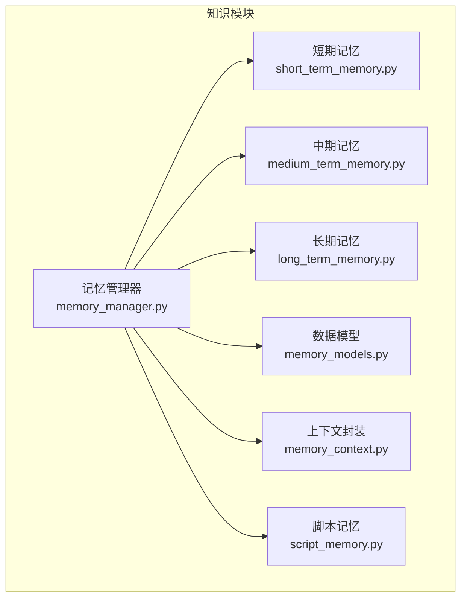
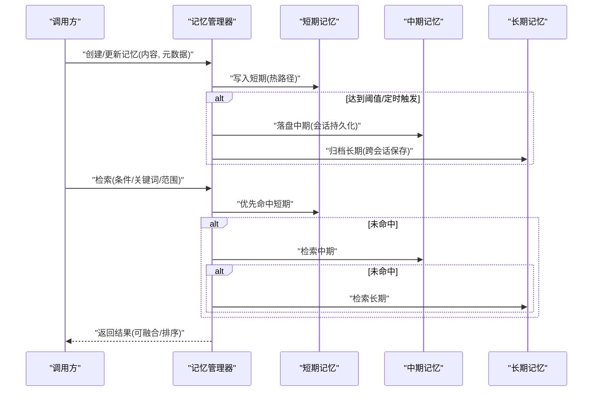
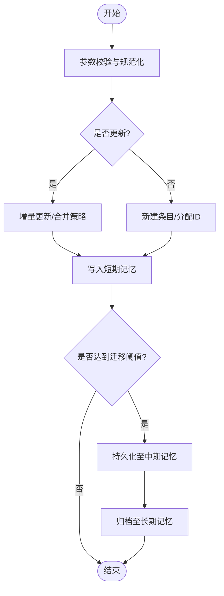
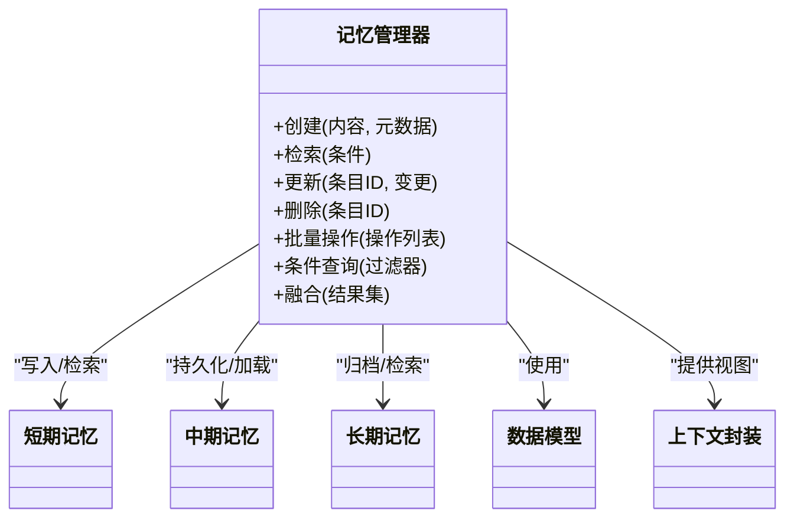

# 记忆系统

<cite>
**本文引用的文件**   
- [memory_manager.py](file://src/penshot/neopen/knowledge/memory/memory_manager.py)
- [short_term_memory.py](file://src/penshot/neopen/knowledge/memory/short_term_memory.py)
- [medium_term_memory.py](file://src/penshot/neopen/knowledge/memory/medium_term_memory.py)
- [long_term_memory.py](file://src/penshot/neopen/knowledge/memory/long_term_memory.py)
- [memory_models.py](file://src/penshot/neopen/knowledge/memory/memory_models.py)
- [memory_context.py](file://src/penshot/neopen/knowledge/memory/memory_context.py)
- [script_memory.py](file://src/penshot/neopen/knowledge/memory/script_memory.py)
- [test_memory.py](file://tests/task/test_memory.py)
</cite>

## 目录
1. [简介](#简介)
2. [项目结构](#项目结构)
3. [核心组件](#核心组件)
4. [架构总览](#架构总览)
5. [详细组件分析](#详细组件分析)
6. [依赖关系分析](#依赖关系分析)
7. [性能与容量管理](#性能与容量管理)
8. [故障恢复与一致性](#故障恢复与一致性)
9. [API 接口与使用示例](#api-接口与使用示例)
10. [结论](#结论)
11. [附录](#附录)

## 简介
本文件面向记忆系统的实现与使用，围绕三级记忆架构展开：短期记忆（实时存储）、中期记忆（会话持久化）、长期记忆（跨会话保存）。文档将阐述记忆管理器的工作机制（创建、检索、更新、清理），不同记忆类型的存储策略（数据结构、索引、查询优化），并提供 API 接口说明、批量操作、条件查询、记忆融合等使用示例。同时覆盖容量管理、性能优化与故障恢复机制，帮助读者快速理解并高效使用该记忆子系统。

## 项目结构
记忆系统位于 knowledge/memory 目录下，包含模型定义、上下文封装、三类记忆实现以及统一的记忆管理器。测试用例位于 tests/task/test_memory.py，用于验证关键流程与边界行为。

图表来源
- [memory_manager.py](file://src/penshot/neopen/knowledge/memory/memory_manager.py)
- [short_term_memory.py](file://src/penshot/neopen/knowledge/memory/short_term_memory.py)
- [medium_term_memory.py](file://src/penshot/neopen/knowledge/memory/medium_term_memory.py)
- [long_term_memory.py](file://src/penshot/neopen/knowledge/memory/long_term_memory.py)
- [memory_models.py](file://src/penshot/neopen/knowledge/memory/memory_models.py)
- [memory_context.py](file://src/penshot/neopen/knowledge/memory/memory_context.py)
- [script_memory.py](file://src/penshot/neopen/knowledge/memory/script_memory.py)

章节来源
- [memory_manager.py](file://src/penshot/neopen/knowledge/memory/memory_manager.py)
- [short_term_memory.py](file://src/penshot/neopen/knowledge/memory/short_term_memory.py)
- [medium_term_memory.py](file://src/penshot/neopen/knowledge/memory/medium_term_memory.py)
- [long_term_memory.py](file://src/penshot/neopen/knowledge/memory/long_term_memory.py)
- [memory_models.py](file://src/penshot/neopen/knowledge/memory/memory_models.py)
- [memory_context.py](file://src/penshot/neopen/knowledge/memory/memory_context.py)
- [script_memory.py](file://src/penshot/neopen/knowledge/memory/script_memory.py)

## 核心组件
- 记忆管理器：统一编排短期、中期、长期记忆的创建、检索、更新与清理；提供聚合查询与融合能力；负责容量控制与生命周期调度。
- 短期记忆：面向实时交互的高频读写，强调低延迟与高吞吐，通常采用内存结构或轻量级缓存。
- 中期记忆：面向会话维度的持久化，支持按会话加载/保存，便于任务中断恢复与回放。
- 长期记忆：面向跨会话的持久化，支持大规模数据的索引与检索，具备压缩、归档与冷热分层能力。
- 数据模型：定义记忆条目、元数据、版本与关联关系，确保多类型记忆的数据一致性。
- 上下文封装：为上层调用提供会话/任务级别的记忆视图与便捷方法。
- 脚本记忆：针对脚本类任务的专用记忆形态，提供结构化字段与批处理优化。

章节来源
- [memory_manager.py](file://src/penshot/neopen/knowledge/memory/memory_manager.py)
- [memory_models.py](file://src/penshot/neopen/knowledge/memory/memory_models.py)
- [memory_context.py](file://src/penshot/neopen/knowledge/memory/memory_context.py)
- [script_memory.py](file://src/penshot/neopen/knowledge/memory/script_memory.py)

## 架构总览
三级记忆通过记忆管理器进行统一治理，形成“热-温-冷”分层存储体系。短期记忆承担热点数据，中期记忆承载会话状态，长期记忆沉淀全局知识。管理器在写入时根据策略路由到合适层级，在读取时按需合并结果，并在后台执行清理与归档。

图表来源
- [memory_manager.py](file://src/penshot/neopen/knowledge/memory/memory_manager.py)
- [short_term_memory.py](file://src/penshot/neopen/knowledge/memory/short_term_memory.py)
- [medium_term_memory.py](file://src/penshot/neopen/knowledge/memory/medium_term_memory.py)
- [long_term_memory.py](file://src/penshot/neopen/knowledge/memory/long_term_memory.py)

## 详细组件分析

### 记忆管理器
职责
- 统一入口：对外暴露创建、检索、更新、删除、批量操作、条件查询、融合等接口。
- 路由策略：依据数据类型、访问频率、时间窗口与容量阈值决定写入短期/中期/长期。
- 生命周期：维护条目版本、过期策略、清理周期与回收策略。
- 一致性：保证跨层级的去重、冲突解决与幂等性。
- 可观测性：记录关键指标（命中率、延迟、容量水位）与审计日志。

关键流程
- 创建/更新：校验输入 -> 生成唯一标识 -> 写入短期 -> 触发迁移策略 -> 持久化中期/长期。
- 检索：短期优先 -> 中期回退 -> 长期兜底 -> 结果融合与排序。
- 清理：基于 TTL、容量上限与访问热度进行淘汰与归档。

图表来源
- [memory_manager.py](file://src/penshot/neopen/knowledge/memory/memory_manager.py)

章节来源
- [memory_manager.py](file://src/penshot/neopen/knowledge/memory/memory_manager.py)

### 短期记忆（实时存储）
设计要点
- 数据结构：内存字典/环形缓冲/队列，结合时间戳与访问计数。
- 索引机制：主键索引 + 时间倒序索引 + 可选标签索引。
- 查询优化：热点键直取、滑动窗口过滤、分页游标。
- 容量管理：最大条目数、TTL、LRU/LFU 淘汰。
- 并发安全：读写锁或无锁结构，避免阻塞主流程。

典型操作
- 写入：O(1) 插入，附带时间戳与权重。
- 检索：按 ID O(1)，按时间/标签 O(logN) 或 O(1) 哈希。
- 清理：后台线程周期性扫描 TTL 与容量上限。

章节来源
- [short_term_memory.py](file://src/penshot/neopen/knowledge/memory/short_term_memory.py)

### 中期记忆（会话持久化）
设计要点
- 数据结构：按会话分片存储，支持 JSON/二进制序列化。
- 索引机制：会话 ID 索引 + 时间线索引 + 业务标签索引。
- 查询优化：预读/懒加载、分页、投影裁剪。
- 持久化：本地文件或对象存储，支持事务性写入与校验和。
- 恢复：启动时重建会话快照，断点续写。

典型操作
- 保存：批量打包会话片段，原子写入。
- 加载：按会话 ID 拉取，增量合并。
- 清理：按会话生命周期与保留策略归档。

章节来源
- [medium_term_memory.py](file://src/penshot/neopen/knowledge/memory/medium_term_memory.py)

### 长期记忆（跨会话保存）
设计要点
- 数据结构：倒排索引 + 向量索引（可选）+ 元数据表。
- 索引机制：全文检索、语义检索、时间/标签/来源多维过滤。
- 查询优化：缓存热门查询、近似最近邻检索、结果重排。
- 存储分层：热段（SSD/内存映射）、温段（普通磁盘）、冷段（归档/压缩）。
- 一致性：幂等写入、冲突合并、版本回溯。

典型操作
- 写入：分片入库、异步构建索引。
- 检索：多路召回 + 精排 + 去重。
- 清理：冷热迁移、垃圾回收、索引重建。

章节来源
- [long_term_memory.py](file://src/penshot/neopen/knowledge/memory/long_term_memory.py)

### 数据模型与上下文
- 数据模型：定义记忆条目、元数据、版本、关联关系与扩展字段，支撑多类型记忆的统一表示。
- 上下文封装：提供会话/任务视角的便捷 API，屏蔽底层细节，简化调用。

章节来源
- [memory_models.py](file://src/penshot/neopen/knowledge/memory/memory_models.py)
- [memory_context.py](file://src/penshot/neopen/knowledge/memory/memory_context.py)

### 脚本记忆
- 用途：面向脚本类任务的专用记忆形态，提供结构化字段与批处理优化。
- 特点：强约束模式、批量写入、变更追踪、差异合并。

章节来源
- [script_memory.py](file://src/penshot/neopen/knowledge/memory/script_memory.py)

## 依赖关系分析
记忆管理器作为中枢，依赖三类记忆实现与数据模型/上下文。短期/中期/长期各自独立，降低耦合度，便于替换与扩展。

图表来源
- [memory_manager.py](file://src/penshot/neopen/knowledge/memory/memory_manager.py)
- [short_term_memory.py](file://src/penshot/neopen/knowledge/memory/short_term_memory.py)
- [medium_term_memory.py](file://src/penshot/neopen/knowledge/memory/medium_term_memory.py)
- [long_term_memory.py](file://src/penshot/neopen/knowledge/memory/long_term_memory.py)
- [memory_models.py](file://src/penshot/neopen/knowledge/memory/memory_models.py)
- [memory_context.py](file://src/penshot/neopen/knowledge/memory/memory_context.py)

章节来源
- [memory_manager.py](file://src/penshot/neopen/knowledge/memory/memory_manager.py)
- [memory_models.py](file://src/penshot/neopen/knowledge/memory/memory_models.py)
- [memory_context.py](file://src/penshot/neopen/knowledge/memory/memory_context.py)

## 性能与容量管理
- 容量管理
  - 短期：设置最大条目数与 TTL，启用 LRU/LFU 淘汰，避免内存膨胀。
  - 中期：按会话大小限制与保留天数，超阈自动归档。
  - 长期：冷热分层与压缩，定期重建索引以提升查询效率。
- 查询优化
  - 多级缓存：短期命中优先，中期次之，长期兜底。
  - 索引优化：主键直取、时间/标签索引、向量检索（可选）。
  - 结果裁剪：仅返回必要字段，减少网络与序列化开销。
- 并发与吞吐
  - 读写分离：短期采用无锁结构或细粒度锁。
  - 批量写入：合并小写为大写，降低 I/O 次数。
  - 异步持久化：非阻塞落盘，提升响应速度。
- 监控与调优
  - 指标：命中率、P95/P99 延迟、写入吞吐、容量水位。
  - 告警：容量接近上限、TTL 堆积、索引构建失败。

[本节为通用指导，不直接分析具体文件]

## 故障恢复与一致性
- 幂等写入：基于唯一标识与版本号，避免重复写入与乱序导致的不一致。
- 事务性持久化：中期/长期写入采用原子提交与校验和，失败回滚。
- 断点续写：会话中断后从最近检查点恢复，避免丢失。
- 一致性保障：跨层去重与冲突合并，保证最终一致。
- 可观测性：错误分类、重试策略与降级路径，确保服务可用。

章节来源
- [memory_manager.py](file://src/penshot/neopen/knowledge/memory/memory_manager.py)
- [medium_term_memory.py](file://src/penshot/neopen/knowledge/memory/medium_term_memory.py)
- [long_term_memory.py](file://src/penshot/neopen/knowledge/memory/long_term_memory.py)

## API 接口与使用示例
以下接口由记忆管理器统一暴露，供上层应用调用。为避免泄露实现细节，此处以概念形式描述，实际调用请参考对应源码路径。

- 创建/更新
  - 功能：新增或更新一条记忆，支持元数据与版本控制。
  - 用法：传入内容与元数据，返回条目 ID 与版本。
  - 参考路径：[memory_manager.py](file://src/penshot/neopen/knowledge/memory/memory_manager.py)

- 检索
  - 功能：按 ID、时间范围、标签、关键词等多条件检索。
  - 用法：构造查询条件，返回有序结果集。
  - 参考路径：[memory_manager.py](file://src/penshot/neopen/knowledge/memory/memory_manager.py)

- 删除
  - 功能：软删除或硬删除，支持级联清理。
  - 用法：传入条目 ID 与删除策略。
  - 参考路径：[memory_manager.py](file://src/penshot/neopen/knowledge/memory/memory_manager.py)

- 批量操作
  - 功能：批量创建/更新/删除，支持事务与回滚。
  - 用法：传入操作列表，返回成功/失败明细。
  - 参考路径：[memory_manager.py](file://src/penshot/neopen/knowledge/memory/memory_manager.py)

- 条件查询
  - 功能：复杂过滤（AND/OR/NOT）、分页与投影。
  - 用法：构造过滤器对象，指定页码与每页条数。
  - 参考路径：[memory_manager.py](file://src/penshot/neopen/knowledge/memory/memory_manager.py)

- 记忆融合
  - 功能：对多路检索结果进行去重、排序与摘要。
  - 用法：传入候选结果集与融合策略。
  - 参考路径：[memory_manager.py](file://src/penshot/neopen/knowledge/memory/memory_manager.py)

- 使用示例（概念）
  - 场景一：对话式问答
    - 步骤：用户提问 -> 短期检索 -> 若未命中则中期/长期检索 -> 融合结果 -> 返回答案。
    - 参考路径：[memory_manager.py](file://src/penshot/neopen/knowledge/memory/memory_manager.py)
  - 场景二：脚本任务批处理
    - 步骤：批量写入脚本片段 -> 中期持久化 -> 长期归档 -> 后续按脚本 ID 检索。
    - 参考路径：[script_memory.py](file://src/penshot/neopen/knowledge/memory/script_memory.py)

章节来源
- [memory_manager.py](file://src/penshot/neopen/knowledge/memory/memory_manager.py)
- [script_memory.py](file://src/penshot/neopen/knowledge/memory/script_memory.py)

## 结论
该记忆系统通过三级分层与统一管理器，实现了高性能、可扩展且可靠的记忆能力。短期记忆保障实时性，中期记忆支撑会话连续性，长期记忆沉淀跨会话知识。配合完善的容量管理、查询优化与故障恢复机制，能够满足复杂任务场景下的记忆需求。建议在生产环境开启监控与告警，并根据业务特征调整阈值与策略。

[本节为总结性内容，不直接分析具体文件]

## 附录
- 测试与验证
  - 单元测试覆盖关键流程与边界条件，建议在新增特性时补充相应用例。
  - 参考路径：[test_memory.py](file://tests/task/test_memory.py)

章节来源
- [test_memory.py](file://tests/task/test_memory.py)