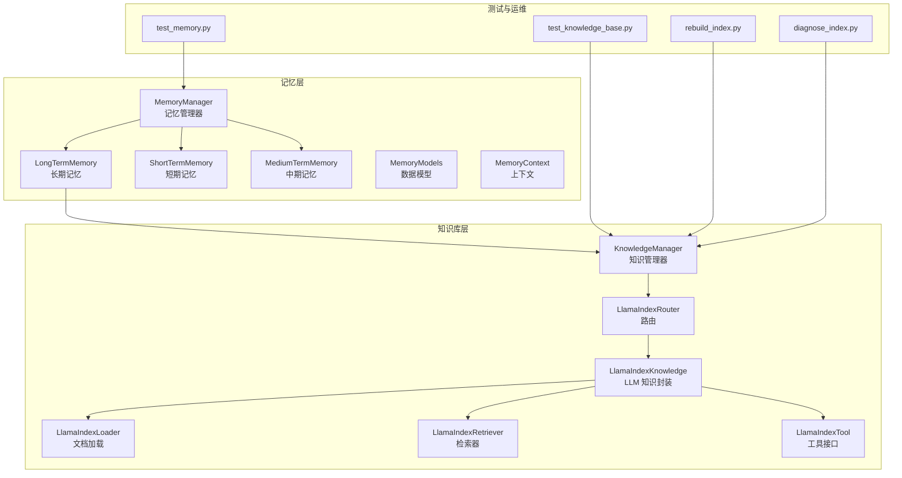
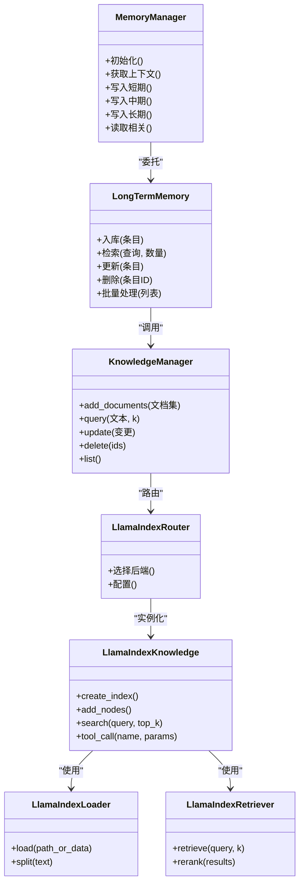
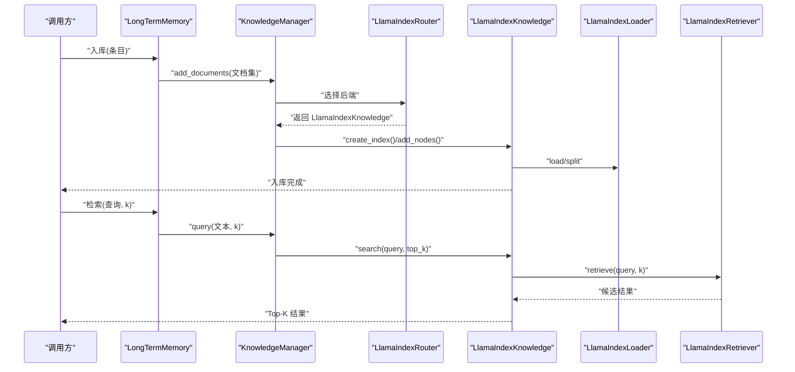
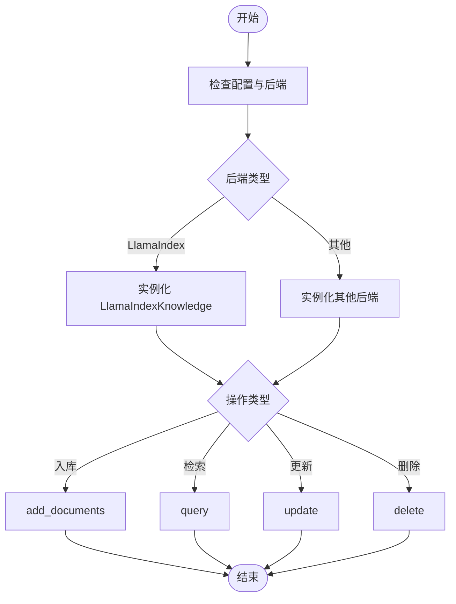
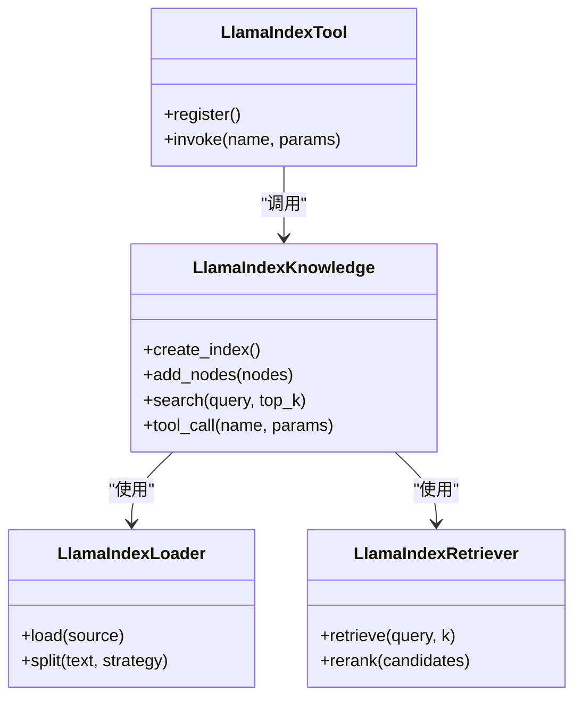
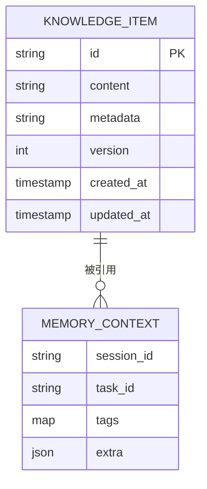
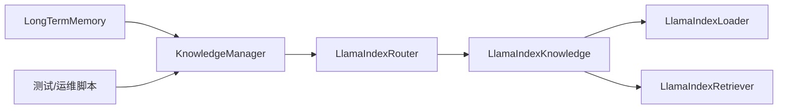

# 长期记忆

<cite>
**本文引用的文件**   
- [long_term_memory.py](file://src/penshot/knowledge/memory/long_term_memory.py)
- [memory_manager.py](file://src/penshot/knowledge/memory/memory_manager.py)
- [memory_models.py](file://src/penshot/knowledge/memory/memory_models.py)
- [memory_context.py](file://src/penshot/knowledge/memory/memory_context.py)
- [llama_index_knowledge.py](file://src/penshot/knowledge/llamaIndex/llama_index_knowledge.py)
- [llama_index_loader.py](file://src/penshot/knowledge/llamaIndex/llama_index_loader.py)
- [llama_index_retriever.py](file://src/penshot/knowledge/llamaIndex/llama_index_retriever.py)
- [llama_index_tool.py](file://src/penshot/knowledge/llamaIndex/llama_index_tool.py)
- [knowledge_manager.py](file://src/penshot/knowledge/knowledge_manager.py)
- [llama_index_router.py](file://src/penshot/knowledge/llama_index_router.py)
- [test_memory.py](file://tests/task/test_memory.py)
- [test_knowledge_base.py](file://tests/knowledge/test_knowledge_base.py)
- [rebuild_index.py](file://tests/knowledge/rebuild_index.py)
- [diagnose_index.py](file://tests/knowledge/diagnose_index.py)
</cite>

## 目录
1. [简介](#简介)
2. [项目结构](#项目结构)
3. [核心组件](#核心组件)
4. [架构总览](#架构总览)
5. [详细组件分析](#详细组件分析)
6. [依赖关系分析](#依赖关系分析)
7. [性能与可扩展性](#性能与可扩展性)
8. [故障排查指南](#故障排查指南)
9. [结论](#结论)
10. [附录：API 与使用示例](#附录api-与使用示例)

## 简介
本章节概述“长期记忆”的设计目标、适用范围与整体思路。长期记忆用于跨会话保存和检索知识，支持语义搜索与增量更新，并通过向量数据库实现高效检索。其目标是：
- 跨会话持久化：将关键上下文、脚本片段、规则与经验沉淀为可复用的知识单元。
- 语义检索：基于嵌入向量的相似度匹配，提供自然语言查询的召回能力。
- 可维护的知识管理：支持抽取、去重合并、版本管理与重建索引等生命周期操作。
- 可扩展的存储后端：通过抽象层对接不同向量库（如本地或远程），便于替换与扩展。

[本节不直接分析具体文件，故无“章节来源”]

## 项目结构
围绕长期记忆的相关代码主要分布在 knowledge 与 tests 两个区域：
- src/penshot/knowledge/memory：短期/中期/长期记忆模型与管理器
- src/penshot/knowledge/llamaIndex：基于 LlamaIndex 的文档加载、索引构建与检索工具
- src/penshot/knowledge：知识管理器与路由
- tests/knowledge：索引诊断、重建与测试用例
- tests/task：任务级内存集成测试

**图表来源**
- [memory_manager.py](file://src/penshot/knowledge/memory/memory_manager.py)
- [long_term_memory.py](file://src/penshot/knowledge/memory/long_term_memory.py)
- [memory_models.py](file://src/penshot/knowledge/memory/memory_models.py)
- [memory_context.py](file://src/penshot/knowledge/memory/memory_context.py)
- [knowledge_manager.py](file://src/penshot/knowledge/knowledge_manager.py)
- [llama_index_router.py](file://src/penshot/knowledge/llama_index_router.py)
- [llama_index_knowledge.py](file://src/penshot/knowledge/llamaIndex/llama_index_knowledge.py)
- [llama_index_loader.py](file://src/penshot/knowledge/llamaIndex/llama_index_loader.py)
- [llama_index_retriever.py](file://src/penshot/knowledge/llamaIndex/llama_index_retriever.py)
- [llama_index_tool.py](file://src/penshot/knowledge/llamaIndex/llama_index_tool.py)
- [test_memory.py](file://tests/task/test_memory.py)
- [test_knowledge_base.py](file://tests/knowledge/test_knowledge_base.py)
- [rebuild_index.py](file://tests/knowledge/rebuild_index.py)
- [diagnose_index.py](file://tests/knowledge/diagnose_index.py)

**章节来源**
- [memory_manager.py](file://src/penshot/knowledge/memory/memory_manager.py)
- [long_term_memory.py](file://src/penshot/knowledge/memory/long_term_memory.py)
- [knowledge_manager.py](file://src/penshot/knowledge/knowledge_manager.py)
- [llama_index_router.py](file://src/penshot/knowledge/llama_index_router.py)
- [llama_index_knowledge.py](file://src/penshot/knowledge/llamaIndex/llama_index_knowledge.py)
- [llama_index_loader.py](file://src/penshot/knowledge/llamaIndex/llama_index_loader.py)
- [llama_index_retriever.py](file://src/penshot/knowledge/llamaIndex/llama_index_retriever.py)
- [llama_index_tool.py](file://src/penshot/knowledge/llamaIndex/llama_index_tool.py)
- [test_memory.py](file://tests/task/test_memory.py)
- [test_knowledge_base.py](file://tests/knowledge/test_knowledge_base.py)
- [rebuild_index.py](file://tests/knowledge/rebuild_index.py)
- [diagnose_index.py](file://tests/knowledge/diagnose_index.py)

## 核心组件
- 长期记忆 LongTermMemory：面向跨会话的知识持久化与检索，负责将结构化/非结构化内容转化为可检索的知识条目，并调用底层知识库进行写入与查询。
- 记忆管理器 MemoryManager：统一编排短/中/长期记忆，提供生命周期管理与上下文注入。
- 知识管理器 KnowledgeManager：对上层暴露统一的入库、检索、更新、删除等操作，屏蔽底层向量库差异。
- LlamaIndex 集成：
  - LlamaIndexKnowledge：封装索引创建、文档添加、查询与工具方法。
  - LlamaIndexLoader：负责从多种来源加载文档并切分。
  - LlamaIndexRetriever：执行语义检索与可选的重排序。
  - LlamaIndexTool：对外暴露工具接口供工作流调用。
- 路由 LlamaIndexRouter：根据配置选择具体的知识库实现与参数。

**章节来源**
- [long_term_memory.py](file://src/penshot/knowledge/memory/long_term_memory.py)
- [memory_manager.py](file://src/penshot/knowledge/memory/memory_manager.py)
- [knowledge_manager.py](file://src/penshot/knowledge/knowledge_manager.py)
- [llama_index_knowledge.py](file://src/penshot/knowledge/llamaIndex/llama_index_knowledge.py)
- [llama_index_loader.py](file://src/penshot/knowledge/llamaIndex/llama_index_loader.py)
- [llama_index_retriever.py](file://src/penshot/knowledge/llamaIndex/llama_index_retriever.py)
- [llama_index_tool.py](file://src/penshot/knowledge/llamaIndex/llama_index_tool.py)
- [llama_index_router.py](file://src/penshot/knowledge/llama_index_router.py)

## 架构总览
长期记忆采用“记忆层 + 知识库层”的分层设计。记忆层关注状态与生命周期；知识库层关注向量化、索引与检索。两者通过路由器与工具接口解耦，便于替换不同的向量库与检索策略。

**图表来源**
- [memory_manager.py](file://src/penshot/knowledge/memory/memory_manager.py)
- [long_term_memory.py](file://src/penshot/knowledge/memory/long_term_memory.py)
- [knowledge_manager.py](file://src/penshot/knowledge/knowledge_manager.py)
- [llama_index_router.py](file://src/penshot/knowledge/llama_index_router.py)
- [llama_index_knowledge.py](file://src/penshot/knowledge/llamaIndex/llama_index_knowledge.py)
- [llama_index_loader.py](file://src/penshot/knowledge/llamaIndex/llama_index_loader.py)
- [llama_index_retriever.py](file://src/penshot/knowledge/llamaIndex/llama_index_retriever.py)

## 详细组件分析

### 长期记忆 LongTermMemory
职责与流程：
- 入库：将输入内容标准化为知识条目，必要时进行摘要/清洗，然后交由知识管理器持久化。
- 检索：将自然语言查询转换为向量表示，在索引中检索 Top-K 结果，并可结合重排序提升相关性。
- 更新与删除：按 ID 或元数据进行精准更新与删除，保证一致性。
- 批量处理：支持批入库与批检索，减少往返开销。

**图表来源**
- [long_term_memory.py](file://src/penshot/knowledge/memory/long_term_memory.py)
- [knowledge_manager.py](file://src/penshot/knowledge/knowledge_manager.py)
- [llama_index_router.py](file://src/penshot/knowledge/llama_index_router.py)
- [llama_index_knowledge.py](file://src/penshot/knowledge/llamaIndex/llama_index_knowledge.py)
- [llama_index_loader.py](file://src/penshot/knowledge/llamaIndex/llama_index_loader.py)
- [llama_index_retriever.py](file://src/penshot/knowledge/llamaIndex/llama_index_retriever.py)

**章节来源**
- [long_term_memory.py](file://src/penshot/knowledge/memory/long_term_memory.py)
- [memory_manager.py](file://src/penshot/knowledge/memory/memory_manager.py)

### 知识管理器 KnowledgeManager
职责与流程：
- 统一入口：屏蔽不同知识库实现的差异，提供 add/query/update/delete/list 等标准接口。
- 路由与配置：根据环境或运行时配置选择 LlamaIndex 或其他后端。
- 事务与幂等：确保批量操作的原子性与幂等性，避免重复入库。

**图表来源**
- [knowledge_manager.py](file://src/penshot/knowledge/knowledge_manager.py)
- [llama_index_router.py](file://src/penshot/knowledge/llama_index_router.py)
- [llama_index_knowledge.py](file://src/penshot/knowledge/llamaIndex/llama_index_knowledge.py)

**章节来源**
- [knowledge_manager.py](file://src/penshot/knowledge/knowledge_manager.py)
- [llama_index_router.py](file://src/penshot/knowledge/llama_index_router.py)

### LlamaIndex 集成层
- LlamaIndexKnowledge：封装索引创建、节点添加、查询与工具调用。
- LlamaIndexLoader：多格式文档加载与切分，支持自定义策略。
- LlamaIndexRetriever：向量检索与可选重排序，提高 Top-K 质量。
- LlamaIndexTool：以工具形式暴露检索能力，供工作流或 Agent 调用。

**图表来源**
- [llama_index_knowledge.py](file://src/penshot/knowledge/llamaIndex/llama_index_knowledge.py)
- [llama_index_loader.py](file://src/penshot/knowledge/llamaIndex/llama_index_loader.py)
- [llama_index_retriever.py](file://src/penshot/knowledge/llamaIndex/llama_index_retriever.py)
- [llama_index_tool.py](file://src/penshot/knowledge/llamaIndex/llama_index_tool.py)

**章节来源**
- [llama_index_knowledge.py](file://src/penshot/knowledge/llamaIndex/llama_index_knowledge.py)
- [llama_index_loader.py](file://src/penshot/knowledge/llamaIndex/llama_index_loader.py)
- [llama_index_retriever.py](file://src/penshot/knowledge/llamaIndex/llama_index_retriever.py)
- [llama_index_tool.py](file://src/penshot/knowledge/llamaIndex/llama_index_tool.py)

### 数据模型与上下文
- MemoryModels：定义知识条目、元数据、版本等数据结构，支撑去重与合并。
- MemoryContext：承载当前会话/任务的上下文信息，辅助记忆管理器进行关联检索。

**图表来源**
- [memory_models.py](file://src/penshot/knowledge/memory/memory_models.py)
- [memory_context.py](file://src/penshot/knowledge/memory/memory_context.py)

**章节来源**
- [memory_models.py](file://src/penshot/knowledge/memory/memory_models.py)
- [memory_context.py](file://src/penshot/knowledge/memory/memory_context.py)

## 依赖关系分析
- 记忆层依赖知识库层，但通过路由器与工具接口保持松耦合。
- 知识库层内部，Loader/Retriever 作为 LlamaIndexKnowledge 的协作对象，职责清晰。
- 测试与运维脚本直接依赖 KnowledgeManager，便于独立验证索引健康度与重建流程。

**图表来源**
- [long_term_memory.py](file://src/penshot/knowledge/memory/long_term_memory.py)
- [knowledge_manager.py](file://src/penshot/knowledge/knowledge_manager.py)
- [llama_index_router.py](file://src/penshot/knowledge/llama_index_router.py)
- [llama_index_knowledge.py](file://src/penshot/knowledge/llamaIndex/llama_index_knowledge.py)
- [llama_index_loader.py](file://src/penshot/knowledge/llamaIndex/llama_index_loader.py)
- [llama_index_retriever.py](file://src/penshot/knowledge/llamaIndex/llama_index_retriever.py)
- [test_memory.py](file://tests/task/test_memory.py)
- [test_knowledge_base.py](file://tests/knowledge/test_knowledge_base.py)
- [rebuild_index.py](file://tests/knowledge/rebuild_index.py)
- [diagnose_index.py](file://tests/knowledge/diagnose_index.py)

**章节来源**
- [long_term_memory.py](file://src/penshot/knowledge/memory/long_term_memory.py)
- [knowledge_manager.py](file://src/penshot/knowledge/knowledge_manager.py)
- [llama_index_router.py](file://src/penshot/knowledge/llama_index_router.py)
- [llama_index_knowledge.py](file://src/penshot/knowledge/llamaIndex/llama_index_knowledge.py)
- [llama_index_loader.py](file://src/penshot/knowledge/llamaIndex/llama_index_loader.py)
- [llama_index_retriever.py](file://src/penshot/knowledge/llamaIndex/llama_index_retriever.py)
- [test_memory.py](file://tests/task/test_memory.py)
- [test_knowledge_base.py](file://tests/knowledge/test_knowledge_base.py)
- [rebuild_index.py](file://tests/knowledge/rebuild_index.py)
- [diagnose_index.py](file://tests/knowledge/diagnose_index.py)

## 性能与可扩展性
- 大规模数据处理
  - 批量入库：优先使用批量接口以减少网络与序列化开销。
  - 分块策略：合理设置文档切分大小，平衡检索精度与索引体积。
  - 异步与并发：在高吞吐场景下，考虑异步 I/O 与连接池。
- 增量更新
  - 幂等写入：基于唯一键或内容指纹避免重复。
  - 局部重建：仅对变更文档进行增量索引更新。
- 检索优化
  - Top-K 调优：根据业务调整 k 值与阈值。
  - 重排序：在召回后引入轻量重排序提升相关性。
  - 缓存：对热点查询做短期缓存，降低延迟。
- 存储与索引
  - 选择合适的向量维度与度量方式。
  - 定期重建索引以清理碎片与提升查询性能。

[本节为通用指导，未直接分析具体文件，故无“章节来源”]

## 故障排查指南
- 索引不可用或查询失败
  - 使用诊断脚本检查索引健康度与元数据完整性。
  - 若发现损坏或不一致，使用重建脚本重新构建索引。
- 入库失败或重复
  - 检查入库前是否已存在相同条目（基于 ID 或指纹）。
  - 确认文档加载与切分逻辑是否正确。
- 检索结果质量不佳
  - 调整检索 k 值与重排序开关。
  - 检查嵌入模型与索引配置是否与查询域匹配。

**章节来源**
- [diagnose_index.py](file://tests/knowledge/diagnose_index.py)
- [rebuild_index.py](file://tests/knowledge/rebuild_index.py)
- [test_knowledge_base.py](file://tests/knowledge/test_knowledge_base.py)
- [test_memory.py](file://tests/task/test_memory.py)

## 结论
长期记忆通过分层设计与 LlamaIndex 集成，实现了跨会话的知识持久化与语义检索。借助知识管理器与路由器，系统具备良好的可扩展性与可维护性。配合批量入库、增量更新与索引重建等机制，可在大规模数据场景下保持稳定与高性能。

[本节为总结性内容，未直接分析具体文件，故无“章节来源”]

## 附录：API 与使用示例
以下列出常用 API 与典型用法路径，便于快速上手与集成。

- 入库
  - 接口：KnowledgeManager.add_documents
  - 说明：将一组文档加入索引，支持批量与幂等写入。
  - 参考路径：[knowledge_manager.py](file://src/penshot/knowledge/knowledge_manager.py)
- 检索
  - 接口：KnowledgeManager.query
  - 说明：基于自然语言查询返回 Top-K 结果，可结合重排序。
  - 参考路径：[knowledge_manager.py](file://src/penshot/knowledge/knowledge_manager.py)
- 更新与删除
  - 接口：KnowledgeManager.update / delete
  - 说明：按 ID 或元数据进行精确更新与删除。
  - 参考路径：[knowledge_manager.py](file://src/penshot/knowledge/knowledge_manager.py)
- 工具调用
  - 接口：LlamaIndexTool.invoke
  - 说明：在工作流中以工具形式调用检索能力。
  - 参考路径：[llama_index_tool.py](file://src/penshot/knowledge/llamaIndex/llama_index_tool.py)
- 单元测试与集成测试
  - 任务级测试：[test_memory.py](file://tests/task/test_memory.py)
  - 知识库测试：[test_knowledge_base.py](file://tests/knowledge/test_knowledge_base.py)
- 运维脚本
  - 重建索引：[rebuild_index.py](file://tests/knowledge/rebuild_index.py)
  - 诊断索引：[diagnose_index.py](file://tests/knowledge/diagnose_index.py)

**章节来源**
- [knowledge_manager.py](file://src/penshot/knowledge/knowledge_manager.py)
- [llama_index_tool.py](file://src/penshot/knowledge/llamaIndex/llama_index_tool.py)
- [test_memory.py](file://tests/task/test_memory.py)
- [test_knowledge_base.py](file://tests/knowledge/test_knowledge_base.py)
- [rebuild_index.py](file://tests/knowledge/rebuild_index.py)
- [diagnose_index.py](file://tests/knowledge/diagnose_index.py)