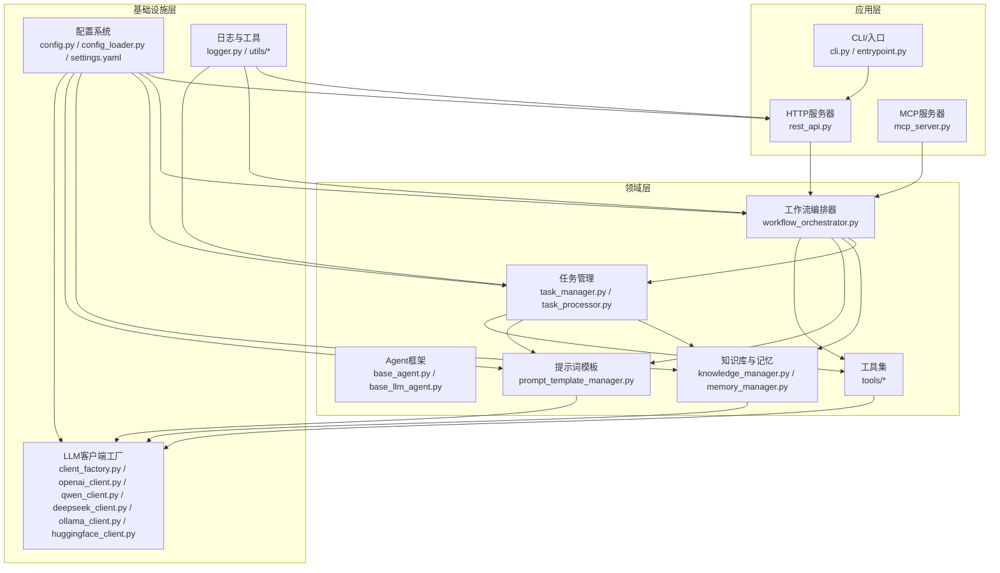
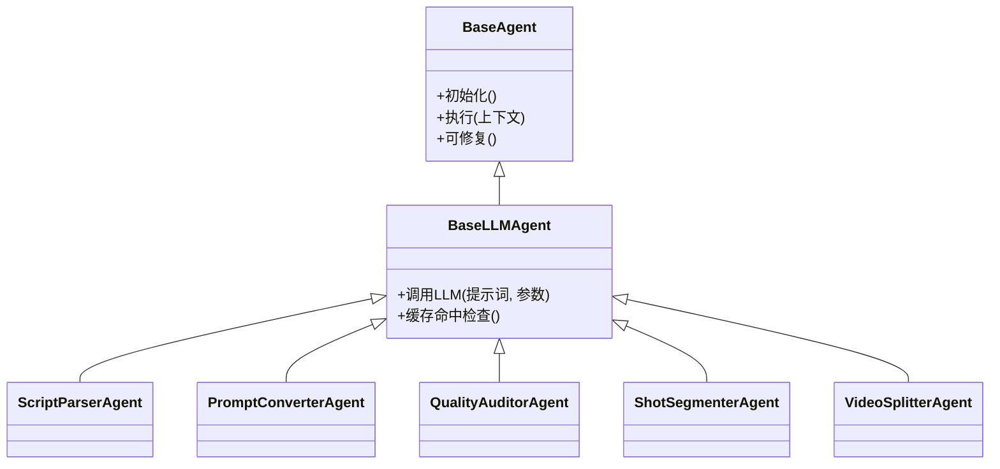
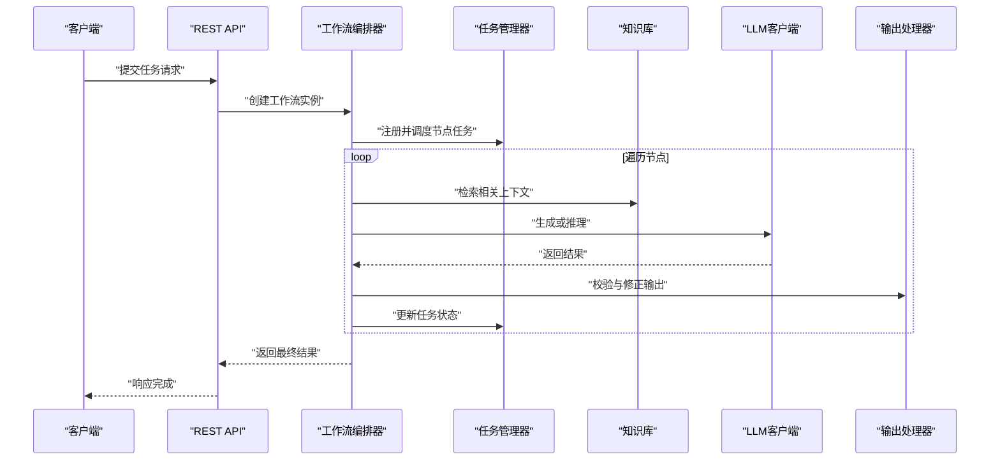
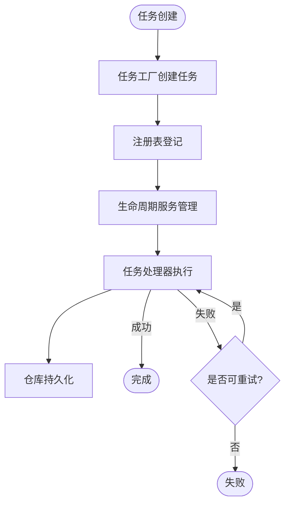
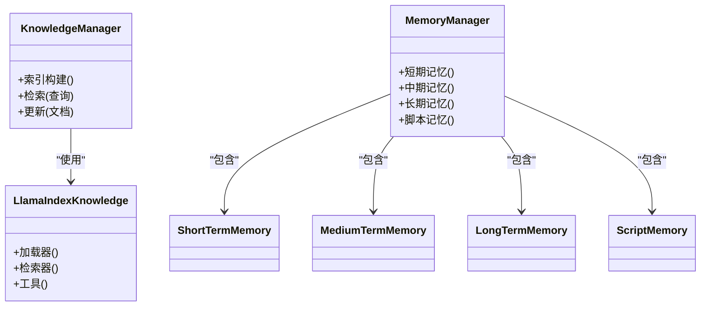
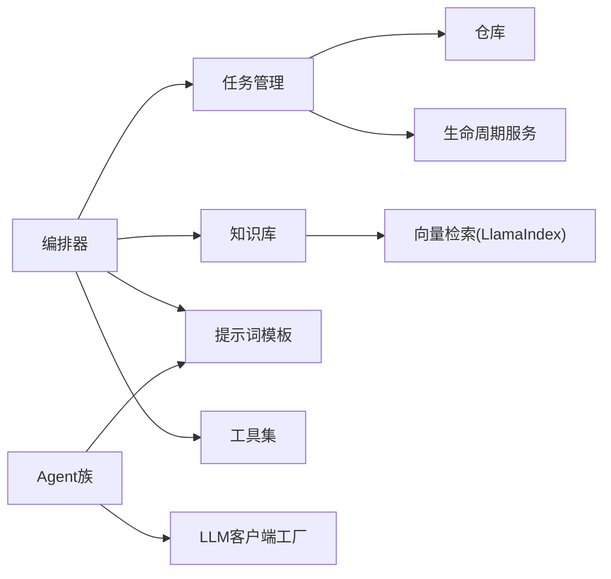

# 架构设计

<cite>
**本文引用的文件**   
- [main.py](file://main.py)
- [http_server.py](file://src/penshot/http_server.py)
- [application.py](file://src/penshot/app/application.py)
- [setup_env.py](file://src/penshot/app/setup_env.py)
- [config.py](file://src/penshot/config/config.py)
- [config_loader.py](file://src/penshot/config/config_loader.py)
- [settings.yaml](file://src/penshot/config/settings.yaml)
- [development.yaml](file://src/penshot/config/env/development.yaml)
- [production.yaml](file://src/penshot/config/env/production.yaml)
- [base_agent.py](file://src/penshot/neopen/agent/base_agent.py)
- [base_llm_agent.py](file://src/penshot/neopen/agent/base_llm_agent.py)
- [base_repairable_agent.py](file://src/penshot/neopen/agent/base_repairable_agent.py)
- [script_parser_agent.py](file://src/penshot/neopen/agent/script_parser_agent.py)
- [prompt_converter_agent.py](file://src/penshot/neopen/agent/prompt_converter_agent.py)
- [quality_auditor_agent.py](file://src/penshot/neopen/agent/quality_auditor_agent.py)
- [shot_segmenter_agent.py](file://src/penshot/neopen/agent/shot_segmenter_agent.py)
- [video_splitter_agent.py](file://src/penshot/neopen/agent/video_splitter_agent.py)
- [workflow_orchestrator.py](file://src/penshot/neopen/agent/workflow/workflow_orchestrator.py)
- [workflow_pipeline.py](file://src/penshot/neopen/agent/workflow/workflow_pipeline.py)
- [workflow_nodes.py](file://src/penshot/neopen/agent/workflow/workflow_nodes.py)
- [workflow_state_types.py](file://src/penshot/neopen/agent/workflow/workflow_state_types.py)
- [workflow_checkpointer.py](file://src/penshot/neopen/agent/workflow/workflow_checkpointer.py)
- [workflow_error_handler.py](file://src/penshot/neopen/agent/workflow/workflow_error_handler.py)
- [workflow_logger.py](file://src/penshot/neopen/agent/workflow/workflow_logger.py)
- [workflow_memory.py](file://src/penshot/neopen/agent/workflow/workflow_memory.py)
- [workflow_output.py](file://src/penshot/neopen/agent/workflow/workflow_output.py)
- [workflow_output_fixer.py](file://src/penshot/neopen/agent/workflow/workflow_output_fixer.py)
- [task_manager.py](file://src/penshot/neopen/task/task_manager.py)
- [task_processor.py](file://src/penshot/neopen/task/task_processor.py)
- [task_lifecycle_service.py](file://src/penshot/neopen/task/task_lifecycle_service.py)
- [task_repository.py](file://src/penshot/neopen/task/task_repository.py)
- [task_factory.py](file://src/penshot/neopen/task/task_factory.py)
- [task_models.py](file://src/penshot/neopen/task/task_models.py)
- [workflow_registry.py](file://src/penshot/neopen/task/workflow_registry.py)
- [knowledge_manager.py](file://src/penshot/neopen/knowledge/knowledge_manager.py)
- [llama_index_knowledge.py](file://src/penshot/neopen/knowledge/llamaIndex/llama_index_knowledge.py)
- [llama_index_loader.py](file://src/penshot/neopen/knowledge/llamaIndex/llama_index_loader.py)
- [llama_index_retriever.py](file://src/penshot/neopen/knowledge/llamaIndex/llama_index_retriever.py)
- [llama_index_tool.py](file://src/penshot/neopen/knowledge/llamaIndex/llama_index_tool.py)
- [memory_manager.py](file://src/penshot/neopen/knowledge/memory/memory_manager.py)
- [long_term_memory.py](file://src/penshot/neopen/knowledge/memory/long_term_memory.py)
- [medium_term_memory.py](file://src/penshot/neopen/knowledge/memory/medium_term_memory.py)
- [short_term_memory.py](file://src/penshot/neopen/knowledge/memory/short_term_memory.py)
- [script_memory.py](file://src/penshot/neopen/knowledge/memory/script_memory.py)
- [memory_context.py](file://src/penshot/neopen/knowledge/memory/memory_context.py)
- [memory_models.py](file://src/penshot/neopen/knowledge/memory/memory_models.py)
- [prompt_template_manager.py](file://src/penshot/neopen/prompts/prompt_template_manager.py)
- [prompt_load_manager.py](file://src/penshot/neopen/prompts/prompt_load_manager.py)
- [client_factory.py](file://src/penshot/neopen/client/client_factory.py)
- [base_client.py](file://src/penshot/neopen/client/base_client.py)
- [deepseek_client.py](file://src/penshot/neopen/client/deepseek_client.py)
- [huggingface_client.py](file://src/penshot/neopen/client/huggingface_client.py)
- [ollama_client.py](file://src/penshot/neopen/client/ollama_client.py)
- [openai_client.py](file://src/penshot/neopen/client/openai_client.py)
- [qwen_client.py](file://src/penshot/neopen/client/qwen_client.py)
- [rest_api.py](file://src/penshot/api/rest_api.py)
- [function_calls.py](file://src/penshot/api/function_calls.py)
- [index_api.py](file://src/penshot/api/index_api.py)
- [continuity_guardian_checker.py](file://src/penshot/neopen/agent/continuity_guardian/continuity_guardian_checker.py)
- [continuity_repair_generator.py](file://src/penshot/neopen/agent/continuity_guardian/continuity_repair_generator.py)
- [cross_chunk_validator.py](file://src/penshot/neopen/agent/continuity_guardian/cross_chunk_validator.py)
- [long_script_chunker.py](file://src/penshot/neopen/agent/continuity_guardian/long_script_chunker.py)
- [prompt_style_guardian.py](file://src/penshot/neopen/agent/continuity_guardian/prompt_style_guardian.py)
- [human_decision_intervention.py](file://src/penshot/neopen/agent/human_decision/human_decision_intervention.py)
- [human_enhanced_converter.py](file://src/penshot/neopen/agent/human_decision/human_enhanced_converter.py)
- [action_duration_tool.py](file://src/penshot/neopen/tools/action_duration_tool.py)
- [json_parser_tool.py](file://src/penshot/neopen/tools/json_parser_tool.py)
- [langchain_memory_tool.py](file://src/penshot/neopen/tools/langchain_memory_tool.py)
- [result_storage_tool.py](file://src/penshot/neopen/tools/result_storage_tool.py)
- [script_assessor_tool.py](file://src/penshot/neopen/tools/script_assessor_tool.py)
- [script_parser_tool.py](file://src/penshot/neopen/tools/script_parser_tool.py)
- [entrypoint.py](file://scripts/entrypoint.py)
- [cli.py](file://scripts/cli.py)
</cite>

## 目录
1. [引言](#引言)
2. [项目结构](#项目结构)
3. [核心组件](#核心组件)
4. [架构总览](#架构总览)
5. [详细组件分析](#详细组件分析)
6. [依赖关系分析](#依赖关系分析)
7. [性能考量](#性能考量)
8. [故障排查指南](#故障排查指南)
9. [结论](#结论)
10. [附录](#附录)

## 引言
本文件面向Video Shot Agent的架构设计与实现，聚焦分层架构与微服务设计理念，系统阐述Agent框架、工作流编排器、任务管理系统、知识库系统等核心组件的职责与交互。文档同时给出数据流从输入到输出的完整路径，解释关键的技术决策与权衡，并提供架构图与组件关系图，帮助读者快速理解整体结构与演进方向。

## 项目结构
仓库采用“应用层 + 领域能力 + 基础设施”的分层组织方式：
- 应用层：HTTP/MCP入口、API路由、示例与脚本
- 领域层：Agent族（解析、转换、质检、分镜、拆分）、工作流编排、任务管理、知识管理与记忆、提示词模板
- 基础设施层：LLM客户端工厂与多厂商适配、配置加载与环境、日志与工具集

图示来源
- [http_server.py:1-200](file://src/penshot/http_server.py#L1-L200)
- [rest_api.py:1-200](file://src/penshot/api/rest_api.py#L1-L200)
- [application.py:1-200](file://src/penshot/app/application.py#L1-L200)
- [config.py:1-200](file://src/penshot/config/config.py#L1-L200)
- [client_factory.py:1-200](file://src/penshot/neopen/client/client_factory.py#L1-L200)

章节来源
- [main.py:1-200](file://main.py#L1-L200)
- [http_server.py:1-200](file://src/penshot/http_server.py#L1-L200)
- [application.py:1-200](file://src/penshot/app/application.py#L1-L200)
- [config.py:1-200](file://src/penshot/config/config.py#L1-L200)
- [client_factory.py:1-200](file://src/penshot/neopen/client/client_factory.py#L1-L200)

## 核心组件
- Agent框架：定义通用Agent生命周期、上下文、可修复性与LLM增强能力，为具体Agent提供统一基类与扩展点。
- 工作流编排器：负责节点调度、状态持久化、错误恢复、输出修正与结果聚合，串联各Agent形成端到端流水线。
- 任务管理系统：抽象任务的创建、调度、生命周期与存储，解耦业务执行与资源管理。
- 知识库系统：整合向量检索与长期/中期/短期记忆，支撑提示词构建与上下文注入。
- 提示词模板管理：集中管理多版本提示词与语言包，支持动态加载与替换。
- LLM客户端工厂：统一封装多厂商模型调用，屏蔽差异，提供缓存与重试策略。
- API与集成：REST接口、函数调用、索引管理、MCP协议接入，对外暴露能力。

章节来源
- [base_agent.py:1-200](file://src/penshot/neopen/agent/base_agent.py#L1-L200)
- [base_llm_agent.py:1-200](file://src/penshot/neopen/agent/base_llm_agent.py#L1-L200)
- [workflow_orchestrator.py:1-200](file://src/penshot/neopen/agent/workflow/workflow_orchestrator.py#L1-L200)
- [task_manager.py:1-200](file://src/penshot/neopen/task/task_manager.py#L1-L200)
- [knowledge_manager.py:1-200](file://src/penshot/neopen/knowledge/knowledge_manager.py#L1-L200)
- [prompt_template_manager.py:1-200](file://src/penshot/neopen/prompts/prompt_template_manager.py#L1-L200)
- [client_factory.py:1-200](file://src/penshot/neopen/client/client_factory.py#L1-L200)

## 架构总览
系统采用分层架构与微服务设计理念：
- 分层架构：应用层（HTTP/MCP/CLI）→ 领域层（Agent/工作流/任务/知识/提示词/工具）→ 基础设施层（配置/LLM客户端/日志）
- 微服务理念：通过清晰的模块边界与接口契约，将不同职责拆分为独立可替换的组件；以工厂模式与注册表机制实现运行时装配与热插拔。

图示来源
- [base_agent.py:1-200](file://src/penshot/neopen/agent/base_agent.py#L1-L200)
- [base_llm_agent.py:1-200](file://src/penshot/neopen/agent/base_llm_agent.py#L1-L200)
- [script_parser_agent.py:1-200](file://src/penshot/neopen/agent/script_parser_agent.py#L1-L200)
- [prompt_converter_agent.py:1-200](file://src/penshot/neopen/agent/prompt_converter_agent.py#L1-L200)
- [quality_auditor_agent.py:1-200](file://src/penshot/neopen/agent/quality_auditor_agent.py#L1-L200)
- [shot_segmenter_agent.py:1-200](file://src/penshot/neopen/agent/shot_segmenter_agent.py#L1-L200)
- [video_splitter_agent.py:1-200](file://src/penshot/neopen/agent/video_splitter_agent.py#L1-L200)

## 详细组件分析

### 工作流编排器
- 职责：定义节点类型、编排顺序、状态机流转、断点续跑、错误处理与输出修复。
- 关键能力：
  - 节点注册与发现：通过注册表维护节点清单与入出参契约。
  - 状态持久化：检查点保存中间状态，支持中断恢复。
  - 错误处理：异常捕获、降级策略、重试与告警。
  - 输出修正：对结构化输出进行校验与自动修复。
  - 内存与日志：工作流级内存与结构化日志记录。

图示来源
- [workflow_orchestrator.py:1-200](file://src/penshot/neopen/agent/workflow/workflow_orchestrator.py#L1-L200)
- [workflow_pipeline.py:1-200](file://src/penshot/neopen/agent/workflow/workflow_pipeline.py#L1-L200)
- [workflow_nodes.py:1-200](file://src/penshot/neopen/agent/workflow/workflow_nodes.py#L1-L200)
- [workflow_state_types.py:1-200](file://src/penshot/neopen/agent/workflow/workflow_state_types.py#L1-L200)
- [workflow_checkpointer.py:1-200](file://src/penshot/neopen/agent/workflow/workflow_checkpointer.py#L1-L200)
- [workflow_error_handler.py:1-200](file://src/penshot/neopen/agent/workflow/workflow_error_handler.py#L1-L200)
- [workflow_logger.py:1-200](file://src/penshot/neopen/agent/workflow/workflow_logger.py#L1-L200)
- [workflow_memory.py:1-200](file://src/penshot/neopen/agent/workflow/workflow_memory.py#L1-L200)
- [workflow_output.py:1-200](file://src/penshot/neopen/agent/workflow/workflow_output.py#L1-L200)
- [workflow_output_fixer.py:1-200](file://src/penshot/neopen/agent/workflow/workflow_output_fixer.py#L1-L200)

章节来源
- [workflow_orchestrator.py:1-200](file://src/penshot/neopen/agent/workflow/workflow_orchestrator.py#L1-L200)
- [workflow_pipeline.py:1-200](file://src/penshot/neopen/agent/workflow/workflow_pipeline.py#L1-L200)
- [workflow_nodes.py:1-200](file://src/penshot/neopen/agent/workflow/workflow_nodes.py#L1-L200)
- [workflow_state_types.py:1-200](file://src/penshot/neopen/agent/workflow/workflow_state_types.py#L1-L200)
- [workflow_checkpointer.py:1-200](file://src/penshot/neopen/agent/workflow/workflow_checkpointer.py#L1-L200)
- [workflow_error_handler.py:1-200](file://src/penshot/neopen/agent/workflow/workflow_error_handler.py#L1-L200)
- [workflow_logger.py:1-200](file://src/penshot/neopen/agent/workflow/workflow_logger.py#L1-L200)
- [workflow_memory.py:1-200](file://src/penshot/neopen/agent/workflow/workflow_memory.py#L1-L200)
- [workflow_output.py:1-200](file://src/penshot/neopen/agent/workflow/workflow_output.py#L1-L200)
- [workflow_output_fixer.py:1-200](file://src/penshot/neopen/agent/workflow/workflow_output_fixer.py#L1-L200)

### 任务管理系统
- 职责：任务生命周期管理、调度与持久化、工厂创建、注册表驱动的工作流绑定。
- 关键能力：
  - 任务模型：标准化任务描述、状态机与元数据。
  - 处理器：异步执行、重试与超时控制。
  - 生命周期服务：启动、暂停、恢复、终止等状态迁移。
  - 仓库：任务数据的存取与查询。
  - 注册表：将工作流与任务类型映射，便于扩展。

图示来源
- [task_manager.py:1-200](file://src/penshot/neopen/task/task_manager.py#L1-L200)
- [task_processor.py:1-200](file://src/penshot/neopen/task/task_processor.py#L1-L200)
- [task_lifecycle_service.py:1-200](file://src/penshot/neopen/task/task_lifecycle_service.py#L1-L200)
- [task_repository.py:1-200](file://src/penshot/neopen/task/task_repository.py#L1-L200)
- [task_factory.py:1-200](file://src/penshot/neopen/task/task_factory.py#L1-L200)
- [task_models.py:1-200](file://src/penshot/neopen/task/task_models.py#L1-L200)
- [workflow_registry.py:1-200](file://src/penshot/neopen/task/workflow_registry.py#L1-L200)

章节来源
- [task_manager.py:1-200](file://src/penshot/neopen/task/task_manager.py#L1-L200)
- [task_processor.py:1-200](file://src/penshot/neopen/task/task_processor.py#L1-L200)
- [task_lifecycle_service.py:1-200](file://src/penshot/neopen/task/task_lifecycle_service.py#L1-L200)
- [task_repository.py:1-200](file://src/penshot/neopen/task/task_repository.py#L1-L200)
- [task_factory.py:1-200](file://src/penshot/neopen/task/task_factory.py#L1-L200)
- [task_models.py:1-200](file://src/penshot/neopen/task/task_models.py#L1-L200)
- [workflow_registry.py:1-200](file://src/penshot/neopen/task/workflow_registry.py#L1-L200)

### 知识库系统与记忆
- 职责：提供检索增强生成（RAG）能力与多层记忆，支撑Agent在长上下文与跨会话中的稳定性。
- 关键能力：
  - 向量检索：基于LlamaIndex的索引、加载与检索。
  - 记忆分层：短期（会话内）、中期（任务级）、长期（跨会话）。
  - 脚本记忆：针对剧本结构的专用记忆与上下文组装。
  - 工具集成：将记忆作为工具暴露给Agent与工作流。

图示来源
- [knowledge_manager.py:1-200](file://src/penshot/neopen/knowledge/knowledge_manager.py#L1-L200)
- [llama_index_knowledge.py:1-200](file://src/penshot/neopen/knowledge/llamaIndex/llama_index_knowledge.py#L1-L200)
- [llama_index_loader.py:1-200](file://src/penshot/neopen/knowledge/llamaIndex/llama_index_loader.py#L1-L200)
- [llama_index_retriever.py:1-200](file://src/penshot/neopen/knowledge/llamaIndex/llama_index_retriever.py#L1-L200)
- [llama_index_tool.py:1-200](file://src/penshot/neopen/knowledge/llamaIndex/llama_index_tool.py#L1-L200)
- [memory_manager.py:1-200](file://src/penshot/neopen/knowledge/memory/memory_manager.py#L1-L200)
- [short_term_memory.py:1-200](file://src/penshot/neopen/knowledge/memory/short_term_memory.py#L1-L200)
- [medium_term_memory.py:1-200](file://src/penshot/neopen/knowledge/memory/medium_term_memory.py#L1-L200)
- [long_term_memory.py:1-200](file://src/penshot/neopen/knowledge/memory/long_term_memory.py#L1-L200)
- [script_memory.py:1-200](file://src/penshot/neopen/knowledge/memory/script_memory.py#L1-L200)
- [memory_context.py:1-200](file://src/penshot/neopen/knowledge/memory/memory_context.py#L1-L200)
- [memory_models.py:1-200](file://src/penshot/neopen/knowledge/memory/memory_models.py#L1-L200)

章节来源
- [knowledge_manager.py:1-200](file://src/penshot/neopen/knowledge/knowledge_manager.py#L1-L200)
- [llama_index_knowledge.py:1-200](file://src/penshot/neopen/knowledge/llamaIndex/llama_index_knowledge.py#L1-L200)
- [llama_index_loader.py:1-200](file://src/penshot/neopen/knowledge/llamaIndex/llama_index_loader.py#L1-L200)
- [llama_index_retriever.py:1-200](file://src/penshot/neopen/knowledge/llamaIndex/llama_index_retriever.py#L1-L200)
- [llama_index_tool.py:1-200](file://src/penshot/neopen/knowledge/llamaIndex/llama_index_tool.py#L1-L200)
- [memory_manager.py:1-200](file://src/penshot/neopen/knowledge/memory/memory_manager.py#L1-L200)
- [short_term_memory.py:1-200](file://src/penshot/neopen/knowledge/memory/short_term_memory.py#L1-L200)
- [medium_term_memory.py:1-200](file://src/penshot/neopen/knowledge/memory/medium_term_memory.py#L1-L200)
- [long_term_memory.py:1-200](file://src/penshot/neopen/knowledge/memory/long_term_memory.py#L1-L200)
- [script_memory.py:1-200](file://src/penshot/neopen/knowledge/memory/script_memory.py#L1-L200)
- [memory_context.py:1-200](file://src/penshot/neopen/knowledge/memory/memory_context.py#L1-L200)
- [memory_models.py:1-200](file://src/penshot/neopen/knowledge/memory/memory_models.py#L1-L200)

### 提示词模板管理
- 职责：集中管理多版本提示词与语言包，支持动态加载、变量替换与缓存。
- 关键能力：
  - 模板版本化：v1.x/v2.x等多版本并存。
  - 语言包：中英文提示词分离。
  - 加载器：按环境或任务选择合适模板。

章节来源
- [prompt_template_manager.py:1-200](file://src/penshot/neopen/prompts/prompt_template_manager.py#L1-L200)
- [prompt_load_manager.py:1-200](file://src/penshot/neopen/prompts/prompt_load_manager.py#L1-L200)

### LLM客户端工厂
- 职责：统一封装多厂商模型调用，提供缓存、重试与错误处理。
- 关键能力：
  - 工厂模式：根据配置选择OpenAI/Qwen/DeepSeek/Ollama/HuggingFace等客户端。
  - 基础客户端：统一接口与公共逻辑。
  - 缓存：自适应LLM缓存减少重复调用。

章节来源
- [client_factory.py:1-200](file://src/penshot/neopen/client/client_factory.py#L1-L200)
- [base_client.py:1-200](file://src/penshot/neopen/client/base_client.py#L1-L200)
- [openai_client.py:1-200](file://src/penshot/neopen/client/openai_client.py#L1-L200)
- [qwen_client.py:1-200](file://src/penshot/neopen/client/qwen_client.py#L1-L200)
- [deepseek_client.py:1-200](file://src/penshot/neopen/client/deepseek_client.py#L1-L200)
- [ollama_client.py:1-200](file://src/penshot/neopen/client/ollama_client.py#L1-L200)
- [huggingface_client.py:1-200](file://src/penshot/neopen/client/huggingface_client.py#L1-L200)

### 工具集
- 职责：为Agent与工作流提供可复用的工具能力，如时长估算、JSON解析、脚本评估、结果存储等。
- 关键能力：
  - 动作时长工具：辅助时间规划与分镜时长估计。
  - JSON解析工具：结构化输出解析与校验。
  - 脚本评估工具：质量评估与规则检查。
  - 结果存储工具：中间结果与最终结果的持久化。

章节来源
- [action_duration_tool.py:1-200](file://src/penshot/neopen/tools/action_duration_tool.py#L1-L200)
- [json_parser_tool.py:1-200](file://src/penshot/neopen/tools/json_parser_tool.py#L1-L200)
- [script_assessor_tool.py:1-200](file://src/penshot/neopen/tools/script_assessor_tool.py#L1-L200)
- [result_storage_tool.py:1-200](file://src/penshot/neopen/tools/result_storage_tool.py#L1-L200)
- [script_parser_tool.py:1-200](file://src/penshot/neopen/tools/script_parser_tool.py#L1-L200)
- [langchain_memory_tool.py:1-200](file://src/penshot/neopen/tools/langchain_memory_tool.py#L1-L200)

### 连续性守护与人类干预
- 连续性守护：保障长脚本跨片段的一致性，包括风格守护、交叉块验证、一致性检查与修复生成。
- 人类干预：提供人工决策介入与增强转换能力，提升复杂场景下的可控性。

章节来源
- [continuity_guardian_checker.py:1-200](file://src/penshot/neopen/agent/continuity_guardian/continuity_guardian_checker.py#L1-L200)
- [continuity_repair_generator.py:1-200](file://src/penshot/neopen/agent/continuity_guardian/continuity_repair_generator.py#L1-L200)
- [cross_chunk_validator.py:1-200](file://src/penshot/neopen/agent/continuity_guardian/cross_chunk_validator.py#L1-L200)
- [long_script_chunker.py:1-200](file://src/penshot/neopen/agent/continuity_guardian/long_script_chunker.py#L1-L200)
- [prompt_style_guardian.py:1-200](file://src/penshot/neopen/agent/continuity_guardian/prompt_style_guardian.py#L1-L200)
- [human_decision_intervention.py:1-200](file://src/penshot/neopen/agent/human_decision/human_decision_intervention.py#L1-L200)
- [human_enhanced_converter.py:1-200](file://src/penshot/neopen/agent/human_decision/human_enhanced_converter.py#L1-L200)

## 依赖关系分析
- 组件耦合：
  - 编排器强依赖任务管理与知识库，弱依赖提示词与工具。
  - Agent依赖LLM客户端工厂与提示词模板。
  - 任务管理依赖仓库与生命周期服务，通过注册表与工作流绑定。
- 外部依赖：
  - LLM厂商SDK（OpenAI/Qwen/DeepSeek/Ollama/HuggingFace）。
  - 向量检索库（LlamaIndex）。
  - 配置与环境变量（YAML/环境变量）。
- 潜在循环依赖：
  - 通过注册表与工厂模式避免直接耦合，降低循环风险。

图示来源
- [workflow_orchestrator.py:1-200](file://src/penshot/neopen/agent/workflow/workflow_orchestrator.py#L1-L200)
- [task_manager.py:1-200](file://src/penshot/neopen/task/task_manager.py#L1-L200)
- [knowledge_manager.py:1-200](file://src/penshot/neopen/knowledge/knowledge_manager.py#L1-L200)
- [prompt_template_manager.py:1-200](file://src/penshot/neopen/prompts/prompt_template_manager.py#L1-L200)
- [client_factory.py:1-200](file://src/penshot/neopen/client/client_factory.py#L1-L200)

章节来源
- [workflow_orchestrator.py:1-200](file://src/penshot/neopen/agent/workflow/workflow_orchestrator.py#L1-L200)
- [task_manager.py:1-200](file://src/penshot/neopen/task/task_manager.py#L1-L200)
- [knowledge_manager.py:1-200](file://src/penshot/neopen/knowledge/knowledge_manager.py#L1-L200)
- [prompt_template_manager.py:1-200](file://src/penshot/neopen/prompts/prompt_template_manager.py#L1-L200)
- [client_factory.py:1-200](file://src/penshot/neopen/client/client_factory.py#L1-L200)

## 性能考量
- 缓存策略：LLM调用缓存与自适应缓存减少重复请求，提高吞吐。
- 批处理与并行：工作流节点可并行执行，任务处理器支持并发调度。
- 增量更新：知识库索引增量构建与更新，避免全量重建。
- 输出修正：结构化输出校验与自动修复降低后处理成本。
- 资源隔离：任务与流程级别的状态隔离，避免相互影响。

[本节为通用指导，不直接分析具体文件]

## 故障排查指南
- 常见问题定位：
  - 工作流节点失败：查看工作流日志与错误处理器记录，确认重试策略与降级路径。
  - LLM调用异常：检查客户端配置与网络连通性，启用重试与熔断。
  - 知识库检索为空：验证索引构建与检索器配置，检查嵌入模型与相似度阈值。
  - 任务卡住：检查任务生命周期状态与仓库持久化，确认是否有死锁或超时未释放。
- 诊断工具：
  - 工作流检查点：利用检查点恢复与回溯。
  - 日志与监控：结构化日志与指标采集，定位瓶颈与异常。

章节来源
- [workflow_error_handler.py:1-200](file://src/penshot/neopen/agent/workflow/workflow_error_handler.py#L1-L200)
- [workflow_logger.py:1-200](file://src/penshot/neopen/agent/workflow/workflow_logger.py#L1-L200)
- [workflow_checkpointer.py:1-200](file://src/penshot/neopen/agent/workflow/workflow_checkpointer.py#L1-L200)
- [task_lifecycle_service.py:1-200](file://src/penshot/neopen/task/task_lifecycle_service.py#L1-L200)
- [llama_index_retriever.py:1-200](file://src/penshot/neopen/knowledge/llamaIndex/llama_index_retriever.py#L1-L200)

## 结论
Video Shot Agent通过分层架构与微服务设计理念，实现了高内聚、低耦合的可扩展系统。Agent框架与工作流编排器构成核心骨架，任务管理与知识库系统提供稳定支撑，提示词模板与LLM客户端工厂确保灵活性与可替换性。结合连续性守护与人类干预，系统在复杂视频脚本处理场景中具备更强的鲁棒性与可控性。

[本节为总结，不直接分析具体文件]

## 附录
- 配置与环境：
  - 全局设置：settings.yaml
  - 环境配置：development.yaml / production.yaml
  - 配置加载：config.py / config_loader.py
- 应用入口与部署：
  - HTTP服务器：http_server.py
  - 应用初始化：application.py / setup_env.py
  - CLI与脚本：cli.py / entrypoint.py
- API与集成：
  - REST接口：rest_api.py
  - 函数调用：function_calls.py
  - 索引管理：index_api.py

章节来源
- [settings.yaml:1-200](file://src/penshot/config/settings.yaml#L1-L200)
- [development.yaml:1-200](file://src/penshot/config/env/development.yaml#L1-L200)
- [production.yaml:1-200](file://src/penshot/config/env/production.yaml#L1-L200)
- [config.py:1-200](file://src/penshot/config/config.py#L1-L200)
- [config_loader.py:1-200](file://src/penshot/config/config_loader.py#L1-L200)
- [http_server.py:1-200](file://src/penshot/http_server.py#L1-L200)
- [application.py:1-200](file://src/penshot/app/application.py#L1-L200)
- [setup_env.py:1-200](file://src/penshot/app/setup_env.py#L1-L200)
- [cli.py:1-200](file://scripts/cli.py#L1-L200)
- [entrypoint.py:1-200](file://scripts/entrypoint.py#L1-L200)
- [rest_api.py:1-200](file://src/penshot/api/rest_api.py#L1-L200)
- [function_calls.py:1-200](file://src/penshot/api/function_calls.py#L1-L200)
- [index_api.py:1-200](file://src/penshot/api/index_api.py#L1-L200)