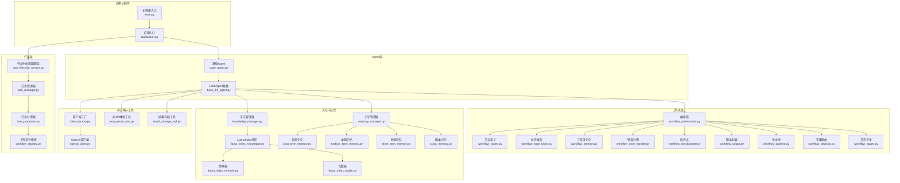
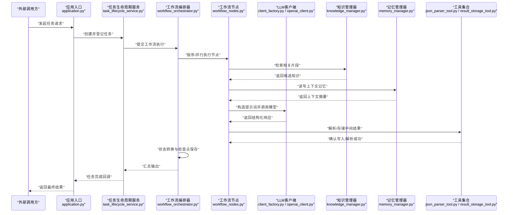
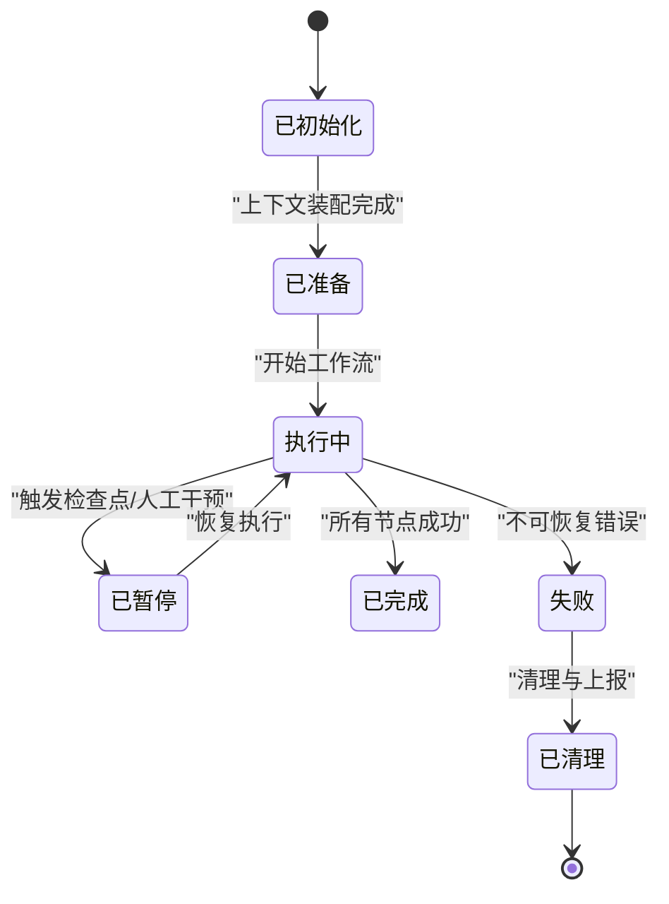
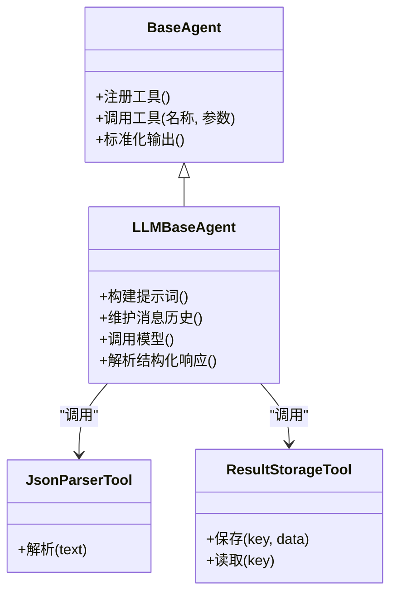
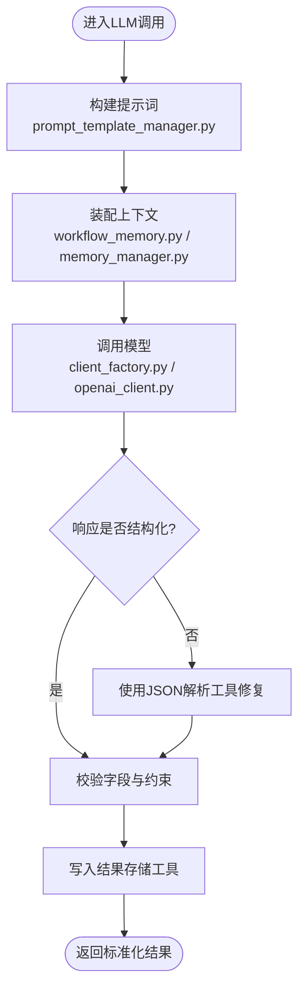
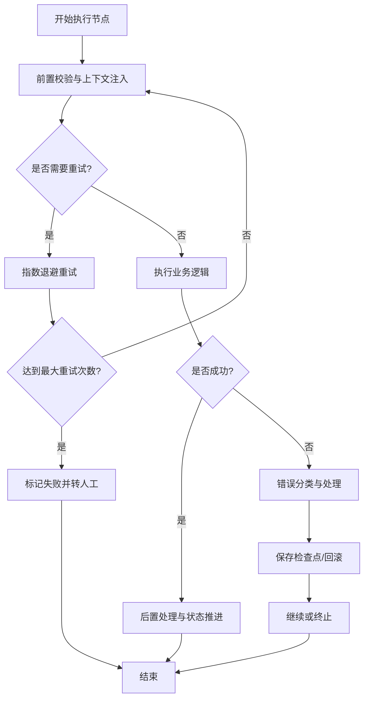
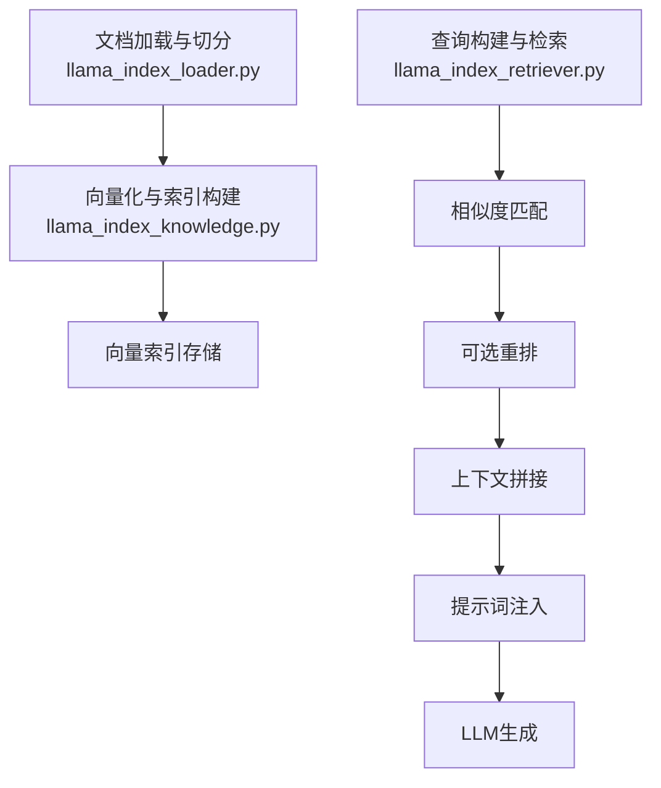
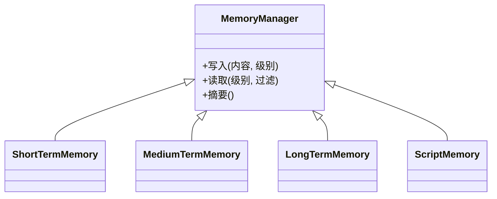
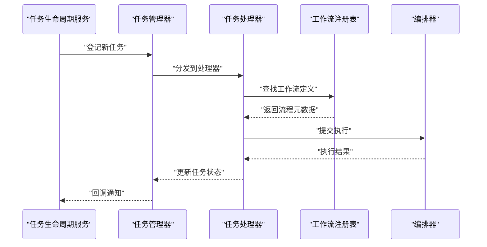
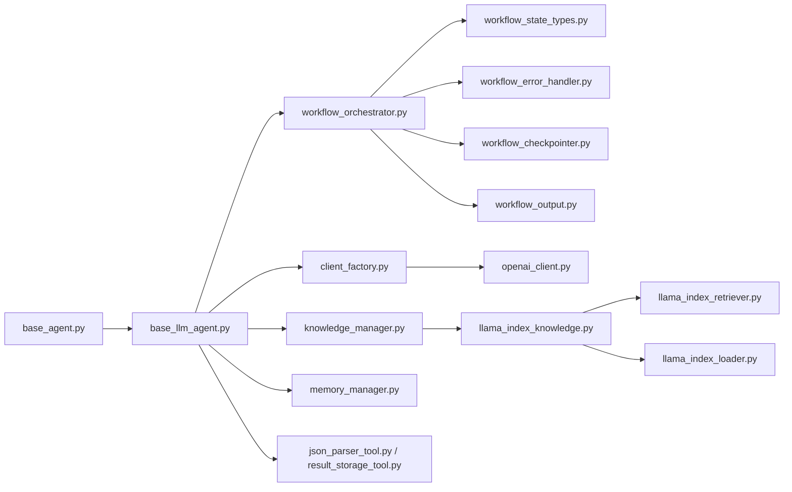

# 核心概念

<cite>
**本文引用的文件**   
- [main.py](file://main.py)
- [src/penshot/app/application.py](file://src/penshot/app/application.py)
- [src/penshot/neopen/agent/base_agent.py](file://src/penshot/neopen/agent/base_agent.py)
- [src/penshot/neopen/agent/base_llm_agent.py](file://src/penshot/neopen/agent/base_llm_agent.py)
- [src/penshot/neopen/agent/workflow/workflow_orchestrator.py](file://src/penshot/neopen/agent/workflow/workflow_orchestrator.py)
- [src/penshot/neopen/agent/workflow/workflow_state_types.py](file://src/penshot/neopen/agent/workflow/workflow_state_types.py)
- [src/penshot/neopen/agent/workflow/workflow_nodes.py](file://src/penshot/neopen/agent/workflow/workflow_nodes.py)
- [src/penshot/neopen/agent/workflow/workflow_memory.py](file://src/penshot/neopen/agent/workflow/workflow_memory.py)
- [src/penshot/neopen/agent/workflow/workflow_error_handler.py](file://src/penshot/neopen/agent/workflow/workflow_error_handler.py)
- [src/penshot/neopen/agent/workflow/workflow_checkpointer.py](file://src/penshot/neopen/agent/workflow/workflow_checkpointer.py)
- [src/penshot/neopen/agent/workflow/workflow_output.py](file://src/penshot/neopen/agent/workflow/workflow_output.py)
- [src/penshot/neopen/agent/workflow/workflow_pipeline.py](file://src/penshot/neopen/agent/workflow/workflow_pipeline.py)
- [src/penshot/neopen/agent/workflow/workflow_decision.py](file://src/penshot/neopen/agent/workflow/workflow_decision.py)
- [src/penshot/neopen/agent/workflow/workflow_logger.py](file://src/penshot/neopen/agent/workflow/workflow_logger.py)
- [src/penshot/neopen/knowledge/knowledge_manager.py](file://src/penshot/neopen/knowledge/knowledge_manager.py)
- [src/penshot/neopen/knowledge/llamaIndex/llama_index_knowledge.py](file://src/penshot/neopen/knowledge/llamaIndex/llama_index_knowledge.py)
- [src/penshot/neopen/knowledge/llamaIndex/llama_index_retriever.py](file://src/penshot/neopen/knowledge/llamaIndex/llama_index_retriever.py)
- [src/penshot/neopen/knowledge/llamaIndex/llama_index_loader.py](file://src/penshot/neopen/knowledge/llamaIndex/llama_index_loader.py)
- [src/penshot/neopen/knowledge/memory/memory_manager.py](file://src/penshot/neopen/knowledge/memory/memory_manager.py)
- [src/penshot/neopen/knowledge/memory/long_term_memory.py](file://src/penshot/neopen/knowledge/memory/long_term_memory.py)
- [src/penshot/neopen/knowledge/memory/medium_term_memory.py](file://src/penshot/neopen/knowledge/memory/medium_term_memory.py)
- [src/penshot/neopen/knowledge/memory/short_term_memory.py](file://src/penshot/neopen/knowledge/memory/short_term_memory.py)
- [src/penshot/neopen/knowledge/memory/script_memory.py](file://src/penshot/neopen/knowledge/memory/script_memory.py)
- [src/penshot/neopen/prompts/prompt_template_manager.py](file://src/penshot/neopen/prompts/prompt_template_manager.py)
- [src/penshot/neopen/client/client_factory.py](file://src/penshot/neopen/client/client_factory.py)
- [src/penshot/neopen/client/openai_client.py](file://src/penshot/neopen/client/openai_client.py)
- [src/penshot/neopen/tools/json_parser_tool.py](file://src/penshot/neopen/tools/json_parser_tool.py)
- [src/penshot/neopen/tools/result_storage_tool.py](file://src/penshot/neopen/tools/result_storage_tool.py)
- [src/penshot/neopen/task/task_lifecycle_service.py](file://src/penshot/neopen/task/task_lifecycle_service.py)
- [src/penshot/neopen/task/task_manager.py](file://src/penshot/neopen/task/task_manager.py)
- [src/penshot/neopen/task/task_processor.py](file://src/penshot/neopen/task/task_processor.py)
- [src/penshot/neopen/task/workflow_registry.py](file://src/penshot/neopen/task/workflow_registry.py)
</cite>

## 目录
1. [引言](#引言)
2. [项目结构](#项目结构)
3. [核心组件](#核心组件)
4. [架构总览](#架构总览)
5. [详细组件分析](#详细组件分析)
6. [依赖分析](#依赖分析)
7. [性能考虑](#性能考虑)
8. [故障排查指南](#故障排查指南)
9. [结论](#结论)
10. [附录：术语表](#附录术语表)

## 引言
本概念文档面向Video Shot Agent的开发者与集成者，聚焦以下目标：
- 解释AI Agent架构设计原理：生命周期、状态管理、工具调用机制
- 阐述大语言模型（LLM）集成的基本概念：提示词工程、上下文管理、响应处理
- 说明工作流编排的核心理念：任务调度、状态转换、错误处理策略
- 解释知识库系统的RAG（检索增强生成）原理：向量检索、语义匹配、知识更新机制
- 提供清晰的概念图与术语表，帮助理解系统的设计哲学与关键抽象

## 项目结构
本项目采用分层与领域混合的组织方式：
- 应用层：应用启动、环境配置、HTTP/MCP服务入口
- Agent层：通用Agent基类、LLM Agent基类、具体Agent实现
- 工作流层：编排器、节点、状态、记忆、检查点、输出、决策、日志等
- 知识与记忆层：LlamaIndex RAG、多粒度记忆（长/中/短期）、脚本记忆
- 客户端层：统一LLM客户端工厂与各厂商适配
- 工具层：JSON解析、结果存储、脚本评估等可被Agent调用的工具
- 任务层：任务生命周期、注册表、处理器与管理器
- 提示词层：模板管理与加载器

图表来源
- [main.py](file://main.py)
- [src/penshot/app/application.py](file://src/penshot/app/application.py)
- [src/penshot/neopen/agent/base_agent.py](file://src/penshot/neopen/agent/base_agent.py)
- [src/penshot/neopen/agent/base_llm_agent.py](file://src/penshot/neopen/agent/base_llm_agent.py)
- [src/penshot/neopen/agent/workflow/workflow_orchestrator.py](file://src/penshot/neopen/agent/workflow/workflow_orchestrator.py)
- [src/penshot/neopen/agent/workflow/workflow_state_types.py](file://src/penshot/neopen/agent/workflow/workflow_state_types.py)
- [src/penshot/neopen/agent/workflow/workflow_nodes.py](file://src/penshot/neopen/agent/workflow/workflow_nodes.py)
- [src/penshot/neopen/agent/workflow/workflow_memory.py](file://src/penshot/neopen/agent/workflow/workflow_memory.py)
- [src/penshot/neopen/agent/workflow/workflow_error_handler.py](file://src/penshot/neopen/agent/workflow/workflow_error_handler.py)
- [src/penshot/neopen/agent/workflow/workflow_checkpointer.py](file://src/penshot/neopen/agent/workflow/workflow_checkpointer.py)
- [src/penshot/neopen/agent/workflow/workflow_output.py](file://src/penshot/neopen/agent/workflow/workflow_output.py)
- [src/penshot/neopen/agent/workflow/workflow_pipeline.py](file://src/penshot/neopen/agent/workflow/workflow_pipeline.py)
- [src/penshot/neopen/agent/workflow/workflow_decision.py](file://src/penshot/neopen/agent/workflow/workflow_decision.py)
- [src/penshot/neopen/agent/workflow/workflow_logger.py](file://src/penshot/neopen/agent/workflow/workflow_logger.py)
- [src/penshot/neopen/knowledge/knowledge_manager.py](file://src/penshot/neopen/knowledge/knowledge_manager.py)
- [src/penshot/neopen/knowledge/llamaIndex/llama_index_knowledge.py](file://src/penshot/neopen/knowledge/llamaIndex/llama_index_knowledge.py)
- [src/penshot/neopen/knowledge/llamaIndex/llama_index_retriever.py](file://src/penshot/neopen/knowledge/llamaIndex/llama_index_retriever.py)
- [src/penshot/neopen/knowledge/llamaIndex/llama_index_loader.py](file://src/penshot/neopen/knowledge/llamaIndex/llama_index_loader.py)
- [src/penshot/neopen/knowledge/memory/memory_manager.py](file://src/penshot/neopen/knowledge/memory/memory_manager.py)
- [src/penshot/neopen/knowledge/memory/long_term_memory.py](file://src/penshot/neopen/knowledge/memory/long_term_memory.py)
- [src/penshot/neopen/knowledge/memory/medium_term_memory.py](file://src/penshot/neopen/knowledge/memory/medium_term_memory.py)
- [src/penshot/neopen/knowledge/memory/short_term_memory.py](file://src/penshot/neopen/knowledge/memory/short_term_memory.py)
- [src/penshot/neopen/knowledge/memory/script_memory.py](file://src/penshot/neopen/knowledge/memory/script_memory.py)
- [src/penshot/neopen/client/client_factory.py](file://src/penshot/neopen/client/client_factory.py)
- [src/penshot/neopen/client/openai_client.py](file://src/penshot/neopen/client/openai_client.py)
- [src/penshot/neopen/tools/json_parser_tool.py](file://src/penshot/neopen/tools/json_parser_tool.py)
- [src/penshot/neopen/tools/result_storage_tool.py](file://src/penshot/neopen/tools/result_storage_tool.py)
- [src/penshot/neopen/task/task_lifecycle_service.py](file://src/penshot/neopen/task/task_lifecycle_service.py)
- [src/penshot/neopen/task/task_manager.py](file://src/penshot/neopen/task/task_manager.py)
- [src/penshot/neopen/task/task_processor.py](file://src/penshot/neopen/task/task_processor.py)
- [src/penshot/neopen/task/workflow_registry.py](file://src/penshot/neopen/task/workflow_registry.py)

章节来源
- [main.py](file://main.py)
- [src/penshot/app/application.py](file://src/penshot/app/application.py)

## 核心组件
本节从概念层面梳理Video Shot Agent的关键抽象与职责边界。

- Agent基类与LLM Agent基类
  - 负责Agent通用能力：输入校验、上下文装配、工具注册与调用、结果标准化、异常收敛
  - LLM Agent在基类基础上扩展：提示词构建、消息历史维护、模型调用封装、结构化输出解析
- 工作流编排器
  - 将复杂视频分镜任务拆解为有向无环图或序列化的步骤，驱动节点执行、状态流转、错误恢复与检查点持久化
- 知识与记忆
  - 通过RAG（LlamaIndex）进行外部知识检索；通过多粒度记忆（长/中/短期、脚本记忆）维持会话与跨任务一致性
- 客户端与工具
  - 统一LLM客户端工厂屏蔽不同后端差异；工具模块提供JSON解析、结果存储等原子能力供Agent按需调用
- 任务层
  - 以任务为中心组织生命周期、注册与调度，使工作流与业务解耦，便于扩展新流程

章节来源
- [src/penshot/neopen/agent/base_agent.py](file://src/penshot/neopen/agent/base_agent.py)
- [src/penshot/neopen/agent/base_llm_agent.py](file://src/penshot/neopen/agent/base_llm_agent.py)
- [src/penshot/neopen/agent/workflow/workflow_orchestrator.py](file://src/penshot/neopen/agent/workflow/workflow_orchestrator.py)
- [src/penshot/neopen/knowledge/knowledge_manager.py](file://src/penshot/neopen/knowledge/knowledge_manager.py)
- [src/penshot/neopen/client/client_factory.py](file://src/penshot/neopen/client/client_factory.py)
- [src/penshot/neopen/tools/json_parser_tool.py](file://src/penshot/neopen/tools/json_parser_tool.py)
- [src/penshot/neopen/tools/result_storage_tool.py](file://src/penshot/neopen/tools/result_storage_tool.py)
- [src/penshot/neopen/task/task_lifecycle_service.py](file://src/penshot/neopen/task/task_lifecycle_service.py)

## 架构总览
下图展示从请求进入、任务编排到LLM调用与知识检索的整体数据与控制流。

图表来源
- [src/penshot/app/application.py](file://src/penshot/app/application.py)
- [src/penshot/neopen/task/task_lifecycle_service.py](file://src/penshot/neopen/task/task_lifecycle_service.py)
- [src/penshot/neopen/agent/workflow/workflow_orchestrator.py](file://src/penshot/neopen/agent/workflow/workflow_orchestrator.py)
- [src/penshot/neopen/agent/workflow/workflow_nodes.py](file://src/penshot/neopen/agent/workflow/workflow_nodes.py)
- [src/penshot/neopen/client/client_factory.py](file://src/penshot/neopen/client/client_factory.py)
- [src/penshot/neopen/client/openai_client.py](file://src/penshot/neopen/client/openai_client.py)
- [src/penshot/neopen/knowledge/knowledge_manager.py](file://src/penshot/neopen/knowledge/knowledge_manager.py)
- [src/penshot/neopen/knowledge/memory/memory_manager.py](file://src/penshot/neopen/knowledge/memory/memory_manager.py)
- [src/penshot/neopen/tools/json_parser_tool.py](file://src/penshot/neopen/tools/json_parser_tool.py)
- [src/penshot/neopen/tools/result_storage_tool.py](file://src/penshot/neopen/tools/result_storage_tool.py)

## 详细组件分析

### Agent生命周期与状态管理
- 生命周期阶段
  - 初始化：加载配置、注册工具、建立记忆与知识索引
  - 准备：构建上下文、组装提示词、选择模型与参数
  - 执行：调用工作流编排器，驱动节点执行
  - 收尾：持久化检查点、清理临时资源、输出标准化
- 状态管理
  - 使用工作流状态类型定义各阶段的合法状态与转换规则
  - 编排器在节点前后进行状态校验与转换，确保幂等与可恢复性
  - 检查点模块支持断点续跑与回溯重放

图表来源
- [src/penshot/neopen/agent/workflow/workflow_state_types.py](file://src/penshot/neopen/agent/workflow/workflow_state_types.py)
- [src/penshot/neopen/agent/workflow/workflow_orchestrator.py](file://src/penshot/neopen/agent/workflow/workflow_orchestrator.py)
- [src/penshot/neopen/agent/workflow/workflow_checkpointer.py](file://src/penshot/neopen/agent/workflow/workflow_checkpointer.py)

章节来源
- [src/penshot/neopen/agent/base_agent.py](file://src/penshot/neopen/agent/base_agent.py)
- [src/penshot/neopen/agent/base_llm_agent.py](file://src/penshot/neopen/agent/base_llm_agent.py)
- [src/penshot/neopen/agent/workflow/workflow_state_types.py](file://src/penshot/neopen/agent/workflow/workflow_state_types.py)
- [src/penshot/neopen/agent/workflow/workflow_orchestrator.py](file://src/penshot/neopen/agent/workflow/workflow_orchestrator.py)
- [src/penshot/neopen/agent/workflow/workflow_checkpointer.py](file://src/penshot/neopen/agent/workflow/workflow_checkpointer.py)

### 工具调用机制
- 工具注册与发现
  - Agent在初始化时集中注册工具，暴露统一的调用接口
- 调用契约
  - 输入参数校验、错误码约定、返回值规范化
- 典型工具
  - JSON解析工具：对模型输出的非结构化文本进行健壮解析
  - 结果存储工具：将中间或最终结果持久化，便于后续审计与回放

图表来源
- [src/penshot/neopen/agent/base_agent.py](file://src/penshot/neopen/agent/base_agent.py)
- [src/penshot/neopen/agent/base_llm_agent.py](file://src/penshot/neopen/agent/base_llm_agent.py)
- [src/penshot/neopen/tools/json_parser_tool.py](file://src/penshot/neopen/tools/json_parser_tool.py)
- [src/penshot/neopen/tools/result_storage_tool.py](file://src/penshot/neopen/tools/result_storage_tool.py)

章节来源
- [src/penshot/neopen/tools/json_parser_tool.py](file://src/penshot/neopen/tools/json_parser_tool.py)
- [src/penshot/neopen/tools/result_storage_tool.py](file://src/penshot/neopen/tools/result_storage_tool.py)

### 大语言模型集成：提示词工程、上下文管理、响应处理
- 提示词工程
  - 模板化管理：按版本与语言维度组织提示词模板，运行时动态渲染
  - 角色与约束：在模板中明确角色、输出格式与边界条件
- 上下文管理
  - 工作流记忆：在节点间传递必要上下文，避免重复计算
  - 会话记忆：短期记忆保留最近交互，中期记忆聚合阶段性总结，长期记忆沉淀跨会话经验
- 响应处理
  - 结构化解析：优先期望结构化输出，结合工具进行容错解析
  - 错误收敛：捕获网络、超时、格式错误等异常，统一降级与重试策略

图表来源
- [src/penshot/neopen/prompts/prompt_template_manager.py](file://src/penshot/neopen/prompts/prompt_template_manager.py)
- [src/penshot/neopen/agent/workflow/workflow_memory.py](file://src/penshot/neopen/agent/workflow/workflow_memory.py)
- [src/penshot/neopen/knowledge/memory/memory_manager.py](file://src/penshot/neopen/knowledge/memory/memory_manager.py)
- [src/penshot/neopen/client/client_factory.py](file://src/penshot/neopen/client/client_factory.py)
- [src/penshot/neopen/client/openai_client.py](file://src/penshot/neopen/client/openai_client.py)
- [src/penshot/neopen/tools/json_parser_tool.py](file://src/penshot/neopen/tools/json_parser_tool.py)
- [src/penshot/neopen/tools/result_storage_tool.py](file://src/penshot/neopen/tools/result_storage_tool.py)

章节来源
- [src/penshot/neopen/prompts/prompt_template_manager.py](file://src/penshot/neopen/prompts/prompt_template_manager.py)
- [src/penshot/neopen/agent/workflow/workflow_memory.py](file://src/penshot/neopen/agent/workflow/workflow_memory.py)
- [src/penshot/neopen/knowledge/memory/memory_manager.py](file://src/penshot/neopen/knowledge/memory/memory_manager.py)
- [src/penshot/neopen/client/client_factory.py](file://src/penshot/neopen/client/client_factory.py)
- [src/penshot/neopen/client/openai_client.py](file://src/penshot/neopen/client/openai_client.py)
- [src/penshot/neopen/tools/json_parser_tool.py](file://src/penshot/neopen/tools/json_parser_tool.py)

### 工作流编排：任务调度、状态转换、错误处理
- 任务调度
  - 编排器根据节点依赖关系决定执行顺序，支持串行与并行策略
- 状态转换
  - 每个节点执行前/后触发状态机转换，保证一致性与可观测性
- 错误处理
  - 错误分类：可重试、需人工介入、不可恢复
  - 策略：指数退避重试、回滚至最近检查点、告警与降级路径

图表来源
- [src/penshot/neopen/agent/workflow/workflow_orchestrator.py](file://src/penshot/neopen/agent/workflow/workflow_orchestrator.py)
- [src/penshot/neopen/agent/workflow/workflow_nodes.py](file://src/penshot/neopen/agent/workflow/workflow_nodes.py)
- [src/penshot/neopen/agent/workflow/workflow_error_handler.py](file://src/penshot/neopen/agent/workflow/workflow_error_handler.py)
- [src/penshot/neopen/agent/workflow/workflow_checkpointer.py](file://src/penshot/neopen/agent/workflow/workflow_checkpointer.py)

章节来源
- [src/penshot/neopen/agent/workflow/workflow_orchestrator.py](file://src/penshot/neopen/agent/workflow/workflow_orchestrator.py)
- [src/penshot/neopen/agent/workflow/workflow_nodes.py](file://src/penshot/neopen/agent/workflow/workflow_nodes.py)
- [src/penshot/neopen/agent/workflow/workflow_error_handler.py](file://src/penshot/neopen/agent/workflow/workflow_error_handler.py)
- [src/penshot/neopen/agent/workflow/workflow_checkpointer.py](file://src/penshot/neopen/agent/workflow/workflow_checkpointer.py)

### 知识库与RAG：向量检索、语义匹配、知识更新
- 知识入库
  - 加载器负责从多源抽取与切分文档，嵌入并向量化存储
- 检索与排序
  - 检索器基于语义相似度召回候选片段，必要时引入重排提升相关性
- 知识更新
  - 增量更新策略：新增/修改/删除后的索引重建或局部刷新
- 与Agent协作
  - 在提示词构建阶段注入相关知识片段，提高回答准确性与时效性

图表来源
- [src/penshot/neopen/knowledge/llamaIndex/llama_index_loader.py](file://src/penshot/neopen/knowledge/llamaIndex/llama_index_loader.py)
- [src/penshot/neopen/knowledge/llamaIndex/llama_index_knowledge.py](file://src/penshot/neopen/knowledge/llamaIndex/llama_index_knowledge.py)
- [src/penshot/neopen/knowledge/llamaIndex/llama_index_retriever.py](file://src/penshot/neopen/knowledge/llamaIndex/llama_index_retriever.py)
- [src/penshot/neopen/knowledge/knowledge_manager.py](file://src/penshot/neopen/knowledge/knowledge_manager.py)

章节来源
- [src/penshot/neopen/knowledge/knowledge_manager.py](file://src/penshot/neopen/knowledge/knowledge_manager.py)
- [src/penshot/neopen/knowledge/llamaIndex/llama_index_knowledge.py](file://src/penshot/neopen/knowledge/llamaIndex/llama_index_knowledge.py)
- [src/penshot/neopen/knowledge/llamaIndex/llama_index_retriever.py](file://src/penshot/neopen/knowledge/llamaIndex/llama_index_retriever.py)
- [src/penshot/neopen/knowledge/llamaIndex/llama_index_loader.py](file://src/penshot/neopen/knowledge/llamaIndex/llama_index_loader.py)

### 记忆系统：长/中/短期与脚本记忆
- 短期记忆：保留最近若干轮对话或节点输出，用于即时推理
- 中期记忆：阶段性摘要与关键事实，跨节点共享
- 长期记忆：跨会话沉淀的经验与偏好，支持检索与复用
- 脚本记忆：针对剧本/分镜任务的专用记忆，维护场景、角色、时间线等结构化信息

图表来源
- [src/penshot/neopen/knowledge/memory/memory_manager.py](file://src/penshot/neopen/knowledge/memory/memory_manager.py)
- [src/penshot/neopen/knowledge/memory/short_term_memory.py](file://src/penshot/neopen/knowledge/memory/short_term_memory.py)
- [src/penshot/neopen/knowledge/memory/medium_term_memory.py](file://src/penshot/neopen/knowledge/memory/medium_term_memory.py)
- [src/penshot/neopen/knowledge/memory/long_term_memory.py](file://src/penshot/neopen/knowledge/memory/long_term_memory.py)
- [src/penshot/neopen/knowledge/memory/script_memory.py](file://src/penshot/neopen/knowledge/memory/script_memory.py)

章节来源
- [src/penshot/neopen/knowledge/memory/memory_manager.py](file://src/penshot/neopen/knowledge/memory/memory_manager.py)
- [src/penshot/neopen/knowledge/memory/short_term_memory.py](file://src/penshot/neopen/knowledge/memory/short_term_memory.py)
- [src/penshot/neopen/knowledge/memory/medium_term_memory.py](file://src/penshot/neopen/knowledge/memory/medium_term_memory.py)
- [src/penshot/neopen/knowledge/memory/long_term_memory.py](file://src/penshot/neopen/knowledge/memory/long_term_memory.py)
- [src/penshot/neopen/knowledge/memory/script_memory.py](file://src/penshot/neopen/knowledge/memory/script_memory.py)

### 任务层：生命周期、注册与调度
- 任务生命周期服务：负责任务创建、状态跟踪、回调通知
- 任务管理器：维护任务集合、并发控制、优先级队列
- 任务处理器：将工作流注册表中的流程实例化为可执行单元
- 工作流注册表：声明式注册工作流定义，支持热插拔与版本管理

图表来源
- [src/penshot/neopen/task/task_lifecycle_service.py](file://src/penshot/neopen/task/task_lifecycle_service.py)
- [src/penshot/neopen/task/task_manager.py](file://src/penshot/neopen/task/task_manager.py)
- [src/penshot/neopen/task/task_processor.py](file://src/penshot/neopen/task/task_processor.py)
- [src/penshot/neopen/task/workflow_registry.py](file://src/penshot/neopen/task/workflow_registry.py)
- [src/penshot/neopen/agent/workflow/workflow_orchestrator.py](file://src/penshot/neopen/agent/workflow/workflow_orchestrator.py)

章节来源
- [src/penshot/neopen/task/task_lifecycle_service.py](file://src/penshot/neopen/task/task_lifecycle_service.py)
- [src/penshot/neopen/task/task_manager.py](file://src/penshot/neopen/task/task_manager.py)
- [src/penshot/neopen/task/task_processor.py](file://src/penshot/neopen/task/task_processor.py)
- [src/penshot/neopen/task/workflow_registry.py](file://src/penshot/neopen/task/workflow_registry.py)

## 依赖分析
- 松耦合设计
  - Agent与工作流、知识与记忆、客户端与工具之间通过接口与注册表解耦
- 直接依赖
  - LLM客户端由工厂统一创建，降低接入成本
  - 工作流编排器依赖状态类型、错误处理、检查点与输出封装
- 潜在风险
  - 若工作流节点过多且强耦合，可能导致状态爆炸与调试困难
  - 知识索引更新不及时会影响检索质量

图表来源
- [src/penshot/neopen/agent/base_agent.py](file://src/penshot/neopen/agent/base_agent.py)
- [src/penshot/neopen/agent/base_llm_agent.py](file://src/penshot/neopen/agent/base_llm_agent.py)
- [src/penshot/neopen/agent/workflow/workflow_orchestrator.py](file://src/penshot/neopen/agent/workflow/workflow_orchestrator.py)
- [src/penshot/neopen/agent/workflow/workflow_state_types.py](file://src/penshot/neopen/agent/workflow/workflow_state_types.py)
- [src/penshot/neopen/agent/workflow/workflow_error_handler.py](file://src/penshot/neopen/agent/workflow/workflow_error_handler.py)
- [src/penshot/neopen/agent/workflow/workflow_checkpointer.py](file://src/penshot/neopen/agent/workflow/workflow_checkpointer.py)
- [src/penshot/neopen/agent/workflow/workflow_output.py](file://src/penshot/neopen/agent/workflow/workflow_output.py)
- [src/penshot/neopen/client/client_factory.py](file://src/penshot/neopen/client/client_factory.py)
- [src/penshot/neopen/client/openai_client.py](file://src/penshot/neopen/client/openai_client.py)
- [src/penshot/neopen/knowledge/knowledge_manager.py](file://src/penshot/neopen/knowledge/knowledge_manager.py)
- [src/penshot/neopen/knowledge/llamaIndex/llama_index_knowledge.py](file://src/penshot/neopen/knowledge/llamaIndex/llama_index_knowledge.py)
- [src/penshot/neopen/knowledge/llamaIndex/llama_index_retriever.py](file://src/penshot/neopen/knowledge/llamaIndex/llama_index_retriever.py)
- [src/penshot/neopen/knowledge/llamaIndex/llama_index_loader.py](file://src/penshot/neopen/knowledge/llamaIndex/llama_index_loader.py)
- [src/penshot/neopen/knowledge/memory/memory_manager.py](file://src/penshot/neopen/knowledge/memory/memory_manager.py)
- [src/penshot/neopen/tools/json_parser_tool.py](file://src/penshot/neopen/tools/json_parser_tool.py)
- [src/penshot/neopen/tools/result_storage_tool.py](file://src/penshot/neopen/tools/result_storage_tool.py)

## 性能考虑
- 缓存与去重
  - 对相似查询与重复提示词进行缓存，减少冗余调用
- 批处理与并行
  - 在安全范围内并行执行独立节点，缩短端到端延迟
- 检索优化
  - 合理设置召回数量与重排阈值，平衡准确率与耗时
- 输出压缩
  - 对中间结果进行摘要与裁剪，降低上下文窗口占用

[本节为通用指导，不直接分析具体文件]

## 故障排查指南
- 常见问题定位
  - 提示词渲染失败：检查模板版本与变量映射
  - 模型调用异常：查看客户端配置、网络与限流策略
  - 结构化解析失败：启用JSON解析工具的容错模式并检查约束
  - 工作流卡住：核对状态转换与检查点一致性
- 诊断建议
  - 开启工作流日志与检查点快照，复现问题路径
  - 缩小范围：最小化工作流与提示词，逐步回归

章节来源
- [src/penshot/neopen/agent/workflow/workflow_logger.py](file://src/penshot/neopen/agent/workflow/workflow_logger.py)
- [src/penshot/neopen/agent/workflow/workflow_error_handler.py](file://src/penshot/neopen/agent/workflow/workflow_error_handler.py)
- [src/penshot/neopen/agent/workflow/workflow_checkpointer.py](file://src/penshot/neopen/agent/workflow/workflow_checkpointer.py)
- [src/penshot/neopen/prompts/prompt_template_manager.py](file://src/penshot/neopen/prompts/prompt_template_manager.py)
- [src/penshot/neopen/client/client_factory.py](file://src/penshot/neopen/client/client_factory.py)
- [src/penshot/neopen/tools/json_parser_tool.py](file://src/penshot/neopen/tools/json_parser_tool.py)

## 结论
Video Shot Agent以“Agent+工作流+知识+记忆”为核心抽象，通过模块化设计与松耦合接口，实现了可扩展、可观测、可恢复的视频分镜智能体系统。其设计强调：
- 清晰的Agent生命周期与状态机
- 强大的工作流编排与错误恢复
- 灵活的提示词工程与上下文管理
- 高效的RAG检索与多粒度记忆协同

[本节为总结性内容，不直接分析具体文件]

## 附录：术语表
- Agent：具备感知、规划、行动能力的智能体实体
- 工作流编排：将复杂任务分解为有序节点并驱动执行的过程
- 状态机：描述系统状态及其合法转换的规则集合
- 检查点：在执行过程中保存的状态快照，用于恢复与回溯
- 提示词工程：通过模板与上下文设计引导模型输出的实践
- RAG：检索增强生成，结合外部知识提升模型回答质量
- 向量检索：基于向量相似度进行信息召回的技术
- 语义匹配：衡量查询与候选在语义层面的相关性
- 记忆系统：短期/中期/长期记忆的分级管理机制
- 工具调用：Agent在运行期调用外部函数或服务的机制

[本节为概念性内容，不直接分析具体文件]