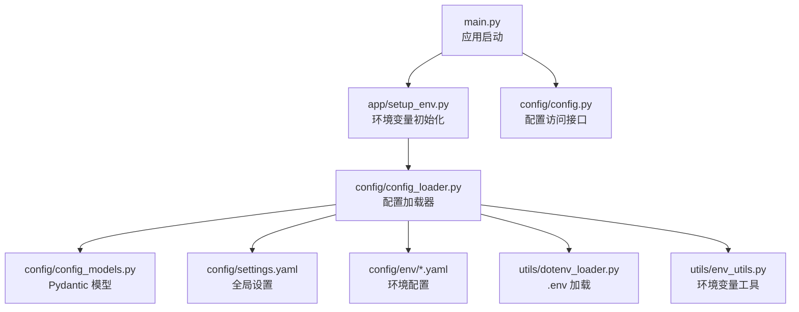
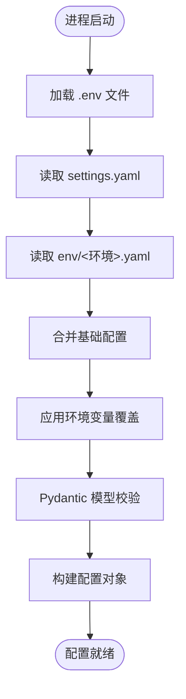
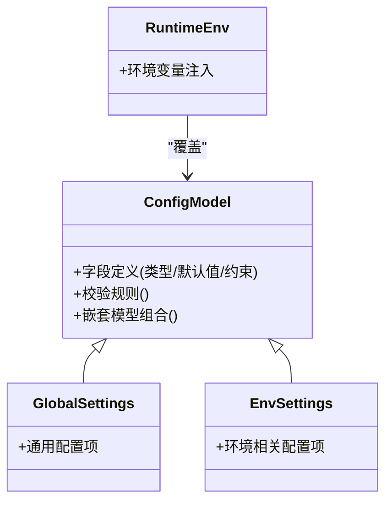
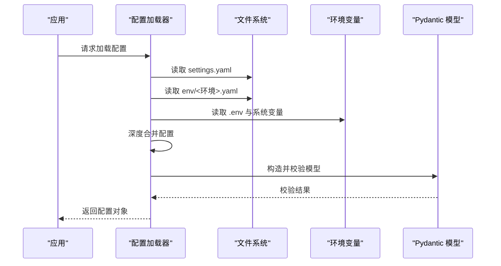
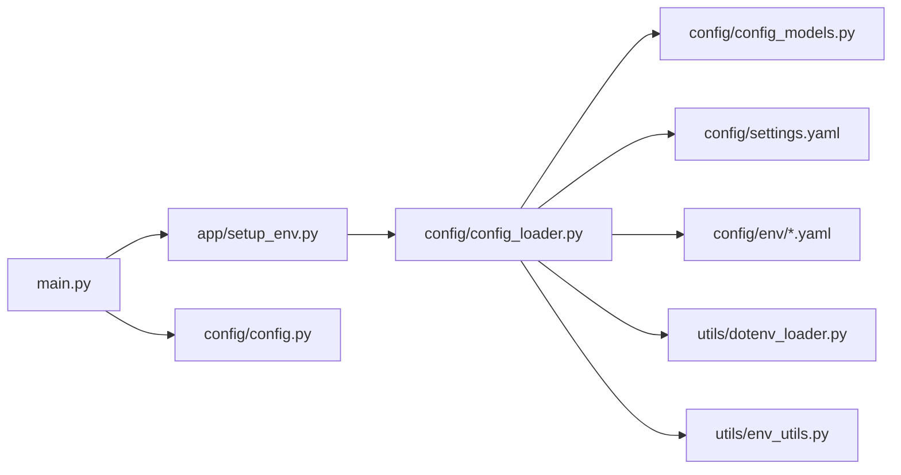

# 配置系统架构

<cite>
**本文引用的文件**   
- [src/penshot/config/config.py](file://src/penshot/config/config.py)
- [src/penshot/config/config_loader.py](file://src/penshot/config/config_loader.py)
- [src/penshot/config/config_models.py](file://src/penshot/config/config_models.py)
- [src/penshot/config/settings.yaml](file://src/penshot/config/settings.yaml)
- [src/penshot/config/env/development.yaml](file://src/penshot/config/env/development.yaml)
- [src/penshot/config/env/production.yaml](file://src/penshot/config/env/production.yaml)
- [src/penshot/app/setup_env.py](file://src/penshot/app/setup_env.py)
- [src/penshot/utils/dotenv_loader.py](file://src/penshot/utils/dotenv_loader.py)
- [src/penshot/utils/env_utils.py](file://src/penshot/utils/env_utils.py)
- [main.py](file://main.py)
</cite>

## 目录
1. [简介](#简介)
2. [项目结构](#项目结构)
3. [核心组件](#核心组件)
4. [架构总览](#架构总览)
5. [详细组件分析](#详细组件分析)
6. [依赖关系分析](#依赖关系分析)
7. [性能考量](#性能考量)
8. [故障排查指南](#故障排查指南)
9. [结论](#结论)
10. [附录](#附录)

## 简介
本文件面向“分层配置管理”的完整实现，系统性阐述全局配置、环境配置与应用配置的层次结构与加载机制。重点覆盖：
- YAML 解析与合并策略
- 环境变量注入与优先级
- Pydantic 模型验证与默认值处理
- 多环境差异化配置（开发、测试、生产）
- 动态配置更新与热重载能力
- 安全敏感信息处理与审计日志
- 配置文件示例与 API 使用方式

## 项目结构
配置子系统位于 src/penshot/config 下，包含模型定义、加载器、YAML 设置与环境配置；应用启动入口负责初始化环境与加载配置。

图表来源
- [main.py:1-200](file://main.py#L1-L200)
- [src/penshot/app/setup_env.py:1-200](file://src/penshot/app/setup_env.py#L1-L200)
- [src/penshot/config/config_loader.py:1-200](file://src/penshot/config/config_loader.py#L1-L200)
- [src/penshot/config/config_models.py:1-200](file://src/penshot/config/config_models.py#L1-L200)
- [src/penshot/config/settings.yaml:1-200](file://src/penshot/config/settings.yaml#L1-L200)
- [src/penshot/config/env/development.yaml:1-200](file://src/penshot/config/env/development.yaml#L1-L200)
- [src/penshot/config/env/production.yaml:1-200](file://src/penshot/config/env/production.yaml#L1-L200)
- [src/penshot/utils/dotenv_loader.py:1-200](file://src/penshot/utils/dotenv_loader.py#L1-L200)
- [src/penshot/utils/env_utils.py:1-200](file://src/penshot/utils/env_utils.py#L1-L200)

章节来源
- [main.py:1-200](file://main.py#L1-L200)
- [src/penshot/config/config.py:1-200](file://src/penshot/config/config.py#L1-L200)
- [src/penshot/config/config_loader.py:1-200](file://src/penshot/config/config_loader.py#L1-L200)
- [src/penshot/config/config_models.py:1-200](file://src/penshot/config/config_models.py#L1-L200)
- [src/penshot/config/settings.yaml:1-200](file://src/penshot/config/settings.yaml#L1-L200)
- [src/penshot/config/env/development.yaml:1-200](file://src/penshot/config/env/development.yaml#L1-L200)
- [src/penshot/config/env/production.yaml:1-200](file://src/penshot/config/env/production.yaml#L1-L200)
- [src/penshot/app/setup_env.py:1-200](file://src/penshot/app/setup_env.py#L1-L200)
- [src/penshot/utils/dotenv_loader.py:1-200](file://src/penshot/utils/dotenv_loader.py#L1-L200)
- [src/penshot/utils/env_utils.py:1-200](file://src/penshot/utils/env_utils.py#L1-L200)

## 核心组件
- 配置模型层（Pydantic）
  - 职责：定义配置项的类型、约束、默认值与校验逻辑，确保配置在加载后具备强类型与一致性。
  - 关键点：字段默认值、必填校验、枚举/范围限制、嵌套结构组合。
- 配置加载器
  - 职责：按优先级顺序读取并合并多层配置（全局 YAML、环境 YAML、.env 环境变量），完成类型转换与模型实例化。
  - 关键点：YAML 解析、键路径映射、覆盖策略、缺失键回退到默认值。
- 配置访问接口
  - 职责：提供统一、线程安全的只读访问点，支持按需获取子配置对象。
  - 关键点：懒加载、缓存、变更监听（可选）。
- 环境变量与 .env 集成
  - 职责：在进程启动前加载 .env 文件，并将环境变量注入到配置合并流程中。
  - 关键点：变量名规范、类型推断、敏感信息隔离。

章节来源
- [src/penshot/config/config_models.py:1-200](file://src/penshot/config/config_models.py#L1-L200)
- [src/penshot/config/config_loader.py:1-200](file://src/penshot/config/config_loader.py#L1-L200)
- [src/penshot/config/config.py:1-200](file://src/penshot/config/config.py#L1-L200)
- [src/penshot/utils/dotenv_loader.py:1-200](file://src/penshot/utils/dotenv_loader.py#L1-L200)
- [src/penshot/utils/env_utils.py:1-200](file://src/penshot/utils/env_utils.py#L1-L200)

## 架构总览
分层配置从低到高依次为：
- 基础层：settings.yaml（全局默认）
- 环境层：env/{development,production}.yaml（按运行环境选择）
- 运行时层：.env 与系统环境变量（最高优先级）

图表来源
- [src/penshot/config/config_loader.py:1-200](file://src/penshot/config/config_loader.py#L1-L200)
- [src/penshot/config/settings.yaml:1-200](file://src/penshot/config/settings.yaml#L1-L200)
- [src/penshot/config/env/development.yaml:1-200](file://src/penshot/config/env/development.yaml#L1-L200)
- [src/penshot/config/env/production.yaml:1-200](file://src/penshot/config/env/production.yaml#L1-L200)
- [src/penshot/utils/dotenv_loader.py:1-200](file://src/penshot/utils/dotenv_loader.py#L1-L200)
- [src/penshot/utils/env_utils.py:1-200](file://src/penshot/utils/env_utils.py#L1-L200)

## 详细组件分析

### 配置模型层（Pydantic）
- 设计要点
  - 以 Pydantic 模型描述配置结构，强制类型与约束，避免运行时类型错误。
  - 通过嵌套模型组织复杂配置（如数据库、缓存、外部服务）。
  - 为关键配置项提供默认值，保证最小可用配置集。
- 典型字段类别
  - 连接参数（主机、端口、超时、重试次数）
  - 功能开关（布尔标志）
  - 枚举与范围（日志级别、并发度）
  - 密钥与令牌（字符串，建议来自环境变量）
- 校验与迁移
  - 新增字段时保留向后兼容默认值
  - 对破坏性变更采用版本字段或迁移脚本

图表来源
- [src/penshot/config/config_models.py:1-200](file://src/penshot/config/config_models.py#L1-L200)

章节来源
- [src/penshot/config/config_models.py:1-200](file://src/penshot/config/config_models.py#L1-L200)

### 配置加载器（YAML 解析与合并）
- 加载顺序与优先级
  - 先加载 settings.yaml（全局默认）
  - 再加载 env/<环境>.yaml（覆盖全局）
  - 最后应用 .env 与系统环境变量（最高优先级）
- 合并策略
  - 深度合并：同层级字典逐项合并
  - 列表与标量：高优先级覆盖低优先级
- 类型转换
  - 将字符串型数值、布尔等转换为对应 Python 类型
  - 失败时抛出明确异常，便于定位问题
- 错误处理
  - 文件不存在或格式错误时给出清晰提示
  - 缺失必要字段时返回结构化错误

图表来源
- [src/penshot/config/config_loader.py:1-200](file://src/penshot/config/config_loader.py#L1-L200)
- [src/penshot/config/settings.yaml:1-200](file://src/penshot/config/settings.yaml#L1-L200)
- [src/penshot/config/env/development.yaml:1-200](file://src/penshot/config/env/development.yaml#L1-L200)
- [src/penshot/config/env/production.yaml:1-200](file://src/penshot/config/env/production.yaml#L1-L200)
- [src/penshot/utils/dotenv_loader.py:1-200](file://src/penshot/utils/dotenv_loader.py#L1-L200)
- [src/penshot/utils/env_utils.py:1-200](file://src/penshot/utils/env_utils.py#L1-L200)

章节来源
- [src/penshot/config/config_loader.py:1-200](file://src/penshot/config/config_loader.py#L1-L200)
- [src/penshot/utils/dotenv_loader.py:1-200](file://src/penshot/utils/dotenv_loader.py#L1-L200)
- [src/penshot/utils/env_utils.py:1-200](file://src/penshot/utils/env_utils.py#L1-L200)

### 配置访问接口（只读与懒加载）
- 设计目标
  - 提供稳定、易用的配置访问入口
  - 支持按需获取子配置，减少不必要的内存占用
- 特性
  - 线程安全访问
  - 可插拔的变更监听（用于热重载）
  - 统一的错误提示与调试信息

章节来源
- [src/penshot/config/config.py:1-200](file://src/penshot/config/config.py#L1-L200)

### 环境变量与 .env 集成
- 启动阶段加载 .env
  - 在应用初始化之前加载，确保后续模块可直接读取环境变量
- 变量命名规范
  - 使用大写与下划线分隔，避免与业务键冲突
- 敏感信息
  - 密钥、令牌等必须通过环境变量注入，禁止硬编码入 YAML

章节来源
- [src/penshot/app/setup_env.py:1-200](file://src/penshot/app/setup_env.py#L1-L200)
- [src/penshot/utils/dotenv_loader.py:1-200](file://src/penshot/utils/dotenv_loader.py#L1-L200)
- [src/penshot/utils/env_utils.py:1-200](file://src/penshot/utils/env_utils.py#L1-L200)

### 多环境配置管理
- 环境划分
  - development：本地开发与调试，开启详细日志、宽松校验
  - production：线上部署，关闭调试输出、启用严格校验与限流
- 切换方式
  - 通过环境变量指定环境名称，加载对应 env/<环境>.yaml
- 差异化管理
  - 仅在不同之处进行覆盖，保持配置简洁

章节来源
- [src/penshot/config/env/development.yaml:1-200](file://src/penshot/config/env/development.yaml#L1-L200)
- [src/penshot/config/env/production.yaml:1-200](file://src/penshot/config/env/production.yaml#L1-L200)

### 配置验证与类型系统
- Pydantic 校验
  - 字段类型、范围、正则表达式、自定义校验器
- 默认值处理
  - 未提供的字段自动填充默认值，保障最小可用配置
- 配置迁移
  - 引入版本字段，配合迁移脚本逐步演进配置结构

章节来源
- [src/penshot/config/config_models.py:1-200](file://src/penshot/config/config_models.py#L1-L200)

### 动态配置更新与热重载
- 触发方式
  - 基于文件监控或外部事件（如配置中心推送）
- 更新流程
  - 增量读取新配置 -> 合并 -> 校验 -> 替换当前配置对象
- 注意事项
  - 原子替换，避免部分更新导致不一致
  - 记录审计日志，便于追踪变更

章节来源
- [src/penshot/config/config_loader.py:1-200](file://src/penshot/config/config_loader.py#L1-L200)
- [src/penshot/config/config.py:1-200](file://src/penshot/config/config.py#L1-L200)

## 依赖关系分析
配置子系统内部依赖关系如下：

图表来源
- [main.py:1-200](file://main.py#L1-L200)
- [src/penshot/app/setup_env.py:1-200](file://src/penshot/app/setup_env.py#L1-L200)
- [src/penshot/config/config_loader.py:1-200](file://src/penshot/config/config_loader.py#L1-L200)
- [src/penshot/config/config_models.py:1-200](file://src/penshot/config/config_models.py#L1-L200)
- [src/penshot/config/settings.yaml:1-200](file://src/penshot/config/settings.yaml#L1-L200)
- [src/penshot/config/env/development.yaml:1-200](file://src/penshot/config/env/development.yaml#L1-L200)
- [src/penshot/config/env/production.yaml:1-200](file://src/penshot/config/env/production.yaml#L1-L200)
- [src/penshot/utils/dotenv_loader.py:1-200](file://src/penshot/utils/dotenv_loader.py#L1-L200)
- [src/penshot/utils/env_utils.py:1-200](file://src/penshot/utils/env_utils.py#L1-L200)
- [src/penshot/config/config.py:1-200](file://src/penshot/config/config.py#L1-L200)

章节来源
- [main.py:1-200](file://main.py#L1-L200)
- [src/penshot/config/config.py:1-200](file://src/penshot/config/config.py#L1-L200)
- [src/penshot/config/config_loader.py:1-200](file://src/penshot/config/config_loader.py#L1-L200)

## 性能考量
- 配置加载时机
  - 建议在进程启动早期一次性加载，避免重复 IO 与解析开销
- 合并与校验成本
  - 大型配置需控制层级深度与字段数量，必要时拆分模块
- 热重载影响
  - 使用原子替换与增量合并，降低锁竞争与抖动
- 内存占用
  - 按需懒加载子配置，避免一次性载入全部数据

[本节为通用指导，不直接分析具体文件]

## 故障排查指南
- 常见问题
  - YAML 语法错误：检查缩进与引号
  - 环境变量缺失：确认 .env 已正确加载且变量名一致
  - 类型转换失败：核对字段类型与默认值
  - 权限问题：确认配置文件可读
- 诊断步骤
  - 打印最终合并后的配置快照（脱敏）
  - 记录加载链路日志（文件路径、覆盖来源）
  - 使用最小配置复现问题

章节来源
- [src/penshot/config/config_loader.py:1-200](file://src/penshot/config/config_loader.py#L1-L200)
- [src/penshot/utils/dotenv_loader.py:1-200](file://src/penshot/utils/dotenv_loader.py#L1-L200)

## 结论
本配置系统通过“全局 YAML + 环境 YAML + 环境变量”的分层设计与 Pydantic 强类型校验，实现了高内聚、低耦合、可扩展的配置管理方案。结合热重载与审计日志，可在保证安全性的同时提升运维效率与可观测性。

[本节为总结性内容，不直接分析具体文件]

## 附录

### 配置文件示例（说明）
- settings.yaml
  - 存放全局默认配置，如基础路径、默认并发度、通用开关
- env/development.yaml
  - 开发环境覆盖项，如开启调试、放宽校验、本地服务地址
- env/production.yaml
  - 生产环境覆盖项，如关闭调试、严格校验、外部服务地址
- .env
  - 敏感信息与运行时变量，如密钥、令牌、数据库连接串

章节来源
- [src/penshot/config/settings.yaml:1-200](file://src/penshot/config/settings.yaml#L1-L200)
- [src/penshot/config/env/development.yaml:1-200](file://src/penshot/config/env/development.yaml#L1-L200)
- [src/penshot/config/env/production.yaml:1-200](file://src/penshot/config/env/production.yaml#L1-L200)

### 配置管理 API 使用说明（说明）
- 初始化
  - 在应用启动时调用配置加载器，完成 .env 加载与配置合并
- 访问配置
  - 通过配置访问接口获取顶层或子配置对象
- 热重载
  - 监听配置变更事件，触发重新加载与原子替换
- 最佳实践
  - 所有敏感信息通过环境变量注入
  - 为每个环境维护最小覆盖集
  - 变更记录纳入审计日志

章节来源
- [src/penshot/config/config.py:1-200](file://src/penshot/config/config.py#L1-L200)
- [src/penshot/config/config_loader.py:1-200](file://src/penshot/config/config_loader.py#L1-L200)
- [src/penshot/app/setup_env.py:1-200](file://src/penshot/app/setup_env.py#L1-L200)