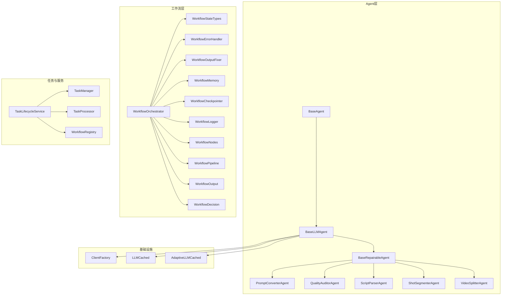
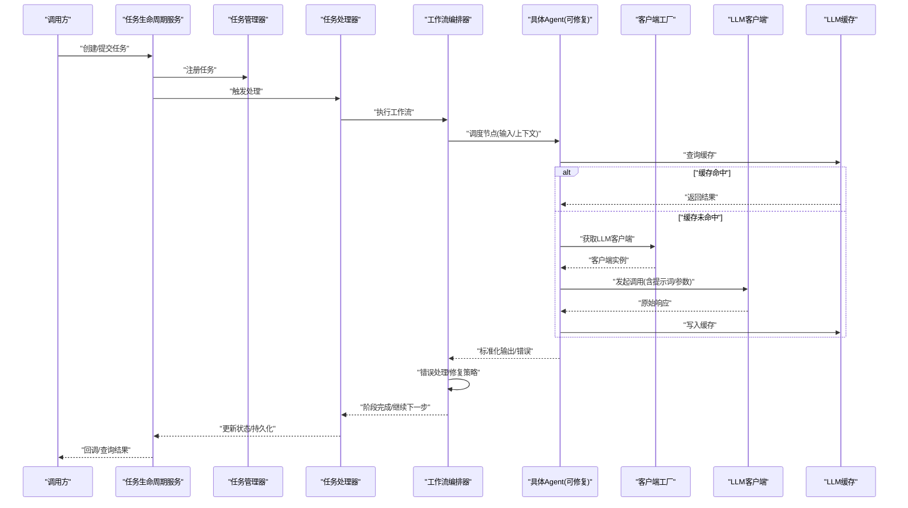
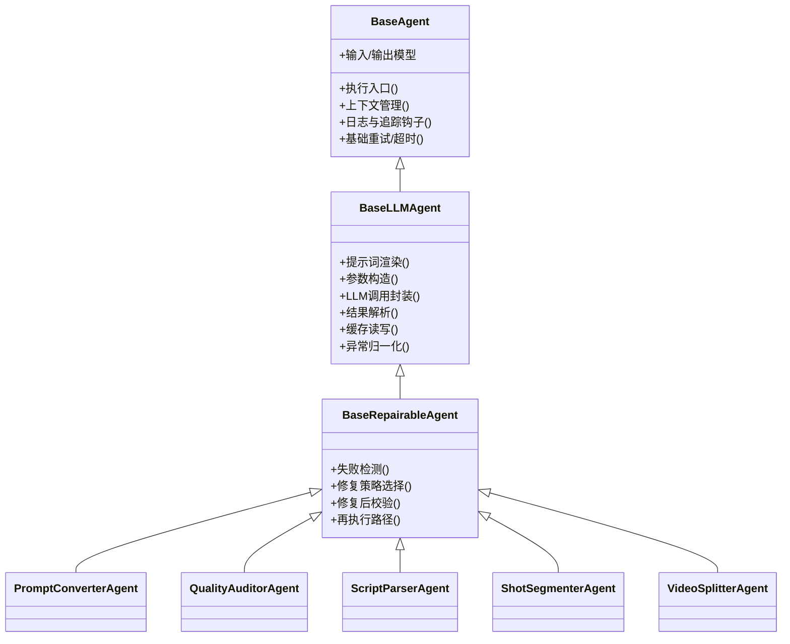
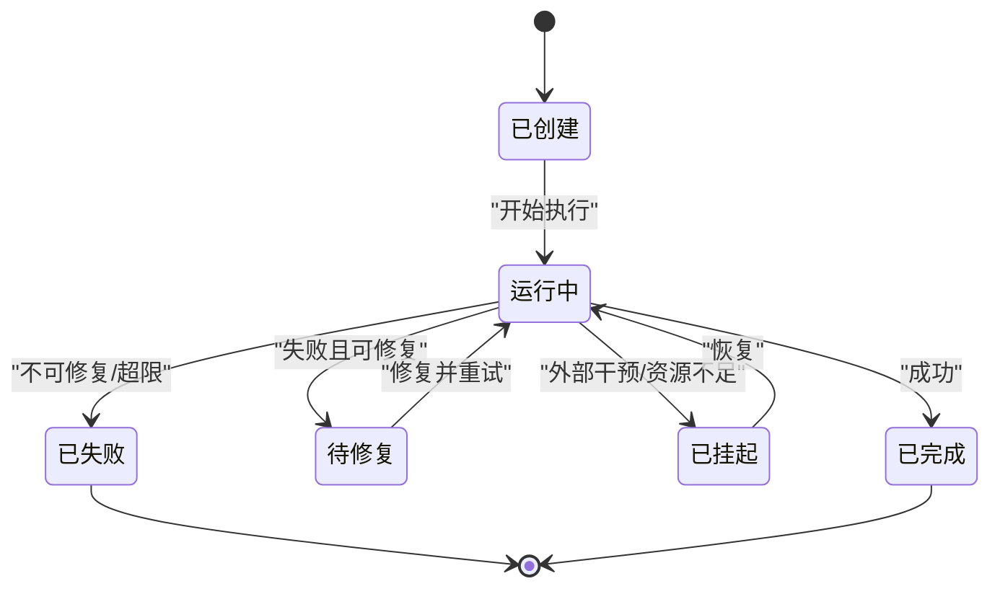
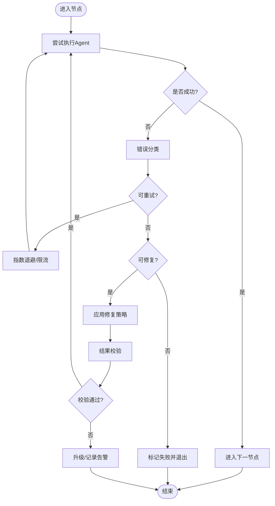
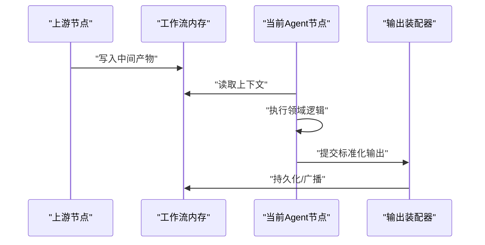
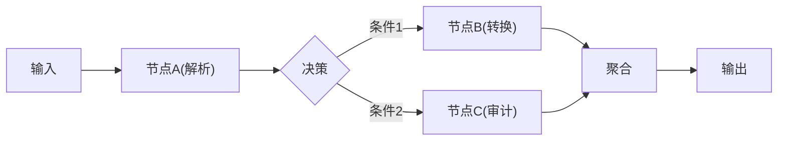
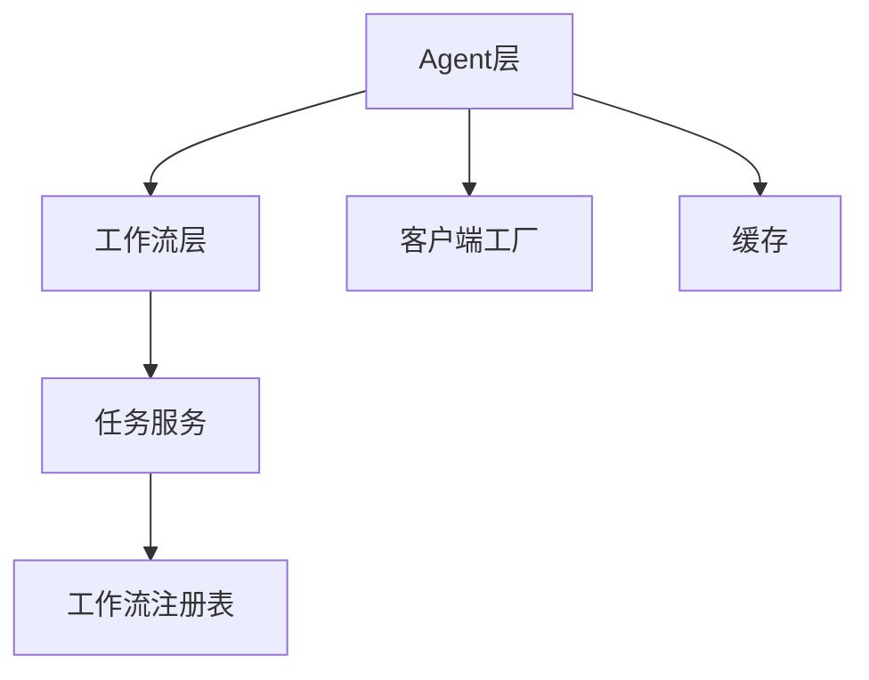

# Agent框架

<cite>
**本文引用的文件**   
- [base_agent.py](file://src/penshot/neopen/agent/base_agent.py)
- [base_llm_agent.py](file://src/penshot/neopen/agent/base_llm_agent.py)
- [base_repairable_agent.py](file://src/penshot/neopen/agent/base_repairable_agent.py)
- [base_models.py](file://src/penshot/neopen/agent/base_models.py)
- [prompt_converter_agent.py](file://src/penshot/neopen/agent/prompt_converter_agent.py)
- [quality_auditor_agent.py](file://src/penshot/neopen/agent/quality_auditor_agent.py)
- [script_parser_agent.py](file://src/penshot/neopen/agent/script_parser_agent.py)
- [shot_segmenter_agent.py](file://src/penshot/neopen/agent/shot_segmenter_agent.py)
- [video_splitter_agent.py](file://src/penshot/neopen/agent/video_splitter_agent.py)
- [workflow_orchestrator.py](file://src/penshot/neopen/agent/workflow/workflow_orchestrator.py)
- [workflow_state_types.py](file://src/penshot/neopen/agent/workflow/workflow_state_types.py)
- [workflow_error_handler.py](file://src/penshot/neopen/agent/workflow/workflow_error_handler.py)
- [workflow_output_fixer.py](file://src/penshot/neopen/agent/workflow/workflow_output_fixer.py)
- [workflow_memory.py](file://src/penshot/neopen/agent/workflow/workflow_memory.py)
- [workflow_checkpointer.py](file://src/penshot/neopen/agent/workflow/workflow_checkpointer.py)
- [workflow_logger.py](file://src/penshot/neopen/agent/workflow/workflow_logger.py)
- [workflow_nodes.py](file://src/penshot/neopen/agent/workflow/workflow_nodes.py)
- [workflow_pipeline.py](file://src/penshot/neopen/agent/workflow/workflow_pipeline.py)
- [workflow_output.py](file://src/penshot/neopen/agent/workflow/workflow_output.py)
- [workflow_decision.py](file://src/penshot/neopen/agent/workflow/workflow_decision.py)
- [workflow_registry.py](file://src/penshot/task/workflow_registry.py)
- [task_lifecycle_service.py](file://src/penshot/task/task_lifecycle_service.py)
- [task_manager.py](file://src/penshot/task/task_manager.py)
- [task_processor.py](file://src/penshot/task/task_processor.py)
- [client_factory.py](file://src/penshot/neopen/client/client_factory.py)
- [llm_cache.py](file://src/penshot/neopen/cache/llm_cache.py)
- [adaptive_llm_cache.py](file://src/penshot/neopen/cache/adaptive_llm_cache.py)
</cite>

## 目录
1. [简介](#简介)
2. [项目结构](#项目结构)
3. [核心组件](#核心组件)
4. [架构总览](#架构总览)
5. [详细组件分析](#详细组件分析)
6. [依赖关系分析](#依赖关系分析)
7. [性能考虑](#性能考虑)
8. [故障排查指南](#故障排查指南)
9. [结论](#结论)
10. [附录](#附录)

## 简介
本文件面向Agent框架的开发者与使用者，系统性阐述Agent基类的设计模式与架构原理，覆盖BaseAgent、BaseLLMAgent、BaseRepairableAgent等核心抽象类；解释Agent生命周期管理、状态机设计、错误处理机制与修复策略；说明Agent间通信协议与数据传递方式；并提供自定义Agent开发完整指南（接口实现、配置管理、测试方法），辅以最佳实践建议。

## 项目结构
Agent框架位于neopen子模块中，围绕“可修复的LLM Agent”抽象展开，结合工作流编排器、任务生命周期服务、缓存与客户端工厂等支撑能力，形成高内聚、低耦合的可扩展体系。



图表来源
- [base_agent.py:1-200](file://src/penshot/neopen/agent/base_agent.py#L1-L200)
- [base_llm_agent.py:1-200](file://src/penshot/neopen/agent/base_llm_agent.py#L1-L200)
- [base_repairable_agent.py:1-200](file://src/penshot/neopen/agent/base_repairable_agent.py#L1-L200)
- [workflow_orchestrator.py:1-200](file://src/penshot/neopen/agent/workflow/workflow_orchestrator.py#L1-L200)
- [workflow_state_types.py:1-200](file://src/penshot/neopen/agent/workflow/workflow_state_types.py#L1-L200)
- [workflow_error_handler.py:1-200](file://src/penshot/neopen/agent/workflow/workflow_error_handler.py#L1-L200)
- [workflow_output_fixer.py:1-200](file://src/penshot/neopen/agent/workflow/workflow_output_fixer.py#L1-L200)
- [workflow_memory.py:1-200](file://src/penshot/neopen/agent/workflow/workflow_memory.py#L1-L200)
- [workflow_checkpointer.py:1-200](file://src/penshot/neopen/agent/workflow/workflow_checkpointer.py#L1-L200)
- [workflow_logger.py:1-200](file://src/penshot/neopen/agent/workflow/workflow_logger.py#L1-L200)
- [workflow_nodes.py:1-200](file://src/penshot/neopen/agent/workflow/workflow_nodes.py#L1-L200)
- [workflow_pipeline.py:1-200](file://src/penshot/neopen/agent/workflow/workflow_pipeline.py#L1-L200)
- [workflow_output.py:1-200](file://src/penshot/neopen/agent/workflow/workflow_output.py#L1-L200)
- [workflow_decision.py:1-200](file://src/penshot/neopen/agent/workflow/workflow_decision.py#L1-L200)
- [workflow_registry.py:1-200](file://src/penshot/task/workflow_registry.py#L1-L200)
- [task_lifecycle_service.py:1-200](file://src/penshot/task/task_lifecycle_service.py#L1-L200)
- [task_manager.py:1-200](file://src/penshot/task/task_manager.py#L1-L200)
- [task_processor.py:1-200](file://src/penshot/task/task_processor.py#L1-L200)
- [client_factory.py:1-200](file://src/penshot/neopen/client/client_factory.py#L1-L200)
- [llm_cache.py:1-200](file://src/penshot/neopen/cache/llm_cache.py#L1-L200)
- [adaptive_llm_cache.py:1-200](file://src/penshot/neopen/cache/adaptive_llm_cache.py#L1-L200)

章节来源
- [base_agent.py:1-200](file://src/penshot/neopen/agent/base_agent.py#L1-L200)
- [base_llm_agent.py:1-200](file://src/penshot/neopen/agent/base_llm_agent.py#L1-L200)
- [base_repairable_agent.py:1-200](file://src/penshot/neopen/agent/base_repairable_agent.py#L1-L200)
- [workflow_orchestrator.py:1-200](file://src/penshot/neopen/agent/workflow/workflow_orchestrator.py#L1-L200)
- [workflow_state_types.py:1-200](file://src/penshot/neopen/agent/workflow/workflow_state_types.py#L1-L200)
- [workflow_error_handler.py:1-200](file://src/penshot/neopen/agent/workflow/workflow_error_handler.py#L1-L200)
- [workflow_output_fixer.py:1-200](file://src/penshot/neopen/agent/workflow/workflow_output_fixer.py#L1-L200)
- [workflow_memory.py:1-200](file://src/penshot/neopen/agent/workflow/workflow_memory.py#L1-L200)
- [workflow_checkpointer.py:1-200](file://src/penshot/neopen/agent/workflow/workflow_checkpointer.py#L1-L200)
- [workflow_logger.py:1-200](file://src/penshot/neopen/agent/workflow/workflow_logger.py#L1-L200)
- [workflow_nodes.py:1-200](file://src/penshot/neopen/agent/workflow/workflow_nodes.py#L1-L200)
- [workflow_pipeline.py:1-200](file://src/penshot/neopen/agent/workflow/workflow_pipeline.py#L1-L200)
- [workflow_output.py:1-200](file://src/penshot/neopen/agent/workflow/workflow_output.py#L1-L200)
- [workflow_decision.py:1-200](file://src/penshot/neopen/agent/workflow/workflow_decision.py#L1-L200)
- [workflow_registry.py:1-200](file://src/penshot/task/workflow_registry.py#L1-L200)
- [task_lifecycle_service.py:1-200](file://src/penshot/task/task_lifecycle_service.py#L1-L200)
- [task_manager.py:1-200](file://src/penshot/task/task_manager.py#L1-L200)
- [task_processor.py:1-200](file://src/penshot/task/task_processor.py#L1-L200)
- [client_factory.py:1-200](file://src/penshot/neopen/client/client_factory.py#L1-L200)
- [llm_cache.py:1-200](file://src/penshot/neopen/cache/llm_cache.py#L1-L200)
- [adaptive_llm_cache.py:1-200](file://src/penshot/neopen/cache/adaptive_llm_cache.py#L1-L200)

## 核心组件
- BaseAgent：定义Agent通用契约，包括输入输出模型、执行入口、上下文携带、日志与追踪钩子、基础重试与超时控制等。
- BaseLLMAgent：在BaseAgent基础上封装LLM调用流程，统一提示词渲染、参数构造、结果解析、缓存命中与回写、异常归一化。
- BaseRepairableAgent：在BaseLLMAgent之上引入“可修复”语义，提供失败检测、修复策略选择、修复后校验与再执行路径。
- 具体Agent：如PromptConverterAgent、QualityAuditorAgent、ScriptParserAgent、ShotSegmenterAgent、VideoSplitterAgent，分别实现领域特定的转换、审计、解析、分镜、拆分逻辑。
- 工作流编排器与工作流节点：将多个Agent组合为有向无环图或流水线，负责调度、状态持久化、记忆共享、决策分支与输出组装。
- 任务生命周期服务：统一管理任务的创建、启动、暂停、恢复、终止与清理，对接工作流注册表与处理器。
- 客户端工厂与缓存：屏蔽不同LLM后端差异，提供统一调用接口；通过缓存降低重复请求成本并提升吞吐。

章节来源
- [base_agent.py:1-200](file://src/penshot/neopen/agent/base_agent.py#L1-L200)
- [base_llm_agent.py:1-200](file://src/penshot/neopen/agent/base_llm_agent.py#L1-L200)
- [base_repairable_agent.py:1-200](file://src/penshot/neopen/agent/base_repairable_agent.py#L1-L200)
- [prompt_converter_agent.py:1-200](file://src/penshot/neopen/agent/prompt_converter_agent.py#L1-L200)
- [quality_auditor_agent.py:1-200](file://src/penshot/neopen/agent/quality_auditor_agent.py#L1-L200)
- [script_parser_agent.py:1-200](file://src/penshot/neopen/agent/script_parser_agent.py#L1-L200)
- [shot_segmenter_agent.py:1-200](file://src/penshot/neopen/agent/shot_segmenter_agent.py#L1-L200)
- [video_splitter_agent.py:1-200](file://src/penshot/neopen/agent/video_splitter_agent.py#L1-L200)
- [workflow_orchestrator.py:1-200](file://src/penshot/neopen/agent/workflow/workflow_orchestrator.py#L1-L200)
- [workflow_state_types.py:1-200](file://src/penshot/neopen/agent/workflow/workflow_state_types.py#L1-L200)
- [workflow_error_handler.py:1-200](file://src/penshot/neopen/agent/workflow/workflow_error_handler.py#L1-L200)
- [workflow_output_fixer.py:1-200](file://src/penshot/neopen/agent/workflow/workflow_output_fixer.py#L1-L200)
- [workflow_memory.py:1-200](file://src/penshot/neopen/agent/workflow/workflow_memory.py#L1-L200)
- [workflow_checkpointer.py:1-200](file://src/penshot/neopen/agent/workflow/workflow_checkpointer.py#L1-L200)
- [workflow_logger.py:1-200](file://src/penshot/neopen/agent/workflow/workflow_logger.py#L1-L200)
- [workflow_nodes.py:1-200](file://src/penshot/neopen/agent/workflow/workflow_nodes.py#L1-L200)
- [workflow_pipeline.py:1-200](file://src/penshot/neopen/agent/workflow/workflow_pipeline.py#L1-L200)
- [workflow_output.py:1-200](file://src/penshot/neopen/agent/workflow/workflow_output.py#L1-L200)
- [workflow_decision.py:1-200](file://src/penshot/neopen/agent/workflow/workflow_decision.py#L1-L200)
- [workflow_registry.py:1-200](file://src/penshot/task/workflow_registry.py#L1-L200)
- [task_lifecycle_service.py:1-200](file://src/penshot/task/task_lifecycle_service.py#L1-L200)
- [task_manager.py:1-200](file://src/penshot/task/task_manager.py#L1-L200)
- [task_processor.py:1-200](file://src/penshot/task/task_processor.py#L1-L200)
- [client_factory.py:1-200](file://src/penshot/neopen/client/client_factory.py#L1-L200)
- [llm_cache.py:1-200](file://src/penshot/neopen/cache/llm_cache.py#L1-L200)
- [adaptive_llm_cache.py:1-200](file://src/penshot/neopen/cache/adaptive_llm_cache.py#L1-L200)

## 架构总览
下图展示了从任务到Agent再到LLM调用的端到端流程，以及工作流的状态流转与修复闭环。



图表来源
- [task_lifecycle_service.py:1-200](file://src/penshot/task/task_lifecycle_service.py#L1-L200)
- [task_manager.py:1-200](file://src/penshot/task/task_manager.py#L1-L200)
- [task_processor.py:1-200](file://src/penshot/task/task_processor.py#L1-L200)
- [workflow_orchestrator.py:1-200](file://src/penshot/neopen/agent/workflow/workflow_orchestrator.py#L1-L200)
- [base_llm_agent.py:1-200](file://src/penshot/neopen/agent/base_llm_agent.py#L1-L200)
- [client_factory.py:1-200](file://src/penshot/neopen/client/client_factory.py#L1-L200)
- [llm_cache.py:1-200](file://src/penshot/neopen/cache/llm_cache.py#L1-L200)
- [adaptive_llm_cache.py:1-200](file://src/penshot/neopen/cache/adaptive_llm_cache.py#L1-L200)

## 详细组件分析

### 基类与继承关系


图表来源
- [base_agent.py:1-200](file://src/penshot/neopen/agent/base_agent.py#L1-L200)
- [base_llm_agent.py:1-200](file://src/penshot/neopen/agent/base_llm_agent.py#L1-L200)
- [base_repairable_agent.py:1-200](file://src/penshot/neopen/agent/base_repairable_agent.py#L1-L200)
- [prompt_converter_agent.py:1-200](file://src/penshot/neopen/agent/prompt_converter_agent.py#L1-L200)
- [quality_auditor_agent.py:1-200](file://src/penshot/neopen/agent/quality_auditor_agent.py#L1-L200)
- [script_parser_agent.py:1-200](file://src/penshot/neopen/agent/script_parser_agent.py#L1-L200)
- [shot_segmenter_agent.py:1-200](file://src/penshot/neopen/agent/shot_segmenter_agent.py#L1-L200)
- [video_splitter_agent.py:1-200](file://src/penshot/neopen/agent/video_splitter_agent.py#L1-L200)

章节来源
- [base_agent.py:1-200](file://src/penshot/neopen/agent/base_agent.py#L1-L200)
- [base_llm_agent.py:1-200](file://src/penshot/neopen/agent/base_llm_agent.py#L1-L200)
- [base_repairable_agent.py:1-200](file://src/penshot/neopen/agent/base_repairable_agent.py#L1-L200)
- [prompt_converter_agent.py:1-200](file://src/penshot/neopen/agent/prompt_converter_agent.py#L1-L200)
- [quality_auditor_agent.py:1-200](file://src/penshot/neopen/agent/quality_auditor_agent.py#L1-L200)
- [script_parser_agent.py:1-200](file://src/penshot/neopen/agent/script_parser_agent.py#L1-L200)
- [shot_segmenter_agent.py:1-200](file://src/penshot/neopen/agent/shot_segmenter_agent.py#L1-L200)
- [video_splitter_agent.py:1-200](file://src/penshot/neopen/agent/video_splitter_agent.py#L1-L200)

### 生命周期管理与状态机
- 任务生命周期：由任务生命周期服务驱动，涵盖创建、入队、执行、挂起、恢复、完成、失败与清理等阶段。
- 工作流状态：工作流编排器维护节点级与全局状态，支持检查点持久化与断点续跑。
- 状态机要点：
  - 原子性：每个节点执行前后进行状态快照。
  - 幂等性：同一输入可安全重放。
  - 可观测性：全链路日志与指标上报。



图表来源
- [workflow_state_types.py:1-200](file://src/penshot/neopen/agent/workflow/workflow_state_types.py#L1-L200)
- [workflow_orchestrator.py:1-200](file://src/penshot/neopen/agent/workflow/workflow_orchestrator.py#L1-L200)
- [task_lifecycle_service.py:1-200](file://src/penshot/task/task_lifecycle_service.py#L1-L200)

章节来源
- [workflow_state_types.py:1-200](file://src/penshot/neopen/agent/workflow/workflow_state_types.py#L1-L200)
- [workflow_orchestrator.py:1-200](file://src/penshot/neopen/agent/workflow/workflow_orchestrator.py#L1-L200)
- [task_lifecycle_service.py:1-200](file://src/penshot/task/task_lifecycle_service.py#L1-L200)

### 错误处理与修复策略
- 错误分类：网络/鉴权错误、超时、格式解析错误、业务校验失败、LLM返回异常等。
- 处理流程：
  - 捕获与归一化：统一包装为标准错误对象，附带上下文与诊断信息。
  - 策略路由：根据错误类型选择重试、降级、修复或快速失败。
  - 修复动作：对输出进行结构化修正、提示词微调、参数回退、替代模型切换等。
  - 校验与再执行：修复后重新走校验与执行路径，直至通过或达到上限。



图表来源
- [workflow_error_handler.py:1-200](file://src/penshot/neopen/agent/workflow/workflow_error_handler.py#L1-L200)
- [workflow_output_fixer.py:1-200](file://src/penshot/neopen/agent/workflow/workflow_output_fixer.py#L1-L200)
- [base_repairable_agent.py:1-200](file://src/penshot/neopen/agent/base_repairable_agent.py#L1-L200)

章节来源
- [workflow_error_handler.py:1-200](file://src/penshot/neopen/agent/workflow/workflow_error_handler.py#L1-L200)
- [workflow_output_fixer.py:1-200](file://src/penshot/neopen/agent/workflow/workflow_output_fixer.py#L1-L200)
- [base_repairable_agent.py:1-200](file://src/penshot/neopen/agent/base_repairable_agent.py#L1-L200)

### Agent间通信协议与数据传递
- 统一输入输出模型：所有Agent遵循一致的输入/输出数据结构，便于编排器串联与缓存键生成。
- 上下文传播：工作流内存与检查点承载跨节点共享的上下文（如中间产物、元数据、追踪ID）。
- 消息契约：
  - 输入：包含任务标识、上游节点输出、运行时配置与环境变量。
  - 输出：包含标准化结果、诊断信息、缓存键与副作用描述。
- 异步与背压：工作流管道支持异步执行与流量控制，避免下游过载。



图表来源
- [workflow_memory.py:1-200](file://src/penshot/neopen/agent/workflow/workflow_memory.py#L1-L200)
- [workflow_output.py:1-200](file://src/penshot/neopen/agent/workflow/workflow_output.py#L1-L200)
- [workflow_nodes.py:1-200](file://src/penshot/neopen/agent/workflow/workflow_nodes.py#L1-L200)
- [workflow_pipeline.py:1-200](file://src/penshot/neopen/agent/workflow/workflow_pipeline.py#L1-L200)

章节来源
- [workflow_memory.py:1-200](file://src/penshot/neopen/agent/workflow/workflow_memory.py#L1-L200)
- [workflow_output.py:1-200](file://src/penshot/neopen/agent/workflow/workflow_output.py#L1-L200)
- [workflow_nodes.py:1-200](file://src/penshot/neopen/agent/workflow/workflow_nodes.py#L1-L200)
- [workflow_pipeline.py:1-200](file://src/penshot/neopen/agent/workflow/workflow_pipeline.py#L1-L200)

### 自定义Agent开发指南
- 步骤概览：
  1) 继承BaseRepairableAgent，实现领域特定执行逻辑与修复策略。
  2) 定义输入/输出模型，确保与编排器契约一致。
  3) 集成提示词模板与参数映射，复用BaseLLMAgent的缓存与异常归一化能力。
  4) 在工作流注册表中声明节点，配置依赖与决策分支。
  5) 编写单元测试与集成测试，覆盖正常路径、错误路径与修复路径。
- 关键接口与约定：
  - 执行入口：接收上下文与输入，返回标准化输出。
  - 失败检测：基于规则或启发式判断是否需要修复。
  - 修复策略：最小改动原则，优先保证向后兼容。
  - 校验器：对输出进行结构与语义校验。
- 配置管理：
  - 使用配置加载器与模型，按环境区分默认值与覆盖项。
  - 将敏感信息与动态参数注入到提示词与客户端配置中。
- 测试方法：
  - 单测：隔离LLM调用，使用Mock或本地小模型。
  - 集成：端到端验证工作流编排、缓存命中与修复闭环。
  - 回归：固定种子与输入，确保输出稳定。

章节来源
- [base_repairable_agent.py:1-200](file://src/penshot/neopen/agent/base_repairable_agent.py#L1-L200)
- [base_llm_agent.py:1-200](file://src/penshot/neopen/agent/base_llm_agent.py#L1-L200)
- [workflow_registry.py:1-200](file://src/penshot/task/workflow_registry.py#L1-L200)
- [workflow_nodes.py:1-200](file://src/penshot/neopen/agent/workflow/workflow_nodes.py#L1-L200)
- [workflow_decision.py:1-200](file://src/penshot/neopen/agent/workflow/workflow_decision.py#L1-L200)

### 工作流编排与节点
- 编排器职责：
  - 解析工作流定义，构建执行图。
  - 管理节点生命周期、并发度与资源配额。
  - 协调记忆、检查点、日志与决策。
- 节点类型：
  - 计算型：调用Agent执行领域逻辑。
  - 决策型：依据条件分支选择后续路径。
  - 聚合型：合并多路输出，进行汇总与校验。
- 管道与批处理：
  - 支持流式与批量两种模式，适配不同吞吐需求。



图表来源
- [workflow_orchestrator.py:1-200](file://src/penshot/neopen/agent/workflow/workflow_orchestrator.py#L1-L200)
- [workflow_nodes.py:1-200](file://src/penshot/neopen/agent/workflow/workflow_nodes.py#L1-L200)
- [workflow_decision.py:1-200](file://src/penshot/neopen/agent/workflow/workflow_decision.py#L1-L200)
- [workflow_pipeline.py:1-200](file://src/penshot/neopen/agent/workflow/workflow_pipeline.py#L1-L200)

章节来源
- [workflow_orchestrator.py:1-200](file://src/penshot/neopen/agent/workflow/workflow_orchestrator.py#L1-L200)
- [workflow_nodes.py:1-200](file://src/penshot/neopen/agent/workflow/workflow_nodes.py#L1-L200)
- [workflow_decision.py:1-200](file://src/penshot/neopen/agent/workflow/workflow_decision.py#L1-L200)
- [workflow_pipeline.py:1-200](file://src/penshot/neopen/agent/workflow/workflow_pipeline.py#L1-L200)

### 检查点、记忆与日志
- 检查点：保存工作流状态与中间产物，支持断点续跑与版本回溯。
- 记忆：提供短期、中期与长期记忆通道，供Agent按需访问历史上下文。
- 日志：结构化日志与追踪ID贯穿全链路，便于定位问题与性能分析。

```mermaid
graph TB
CKP["检查点存储"] <- --> ORCH["编排器"]
MEM["工作流记忆"] <- --> NODES["节点集合"]
LOG["日志与追踪"] <- --> ALL["所有组件"]
```

图表来源
- [workflow_checkpointer.py:1-200](file://src/penshot/neopen/agent/workflow/workflow_checkpointer.py#L1-L200)
- [workflow_memory.py:1-200](file://src/penshot/neopen/agent/workflow/workflow_memory.py#L1-L200)
- [workflow_logger.py:1-200](file://src/penshot/neopen/agent/workflow/workflow_logger.py#L1-L200)

章节来源
- [workflow_checkpointer.py:1-200](file://src/penshot/neopen/agent/workflow/workflow_checkpointer.py#L1-L200)
- [workflow_memory.py:1-200](file://src/penshot/neopen/agent/workflow/workflow_memory.py#L1-L200)
- [workflow_logger.py:1-200](file://src/penshot/neopen/agent/workflow/workflow_logger.py#L1-L200)

## 依赖关系分析
- 组件耦合：
  - Agent层依赖工作流层提供的上下文与编排能力。
  - 工作流层依赖任务服务进行生命周期管理。
  - 基础层（客户端工厂、缓存）被上层广泛复用。
- 外部依赖：
  - 多种LLM后端通过客户端工厂接入。
  - 缓存可能基于内存或外部存储（如Redis）。
- 潜在循环依赖：
  - 通过接口解耦与事件总线避免直接双向引用。



图表来源
- [workflow_orchestrator.py:1-200](file://src/penshot/neopen/agent/workflow/workflow_orchestrator.py#L1-L200)
- [task_lifecycle_service.py:1-200](file://src/penshot/task/task_lifecycle_service.py#L1-L200)
- [workflow_registry.py:1-200](file://src/penshot/task/workflow_registry.py#L1-L200)
- [client_factory.py:1-200](file://src/penshot/neopen/client/client_factory.py#L1-L200)
- [llm_cache.py:1-200](file://src/penshot/neopen/cache/llm_cache.py#L1-L200)

章节来源
- [workflow_orchestrator.py:1-200](file://src/penshot/neopen/agent/workflow/workflow_orchestrator.py#L1-L200)
- [task_lifecycle_service.py:1-200](file://src/penshot/task/task_lifecycle_service.py#L1-L200)
- [workflow_registry.py:1-200](file://src/penshot/task/workflow_registry.py#L1-L200)
- [client_factory.py:1-200](file://src/penshot/neopen/client/client_factory.py#L1-L200)
- [llm_cache.py:1-200](file://src/penshot/neopen/cache/llm_cache.py#L1-L200)

## 性能考虑
- 缓存策略：
  - 基于输入指纹的缓存键，避免重复计算。
  - 自适应缓存淘汰与容量控制。
- 并发与限流：
  - 节点级并发度限制与队列长度控制。
  - 对LLM后端实施令牌率与QPS限制。
- 批处理与流式：
  - 大文本场景采用分块与流式处理，降低峰值内存。
- 监控与优化：
  - 关键路径耗时统计与热点识别。
  - 慢查询与长尾延迟治理。

[本节为通用指导，不直接分析具体文件]

## 故障排查指南
- 常见问题：
  - 缓存未命中导致性能下降：检查缓存键生成与失效策略。
  - 节点反复失败：查看错误分类与修复策略是否匹配。
  - 状态不一致：核对检查点写入与读取一致性。
- 定位手段：
  - 启用结构化日志与追踪ID，关联上下游调用。
  - 使用检查点回放定位失败分支。
  - 对比缓存命中前后的输入差异。
- 恢复措施：
  - 调整重试退避与最大次数。
  - 切换降级模型或简化提示词。
  - 人工介入修复关键节点输出。

章节来源
- [workflow_error_handler.py:1-200](file://src/penshot/neopen/agent/workflow/workflow_error_handler.py#L1-L200)
- [workflow_checkpointer.py:1-200](file://src/penshot/neopen/agent/workflow/workflow_checkpointer.py#L1-L200)
- [workflow_logger.py:1-200](file://src/penshot/neopen/agent/workflow/workflow_logger.py#L1-L200)

## 结论
本框架以“可修复的LLM Agent”为核心，结合工作流编排、任务生命周期管理与缓存/客户端抽象，提供了高可用、可扩展的Agent开发范式。通过统一的输入输出契约、完善的错误处理与修复策略、以及强大的状态与记忆能力，开发者可以快速构建复杂的多Agent协作系统。

[本节为总结性内容，不直接分析具体文件]

## 附录
- 最佳实践建议：
  - 明确边界：每个Agent只关注单一职责。
  - 幂等设计：确保任意节点可安全重放。
  - 渐进增强：先实现规则路径，再叠加LLM与修复策略。
  - 可观测性：全链路日志、指标与追踪不可缺失。
  - 配置外置：将提示词、阈值与开关纳入配置管理。
- 参考示例路径：
  - 具体Agent实现与用法参见各Agent文件。
  - 工作流编排与节点定义参见工作流相关文件。
  - 任务生命周期与注册表参见任务相关文件。

[本节为补充说明，不直接分析具体文件]