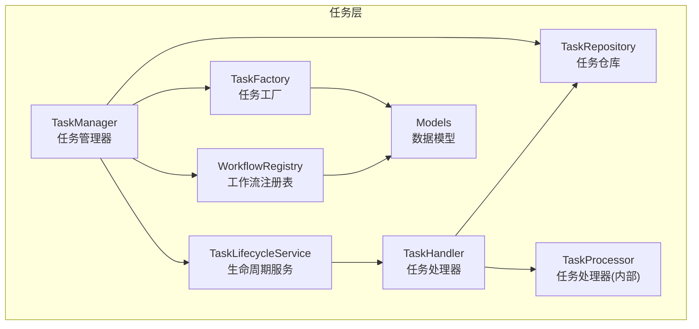
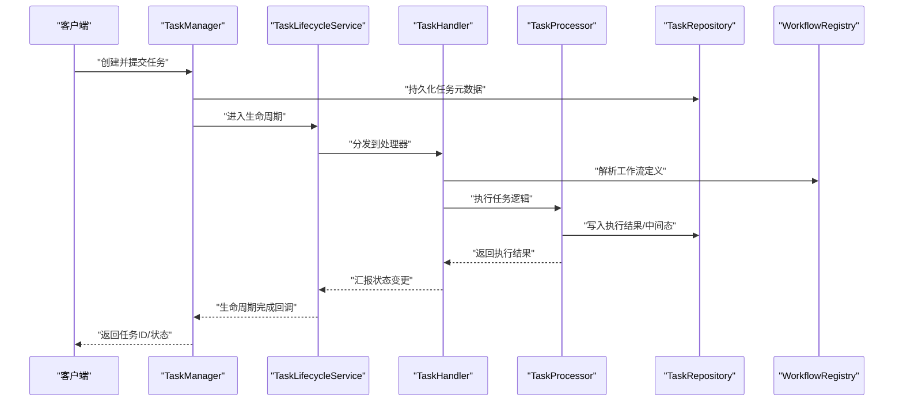
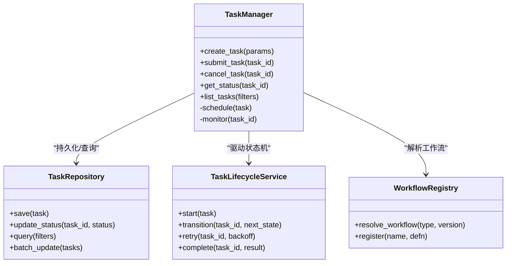
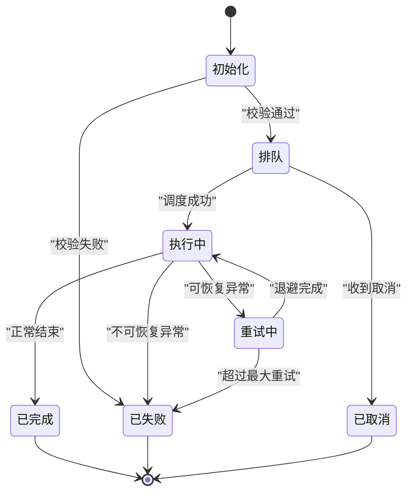
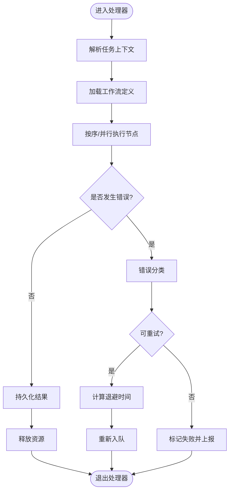
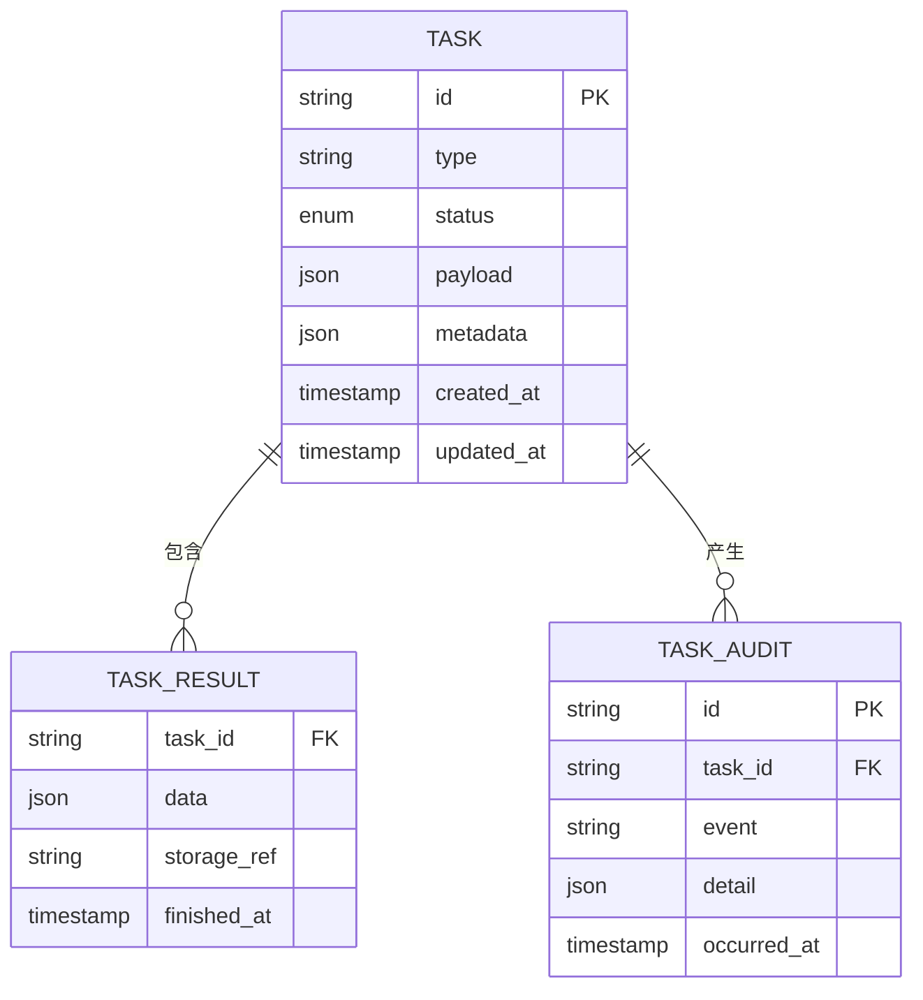
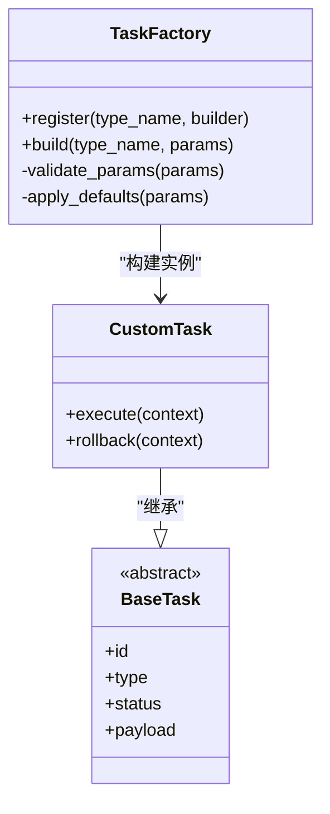
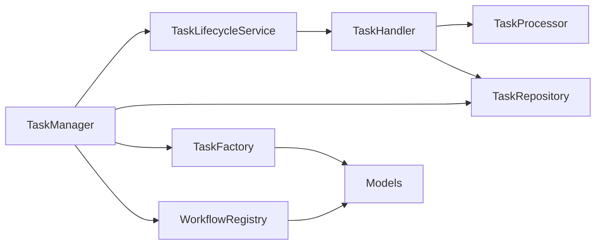

# 任务管理系统

<cite>
**本文引用的文件**   
- [task_manager.py](file://src/penshot/neopen/task/task_manager.py)
- [task_lifecycle_service.py](file://src/penshot/neopen/task/task_lifecycle_service.py)
- [task_handler.py](file://src/penshot/neopen/task/task_handler.py)
- [task_processor.py](file://src/penshot/neopen/task/task_processor.py)
- [task_repository.py](file://src/penshot/neopen/task/task_repository.py)
- [task_factory.py](file://src/penshot/neopen/task/task_factory.py)
- [task_models.py](file://src/penshot/neopen/task/task_models.py)
- [workflow_registry.py](file://src/penshot/neopen/task/workflow_registry.py)
- [function_calls.py](file://src/penshot/api/function_calls.py)
- [task_init.py](file://src/penshot/neopen/task/task_init.py)
- [test_task_manager_smoke.py](file://tests/test_task_manager_smoke.py)
- [test_task_lifecycle_service.py](file://tests/task/test_task_lifecycle_service.py)
- [test_task_factory.py](file://tests/task/test_task_factory.py)
</cite>

## 更新摘要
**所做更改**
- 统一了任务过期时间（TTL）配置，将DEFAULT_TASK_TTL_SECONDS常量标准化为30天（2592000秒）
- 在task_factory.py、function_calls.py和task_init.py中移除了硬编码的7天、20天和30天过期时间
- 确保所有任务入口点使用统一的过期策略，避免数据不一致问题
- 更新了任务仓库的TTL管理机制，支持可配置的过期时间

## 目录
1. [简介](#简介)
2. [项目结构](#项目结构)
3. [核心组件](#核心组件)
4. [架构总览](#架构总览)
5. [详细组件分析](#详细组件分析)
6. [依赖关系分析](#依赖关系分析)
7. [性能考虑](#性能考虑)
8. [故障排除指南](#故障排除指南)
9. [结论](#结论)
10. [附录](#附录)

## 简介
本文件面向任务管理系统的开发者与使用者，系统性阐述 TaskManager 的核心能力：任务的创建、调度、执行与监控；任务生命周期服务从初始化到完成的全流程管理；任务处理器的工作模式、并发控制与资源管理；任务仓库的持久化方案与查询接口；以及任务工厂的扩展方法与自定义任务类型实现指南。文末提供性能优化建议与常见问题排查方法，帮助读者在生产环境中稳定高效地运行系统。

**最新更新**：系统已统一任务过期时间配置，通过DEFAULT_TASK_TTL_SECONDS常量统一管理，确保所有任务入口点使用一致的30天过期策略。

## 项目结构
任务管理相关代码位于 src/penshot/neopen/task 目录下，围绕"模型-工厂-仓库-处理器-管理器-生命周期"分层组织，配合测试用例验证关键路径。

图表来源
- [task_manager.py](file://src/penshot/neopen/task/task_manager.py)
- [task_lifecycle_service.py](file://src/penshot/neopen/task/task_lifecycle_service.py)
- [task_handler.py](file://src/penshot/neopen/task/task_handler.py)
- [task_processor.py](file://src/penshot/neopen/task/task_processor.py)
- [task_repository.py](file://src/penshot/neopen/task/task_repository.py)
- [task_factory.py](file://src/penshot/neopen/task/task_factory.py)
- [workflow_registry.py](file://src/penshot/neopen/task/workflow_registry.py)
- [task_models.py](file://src/penshot/neopen/task/task_models.py)

章节来源
- [task_manager.py](file://src/penshot/neopen/task/task_manager.py)
- [task_lifecycle_service.py](file://src/penshot/neopen/task/task_lifecycle_service.py)
- [task_handler.py](file://src/penshot/neopen/task/task_handler.py)
- [task_processor.py](file://src/penshot/neopen/task/task_processor.py)
- [task_repository.py](file://src/penshot/neopen/task/task_repository.py)
- [task_factory.py](file://src/penshot/neopen/task/task_factory.py)
- [workflow_registry.py](file://src/penshot/neopen/task/workflow_registry.py)
- [task_models.py](file://src/penshot/neopen/task/task_models.py)

## 核心组件
- 任务管理器（TaskManager）
  - 职责：对外暴露任务创建、提交、取消、状态查询等统一入口；协调生命周期服务、任务仓库与工作流注册表；维护全局调度策略与监控指标。
  - 关键点：幂等创建、去重、优先级队列、批量操作、可观测性埋点。
- 任务生命周期服务（TaskLifecycleService）
  - 职责：驱动任务从初始化、排队、执行、重试、完成/失败到归档的完整生命周期；处理超时、补偿与回滚。
  - 关键点：状态机驱动、事件钩子、重试退避、事务边界。
- 任务处理器（TaskHandler / TaskProcessor）
  - 职责：解析任务上下文、加载工作流节点、执行具体业务逻辑、产出结果并落库。
  - 关键点：上下文隔离、资源申请与释放、错误分类与上报、限流与熔断。
- 任务仓库（TaskRepository）
  - 职责：任务元数据与结果的持久化、索引与查询；支持分页、过滤、聚合统计。
  - 关键点：读写分离、缓存策略、一致性保障、迁移兼容。
- 任务工厂（TaskFactory）
  - 职责：根据配置或输入动态构建任务实例；注册与发现自定义任务类型。
  - 关键点：插件式扩展、参数校验、默认策略注入。
- 工作流注册表（WorkflowRegistry）
  - 职责：管理工作流定义与版本、节点编排与路由。
  - 关键点：热更新、向后兼容、版本选择。

**更新**：任务工厂现在使用统一的DEFAULT_TASK_TTL_SECONDS常量（30天）作为默认任务过期时间，确保所有任务入口点的一致性。

章节来源
- [task_manager.py](file://src/penshot/neopen/task/task_manager.py)
- [task_lifecycle_service.py](file://src/penshot/neopen/task/task_lifecycle_service.py)
- [task_handler.py](file://src/penshot/neopen/task/task_handler.py)
- [task_processor.py](file://src/penshot/neopen/task/task_processor.py)
- [task_repository.py](file://src/penshot/neopen/task/task_repository.py)
- [task_factory.py](file://src/penshot/neopen/task/task_factory.py)
- [workflow_registry.py](file://src/penshot/neopen/task/workflow_registry.py)
- [task_models.py](file://src/penshot/neopen/task/task_models.py)

## 架构总览
下图展示了任务从创建到完成的端到端调用链与组件交互。

图表来源
- [task_manager.py](file://src/penshot/neopen/task/task_manager.py)
- [task_lifecycle_service.py](file://src/penshot/neopen/task/task_lifecycle_service.py)
- [task_handler.py](file://src/penshot/neopen/task/task_handler.py)
- [task_processor.py](file://src/penshot/neopen/task/task_processor.py)
- [task_repository.py](file://src/penshot/neopen/task/task_repository.py)
- [workflow_registry.py](file://src/penshot/neopen/task/workflow_registry.py)

## 详细组件分析

### 任务管理器（TaskManager）
- 功能要点
  - 任务创建：接收入参，生成唯一任务标识，填充默认策略，触发持久化。
  - 任务调度：将任务投递至调度器（如队列），设置优先级与超时策略。
  - 任务监控：暴露状态查询、统计指标、告警事件。
  - 容错与幂等：重复提交去重、失败重试、补偿机制。
- 设计模式
  - 门面模式：对上层屏蔽底层仓库、生命周期、工作流的复杂性。
  - 观察者模式：通过事件钩子记录审计日志与触发外部通知。
- 并发与资源
  - 基于线程池/进程池的任务派发；限制最大并发度，避免资源耗尽。
  - 使用令牌桶/漏桶进行速率限制，保护下游依赖。
- 典型调用序列
  - 创建任务 -> 持久化 -> 入队 -> 生命周期接管 -> 处理器执行 -> 结果落库 -> 回调通知。

图表来源
- [task_manager.py](file://src/penshot/neopen/task/task_manager.py)
- [task_repository.py](file://src/penshot/neopen/task/task_repository.py)
- [task_lifecycle_service.py](file://src/penshot/neopen/task/task_lifecycle_service.py)
- [workflow_registry.py](file://src/penshot/neopen/task/workflow_registry.py)

章节来源
- [task_manager.py](file://src/penshot/neopen/task/task_manager.py)
- [task_repository.py](file://src/penshot/neopen/task/task_repository.py)
- [task_lifecycle_service.py](file://src/penshot/neopen/task/task_lifecycle_service.py)
- [workflow_registry.py](file://src/penshot/neopen/task/workflow_registry.py)

### 任务生命周期服务（TaskLifecycleService）
- 生命周期阶段
  - 初始化：校验入参、分配资源、准备上下文。
  - 排队：按优先级与权重排序，等待处理器可用。
  - 执行：交由处理器执行，记录开始时间、CPU/内存占用等指标。
  - 重试：捕获可恢复异常，按退避策略重试。
  - 完成/失败：持久化最终状态与结果，清理资源，触发回调。
- 状态机与事件
  - 状态包括：待处理、执行中、重试中、已完成、已失败、已取消。
  - 事件包括：created、started、retried、completed、failed、cancelled。
- 超时与补偿
  - 任务级超时、节点级超时；长任务分片与断点续跑。
  - 失败补偿：幂等写、反向操作或人工介入。

图表来源
- [task_lifecycle_service.py](file://src/penshot/neopen/task/task_lifecycle_service.py)

章节来源
- [task_lifecycle_service.py](file://src/penshot/neopen/task/task_lifecycle_service.py)

### 任务处理器（TaskHandler / TaskProcessor）
- 工作模式
  - 单任务串行：保证同一任务内顺序执行，适合强一致场景。
  - 多任务并行：不同任务间并行，受全局并发上限约束。
  - 流水线模式：将复杂任务拆分为多个节点，按 DAG 执行。
- 并发控制
  - 全局/分组信号量控制并发度。
  - 背压与降级：当队列积压时拒绝新任务或走快速失败路径。
- 资源管理
  - 显式申请/释放：数据库连接、外部 API 配额、GPU/CPU 资源。
  - 上下文隔离：每个任务拥有独立上下文，避免共享状态污染。
- 错误处理
  - 区分可恢复/不可恢复错误；记录堆栈与上下文快照。
  - 自动重试与人工复核通道。

图表来源
- [task_handler.py](file://src/penshot/neopen/task/task_handler.py)
- [task_processor.py](file://src/penshot/neopen/task/task_processor.py)

章节来源
- [task_handler.py](file://src/penshot/neopen/task/task_handler.py)
- [task_processor.py](file://src/penshot/neopen/task/task_processor.py)

### 任务仓库（TaskRepository）
- 持久化方案
  - 结构化存储：任务元数据、状态、审计日志、结果摘要。
  - 大对象存储：二进制结果或附件采用对象存储，数据库仅存引用。
  - 索引设计：按任务类型、状态、时间范围、标签建立复合索引。
- 查询接口
  - 基础 CRUD：创建、更新、删除、读取。
  - 高级查询：分页、过滤、排序、聚合统计。
  - 事务与一致性：跨表更新使用事务；读多写少场景引入缓存。
- 性能优化
  - 批量写入、延迟落盘、异步刷盘。
  - 冷热数据分离与归档策略。

**更新**：任务仓库现在支持可配置的TTL过期时间，通过task_ttl_seconds参数控制Redis键的过期策略，默认值为86400秒（24小时）。

图表来源
- [task_repository.py](file://src/penshot/neopen/task/task_repository.py)
- [task_models.py](file://src/penshot/neopen/task/task_models.py)

章节来源
- [task_repository.py](file://src/penshot/neopen/task/task_repository.py)
- [task_models.py](file://src/penshot/neopen/task/task_models.py)

### 任务工厂（TaskFactory）
- 扩展方法
  - 注册自定义任务类型：通过工厂注册表绑定类型名与构造器。
  - 参数校验与默认值注入：在构建前进行合法性检查与缺省补全。
  - 策略注入：为不同类型任务注入不同的处理器或工作流。
- 自定义任务类型实现指南
  - 定义任务模型：继承基类，声明必要字段与校验规则。
  - 实现处理器：遵循处理器契约，确保幂等与资源释放。
  - 注册与发现：在启动期完成注册，支持热更新与版本选择。
  - 单元测试：覆盖正常路径、异常路径与边界条件。

**重大更新**：任务工厂现已统一使用DEFAULT_TASK_TTL_SECONDS常量（30天）作为默认任务过期时间，替代了之前分散在各处的硬编码值（7天、20天、30天）。这确保了所有任务入口点具有一致的过期行为。

图表来源
- [task_factory.py](file://src/penshot/neopen/task/task_factory.py)
- [task_models.py](file://src/penshot/neopen/task/task_models.py)

章节来源
- [task_factory.py](file://src/penshot/neopen/task/task_factory.py)
- [task_models.py](file://src/penshot/neopen/task/task_models.py)

### 工作流注册表（WorkflowRegistry）
- 职责
  - 管理工作流定义、版本与路由；支持按任务类型选择合适工作流。
  - 提供节点编排、依赖解析与执行计划生成。
- 特性
  - 向后兼容：新增字段不破坏旧版本。
  - 热更新：运行时刷新定义，无需重启。
  - 可观测：记录每次解析与选择的审计信息。

章节来源
- [workflow_registry.py](file://src/penshot/neopen/task/workflow_registry.py)

## 依赖关系分析
- 组件耦合
  - TaskManager 作为门面，依赖 Lifecycle、Repository、Factory、Registry，但通过接口抽象降低直接耦合。
  - TaskHandler 依赖 Processor 与 Registry，解耦业务逻辑与工作流编排。
  - Repository 与 Models 紧密协作，提供稳定的数据访问契约。
- 外部依赖
  - 消息队列/调度器：用于任务入队与出队。
  - 存储后端：关系型数据库与对象存储。
  - 监控与日志：指标采集、链路追踪、结构化日志。
- 潜在循环依赖
  - 通过事件总线或接口回调打破循环；确保单向依赖流向基础设施层。

**更新**：函数调用接口（function_calls.py）和任务初始化（task_init.py）现在都使用统一的DEFAULT_TASK_TTL_SECONDS常量，消除了之前存在的过期时间不一致问题。

图表来源
- [task_manager.py](file://src/penshot/neopen/task/task_manager.py)
- [task_lifecycle_service.py](file://src/penshot/neopen/task/task_lifecycle_service.py)
- [task_handler.py](file://src/penshot/neopen/task/task_handler.py)
- [task_processor.py](file://src/penshot/neopen/task/task_processor.py)
- [task_repository.py](file://src/penshot/neopen/task/task_repository.py)
- [task_factory.py](file://src/penshot/neopen/task/task_factory.py)
- [workflow_registry.py](file://src/penshot/neopen/task/workflow_registry.py)
- [task_models.py](file://src/penshot/neopen/task/task_models.py)

章节来源
- [task_manager.py](file://src/penshot/neopen/task/task_manager.py)
- [task_lifecycle_service.py](file://src/penshot/neopen/task/task_lifecycle_service.py)
- [task_handler.py](file://src/penshot/neopen/task/task_handler.py)
- [task_processor.py](file://src/penshot/neopen/task/task_processor.py)
- [task_repository.py](file://src/penshot/neopen/task/task_repository.py)
- [task_factory.py](file://src/penshot/neopen/task/task_factory.py)
- [workflow_registry.py](file://src/penshot/neopen/task/workflow_registry.py)
- [task_models.py](file://src/penshot/neopen/task/task_models.py)

## 性能考虑
- 并发与吞吐
  - 合理设置全局并发上限与分组并发，避免热点任务抢占资源。
  - 使用无锁队列与批量拉取减少上下文切换开销。
- I/O 与存储
  - 结果大对象走对象存储，数据库仅存引用；批量写入与异步落盘。
  - 热点查询加缓存，注意失效策略与一致性权衡。
- 重试与退避
  - 指数退避+抖动，避免雪崩；设置最大重试次数与死信队列。
- 可观测性
  - 埋点关键指标：创建耗时、执行时长、失败率、队列长度、P95/P99。
  - 分布式链路追踪，定位慢节点与瓶颈。
- 容量规划
  - 压测评估峰值 QPS 与内存/CPU 水位；预留扩容空间。
  - 冷热数据分离与归档策略。

**更新**：统一的TTL配置有助于更好地进行容量规划，30天的默认过期时间平衡了数据存储成本与任务恢复需求。

## 故障排除指南
- 常见问题
  - 任务堆积：检查消费者数量、处理器耗时、下游依赖可用性。
  - 频繁重试：定位可恢复错误根因，调整退避策略与阈值。
  - 结果不一致：确认幂等性与事务边界，核对写入顺序。
  - 资源泄漏：确保处理器在异常分支也释放资源。
- 诊断步骤
  - 查看任务审计日志与状态变迁，定位失败阶段。
  - 检查队列深度与消费者健康状态。
  - 抓取慢请求与热点任务，分析 CPU/IO 瓶颈。
  - 复现最小用例，逐步缩小问题范围。
- 恢复策略
  - 临时扩容消费者或提升并发上限。
  - 启用降级路径或快速失败，优先保障核心任务。
  - 人工介入：对死信任务进行补偿或重放。

**更新**：如果发现任务过早过期导致的数据丢失问题，可以检查DEFAULT_TASK_TTL_SECONDS常量的配置，当前设置为30天（2592000秒）。

章节来源
- [test_task_manager_smoke.py](file://tests/test_task_manager_smoke.py)
- [test_task_lifecycle_service.py](file://tests/task/test_task_lifecycle_service.py)
- [test_task_factory.py](file://tests/task/test_task_factory.py)

## 结论
任务管理系统以 TaskManager 为核心，结合生命周期服务、处理器、仓库与工厂，形成高内聚、低耦合的可扩展架构。通过明确的状态机、完善的错误处理与可观测性，系统在稳定性与可维护性上具备良好基础。生产环境应重点关注并发控制、I/O 优化与容量规划，并结合监控告警持续改进。

**最新更新**：通过统一DEFAULT_TASK_TTL_SECONDS常量，系统现在在所有任务入口点提供一致的30天任务过期策略，消除了之前由于硬编码值不一致可能导致的数据管理问题。

## 附录
- 术语
  - 任务：一次可执行的原子工作单元，包含输入、策略与期望输出。
  - 工作流：由多个节点组成的有向无环图，描述任务执行编排。
  - 处理器：负责解析上下文、执行节点、产出结果的业务组件。
  - 仓库：提供任务数据持久化与查询能力的组件。
  - 工厂：负责按类型构建任务实例的组件。
- 最佳实践
  - 保持处理器幂等，避免副作用。
  - 为所有外部依赖设置超时与熔断。
  - 使用结构化日志与标准化指标。
  - 对关键路径编写端到端测试与回归用例。

**更新**：建议使用DEFAULT_TASK_TTL_SECONDS常量而非硬编码过期时间，以确保系统的一致性和可维护性。