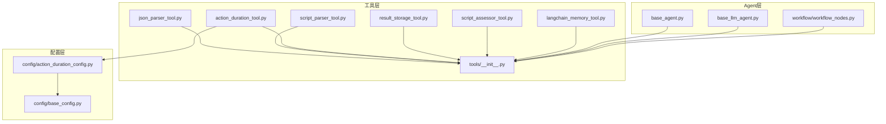
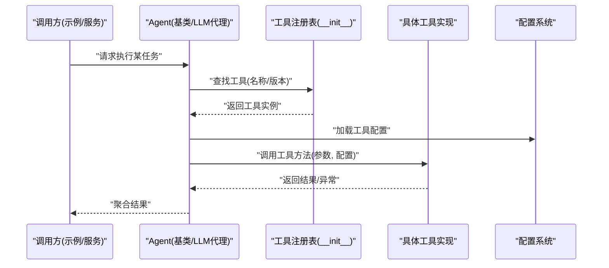
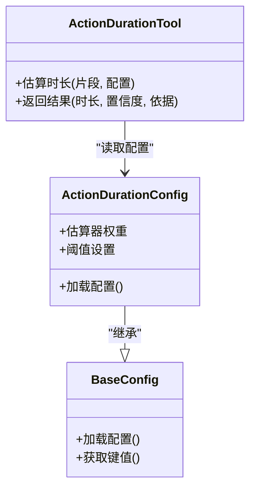
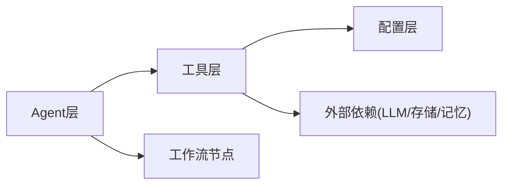

# 工具库

<cite>
**本文引用的文件**   
- [src/penshot/neopen/tools/__init__.py](file://src/penshot/neopen/tools/__init__.py)
- [src/penshot/neopen/tools/json_parser_tool.py](file://src/penshot/neopen/tools/json_parser_tool.py)
- [src/penshot/neopen/tools/script_parser_tool.py](file://src/penshot/neopen/tools/script_parser_tool.py)
- [src/penshot/neopen/tools/action_duration_tool.py](file://src/penshot/neopen/tools/action_duration_tool.py)
- [src/penshot/neopen/tools/result_storage_tool.py](file://src/penshot/neopen/tools/result_storage_tool.py)
- [src/penshot/neopen/tools/script_assessor_tool.py](file://src/penshot/neopen/tools/script_assessor_tool.py)
- [src/penshot/neopen/tools/langchain_memory_tool.py](file://src/penshot/neopen/tools/langchain_memory_tool.py)
- [src/penshot/neopen/agent/base_agent.py](file://src/penshot/neopen/agent/base_agent.py)
- [src/penshot/neopen/agent/base_llm_agent.py](file://src/penshot/neopen/agent/base_llm_agent.py)
- [src/penshot/neopen/agent/workflow/workflow_nodes.py](file://src/penshot/neopen/agent/workflow/workflow_nodes.py)
- [src/penshot/neopen/config/action_duration_config.py](file://src/penshot/neopen/config/action_duration_config.py)
- [src/penshot/neopen/config/base_config.py](file://src/penshot/neopen/config/base_config.py)
- [examples/direct_usage.py](file://examples/direct_usage.py)
- [examples/a2a_integration.py](file://examples/a2a_integration.py)
- [tests/planner/test_action_duration.py](file://tests/planner/test_action_duration.py)
</cite>

## 目录
1. [简介](#简介)
2. [项目结构](#项目结构)
3. [核心组件](#核心组件)
4. [架构总览](#架构总览)
5. [详细组件分析](#详细组件分析)
6. [依赖分析](#依赖分析)
7. [性能考虑](#性能考虑)
8. [故障排查指南](#故障排查指南)
9. [结论](#结论)
10. [附录](#附录)

## 简介
本文件面向“视频分镜Agent”的工具库，系统性介绍以下专用工具：JSON解析工具、脚本解析工具、动作时长估算工具、结果存储工具等。文档覆盖每个工具的API接口、参数配置与返回值格式；说明工具与Agent的集成方式与调用机制；提供自定义工具开发指南（注册、权限控制、版本管理）；并给出性能基准测试要点与优化建议，以及实际使用场景的代码示例路径。

## 项目结构
工具库位于 src/penshot/neopen/tools 目录下，采用按功能划分的模块化组织方式。每个工具以独立文件实现，并通过统一的初始化入口暴露能力。Agent侧通过基类或工作流节点进行统一编排与调用。

图表来源
- [src/penshot/neopen/tools/__init__.py](file://src/penshot/neopen/tools/__init__.py)
- [src/penshot/neopen/tools/json_parser_tool.py](file://src/penshot/neopen/tools/json_parser_tool.py)
- [src/penshot/neopen/tools/script_parser_tool.py](file://src/penshot/neopen/tools/script_parser_tool.py)
- [src/penshot/neopen/tools/action_duration_tool.py](file://src/penshot/neopen/tools/action_duration_tool.py)
- [src/penshot/neopen/tools/result_storage_tool.py](file://src/penshot/neopen/tools/result_storage_tool.py)
- [src/penshot/neopen/tools/script_assessor_tool.py](file://src/penshot/neopen/tools/script_assessor_tool.py)
- [src/penshot/neopen/tools/langchain_memory_tool.py](file://src/penshot/neopen/tools/langchain_memory_tool.py)
- [src/penshot/neopen/agent/base_agent.py](file://src/penshot/neopen/agent/base_agent.py)
- [src/penshot/neopen/agent/base_llm_agent.py](file://src/penshot/neopen/agent/base_llm_agent.py)
- [src/penshot/neopen/agent/workflow/workflow_nodes.py](file://src/penshot/neopen/agent/workflow/workflow_nodes.py)
- [src/penshot/neopen/config/action_duration_config.py](file://src/penshot/neopen/config/action_duration_config.py)
- [src/penshot/neopen/config/base_config.py](file://src/penshot/neopen/config/base_config.py)

章节来源
- [src/penshot/neopen/tools/__init__.py](file://src/penshot/neopen/tools/__init__.py)
- [src/penshot/neopen/agent/base_agent.py](file://src/penshot/neopen/agent/base_agent.py)
- [src/penshot/neopen/agent/base_llm_agent.py](file://src/penshot/neopen/agent/base_llm_agent.py)
- [src/penshot/neopen/agent/workflow/workflow_nodes.py](file://src/penshot/neopen/agent/workflow/workflow_nodes.py)
- [src/penshot/neopen/config/action_duration_config.py](file://src/penshot/neopen/config/action_duration_config.py)
- [src/penshot/neopen/config/base_config.py](file://src/penshot/neopen/config/base_config.py)

## 核心组件
本节概述各工具的职责、典型输入输出与在Agent中的角色定位。

- JSON解析工具
  - 职责：对LLM或其他来源返回的文本进行健壮解析，提取结构化数据。
  - 典型输入：原始文本、可选的解析策略或模式提示。
  - 典型输出：标准化字典/对象，包含字段校验结果与错误信息。
  - Agent集成：作为通用后处理工具，供Prompt转换器、质量审计器等消费。

- 脚本解析工具
  - 职责：将自然语言脚本或半结构化内容解析为分镜所需的中间表示。
  - 典型输入：脚本文本、解析器类型（规则/LLM）、配置项。
  - 典型输出：标准化脚本模型，包含场景、对话、动作等元素。
  - Agent集成：由脚本解析Agent或工作流节点调用，驱动后续分割与时长估算。

- 动作时长估算工具
  - 职责：基于对话、场景、动作等要素估算镜头时长，支持多种估算器组合。
  - 典型输入：脚本片段、估算器配置、上下文信息。
  - 典型输出：时长估计结果（秒），含置信度与依据摘要。
  - Agent集成：被分镜分割Agent或时间规划模块调用，用于生成可执行的分镜计划。

- 结果存储工具
  - 职责：持久化任务结果、中间状态与元数据，支持多后端（本地/远程）。
  - 典型输入：键值对、序列化数据、元数据标签。
  - 典型输出：存储操作结果（成功/失败）、资源标识符。
  - Agent集成：工作流检查点、记忆系统与任务管理器协作，保障可恢复性。

- 脚本评估工具
  - 职责：对脚本质量进行多维度评估（可读性、完整性、可分镜性等）。
  - 典型输入：脚本文本、评估维度、阈值配置。
  - 典型输出：评分与诊断报告，辅助人工决策或自动修复。
  - Agent集成：质量审计Agent或人类干预流程中触发。

- LangChain记忆工具
  - 职责：封装LangChain记忆接口，提供短期/长期记忆读写。
  - 典型输入：会话ID、消息或结构化上下文。
  - 典型输出：历史上下文摘要或检索结果。
  - Agent集成：在多轮对话或长脚本处理中维持上下文一致性。

章节来源
- [src/penshot/neopen/tools/json_parser_tool.py](file://src/penshot/neopen/tools/json_parser_tool.py)
- [src/penshot/neopen/tools/script_parser_tool.py](file://src/penshot/neopen/tools/script_parser_tool.py)
- [src/penshot/neopen/tools/action_duration_tool.py](file://src/penshot/neopen/tools/action_duration_tool.py)
- [src/penshot/neopen/tools/result_storage_tool.py](file://src/penshot/neopen/tools/result_storage_tool.py)
- [src/penshot/neopen/tools/script_assessor_tool.py](file://src/penshot/neopen/tools/script_assessor_tool.py)
- [src/penshot/neopen/tools/langchain_memory_tool.py](file://src/penshot/neopen/tools/langchain_memory_tool.py)

## 架构总览
工具库通过统一入口暴露能力，Agent侧通过基类与工作流节点进行编排。配置系统为工具提供运行时参数，确保可扩展与可替换。

图表来源
- [src/penshot/neopen/tools/__init__.py](file://src/penshot/neopen/tools/__init__.py)
- [src/penshot/neopen/agent/base_agent.py](file://src/penshot/neopen/agent/base_agent.py)
- [src/penshot/neopen/agent/base_llm_agent.py](file://src/penshot/neopen/agent/base_llm_agent.py)
- [src/penshot/neopen/config/base_config.py](file://src/penshot/neopen/config/base_config.py)

## 详细组件分析

### JSON解析工具
- 目标：从非结构化文本中提取稳定结构的JSON/字典，增强容错与二次修正。
- 关键能力
  - 多策略解析：正则抽取、LLM辅助修复、模式校验。
  - 字段映射：将不同来源的字段名归一化为标准键。
  - 错误诊断：返回缺失字段、类型不匹配与修复建议。
- API约定（概念）
  - 输入：文本、可选的模式定义、严格模式开关。
  - 输出：解析结果对象、错误列表、修复标记。
- 与Agent集成
  - Prompt转换器与质量审计器常用此工具进行输出规范化。
- 参考路径
  - [src/penshot/neopen/tools/json_parser_tool.py](file://src/penshot/neopen/tools/json_parser_tool.py)

章节来源
- [src/penshot/neopen/tools/json_parser_tool.py](file://src/penshot/neopen/tools/json_parser_tool.py)

### 脚本解析工具
- 目标：将自然语言脚本解析为分镜可用的结构化表示。
- 关键能力
  - 解析器工厂：支持规则与LLM两种实现，可按配置切换。
  - 元素识别：场景、对话、动作、转场等。
  - 校验与补全：缺失元素检测与默认填充。
- API约定（概念）
  - 输入：脚本文本、解析器类型、配置项。
  - 输出：标准化脚本模型（含元素列表与元数据）。
- 与Agent集成
  - 脚本解析Agent直接调用；工作流节点可在流水线中复用。
- 参考路径
  - [src/penshot/neopen/tools/script_parser_tool.py](file://src/penshot/neopen/tools/script_parser_tool.py)

章节来源
- [src/penshot/neopen/tools/script_parser_tool.py](file://src/penshot/neopen/tools/script_parser_tool.py)

### 动作时长估算工具
- 目标：根据对话、场景、动作等要素估算镜头时长，支持混合估算器。
- 关键能力
  - 估算器组合：对话估算、场景估算、动作估算及混合策略。
  - 配置驱动：通过配置文件选择估算器权重与阈值。
  - 可解释性：返回估算依据与置信度。
- API约定（概念）
  - 输入：脚本片段、估算器配置、上下文。
  - 输出：时长估计（秒）、置信度、依据摘要。
- 配置要点
  - 动作时长配置继承自基础配置，便于环境差异化。
- 参考路径
  - [src/penshot/neopen/tools/action_duration_tool.py](file://src/penshot/neopen/tools/action_duration_tool.py)
  - [src/penshot/neopen/config/action_duration_config.py](file://src/penshot/neopen/config/action_duration_config.py)
  - [src/penshot/neopen/config/base_config.py](file://src/penshot/neopen/config/base_config.py)

图表来源
- [src/penshot/neopen/config/base_config.py](file://src/penshot/neopen/config/base_config.py)
- [src/penshot/neopen/config/action_duration_config.py](file://src/penshot/neopen/config/action_duration_config.py)
- [src/penshot/neopen/tools/action_duration_tool.py](file://src/penshot/neopen/tools/action_duration_tool.py)

章节来源
- [src/penshot/neopen/tools/action_duration_tool.py](file://src/penshot/neopen/tools/action_duration_tool.py)
- [src/penshot/neopen/config/action_duration_config.py](file://src/penshot/neopen/config/action_duration_config.py)
- [src/penshot/neopen/config/base_config.py](file://src/penshot/neopen/config/base_config.py)

### 结果存储工具
- 目标：将任务结果与中间状态持久化，支持键值存取与元数据标注。
- 关键能力
  - 多后端适配：本地文件系统、远程存储抽象。
  - 事务性写入：保证原子性与一致性。
  - 查询与过滤：按标签、时间范围检索。
- API约定（概念）
  - 输入：键、数据、元数据。
  - 输出：操作结果、资源标识符。
- 与Agent集成
  - 工作流检查点、记忆系统与任务管理器协作，提升可恢复性。
- 参考路径
  - [src/penshot/neopen/tools/result_storage_tool.py](file://src/penshot/neopen/tools/result_storage_tool.py)

章节来源
- [src/penshot/neopen/tools/result_storage_tool.py](file://src/penshot/neopen/tools/result_storage_tool.py)

### 脚本评估工具
- 目标：对脚本进行质量评估，输出评分与诊断报告。
- 关键能力
  - 多维指标：可读性、完整性、可分镜性、风险点。
  - 阈值与策略：可配置评估阈值与告警级别。
- API约定（概念）
  - 输入：脚本文本、评估维度、阈值。
  - 输出：评分、诊断与建议。
- 参考路径
  - [src/penshot/neopen/tools/script_assessor_tool.py](file://src/penshot/neopen/tools/script_assessor_tool.py)

章节来源
- [src/penshot/neopen/tools/script_assessor_tool.py](file://src/penshot/neopen/tools/script_assessor_tool.py)

### LangChain记忆工具
- 目标：封装LangChain记忆接口，提供会话级上下文管理。
- 关键能力
  - 短期/长期记忆：消息缓存与摘要索引。
  - 检索增强：按语义检索相关上下文。
- API约定（概念）
  - 输入：会话ID、消息或结构化上下文。
  - 输出：历史摘要或检索结果。
- 参考路径
  - [src/penshot/neopen/tools/langchain_memory_tool.py](file://src/penshot/neopen/tools/langchain_memory_tool.py)

章节来源
- [src/penshot/neopen/tools/langchain_memory_tool.py](file://src/penshot/neopen/tools/langchain_memory_tool.py)

### 工具与Agent集成方式
- 统一入口：工具通过 __init__ 暴露注册表，Agent侧按需查找与实例化。
- 工作流节点：工作流节点可直接调用工具，形成可编排的流水线。
- 配置注入：工具在构造时加载配置，支持运行时切换策略。
- 参考路径
  - [src/penshot/neopen/tools/__init__.py](file://src/penshot/neopen/tools/__init__.py)
  - [src/penshot/neopen/agent/base_agent.py](file://src/penshot/neopen/agent/base_agent.py)
  - [src/penshot/neopen/agent/base_llm_agent.py](file://src/penshot/neopen/agent/base_llm_agent.py)
  - [src/penshot/neopen/agent/workflow/workflow_nodes.py](file://src/penshot/neopen/agent/workflow/workflow_nodes.py)

章节来源
- [src/penshot/neopen/tools/__init__.py](file://src/penshot/neopen/tools/__init__.py)
- [src/penshot/neopen/agent/base_agent.py](file://src/penshot/neopen/agent/base_agent.py)
- [src/penshot/neopen/agent/base_llm_agent.py](file://src/penshot/neopen/agent/base_llm_agent.py)
- [src/penshot/neopen/agent/workflow/workflow_nodes.py](file://src/penshot/neopen/agent/workflow/workflow_nodes.py)

## 依赖分析
- 内部依赖
  - 工具层依赖配置层（如动作时长估算工具依赖动作时长配置）。
  - Agent层依赖工具注册表与工作流节点。
- 外部依赖
  - LLM客户端、LangChain记忆、存储后端等通过抽象接口接入。
- 潜在耦合点
  - 工具注册表的命名与版本策略需保持稳定，避免破坏性变更。
  - 配置键名与默认值变更应遵循向后兼容原则。

图表来源
- [src/penshot/neopen/tools/__init__.py](file://src/penshot/neopen/tools/__init__.py)
- [src/penshot/neopen/config/base_config.py](file://src/penshot/neopen/config/base_config.py)
- [src/penshot/neopen/agent/workflow/workflow_nodes.py](file://src/penshot/neopen/agent/workflow/workflow_nodes.py)

章节来源
- [src/penshot/neopen/tools/__init__.py](file://src/penshot/neopen/tools/__init__.py)
- [src/penshot/neopen/config/base_config.py](file://src/penshot/neopen/config/base_config.py)
- [src/penshot/neopen/agent/workflow/workflow_nodes.py](file://src/penshot/neopen/agent/workflow/workflow_nodes.py)

## 性能考虑
- 估算器组合
  - 合理设置估算器权重与阈值，避免不必要的复杂计算。
  - 对高频路径启用缓存与预取，减少重复计算。
- I/O与序列化
  - 批量写入结果存储，降低频繁I/O开销。
  - 使用高效序列化格式，减少网络传输与磁盘占用。
- 并发与限流
  - 对LLM调用进行并发控制与重试退避，避免雪崩。
- 监控与度量
  - 记录关键耗时与错误率，建立性能基线。
- 参考路径
  - [tests/planner/test_action_duration.py](file://tests/planner/test_action_duration.py)

[本节为通用性能指导，无需特定文件分析]

## 故障排查指南
- JSON解析失败
  - 检查输入文本是否包含有效结构；查看错误列表与修复建议。
  - 调整严格模式与模式定义，提高容错性。
- 脚本解析异常
  - 确认解析器类型与配置一致；检查元素识别阈值。
- 时长估算偏差
  - 核对估算器权重与阈值；查看依据摘要定位问题。
- 结果存储失败
  - 验证后端连接与权限；检查键冲突与元数据合法性。
- 参考路径
  - [src/penshot/neopen/tools/json_parser_tool.py](file://src/penshot/neopen/tools/json_parser_tool.py)
  - [src/penshot/neopen/tools/script_parser_tool.py](file://src/penshot/neopen/tools/script_parser_tool.py)
  - [src/penshot/neopen/tools/action_duration_tool.py](file://src/penshot/neopen/tools/action_duration_tool.py)
  - [src/penshot/neopen/tools/result_storage_tool.py](file://src/penshot/neopen/tools/result_storage_tool.py)

章节来源
- [src/penshot/neopen/tools/json_parser_tool.py](file://src/penshot/neopen/tools/json_parser_tool.py)
- [src/penshot/neopen/tools/script_parser_tool.py](file://src/penshot/neopen/tools/script_parser_tool.py)
- [src/penshot/neopen/tools/action_duration_tool.py](file://src/penshot/neopen/tools/action_duration_tool.py)
- [src/penshot/neopen/tools/result_storage_tool.py](file://src/penshot/neopen/tools/result_storage_tool.py)

## 结论
工具库以模块化与配置驱动为核心，提供了JSON解析、脚本解析、动作时长估算、结果存储、脚本评估与记忆管理等关键能力。通过统一注册表与工作流节点，Agent可灵活编排与扩展。建议在工程中持续完善性能基线与错误诊断，确保稳定性与可维护性。

[本节为总结性内容，无需特定文件分析]

## 附录

### 自定义工具开发指南
- 工具注册
  - 在工具初始化入口中新增工具类与别名，确保唯一命名与版本标识。
  - 提供清晰的描述与参数契约，便于Agent发现与调用。
- 权限控制
  - 在工具注册表中加入访问控制策略（白名单/角色/环境）。
  - 对敏感操作增加审批或审计日志。
- 版本管理
  - 工具接口变更需遵循向后兼容；引入版本字段并在注册表中声明。
  - 提供迁移脚本与降级策略，确保平滑升级。
- 参考路径
  - [src/penshot/neopen/tools/__init__.py](file://src/penshot/neopen/tools/__init__.py)

章节来源
- [src/penshot/neopen/tools/__init__.py](file://src/penshot/neopen/tools/__init__.py)

### 实际使用场景示例
- 直接调用示例
  - 参考路径：[examples/direct_usage.py](file://examples/direct_usage.py)
- Agent集成示例
  - 参考路径：[examples/a2a_integration.py](file://examples/a2a_integration.py)

章节来源
- [examples/direct_usage.py](file://examples/direct_usage.py)
- [examples/a2a_integration.py](file://examples/a2a_integration.py)