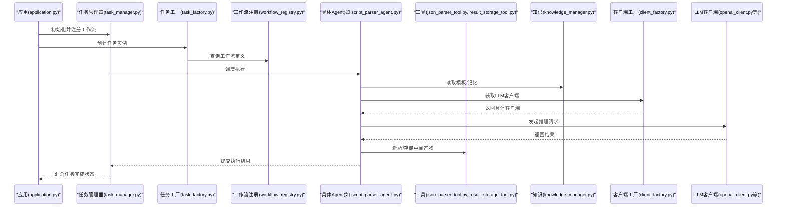
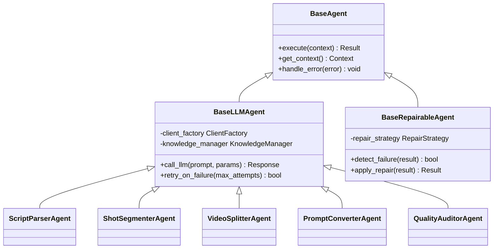
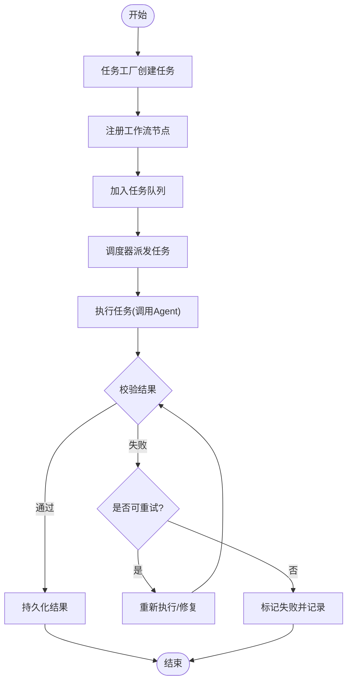
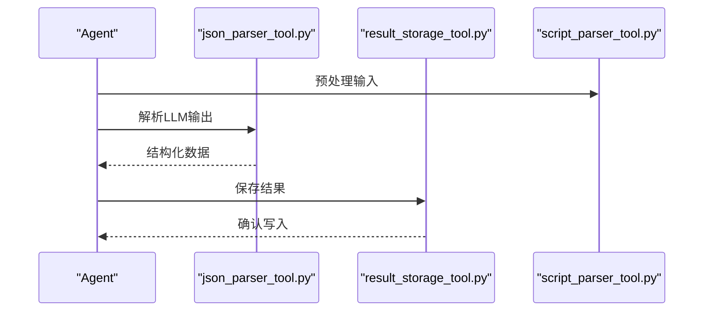
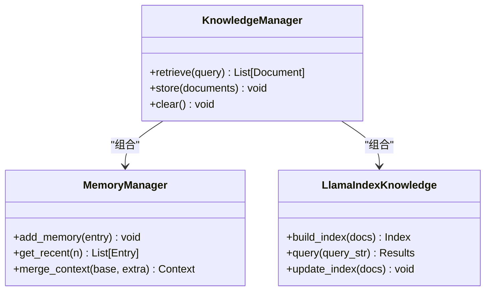
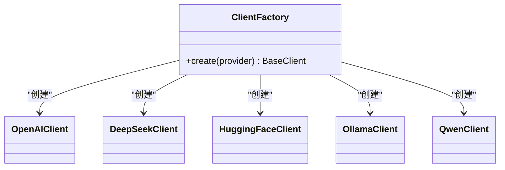
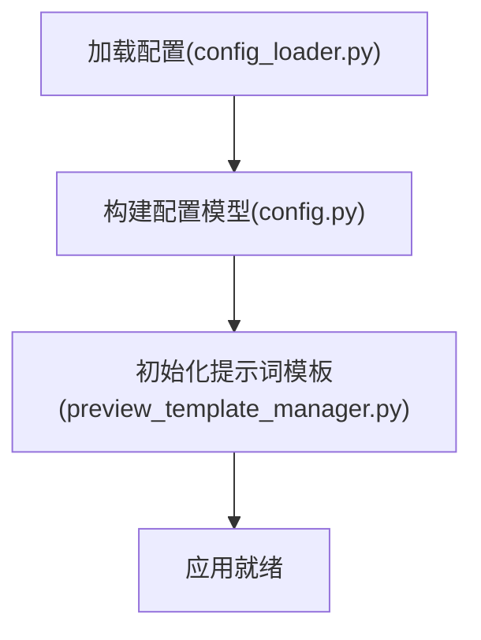
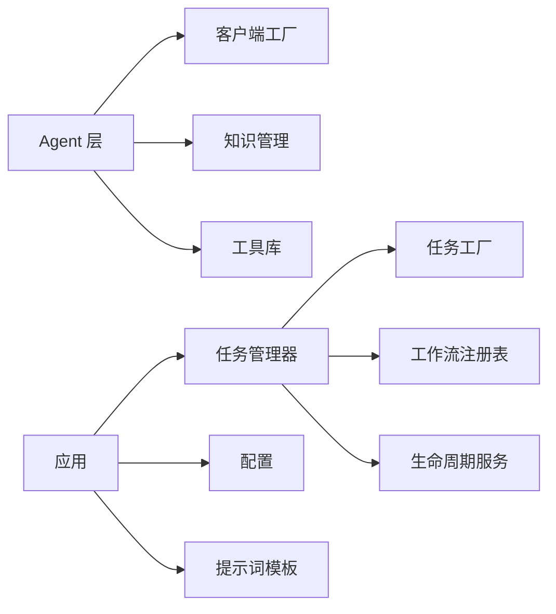

# 核心组件

<cite>
**本文引用的文件**   
- [src/penshot/neopen/agent/base_agent.py](file://src/penshot/neopen/agent/base_agent.py)
- [src/penshot/neopen/agent/base_llm_agent.py](file://src/penshot/neopen/agent/base_llm_agent.py)
- [src/penshot/neopen/agent/base_repairable_agent.py](file://src/penshot/neopen/agent/base_repairable_agent.py)
- [src/penshot/neopen/agent/script_parser_agent.py](file://src/penshot/neopen/agent/script_parser_agent.py)
- [src/penshot/neopen/agent/shot_segmenter_agent.py](file://src/penshot/neopen/agent/shot_segmenter_agent.py)
- [src/penshot/neopen/agent/video_splitter_agent.py](file://src/penshot/neopen/agent/video_splitter_agent.py)
- [src/penshot/neopen/agent/prompt_converter_agent.py](file://src/penshot/neopen/agent/prompt_converter_agent.py)
- [src/penshot/neopen/agent/quality_auditor_agent.py](file://src/penshot/neopen/agent/quality_auditor_agent.py)
- [src/penshot/neopen/task/task_manager.py](file://src/penshot/neopen/task/task_manager.py)
- [src/penshot/neopen/task/task_factory.py](file://src/penshot/neopen/task/task_factory.py)
- [src/penshot/neopen/task/task_processor.py](file://src/penshot/neopen/task/task_processor.py)
- [src/penshot/neopen/task/workflow_registry.py](file://src/penshot/neopen/task/workflow_registry.py)
- [src/penshot/neopen/task/task_lifecycle_service.py](file://src/penshot/neopen/task/task_lifecycle_service.py)
- [src/penshot/neopen/tools/json_parser_tool.py](file://src/penshot/neopen/tools/json_parser_tool.py)
- [src/penshot/neopen/tools/result_storage_tool.py](file://src/penshot/neopen/tools/result_storage_tool.py)
- [src/penshot/neopen/tools/script_parser_tool.py](file://src/penshot/neopen/tools/script_parser_tool.py)
- [src/penshot/neopen/knowledge/knowledge_manager.py](file://src/penshot/neopen/knowledge/knowledge_manager.py)
- [src/penshot/neopen/knowledge/memory/memory_manager.py](file://src/penshot/neopen/knowledge/memory/memory_manager.py)
- [src/penshot/neopen/knowledge/llamaIndex/llama_index_knowledge.py](file://src/penshot/neopen/knowledge/llamaIndex/llama_index_knowledge.py)
- [src/penshot/neopen/client/client_factory.py](file://src/penshot/neopen/client/client_factory.py)
- [src/penshot/neopen/client/openai_client.py](file://src/penshot/neopen/client/openai_client.py)
- [src/penshot/neopen/client/deepseek_client.py](file://src/penshot/neopen/client/deepseek_client.py)
- [src/penshot/neopen/client/huggingface_client.py](file://src/penshot/neopen/client/huggingface_client.py)
- [src/penshot/neopen/client/ollama_client.py](file://src/penshot/neopen/client/ollama_client.py)
- [src/penshot/neopen/client/qwen_client.py](file://src/penshot/neopen/client/qwen_client.py)
- [src/penshot/neopen/config/config.py](file://src/penshot/neopen/config/config.py)
- [src/penshot/neopen/config/config_loader.py](file://src/penshot/neopen/config/config_loader.py)
- [src/penshot/neopen/prompts/prompt_template_manager.py](file://src/penshot/neopen/prompts/prompt_template_manager.py)
- [src/penshot/neopen/app/application.py](file://src/penshot/neopen/app/application.py)
- [examples/direct_usage.py](file://examples/direct_usage.py)
</cite>

## 目录
1. [简介](#简介)
2. [项目结构](#项目结构)
3. [核心组件](#核心组件)
4. [架构总览](#架构总览)
5. [详细组件分析](#详细组件分析)
6. [依赖关系分析](#依赖关系分析)
7. [性能考虑](#性能考虑)
8. [故障排查指南](#故障排查指南)
9. [结论](#结论)
10. [附录](#附录)

## 简介
本文件聚焦于 Video Shot Agent 的核心组件，围绕 Agent 基类设计、任务管理、工具库与知识管理等关键模块进行深入解析。文档将说明各组件的职责边界、依赖关系与通信机制，并提供使用示例、扩展方式、最佳实践、性能优化建议与常见问题解决方案，帮助读者快速上手并高效定制。

## 项目结构
Video Shot Agent 采用分层与模块化组织：
- 应用层：应用启动、配置加载、提示词模板管理
- Agent 层：通用 Agent 基类与各领域 Agent（脚本解析、分镜分割、视频切分、提示词转换、质量审计）
- 任务层：任务工厂、任务管理器、工作流注册表、生命周期服务
- 工具层：JSON 解析、结果存储、脚本解析等工具
- 知识层：记忆管理、向量知识库（LlamaIndex）、模板知识
- 客户端层：多 LLM 客户端抽象与实现（OpenAI、DeepSeek、HuggingFace、Ollama、Qwen）
- 配置层：配置模型、加载器与环境配置

```mermaid
graph TB
subgraph "应用层"
APP["application.py"]
CFG["config.py / config_loader.py"]
PROMPT["prompt_template_manager.py"]
end
subgraph "Agent 层"
BASE_AGENT["base_agent.py"]
BASE_LLM["base_llm_agent.py"]
REPAIRABLE["base_repairable_agent.py"]
SCRIPT_AGENT["script_parser_agent.py"]
SHOT_AGENT["shot_segmenter_agent.py"]
SPLIT_AGENT["video_splitter_agent.py"]
PROMPT_CONV["prompt_converter_agent.py"]
QA_AGENT["quality_auditor_agent.py"]
end
subgraph "任务层"
TASK_MGR["task_manager.py"]
TASK_FACTORY["task_factory.py"]
WORKFLOW_REG["workflow_registry.py"]
LIFE_SVC["task_lifecycle_service.py"]
end
subgraph "工具层"
JSON_TOOL["json_parser_tool.py"]
RESULT_TOOL["result_storage_tool.py"]
SCRIPT_TOOL["script_parser_tool.py"]
end
subgraph "知识层"
KNOW_MGR["knowledge_manager.py"]
MEM_MGR["memory/memory_manager.py"]
LLAMA_K["llamaIndex/llama_index_knowledge.py"]
end
subgraph "客户端层"
CLIENT_FACTORY["client_factory.py"]
OPENAI["openai_client.py"]
DEEPSEEK["deepseek_client.py"]
HF["huggingface_client.py"]
OLLAMA["ollama_client.py"]
QWEN["qwen_client.py"]
end
APP --> CFG
APP --> PROMPT
APP --> TASK_MGR
APP --> KNOW_MGR
APP --> CLIENT_FACTORY
TASK_MGR --> TASK_FACTORY
TASK_MGR --> WORKFLOW_REG
TASK_MGR --> LIFE_SVC
SCRIPT_AGENT --> BASE_AGENT
SHOT_AGENT --> BASE_AGENT
SPLIT_AGENT --> BASE_AGENT
PROMPT_CONV --> BASE_AGENT
QA_AGENT --> BASE_AGENT
BASE_AGENT --> BASE_LLM
BASE_AGENT --> REPAIRABLE
BASE_AGENT --> KNOW_MGR
BASE_AGENT --> CLIENT_FACTORY
BASE_AGENT --> JSON_TOOL
BASE_AGENT --> RESULT_TOOL
BASE_AGENT --> SCRIPT_TOOL
```

图表来源
- [src/penshot/neopen/app/application.py](file://src/penshot/neopen/app/application.py)
- [src/penshot/neopen/config/config.py](file://src/penshot/neopen/config/config.py)
- [src/penshot/neopen/config/config_loader.py](file://src/penshot/neopen/config/config_loader.py)
- [src/penshot/neopen/prompts/prompt_template_manager.py](file://src/penshot/neopen/prompts/prompt_template_manager.py)
- [src/penshot/neopen/task/task_manager.py](file://src/penshot/neopen/task/task_manager.py)
- [src/penshot/neopen/task/task_factory.py](file://src/penshot/neopen/task/task_factory.py)
- [src/penshot/neopen/task/workflow_registry.py](file://src/penshot/neopen/task/workflow_registry.py)
- [src/penshot/neopen/task/task_lifecycle_service.py](file://src/penshot/neopen/task/task_lifecycle_service.py)
- [src/penshot/neopen/agent/base_agent.py](file://src/penshot/neopen/agent/base_agent.py)
- [src/penshot/neopen/agent/base_llm_agent.py](file://src/penshot/neopen/agent/base_llm_agent.py)
- [src/penshot/neopen/agent/base_repairable_agent.py](file://src/penshot/neopen/agent/base_repairable_agent.py)
- [src/pensshot/neopen/agent/script_parser_agent.py](file://src/penshot/neopen/agent/script_parser_agent.py)
- [src/penshot/neopen/agent/shot_segmenter_agent.py](file://src/penshot/neopen/agent/shot_segmenter_agent.py)
- [src/penshot/neopen/agent/video_splitter_agent.py](file://src/penshot/neopen/agent/video_splitter_agent.py)
- [src/penshot/neopen/agent/prompt_converter_agent.py](file://src/penshot/neopen/agent/prompt_converter_agent.py)
- [src/penshot/neopen/agent/quality_auditor_agent.py](file://src/penshot/neopen/agent/quality_auditor_agent.py)
- [src/penshot/neopen/tools/json_parser_tool.py](file://src/penshot/neopen/tools/json_parser_tool.py)
- [src/penshot/neopen/tools/result_storage_tool.py](file://src/penshot/neopen/tools/result_storage_tool.py)
- [src/penshot/neopen/tools/script_parser_tool.py](file://src/penshot/neopen/tools/script_parser_tool.py)
- [src/penshot/neopen/knowledge/knowledge_manager.py](file://src/penshot/neopen/knowledge/knowledge_manager.py)
- [src/penshot/neopen/knowledge/memory/memory_manager.py](file://src/penshot/neopen/knowledge/memory/memory_manager.py)
- [src/penshot/neopen/knowledge/llamaIndex/llama_index_knowledge.py](file://src/penshot/neopen/knowledge/llamaIndex/llama_index_knowledge.py)
- [src/penshot/neopen/client/client_factory.py](file://src/penshot/neopen/client/client_factory.py)
- [src/penshot/neopen/client/openai_client.py](file://src/penshot/neopen/client/openai_client.py)
- [src/penshot/neopen/client/deepseek_client.py](file://src/penshot/neopen/client/deepseek_client.py)
- [src/penshot/neopen/client/huggingface_client.py](file://src/penshot/neopen/client/huggingface_client.py)
- [src/penshot/neopen/client/ollama_client.py](file://src/penshot/neopen/client/ollama_client.py)
- [src/penshot/neopen/client/qwen_client.py](file://src/penshot/neopen/client/qwen_client.py)

章节来源
- [src/penshot/neopen/app/application.py](file://src/penshot/neopen/app/application.py)
- [src/penshot/neopen/config/config.py](file://src/penshot/neopen/config/config.py)
- [src/penshot/neopen/config/config_loader.py](file://src/penshot/neopen/config/config_loader.py)
- [src/penshot/neopen/prompts/prompt_template_manager.py](file://src/penshot/neopen/prompts/prompt_template_manager.py)
- [src/penshot/neopen/task/task_manager.py](file://src/penshot/neopen/task/task_manager.py)
- [src/penshot/neopen/task/task_factory.py](file://src/penshot/neopen/task/task_factory.py)
- [src/penshot/neopen/task/workflow_registry.py](file://src/penshot/neopen/task/workflow_registry.py)
- [src/penshot/neopen/task/task_lifecycle_service.py](file://src/penshot/neopen/task/task_lifecycle_service.py)
- [src/penshot/neopen/agent/base_agent.py](file://src/penshot/neopen/agent/base_agent.py)
- [src/penshot/neopen/agent/base_llm_agent.py](file://src/penshot/neopen/agent/base_llm_agent.py)
- [src/penshot/neopen/agent/base_repairable_agent.py](file://src/penshot/neopen/agent/base_repairable_agent.py)
- [src/penshot/neopen/agent/script_parser_agent.py](file://src/penshot/neopen/agent/script_parser_agent.py)
- [src/penshot/neopen/agent/shot_segmenter_agent.py](file://src/penshot/neopen/agent/shot_segmenter_agent.py)
- [src/penshot/neopen/agent/video_splitter_agent.py](file://src/penshot/neopen/agent/video_splitter_agent.py)
- [src/penshot/neopen/agent/prompt_converter_agent.py](file://src/penshot/neopen/agent/prompt_converter_agent.py)
- [src/penshot/neopen/agent/quality_auditor_agent.py](file://src/penshot/neopen/agent/quality_auditor_agent.py)
- [src/penshot/neopen/tools/json_parser_tool.py](file://src/penshot/neopen/tools/json_parser_tool.py)
- [src/penshot/neopen/tools/result_storage_tool.py](file://src/penshot/neopen/tools/result_storage_tool.py)
- [src/penshot/neopen/tools/script_parser_tool.py](file://src/penshot/neopen/tools/script_parser_tool.py)
- [src/penshot/neopen/knowledge/knowledge_manager.py](file://src/penshot/neopen/knowledge/knowledge_manager.py)
- [src/penshot/neopen/knowledge/memory/memory_manager.py](file://src/penshot/neopen/knowledge/memory/memory_manager.py)
- [src/penshot/neopen/knowledge/llamaIndex/llama_index_knowledge.py](file://src/penshot/neopen/knowledge/llamaIndex/llama_index_knowledge.py)
- [src/penshot/neopen/client/client_factory.py](file://src/penshot/neopen/client/client_factory.py)
- [src/penshot/neopen/client/openai_client.py](file://src/penshot/neopen/client/openai_client.py)
- [src/penshot/neopen/client/deepseek_client.py](file://src/penshot/neopen/client/deepseek_client.py)
- [src/penshot/neopen/client/huggingface_client.py](file://src/penshot/neopen/client/huggingface_client.py)
- [src/penshot/neopen/client/ollama_client.py](file://src/penshot/neopen/client/ollama_client.py)
- [src/penshot/neopen/client/qwen_client.py](file://src/penshot/neopen/client/qwen_client.py)

## 核心组件
本节概述核心组件职责与交互要点：
- Agent 基类族：定义统一的执行接口、上下文、重试与修复策略、LLM 调用封装
- 任务管理层：负责任务创建、调度、状态流转与工作流编排
- 工具库：提供结构化输出解析、结果持久化、脚本解析等能力
- 知识管理：统一接入记忆系统与向量检索，支持模板与领域知识注入
- LLM 客户端：多厂商/本地模型的统一抽象与工厂分发

章节来源
- [src/penshot/neopen/agent/base_agent.py](file://src/penshot/neopen/agent/base_agent.py)
- [src/penshot/neopen/agent/base_llm_agent.py](file://src/penshot/neopen/agent/base_llm_agent.py)
- [src/penshot/neopen/agent/base_repairable_agent.py](file://src/penshot/neopen/agent/base_repairable_agent.py)
- [src/penshot/neopen/task/task_manager.py](file://src/penshot/neopen/task/task_manager.py)
- [src/penshot/neopen/task/task_factory.py](file://src/penshot/neopen/task/task_factory.py)
- [src/penshot/neopen/task/workflow_registry.py](file://src/penshot/neopen/task/workflow_registry.py)
- [src/penshot/neopen/tools/json_parser_tool.py](file://src/penshot/neopen/tools/json_parser_tool.py)
- [src/penshot/neopen/tools/result_storage_tool.py](file://src/penshot/neopen/tools/result_storage_tool.py)
- [src/penshot/neopen/tools/script_parser_tool.py](file://src/penshot/neopen/tools/script_parser_tool.py)
- [src/penshot/neopen/knowledge/knowledge_manager.py](file://src/penshot/neopen/knowledge/knowledge_manager.py)
- [src/penshot/neopen/knowledge/memory/memory_manager.py](file://src/penshot/neopen/knowledge/memory/memory_manager.py)
- [src/penshot/neopen/knowledge/llamaIndex/llama_index_knowledge.py](file://src/penshot/neopen/knowledge/llamaIndex/llama_index_knowledge.py)
- [src/penshot/neopen/client/client_factory.py](file://src/penshot/neopen/client/client_factory.py)

## 架构总览
系统以“应用装配 + 任务驱动 + Agent 执行”为核心范式：
- 应用层负责初始化配置、提示词模板、任务管理器与知识管理器
- 任务层通过工厂创建工作流节点，由任务管理器编排执行
- Agent 层基于基类实现具体业务逻辑，借助工具与知识进行推理与产出
- 客户端层为 Agent 提供稳定的 LLM 调用能力

图表来源
- [src/penshot/neopen/app/application.py](file://src/penshot/neopen/app/application.py)
- [src/penshot/neopen/task/task_manager.py](file://src/penshot/neopen/task/task_manager.py)
- [src/penshot/neopen/task/task_factory.py](file://src/penshot/neopen/task/task_factory.py)
- [src/penshot/neopen/task/workflow_registry.py](file://src/penshot/neopen/task/workflow_registry.py)
- [src/penshot/neopen/agent/script_parser_agent.py](file://src/penshot/neopen/agent/script_parser_agent.py)
- [src/penshot/neopen/tools/json_parser_tool.py](file://src/penshot/neopen/tools/json_parser_tool.py)
- [src/penshot/neopen/tools/result_storage_tool.py](file://src/penshot/neopen/tools/result_storage_tool.py)
- [src/penshot/neopen/knowledge/knowledge_manager.py](file://src/penshot/neopen/knowledge/knowledge_manager.py)
- [src/penshot/neopen/client/client_factory.py](file://src/penshot/neopen/client/client_factory.py)
- [src/penshot/neopen/client/openai_client.py](file://src/penshot/neopen/client/openai_client.py)

## 详细组件分析

### Agent 基类设计与继承体系
Agent 基类族定义了统一的执行契约与横切关注点：
- base_agent.py：定义 Agent 基础接口、上下文传递、日志与错误处理约定
- base_llm_agent.py：封装 LLM 调用流程、参数构造、重试与超时控制
- base_repairable_agent.py：提供可修复能力，包括失败检测、修复策略与二次执行

图表来源
- [src/penshot/neopen/agent/base_agent.py](file://src/penshot/neopen/agent/base_agent.py)
- [src/penshot/neopen/agent/base_llm_agent.py](file://src/penshot/neopen/agent/base_llm_agent.py)
- [src/penshot/neopen/agent/base_repairable_agent.py](file://src/penshot/neopen/agent/base_repairable_agent.py)
- [src/penshot/neopen/agent/script_parser_agent.py](file://src/penshot/neopen/agent/script_parser_agent.py)
- [src/penshot/neopen/agent/shot_segmenter_agent.py](file://src/penshot/neopen/agent/shot_segmenter_agent.py)
- [src/penshot/neopen/agent/video_splitter_agent.py](file://src/penshot/neopen/agent/video_splitter_agent.py)
- [src/penshot/neopen/agent/prompt_converter_agent.py](file://src/penshot/neopen/agent/prompt_converter_agent.py)
- [src/penshot/neopen/agent/quality_auditor_agent.py](file://src/penshot/neopen/agent/quality_auditor_agent.py)

章节来源
- [src/penshot/neopen/agent/base_agent.py](file://src/penshot/neopen/agent/base_agent.py)
- [src/penshot/neopen/agent/base_llm_agent.py](file://src/penshot/neopen/agent/base_llm_agent.py)
- [src/penshot/neopen/agent/base_repairable_agent.py](file://src/penshot/neopen/agent/base_repairable_agent.py)
- [src/penshot/neopen/agent/script_parser_agent.py](file://src/penshot/neopen/agent/script_parser_agent.py)
- [src/penshot/neopen/agent/shot_segmenter_agent.py](file://src/penshot/neopen/agent/shot_segmenter_agent.py)
- [src/penshot/neopen/agent/video_splitter_agent.py](file://src/penshot/neopen/agent/video_splitter_agent.py)
- [src/penshot/neopen/agent/prompt_converter_agent.py](file://src/penshot/neopen/agent/prompt_converter_agent.py)
- [src/penshot/neopen/agent/quality_auditor_agent.py](file://src/penshot/neopen/agent/quality_auditor_agent.py)

### 任务管理与工作流编排
任务层提供从任务创建到执行的全生命周期管理：
- task_factory.py：根据类型或配置创建任务实例
- task_manager.py：维护任务队列、并发度、状态机与回调
- workflow_registry.py：注册工作流节点与路由规则
- task_lifecycle_service.py：监听任务事件、触发钩子与清理资源

图表来源
- [src/penshot/neopen/task/task_factory.py](file://src/penshot/neopen/task/task_factory.py)
- [src/penshot/neopen/task/task_manager.py](file://src/penshot/neopen/task/task_manager.py)
- [src/penshot/neopen/task/workflow_registry.py](file://src/penshot/neopen/task/workflow_registry.py)
- [src/penshot/neopen/task/task_lifecycle_service.py](file://src/penshot/neopen/task/task_lifecycle_service.py)

章节来源
- [src/penshot/neopen/task/task_manager.py](file://src/penshot/neopen/task/task_manager.py)
- [src/penshot/neopen/task/task_factory.py](file://src/penshot/neopen/task/task_factory.py)
- [src/penshot/neopen/task/workflow_registry.py](file://src/penshot/neopen/task/workflow_registry.py)
- [src/penshot/neopen/task/task_lifecycle_service.py](file://src/penshot/neopen/task/task_lifecycle_service.py)

### 工具库：结构化解析与结果存储
工具层为 Agent 提供通用能力：
- json_parser_tool.py：对 LLM 输出进行结构化解析与容错
- result_storage_tool.py：统一写入结果至存储后端（文件/数据库/对象存储）
- script_parser_tool.py：辅助脚本解析的预处理与后处理

图表来源
- [src/penshot/neopen/tools/json_parser_tool.py](file://src/penshot/neopen/tools/json_parser_tool.py)
- [src/penshot/neopen/tools/result_storage_tool.py](file://src/penshot/neopen/tools/result_storage_tool.py)
- [src/penshot/neopen/tools/script_parser_tool.py](file://src/penshot/neopen/tools/script_parser_tool.py)

章节来源
- [src/penshot/neopen/tools/json_parser_tool.py](file://src/penshot/neopen/tools/json_parser_tool.py)
- [src/penshot/neopen/tools/result_storage_tool.py](file://src/penshot/neopen/tools/result_storage_tool.py)
- [src/penshot/neopen/tools/script_parser_tool.py](file://src/penshot/neopen/tools/script_parser_tool.py)

### 知识管理：记忆与向量检索
知识层统一管理短期/长期记忆与外部知识库：
- knowledge_manager.py：对外暴露统一的知识访问接口
- memory/memory_manager.py：记忆生命周期与上下文注入
- llamaIndex/llama_index_knowledge.py：基于 LlamaIndex 的索引构建与检索

图表来源
- [src/penshot/neopen/knowledge/knowledge_manager.py](file://src/penshot/neopen/knowledge/knowledge_manager.py)
- [src/penshot/neopen/knowledge/memory/memory_manager.py](file://src/penshot/neopen/knowledge/memory/memory_manager.py)
- [src/penshot/neopen/knowledge/llamaIndex/llama_index_knowledge.py](file://src/penshot/neopen/knowledge/llamaIndex/llama_index_knowledge.py)

章节来源
- [src/penshot/neopen/knowledge/knowledge_manager.py](file://src/penshot/neopen/knowledge/knowledge_manager.py)
- [src/penshot/neopen/knowledge/memory/memory_manager.py](file://src/penshot/neopen/knowledge/memory/memory_manager.py)
- [src/penshot/neopen/knowledge/llamaIndex/llama_index_knowledge.py](file://src/penshot/neopen/knowledge/llamaIndex/llama_index_knowledge.py)

### LLM 客户端抽象与工厂
客户端层屏蔽不同 LLM 的差异，提供统一调用接口：
- client_factory.py：按配置选择具体客户端实现
- openai_client.py、deepseek_client.py、huggingface_client.py、ollama_client.py、qwen_client.py：各厂商/本地模型的具体实现

图表来源
- [src/penshot/neopen/client/client_factory.py](file://src/penshot/neopen/client/client_factory.py)
- [src/penshot/neopen/client/openai_client.py](file://src/penshot/neopen/client/openai_client.py)
- [src/penshot/neopen/client/deepseek_client.py](file://src/penshot/neopen/client/deepseek_client.py)
- [src/penshot/neopen/client/huggingface_client.py](file://src/penshot/neopen/client/huggingface_client.py)
- [src/penshot/neopen/client/ollama_client.py](file://src/penshot/neopen/client/ollama_client.py)
- [src/penshot/neopen/client/qwen_client.py](file://src/penshot/neopen/client/qwen_client.py)

章节来源
- [src/penshot/neopen/client/client_factory.py](file://src/penshot/neopen/client/client_factory.py)
- [src/penshot/neopen/client/openai_client.py](file://src/penshot/neopen/client/openai_client.py)
- [src/penshot/neopen/client/deepseek_client.py](file://src/penshot/neopen/client/deepseek_client.py)
- [src/penshot/neopen/client/huggingface_client.py](file://src/penshot/neopen/client/huggingface_client.py)
- [src/penshot/neopen/client/ollama_client.py](file://src/penshot/neopen/client/ollama_client.py)
- [src/penshot/neopen/client/qwen_client.py](file://src/penshot/neopen/client/qwen_client.py)

### 配置与提示词模板管理
- config.py / config_loader.py：集中式配置模型与加载策略，支持环境差异
- prompt_template_manager.py：统一加载与管理提示词模板，支持版本与语言切换

图表来源
- [src/penshot/neopen/config/config_loader.py](file://src/penshot/neopen/config/config_loader.py)
- [src/penshot/neopen/config/config.py](file://src/penshot/neopen/config/config.py)
- [src/penshot/neopen/prompts/prompt_template_manager.py](file://src/penshot/neopen/prompts/prompt_template_manager.py)

章节来源
- [src/penshot/neopen/config/config.py](file://src/penshot/neopen/config/config.py)
- [src/penshot/neopen/config/config_loader.py](file://src/penshot/neopen/config/config_loader.py)
- [src/penshot/neopen/prompts/prompt_template_manager.py](file://src/penshot/neopen/prompts/prompt_template_manager.py)

## 依赖关系分析
- 松耦合：Agent 仅依赖抽象的客户端工厂与知识管理器，避免直接绑定具体 LLM 或存储
- 高内聚：任务层内部协作紧密，通过工厂与注册表解耦外部变化
- 可扩展：新增 LLM 客户端或工具只需实现对应接口并通过工厂/注册表接入

图表来源
- [src/penshot/neopen/agent/base_agent.py](file://src/penshot/neopen/agent/base_agent.py)
- [src/penshot/neopen/client/client_factory.py](file://src/penshot/neopen/client/client_factory.py)
- [src/penshot/neopen/knowledge/knowledge_manager.py](file://src/penshot/neopen/knowledge/knowledge_manager.py)
- [src/penshot/neopen/tools/json_parser_tool.py](file://src/penshot/neopen/tools/json_parser_tool.py)
- [src/penshot/neopen/task/task_manager.py](file://src/penshot/neopen/task/task_manager.py)
- [src/penshot/neopen/task/task_factory.py](file://src/penshot/neopen/task/task_factory.py)
- [src/penshot/neopen/task/workflow_registry.py](file://src/penshot/neopen/task/workflow_registry.py)
- [src/penshot/neopen/task/task_lifecycle_service.py](file://src/penshot/neopen/task/task_lifecycle_service.py)
- [src/penshot/neopen/config/config.py](file://src/penshot/neopen/config/config.py)
- [src/penshot/neopen/prompts/prompt_template_manager.py](file://src/penshot/neopen/prompts/prompt_template_manager.py)

章节来源
- [src/penshot/neopen/agent/base_agent.py](file://src/penshot/neopen/agent/base_agent.py)
- [src/penshot/neopen/client/client_factory.py](file://src/penshot/neopen/client/client_factory.py)
- [src/penshot/neopen/knowledge/knowledge_manager.py](file://src/penshot/neopen/knowledge/knowledge_manager.py)
- [src/penshot/neopen/tools/json_parser_tool.py](file://src/penshot/neopen/tools/json_parser_tool.py)
- [src/penshot/neopen/task/task_manager.py](file://src/penshot/neopen/task/task_manager.py)
- [src/penshot/neopen/task/task_factory.py](file://src/penshot/neopen/task/task_factory.py)
- [src/penshot/neopen/task/workflow_registry.py](file://src/penshot/neopen/task/workflow_registry.py)
- [src/penshot/neopen/task/task_lifecycle_service.py](file://src/penshot/neopen/task/task_lifecycle_service.py)
- [src/penshot/neopen/config/config.py](file://src/penshot/neopen/config/config.py)
- [src/penshot/neopen/prompts/prompt_template_manager.py](file://src/penshot/neopen/prompts/prompt_template_manager.py)

## 性能考虑
- 并发与限流：在任务管理器中合理设置并发度，避免 LLM 端限流导致抖动
- 缓存与复用：对频繁使用的提示词模板与检索结果进行缓存，减少重复计算
- 批量处理：对脚本解析与分镜分割等任务进行批量化，降低 I/O 与网络开销
- 重试与退避：结合 base_repairable_agent 的重试策略，采用指数退避提升稳定性
- 结果落盘：及时持久化中间结果，便于断点续跑与回溯分析

## 故障排查指南
- 任务卡死或无响应：检查任务队列长度与调度器状态，确认生命周期服务是否正常触发清理
- LLM 调用失败：验证客户端工厂选择的 provider 是否正确，核对密钥与网络连通性
- 结构化解析异常：使用 json_parser_tool 的容错模式，查看原始输出与解析日志
- 结果未持久化：检查 result_storage_tool 的后端配置与权限，确认写入路径存在
- 知识检索为空：确认 LlamaIndex 索引已构建且更新，必要时重建索引

章节来源
- [src/penshot/neopen/task/task_manager.py](file://src/penshot/neopen/task/task_manager.py)
- [src/penshot/neopen/task/task_lifecycle_service.py](file://src/penshot/neopen/task/task_lifecycle_service.py)
- [src/penshot/neopen/client/client_factory.py](file://src/penshot/neopen/client/client_factory.py)
- [src/penshot/neopen/tools/json_parser_tool.py](file://src/penshot/neopen/tools/json_parser_tool.py)
- [src/penshot/neopen/tools/result_storage_tool.py](file://src/penshot/neopen/tools/result_storage_tool.py)
- [src/penshot/neopen/knowledge/llamaIndex/llama_index_knowledge.py](file://src/penshot/neopen/knowledge/llamaIndex/llama_index_knowledge.py)

## 结论
Video Shot Agent 通过清晰的层次划分与松耦合设计，实现了可扩展、可观测、可恢复的 Agent 执行框架。依托任务管理、工具库与知识管理，系统能够稳定对接多种 LLM 并支撑复杂的视频分镜生成流程。遵循本文的最佳实践与优化建议，可在保证质量的同时显著提升效率与可维护性。

## 附录

### 使用示例与最佳实践
- 直接调用示例：参考 examples/direct_usage.py，展示如何初始化应用、创建任务并执行
- 配置优先：通过配置文件指定 LLM 提供商、重试次数、存储路径等关键参数
- 模板管理：使用提示词模板管理器加载 v1.x/v2.x 模板，并按语言切换
- 工具组合：在 Agent 中组合 json_parser_tool 与 result_storage_tool，确保输出稳定与可追溯
- 知识注入：在长对话或多轮任务中使用 memory_manager 维护上下文，结合 llama_index 做外部知识检索

章节来源
- [examples/direct_usage.py](file://examples/direct_usage.py)
- [src/penshot/neopen/config/config.py](file://src/penshot/neopen/config/config.py)
- [src/penshot/neopen/prompts/prompt_template_manager.py](file://src/penshot/neopen/prompts/prompt_template_manager.py)
- [src/penshot/neopen/tools/json_parser_tool.py](file://src/penshot/neopen/tools/json_parser_tool.py)
- [src/penshot/neopen/tools/result_storage_tool.py](file://src/penshot/neopen/tools/result_storage_tool.py)
- [src/penshot/neopen/knowledge/memory/memory_manager.py](file://src/penshot/neopen/knowledge/memory/memory_manager.py)
- [src/penshot/neopen/knowledge/llamaIndex/llama_index_knowledge.py](file://src/penshot/neopen/knowledge/llamaIndex/llama_index_knowledge.py)

### 扩展与自定义指南
- 新增 LLM 客户端：实现统一客户端接口并在 client_factory 中注册
- 新增工具：实现工具函数并通过注册表暴露给 Agent 使用
- 自定义 Agent：继承 base_llm_agent 或 base_repairable_agent，注入所需工具与知识
- 扩展工作流：在 workflow_registry 中注册新的节点与路由规则，配合 task_factory 创建任务

章节来源
- [src/penshot/neopen/client/client_factory.py](file://src/penshot/neopen/client/client_factory.py)
- [src/penshot/neopen/task/workflow_registry.py](file://src/penshot/neopen/task/workflow_registry.py)
- [src/penshot/neopen/task/task_factory.py](file://src/penshot/neopen/task/task_factory.py)
- [src/penshot/neopen/agent/base_llm_agent.py](file://src/penshot/neopen/agent/base_llm_agent.py)
- [src/penshot/neopen/agent/base_repairable_agent.py](file://src/penshot/neopen/agent/base_repairable_agent.py)