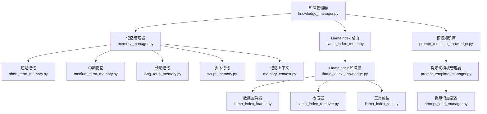
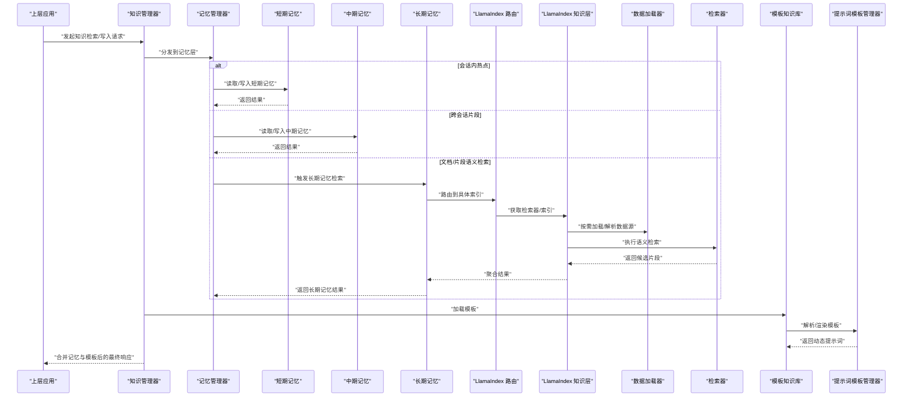
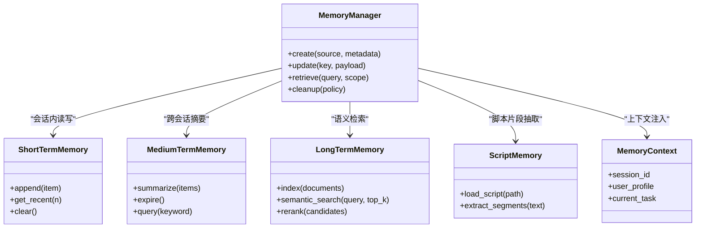
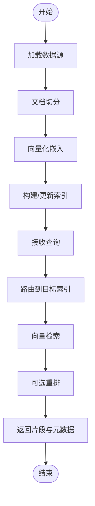
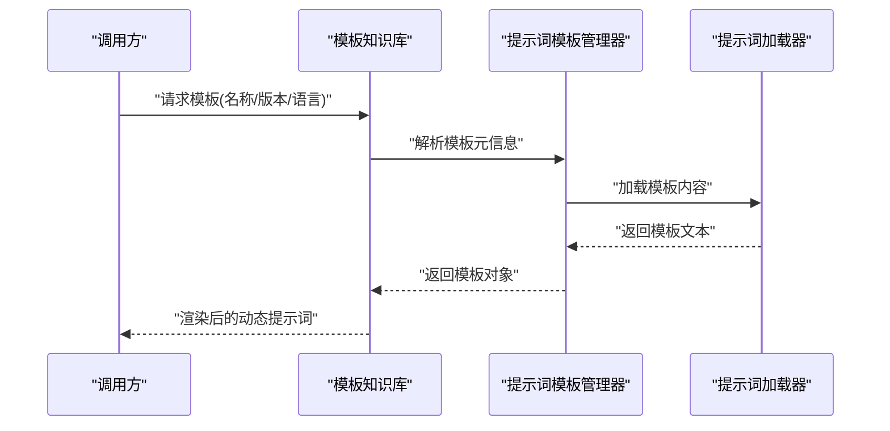
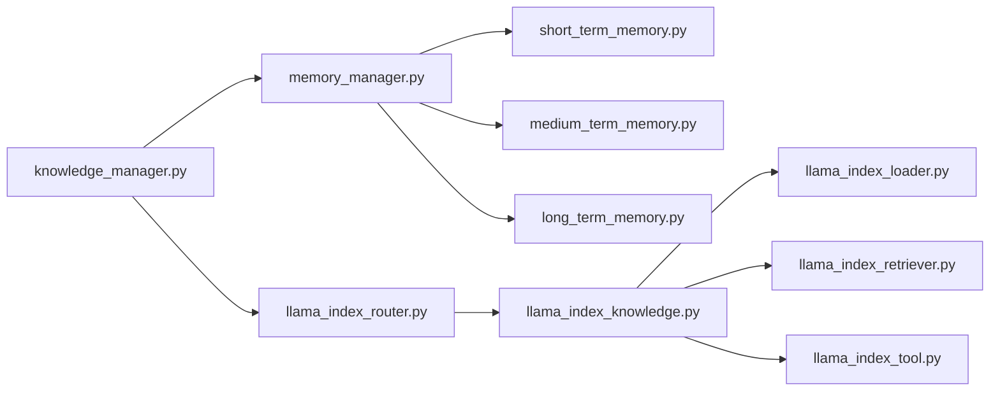

# 知识管理系统

<cite>
**本文引用的文件**   
- [knowledge_manager.py](file://src/penshot/knowledge/knowledge_manager.py)
- [memory_manager.py](file://src/penshot/knowledge/memory/memory_manager.py)
- [short_term_memory.py](file://src/penshot/knowledge/memory/short_term_memory.py)
- [medium_term_memory.py](file://src/penshot/knowledge/memory/medium_term_memory.py)
- [long_term_memory.py](file://src/penshot/knowledge/memory/long_term_memory.py)
- [script_memory.py](file://src/penshot/knowledge/memory/script_memory.py)
- [memory_context.py](file://src/penshot/knowledge/memory/memory_context.py)
- [memory_models.py](file://src/penshot/knowledge/memory/memory_models.py)
- [llama_index_knowledge.py](file://src/penshot/knowledge/llamaIndex/llama_index_knowledge.py)
- [llama_index_loader.py](file://src/penshot/knowledge/llamaIndex/llama_index_loader.py)
- [llama_index_retriever.py](file://src/penshot/knowledge/llamaIndex/llama_index_retriever.py)
- [llama_index_tool.py](file://src/penshot/knowledge/llamaIndex/llama_index_tool.py)
- [llama_index_router.py](file://src/penshot/knowledge/llama_index_router.py)
- [prompt_template_knowledge.py](file://src/penshot/knowledge/template/prompt_template_knowledge.py)
- [prompt_template_manager.py](file://src/penshot/prompts/prompt_template_manager.py)
- [prompt_load_manager.py](file://src/penshot/prompts/prompt_load_manager.py)
- [test_knowledge_base.py](file://tests/knowledge/test_knowledge_base.py)
- [rebuild_index.py](file://tests/knowledge/rebuild_index.py)
- [diagnose_index.py](file://tests/knowledge/diagnose_index.py)
- [knowledge_base_viewer.py](file://tests/knowledge/knowledge_base_viewer.py)
</cite>

## 目录
1. [简介](#简介)
2. [项目结构](#项目结构)
3. [核心组件](#核心组件)
4. [架构总览](#架构总览)
5. [详细组件分析](#详细组件分析)
6. [依赖关系分析](#依赖关系分析)
7. [性能与优化](#性能与优化)
8. [故障排查指南](#故障排查指南)
9. [结论](#结论)
10. [附录](#附录)

## 简介
本文件面向“知识管理系统”的构建、维护与优化，围绕短期记忆、中期记忆与长期记忆的层次化设计展开，重点说明：
- LlamaIndex 集成的向量检索系统与语义搜索能力
- 记忆管理器（创建、更新、检索、清理）的工作机制
- 模板知识库管理与动态提示词生成
- 多语言支持与个性化定制方法
- 实际知识检索案例与最佳实践

## 项目结构
知识管理子系统位于 src/penshot/knowledge 下，按职责分层组织：
- knowledge：顶层编排与路由
- memory：三层记忆（短期、中期、长期）及上下文、模型定义
- llamaIndex：LlamaIndex 集成（索引、加载、检索、工具封装）
- template：模板知识库与提示词模板管理

图表来源
- [knowledge_manager.py](file://src/penshot/knowledge/knowledge_manager.py)
- [memory_manager.py](file://src/penshot/knowledge/memory/memory_manager.py)
- [short_term_memory.py](file://src/penshot/knowledge/memory/short_term_memory.py)
- [medium_term_memory.py](file://src/penshot/knowledge/memory/medium_term_memory.py)
- [long_term_memory.py](file://src/penshot/knowledge/memory/long_term_memory.py)
- [script_memory.py](file://src/penshot/knowledge/memory/script_memory.py)
- [memory_context.py](file://src/penshot/knowledge/memory/memory_context.py)
- [llama_index_router.py](file://src/penshot/knowledge/llama_index_router.py)
- [llama_index_knowledge.py](file://src/penshot/knowledge/llamaIndex/llama_index_knowledge.py)
- [llama_index_loader.py](file://src/penshot/knowledge/llamaIndex/llama_index_loader.py)
- [llama_index_retriever.py](file://src/penshot/knowledge/llamaIndex/llama_index_retriever.py)
- [llama_index_tool.py](file://src/penshot/knowledge/llamaIndex/llama_index_tool.py)
- [prompt_template_knowledge.py](file://src/penshot/knowledge/template/prompt_template_knowledge.py)
- [prompt_template_manager.py](file://src/penshot/prompts/prompt_template_manager.py)
- [prompt_load_manager.py](file://src/penshot/prompts/prompt_load_manager.py)

章节来源
- [knowledge_manager.py](file://src/penshot/knowledge/knowledge_manager.py)
- [memory_manager.py](file://src/penshot/knowledge/memory/memory_manager.py)
- [llama_index_knowledge.py](file://src/penshot/knowledge/llamaIndex/llama_index_knowledge.py)
- [prompt_template_knowledge.py](file://src/penshot/knowledge/template/prompt_template_knowledge.py)

## 核心组件
- 知识管理器：对外提供统一的知识访问入口，协调记忆层与向量检索层。
- 记忆管理器：负责短期、中期、长期记忆的创建、更新、检索与清理；维护会话级上下文。
- 三层记忆：
  - 短期记忆：会话内高频、易变信息，快速读写。
  - 中期记忆：跨会话但有限生命周期的摘要或结构化片段。
  - 长期记忆：持久化的文档/片段集合，通过 LlamaIndex 进行语义检索。
- LlamaIndex 集成：提供文档加载、向量化、索引构建与检索工具，支持语义搜索与重排。
- 模板知识库与动态提示词：集中管理提示词模板，结合上下文与用户偏好动态生成最终提示词。

章节来源
- [memory_manager.py](file://src/penshot/knowledge/memory/memory_manager.py)
- [short_term_memory.py](file://src/penshot/knowledge/memory/short_term_memory.py)
- [medium_term_memory.py](file://src/penshot/knowledge/memory/medium_term_memory.py)
- [long_term_memory.py](file://src/penshot/knowledge/memory/long_term_memory.py)
- [llama_index_knowledge.py](file://src/penshot/knowledge/llamaIndex/llama_index_knowledge.py)
- [prompt_template_knowledge.py](file://src/penshot/knowledge/template/prompt_template_knowledge.py)

## 架构总览
知识管理系统的整体交互如下：上层应用通过知识管理器发起请求，记忆管理器根据查询类型选择短期/中期/长期路径；长期记忆走 LlamaIndex 的语义检索链路；同时可结合模板知识库动态拼装提示词。

图表来源
- [knowledge_manager.py](file://src/penshot/knowledge/knowledge_manager.py)
- [memory_manager.py](file://src/penshot/knowledge/memory/memory_manager.py)
- [short_term_memory.py](file://src/penshot/knowledge/memory/short_term_memory.py)
- [medium_term_memory.py](file://src/penshot/knowledge/memory/medium_term_memory.py)
- [long_term_memory.py](file://src/penshot/knowledge/memory/long_term_memory.py)
- [llama_index_router.py](file://src/penshot/knowledge/llama_index_router.py)
- [llama_index_knowledge.py](file://src/penshot/knowledge/llamaIndex/llama_index_knowledge.py)
- [llama_index_loader.py](file://src/penshot/knowledge/llamaIndex/llama_index_loader.py)
- [llama_index_retriever.py](file://src/penshot/knowledge/llamaIndex/llama_index_retriever.py)
- [prompt_template_knowledge.py](file://src/penshot/knowledge/template/prompt_template_knowledge.py)
- [prompt_template_manager.py](file://src/penshot/prompts/prompt_template_manager.py)

## 详细组件分析

### 记忆管理器与三层记忆
- 职责边界
  - 短期记忆：低延迟、高吞吐的会话内状态缓存，适合对话历史、中间态变量。
  - 中期记忆：跨会话的结构化摘要或关键事实，具备过期策略与压缩机制。
  - 长期记忆：基于 LlamaIndex 的文档/片段集合，支持语义检索与重排。
- 生命周期
  - 创建：按来源（输入文本、工具输出、外部数据）构造记忆条目并写入对应层级。
  - 更新：增量追加、去重、摘要压缩与过期淘汰。
  - 检索：按查询意图选择目标层级，必要时融合多源结果。
  - 清理：定时或事件驱动的回收策略，释放资源并保持命中率。

图表来源
- [memory_manager.py](file://src/penshot/knowledge/memory/memory_manager.py)
- [short_term_memory.py](file://src/penshot/knowledge/memory/short_term_memory.py)
- [medium_term_memory.py](file://src/penshot/knowledge/memory/medium_term_memory.py)
- [long_term_memory.py](file://src/penshot/knowledge/memory/long_term_memory.py)
- [script_memory.py](file://src/penshot/knowledge/memory/script_memory.py)
- [memory_context.py](file://src/penshot/knowledge/memory/memory_context.py)

章节来源
- [memory_manager.py](file://src/penshot/knowledge/memory/memory_manager.py)
- [short_term_memory.py](file://src/penshot/knowledge/memory/short_term_memory.py)
- [medium_term_memory.py](file://src/penshot/knowledge/memory/medium_term_memory.py)
- [long_term_memory.py](file://src/penshot/knowledge/memory/long_term_memory.py)
- [script_memory.py](file://src/penshot/knowledge/memory/script_memory.py)
- [memory_context.py](file://src/penshot/knowledge/memory/memory_context.py)

### LlamaIndex 集成与语义检索
- 角色分工
  - 路由：根据索引名称/标签选择具体检索器。
  - 知识层：封装索引构建、检索、重排等能力。
  - 加载器：从多种数据源解析并切分文档。
  - 检索器：执行向量相似度检索与可选重排。
  - 工具：将检索能力暴露为可调用工具。
- 典型流程
  - 构建索引：加载数据 -> 切分 -> 向量化 -> 持久化索引。
  - 语义检索：查询 -> 路由 -> 检索 -> 重排 -> 返回片段。
  - 增量更新：新增/变更数据 -> 重建或增量索引 -> 热切换。

图表来源
- [llama_index_router.py](file://src/penshot/knowledge/llama_index_router.py)
- [llama_index_knowledge.py](file://src/penshot/knowledge/llamaIndex/llama_index_knowledge.py)
- [llama_index_loader.py](file://src/penshot/knowledge/llamaIndex/llama_index_loader.py)
- [llama_index_retriever.py](file://src/penshot/knowledge/llamaIndex/llama_index_retriever.py)
- [llama_index_tool.py](file://src/penshot/knowledge/llamaIndex/llama_index_tool.py)

章节来源
- [llama_index_router.py](file://src/penshot/knowledge/llama_index_router.py)
- [llama_index_knowledge.py](file://src/penshot/knowledge/llamaIndex/llama_index_knowledge.py)
- [llama_index_loader.py](file://src/penshot/knowledge/llamaIndex/llama_index_loader.py)
- [llama_index_retriever.py](file://src/penshot/knowledge/llamaIndex/llama_index_retriever.py)
- [llama_index_tool.py](file://src/penshot/knowledge/llamaIndex/llama_index_tool.py)

### 模板知识库与动态提示词
- 模板知识库：集中存放领域相关的提示词模板，支持版本与语言维度管理。
- 动态提示词生成：结合当前任务、用户画像、记忆上下文与模板参数，渲染出最终提示词。
- 扩展点：新增模板、覆盖默认行为、按语言/场景选择不同模板族。

图表来源
- [prompt_template_knowledge.py](file://src/penshot/knowledge/template/prompt_template_knowledge.py)
- [prompt_template_manager.py](file://src/penshot/prompts/prompt_template_manager.py)
- [prompt_load_manager.py](file://src/penshot/prompts/prompt_load_manager.py)

章节来源
- [prompt_template_knowledge.py](file://src/penshot/knowledge/template/prompt_template_knowledge.py)
- [prompt_template_manager.py](file://src/penshot/prompts/prompt_template_manager.py)
- [prompt_load_manager.py](file://src/penshot/prompts/prompt_load_manager.py)

### 实际应用：知识检索案例
- 场景一：问答式检索
  - 步骤：组装查询 -> 路由到长期记忆 -> 语义检索 -> 可选重排 -> 拼接上下文 -> 生成回答。
- 场景二：脚本片段定位
  - 步骤：从脚本记忆中提取片段 -> 中期记忆摘要 -> 短期记忆快速命中 -> 返回定位结果。
- 场景三：模板驱动的任务提示
  - 步骤：选择模板族 -> 注入用户画像与任务上下文 -> 渲染提示词 -> 提交下游模型。

章节来源
- [test_knowledge_base.py](file://tests/knowledge/test_knowledge_base.py)
- [memory_manager.py](file://src/penshot/knowledge/memory/memory_manager.py)
- [llama_index_knowledge.py](file://src/penshot/knowledge/llamaIndex/llama_index_knowledge.py)
- [prompt_template_knowledge.py](file://src/penshot/knowledge/template/prompt_template_knowledge.py)

## 依赖关系分析
- 模块耦合
  - 知识管理器对记忆管理器与 LlamaIndex 路由存在强依赖。
  - 记忆管理器对三类记忆实现与上下文对象存在组合关系。
  - LlamaIndex 层内部由路由、知识层、加载器、检索器、工具组成松耦合协作。
- 外部依赖
  - LlamaIndex 生态（索引、嵌入、检索、重排）。
  - 配置与日志系统（用于索引路径、模型参数、日志级别）。

图表来源
- [knowledge_manager.py](file://src/penshot/knowledge/knowledge_manager.py)
- [memory_manager.py](file://src/penshot/knowledge/memory/memory_manager.py)
- [llama_index_router.py](file://src/penshot/knowledge/llama_index_router.py)
- [llama_index_knowledge.py](file://src/penshot/knowledge/llamaIndex/llama_index_knowledge.py)
- [llama_index_loader.py](file://src/penshot/knowledge/llamaIndex/llama_index_loader.py)
- [llama_index_retriever.py](file://src/penshot/knowledge/llamaIndex/llama_index_retriever.py)
- [llama_index_tool.py](file://src/penshot/knowledge/llamaIndex/llama_index_tool.py)

章节来源
- [knowledge_manager.py](file://src/penshot/knowledge/knowledge_manager.py)
- [memory_manager.py](file://src/penshot/knowledge/memory/memory_manager.py)
- [llama_index_router.py](file://src/penshot/knowledge/llama_index_router.py)
- [llama_index_knowledge.py](file://src/penshot/knowledge/llamaIndex/llama_index_knowledge.py)

## 性能与优化
- 索引构建
  - 批量处理与流式写入，避免内存峰值。
  - 合理设置 chunk 大小与重叠比例，平衡召回与速度。
  - 使用本地缓存与增量索引减少重复计算。
- 检索优化
  - 调整 top_k 与阈值，结合重排提升精度。
  - 对热点查询做缓存，降低重复检索开销。
- 记忆管理
  - 短期记忆采用环形缓冲或滑动窗口控制大小。
  - 中期记忆定期摘要压缩，降低存储与检索成本。
  - 长期记忆按主题/时间分区，缩小检索范围。
- 多语言与个性化
  - 针对不同语言选择匹配的嵌入与重排模型。
  - 在模板中引入用户画像与风格参数，实现个性化输出。

[本节为通用指导，不直接分析具体文件]

## 故障排查指南
- 索引不可用或为空
  - 检查数据源路径与权限，确认加载器能正确解析。
  - 使用诊断脚本验证索引结构与元数据完整性。
- 检索结果质量差
  - 调整 chunk 策略与检索参数，启用重排。
  - 检查嵌入模型是否匹配语言与领域。
- 模板渲染异常
  - 校验模板语法与必填参数，确认语言与版本选择正确。
- 常用工具
  - 重建索引：用于修复损坏索引或全量刷新。
  - 诊断索引：查看索引统计、样本片段与错误日志。
  - 知识库可视化：浏览索引内容与检索样例。

章节来源
- [rebuild_index.py](file://tests/knowledge/rebuild_index.py)
- [diagnose_index.py](file://tests/knowledge/diagnose_index.py)
- [knowledge_base_viewer.py](file://tests/knowledge/knowledge_base_viewer.py)

## 结论
本知识管理系统以“三层记忆 + LlamaIndex 语义检索 + 模板知识库”为核心，兼顾实时性与准确性，并通过路由与工具化接口提供可扩展能力。建议在生产环境中重视索引构建与检索调优、记忆生命周期治理以及模板的版本与多语言管理，以获得稳定且高质量的知识服务体验。

[本节为总结性内容，不直接分析具体文件]

## 附录
- 术语
  - 短期记忆：会话内高频、易变信息的快速存取。
  - 中期记忆：跨会话的摘要与结构化片段，具备过期策略。
  - 长期记忆：基于向量索引的文档/片段集合，支持语义检索。
  - 模板知识库：集中管理的提示词模板集合，支持版本与语言维度。
- 参考用例
  - 单元测试与端到端测试覆盖了索引构建、检索与模板渲染的关键路径。

章节来源
- [test_knowledge_base.py](file://tests/knowledge/test_knowledge_base.py)