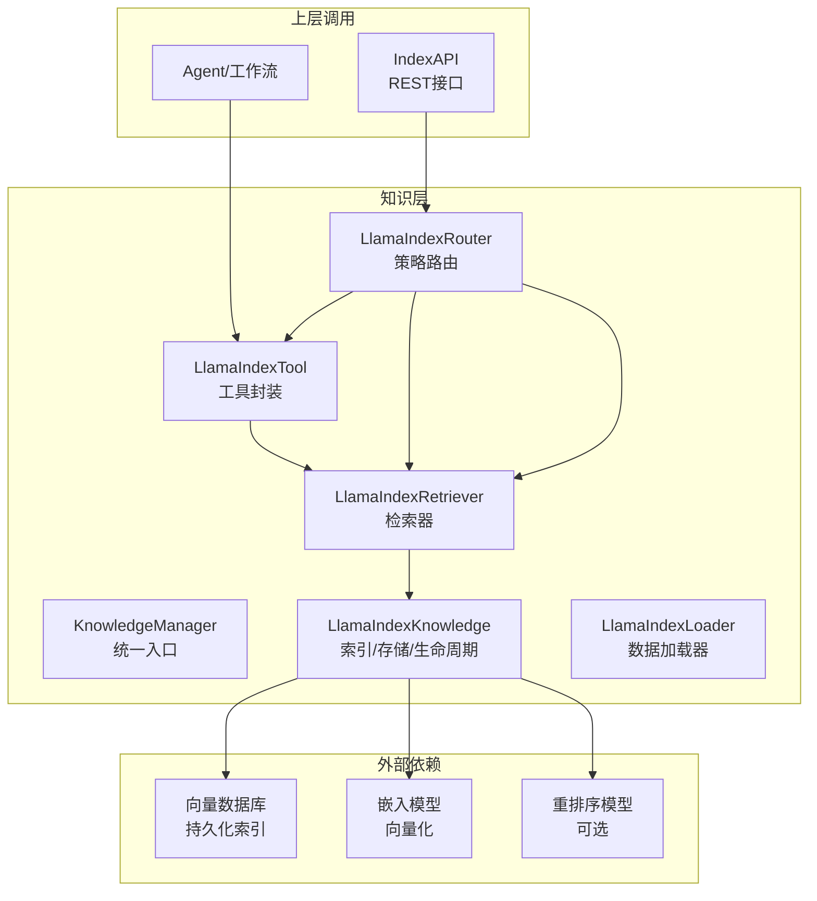
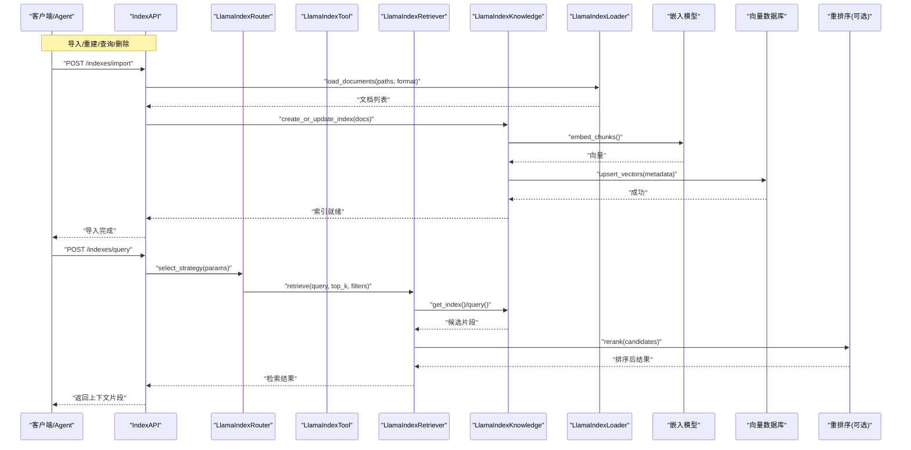
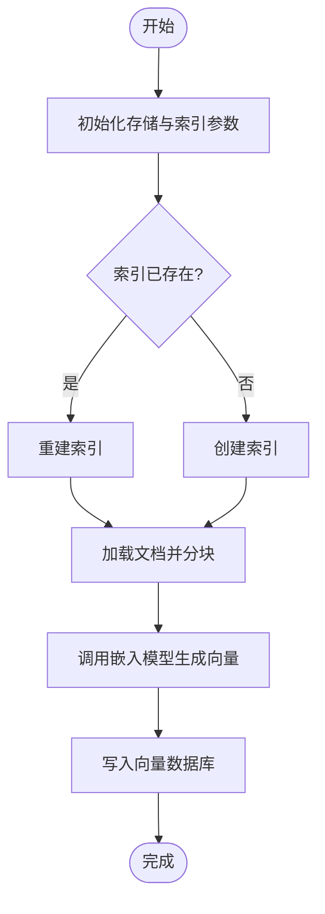
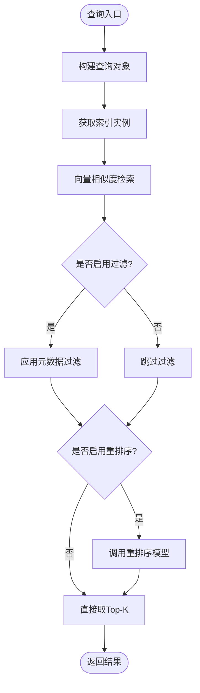
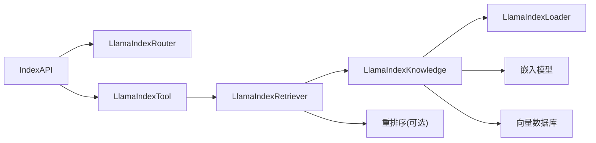

# LlamaIndex集成

<cite>
**本文引用的文件**   
- [llama_index_knowledge.py](file://src/penshot/knowledge/llamaIndex/llama_index_knowledge.py)
- [llama_index_loader.py](file://src/penshot/knowledge/llamaIndex/llama_index_loader.py)
- [llama_index_retriever.py](file://src/penshot/knowledge/llamaIndex/llama_index_retriever.py)
- [llama_index_tool.py](file://src/penshot/knowledge/llamaIndex/llama_index_tool.py)
- [llama_index_router.py](file://src/penshot/knowledge/llama_index_router.py)
- [knowledge_manager.py](file://src/penshot/knowledge/knowledge_manager.py)
- [index_api.py](file://src/penshot/api/index_api.py)
- [config.py](file://src/penshot/config/config.py)
- [settings.yaml](file://src/penshot/config/settings.yaml)
- [rebuild_index.py](file://tests/knowledge/rebuild_index.py)
- [test_rerank.py](file://tests/knowledge/test_rerank.py)
- [test_vector_query.py](file://tests/knowledge/test_vector_query.py)
</cite>

## 目录
1. [简介](#简介)
2. [项目结构](#项目结构)
3. [核心组件](#核心组件)
4. [架构总览](#架构总览)
5. [详细组件分析](#详细组件分析)
6. [依赖关系分析](#依赖关系分析)
7. [性能与优化](#性能与优化)
8. [故障排查指南](#故障排查指南)
9. [结论](#结论)
10. [附录](#附录)

## 简介
本文件面向基于LlamaIndex的知识检索增强生成（RAG）实现，系统性说明向量数据库集成、索引创建与管理流程、数据加载器、嵌入模型与检索器的使用方法，并覆盖知识文档的导入、更新与删除操作。同时提供性能优化技巧与最佳实践，展示如何在AI决策中有效利用检索结果。

## 项目结构
本项目在 knowledge/llamaIndex 目录下集中实现了LlamaIndex相关的核心能力：
- 知识库封装与生命周期管理
- 数据加载器（支持多格式）
- 检索器（相似度检索、重排序等）
- 工具化接口（供Agent或API调用）
- 路由与编排（按场景选择不同检索策略）
- 上层API与配置

图表来源
- [llama_index_knowledge.py](file://src/penshot/knowledge/llamaIndex/llama_index_knowledge.py)
- [llama_index_loader.py](file://src/penshot/knowledge/llamaIndex/llama_index_loader.py)
- [llama_index_retriever.py](file://src/penshot/knowledge/llamaIndex/llama_index_retriever.py)
- [llama_index_tool.py](file://src/penshot/knowledge/llamaIndex/llama_index_tool.py)
- [llama_index_router.py](file://src/penshot/knowledge/llama_index_router.py)
- [index_api.py](file://src/penshot/api/index_api.py)

章节来源
- [llama_index_knowledge.py](file://src/penshot/knowledge/llamaIndex/llama_index_knowledge.py)
- [llama_index_loader.py](file://src/penshot/knowledge/llamaIndex/llama_index_loader.py)
- [llama_index_retriever.py](file://src/penshot/knowledge/llamaIndex/llama_index_retriever.py)
- [llama_index_tool.py](file://src/penshot/knowledge/llamaIndex/llama_index_tool.py)
- [llama_index_router.py](file://src/penshot/knowledge/llama_index_router.py)
- [index_api.py](file://src/penshot/api/index_api.py)

## 核心组件
- 知识库封装（LlamaIndexKnowledge）
  - 负责索引创建、更新、删除、查询、元数据管理与存储后端绑定。
  - 暴露统一的初始化、重建、清理与状态检查方法。
- 数据加载器（LlamaIndexLoader）
  - 封装多种文档格式的解析与分块策略，输出LlamaIndex可消费的文档对象。
- 检索器（LlamaIndexRetriever）
  - 封装相似度检索、Top-K、过滤条件、重排序（可选）等检索流程。
- 工具封装（LlamaIndexTool）
  - 将检索能力以工具形式暴露给Agent或工作流节点，便于组合编排。
- 路由（LlamaIndexRouter）
  - 根据任务类型或配置选择不同检索策略（如纯向量检索、混合检索、带重排）。
- 上层API（IndexAPI）
  - 提供HTTP接口用于导入、重建、查询、删除等操作，便于外部系统集成。

章节来源
- [llama_index_knowledge.py](file://src/penshot/knowledge/llamaIndex/llama_index_knowledge.py)
- [llama_index_loader.py](file://src/penshot/knowledge/llamaIndex/llama_index_loader.py)
- [llama_index_retriever.py](file://src/penshot/knowledge/llamaIndex/llama_index_retriever.py)
- [llama_index_tool.py](file://src/penshot/knowledge/llamaIndex/llama_index_tool.py)
- [llama_index_router.py](file://src/penshot/knowledge/llama_index_router.py)
- [index_api.py](file://src/penshot/api/index_api.py)

## 架构总览
下图展示了从“数据导入”到“检索增强生成”的端到端流程，以及各组件之间的交互关系。

图表来源
- [index_api.py](file://src/penshot/api/index_api.py)
- [llama_index_router.py](file://src/penshot/knowledge/llama_index_router.py)
- [llama_index_tool.py](file://src/penshot/knowledge/llamaIndex/llama_index_tool.py)
- [llama_index_retriever.py](file://src/penshot/knowledge/llamaIndex/llama_index_retriever.py)
- [llama_index_knowledge.py](file://src/penshot/knowledge/llamaIndex/llama_index_knowledge.py)
- [llama_index_loader.py](file://src/penshot/knowledge/llamaIndex/llama_index_loader.py)

## 详细组件分析

### 知识库封装（LlamaIndexKnowledge）
职责
- 初始化与配置：设置存储后端、索引名称、分块大小、元数据字段等。
- 索引生命周期：创建、重建、更新、删除、存在性检查。
- 查询与上下文组装：执行检索、合并上下文、注入提示词模板。

关键流程
- 创建/重建索引：读取文档 -> 分块 -> 向量化 -> 写入向量库。
- 更新索引：增量插入新文档或替换旧版本。
- 删除索引：移除索引及对应持久化数据。

图表来源
- [llama_index_knowledge.py](file://src/penshot/knowledge/llamaIndex/llama_index_knowledge.py)

章节来源
- [llama_index_knowledge.py](file://src/penshot/knowledge/llamaIndex/llama_index_knowledge.py)

### 数据加载器（LlamaIndexLoader）
职责
- 支持多种文件格式（文本、Markdown、PDF、JSON等）。
- 解析为LlamaIndex文档对象，附加必要元数据（来源、时间戳、标签等）。
- 提供批量加载与错误隔离（单文件失败不影响整体）。

使用要点
- 指定路径或URL集合，自动推断格式。
- 可配置分块策略（按字符/段落/语义边界）。
- 建议对大文件启用流式解析以降低内存占用。

章节来源
- [llama_index_loader.py](file://src/penshot/knowledge/llamaIndex/llama_index_loader.py)

### 检索器（LlamaIndexRetriever）
职责
- 封装相似度检索、Top-K、过滤条件（元数据筛选）。
- 可选重排序阶段，提升最终相关性。
- 返回结构化结果（片段内容、来源、分数、元数据）。

典型流程
- 接收查询与参数 -> 获取索引 -> 执行检索 -> 应用过滤器 -> 可选重排 -> 返回结果。

图表来源
- [llama_index_retriever.py](file://src/penshot/knowledge/llamaIndex/llama_index_retriever.py)

章节来源
- [llama_index_retriever.py](file://src/penshot/knowledge/llamaIndex/llama_index_retriever.py)

### 工具封装（LlamaIndexTool）
职责
- 将检索能力包装为工具函数，供Agent或工作流节点调用。
- 提供便捷参数映射（查询、Top-K、过滤、重排开关）。
- 统一异常处理与日志记录。

使用方式
- 在工作流中注册工具，传入用户问题与上下文约束。
- 工具返回标准化结果，便于后续LLM消费。

章节来源
- [llama_index_tool.py](file://src/penshot/knowledge/llamaIndex/llama_index_tool.py)

### 路由（LlamaIndexRouter）
职责
- 根据任务类型或配置选择检索策略（例如：仅向量检索、混合检索、带重排）。
- 动态调整Top-K、过滤规则与重排序阈值。

策略示例
- 通用问答：向量检索 + Top-K=5
- 精确事实：向量检索 + 元数据过滤 + 重排序
- 快速预览：轻量检索（Top-K=3，无重排）

章节来源
- [llama_index_router.py](file://src/penshot/knowledge/llama_index_router.py)

### 上层API（IndexAPI）
职责
- 暴露REST接口：导入、重建、查询、删除索引。
- 校验请求参数，转发至路由与工具层。
- 返回统一响应格式，包含状态码与消息体。

典型接口
- POST /indexes/import：导入文档并重建索引
- POST /indexes/query：执行检索
- DELETE /indexes/{name}：删除指定索引

章节来源
- [index_api.py](file://src/penshot/api/index_api.py)

## 依赖关系分析
- 内部依赖
  - IndexAPI 依赖 LlamaIndexRouter 与 LlamaIndexTool
  - LlamaIndexTool 依赖 LlamaIndexRetriever
  - LlamaIndexRetriever 依赖 LlamaIndexKnowledge
  - LlamaIndexKnowledge 依赖 LlamaIndexLoader、嵌入模型、向量数据库、重排序模型（可选）
- 外部依赖
  - 嵌入模型：负责文本到向量转换
  - 向量数据库：持久化索引与向量
  - 重排序模型：提升检索质量（可选）

图表来源
- [index_api.py](file://src/penshot/api/index_api.py)
- [llama_index_router.py](file://src/penshot/knowledge/llama_index_router.py)
- [llama_index_tool.py](file://src/penshot/knowledge/llamaIndex/llama_index_tool.py)
- [llama_index_retriever.py](file://src/penshot/knowledge/llamaIndex/llama_index_retriever.py)
- [llama_index_knowledge.py](file://src/penshot/knowledge/llamaIndex/llama_index_knowledge.py)
- [llama_index_loader.py](file://src/penshot/knowledge/llamaIndex/llama_index_loader.py)

章节来源
- [index_api.py](file://src/penshot/api/index_api.py)
- [llama_index_router.py](file://src/penshot/knowledge/llama_index_router.py)
- [llama_index_tool.py](file://src/penshot/knowledge/llamaIndex/llama_index_tool.py)
- [llama_index_retriever.py](file://src/penshot/knowledge/llamaIndex/llama_index_retriever.py)
- [llama_index_knowledge.py](file://src/penshot/knowledge/llamaIndex/llama_index_knowledge.py)
- [llama_index_loader.py](file://src/penshot/knowledge/llamaIndex/llama_index_loader.py)

## 性能与优化
- 分块策略
  - 合理设置分块大小与重叠比例，避免过细导致上下文缺失，或过大影响检索精度。
- 嵌入模型选择
  - 中文场景优先选择具备强中文能力的嵌入模型；权衡维度与延迟。
- 向量数据库调优
  - 选择合适的索引算法与HNSW参数；定期压缩与重建以提升查询速度。
- 重排序
  - 在需要高相关性的场景开启重排序；注意增加额外延迟。
- 缓存与批处理
  - 对重复查询进行缓存；批量导入时采用并行分块与写入。
- 资源监控
  - 监控向量库连接池、GPU/CPU利用率、内存峰值，及时扩容或降级。

[本节为通用指导，不直接分析具体文件]

## 故障排查指南
常见问题与定位步骤
- 导入失败
  - 检查文件格式与编码；确认加载器支持的类型；查看单文件错误隔离日志。
- 索引未生效
  - 验证索引是否存在；确认存储后端可用；检查嵌入模型与向量库连通性。
- 检索结果差
  - 调整Top-K与过滤条件；尝试开启重排序；检查分块策略与元数据完整性。
- 性能抖动
  - 观察向量库指标；评估重排序开销；考虑缓存热点查询。

参考脚本与测试
- 重建索引脚本：用于诊断与修复索引一致性
- 重排序质量测试：评估重排序前后效果差异
- 向量查询测试：验证检索稳定性与召回率

章节来源
- [rebuild_index.py](file://tests/knowledge/rebuild_index.py)
- [test_rerank.py](file://tests/knowledge/test_rerank.py)
- [test_vector_query.py](file://tests/knowledge/test_vector_query.py)

## 结论
通过LlamaIndex封装的知识库模块，本项目实现了可扩展、可配置的RAG能力。借助统一的路由与工具化接口，系统可在不同业务场景中灵活切换检索策略，并在AI决策过程中高效利用检索结果。配合合理的分块、嵌入与重排序配置，能够在准确性与性能之间取得良好平衡。

[本节为总结性内容，不直接分析具体文件]

## 附录

### 配置项速览（settings.yaml）
- 嵌入模型：模型名称、维度、是否本地部署
- 向量数据库：后端类型、连接参数、索引名
- 检索参数：默认Top-K、过滤规则、是否启用重排序
- 日志与监控：级别、输出目标、指标上报

章节来源
- [settings.yaml](file://src/penshot/config/settings.yaml)
- [config.py](file://src/penshot/config/config.py)

### 使用示例（路径指引）
- 导入与重建索引
  - 参考：[rebuild_index.py](file://tests/knowledge/rebuild_index.py)
- 检索与重排序评估
  - 参考：[test_rerank.py](file://tests/knowledge/test_rerank.py)
- 向量查询验证
  - 参考：[test_vector_query.py](file://tests/knowledge/test_vector_query.py)