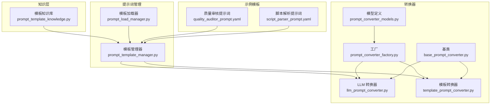
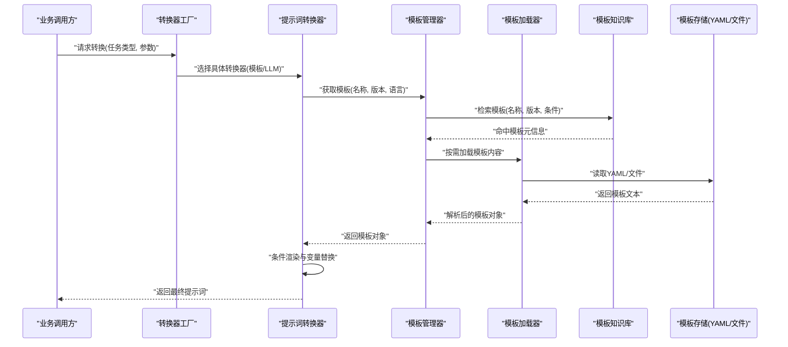
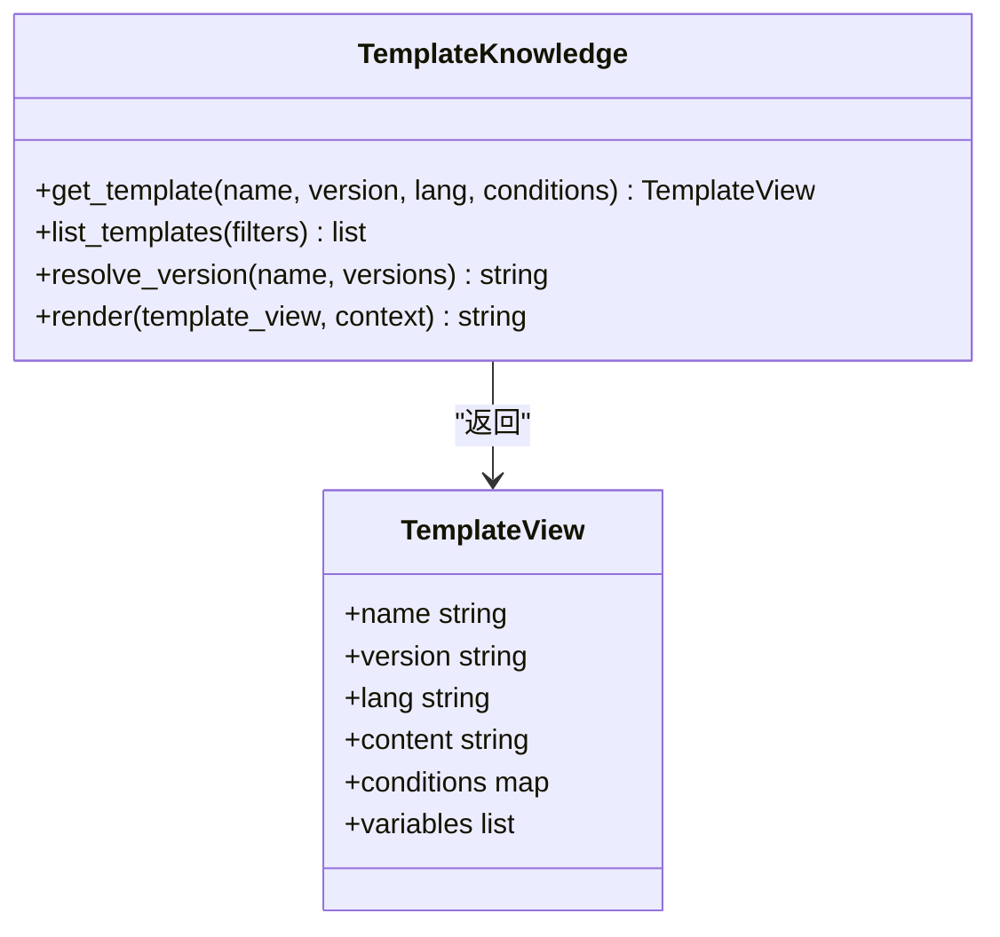
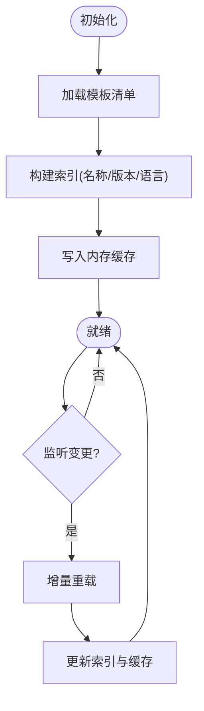
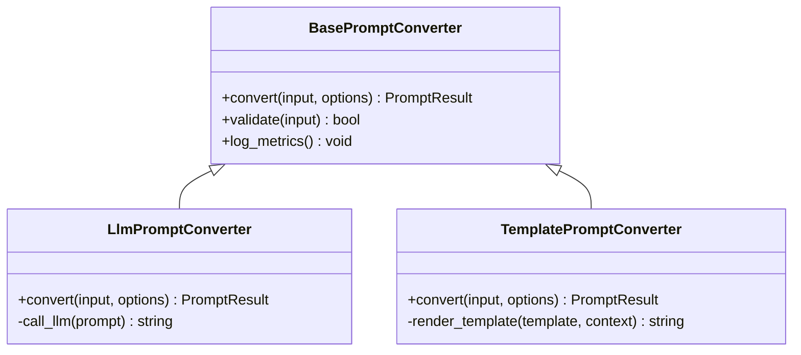
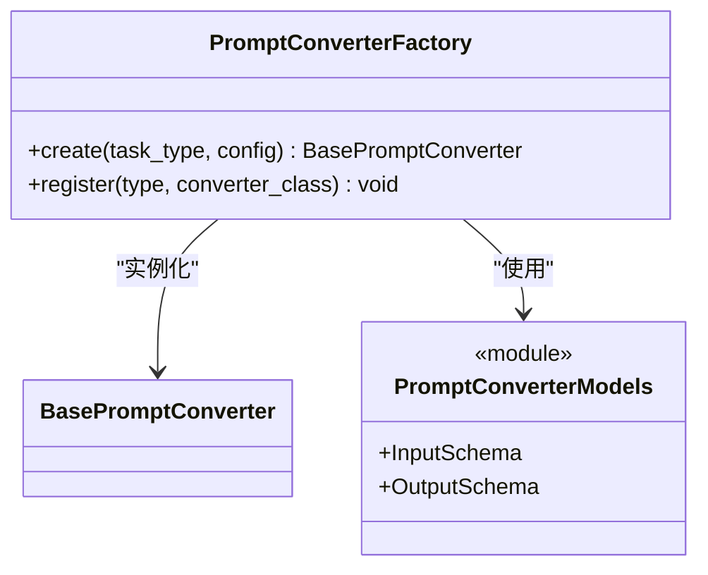
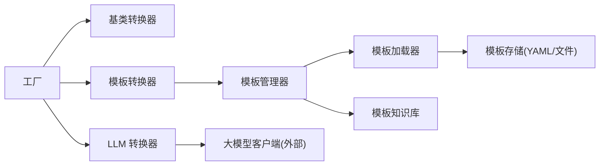

# 模板知识库

<cite>
**本文引用的文件**   
- [prompt_template_knowledge.py](file://src/penshot/knowledge/template/prompt_template_knowledge.py)
- [prompt_template_manager.py](file://src/penshot/prompts/prompt_template_manager.py)
- [prompt_load_manager.py](file://src/penshot/prompts/prompt_load_manager.py)
- [llm_prompt_converter.py](file://src/penshot/neopen/agent/prompt_converter/llm_prompt_converter.py)
- [template_prompt_converter.py](file://src/penshot/neopen/agent/prompt_converter/template_prompt_converter.py)
- [base_prompt_converter.py](file://src/penshot/neopen/agent/prompt_converter/base_prompt_converter.py)
- [prompt_converter_factory.py](file://src/penshot/neopen/agent/prompt_converter/prompt_converter_factory.py)
- [prompt_converter_models.py](file://src/penshot/neopen/agent/prompt_converter/prompt_converter_models.py)
- [quality_auditor_prompt.yaml](file://src/penshot/prompts/v1.x/zh/quality_auditor_prompt.yaml)
- [script_parser_prompt.yaml](file://src/penshot/prompts/v1.x/en/script_parser_prompt.yaml)
</cite>

## 目录
1. [简介](#简介)
2. [项目结构](#项目结构)
3. [核心组件](#核心组件)
4. [架构总览](#架构总览)
5. [详细组件分析](#详细组件分析)
6. [依赖关系分析](#依赖关系分析)
7. [性能与缓存策略](#性能与缓存策略)
8. [故障排查指南](#故障排查指南)
9. [结论](#结论)
10. [附录](#附录)

## 简介
本文件围绕“模板知识库”展开，聚焦提示词模板的管理与动态生成机制。文档覆盖以下主题：
- 模板版本控制、条件渲染与变量替换
- 模板的创建、编辑、测试与部署流程
- 模板与业务逻辑的解耦设计与扩展机制
- 模板性能优化与缓存策略
- 模板复用与组合的最佳实践
- AI 提示词工程中的实际应用案例

## 项目结构
模板相关代码主要分布在以下模块：
- 知识层：模板知识库抽象与实现
- 提示词管理层：模板加载与管理
- 转换器层：基于 LLM 与基于模板的提示词转换
- 工厂与模型：统一入口与数据结构
- 示例模板：v1.x 下的多语言 YAML 模板

图示来源
- [prompt_template_knowledge.py](file://src/penshot/knowledge/template/prompt_template_knowledge.py)
- [prompt_template_manager.py](file://src/penshot/prompts/prompt_template_manager.py)
- [prompt_load_manager.py](file://src/penshot/prompts/prompt_load_manager.py)
- [llm_prompt_converter.py](file://src/penshot/neopen/agent/prompt_converter/llm_prompt_converter.py)
- [template_prompt_converter.py](file://src/penshot/neopen/agent/prompt_converter/template_prompt_converter.py)
- [base_prompt_converter.py](file://src/penshot/neopen/agent/prompt_converter/base_prompt_converter.py)
- [prompt_converter_factory.py](file://src/penshot/neopen/agent/prompt_converter/prompt_converter_factory.py)
- [prompt_converter_models.py](file://src/penshot/neopen/agent/prompt_converter/prompt_converter_models.py)
- [quality_auditor_prompt.yaml](file://src/penshot/prompts/v1.x/zh/quality_auditor_prompt.yaml)
- [script_parser_prompt.yaml](file://src/penshot/prompts/v1.x/en/script_parser_prompt.yaml)

章节来源
- [prompt_template_knowledge.py](file://src/penshot/knowledge/template/prompt_template_knowledge.py)
- [prompt_template_manager.py](file://src/penshot/prompts/prompt_template_manager.py)
- [prompt_load_manager.py](file://src/penshot/prompts/prompt_load_manager.py)
- [llm_prompt_converter.py](file://src/penshot/neopen/agent/prompt_converter/llm_prompt_converter.py)
- [template_prompt_converter.py](file://src/penshot/neopen/agent/prompt_converter/template_prompt_converter.py)
- [base_prompt_converter.py](file://src/penshot/neopen/agent/prompt_converter/base_prompt_converter.py)
- [prompt_converter_factory.py](file://src/penshot/neopen/agent/prompt_converter/prompt_converter_factory.py)
- [prompt_converter_models.py](file://src/penshot/neopen/agent/prompt_converter/prompt_converter_models.py)
- [quality_auditor_prompt.yaml](file://src/penshot/prompts/v1.x/zh/quality_auditor_prompt.yaml)
- [script_parser_prompt.yaml](file://src/penshot/prompts/v1.x/en/script_parser_prompt.yaml)

## 核心组件
- 模板知识库（Knowledge）
  - 职责：提供模板的统一检索、版本选择、条件匹配与上下文注入能力。
  - 关键点：支持按名称、版本、语言等维度定位模板；在检索阶段完成必要的环境与上下文拼装。
- 模板管理器（Manager）
  - 职责：负责模板生命周期管理（注册、加载、更新、失效）、缓存策略与热更新。
  - 关键点：将底层存储（文件系统/YAML/数据库）与上层使用方解耦；暴露一致的查询接口。
- 模板加载器（Loader）
  - 职责：从指定路径或配置源读取模板文件，解析为内部表示，并构建索引。
  - 关键点：支持增量加载、校验与错误恢复。
- 提示词转换器（Converters）
  - 基类：定义统一的转换接口与通用行为。
  - LLM 转换器：通过调用大模型进行提示词增强或改写。
  - 模板转换器：基于模板引擎进行变量替换与条件渲染。
- 工厂与模型（Factory & Models）
  - 工厂：根据配置或运行时参数选择具体转换器实现。
  - 模型：定义输入输出契约，确保各组件间数据一致性。

章节来源
- [prompt_template_knowledge.py](file://src/penshot/knowledge/template/prompt_template_knowledge.py)
- [prompt_template_manager.py](file://src/penshot/prompts/prompt_template_manager.py)
- [prompt_load_manager.py](file://src/penshot/prompts/prompt_load_manager.py)
- [base_prompt_converter.py](file://src/penshot/neopen/agent/prompt_converter/base_prompt_converter.py)
- [llm_prompt_converter.py](file://src/penshot/neopen/agent/prompt_converter/llm_prompt_converter.py)
- [template_prompt_converter.py](file://src/penshot/neopen/agent/prompt_converter/template_prompt_converter.py)
- [prompt_converter_factory.py](file://src/penshot/neopen/agent/prompt_converter/prompt_converter_factory.py)
- [prompt_converter_models.py](file://src/penshot/neopen/agent/prompt_converter/prompt_converter_models.py)

## 架构总览
下图展示了从业务侧到模板知识库与转换器的完整调用链路，包括版本选择、条件渲染与变量替换的关键环节。

图示来源
- [prompt_converter_factory.py](file://src/penshot/neopen/agent/prompt_converter/prompt_converter_factory.py)
- [template_prompt_converter.py](file://src/penshot/neopen/agent/prompt_converter/template_prompt_converter.py)
- [llm_prompt_converter.py](file://src/penshot/neopen/agent/prompt_converter/llm_prompt_converter.py)
- [prompt_template_manager.py](file://src/penshot/prompts/prompt_template_manager.py)
- [prompt_load_manager.py](file://src/penshot/prompts/prompt_load_manager.py)
- [prompt_template_knowledge.py](file://src/penshot/knowledge/template/prompt_template_knowledge.py)

## 详细组件分析

### 模板知识库（Template Knowledge）
- 设计要点
  - 以“模板名 + 版本 + 语言 + 条件键”作为主键空间，支持精确与模糊匹配。
  - 在检索时合并上下文（如角色、风格、领域），形成可渲染的模板视图。
- 关键能力
  - 版本控制：优先选择最高可用版本，或按语义版本规则选择。
  - 条件渲染：依据环境、任务属性、用户偏好等条件过滤分支。
  - 变量替换：支持嵌套变量、默认值、可选片段。
- 复杂度与性能
  - 索引查找时间复杂度近似 O(1)~O(log n)，取决于索引结构。
  - 建议对高频模板建立内存级缓存，避免重复 I/O。

图示来源
- [prompt_template_knowledge.py](file://src/penshot/knowledge/template/prompt_template_knowledge.py)

章节来源
- [prompt_template_knowledge.py](file://src/penshot/knowledge/template/prompt_template_knowledge.py)

### 模板管理器（Template Manager）
- 设计要点
  - 统一管理模板注册、加载、缓存与失效。
  - 对外暴露稳定接口，屏蔽底层存储差异。
- 关键能力
  - 热更新：监听变更事件或定时扫描，增量更新缓存。
  - 降级策略：当某版本不可用时回退至上一稳定版本。
- 与知识库协作
  - 管理器负责生命周期，知识库负责检索与渲染。

图示来源
- [prompt_template_manager.py](file://src/penshot/prompts/prompt_template_manager.py)
- [prompt_load_manager.py](file://src/penshot/prompts/prompt_load_manager.py)

章节来源
- [prompt_template_manager.py](file://src/penshot/prompts/prompt_template_manager.py)
- [prompt_load_manager.py](file://src/penshot/prompts/prompt_load_manager.py)

### 提示词转换器（Converters）
- 基类（Base）
  - 定义统一的转换接口与通用校验、日志、度量。
- LLM 转换器
  - 通过外部大模型服务进行提示词增强、改写或结构化提取。
  - 适合需要语义理解与灵活生成的场景。
- 模板转换器
  - 基于模板引擎执行变量替换与条件渲染。
  - 适合规则明确、稳定性要求高的场景。

图示来源
- [base_prompt_converter.py](file://src/penshot/neopen/agent/prompt_converter/base_prompt_converter.py)
- [llm_prompt_converter.py](file://src/penshot/neopen/agent/prompt_converter/llm_prompt_converter.py)
- [template_prompt_converter.py](file://src/penshot/neopen/agent/prompt_converter/template_prompt_converter.py)

章节来源
- [base_prompt_converter.py](file://src/penshot/neopen/agent/prompt_converter/base_prompt_converter.py)
- [llm_prompt_converter.py](file://src/penshot/neopen/agent/prompt_converter/llm_prompt_converter.py)
- [template_prompt_converter.py](file://src/penshot/neopen/agent/prompt_converter/template_prompt_converter.py)

### 工厂与模型（Factory & Models）
- 工厂
  - 根据任务类型、目标平台或策略选择具体转换器。
  - 支持运行时切换与灰度发布。
- 模型
  - 定义输入输出契约，确保跨组件一致性与可测试性。

图示来源
- [prompt_converter_factory.py](file://src/penshot/neopen/agent/prompt_converter/prompt_converter_factory.py)
- [prompt_converter_models.py](file://src/penshot/neopen/agent/prompt_converter/prompt_converter_models.py)

章节来源
- [prompt_converter_factory.py](file://src/penshot/neopen/agent/prompt_converter/prompt_converter_factory.py)
- [prompt_converter_models.py](file://src/penshot/neopen/agent/prompt_converter/prompt_converter_models.py)

### 示例模板（YAML）
- 质量审核提示词（中文）
  - 用途：面向质量审计任务的提示词模板，包含角色设定、评估维度与输出格式。
- 脚本解析提示词（英文）
  - 用途：面向脚本解析任务的提示词模板，包含字段抽取规则与约束。

章节来源
- [quality_auditor_prompt.yaml](file://src/penshot/prompts/v1.x/zh/quality_auditor_prompt.yaml)
- [script_parser_prompt.yaml](file://src/penshot/prompts/v1.x/en/script_parser_prompt.yaml)

## 依赖关系分析
- 组件耦合
  - 转换器依赖模板管理器与知识库；工厂依赖转换器实现；加载器依赖模板存储。
- 外部依赖
  - 大模型客户端（LLM 转换器）；文件系统或对象存储（YAML 模板）。
- 潜在循环
  - 当前分层清晰，未见直接循环依赖；需保持“知识层不反向依赖管理层”。

图示来源
- [prompt_converter_factory.py](file://src/penshot/neopen/agent/prompt_converter/prompt_converter_factory.py)
- [base_prompt_converter.py](file://src/penshot/neopen/agent/prompt_converter/base_prompt_converter.py)
- [llm_prompt_converter.py](file://src/penshot/neopen/agent/prompt_converter/llm_prompt_converter.py)
- [template_prompt_converter.py](file://src/penshot/neopen/agent/prompt_converter/template_prompt_converter.py)
- [prompt_template_manager.py](file://src/penshot/prompts/prompt_template_manager.py)
- [prompt_load_manager.py](file://src/penshot/prompts/prompt_load_manager.py)
- [prompt_template_knowledge.py](file://src/penshot/knowledge/template/prompt_template_knowledge.py)

章节来源
- [prompt_converter_factory.py](file://src/penshot/neopen/agent/prompt_converter/prompt_converter_factory.py)
- [base_prompt_converter.py](file://src/penshot/neopen/agent/prompt_converter/base_prompt_converter.py)
- [llm_prompt_converter.py](file://src/penshot/neopen/agent/prompt_converter/llm_prompt_converter.py)
- [template_prompt_converter.py](file://src/penshot/neopen/agent/prompt_converter/template_prompt_converter.py)
- [prompt_template_manager.py](file://src/penshot/prompts/prompt_template_manager.py)
- [prompt_load_manager.py](file://src/penshot/prompts/prompt_load_manager.py)
- [prompt_template_knowledge.py](file://src/penshot/knowledge/template/prompt_template_knowledge.py)

## 性能与缓存策略
- 缓存层级
  - 内存缓存：模板对象与渲染结果短期缓存，降低 I/O 与 CPU 开销。
  - 分布式缓存：在多实例部署下共享模板与渲染结果，提升命中率。
- 预热与懒加载
  - 启动时预加载高频模板；冷路径采用懒加载减少启动时间。
- 版本与灰度
  - 通过版本号与标签控制灰度流量，快速回滚。
- 指标与观测
  - 记录模板命中率、渲染耗时、失败率，结合告警与自动降级。

[本节为通用指导，无需特定文件引用]

## 故障排查指南
- 常见问题
  - 模板未找到：检查名称、版本、语言是否匹配；确认索引已构建。
  - 渲染失败：检查变量缺失、条件分支未命中、语法错误。
  - 性能抖动：观察缓存命中率与 I/O 延迟，必要时扩容或调整 TTL。
- 诊断步骤
  - 启用调试日志，打印模板选择与渲染过程。
  - 使用最小复现用例验证模板有效性。
  - 对比不同版本的渲染差异，定位回归点。

章节来源
- [prompt_template_manager.py](file://src/penshot/prompts/prompt_template_manager.py)
- [prompt_load_manager.py](file://src/penshot/prompts/prompt_load_manager.py)
- [template_prompt_converter.py](file://src/penshot/neopen/agent/prompt_converter/template_prompt_converter.py)

## 结论
模板知识库通过将提示词从业务逻辑中解耦，实现了版本可控、条件可配、变量可插拔的动态生成能力。配合工厂模式与缓存策略，系统具备高内聚、低耦合、易扩展与高性能的特征。建议在持续集成中引入模板自动化测试与回归校验，保障模板质量与稳定性。

[本节为总结性内容，无需特定文件引用]

## 附录

### 模板创建、编辑、测试与部署流程
- 创建
  - 在模板库中新建模板条目，定义名称、版本、语言与基础内容。
- 编辑
  - 使用编辑器修改模板内容与条件分支，提交变更并触发索引重建。
- 测试
  - 使用单元测试与端到端用例验证渲染结果与边界情况。
- 部署
  - 通过工厂配置选择目标版本，灰度发布并监控指标。

章节来源
- [prompt_template_manager.py](file://src/penshot/prompts/prompt_template_manager.py)
- [prompt_load_manager.py](file://src/penshot/prompts/prompt_load_manager.py)
- [prompt_converter_factory.py](file://src/penshot/neopen/agent/prompt_converter/prompt_converter_factory.py)

### 模板复用与组合最佳实践
- 原子模板：将通用段落抽离为原子模板，通过组合拼接形成复杂提示词。
- 条件片段：使用条件块控制可选内容，避免硬编码分支。
- 变量规范：统一命名约定与默认值，减少遗漏风险。
- 版本策略：遵循语义版本，重大变更升级主版本，兼容变更升级次版本。

章节来源
- [prompt_template_knowledge.py](file://src/penshot/knowledge/template/prompt_template_knowledge.py)
- [template_prompt_converter.py](file://src/penshot/neopen/agent/prompt_converter/template_prompt_converter.py)

### 实际应用场景
- 质量审核
  - 使用中文质量审核提示词模板，结合任务上下文与评估维度生成标准化评审提示词。
- 脚本解析
  - 使用英文脚本解析提示词模板，抽取结构化字段并输出规范化结果。

章节来源
- [quality_auditor_prompt.yaml](file://src/penshot/prompts/v1.x/zh/quality_auditor_prompt.yaml)
- [script_parser_prompt.yaml](file://src/penshot/prompts/v1.x/en/script_parser_prompt.yaml)