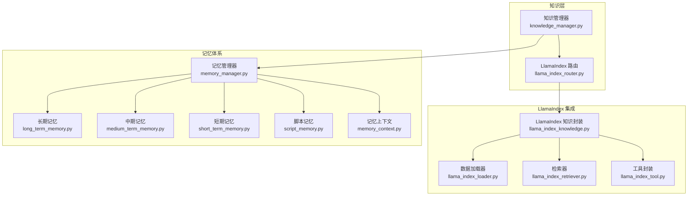
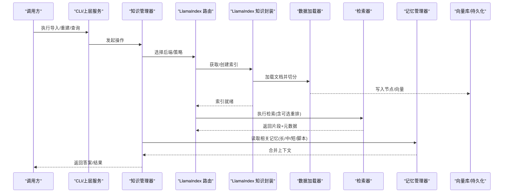
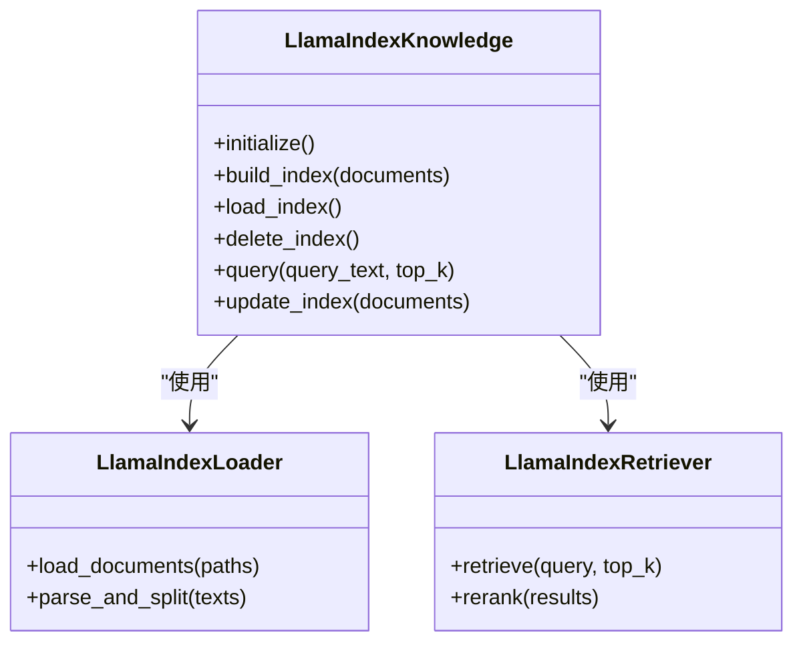
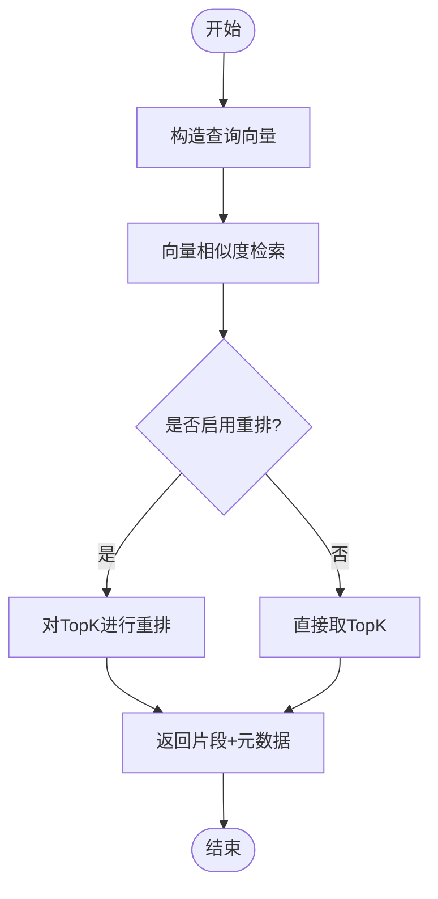
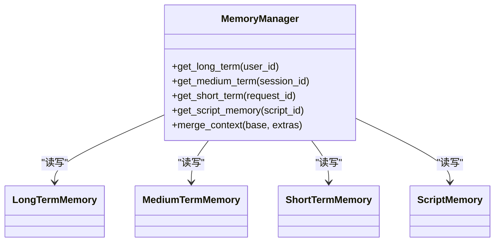
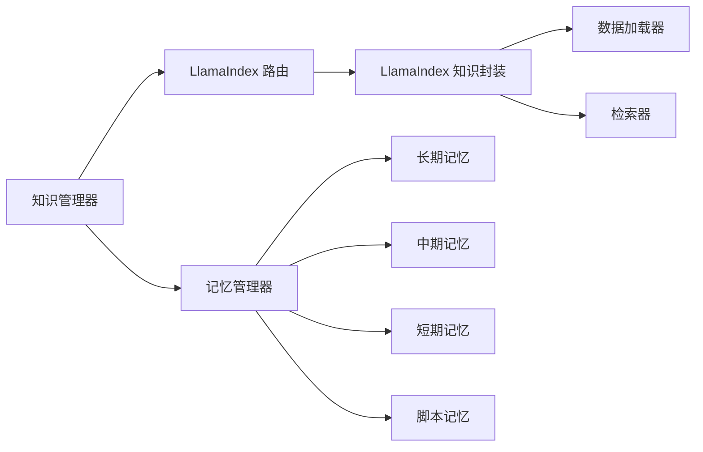

# 知识库系统

<cite>
**本文引用的文件**   
- [src/penshot/neopen/knowledge/llamaIndex/llama_index_knowledge.py](file://src/penshot/neopen/knowledge/llamaIndex/llama_index_knowledge.py)
- [src/penshot/neopen/knowledge/llamaIndex/llama_index_loader.py](file://src/penshot/neopen/knowledge/llamaIndex/llama_index_loader.py)
- [src/penshot/neopen/knowledge/llamaIndex/llama_index_retriever.py](file://src/penshot/neopen/knowledge/llamaIndex/llama_index_retriever.py)
- [src/penshot/neopen/knowledge/llamaIndex/llama_index_tool.py](file://src/penshot/neopen/knowledge/llamaIndex/llama_index_tool.py)
- [src/penshot/neopen/knowledge/llama_index_router.py](file://src/penshot/neopen/knowledge/llama_index_router.py)
- [src/penshot/neopen/knowledge/memory/long_term_memory.py](file://src/penshot/neopen/knowledge/memory/long_term_memory.py)
- [src/penshot/neopen/knowledge/memory/medium_term_memory.py](file://src/penshot/neopen/knowledge/memory/medium_term_memory.py)
- [src/penshot/neopen/knowledge/memory/short_term_memory.py](file://src/penshot/neopen/knowledge/memory/short_term_memory.py)
- [src/penshot/neopen/knowledge/memory/script_memory.py](file://src/penshot/neopen/knowledge/memory/script_memory.py)
- [src/penshot/neopen/knowledge/memory/memory_manager.py](file://src/penshot/neopen/knowledge/memory/memory_manager.py)
- [src/penshot/neopen/knowledge/memory/memory_context.py](file://src/penshot/neopen/knowledge/memory/memory_context.py)
- [src/penshot/neopen/knowledge/knowledge_manager.py](file://src/penshot/neopen/knowledge/knowledge_manager.py)
- [tests/knowledge/test_knowledge_base.py](file://tests/knowledge/test_knowledge_base.py)
- [tests/knowledge/test_vector_query.py](file://tests/knowledge/test_vector_query.py)
- [tests/knowledge/test_rerank.py](file://tests/knowledge/test_rerank.py)
- [tests/knowledge/diagnose_index.py](file://tests/knowledge/diagnose_index.py)
- [scripts/cli.py](file://scripts/cli.py)
</cite>

## 目录
1. [简介](#简介)
2. [项目结构](#项目结构)
3. [核心组件](#核心组件)
4. [架构总览](#架构总览)
5. [详细组件分析](#详细组件分析)
6. [依赖关系分析](#依赖关系分析)
7. [性能与优化](#性能与优化)
8. [故障排查指南](#故障排查指南)
9. [结论](#结论)
10. [附录](#附录)

## 简介
本文件面向“基于LlamaIndex的知识检索增强生成（RAG）”实现，系统性阐述向量数据库集成、索引管理、记忆体系（长期、短期、脚本记忆）、知识导入/更新/查询流程、检索优化与性能调优策略，以及知识在AI决策中的应用场景。文档以代码级事实为依据，辅以可视化图示，帮助读者快速理解并高效使用知识库子系统。

## 项目结构
知识库子系统位于 src/penshot/neopen/knowledge 下，围绕 LlamaIndex 的 RAG 能力构建，包含：
- LlamaIndex 集成层：加载器、索引、检索器、工具封装
- 记忆体系：长期/中期/短期/脚本记忆及其管理器
- 统一入口：知识管理器与路由

图表来源
- [src/penshot/neopen/knowledge/knowledge_manager.py](file://src/penshot/neopen/knowledge/knowledge_manager.py)
- [src/penshot/neopen/knowledge/llama_index_router.py](file://src/penshot/neopen/knowledge/llama_index_router.py)
- [src/penshot/neopen/knowledge/llamaIndex/llama_index_knowledge.py](file://src/penshot/neopen/knowledge/llamaIndex/llama_index_knowledge.py)
- [src/penshot/neopen/knowledge/llamaIndex/llama_index_loader.py](file://src/penshot/neopen/knowledge/llamaIndex/llama_index_loader.py)
- [src/penshot/neopen/knowledge/llamaIndex/llama_index_retriever.py](file://src/penshot/neopen/knowledge/llamaIndex/llama_index_retriever.py)
- [src/penshot/neopen/knowledge/llamaIndex/llama_index_tool.py](file://src/penshot/neopen/knowledge/llamaIndex/llama_index_tool.py)
- [src/penshot/neopen/knowledge/memory/long_term_memory.py](file://src/penshot/neopen/knowledge/memory/long_term_memory.py)
- [src/penshot/neopen/knowledge/memory/medium_term_memory.py](file://src/penshot/neopen/knowledge/memory/medium_term_memory.py)
- [src/penshot/neopen/knowledge/memory/short_term_memory.py](file://src/penshot/neopen/knowledge/memory/short_term_memory.py)
- [src/penshot/neopen/knowledge/memory/script_memory.py](file://src/penshot/neopen/knowledge/memory/script_memory.py)
- [src/penshot/neopen/knowledge/memory/memory_manager.py](file://src/penshot/neopen/knowledge/memory/memory_manager.py)
- [src/penshot/neopen/knowledge/memory/memory_context.py](file://src/penshot/neopen/knowledge/memory/memory_context.py)

章节来源
- [src/penshot/neopen/knowledge/knowledge_manager.py](file://src/penshot/neopen/knowledge/knowledge_manager.py)
- [src/penshot/neopen/knowledge/llama_index_router.py](file://src/penshot/neopen/knowledge/llama_index_router.py)

## 核心组件
- LlamaIndex 知识封装：负责初始化 Embedding/LLM、构建索引、维护持久化存储、提供检索接口
- 数据加载器：将多源文档解析为结构化节点，支持增量与全量重建
- 检索器：组合向量相似度与可选重排（Rerank），返回带元数据的片段
- 工具封装：将检索能力暴露为可被工作流或Agent调用的工具
- 记忆管理器：统一管理长/中/短/脚本记忆的生命周期与上下文注入
- 记忆模型：定义记忆条目结构与生命周期策略

章节来源
- [src/penshot/neopen/knowledge/llamaIndex/llama_index_knowledge.py](file://src/penshot/neopen/knowledge/llamaIndex/llama_index_knowledge.py)
- [src/penshot/neopen/knowledge/llamaIndex/llama_index_loader.py](file://src/penshot/neopen/knowledge/llamaIndex/llama_index_loader.py)
- [src/penshot/neopen/knowledge/llamaIndex/llama_index_retriever.py](file://src/penshot/neopen/knowledge/llamaIndex/llama_index_retriever.py)
- [src/penshot/neopen/knowledge/llamaIndex/llama_index_tool.py](file://src/penshot/neopen/knowledge/llamaIndex/llama_index_tool.py)
- [src/penshot/neopen/knowledge/memory/memory_manager.py](file://src/penshot/neopen/knowledge/memory/memory_manager.py)
- [src/penshot/neopen/knowledge/memory/memory_models.py](file://src/penshot/neopen/knowledge/memory/memory_models.py)

## 架构总览
下图展示从“知识导入”到“检索增强生成”的关键路径，以及记忆体系如何参与上下文组装。

图表来源
- [src/penshot/neopen/knowledge/knowledge_manager.py](file://src/penshot/neopen/knowledge/knowledge_manager.py)
- [src/penshot/neopen/knowledge/llama_index_router.py](file://src/penshot/neopen/knowledge/llama_index_router.py)
- [src/penshot/neopen/knowledge/llamaIndex/llama_index_knowledge.py](file://src/penshot/neopen/knowledge/llamaIndex/llama_index_knowledge.py)
- [src/penshot/neopen/knowledge/llamaIndex/llama_index_loader.py](file://src/penshot/neopen/knowledge/llamaIndex/llama_index_loader.py)
- [src/penshot/neopen/knowledge/llamaIndex/llama_index_retriever.py](file://src/penshot/neopen/knowledge/llamaIndex/llama_index_retriever.py)
- [src/penshot/neopen/knowledge/memory/memory_manager.py](file://src/penshot/neopen/knowledge/memory/memory_manager.py)

## 详细组件分析

### LlamaIndex 知识封装（索引与持久化）
职责
- 初始化 Embedding/LLM 配置
- 构建/加载本地或远程索引
- 管理索引版本与迁移
- 对外暴露统一的检索接口

关键设计点
- 索引持久化：通过本地目录或云存储保存索引快照，避免重复构建
- 配置驱动：Embedding 模型、维度、距离度量等参数集中管理
- 容错与回滚：构建失败时保留上一可用版本

图表来源
- [src/penshot/neopen/knowledge/llamaIndex/llama_index_knowledge.py](file://src/penshot/neopen/knowledge/llamaIndex/llama_index_knowledge.py)
- [src/penshot/neopen/knowledge/llamaIndex/llama_index_loader.py](file://src/penshot/neopen/knowledge/llamaIndex/llama_index_loader.py)
- [src/penshot/neopen/knowledge/llamaIndex/llama_index_retriever.py](file://src/penshot/neopen/knowledge/llamaIndex/llama_index_retriever.py)

章节来源
- [src/penshot/neopen/knowledge/llamaIndex/llama_index_knowledge.py](file://src/penshot/neopen/knowledge/llamaIndex/llama_index_knowledge.py)
- [src/penshot/neopen/knowledge/llamaIndex/llama_index_loader.py](file://src/penshot/neopen/knowledge/llamaIndex/llama_index_loader.py)
- [src/penshot/neopen/knowledge/llamaIndex/llama_index_retriever.py](file://src/penshot/neopen/knowledge/llamaIndex/llama_index_retriever.py)

### 数据加载器（文档解析与切分）
职责
- 读取多格式文档
- 文本清洗与标准化
- 按语义/固定长度进行分块
- 输出 LlamaIndex 兼容的节点集合

要点
- 支持增量加载：仅处理新增/变更文档
- 元数据保留：来源、时间戳、标签等便于溯源与过滤

章节来源
- [src/penshot/neopen/knowledge/llamaIndex/llama_index_loader.py](file://src/penshot/neopen/knowledge/llamaIndex/llama_index_loader.py)

### 检索器（相似度检索与重排）
职责
- 基于向量相似度召回候选片段
- 可选引入重排器提升相关性
- 返回带元数据的片段列表

图表来源
- [src/penshot/neopen/knowledge/llamaIndex/llama_index_retriever.py](file://src/penshot/neopen/knowledge/llamaIndex/llama_index_retriever.py)

章节来源
- [src/penshot/neopen/knowledge/llamaIndex/llama_index_retriever.py](file://src/penshot/neopen/knowledge/llamaIndex/llama_index_retriever.py)

### 工具封装（供工作流/Agent调用）
职责
- 将检索能力包装为标准化工具
- 提供参数校验、错误处理与日志记录
- 与工作流状态/记忆系统集成

章节来源
- [src/penshot/neopen/knowledge/llamaIndex/llama_index_tool.py](file://src/penshot/neopen/knowledge/llamaIndex/llama_index_tool.py)

### 记忆体系（长期/中期/短期/脚本记忆）
职责
- 长期记忆：跨会话沉淀的关键事实与偏好
- 中期记忆：任务/会话级别的上下文摘要
- 短期记忆：当前请求相关的即时上下文
- 脚本记忆：与剧本/分镜/拍摄计划相关的结构化知识

图表来源
- [src/penshot/neopen/knowledge/memory/memory_manager.py](file://src/penshot/neopen/knowledge/memory/memory_manager.py)
- [src/penshot/neopen/knowledge/memory/long_term_memory.py](file://src/penshot/neopen/knowledge/memory/long_term_memory.py)
- [src/penshot/neopen/knowledge/memory/medium_term_memory.py](file://src/penshot/neopen/knowledge/memory/medium_term_memory.py)
- [src/penshot/neopen/knowledge/memory/short_term_memory.py](file://src/penshot/neopen/knowledge/memory/short_term_memory.py)
- [src/penshot/neopen/knowledge/memory/script_memory.py](file://src/penshot/neopen/knowledge/memory/script_memory.py)

章节来源
- [src/penshot/neopen/knowledge/memory/memory_manager.py](file://src/penshot/neopen/knowledge/memory/memory_manager.py)
- [src/penshot/neopen/knowledge/memory/long_term_memory.py](file://src/penshot/neopen/knowledge/memory/long_term_memory.py)
- [src/penshot/neopen/knowledge/memory/medium_term_memory.py](file://src/penshot/neopen/knowledge/memory/medium_term_memory.py)
- [src/penshot/neopen/knowledge/memory/short_term_memory.py](file://src/penshot/neopen/knowledge/memory/short_term_memory.py)
- [src/penshot/neopen/knowledge/memory/script_memory.py](file://src/penshot/neopen/knowledge/memory/script_memory.py)
- [src/penshot/neopen/knowledge/memory/memory_context.py](file://src/penshot/neopen/knowledge/memory/memory_context.py)

### 知识管理器与路由
职责
- 统一入口：协调 LlamaIndex 与记忆体系
- 路由策略：根据查询类型/领域选择合适索引或记忆
- 编排流程：串联导入、重建、检索、记忆融合

章节来源
- [src/penshot/neopen/knowledge/knowledge_manager.py](file://src/penshot/neopen/knowledge/knowledge_manager.py)
- [src/penshot/neopen/knowledge/llama_index_router.py](file://src/penshot/neopen/knowledge/llama_index_router.py)

## 依赖关系分析
- 内部依赖
  - 知识管理器依赖 LlamaIndex 路由与记忆管理器
  - LlamaIndex 知识封装依赖加载器与检索器
  - 工具封装依赖知识封装与记忆管理器
- 外部依赖
  - LlamaIndex 生态（索引、嵌入、检索、持久化）
  - 向量数据库（由 LlamaIndex 抽象层对接）
  - 可选重排器（用于提升检索质量）

图表来源
- [src/penshot/neopen/knowledge/knowledge_manager.py](file://src/penshot/neopen/knowledge/knowledge_manager.py)
- [src/penshot/neopen/knowledge/llama_index_router.py](file://src/penshot/neopen/knowledge/llama_index_router.py)
- [src/penshot/neopen/knowledge/llamaIndex/llama_index_knowledge.py](file://src/penshot/neopen/knowledge/llamaIndex/llama_index_knowledge.py)
- [src/penshot/neopen/knowledge/llamaIndex/llama_index_loader.py](file://src/penshot/neopen/knowledge/llamaIndex/llama_index_loader.py)
- [src/penshot/neopen/knowledge/llamaIndex/llama_index_retriever.py](file://src/penshot/neopen/knowledge/llamaIndex/llama_index_retriever.py)
- [src/penshot/neopen/knowledge/memory/memory_manager.py](file://src/penshot/neopen/knowledge/memory/memory_manager.py)

## 性能与优化
- 索引构建
  - 优先使用增量构建，减少重复计算
  - 合理设置分块大小与重叠，平衡召回率与延迟
- 检索阶段
  - 调整 top_k 与阈值，结合重排器提升准确率
  - 缓存热点查询结果，降低重复开销
- 向量库
  - 选择合适的距离度量与索引算法（如 HNSW/IVF）
  - 定期重建索引以维持检索质量
- 资源与并发
  - 控制并发度，避免内存峰值过高
  - 对大文档采用流式解析与分批写入

[本节为通用指导，不直接分析具体文件]

## 故障排查指南
- 索引不可用/损坏
  - 检查索引目录权限与磁盘空间
  - 使用诊断工具定位问题并重建索引
- 检索结果不相关
  - 验证 Embedding 模型与维度配置
  - 调整 top_k、阈值与重排器权重
  - 检查文档切分策略与元数据完整性
- 记忆缺失/不一致
  - 核对记忆键空间与过期策略
  - 确认上下文合并顺序与去重逻辑

章节来源
- [tests/knowledge/diagnose_index.py](file://tests/knowledge/diagnose_index.py)
- [tests/knowledge/test_knowledge_base.py](file://tests/knowledge/test_knowledge_base.py)
- [tests/knowledge/test_vector_query.py](file://tests/knowledge/test_vector_query.py)
- [tests/knowledge/test_rerank.py](file://tests/knowledge/test_rerank.py)

## 结论
本知识库系统以 LlamaIndex 为核心，构建了“加载—索引—检索—记忆融合”的完整链路。通过模块化设计与清晰的职责划分，系统在可扩展性、可维护性与性能之间取得良好平衡。配合合理的索引策略、检索优化与记忆管理，可有效支撑 AI 决策中的知识增强需求。

## 附录

### 知识导入与更新
- 导入流程
  - 准备文档集与元数据
  - 调用加载器解析与切分
  - 构建或增量更新索引
  - 验证索引健康度
- 更新策略
  - 增量更新：仅处理新增/变更文档
  - 全量重建：在大规模变更后触发
  - 灰度切换：新旧索引并行，逐步切换流量

章节来源
- [src/penshot/neopen/knowledge/llamaIndex/llama_index_loader.py](file://src/penshot/neopen/knowledge/llamaIndex/llama_index_loader.py)
- [src/penshot/neopen/knowledge/llamaIndex/llama_index_knowledge.py](file://src/penshot/neopen/knowledge/llamaIndex/llama_index_knowledge.py)

### 知识查询方法
- 基础检索：向量相似度召回
- 混合检索：结合关键词/元数据过滤
- 重排增强：对候选片段进行二次排序
- 记忆融合：将长/中/短/脚本记忆注入提示上下文

章节来源
- [src/penshot/neopen/knowledge/llamaIndex/llama_index_retriever.py](file://src/penshot/neopen/knowledge/llamaIndex/llama_index_retriever.py)
- [src/penshot/neopen/knowledge/memory/memory_manager.py](file://src/penshot/neopen/knowledge/memory/memory_manager.py)

### 在 AI 决策中的应用场景
- 内容创作辅助：依据历史风格与规则生成脚本/分镜
- 拍摄计划制定：结合脚本记忆与经验知识规划镜头时长与调度
- 质量审核：引用规则与案例片段进行一致性评估
- 智能问答：基于知识库回答业务相关问题

章节来源
- [src/penshot/neopen/knowledge/llamaIndex/llama_index_tool.py](file://src/penshot/neopen/knowledge/llamaIndex/llama_index_tool.py)
- [src/penshot/neopen/knowledge/memory/script_memory.py](file://src/penshot/neopen/knowledge/memory/script_memory.py)

### 命令行与测试
- CLI 示例：提供导入、重建、查询等常用命令
- 单元测试：覆盖索引健康检查、向量检索、重排效果等

章节来源
- [scripts/cli.py](file://scripts/cli.py)
- [tests/knowledge/test_knowledge_base.py](file://tests/knowledge/test_knowledge_base.py)
- [tests/knowledge/test_vector_query.py](file://tests/knowledge/test_vector_query.py)
- [tests/knowledge/test_rerank.py](file://tests/knowledge/test_rerank.py)