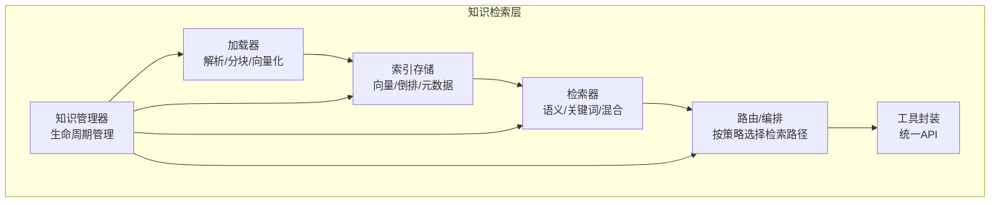
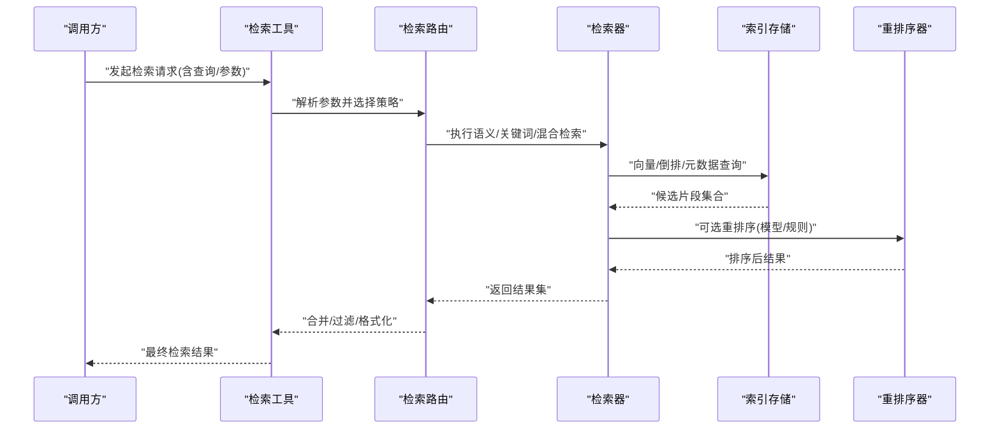
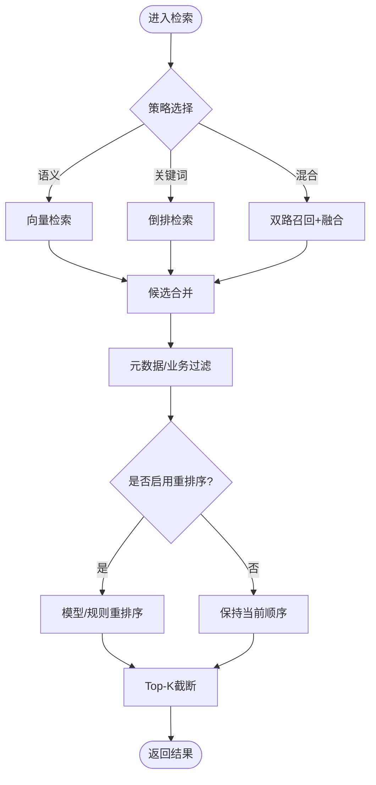
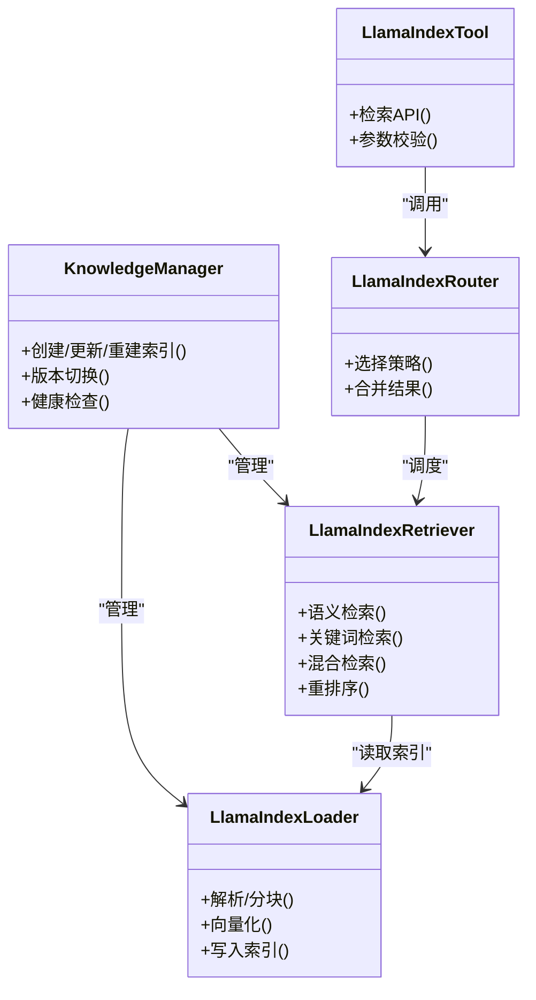

# 知识检索引擎

<cite>
**本文引用的文件**   
- [src/penshot/neopen/knowledge/llamaIndex/llama_index_knowledge.py](file://src/penshot/neopen/knowledge/llamaIndex/llama_index_knowledge.py)
- [src/penshot/neopen/knowledge/llamaIndex/llama_index_retriever.py](file://src/penshot/neopen/knowledge/llamaIndex/llama_index_retriever.py)
- [src/penshot/neopen/knowledge/llamaIndex/llama_index_loader.py](file://src/penshot/neopen/knowledge/llamaIndex/llama_index_loader.py)
- [src/penshot/neopen/knowledge/llamaIndex/llama_index_tool.py](file://src/penshot/neopen/knowledge/llamaIndex/llama_index_tool.py)
- [src/penshot/neopen/knowledge/llama_index_router.py](file://src/penshot/neopen/knowledge/llama_index_router.py)
- [src/penshot/neopen/knowledge/knowledge_manager.py](file://src/penshot/neopen/knowledge/knowledge_manager.py)
- [tests/knowledge/test_rerank.py](file://tests/knowledge/test_rerank.py)
- [tests/knowledge/test_rerank_quality.py](file://tests/knowledge/test_rerank_quality.py)
- [tests/knowledge/test_vector_query.py](file://tests/knowledge/test_vector_query.py)
- [scripts/download_reranker.py](file://scripts/download_reranker.py)
</cite>

## 目录
1. [简介](#简介)
2. [项目结构](#项目结构)
3. [核心组件](#核心组件)
4. [架构总览](#架构总览)
5. [详细组件分析](#详细组件分析)
6. [依赖关系分析](#依赖关系分析)
7. [性能与缓存](#性能与缓存)
8. [检索质量评估与调试](#检索质量评估与调试)
9. [结论](#结论)
10. [附录：参数调优与场景优化](#附录参数调优与场景优化)

## 简介
本文件面向“知识检索引擎”的深入文档，聚焦多模态知识的检索算法与排序策略，覆盖语义搜索、关键词匹配与混合检索的实现原理；系统化说明检索参数调优、相关性评分与结果过滤机制；并给出检索性能优化、缓存策略与并发处理建议。同时提供检索质量评估方法与调试工具使用指南，以及在不同业务场景下的效果优化技巧。

## 项目结构
围绕知识检索的核心代码位于 knowledge 子模块中，采用分层组织：
- 数据加载与索引构建：负责从多源（文本、结构化、可能的多模态元数据）抽取、分块、向量化与持久化索引
- 检索器：实现语义向量检索、关键词检索及混合检索策略
- 路由与编排：根据查询类型或配置选择具体检索路径
- 工具封装：对外暴露统一检索接口供上层 Agent/任务调用
- 管理器：统一生命周期管理（创建、更新、删除、重建索引等）

图表来源
- [src/penshot/neopen/knowledge/llamaIndex/llama_index_loader.py](file://src/penshot/neopen/knowledge/llamaIndex/llama_index_loader.py)
- [src/penshot/neopen/knowledge/llamaIndex/llama_index_retriever.py](file://src/penshot/neopen/knowledge/llamaIndex/llama_index_retriever.py)
- [src/penshot/neopen/knowledge/llama_index_router.py](file://src/penshot/neopen/knowledge/llama_index_router.py)
- [src/penshot/neopen/knowledge/llama_index_tool.py](file://src/penshot/neopen/knowledge/llamaIndex/llama_index_tool.py)
- [src/penshot/neopen/knowledge/knowledge_manager.py](file://src/penshot/neopen/knowledge/knowledge_manager.py)

章节来源
- [src/penshot/neopen/knowledge/llamaIndex/llama_index_loader.py](file://src/penshot/neopen/knowledge/llamaIndex/llama_index_loader.py)
- [src/penshot/neopen/knowledge/llamaIndex/llama_index_retriever.py](file://src/penshot/neopen/knowledge/llamaIndex/llama_index_retriever.py)
- [src/penshot/neopen/knowledge/llama_index_router.py](file://src/penshot/neopen/knowledge/llama_index_router.py)
- [src/penshot/neopen/knowledge/llama_index_tool.py](file://src/penshot/neopen/knowledge/llamaIndex/llama_index_tool.py)
- [src/penshot/neopen/knowledge/knowledge_manager.py](file://src/penshot/neopen/knowledge/knowledge_manager.py)

## 核心组件
- 加载器：负责数据接入、清洗、分块、元数据注入、向量化与索引写入
- 检索器：支持语义向量检索、关键词检索、混合检索与重排序
- 路由：依据查询特征或配置决定检索策略组合与权重
- 工具：将检索能力封装为可被Agent/工作流直接调用的工具
- 管理器：统一管理知识库的创建、更新、重建、版本切换与清理

章节来源
- [src/penshot/neopen/knowledge/llamaIndex/llama_index_loader.py](file://src/penshot/neopen/knowledge/llamaIndex/llama_index_loader.py)
- [src/penshot/neopen/knowledge/llamaIndex/llama_index_retriever.py](file://src/penshot/neopen/knowledge/llamaIndex/llama_index_retriever.py)
- [src/penshot/neopen/knowledge/llama_index_router.py](file://src/penshot/neopen/knowledge/llama_index_router.py)
- [src/penshot/neopen/knowledge/llama_index_tool.py](file://src/penshot/neopen/knowledge/llamaIndex/llama_index_tool.py)
- [src/penshot/neopen/knowledge/knowledge_manager.py](file://src/penshot/neopen/knowledge/knowledge_manager.py)

## 架构总览
下图展示从查询到结果的端到端流程，包括语义搜索、关键词匹配、混合检索与重排序的关键节点。

图表来源
- [src/penshot/neopen/knowledge/llamaIndex/llama_index_tool.py](file://src/penshot/neopen/knowledge/llamaIndex/llama_index_tool.py)
- [src/penshot/neopen/knowledge/llama_index_router.py](file://src/penshot/neopen/knowledge/llama_index_router.py)
- [src/penshot/neopen/knowledge/llamaIndex/llama_index_retriever.py](file://src/penshot/neopen/knowledge/llamaIndex/llama_index_retriever.py)

## 详细组件分析

### 加载器与索引构建
职责
- 数据接入：支持多种数据源（文本、结构化、可能的多模态元数据）
- 预处理：清洗、规范化、去噪、语言检测与分词
- 分块：按语义/长度/段落进行自适应分块，保留上下文窗口
- 元数据：为每个片段附加来源、时间戳、标签、模态标识等
- 向量化：调用嵌入模型生成向量，写入向量索引
- 倒排：维护关键词倒排索引以支撑关键词检索
- 索引持久化：落盘或远程存储，支持增量更新与版本管理

关键设计点
- 分块策略影响召回率与精度，需结合下游检索器与重排序器协同调参
- 元数据字段应覆盖业务维度，便于后续过滤与排序
- 向量化与倒排索引的同步更新需要事务性或幂等写入

章节来源
- [src/penshot/neopen/knowledge/llamaIndex/llama_index_loader.py](file://src/penshot/neopen/knowledge/llamaIndex/llama_index_loader.py)

### 检索器：语义搜索、关键词匹配与混合检索
职责
- 语义搜索：基于向量相似度检索，支持Top-K、阈值过滤、元数据过滤
- 关键词匹配：基于倒排索引的布尔/短语/模糊匹配，支持权重与位置信息
- 混合检索：融合语义与关键词得分，支持加权融合、RRF、学习排序
- 重排序：对候选集进行精细化排序，提升Top-N质量

算法要点
- 语义相似度：余弦相似度、内积、归一化温度系数
- 关键词匹配：TF-IDF/BM25风格打分、同义词扩展、拼写纠错
- 混合融合：线性加权、RRF、两阶段召回+精排
- 重排序：跨模态/领域微调模型或规则模型，支持多信号融合

图表来源
- [src/penshot/neopen/knowledge/llamaIndex/llama_index_retriever.py](file://src/penshot/neopen/knowledge/llamaIndex/llama_index_retriever.py)

章节来源
- [src/penshot/neopen/knowledge/llamaIndex/llama_index_retriever.py](file://src/penshot/neopen/knowledge/llamaIndex/llama_index_retriever.py)

### 路由与编排
职责
- 根据查询意图、领域、语言、资源约束动态选择检索策略
- 控制各子检索器的权重、Top-K、阈值与重排序开关
- 聚合多路结果，去重、打散、分页与格式化

章节来源
- [src/penshot/neopen/knowledge/llama_index_router.py](file://src/penshot/neopen/knowledge/llama_index_router.py)

### 工具封装
职责
- 对外暴露统一的检索API，屏蔽内部复杂度
- 参数校验、日志埋点、错误码标准化
- 与上层Agent/工作流集成，支持异步调用

章节来源
- [src/penshot/neopen/knowledge/llama_index_tool.py](file://src/penshot/neopen/knowledge/llamaIndex/llama_index_tool.py)

### 知识管理器
职责
- 知识库生命周期：初始化、导入、更新、重建、归档
- 索引版本管理：灰度切换、回滚、一致性校验
- 监控与审计：构建耗时、索引大小、错误统计

章节来源
- [src/penshot/neopen/knowledge/knowledge_manager.py](file://src/penshot/neopen/knowledge/knowledge_manager.py)

## 依赖关系分析
- 加载器依赖嵌入模型与存储后端
- 检索器依赖向量索引与倒排索引
- 路由依赖配置与策略库
- 工具依赖路由与检索器
- 管理器协调加载器、索引与检索器

图表来源
- [src/penshot/neopen/knowledge/knowledge_manager.py](file://src/penshot/neopen/knowledge/knowledge_manager.py)
- [src/penshot/neopen/knowledge/llamaIndex/llama_index_loader.py](file://src/penshot/neopen/knowledge/llamaIndex/llama_index_loader.py)
- [src/penshot/neopen/knowledge/llamaIndex/llama_index_retriever.py](file://src/penshot/neopen/knowledge/llamaIndex/llama_index_retriever.py)
- [src/penshot/neopen/knowledge/llama_index_router.py](file://src/penshot/neopen/knowledge/llama_index_router.py)
- [src/penshot/neopen/knowledge/llama_index_tool.py](file://src/penshot/neopen/knowledge/llamaIndex/llama_index_tool.py)

## 性能与缓存
- 索引层面
  - 向量索引：合理设置维度、分区与HNSW/IVF参数，平衡召回与延迟
  - 倒排索引：压缩词典、合并小段、定期重建以提升查询吞吐
- 查询层面
  - 预取与并行：多路召回并行执行，减少P99延迟
  - 早停与剪枝：在早期阶段剔除低分候选，降低重排序压力
- 缓存策略
  - 查询级缓存：对高频查询做结果缓存，注意TTL与失效策略
  - 中间结果缓存：缓存向量/倒排中间结果，避免重复计算
  - 热点片段缓存：对Top-K片段做本地缓存，加速重排序
- 并发处理
  - 线程池/进程池：限制并发度，防止OOM与资源争用
  - 背压与限流：保护外部服务（嵌入模型、重排序模型）
- 资源与成本
  - 批量向量化：提高GPU利用率，降低冷启动开销
  - 模型复用：共享嵌入与重排序模型实例，减少加载次数

[本节为通用性能建议，不直接分析具体文件]

## 检索质量评估与调试
- 离线评估
  - 指标：Recall@K、NDCG@K、Precision@K、MRR、平均精度均值
  - 数据集：构造带标注的查询-相关片段对，覆盖不同领域与语言
  - 重排序对比：基线（BM25/向量）vs 模型重排序，显著性检验
- 在线评估
  - A/B测试：对比不同策略的点击率、转化率、停留时长
  - 反馈闭环：收集用户显式反馈（点赞/踩），用于迭代训练
- 调试工具
  - 诊断脚本：查看索引状态、分块分布、向量聚类
  - 可视化：检索结果高亮、分数分布、召回路径追踪
  - 回归测试：固定种子与数据快照，确保变更不劣化质量

章节来源
- [tests/knowledge/test_rerank.py](file://tests/knowledge/test_rerank.py)
- [tests/knowledge/test_rerank_quality.py](file://tests/knowledge/test_rerank_quality.py)
- [tests/knowledge/test_vector_query.py](file://tests/knowledge/test_vector_query.py)

## 结论
本知识检索引擎通过“语义+关键词+重排序”的多阶段架构，兼顾召回广度与排序精度。配合合理的索引构建、缓存与并发策略，可在大规模多模态知识上实现稳定高效的检索体验。持续的质量评估与A/B验证是保障长期效果的关键。

## 附录：参数调优与场景优化
- 参数调优清单
  - 语义检索：Top-K、相似度阈值、归一化温度、元数据过滤条件
  - 关键词检索：同义词扩展、拼写纠错、短语匹配、权重分配
  - 混合检索：两路召回Top-K、融合权重、RRF常数、学习排序特征
  - 重排序：模型选择、输入窗口、打分阈值、多样性惩罚
- 缓存与并发
  - 查询缓存命中率目标、TTL策略、失效触发
  - 并发上限、队列长度、超时与重试策略
- 场景优化技巧
  - 短文本问答：强化关键词匹配与短语匹配，适当提高Top-K
  - 长文档定位：增大分块粒度，引入段落/标题元数据，增强重排序
  - 多模态内容：利用图像/视频元数据（时间轴、标签、OCR）参与过滤与排序
  - 实时增量：增量索引写入、热更新、灰度发布与快速回滚
- 重排序模型下载与部署
  - 使用脚本下载所需重排序模型，确保环境一致性与版本锁定

章节来源
- [scripts/download_reranker.py](file://scripts/download_reranker.py)