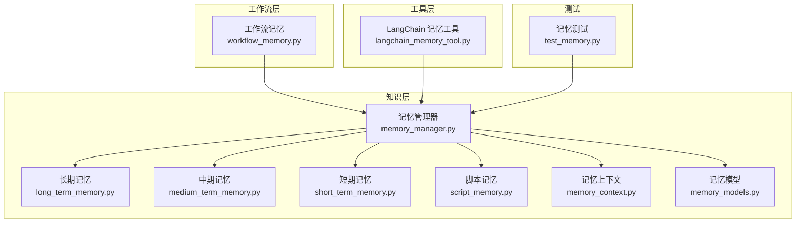
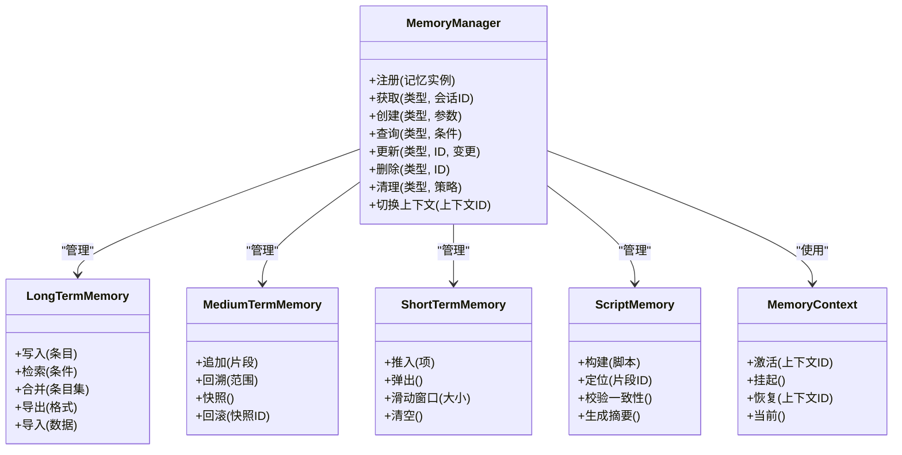
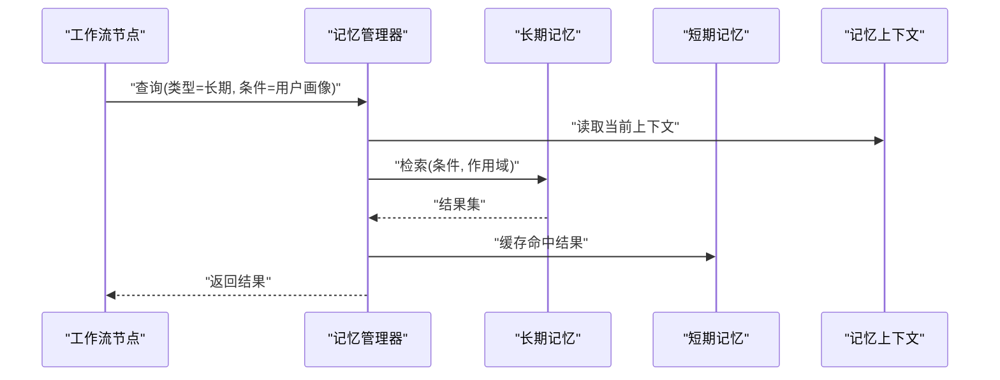
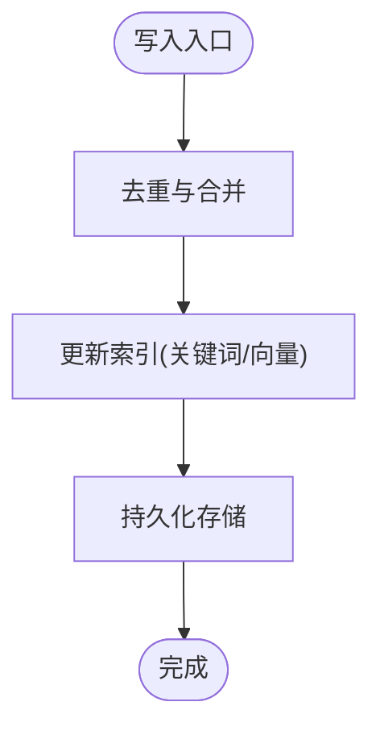
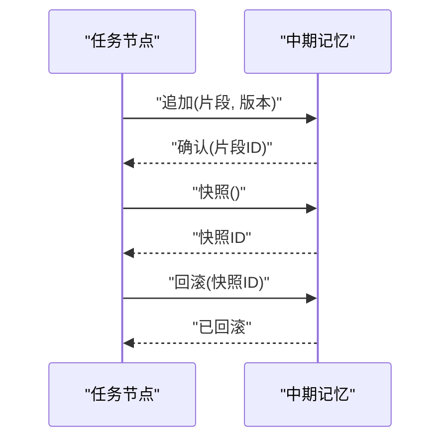
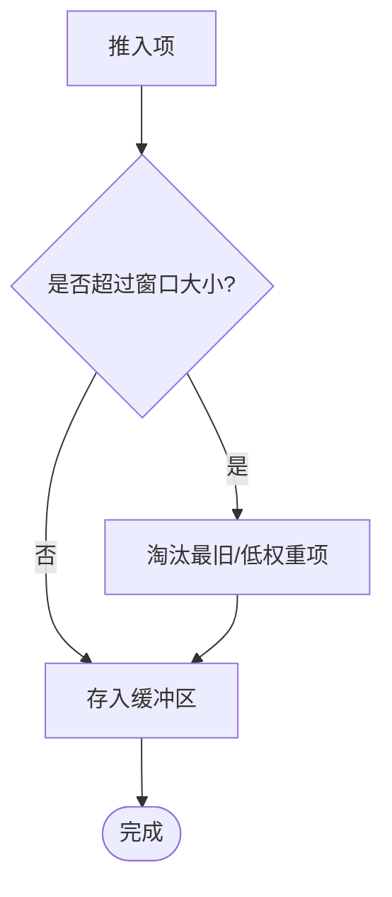
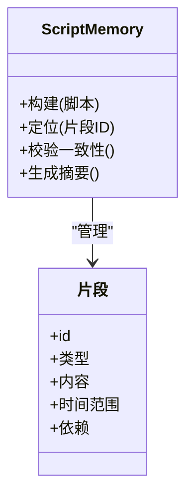
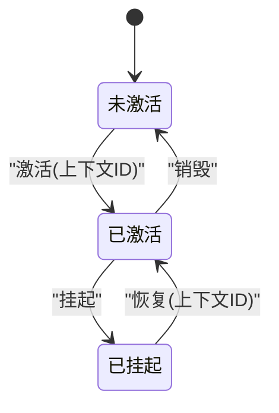
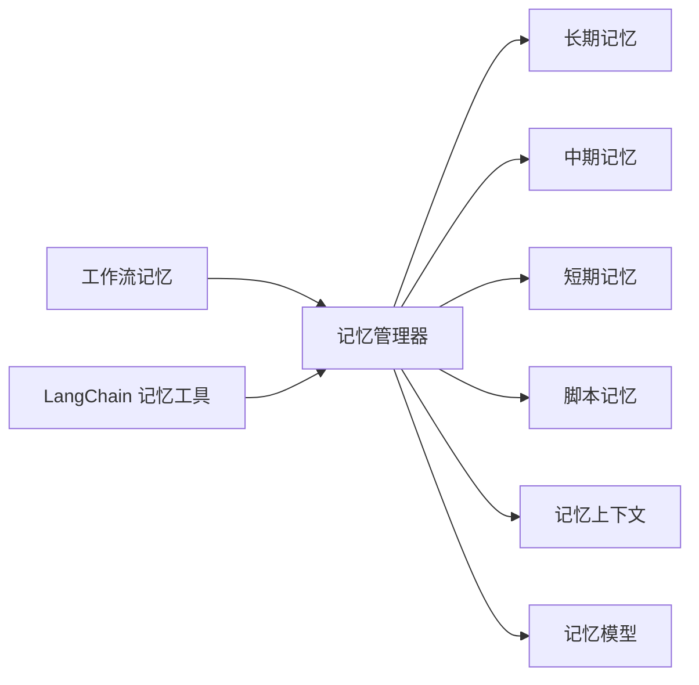

# 记忆管理系统

<cite>
**本文引用的文件**   
- [memory_manager.py](file://src/penshot/knowledge/memory/memory_manager.py)
- [long_term_memory.py](file://src/penshot/knowledge/memory/long_term_memory.py)
- [medium_term_memory.py](file://src/penshot/knowledge/memory/medium_term_memory.py)
- [short_term_memory.py](file://src/penshot/knowledge/memory/short_term_memory.py)
- [script_memory.py](file://src/penshot/knowledge/memory/script_memory.py)
- [memory_context.py](file://src/penshot/knowledge/memory/memory_context.py)
- [memory_models.py](file://src/penshot/knowledge/memory/memory_models.py)
- [workflow_memory.py](file://src/penshot/neopen/agent/workflow/workflow_memory.py)
- [langchain_memory_tool.py](file://src/penshot/tools/langchain_memory_tool.py)
- [test_memory.py](file://tests/task/test_memory.py)
</cite>

## 目录
1. [简介](#简介)
2. [项目结构](#项目结构)
3. [核心组件](#核心组件)
4. [架构总览](#架构总览)
5. [详细组件分析](#详细组件分析)
6. [依赖关系分析](#依赖关系分析)
7. [性能与容量控制](#性能与容量控制)
8. [故障排查指南](#故障排查指南)
9. [结论](#结论)
10. [附录](#附录)

## 简介
本文件系统化梳理记忆管理子系统，覆盖长期记忆、短期记忆与脚本记忆的设计理念、实现机制与使用方式。重点说明：
- 不同记忆类型的存储策略、生命周期管理与数据持久化方案
- 记忆的创建、查询、更新与清理操作
- 记忆上下文的管理与切换机制
- 容量控制、过期策略与性能优化方法
- 在对话连贯性与个性化服务中的应用示例

## 项目结构
记忆相关代码位于 knowledge/memory 模块，并由工作流与工具层进行集成。

图表来源
- [memory_manager.py](file://src/penshot/knowledge/memory/memory_manager.py)
- [long_term_memory.py](file://src/penshot/knowledge/memory/long_term_memory.py)
- [medium_term_memory.py](file://src/penshot/knowledge/memory/medium_term_memory.py)
- [short_term_memory.py](file://src/penshot/knowledge/memory/short_term_memory.py)
- [script_memory.py](file://src/penshot/knowledge/memory/script_memory.py)
- [memory_context.py](file://src/penshot/knowledge/memory/memory_context.py)
- [memory_models.py](file://src/penshot/knowledge/memory/memory_models.py)
- [workflow_memory.py](file://src/penshot/neopen/agent/workflow/workflow_memory.py)
- [langchain_memory_tool.py](file://src/penshot/tools/langchain_memory_tool.py)
- [test_memory.py](file://tests/task/test_memory.py)

章节来源
- [memory_manager.py](file://src/penshot/knowledge/memory/memory_manager.py)
- [memory_context.py](file://src/penshot/knowledge/memory/memory_context.py)
- [memory_models.py](file://src/penshot/knowledge/memory/memory_models.py)
- [workflow_memory.py](file://src/penshot/neopen/agent/workflow/workflow_memory.py)
- [langchain_memory_tool.py](file://src/penshot/tools/langchain_memory_tool.py)
- [test_memory.py](file://tests/task/test_memory.py)

## 核心组件
- 记忆管理器（MemoryManager）
  - 职责：统一注册、路由与编排长期/中期/短期/脚本记忆；提供创建、查询、更新、删除、清理等接口；协调上下文切换与容量控制。
  - 关键能力：按会话/任务维度隔离；支持多后端存储抽象；可插拔的检索与重排策略。
- 长期记忆（LongTermMemory）
  - 职责：跨会话持久化用户画像、偏好、领域知识与历史摘要；支持向量检索与关键词索引。
  - 存储策略：结构化元数据 + 非结构化文本；可选持久化到外部存储（如对象存储或数据库）。
- 中期记忆（MediumTermMemory）
  - 职责：维护任务级或会话级中间结果、阶段摘要与决策轨迹；用于回溯与修复。
  - 存储策略：时间序列化的片段集合，带版本与依赖标记。
- 短期记忆（ShortTermMemory）
  - 职责：当前交互窗口内的上下文缓存，包括最近消息、注意力焦点与临时变量。
  - 存储策略：内存优先，具备滑动窗口与淘汰策略。
- 脚本记忆（ScriptMemory）
  - 职责：针对视频脚本的结构化记忆，包含镜头、动作、对白、时长等片段的关联与引用。
  - 存储策略：图/树形结构，便于跨片段一致性校验与回放。
- 记忆上下文（MemoryContext）
  - 职责：封装当前活跃的记忆视图、作用域与权限；提供上下文切换与快照恢复。
- 记忆模型（MemoryModels）
  - 职责：定义统一的记忆条目、标签、权重、时间戳、版本与元数据模式。

章节来源
- [memory_manager.py](file://src/penshot/knowledge/memory/memory_manager.py)
- [long_term_memory.py](file://src/penshot/knowledge/memory/long_term_memory.py)
- [medium_term_memory.py](file://src/penshot/knowledge/memory/medium_term_memory.py)
- [short_term_memory.py](file://src/penshot/knowledge/memory/short_term_memory.py)
- [script_memory.py](file://src/penshot/knowledge/memory/script_memory.py)
- [memory_context.py](file://src/penshot/knowledge/memory/memory_context.py)
- [memory_models.py](file://src/penshot/knowledge/memory/memory_models.py)

## 架构总览
记忆系统采用“管理器 + 多类型记忆 + 上下文”的分层设计，上层通过工作流与工具调用记忆能力。

图表来源
- [memory_manager.py](file://src/penshot/knowledge/memory/memory_manager.py)
- [long_term_memory.py](file://src/penshot/knowledge/memory/long_term_memory.py)
- [medium_term_memory.py](file://src/penshot/knowledge/memory/medium_term_memory.py)
- [short_term_memory.py](file://src/penshot/knowledge/memory/short_term_memory.py)
- [script_memory.py](file://src/penshot/knowledge/memory/script_memory.py)
- [memory_context.py](file://src/penshot/knowledge/memory/memory_context.py)

## 详细组件分析

### 记忆管理器（MemoryManager）
- 设计要点
  - 统一入口：对外暴露一致的 CRUD 与生命周期接口
  - 多后端适配：内部为各记忆类型提供存储抽象，便于替换底层实现
  - 上下文感知：基于当前上下文决定读写目标与作用域
- 关键流程
  - 创建：根据类型与参数初始化具体记忆实例并注册
  - 查询：组合过滤条件，委托对应记忆类型执行检索
  - 更新：增量合并与版本控制，保证幂等与可追溯
  - 清理：按策略（时间、数量、热度）触发回收
- 典型调用路径
  - 工作流节点通过管理器访问记忆
  - 工具层通过管理器将 LangChain 记忆桥接到业务逻辑

图表来源
- [memory_manager.py](file://src/penshot/knowledge/memory/memory_manager.py)
- [long_term_memory.py](file://src/penshot/knowledge/memory/long_term_memory.py)
- [short_term_memory.py](file://src/penshot/knowledge/memory/short_term_memory.py)
- [memory_context.py](file://src/penshot/knowledge/memory/memory_context.py)

章节来源
- [memory_manager.py](file://src/penshot/knowledge/memory/memory_manager.py)
- [memory_context.py](file://src/penshot/knowledge/memory/memory_context.py)

### 长期记忆（LongTermMemory）
- 设计理念
  - 跨会话持久化，支撑个性化与连续性
  - 混合检索：关键词 + 向量相似度 + 规则过滤
- 存储策略
  - 结构化元数据（标签、权重、时间戳、版本）
  - 非结构化内容（文本、摘要、嵌入）
  - 持久化：本地文件或外部存储（按需配置）
- 生命周期
  - 写入：去重、合并、索引更新
  - 检索：多路召回与重排
  - 清理：过期与低价值条目归档/删除
- 复杂度与优化
  - 写入 O(logN) 索引更新（近似）
  - 检索 O(K log N) 排序（K 为候选数）
  - 优化：批量写入、异步索引、缓存热点

图表来源
- [long_term_memory.py](file://src/penshot/knowledge/memory/long_term_memory.py)

章节来源
- [long_term_memory.py](file://src/penshot/knowledge/memory/long_term_memory.py)

### 中期记忆（MediumTermMemory）
- 设计理念
  - 任务/会话级中间态记录，支撑回溯与修复
- 存储策略
  - 时间序列片段，携带版本与依赖
  - 快照与回滚能力
- 生命周期
  - 追加：原子写入，附带元信息
  - 回溯：范围查询与差异对比
  - 清理：按任务结束或超时回收

图表来源
- [medium_term_memory.py](file://src/penshot/knowledge/memory/medium_term_memory.py)

章节来源
- [medium_term_memory.py](file://src/penshot/knowledge/memory/medium_term_memory.py)

### 短期记忆（ShortTermMemory）
- 设计理念
  - 当前交互窗口的快速存取，提升响应速度
- 存储策略
  - 内存队列/环形缓冲
  - 滑动窗口与淘汰策略（LRU/LFU）
- 生命周期
  - 推入/弹出：O(1)
  - 清空：会话结束或阈值触发

图表来源
- [short_term_memory.py](file://src/penshot/knowledge/memory/short_term_memory.py)

章节来源
- [short_term_memory.py](file://src/penshot/knowledge/memory/short_term_memory.py)

### 脚本记忆（ScriptMemory）
- 设计理念
  - 面向视频脚本的结构化记忆，维护镜头、动作、对白、时长等片段的关联
- 存储策略
  - 图/树结构，支持片段定位与一致性校验
- 生命周期
  - 构建：解析脚本并建立索引
  - 定位：按 ID/时间轴检索
  - 校验：跨片段一致性检查
  - 摘要：自动生成脚本摘要与统计

图表来源
- [script_memory.py](file://src/penshot/knowledge/memory/script_memory.py)

章节来源
- [script_memory.py](file://src/penshot/knowledge/memory/script_memory.py)

### 记忆上下文（MemoryContext）
- 设计理念
  - 封装当前活跃的记忆视图与作用域，支持切换与快照
- 关键能力
  - 激活/挂起/恢复
  - 当前上下文查询
  - 权限与作用域隔离

图表来源
- [memory_context.py](file://src/penshot/knowledge/memory/memory_context.py)

章节来源
- [memory_context.py](file://src/penshot/knowledge/memory/memory_context.py)

### 记忆模型（MemoryModels）
- 统一数据结构
  - 条目：ID、类型、内容、元数据、时间戳、版本、权重
  - 标签：分类、主题、实体
  - 索引键：用于检索与过滤
- 用途
  - 作为所有记忆类型的通用契约
  - 序列化/反序列化与迁移兼容

章节来源
- [memory_models.py](file://src/penshot/knowledge/memory/memory_models.py)

### 工作流集成（WorkflowMemory）
- 角色
  - 在工作流节点中便捷访问记忆
  - 将记忆读写纳入工作流状态机
- 典型用法
  - 在节点开始/结束时读写短期与中期记忆
  - 在长流程中持久化关键决策到长期记忆

章节来源
- [workflow_memory.py](file://src/penshot/neopen/agent/workflow/workflow_memory.py)

### 工具集成（LangChainMemoryTool）
- 角色
  - 将记忆能力以工具形式暴露给 LangChain 生态
  - 桥接外部 Agent 与内部记忆系统
- 典型用法
  - 在 Prompt 中动态注入记忆片段
  - 在函数调用中持久化对话历史与偏好

章节来源
- [langchain_memory_tool.py](file://src/penshot/tools/langchain_memory_tool.py)

## 依赖关系分析
- 组件耦合
  - 管理器对各类记忆弱耦合，通过统一接口解耦
  - 上下文独立于具体存储，仅关注作用域与切换
- 外部依赖
  - 工作流与工具层通过管理器间接依赖记忆实现
- 潜在循环
  - 避免记忆实现直接反向依赖管理器，保持单向依赖

图表来源
- [memory_manager.py](file://src/penshot/knowledge/memory/memory_manager.py)
- [workflow_memory.py](file://src/penshot/neopen/agent/workflow/workflow_memory.py)
- [langchain_memory_tool.py](file://src/penshot/tools/langchain_memory_tool.py)
- [long_term_memory.py](file://src/penshot/knowledge/memory/long_term_memory.py)
- [medium_term_memory.py](file://src/penshot/knowledge/memory/medium_term_memory.py)
- [short_term_memory.py](file://src/penshot/knowledge/memory/short_term_memory.py)
- [script_memory.py](file://src/penshot/knowledge/memory/script_memory.py)
- [memory_context.py](file://src/penshot/knowledge/memory/memory_context.py)
- [memory_models.py](file://src/penshot/knowledge/memory/memory_models.py)

章节来源
- [memory_manager.py](file://src/penshot/knowledge/memory/memory_manager.py)
- [workflow_memory.py](file://src/penshot/neopen/agent/workflow/workflow_memory.py)
- [langchain_memory_tool.py](file://src/penshot/tools/langchain_memory_tool.py)

## 性能与容量控制
- 容量控制
  - 短期记忆：滑动窗口大小、最大条目数、淘汰策略（LRU/LFU）
  - 中期记忆：任务级上限、快照数量限制
  - 长期记忆：单用户条目上限、归档阈值
- 过期策略
  - 基于时间戳的 TTL 清理
  - 基于权重的衰减与冷数据归档
- 性能优化
  - 批量写入与异步索引
  - 热点缓存与预取
  - 检索多路召回 + 轻量重排
  - 分片与分区存储（按会话/用户）

[本节为通用指导，不直接分析具体文件]

## 故障排查指南
- 常见问题
  - 上下文切换异常：检查上下文激活/挂起顺序与作用域
  - 检索结果不稳定：核对索引更新与缓存一致性
  - 清理未生效：确认过期策略与定时任务配置
- 诊断建议
  - 启用详细日志，记录关键操作的输入输出
  - 使用测试用例复现问题，聚焦最小场景
  - 检查存储后端连通性与配额

章节来源
- [test_memory.py](file://tests/task/test_memory.py)

## 结论
记忆管理系统通过“管理器 + 多类型记忆 + 上下文”的分层设计，实现了跨会话持久化、任务级回溯与交互级高效的综合能力。配合容量控制与过期策略，可在保证性能的同时提供个性化的对话体验与脚本处理能力。

[本节为总结性内容，不直接分析具体文件]

## 附录
- 使用示例（概念性）
  - 对话连贯性：在每次回复前从长期记忆中检索用户偏好与近期话题，结合短期记忆中的最近消息，生成更自然的回复
  - 个性化服务：将用户兴趣、历史选择与反馈写入长期记忆，并在后续推荐与内容生成中应用
  - 脚本处理：在脚本解析后构建脚本记忆，利用一致性校验保障镜头与对白衔接合理

[本节为概念性内容，不直接分析具体文件]