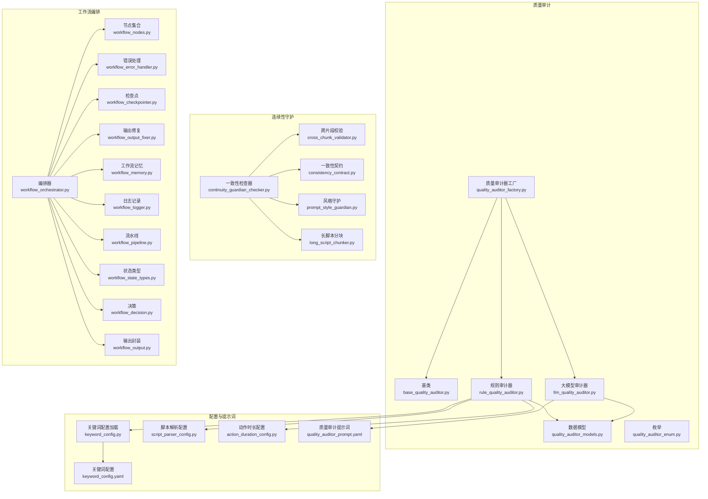
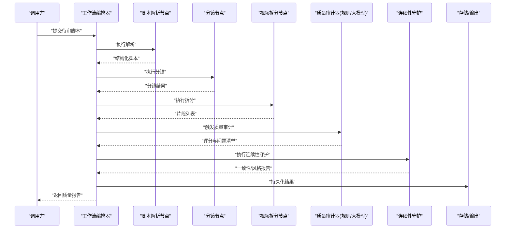
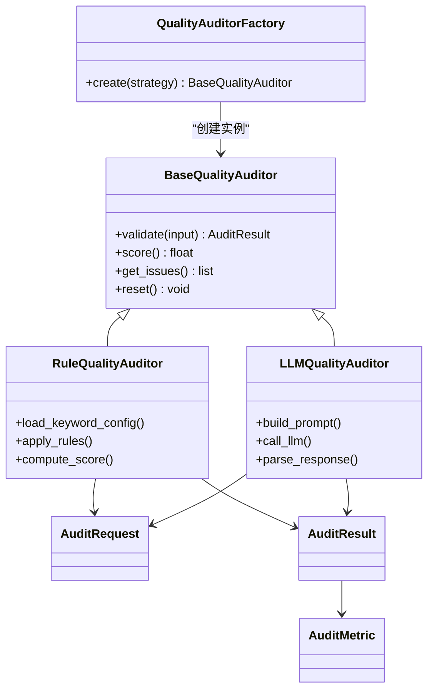
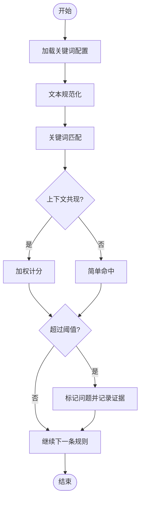
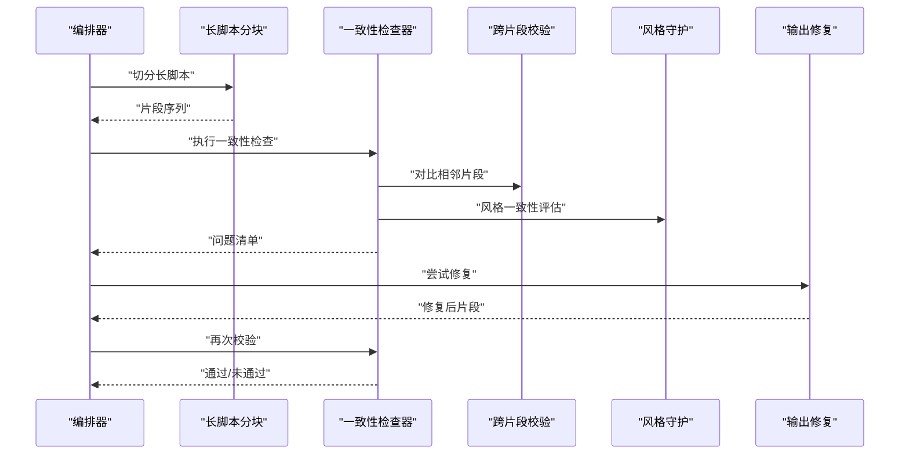
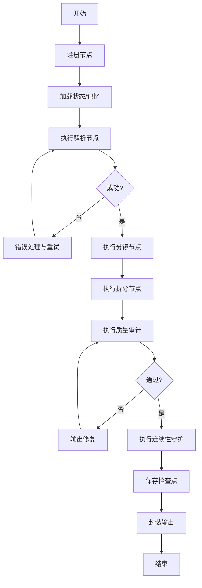
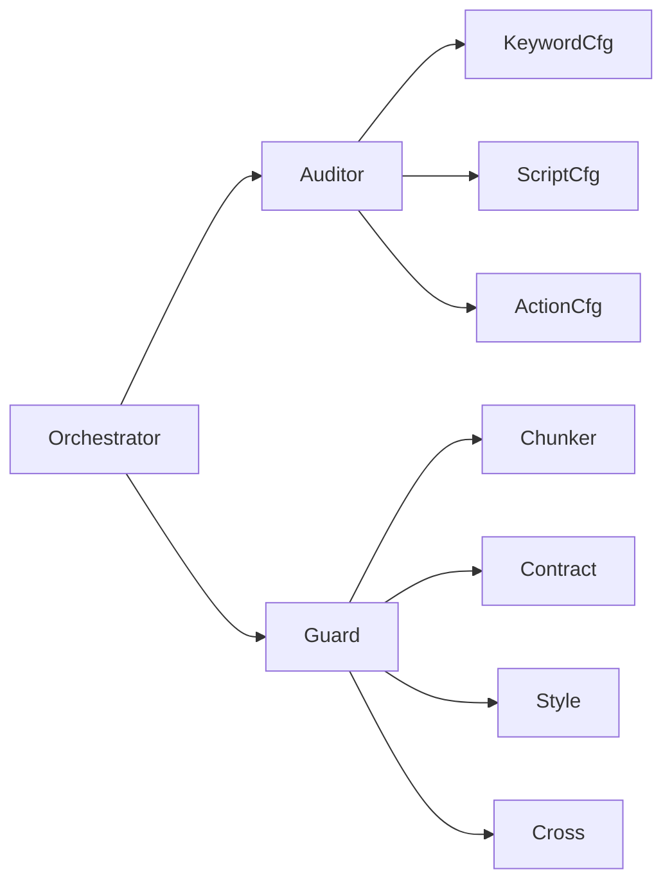

# 内容验证与质量检查

<cite>
**本文引用的文件**   
- [quality_auditor_factory.py](file://src/penshot/neopen/agent/quality_auditor/quality_auditor_factory.py)
- [base_quality_auditor.py](file://src/penshot/neopen/agent/quality_auditor/base_quality_auditor.py)
- [llm_quality_auditor.py](file://src/penshot/neopen/agent/quality_auditor/llm_quality_auditor.py)
- [rule_quality_auditor.py](file://src/penshot/neopen/agent/quality_auditor/rule_quality_auditor.py)
- [quality_auditor_models.py](file://src/penshot/neopen/agent/quality_auditor/quality_auditor_models.py)
- [quality_auditor_enum.py](file://src/penshot/neopen/agent/quality_auditor/quality_auditor_enum.py)
- [keyword_config.yaml](file://src/penshot/neopen/config/zh/keyword_config.yaml)
- [keyword_config.py](file://src/penshot/neopen/config/keyword_config.py)
- [script_parser_config.py](file://src/penshot/neopen/config/script_parser_config.py)
- [action_duration_config.py](file://src/penshot/neopen/config/action_duration_config.py)
- [continuity_guardian_checker.py](file://src/penshot/neopen/agent/continuity_guardian/continuity_guardian_checker.py)
- [cross_chunk_validator.py](file://src/penshot/neopen/agent/continuity_guardian/cross_chunk_validator.py)
- [consistency_contract.py](file://src/penshot/neopen/agent/continuity_guardian/consistency_contract.py)
- [prompt_style_guardian.py](file://src/penshot/neopen/agent/continuity_guardian/prompt_style_guardian.py)
- [long_script_chunker.py](file://src/penshot/neopen/agent/continuity_guardian/long_script_chunker.py)
- [workflow_orchestrator.py](file://src/penshot/neopen/agent/workflow/workflow_orchestrator.py)
- [workflow_nodes.py](file://src/penshot/neopen/agent/workflow/workflow_nodes.py)
- [workflow_error_handler.py](file://src/penshot/neopen/agent/workflow/workflow_error_handler.py)
- [workflow_checkpointer.py](file://src/penshot/neopen/agent/workflow/workflow_checkpointer.py)
- [workflow_output_fixer.py](file://src/penshot/neopen/agent/workflow/workflow_output_fixer.py)
- [workflow_memory.py](file://src/penshot/neopen/agent/workflow/workflow_memory.py)
- [workflow_logger.py](file://src/penshot/neopen/agent/workflow/workflow_logger.py)
- [workflow_pipeline.py](file://src/penshot/neopen/agent/workflow/workflow_pipeline.py)
- [workflow_state_types.py](file://src/penshot/neopen/agent/workflow/workflow_state_types.py)
- [workflow_decision.py](file://src/penshot/neopen/agent/workflow/workflow_decision.py)
- [workflow_output.py](file://src/penshot/neopen/agent/workflow/workflow_output.py)
- [quality_auditor_prompt.yaml](file://src/penshot/neopen/prompts/v1.x/zh/quality_auditor_prompt.yaml)
- [quality_auditor_result.json](file://examples/json_demo/quality_auditor_result.json)
- [test_continuity_guardian.py](file://tests/test_continuity_guardian.py)
</cite>

## 目录
1. [简介](#简介)
2. [项目结构](#项目结构)
3. [核心组件](#核心组件)
4. [架构总览](#架构总览)
5. [详细组件分析](#详细组件分析)
6. [依赖关系分析](#依赖关系分析)
7. [性能考虑](#性能考虑)
8. [故障排查指南](#故障排查指南)
9. [结论](#结论)
10. [附录](#附录)

## 简介
本文件围绕“内容验证与质量检查”主题，系统化梳理脚本内容的自动验证机制，包括语法检查、语义分析与完整性校验；说明关键词匹配与内容过滤规则的配置方法；解释质量评分算法与异常检测逻辑；提供自定义验证规则的开发指南（含接口与测试方法）；展示常见问题检测与修复建议；并覆盖批量验证与性能监控能力。文档同时给出实际使用案例与配置示例路径，帮助读者快速落地。

## 项目结构
与内容验证和质量检查相关的代码主要分布在以下模块：
- 质量审计器：实现基于规则与大模型的两种质量评估策略，并提供工厂化创建与统一模型定义
- 连续性守护：在长脚本跨片段场景下执行一致性、风格与断点校验
- 工作流编排：将解析、分镜、拆分、质量审计等节点串联，支持错误处理、记忆、检查点与输出修复
- 配置中心：集中管理关键词、脚本解析、动作时长等配置项
- 提示词模板：驱动大模型质量审计的提示词规范
- 示例与测试：包含质量审计结果样例与端到端测试用例

图表来源
- [quality_auditor_factory.py](file://src/penshot/neopen/agent/quality_auditor/quality_auditor_factory.py)
- [base_quality_auditor.py](file://src/penshot/neopen/agent/quality_auditor/base_quality_auditor.py)
- [rule_quality_auditor.py](file://src/penshot/neopen/agent/quality_auditor/rule_quality_auditor.py)
- [llm_quality_auditor.py](file://src/penshot/neopen/agent/quality_auditor/llm_quality_auditor.py)
- [quality_auditor_models.py](file://src/penshot/neopen/agent/quality_auditor/quality_auditor_models.py)
- [quality_auditor_enum.py](file://src/penshot/neopen/agent/quality_auditor/quality_auditor_enum.py)
- [continuity_guardian_checker.py](file://src/penshot/neopen/agent/continuity_guardian/continuity_guardian_checker.py)
- [cross_chunk_validator.py](file://src/penshot/neopen/agent/continuity_guardian/cross_chunk_validator.py)
- [consistency_contract.py](file://src/penshot/neopen/agent/continuity_guardian/consistency_contract.py)
- [prompt_style_guardian.py](file://src/penshot/neopen/agent/continuity_guardian/prompt_style_guardian.py)
- [long_script_chunker.py](file://src/penshot/neopen/agent/continuity_guardian/long_script_chunker.py)
- [workflow_orchestrator.py](file://src/penshot/neopen/agent/workflow/workflow_orchestrator.py)
- [workflow_nodes.py](file://src/penshot/neopen/agent/workflow/workflow_nodes.py)
- [workflow_error_handler.py](file://src/penshot/neopen/agent/workflow/workflow_error_handler.py)
- [workflow_checkpointer.py](file://src/penshot/neopen/agent/workflow/workflow_checkpointer.py)
- [workflow_output_fixer.py](file://src/penshot/neopen/agent/workflow/workflow_output_fixer.py)
- [workflow_memory.py](file://src/penshot/neopen/agent/workflow/workflow_memory.py)
- [workflow_logger.py](file://src/penshot/neopen/agent/workflow/workflow_logger.py)
- [workflow_pipeline.py](file://src/penshot/neopen/agent/workflow/workflow_pipeline.py)
- [workflow_state_types.py](file://src/penshot/neopen/agent/workflow/workflow_state_types.py)
- [workflow_decision.py](file://src/penshot/neopen/agent/workflow/workflow_decision.py)
- [workflow_output.py](file://src/penshot/neopen/agent/workflow/workflow_output.py)
- [keyword_config.py](file://src/penshot/neopen/config/keyword_config.py)
- [keyword_config.yaml](file://src/penshot/neopen/config/zh/keyword_config.yaml)
- [script_parser_config.py](file://src/penshot/neopen/config/script_parser_config.py)
- [action_duration_config.py](file://src/penshot/neopen/config/action_duration_config.py)
- [quality_auditor_prompt.yaml](file://src/penshot/neopen/prompts/v1.x/zh/quality_auditor_prompt.yaml)

章节来源
- [quality_auditor_factory.py](file://src/penshot/neopen/agent/quality_auditor/quality_auditor_factory.py)
- [workflow_orchestrator.py](file://src/penshot/neopen/agent/workflow/workflow_orchestrator.py)
- [keyword_config.py](file://src/penshot/neopen/config/keyword_config.py)
- [quality_auditor_prompt.yaml](file://src/penshot/neopen/prompts/v1.x/zh/quality_auditor_prompt.yaml)

## 核心组件
- 质量审计器族
  - 基类：定义统一的审计接口、输入输出结构与通用流程
  - 规则审计器：基于关键词、长度阈值、结构约束等进行静态检查与评分
  - 大模型审计器：通过提示词驱动 LLM 进行语义理解、连贯性与风格评估
  - 工厂：按配置选择具体审计器实例
  - 模型与枚举：标准化审计请求、响应、指标与状态
- 连续性守护
  - 一致性检查器：协调跨片段的一致性、风格与断点问题
  - 跨片段校验：对比相邻片段的实体、时间线、叙事要素
  - 一致性契约：定义必须满足的跨片段约束
  - 风格守护：确保语言风格、术语一致
  - 长脚本分块：对超长脚本进行合理切分以支撑后续校验
- 工作流编排
  - 编排器：串联解析、分镜、拆分、质量审计等节点，管理状态、错误与恢复
  - 节点集合：各阶段处理单元
  - 错误处理、检查点、输出修复、记忆、日志、流水线、状态类型、决策与输出封装

章节来源
- [base_quality_auditor.py](file://src/penshot/neopen/agent/quality_auditor/base_quality_auditor.py)
- [rule_quality_auditor.py](file://src/penshot/neopen/agent/quality_auditor/rule_quality_auditor.py)
- [llm_quality_auditor.py](file://src/penshot/neopen/agent/quality_auditor/llm_quality_auditor.py)
- [quality_auditor_factory.py](file://src/penshot/neopen/agent/quality_auditor/quality_auditor_factory.py)
- [quality_auditor_models.py](file://src/penshot/neopen/agent/quality_auditor/quality_auditor_models.py)
- [quality_auditor_enum.py](file://src/penshot/neopen/agent/quality_auditor/quality_auditor_enum.py)
- [continuity_guardian_checker.py](file://src/penshot/neopen/agent/continuity_guardian/continuity_guardian_checker.py)
- [cross_chunk_validator.py](file://src/penshot/neopen/agent/continuity_guardian/cross_chunk_validator.py)
- [consistency_contract.py](file://src/penshot/neopen/agent/continuity_guardian/consistency_contract.py)
- [prompt_style_guardian.py](file://src/penshot/neopen/agent/continuity_guardian/prompt_style_guardian.py)
- [long_script_chunker.py](file://src/penshot/neopen/agent/continuity_guardian/long_script_chunker.py)
- [workflow_orchestrator.py](file://src/penshot/neopen/agent/workflow/workflow_orchestrator.py)
- [workflow_nodes.py](file://src/penshot/neopen/agent/workflow/workflow_nodes.py)
- [workflow_error_handler.py](file://src/penshot/neopen/agent/workflow/workflow_error_handler.py)
- [workflow_checkpointer.py](file://src/penshot/neopen/agent/workflow/workflow_checkpointer.py)
- [workflow_output_fixer.py](file://src/penshot/neopen/agent/workflow/workflow_output_fixer.py)
- [workflow_memory.py](file://src/penshot/neopen/agent/workflow/workflow_memory.py)
- [workflow_logger.py](file://src/penshot/neopen/agent/workflow/workflow_logger.py)
- [workflow_pipeline.py](file://src/penshot/neopen/agent/workflow/workflow_pipeline.py)
- [workflow_state_types.py](file://src/penshot/neopen/agent/workflow/workflow_state_types.py)
- [workflow_decision.py](file://src/penshot/neopen/agent/workflow/workflow_decision.py)
- [workflow_output.py](file://src/penshot/neopen/agent/workflow/workflow_output.py)

## 架构总览
下图展示了从输入到质量审计结果的端到端流程，以及关键组件间的交互关系。

图表来源
- [workflow_orchestrator.py](file://src/penshot/neopen/agent/workflow/workflow_orchestrator.py)
- [workflow_nodes.py](file://src/penshot/neopen/agent/workflow/workflow_nodes.py)
- [quality_auditor_factory.py](file://src/penshot/neopen/agent/quality_auditor/quality_auditor_factory.py)
- [continuity_guardian_checker.py](file://src/penshot/neopen/agent/continuity_guardian/continuity_guardian_checker.py)

## 详细组件分析

### 质量审计器（规则与大模型）
- 设计要点
  - 统一接口：所有审计器遵循同一抽象，便于替换与扩展
  - 双引擎：规则引擎用于快速、可解释的静态检查；大模型引擎用于语义理解与风格评估
  - 工厂模式：根据配置动态选择审计器实现
  - 模型驱动：输入输出采用强类型模型，保证稳定性与可观测性
- 关键流程
  - 规则审计：读取关键词、长度阈值、结构约束，逐项打分并生成问题清单
  - 大模型审计：组装提示词，调用 LLM，解析结构化结果，合并评分与建议
- 评分与异常检测
  - 评分维度：语法正确性、语义连贯性、完整性、风格一致性、风险词命中等
  - 异常检测：关键词命中、缺失必要段落、过度重复、时间线冲突等
- 配置与提示词
  - 关键词配置：集中管理敏感词、白名单、权重与过滤策略
  - 提示词模板：定义质量审计的指令、输出格式与评分标准

图表来源
- [base_quality_auditor.py](file://src/penshot/neopen/agent/quality_auditor/base_quality_auditor.py)
- [rule_quality_auditor.py](file://src/penshot/neopen/agent/quality_auditor/rule_quality_auditor.py)
- [llm_quality_auditor.py](file://src/penshot/neopen/agent/quality_auditor/llm_quality_auditor.py)
- [quality_auditor_factory.py](file://src/penshot/neopen/agent/quality_auditor/quality_auditor_factory.py)
- [quality_auditor_models.py](file://src/penshot/neopen/agent/quality_auditor/quality_auditor_models.py)
- [quality_auditor_enum.py](file://src/penshot/neopen/agent/quality_auditor/quality_auditor_enum.py)

章节来源
- [rule_quality_auditor.py](file://src/penshot/neopen/agent/quality_auditor/rule_quality_auditor.py)
- [llm_quality_auditor.py](file://src/penshot/neopen/agent/quality_auditor/llm_quality_auditor.py)
- [quality_auditor_models.py](file://src/penshot/neopen/agent/quality_auditor/quality_auditor_models.py)
- [quality_auditor_enum.py](file://src/penshot/neopen/agent/quality_auditor/quality_auditor_enum.py)
- [quality_auditor_prompt.yaml](file://src/penshot/neopen/prompts/v1.x/zh/quality_auditor_prompt.yaml)

### 关键词匹配与内容过滤
- 配置方式
  - 配置文件：集中维护关键词、权重、作用域与过滤策略
  - 加载器：运行时加载 YAML 配置，供规则审计器消费
- 匹配策略
  - 精确匹配与模糊匹配
  - 上下文窗口内的共现检测
  - 白名单豁免与优先级排序
- 过滤规则
  - 命中即阻断或降级
  - 多规则组合与短路求值
  - 可配置的告警级别与处置动作

图表来源
- [keyword_config.py](file://src/penshot/neopen/config/keyword_config.py)
- [keyword_config.yaml](file://src/penshot/neopen/config/zh/keyword_config.yaml)
- [rule_quality_auditor.py](file://src/penshot/neopen/agent/quality_auditor/rule_quality_auditor.py)

章节来源
- [keyword_config.py](file://src/penshot/neopen/config/keyword_config.py)
- [keyword_config.yaml](file://src/penshot/neopen/config/zh/keyword_config.yaml)
- [rule_quality_auditor.py](file://src/penshot/neopen/agent/quality_auditor/rule_quality_auditor.py)

### 连续性守护（跨片段一致性）
- 职责
  - 在长脚本被切分为多个片段后，确保人物、事件、时间线与风格的一致性
- 核心能力
  - 一致性契约：定义必须满足的跨片段约束
  - 跨片段校验：对比相邻片段的关键信息是否冲突
  - 风格守护：术语、语气、人称等风格一致性
  - 长脚本分块：合理切分以降低校验复杂度
- 集成方式
  - 由编排器在质量审计前后触发，形成闭环修复与再审计

图表来源
- [continuity_guardian_checker.py](file://src/penshot/neopen/agent/continuity_guardian/continuity_guardian_checker.py)
- [cross_chunk_validator.py](file://src/penshot/neopen/agent/continuity_guardian/cross_chunk_validator.py)
- [consistency_contract.py](file://src/penshot/neopen/agent/continuity_guardian/consistency_contract.py)
- [prompt_style_guardian.py](file://src/penshot/neopen/agent/continuity_guardian/prompt_style_guardian.py)
- [long_script_chunker.py](file://src/penshot/neopen/agent/continuity_guardian/long_script_chunker.py)
- [workflow_output_fixer.py](file://src/penshot/neopen/agent/workflow/workflow_output_fixer.py)

章节来源
- [continuity_guardian_checker.py](file://src/penshot/neopen/agent/continuity_guardian/continuity_guardian_checker.py)
- [cross_chunk_validator.py](file://src/penshot/neopen/agent/continuity_guardian/cross_chunk_validator.py)
- [consistency_contract.py](file://src/penshot/neopen/agent/continuity_guardian/consistency_contract.py)
- [prompt_style_guardian.py](file://src/penshot/neopen/agent/continuity_guardian/prompt_style_guardian.py)
- [long_script_chunker.py](file://src/penshot/neopen/agent/continuity_guardian/long_script_chunker.py)
- [workflow_output_fixer.py](file://src/penshot/neopen/agent/workflow/workflow_output_fixer.py)

### 工作流编排与错误处理
- 编排器负责串联各节点、管理状态、错误恢复与重试
- 关键能力
  - 节点注册与调度
  - 错误分类与处理策略
  - 检查点保存与断点续跑
  - 输出修复与二次审计
  - 记忆与日志追踪
  - 决策分支与输出封装

图表来源
- [workflow_orchestrator.py](file://src/penshot/neopen/agent/workflow/workflow_orchestrator.py)
- [workflow_nodes.py](file://src/penshot/neopen/agent/workflow/workflow_nodes.py)
- [workflow_error_handler.py](file://src/penshot/neopen/agent/workflow/workflow_error_handler.py)
- [workflow_checkpointer.py](file://src/penshot/neopen/agent/workflow/workflow_checkpointer.py)
- [workflow_output_fixer.py](file://src/penshot/neopen/agent/workflow/workflow_output_fixer.py)
- [workflow_memory.py](file://src/penshot/neopen/agent/workflow/workflow_memory.py)
- [workflow_logger.py](file://src/penshot/neopen/agent/workflow/workflow_logger.py)
- [workflow_pipeline.py](file://src/penshot/neopen/agent/workflow/workflow_pipeline.py)
- [workflow_state_types.py](file://src/penshot/neopen/agent/workflow/workflow_state_types.py)
- [workflow_decision.py](file://src/penshot/neopen/agent/workflow/workflow_decision.py)
- [workflow_output.py](file://src/penshot/neopen/agent/workflow/workflow_output.py)

章节来源
- [workflow_orchestrator.py](file://src/penshot/neopen/agent/workflow/workflow_orchestrator.py)
- [workflow_nodes.py](file://src/penshot/neopen/agent/workflow/workflow_nodes.py)
- [workflow_error_handler.py](file://src/penshot/neopen/agent/workflow/workflow_error_handler.py)
- [workflow_checkpointer.py](file://src/penshot/neopen/agent/workflow/workflow_checkpointer.py)
- [workflow_output_fixer.py](file://src/penshot/neopen/agent/workflow/workflow_output_fixer.py)
- [workflow_memory.py](file://src/penshot/neopen/agent/workflow/workflow_memory.py)
- [workflow_logger.py](file://src/penshot/neopen/agent/workflow/workflow_logger.py)
- [workflow_pipeline.py](file://src/penshot/neopen/agent/workflow/workflow_pipeline.py)
- [workflow_state_types.py](file://src/penshot/neopen/agent/workflow/workflow_state_types.py)
- [workflow_decision.py](file://src/penshot/neopen/agent/workflow/workflow_decision.py)
- [workflow_output.py](file://src/penshot/neopen/agent/workflow/workflow_output.py)

### 配置体系（脚本解析、动作时长、关键词）
- 脚本解析配置：控制解析策略、字段映射与输出结构
- 动作时长配置：为分镜与时长估算提供参数
- 关键词配置：驱动规则审计器的匹配与过滤

章节来源
- [script_parser_config.py](file://src/penshot/neopen/config/script_parser_config.py)
- [action_duration_config.py](file://src/penshot/neopen/config/action_duration_config.py)
- [keyword_config.py](file://src/penshot/neopen/config/keyword_config.py)
- [keyword_config.yaml](file://src/penshot/neopen/config/zh/keyword_config.yaml)

## 依赖关系分析
- 组件耦合
  - 质量审计器与配置解耦：通过加载器注入关键词与解析配置
  - 编排器与各节点松耦合：通过接口与状态类型约定交互
  - 连续性守护与工作流紧密协作：在修复后再审计形成闭环
- 外部依赖
  - 大模型客户端：由上层 LLM 客户端模块提供
  - 文件系统与缓存：用于检查点与中间结果持久化

图表来源
- [workflow_orchestrator.py](file://src/penshot/neopen/agent/workflow/workflow_orchestrator.py)
- [quality_auditor_factory.py](file://src/penshot/neopen/agent/quality_auditor/quality_auditor_factory.py)
- [continuity_guardian_checker.py](file://src/penshot/neopen/agent/continuity_guardian/continuity_guardian_checker.py)
- [keyword_config.py](file://src/penshot/neopen/config/keyword_config.py)
- [script_parser_config.py](file://src/penshot/neopen/config/script_parser_config.py)
- [action_duration_config.py](file://src/penshot/neopen/config/action_duration_config.py)

章节来源
- [workflow_orchestrator.py](file://src/penshot/neopen/agent/workflow/workflow_orchestrator.py)
- [quality_auditor_factory.py](file://src/penshot/neopen/agent/quality_auditor/quality_auditor_factory.py)
- [continuity_guardian_checker.py](file://src/penshot/neopen/agent/continuity_guardian/continuity_guardian_checker.py)
- [keyword_config.py](file://src/penshot/neopen/config/keyword_config.py)
- [script_parser_config.py](file://src/penshot/neopen/config/script_parser_config.py)
- [action_duration_config.py](file://src/penshot/neopen/config/action_duration_config.py)

## 性能考虑
- 规则审计优先：先运行轻量规则审计，快速拦截明显问题，减少大模型调用
- 并行与批处理：对多条脚本或片段并行执行审计与守护，提升吞吐
- 缓存与复用：对相同输入的结果进行缓存，避免重复计算
- 增量审计：仅对变更片段重新审计，降低开销
- 资源限制：为大模型调用设置超时与并发上限，防止雪崩
- 监控与度量：记录耗时、命中率、失败率与评分分布，辅助容量规划

[本节为通用指导，不直接分析具体文件]

## 故障排查指南
- 常见问题
  - 关键词未生效：检查配置加载路径与键名大小写、作用域范围
  - 大模型返回异常：查看提示词模板、网络超时与重试策略
  - 连续性守护误报：调整一致性契约阈值与上下文窗口
  - 工作流中断：检查检查点是否可用、错误处理策略是否覆盖该异常
- 定位手段
  - 启用工作流日志与检查点快照
  - 输出质量审计原始结果与问题证据
  - 使用测试用例复现与回归验证

章节来源
- [workflow_logger.py](file://src/penshot/neopen/agent/workflow/workflow_logger.py)
- [workflow_checkpointer.py](file://src/penshot/neopen/agent/workflow/workflow_checkpointer.py)
- [workflow_error_handler.py](file://src/penshot/neopen/agent/workflow/workflow_error_handler.py)
- [quality_auditor_result.json](file://examples/json_demo/quality_auditor_result.json)

## 结论
本方案通过“规则+大模型”的双引擎质量审计，结合连续性守护与工作流编排，实现了从语法、语义到完整性的全链路内容验证。借助可配置的关键词与提示词模板，系统具备良好的可扩展性与可观测性。配合批处理、缓存与监控，可在生产环境中稳定运行并持续优化。

[本节为总结，不直接分析具体文件]

## 附录

### 自定义验证规则开发指南
- 步骤
  - 继承基类：实现统一接口，定义输入输出模型
  - 编写规则逻辑：在规则审计器中新增规则项，或在守护器中新增一致性契约
  - 配置注入：通过配置加载器引入新规则参数
  - 单元测试：覆盖正常、边界与异常路径
  - 集成测试：在工作流中注册节点并端到端验证
- 参考路径
  - 基类与模型：[base_quality_auditor.py](file://src/penshot/neopen/agent/quality_auditor/base_quality_auditor.py)、[quality_auditor_models.py](file://src/penshot/neopen/agent/quality_auditor/quality_auditor_models.py)
  - 规则实现：[rule_quality_auditor.py](file://src/penshot/neopen/agent/quality_auditor/rule_quality_auditor.py)
  - 守护契约：[consistency_contract.py](file://src/penshot/neopen/agent/continuity_guardian/consistency_contract.py)
  - 工作流节点：[workflow_nodes.py](file://src/penshot/neopen/agent/workflow/workflow_nodes.py)
  - 测试用例：[test_continuity_guardian.py](file://tests/test_continuity_guardian.py)

章节来源
- [base_quality_auditor.py](file://src/penshot/neopen/agent/quality_auditor/base_quality_auditor.py)
- [quality_auditor_models.py](file://src/penshot/neopen/agent/quality_auditor/quality_auditor_models.py)
- [rule_quality_auditor.py](file://src/penshot/neopen/agent/quality_auditor/rule_quality_auditor.py)
- [consistency_contract.py](file://src/penshot/neopen/agent/continuity_guardian/consistency_contract.py)
- [workflow_nodes.py](file://src/penshot/neopen/agent/workflow/workflow_nodes.py)
- [test_continuity_guardian.py](file://tests/test_continuity_guardian.py)

### 批量验证与性能监控
- 批量验证
  - 通过编排器循环或并行执行任务队列，聚合结果并输出汇总报告
  - 利用检查点实现断点续跑，避免重复计算
- 性能监控
  - 记录各节点耗时、成功率与评分分布
  - 对关键词命中率、大模型调用次数与失败原因进行统计
  - 基于指标设定告警阈值，联动熔断与降级策略

章节来源
- [workflow_orchestrator.py](file://src/penshot/neopen/agent/workflow/workflow_orchestrator.py)
- [workflow_checkpointer.py](file://src/penshot/neopen/agent/workflow/workflow_checkpointer.py)
- [workflow_logger.py](file://src/penshot/neopen/agent/workflow/workflow_logger.py)

### 使用案例与配置示例
- 质量审计结果样例：参见示例 JSON 文件
- 质量审计提示词模板：参见中文提示词文件
- 关键词配置：参见 YAML 配置文件与加载器
- 脚本解析与动作时长配置：参见对应配置模块

章节来源
- [quality_auditor_result.json](file://examples/json_demo/quality_auditor_result.json)
- [quality_auditor_prompt.yaml](file://src/penshot/neopen/prompts/v1.x/zh/quality_auditor_prompt.yaml)
- [keyword_config.py](file://src/penshot/neopen/config/keyword_config.py)
- [keyword_config.yaml](file://src/penshot/neopen/config/zh/keyword_config.yaml)
- [script_parser_config.py](file://src/penshot/neopen/config/script_parser_config.py)
- [action_duration_config.py](file://src/penshot/neopen/config/action_duration_config.py)