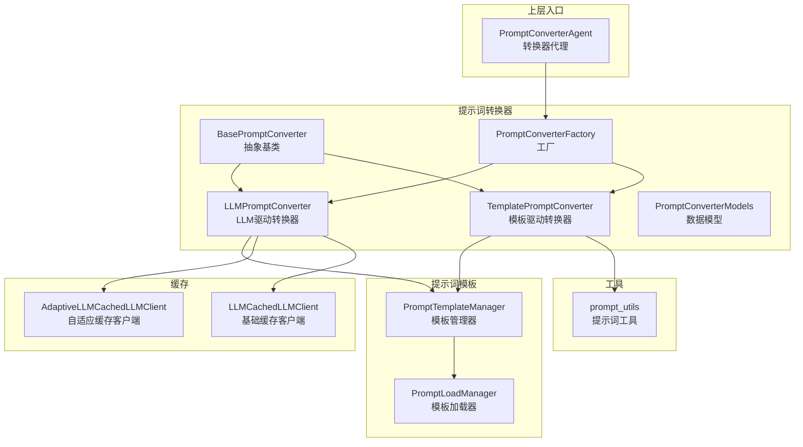
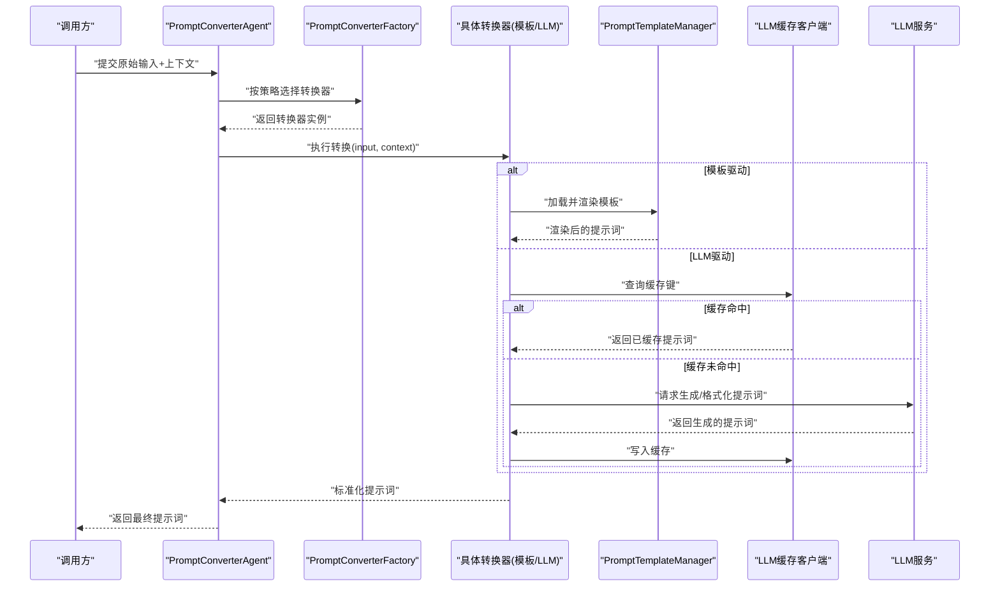
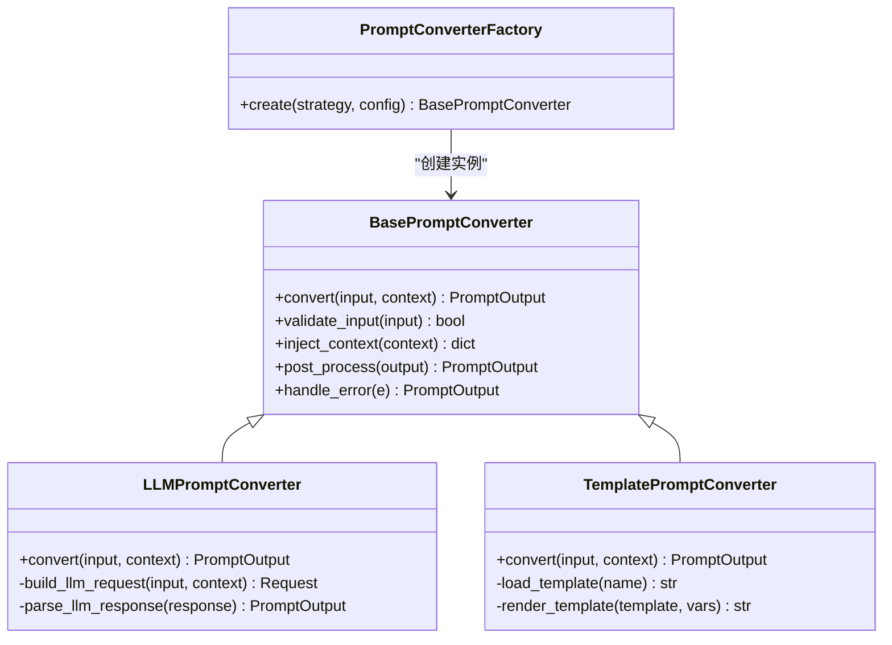
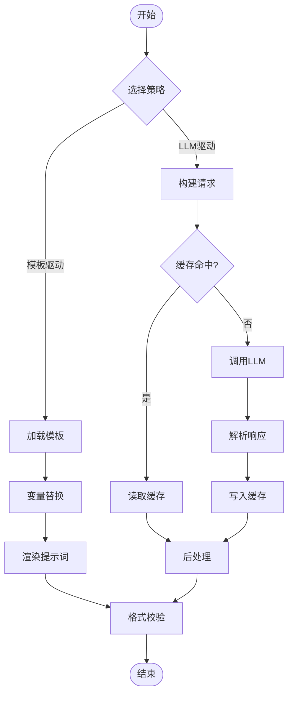
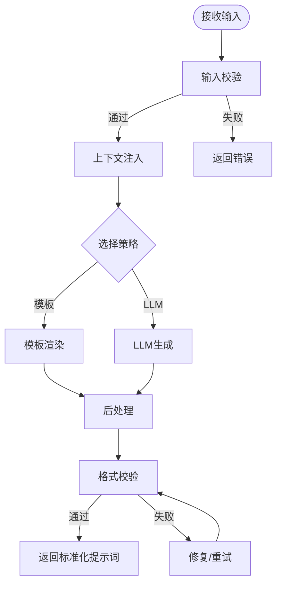
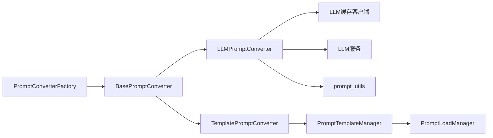

# 提示词转换器

<cite>
**本文引用的文件**   
- [base_prompt_converter.py](file://src/penshot/neopen/agent/prompt_converter/base_prompt_converter.py)
- [llm_prompt_converter.py](file://src/penshot/neopen/agent/prompt_converter/llm_prompt_converter.py)
- [template_prompt_converter.py](file://src/penshot/neopen/agent/prompt_converter/template_prompt_converter.py)
- [prompt_converter_factory.py](file://src/penshot/neopen/agent/prompt_converter/prompt_converter_factory.py)
- [prompt_converter_models.py](file://src/penshot/neopen/agent/prompt_converter/prompt_converter_models.py)
- [prompt_template_manager.py](file://src/penshot/neopen/prompts/prompt_template_manager.py)
- [prompt_load_manager.py](file://src/penshot/neopen/prompts/prompt_load_manager.py)
- [prompt_converter_agent.py](file://src/penshot/neopen/agent/prompt_converter_agent.py)
- [adaptive_llm_cache.py](file://src/penshot/neopen/cache/adaptive_llm_cache.py)
- [llm_cache.py](file://src/penshot/neopen/cache/llm_cache.py)
- [prompt_utils.py](file://src/penshot/utils/prompt_utils.py)
</cite>

## 目录
1. [简介](#简介)
2. [项目结构](#项目结构)
3. [核心组件](#核心组件)
4. [架构总览](#架构总览)
5. [详细组件分析](#详细组件分析)
6. [依赖关系分析](#依赖关系分析)
7. [性能考虑](#性能考虑)
8. [故障排查指南](#故障排查指南)
9. [结论](#结论)
10. [附录](#附录)

## 简介
本文件围绕“提示词转换器”子系统，系统性阐述其设计目标、核心机制与实现要点。重点覆盖：
- BasePromptConverter 抽象类与 Factory 模式的设计与使用
- LLM 驱动与模板驱动的转换策略差异
- 用户输入到标准化提示词的转换流程（变量替换、上下文注入、格式校验）
- 自定义转换器的开发规范与最佳实践
- 典型场景的转换示例与效果对比思路
- 缓存机制与性能优化策略

## 项目结构
提示词转换器位于 agent/prompt_converter 目录下，配合 prompts 模块中的模板管理、cache 模块中的缓存能力以及 utils 中的工具函数协同工作。上层通过 prompt_converter_agent 暴露统一入口，供任务编排或外部调用。

图表来源
- [base_prompt_converter.py:1-200](file://src/penshot/neopen/agent/prompt_converter/base_prompt_converter.py#L1-L200)
- [llm_prompt_converter.py:1-200](file://src/penshot/neopen/agent/prompt_converter/llm_prompt_converter.py#L1-L200)
- [template_prompt_converter.py:1-200](file://src/penshot/neopen/agent/prompt_converter/template_prompt_converter.py#L1-L200)
- [prompt_converter_factory.py:1-200](file://src/penshot/neopen/agent/prompt_converter/prompt_converter_factory.py#L1-L200)
- [prompt_converter_models.py:1-200](file://src/penshot/neopen/agent/prompt_converter/prompt_converter_models.py#L1-L200)
- [prompt_template_manager.py:1-200](file://src/penshot/neopen/prompts/prompt_template_manager.py#L1-L200)
- [prompt_load_manager.py:1-200](file://src/penshot/neopen/prompts/prompt_load_manager.py#L1-L200)
- [adaptive_llm_cache.py:1-200](file://src/penshot/neopen/cache/adaptive_llm_cache.py#L1-L200)
- [llm_cache.py:1-200](file://src/penshot/neopen/cache/llm_cache.py#L1-L200)
- [prompt_utils.py:1-200](file://src/penshot/utils/prompt_utils.py#L1-L200)
- [prompt_converter_agent.py:1-200](file://src/penshot/neopen/agent/prompt_converter_agent.py#L1-L200)

章节来源
- [base_prompt_converter.py:1-200](file://src/penshot/neopen/agent/prompt_converter/base_prompt_converter.py#L1-L200)
- [prompt_converter_factory.py:1-200](file://src/penshot/neopen/agent/prompt_converter/prompt_converter_factory.py#L1-L200)
- [prompt_template_manager.py:1-200](file://src/penshot/neopen/prompts/prompt_template_manager.py#L1-L200)
- [prompt_converter_agent.py:1-200](file://src/penshot/neopen/agent/prompt_converter_agent.py#L1-L200)

## 核心组件
- BasePromptConverter：定义统一的转换接口与通用能力（如输入校验、输出规范化、上下文注入钩子等），作为所有具体转换器的抽象基类。
- LLMPromptConverter：基于大语言模型的动态提示词生成与格式化，适合复杂语义理解、结构化抽取与多轮对话式构造。
- TemplatePromptConverter：基于预置模板与变量替换的静态提示词组装，适合规则明确、结构稳定的场景。
- PromptConverterFactory：根据配置或运行时参数选择并创建合适的转换器实例，屏蔽具体实现细节。
- PromptConverterModels：定义输入、输出及中间状态的数据模型，确保跨组件一致性与可序列化。
- PromptTemplateManager/PromptLoadManager：负责模板加载、版本管理与渲染，为模板驱动转换器提供稳定支撑。
- 缓存层（LLMCachedLLMClient/AdaptiveLLMCachedLLMClient）：对 LLM 调用结果进行缓存，降低延迟与成本。
- 工具层（prompt_utils）：提供提示词清洗、占位符处理、格式校验等通用能力。

章节来源
- [base_prompt_converter.py:1-200](file://src/penshot/neopen/agent/prompt_converter/base_prompt_converter.py#L1-L200)
- [llm_prompt_converter.py:1-200](file://src/penshot/neopen/agent/prompt_converter/llm_prompt_converter.py#L1-L200)
- [template_prompt_converter.py:1-200](file://src/penshot/neopen/agent/prompt_converter/template_prompt_converter.py#L1-L200)
- [prompt_converter_factory.py:1-200](file://src/penshot/neopen/agent/prompt_converter/prompt_converter_factory.py#L1-L200)
- [prompt_converter_models.py:1-200](file://src/penshot/neopen/agent/prompt_converter/prompt_converter_models.py#L1-L200)
- [prompt_template_manager.py:1-200](file://src/penshot/neopen/prompts/prompt_template_manager.py#L1-L200)
- [prompt_load_manager.py:1-200](file://src/penshot/neopen/prompts/prompt_load_manager.py#L1-L200)
- [adaptive_llm_cache.py:1-200](file://src/penshot/neopen/cache/adaptive_llm_cache.py#L1-L200)
- [llm_cache.py:1-200](file://src/penshot/neopen/cache/llm_cache.py#L1-L200)
- [prompt_utils.py:1-200](file://src/penshot/utils/prompt_utils.py#L1-L200)

## 架构总览
下图展示了从用户输入到标准化提示词的关键路径，包括工厂选择、模板/LLM 渲染、上下文注入与缓存命中。

图表来源
- [prompt_converter_agent.py:1-200](file://src/penshot/neopen/agent/prompt_converter_agent.py#L1-L200)
- [prompt_converter_factory.py:1-200](file://src/penshot/neopen/agent/prompt_converter/prompt_converter_factory.py#L1-L200)
- [template_prompt_converter.py:1-200](file://src/penshot/neopen/agent/prompt_converter/template_prompt_converter.py#L1-L200)
- [llm_prompt_converter.py:1-200](file://src/penshot/neopen/agent/prompt_converter/llm_prompt_converter.py#L1-L200)
- [prompt_template_manager.py:1-200](file://src/penshot/neopen/prompts/prompt_template_manager.py#L1-L200)
- [llm_cache.py:1-200](file://src/penshot/neopen/cache/llm_cache.py#L1-L200)
- [adaptive_llm_cache.py:1-200](file://src/penshot/neopen/cache/adaptive_llm_cache.py#L1-L200)

## 详细组件分析

### 抽象基类与工厂模式
- BasePromptConverter 定义了统一的转换接口与生命周期钩子，例如：
  - 输入预处理与校验
  - 上下文注入点
  - 输出后处理与规范化
  - 错误处理与重试策略
- PromptConverterFactory 依据配置或运行时条件（如策略、模板名、模型选择）创建具体转换器实例，支持扩展新策略而无需修改调用方。

图表来源
- [base_prompt_converter.py:1-200](file://src/penshot/neopen/agent/prompt_converter/base_prompt_converter.py#L1-L200)
- [llm_prompt_converter.py:1-200](file://src/penshot/neopen/agent/prompt_converter/llm_prompt_converter.py#L1-L200)
- [template_prompt_converter.py:1-200](file://src/penshot/neopen/agent/prompt_converter/template_prompt_converter.py#L1-L200)
- [prompt_converter_factory.py:1-200](file://src/penshot/neopen/agent/prompt_converter/prompt_converter_factory.py#L1-L200)

章节来源
- [base_prompt_converter.py:1-200](file://src/penshot/neopen/agent/prompt_converter/base_prompt_converter.py#L1-L200)
- [prompt_converter_factory.py:1-200](file://src/penshot/neopen/agent/prompt_converter/prompt_converter_factory.py#L1-L200)

### LLM 驱动 vs 模板驱动转换策略
- LLM 驱动（LLMPromptConverter）
  - 适用场景：需要语义理解、灵活重组、结构化抽取、多约束组合的提示词生成
  - 优点：表达力强、适应性强
  - 缺点：延迟较高、成本更高、稳定性受模型影响
  - 关键流程：构建请求 -> 可选缓存命中 -> 调用 LLM -> 解析响应 -> 后处理
- 模板驱动（TemplatePromptConverter）
  - 适用场景：结构固定、字段明确的提示词组装
  - 优点：确定性强、速度快、成本低
  - 缺点：灵活性受限、扩展需维护模板
  - 关键流程：加载模板 -> 变量替换 -> 渲染 -> 校验

图表来源
- [llm_prompt_converter.py:1-200](file://src/penshot/neopen/agent/prompt_converter/llm_prompt_converter.py#L1-L200)
- [template_prompt_converter.py:1-200](file://src/penshot/neopen/agent/prompt_converter/template_prompt_converter.py#L1-L200)
- [llm_cache.py:1-200](file://src/penshot/neopen/cache/llm_cache.py#L1-L200)
- [adaptive_llm_cache.py:1-200](file://src/penshot/neopen/cache/adaptive_llm_cache.py#L1-L200)

章节来源
- [llm_prompt_converter.py:1-200](file://src/penshot/neopen/agent/prompt_converter/llm_prompt_converter.py#L1-L200)
- [template_prompt_converter.py:1-200](file://src/penshot/neopen/agent/prompt_converter/template_prompt_converter.py#L1-L200)
- [llm_cache.py:1-200](file://src/penshot/neopen/cache/llm_cache.py#L1-L200)
- [adaptive_llm_cache.py:1-200](file://src/penshot/neopen/cache/adaptive_llm_cache.py#L1-L200)

### 用户输入到标准化提示词的转换流程
- 输入阶段
  - 输入校验：类型检查、必填字段验证、长度与字符集限制
  - 上下文注入：将系统角色、领域知识、历史对话片段等注入到上下文对象
- 转换阶段
  - 模板驱动：按模板键加载模板，填充变量，渲染字符串
  - LLM 驱动：构造请求体（含指令、上下文、约束），调用 LLM，解析结构化输出
- 输出阶段
  - 格式校验：正则/JSON Schema/自定义规则校验
  - 后处理：去噪、补全缺失字段、统一编码与换行风格

图表来源
- [base_prompt_converter.py:1-200](file://src/penshot/neopen/agent/prompt_converter/base_prompt_converter.py#L1-L200)
- [template_prompt_converter.py:1-200](file://src/penshot/neopen/agent/prompt_converter/template_prompt_converter.py#L1-L200)
- [llm_prompt_converter.py:1-200](file://src/penshot/neopen/agent/prompt_converter/llm_prompt_converter.py#L1-L200)
- [prompt_utils.py:1-200](file://src/penshot/utils/prompt_utils.py#L1-L200)

章节来源
- [base_prompt_converter.py:1-200](file://src/penshot/neopen/agent/prompt_converter/base_prompt_converter.py#L1-L200)
- [prompt_utils.py:1-200](file://src/penshot/utils/prompt_utils.py#L1-L200)

### 自定义转换器开发指南
- 接口规范
  - 继承 BasePromptConverter，实现 convert 方法
  - 按需覆写 validate_input、inject_context、post_process、handle_error
- 注册与选择
  - 在 PromptConverterFactory 中新增策略映射，或通过配置指定策略
- 最佳实践
  - 保持幂等：相同输入应产生相同输出（利于缓存）
  - 明确错误边界：区分可恢复与不可恢复错误
  - 控制上下文大小：避免过长导致 LLM 超时或成本飙升
  - 模板与代码解耦：变更需求优先调整模板而非硬编码逻辑
  - 可观测性：记录关键步骤日志与指标（耗时、命中率、错误码）

章节来源
- [base_prompt_converter.py:1-200](file://src/penshot/neopen/agent/prompt_converter/base_prompt_converter.py#L1-L200)
- [prompt_converter_factory.py:1-200](file://src/penshot/neopen/agent/prompt_converter/prompt_converter_factory.py#L1-L200)

### 不同场景下的转换示例与效果对比
- 场景一：结构化脚本摘要
  - 模板驱动：字段固定、格式稳定，渲染速度快、一致性高
  - LLM 驱动：能自动提炼要点、补充背景信息，但延迟与成本更高
- 场景二：多轮对话式提示词构造
  - 模板驱动：难以表达复杂对话逻辑
  - LLM 驱动：可根据历史与意图动态组织指令，灵活度高
- 场景三：强约束输出（如 JSON Schema）
  - 模板驱动：可通过模板强制结构
  - LLM 驱动：结合后处理与校验，提高合规率

[本节为概念性说明，不直接分析具体文件]

## 依赖关系分析
- 内部依赖
  - 转换器依赖模板管理器与工具函数
  - LLM 驱动转换器依赖缓存客户端与 LLM 服务
  - 工厂依赖配置与策略映射
- 外部依赖
  - LLM 服务（OpenAI/本地模型等）
  - 缓存后端（内存/Redis 等，由缓存客户端封装）

图表来源
- [prompt_converter_factory.py:1-200](file://src/penshot/neopen/agent/prompt_converter/prompt_converter_factory.py#L1-L200)
- [base_prompt_converter.py:1-200](file://src/penshot/neopen/agent/prompt_converter/base_prompt_converter.py#L1-L200)
- [llm_prompt_converter.py:1-200](file://src/penshot/neopen/agent/prompt_converter/llm_prompt_converter.py#L1-L200)
- [template_prompt_converter.py:1-200](file://src/penshot/neopen/agent/prompt_converter/template_prompt_converter.py#L1-L200)
- [prompt_template_manager.py:1-200](file://src/penshot/neopen/prompts/prompt_template_manager.py#L1-L200)
- [prompt_load_manager.py:1-200](file://src/penshot/neopen/prompts/prompt_load_manager.py#L1-L200)
- [llm_cache.py:1-200](file://src/penshot/neopen/cache/llm_cache.py#L1-L200)
- [prompt_utils.py:1-200](file://src/penshot/utils/prompt_utils.py#L1-L200)

章节来源
- [prompt_converter_factory.py:1-200](file://src/penshot/neopen/agent/prompt_converter/prompt_converter_factory.py#L1-L200)
- [base_prompt_converter.py:1-200](file://src/penshot/neopen/agent/prompt_converter/base_prompt_converter.py#L1-L200)
- [llm_prompt_converter.py:1-200](file://src/penshot/neopen/agent/prompt_converter/llm_prompt_converter.py#L1-L200)
- [template_prompt_converter.py:1-200](file://src/penshot/neopen/agent/prompt_converter/template_prompt_converter.py#L1-L200)
- [prompt_template_manager.py:1-200](file://src/penshot/neopen/prompts/prompt_template_manager.py#L1-L200)
- [prompt_load_manager.py:1-200](file://src/penshot/neopen/prompts/prompt_load_manager.py#L1-L200)
- [llm_cache.py:1-200](file://src/penshot/neopen/cache/llm_cache.py#L1-L200)
- [prompt_utils.py:1-200](file://src/penshot/utils/prompt_utils.py#L1-L200)

## 性能考虑
- 缓存策略
  - 基础缓存（LLMCachedLLMClient）：对 LLM 请求进行键值缓存，命中时直接返回
  - 自适应缓存（AdaptiveLLMCachedLLMClient）：根据请求特征与命中率动态调整缓存粒度与过期策略
- 模板渲染优化
  - 预编译模板、复用渲染上下文、批量渲染减少 IO 开销
- 输入裁剪与上下文压缩
  - 仅注入必要上下文，避免超长提示词
- 并发与限流
  - 对 LLM 调用进行并发控制与退避重试，避免雪崩
- 监控与度量
  - 记录缓存命中率、平均延迟、错误分布，指导容量规划与策略调优

章节来源
- [llm_cache.py:1-200](file://src/penshot/neopen/cache/llm_cache.py#L1-L200)
- [adaptive_llm_cache.py:1-200](file://src/penshot/neopen/cache/adaptive_llm_cache.py#L1-L200)
- [prompt_template_manager.py:1-200](file://src/penshot/neopen/prompts/prompt_template_manager.py#L1-L200)

## 故障排查指南
- 常见问题
  - 模板缺失或键名不一致：检查模板加载与命名约定
  - 变量未替换：确认上下文注入是否包含所需键
  - LLM 返回格式异常：增强后处理与校验逻辑，增加重试与降级
  - 缓存未命中或污染：核对缓存键生成策略与上下文哈希
- 定位手段
  - 开启详细日志，记录输入、上下文、缓存键、请求体与响应体摘要
  - 使用单元测试覆盖边界用例（空输入、超长输入、非法字符）
  - 对模板与提示词进行回归测试，确保变更后行为一致

章节来源
- [base_prompt_converter.py:1-200](file://src/penshot/neopen/agent/prompt_converter/base_prompt_converter.py#L1-L200)
- [llm_prompt_converter.py:1-200](file://src/penshot/neopen/agent/prompt_converter/llm_prompt_converter.py#L1-L200)
- [template_prompt_converter.py:1-200](file://src/penshot/neopen/agent/prompt_converter/template_prompt_converter.py#L1-L200)
- [prompt_template_manager.py:1-200](file://src/penshot/neopen/prompts/prompt_template_manager.py#L1-L200)
- [llm_cache.py:1-200](file://src/penshot/neopen/cache/llm_cache.py#L1-L200)
- [adaptive_llm_cache.py:1-200](file://src/penshot/neopen/cache/adaptive_llm_cache.py#L1-L200)

## 结论
提示词转换器通过抽象基类与工厂模式实现了策略可扩展、职责清晰的架构。模板驱动与 LLM 驱动互补，分别满足确定性与灵活性需求。借助缓存与工具链，系统在性能与稳定性上具备良好保障。建议在生产环境中结合监控指标持续优化缓存策略与上下文裁剪，确保高质量与低成本的提示词供给。

## 附录
- 术语
  - 标准化提示词：经过校验与后处理的统一格式提示词
  - 上下文注入：将系统角色、领域知识与历史片段合并到提示词上下文中
  - 缓存键：用于标识一次 LLM 请求的唯一键，通常由输入与上下文哈希生成
- 参考入口
  - 上层调用入口：PromptConverterAgent
  - 工厂创建：PromptConverterFactory
  - 模板管理：PromptTemplateManager / PromptLoadManager
  - 缓存客户端：LLMCachedLLMClient / AdaptiveLLMCachedLLMClient

章节来源
- [prompt_converter_agent.py:1-200](file://src/penshot/neopen/agent/prompt_converter_agent.py#L1-L200)
- [prompt_converter_factory.py:1-200](file://src/penshot/neopen/agent/prompt_converter/prompt_converter_factory.py#L1-L200)
- [prompt_template_manager.py:1-200](file://src/penshot/neopen/prompts/prompt_template_manager.py#L1-L200)
- [prompt_load_manager.py:1-200](file://src/penshot/neopen/prompts/prompt_load_manager.py#L1-L200)
- [llm_cache.py:1-200](file://src/penshot/neopen/cache/llm_cache.py#L1-L200)
- [adaptive_llm_cache.py:1-200](file://src/penshot/neopen/cache/adaptive_llm_cache.py#L1-L200)