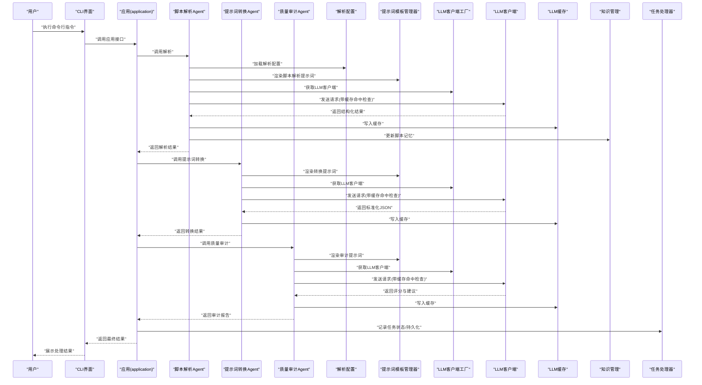
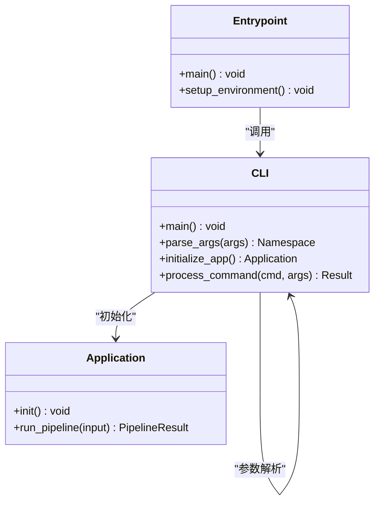
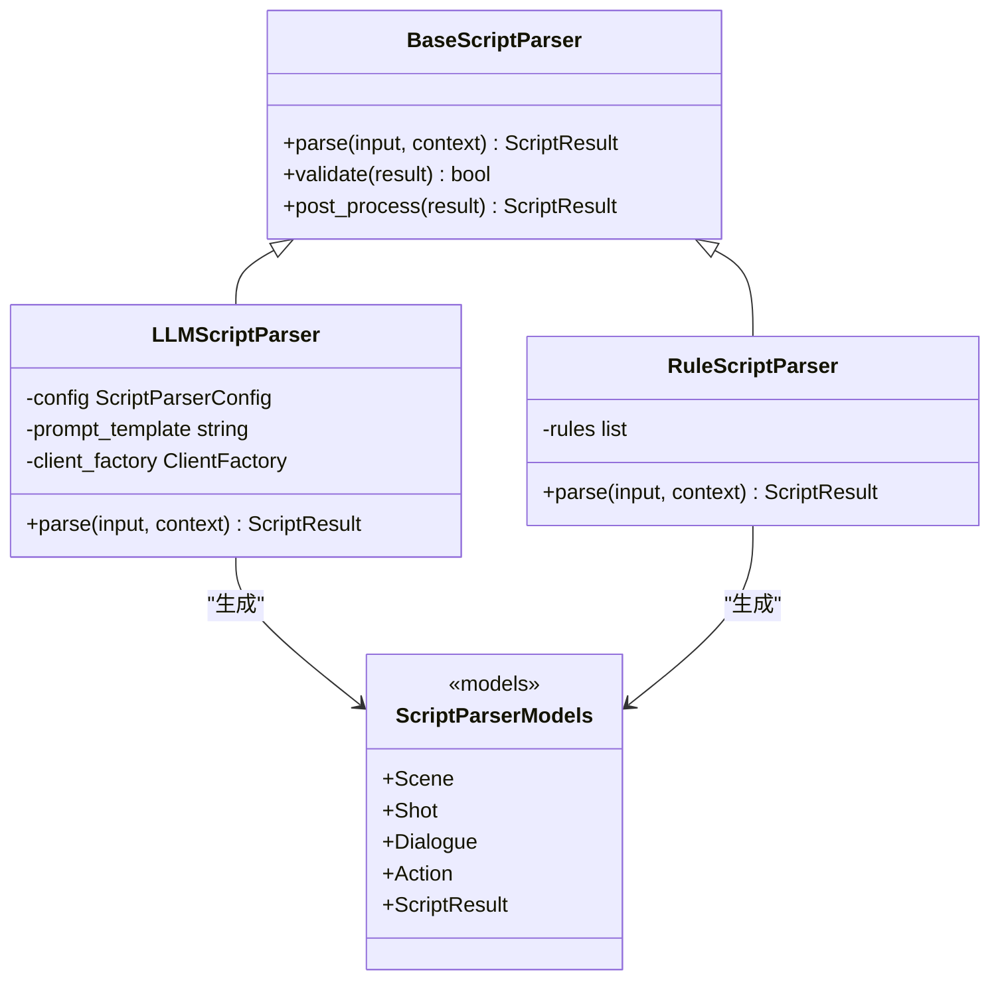
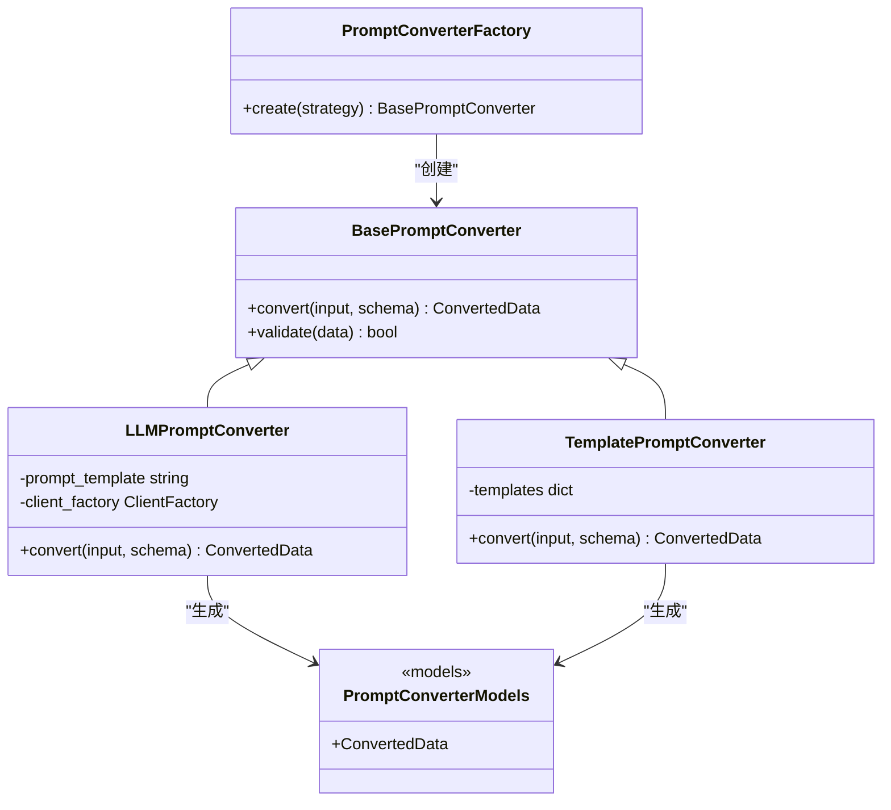
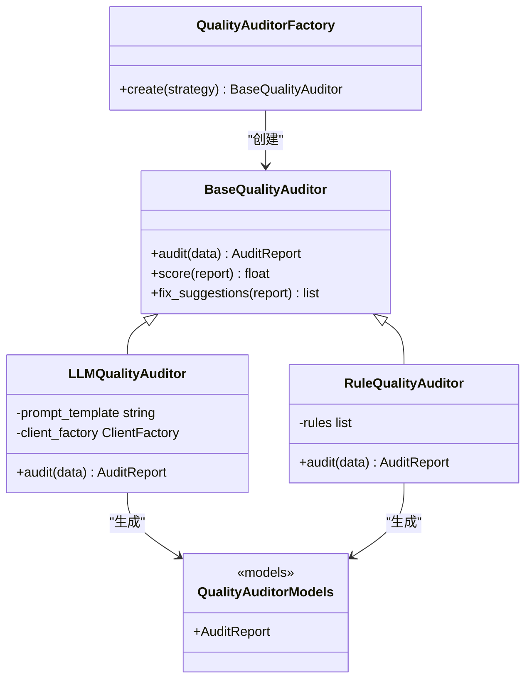
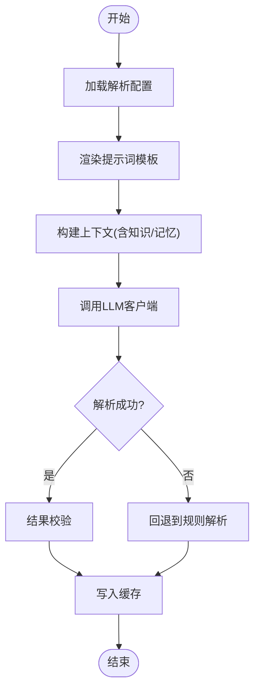
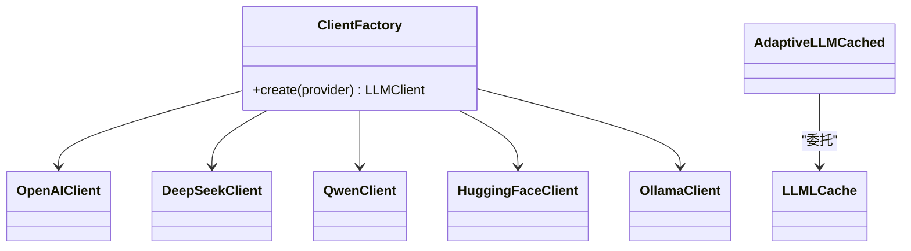
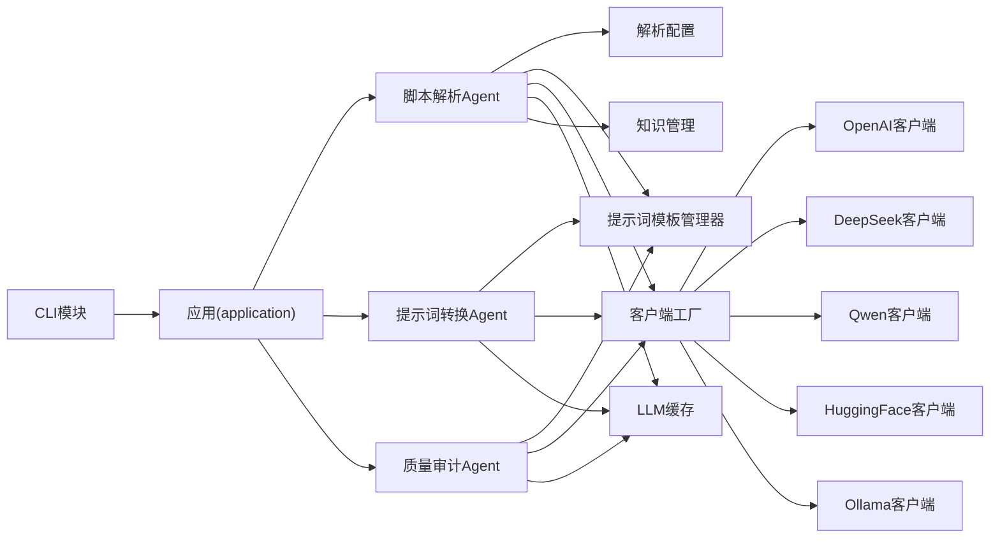

# 脚本处理系统

<cite>
**本文引用的文件**   
- [src/penshot/cli.py](file://src/penshot/cli.py)
- [scripts/entrypoint.py](file://scripts/entrypoint.py)
- [src/penshot/neopen/agent/script_parser_agent.py](file://src/penshot/neopen/agent/script_parser_agent.py)
- [src/penshot/neopen/agent/script_parser/base_script_parser.py](file://src/penshot/neopen/agent/script_parser/base_script_parser.py)
- [src/penshot/neopen/agent/script_parser/llm_script_parser.py](file://src/penshot/neopen/agent/script_parser/llm_script_parser.py)
- [src/penshot/neopen/agent/script_parser/rule_script_parser.py](file://src/penshot/neopen/agent/script_parser/rule_script_parser.py)
- [src/penshot/neopen/agent/script_parser/script_parser_models.py](file://src/penshot/neopen/agent/script_parser/script_parser_models.py)
- [src/penshot/neopen/agent/prompt_converter_agent.py](file://src/penshot/neopen/agent/prompt_converter_agent.py)
- [src/penshot/neopen/agent/prompt_converter/base_prompt_converter.py](file://src/penshot/neopen/agent/prompt_converter/base_prompt_converter.py)
- [src/penshot/neopen/agent/prompt_converter/llm_prompt_converter.py](file://src/penshot/neopen/agent/prompt_converter/llm_prompt_converter.py)
- [src/penshot/neopen/agent/prompt_converter/template_prompt_converter.py](file://src/penshot/neopen/agent/prompt_converter/template_prompt_converter.py)
- [src/penshot/neopen/agent/prompt_converter/prompt_converter_factory.py](file://src/penshot/neopen/agent/prompt_converter/prompt_converter_factory.py)
- [src/penshot/neopen/agent/prompt_converter/prompt_converter_models.py](file://src/penshot/neopen/agent/prompt_converter/prompt_converter_models.py)
- [src/penshot/neopen/agent/quality_auditor_agent.py](file://src/penshot/neopen/agent/quality_auditor_agent.py)
- [src/penshot/neopen/agent/quality_auditor/base_quality_auditor.py](file://src/penshot/neopen/agent/quality_auditor/base_quality_auditor.py)
- [src/penshot/neopen/agent/quality_auditor/llm_quality_auditor.py](file://src/penshot/neopen/agent/quality_auditor/llm_quality_auditor.py)
- [src/penshot/neopen/agent/quality_auditor/rule_quality_auditor.py](file://src/penshot/neopen/agent/quality_auditor/rule_quality_auditor.py)
- [src/penshot/neopen/agent/quality_auditor/quality_auditor_models.py](file://src/penshot/neopen/agent/quality_auditor/quality_auditor_models.py)
- [src/penshot/neopen/agent/quality_auditor/quality_auditor_factory.py](file://src/penshot/neopen/agent/quality_auditor/quality_auditor_factory.py)
- [src/penshot/neopen/config/script_parser_config.py](file://src/penshot/neopen/config/script_parser_config.py)
- [src/penshot/neopen/prompts/prompt_template_manager.py](file://src/penshot/neopen/prompts/prompt_template_manager.py)
- [src/penshot/neopen/prompts/v1.x/zh/script_parser_prompt.yaml](file://src/penshot/neopen/prompts/v1.x/zh/script_parser_prompt.yaml)
- [src/penshot/neopen/prompts/v1.x/en/script_parser_prompt.yaml](file://src/penshot/neopen/prompts/v1.x/en/script_parser_prompt.yaml)
- [examples/json_demo/script_parser_result.json](file://examples/json_demo/script_parser_result.json)
- [examples/json_demo/prompt_converter_result.json](file://examples/json_demo/prompt_converter_result.json)
- [examples/json_demo/quality_auditor_result.json](file://examples/json_demo/quality_auditor_result.json)
- [src/penshot/neopen/tools/script_parser_tool.py](file://src/penshot/neopen/tools/script_parser_tool.py)
- [src/penshot/neopen/client/client_factory.py](file://src/penshot/neopen/client/client_factory.py)
- [src/penshot/neopen/client/openai_client.py](file://src/penshot/neopen/client/openai_client.py)
- [src/penshot/neopen/client/deepseek_client.py](file://src/penshot/neopen/client/deepseek_client.py)
- [src/penshot/neopen/client/qwen_client.py](file://src/penshot/neopen/client/qwen_client.py)
- [src/penshot/neopen/client/huggingface_client.py](file://src/penshot/neopen/client/huggingface_client.py)
- [src/penshot/neopen/client/ollama_client.py](file://src/penshot/neopen/client/ollama_client.py)
- [src/penshot/neopen/cache/adaptive_llm_cache.py](file://src/penshot/neopen/cache/adaptive_llm_cache.py)
- [src/penshot/neopen/cache/llm_cache.py](file://src/penshot/neopen/cache/llm_cache.py)
- [src/penshot/neopen/knowledge/knowledge_manager.py](file://src/penshot/neopen/knowledge/knowledge_manager.py)
- [src/penshot/neopen/knowledge/memory/script_memory.py](file://src/penshot/neopen/knowledge/memory/script_memory.py)
- [src/penshot/neopen/task/task_processor.py](file://src/penshot/neopen/task/task_processor.py)
- [src/penshot/neopen/task/workflow_registry.py](file://src/penshot/neopen/task/workflow_registry.py)
- [src/penshot/neopen/app/application.py](file://src/penshot/neopen/app/application.py)
</cite>

## 更新摘要
**变更内容**   
- CLI模块已从scripts/cli.py迁移至src/penshot/cli.py，作为包结构重构的一部分
- CLI功能保持不变，但现在更好地集成到主penshot包中
- 更新了CLI入口点和相关引用路径
- 保持了原有的命令行接口和功能特性

## 目录
1. [简介](#简介)
2. [项目结构](#项目结构)
3. [核心组件](#核心组件)
4. [架构总览](#架构总览)
5. [详细组件分析](#详细组件分析)
6. [依赖关系分析](#依赖关系分析)
7. [性能考虑](#性能考虑)
8. [故障排查指南](#故障排查指南)
9. [结论](#结论)
10. [附录](#附录)

## 简介
本文件系统性地梳理"脚本处理系统"的实现原理与使用方式，重点覆盖：
- 自然语言剧本解析：LLM驱动解析器与规则引擎的协同工作
- 提示词转换机制：将用户输入转换为结构化数据
- 内容验证与质量检查流程
- 自定义解析器的开发指南
- 性能优化技巧与调试方法
- 实际使用案例与输出示例

该系统采用可插拔的Agent与工厂模式，支持多种LLM后端（OpenAI、DeepSeek、Qwen、HuggingFace、Ollama等），并提供模板化提示词管理与缓存策略，兼顾灵活性与性能。

**更新** CLI模块已迁移至src/penshot/cli.py，提供更好的包集成和统一的入口点管理。

## 项目结构
脚本处理相关代码主要位于 src/penshot/neopen/agent 及其子模块中，围绕三大能力组织：
- 脚本解析（script_parser）：将自然语言剧本解析为结构化镜头/场景/动作等元素
- 提示词转换（prompt_converter）：将用户输入或中间结果转换为标准化格式
- 质量审计（quality_auditor）：对解析结果进行校验与评分，并给出修复建议

此外，工具层（tools）、客户端层（client）、缓存（cache）、知识管理（knowledge）、任务编排（task）与应用入口（app）共同构成完整链路。

```mermaid
graph TB
subgraph "应用入口"
APP["application.py"]
CLI["cli.py"]
ENTRY["entrypoint.py"]
end
subgraph "Agent层"
SPA["script_parser_agent.py"]
PCA["prompt_converter_agent.py"]
QAA["quality_auditor_agent.py"]
end
subgraph "实现层"
BSP["base_script_parser.py"]
LSP["llm_script_parser.py"]
RSP["rule_script_parser.py"]
BPM["prompt_converter_models.py"]
LPC["llm_prompt_converter.py"]
TPC["template_prompt_converter.py"]
BQA["base_quality_auditor.py"]
LQA["llm_quality_auditor.py"]
RQA["rule_quality_auditor.py"]
end
subgraph "支撑层"
CFG["script_parser_config.py"]
PTM["prompt_template_manager.py"]
CFY["v1.x/zh/script_parser_prompt.yaml"]
CEF["v1.x/en/script_parser_prompt.yaml"]
CMF["client_factory.py"]
OAI["openai_client.py"]
DS["deepseek_client.py"]
QW["qwen_client.py"]
HF["huggingface_client.py"]
OL["ollama_client.py"]
AC["adaptive_llm_cache.py"]
LC["llm_cache.py"]
KM["knowledge_manager.py"]
SM["script_memory.py"]
TP["task_processor.py"]
WR["workflow_registry.py"]
SPT["script_parser_tool.py"]
end
APP --> SPA
APP --> PCA
APP --> QAA
CLI --> APP
ENTRY --> CLI
SPA --> BSP
SPA --> LSP
SPA --> RSP
SPA --> CFG
SPA --> PTM
SPA --> CMF
SPA --> AC
SPA --> KM
SPA --> TP
SPA --> SPT
PCA --> LPC
PCA --> TPC
PCA --> PTM
PCA --> CMF
PCA --> AC
QAA --> BQA
QAA --> LQA
QAA --> RQA
QAA --> PTM
QAA --> CMF
QAA --> AC
PTM --> CFY
PTM --> CEF
CMF --> OAI
CMF --> DS
CMF --> QW
CMF --> HF
CMF --> OL
KM --> SM
```

**图表来源**
- [src/penshot/cli.py](file://src/penshot/cli.py)
- [scripts/entrypoint.py](file://scripts/entrypoint.py)
- [src/penshot/neopen/app/application.py](file://src/penshot/neopen/app/application.py)
- [src/penshot/neopen/agent/script_parser_agent.py](file://src/penshot/neopen/agent/script_parser_agent.py)
- [src/penshot/neopen/agent/prompt_converter_agent.py](file://src/penshot/neopen/agent/prompt_converter_agent.py)
- [src/penshot/neopen/agent/quality_auditor_agent.py](file://src/penshot/neopen/agent/quality_auditor_agent.py)
- [src/penshot/neopen/agent/script_parser/base_script_parser.py](file://src/penshot/neopen/agent/script_parser/base_script_parser.py)
- [src/penshot/neopen/agent/script_parser/llm_script_parser.py](file://src/penshot/neopen/agent/script_parser/llm_script_parser.py)
- [src/penshot/neopen/agent/script_parser/rule_script_parser.py](file://src/penshot/neopen/agent/script_parser/rule_script_parser.py)
- [src/penshot/neopen/agent/prompt_converter/llm_prompt_converter.py](file://src/penshot/neopen/agent/prompt_converter/llm_prompt_converter.py)
- [src/penshot/neopen/agent/prompt_converter/template_prompt_converter.py](file://src/penshot/neopen/agent/prompt_converter/template_prompt_converter.py)
- [src/penshot/neopen/agent/quality_auditor/base_quality_auditor.py](file://src/penshot/neopen/agent/quality_auditor/base_quality_auditor.py)
- [src/penshot/neopen/agent/quality_auditor/llm_quality_auditor.py](file://src/penshot/neopen/agent/quality_auditor/llm_quality_auditor.py)
- [src/penshot/neopen/agent/quality_auditor/rule_quality_auditor.py](file://src/penshot/neopen/agent/quality_auditor/rule_quality_auditor.py)
- [src/penshot/neopen/config/script_parser_config.py](file://src/penshot/neopen/config/script_parser_config.py)
- [src/penshot/neopen/prompts/prompt_template_manager.py](file://src/penshot/neopen/prompts/prompt_template_manager.py)
- [src/penshot/neopen/prompts/v1.x/zh/script_parser_prompt.yaml](file://src/penshot/neopen/prompts/v1.x/zh/script_parser_prompt.yaml)
- [src/penshot/neopen/prompts/v1.x/en/script_parser_prompt.yaml](file://src/penshot/neopen/prompts/v1.x/en/script_parser_prompt.yaml)
- [src/penshot/neopen/client/client_factory.py](file://src/penshot/neopen/client/client_factory.py)
- [src/penshot/neopen/client/openai_client.py](file://src/penshot/neopen/client/openai_client.py)
- [src/penshot/neopen/client/deepseek_client.py](file://src/penshot/neopen/client/deepseek_client.py)
- [src/penshot/neopen/client/qwen_client.py](file://src/penshot/neopen/client/qwen_client.py)
- [src/penshot/neopen/client/huggingface_client.py](file://src/penshot/neopen/client/huggingface_client.py)
- [src/penshot/neopen/client/ollama_client.py](file://src/penshot/neopen/client/ollama_client.py)
- [src/penshot/neopen/cache/adaptive_llm_cache.py](file://src/penshot/neopen/cache/adaptive_llm_cache.py)
- [src/penshot/neopen/cache/llm_cache.py](file://src/penshot/neopen/cache/llm_cache.py)
- [src/penshot/neopen/knowledge/knowledge_manager.py](file://src/penshot/neopen/knowledge/knowledge_manager.py)
- [src/penshot/neopen/knowledge/memory/script_memory.py](file://src/penshot/neopen/knowledge/memory/script_memory.py)
- [src/penshot/neopen/task/task_processor.py](file://src/penshot/neopen/task/task_processor.py)
- [src/penshot/neopen/task/workflow_registry.py](file://src/penshot/neopen/task/workflow_registry.py)
- [src/penshot/neopen/tools/script_parser_tool.py](file://src/penshot/neopen/tools/script_parser_tool.py)

章节来源
- [src/penshot/cli.py](file://src/penshot/cli.py)
- [scripts/entrypoint.py](file://scripts/entrypoint.py)
- [src/penshot/neopen/app/application.py](file://src/penshot/neopen/app/application.py)
- [src/penshot/neopen/agent/script_parser_agent.py](file://src/penshot/neopen/agent/script_parser_agent.py)
- [src/penshot/neopen/agent/prompt_converter_agent.py](file://src/penshot/neopen/agent/prompt_converter_agent.py)
- [src/penshot/neopen/agent/quality_auditor_agent.py](file://src/penshot/neopen/agent/quality_auditor_agent.py)

## 核心组件
- 脚本解析器（Script Parser）
  - 抽象基类定义统一接口与模型契约
  - LLM驱动解析器：通过提示词模板与LLM客户端生成结构化结果
  - 规则解析器：基于配置与正则/关键词匹配的快速解析路径
- 提示词转换器（Prompt Converter）
  - LLM转换器：利用大模型将非结构化输入转为标准JSON
  - 模板转换器：基于预置模板快速映射字段
  - 工厂：按配置选择具体转换器
- 质量审计器（Quality Auditor）
  - LLM审计器：由大模型评估一致性、完整性、风格等维度
  - 规则审计器：基于阈值、关键字、长度、重复度等规则打分
  - 工厂：根据策略选择审计器

章节来源
- [src/penshot/neopen/agent/script_parser/base_script_parser.py](file://src/penshot/neopen/agent/script_parser/base_script_parser.py)
- [src/penshot/neopen/agent/script_parser/llm_script_parser.py](file://src/penshot/neopen/agent/script_parser/llm_script_parser.py)
- [src/penshot/neopen/agent/script_parser/rule_script_parser.py](file://src/penshot/neopen/agent/script_parser/rule_script_parser.py)
- [src/penshot/neopen/agent/script_parser/script_parser_models.py](file://src/penshot/neopen/agent/script_parser/script_parser_models.py)
- [src/penshot/neopen/agent/prompt_converter/base_prompt_converter.py](file://src/penshot/neopen/agent/prompt_converter/base_prompt_converter.py)
- [src/penshot/neopen/agent/prompt_converter/llm_prompt_converter.py](file://src/penshot/neopen/agent/prompt_converter/llm_prompt_converter.py)
- [src/penshot/neopen/agent/prompt_converter/template_prompt_converter.py](file://src/penshot/neopen/agent/prompt_converter/template_prompt_converter.py)
- [src/penshot/neopen/agent/prompt_converter/prompt_converter_factory.py](file://src/penshot/neopen/agent/prompt_converter/prompt_converter_factory.py)
- [src/penshot/neopen/agent/prompt_converter/prompt_converter_models.py](file://src/penshot/neopen/agent/prompt_converter/prompt_converter_models.py)
- [src/penshot/neopen/agent/quality_auditor/base_quality_auditor.py](file://src/penshot/neopen/agent/quality_auditor/base_quality_auditor.py)
- [src/penshot/neopen/agent/quality_auditor/llm_quality_auditor.py](file://src/penshot/neopen/agent/quality_auditor/llm_quality_auditor.py)
- [src/penshot/neopen/agent/quality_auditor/rule_quality_auditor.py](file://src/penshot/neopen/agent/quality_auditor/rule_quality_auditor.py)
- [src/penshot/neopen/agent/quality_auditor/quality_auditor_models.py](file://src/penshot/neopen/agent/quality_auditor/quality_auditor_models.py)
- [src/penshot/neopen/agent/quality_auditor/quality_auditor_factory.py](file://src/penshot/neopen/agent/quality_auditor/quality_auditor_factory.py)

## 架构总览
系统以Agent为中心，组合解析、转换、审计三个关键阶段，并通过工厂模式动态选择实现；底层由提示词模板管理、多LLM客户端、缓存与知识管理提供支撑。

**图表来源**
- [src/penshot/cli.py](file://src/penshot/cli.py)
- [src/penshot/neopen/app/application.py](file://src/penshot/neopen/app/application.py)
- [src/penshot/neopen/agent/script_parser_agent.py](file://src/penshot/neopen/agent/script_parser_agent.py)
- [src/penshot/neopen/agent/prompt_converter_agent.py](file://src/penshot/neopen/agent/prompt_converter_agent.py)
- [src/penshot/neopen/agent/quality_auditor_agent.py](file://src/penshot/neopen/agent/quality_auditor_agent.py)
- [src/penshot/neopen/config/script_parser_config.py](file://src/penshot/neopen/config/script_parser_config.py)
- [src/penshot/neopen/prompts/prompt_template_manager.py](file://src/penshot/neopen/prompts/prompt_template_manager.py)
- [src/penshot/neopen/client/client_factory.py](file://src/penshot/neopen/client/client_factory.py)
- [src/penshot/neopen/cache/adaptive_llm_cache.py](file://src/penshot/neopen/cache/adaptive_llm_cache.py)
- [src/penshot/neopen/knowledge/knowledge_manager.py](file://src/penshot/neopen/knowledge/knowledge_manager.py)
- [src/penshot/neopen/task/task_processor.py](file://src/penshot/neopen/task/task_processor.py)

## 详细组件分析

### CLI模块（已迁移）
**更新** CLI模块已从scripts/cli.py迁移至src/penshot/cli.py，提供更好的包集成。

- 设计要点
  - 统一的命令行接口，提供脚本处理的所有功能
  - 参数解析与验证，确保输入的正确性
  - 与主应用无缝集成，保持向后兼容性
- 关键流程
  - 解析命令行参数
  - 初始化应用上下文
  - 调用相应的处理函数
  - 格式化并输出结果
- 集成优势
  - 更好的包结构和命名空间管理
  - 统一的导入和依赖管理
  - 便于单元测试和集成测试

**图表来源**
- [src/penshot/cli.py](file://src/penshot/cli.py)
- [scripts/entrypoint.py](file://scripts/entrypoint.py)
- [src/penshot/neopen/app/application.py](file://src/penshot/neopen/app/application.py)

章节来源
- [src/penshot/cli.py](file://src/penshot/cli.py)
- [scripts/entrypoint.py](file://scripts/entrypoint.py)

### 脚本解析器（Script Parser）
- 设计要点
  - 抽象基类定义统一的解析接口与输出模型，确保LLM与规则路径一致
  - LLM解析器负责复杂语义理解与结构化抽取；规则解析器用于低延迟、确定性场景
  - 通过配置控制解析粒度、字段约束与后处理策略
- 关键流程
  - 读取配置与提示词模板
  - 构建请求上下文（含历史、领域知识）
  - 调用LLM或规则引擎生成结构化结果
  - 结果校验与缓存写入
- 数据结构
  - 解析结果模型包含镜头、场景、对话、动作等元素的结构化描述
- 扩展点
  - 新增解析规则：在规则解析器中增加匹配策略
  - 自定义模型字段：扩展解析模型并在提示词中声明

**图表来源**
- [src/penshot/neopen/agent/script_parser/base_script_parser.py](file://src/penshot/neopen/agent/script_parser/base_script_parser.py)
- [src/penshot/neopen/agent/script_parser/llm_script_parser.py](file://src/penshot/neopen/agent/script_parser/llm_script_parser.py)
- [src/penshot/neopen/agent/script_parser/rule_script_parser.py](file://src/penshot/neopen/agent/script_parser/rule_script_parser.py)
- [src/penshot/neopen/agent/script_parser/script_parser_models.py](file://src/penshot/neopen/agent/script_parser/script_parser_models.py)

章节来源
- [src/penshot/neopen/agent/script_parser/base_script_parser.py](file://src/penshot/neopen/agent/script_parser/base_script_parser.py)
- [src/penshot/neopen/agent/script_parser/llm_script_parser.py](file://src/penshot/neopen/agent/script_parser/llm_script_parser.py)
- [src/penshot/neopen/agent/script_parser/rule_script_parser.py](file://src/penshot/neopen/agent/script_parser/rule_script_parser.py)
- [src/penshot/neopen/agent/script_parser/script_parser_models.py](file://src/penshot/neopen/agent/script_parser/script_parser_models.py)
- [src/penshot/neopen/config/script_parser_config.py](file://src/penshot/neopen/config/script_parser_config.py)

### 提示词转换器（Prompt Converter）
- 设计要点
  - 将用户输入或中间文本转换为标准JSON结构，便于下游处理
  - LLM转换器适合复杂语义映射；模板转换器适合固定格式的批量处理
  - 工厂根据配置选择转换器，支持热切换
- 关键流程
  - 加载提示词模板
  - 构造输入上下文（含目标Schema）
  - 调用LLM或模板引擎生成结构化数据
  - 结果校验与缓存
- 数据结构
  - 转换结果模型定义字段类型、必填项与约束

**图表来源**
- [src/penshot/neopen/agent/prompt_converter/base_prompt_converter.py](file://src/penshot/neopen/agent/prompt_converter/base_prompt_converter.py)
- [src/penshot/neopen/agent/prompt_converter/llm_prompt_converter.py](file://src/penshot/neopen/agent/prompt_converter/llm_prompt_converter.py)
- [src/penshot/neopen/agent/prompt_converter/template_prompt_converter.py](file://src/penshot/neopen/agent/prompt_converter/template_prompt_converter.py)
- [src/penshot/neopen/agent/prompt_converter/prompt_converter_factory.py](file://src/penshot/neopen/agent/prompt_converter/prompt_converter_factory.py)
- [src/penshot/neopen/agent/prompt_converter/prompt_converter_models.py](file://src/penshot/neopen/agent/prompt_converter/prompt_converter_models.py)

章节来源
- [src/penshot/neopen/agent/prompt_converter/base_prompt_converter.py](file://src/penshot/neopen/agent/prompt_converter/base_prompt_converter.py)
- [src/penshot/neopen/agent/prompt_converter/llm_prompt_converter.py](file://src/penshot/neopen/agent/prompt_converter/llm_prompt_converter.py)
- [src/penshot/neopen/agent/prompt_converter/template_prompt_converter.py](file://src/penshot/neopen/agent/prompt_converter/template_prompt_converter.py)
- [src/penshot/neopen/agent/prompt_converter/prompt_converter_factory.py](file://src/penshot/neopen/agent/prompt_converter/prompt_converter_factory.py)
- [src/penshot/neopen/agent/prompt_converter/prompt_converter_models.py](file://src/penshot/neopen/agent/prompt_converter/prompt_converter_models.py)

### 质量审计器（Quality Auditor）
- 设计要点
  - LLM审计器从一致性、完整性、风格等维度评估结果
  - 规则审计器基于阈值、关键字、重复度、长度等指标进行快速打分
  - 工厂根据策略选择审计器，支持组合策略
- 关键流程
  - 加载审计提示词与规则
  - 对输入数据进行多维度检查
  - 生成评分、问题清单与修复建议
  - 结果缓存与报告输出
- 数据结构
  - 审计报告模型包含分数、问题列表、修复建议等

**图表来源**
- [src/penshot/neopen/agent/quality_auditor/base_quality_auditor.py](file://src/penshot/neopen/agent/quality_auditor/base_quality_auditor.py)
- [src/penshot/neopen/agent/quality_auditor/llm_quality_auditor.py](file://src/penshot/neopen/agent/quality_auditor/llm_quality_auditor.py)
- [src/penshot/neopen/agent/quality_auditor/rule_quality_auditor.py](file://src/penshot/neopen/agent/quality_auditor/rule_quality_auditor.py)
- [src/penshot/neopen/agent/quality_auditor/quality_auditor_factory.py](file://src/penshot/neopen/agent/quality_auditor/quality_auditor_factory.py)
- [src/penshot/neopen/agent/quality_auditor/quality_auditor_models.py](file://src/penshot/neopen/agent/quality_auditor/quality_auditor_models.py)

章节来源
- [src/penshot/neopen/agent/quality_auditor/base_quality_auditor.py](file://src/penshot/neopen/agent/quality_auditor/base_quality_auditor.py)
- [src/penshot/neopen/agent/quality_auditor/llm_quality_auditor.py](file://src/penshot/neopen/agent/quality_auditor/llm_quality_auditor.py)
- [src/penshot/neopen/agent/quality_auditor/rule_quality_auditor.py](file://src/penshot/neopen/agent/quality_auditor/rule_quality_auditor.py)
- [src/penshot/neopen/agent/quality_auditor/quality_auditor_factory.py](file://src/penshot/neopen/agent/quality_auditor/quality_auditor_factory.py)
- [src/penshot/neopen/agent/quality_auditor/quality_auditor_models.py](file://src/penshot/neopen/agent/quality_auditor/quality_auditor_models.py)

### 提示词模板与配置
- 提示词模板管理
  - 统一管理不同版本与语言的提示词模板
  - 支持变量替换与条件渲染
- 解析配置
  - 控制解析粒度、字段约束、后处理策略
  - 与提示词模板联动，形成一致的解析行为

**图表来源**
- [src/penshot/neopen/config/script_parser_config.py](file://src/penshot/neopen/config/script_parser_config.py)
- [src/penshot/neopen/prompts/prompt_template_manager.py](file://src/penshot/neopen/prompts/prompt_template_manager.py)
- [src/penshot/neopen/prompts/v1.x/zh/script_parser_prompt.yaml](file://src/penshot/neopen/prompts/v1.x/zh/script_parser_prompt.yaml)
- [src/penshot/neopen/prompts/v1.x/en/script_parser_prompt.yaml](file://src/penshot/neopen/prompts/v1.x/en/script_parser_prompt.yaml)
- [src/penshot/neopen/client/client_factory.py](file://src/penshot/neopen/client/client_factory.py)
- [src/penshot/neopen/cache/adaptive_llm_cache.py](file://src/penshot/neopen/cache/adaptive_llm_cache.py)

章节来源
- [src/penshot/neopen/config/script_parser_config.py](file://src/penshot/neopen/config/script_parser_config.py)
- [src/penshot/neopen/prompts/prompt_template_manager.py](file://src/penshot/neopen/prompts/prompt_template_manager.py)
- [src/penshot/neopen/prompts/v1.x/zh/script_parser_prompt.yaml](file://src/penshot/neopen/prompts/v1.x/zh/script_parser_prompt.yaml)
- [src/penshot/neopen/prompts/v1.x/en/script_parser_prompt.yaml](file://src/penshot/neopen/prompts/v1.x/en/script_parser_prompt.yaml)

### 多LLM客户端与缓存
- 客户端工厂
  - 统一封装OpenAI、DeepSeek、Qwen、HuggingFace、Ollama等后端
  - 支持按策略选择与降级
- 缓存策略
  - 自适应缓存：根据命中率与成本动态调整缓存粒度
  - 通用缓存：键值存储减少重复请求

**图表来源**
- [src/penshot/neopen/client/client_factory.py](file://src/penshot/neopen/client/client_factory.py)
- [src/penshot/neopen/client/openai_client.py](file://src/penshot/neopen/client/openai_client.py)
- [src/penshot/neopen/client/deepseek_client.py](file://src/penshot/neopen/client/deepseek_client.py)
- [src/penshot/neopen/client/qwen_client.py](file://src/penshot/neopen/client/qwen_client.py)
- [src/penshot/neopen/client/huggingface_client.py](file://src/penshot/neopen/client/huggingface_client.py)
- [src/penshot/neopen/client/ollama_client.py](file://src/penshot/neopen/client/ollama_client.py)
- [src/penshot/neopen/cache/adaptive_llm_cache.py](file://src/penshot/neopen/cache/adaptive_llm_cache.py)
- [src/penshot/neopen/cache/llm_cache.py](file://src/penshot/neopen/cache/llm_cache.py)

章节来源
- [src/penshot/neopen/client/client_factory.py](file://src/penshot/neopen/client/client_factory.py)
- [src/penshot/neopen/client/openai_client.py](file://src/penshot/neopen/client/openai_client.py)
- [src/penshot/neopen/client/deepseek_client.py](file://src/penshot/neopen/client/deepseek_client.py)
- [src/penshot/neopen/client/qwen_client.py](file://src/penshot/neopen/client/qwen_client.py)
- [src/penshot/neopen/client/huggingface_client.py](file://src/penshot/neopen/client/huggingface_client.py)
- [src/penshot/neopen/client/ollama_client.py](file://src/penshot/neopen/client/ollama_client.py)
- [src/penshot/neopen/cache/adaptive_llm_cache.py](file://src/penshot/neopen/cache/adaptive_llm_cache.py)
- [src/penshot/neopen/cache/llm_cache.py](file://src/penshot/neopen/cache/llm_cache.py)

### 知识管理与记忆
- 知识管理
  - 聚合领域知识与模板，供解析与审计过程检索
- 脚本记忆
  - 维护长短期记忆，提升跨片段一致性

章节来源
- [src/penshot/neopen/knowledge/knowledge_manager.py](file://src/penshot/neopen/knowledge/knowledge_manager.py)
- [src/penshot/neopen/knowledge/memory/script_memory.py](file://src/penshot/neopen/knowledge/memory/script_memory.py)

### 任务编排与工具
- 任务处理器
  - 协调解析、转换、审计的流程与状态
- 工作流注册表
  - 注册与管理各阶段节点
- 脚本解析工具
  - 对外暴露解析能力，供上层服务调用

章节来源
- [src/penshot/neopen/task/task_processor.py](file://src/penshot/neopen/task/task_processor.py)
- [src/penshot/neopen/task/workflow_registry.py](file://src/penshot/neopen/task/workflow_registry.py)
- [src/penshot/neopen/tools/script_parser_tool.py](file://src/penshot/neopen/tools/script_parser_tool.py)

## 依赖关系分析
- 组件耦合
  - Agent层通过工厂与配置解耦具体实现
  - 提示词模板与LLM客户端作为外部依赖，被多个组件复用
- 直接依赖
  - 解析器依赖配置与模板管理器
  - 转换器与审计器依赖模板与客户端工厂
- 间接依赖
  - 缓存与知识管理为所有LLM调用提供增强能力
- 潜在循环
  - 当前分层清晰，未见明显循环依赖

**图表来源**
- [src/penshot/cli.py](file://src/penshot/cli.py)
- [src/penshot/neopen/app/application.py](file://src/penshot/neopen/app/application.py)
- [src/penshot/neopen/agent/script_parser_agent.py](file://src/penshot/neopen/agent/script_parser_agent.py)
- [src/penshot/neopen/agent/prompt_converter_agent.py](file://src/penshot/neopen/agent/prompt_converter_agent.py)
- [src/penshot/neopen/agent/quality_auditor_agent.py](file://src/penshot/neopen/agent/quality_auditor_agent.py)
- [src/penshot/neopen/config/script_parser_config.py](file://src/penshot/neopen/config/script_parser_config.py)
- [src/penshot/neopen/prompts/prompt_template_manager.py](file://src/penshot/neopen/prompts/prompt_template_manager.py)
- [src/penshot/neopen/client/client_factory.py](file://src/penshot/neopen/client/client_factory.py)
- [src/penshot/neopen/cache/adaptive_llm_cache.py](file://src/penshot/neopen/cache/adaptive_llm_cache.py)
- [src/penshot/neopen/knowledge/knowledge_manager.py](file://src/penshot/neopen/knowledge/knowledge_manager.py)

章节来源
- [src/penshot/cli.py](file://src/penshot/cli.py)
- [src/penshot/neopen/app/application.py](file://src/penshot/neopen/app/application.py)
- [src/penshot/neopen/agent/script_parser_agent.py](file://src/penshot/neopen/agent/script_parser_agent.py)
- [src/penshot/neopen/agent/prompt_converter_agent.py](file://src/penshot/neopen/agent/prompt_converter_agent.py)
- [src/penshot/neopen/agent/quality_auditor_agent.py](file://src/penshot/neopen/agent/quality_auditor_agent.py)
- [src/penshot/neopen/config/script_parser_config.py](file://src/penshot/neopen/config/script_parser_config.py)
- [src/penshot/neopen/prompts/prompt_template_manager.py](file://src/penshot/neopen/prompts/prompt_template_manager.py)
- [src/penshot/neopen/client/client_factory.py](file://src/penshot/neopen/client/client_factory.py)
- [src/penshot/neopen/cache/adaptive_llm_cache.py](file://src/penshot/neopen/cache/adaptive_llm_cache.py)
- [src/penshot/neopen/knowledge/knowledge_manager.py](file://src/penshot/neopen/knowledge/knowledge_manager.py)

## 性能考虑
- 缓存优先
  - 启用自适应缓存，针对相同或相似请求命中缓存，降低LLM调用成本
- 并行与批处理
  - 对独立片段进行并行解析与转换，提高吞吐
- 规则优先
  - 对简单场景使用规则解析器与规则审计器，避免不必要的LLM调用
- 提示词精简
  - 最小化模板变量与冗余信息，缩短响应时间
- 客户端选择
  - 根据延迟与成本选择合适后端，必要时做降级策略

[本节为通用指导，不直接分析具体文件]

## 故障排查指南
- 常见问题
  - CLI模块导入错误：确认新的src/penshot/cli.py路径正确
  - 提示词渲染失败：检查模板变量与语言版本
  - LLM调用超时：检查客户端配置与网络环境
  - 结果校验失败：核对模型字段约束与提示词要求
  - 缓存未命中：确认缓存键生成逻辑与失效策略
- 定位步骤
  - 查看任务处理器日志与工作流状态
  - 检查提示词模板与配置是否匹配
  - 使用规则解析器/审计器进行对比验证
  - 清理缓存并复现问题
  - 验证CLI模块的导入路径和依赖关系

**更新** 新增了CLI模块相关的故障排查指导。

章节来源
- [src/penshot/cli.py](file://src/penshot/cli.py)
- [scripts/entrypoint.py](file://scripts/entrypoint.py)
- [src/penshot/neopen/task/task_processor.py](file://src/penshot/neopen/task/task_processor.py)
- [src/penshot/neopen/task/workflow_registry.py](file://src/penshot/neopen/task/workflow_registry.py)
- [src/penshot/neopen/prompts/prompt_template_manager.py](file://src/penshot/neopen/prompts/prompt_template_manager.py)
- [src/penshot/neopen/config/script_parser_config.py](file://src/penshot/neopen/config/script_parser_config.py)
- [src/penshot/neopen/cache/adaptive_llm_cache.py](file://src/penshot/neopen/cache/adaptive_llm_cache.py)

## 结论
本系统通过可插拔的Agent与工厂模式，实现了灵活的脚本解析、提示词转换与质量审计流程。结合提示词模板管理、多LLM客户端与缓存策略，既保证了准确性，又兼顾了性能与可扩展性。遵循本文的开发指南与最佳实践，可快速定制解析器与审计器，满足多样化业务需求。

**更新** CLI模块的迁移提升了系统的整体架构质量，提供了更好的包管理和统一的入口点。

[本节为总结性内容，不直接分析具体文件]

## 附录

### CLI模块使用指南
**更新** CLI模块现已迁移至src/penshot/cli.py，提供更好的包集成。

- 基本用法
  - 通过命令行直接调用：`python -m penshot.cli`
  - 或通过入口点：`python scripts/entrypoint.py`
- 常用命令
  - 脚本解析：`penshot parse --input script.txt --output result.json`
  - 提示词转换：`penshot convert --input data.txt --schema schema.json`
  - 质量审计：`penshot audit --input result.json --config config.yaml`
- 配置选项
  - 支持配置文件和环境变量设置
  - 可自定义LLM客户端和缓存策略

章节来源
- [src/penshot/cli.py](file://src/penshot/cli.py)
- [scripts/entrypoint.py](file://scripts/entrypoint.py)

### 自定义解析器开发指南
- 步骤
  - 继承基础解析器抽象类，实现统一接口
  - 定义或扩展解析结果模型，明确字段与约束
  - 编写提示词模板或在规则解析器中添加匹配策略
  - 集成客户端工厂与缓存，完成端到端调用链
  - 添加单元测试与回归用例
- 注意事项
  - 保持与现有模型的兼容性
  - 合理设置默认值与回退策略
  - 关注性能与错误恢复

章节来源
- [src/penshot/neopen/agent/script_parser/base_script_parser.py](file://src/penshot/neopen/agent/script_parser/base_script_parser.py)
- [src/penshot/neopen/agent/script_parser/script_parser_models.py](file://src/penshot/neopen/agent/script_parser/script_parser_models.py)
- [src/penshot/neopen/agent/script_parser/rule_script_parser.py](file://src/penshot/neopen/agent/script_parser/rule_script_parser.py)
- [src/penshot/neopen/agent/script_parser/llm_script_parser.py](file://src/penshot/neopen/agent/script_parser/llm_script_parser.py)

### 使用案例与输出示例
- 脚本解析结果示例
  - 参考示例文件中的结构化输出，包含场景、镜头、对话、动作等字段
- 提示词转换结果示例
  - 参考示例文件中的标准化JSON结构
- 质量审计报告示例
  - 参考示例文件中的评分、问题清单与修复建议

章节来源
- [examples/json_demo/script_parser_result.json](file://examples/json_demo/script_parser_result.json)
- [examples/json_demo/prompt_converter_result.json](file://examples/json_demo/prompt_converter_result.json)
- [examples/json_demo/quality_auditor_result.json](file://examples/json_demo/quality_auditor_result.json)