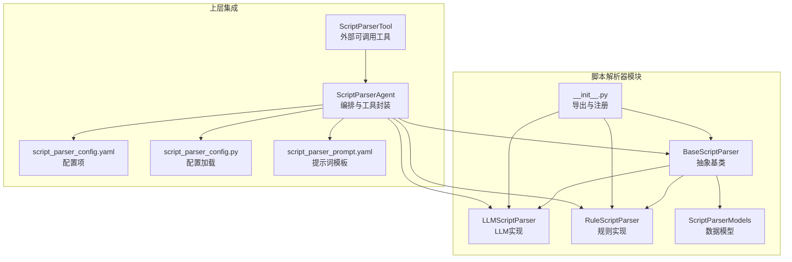
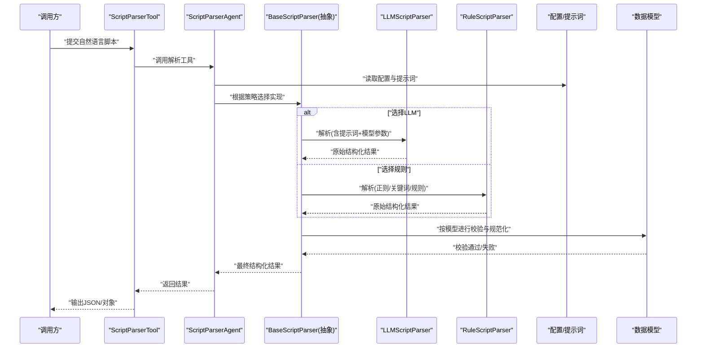
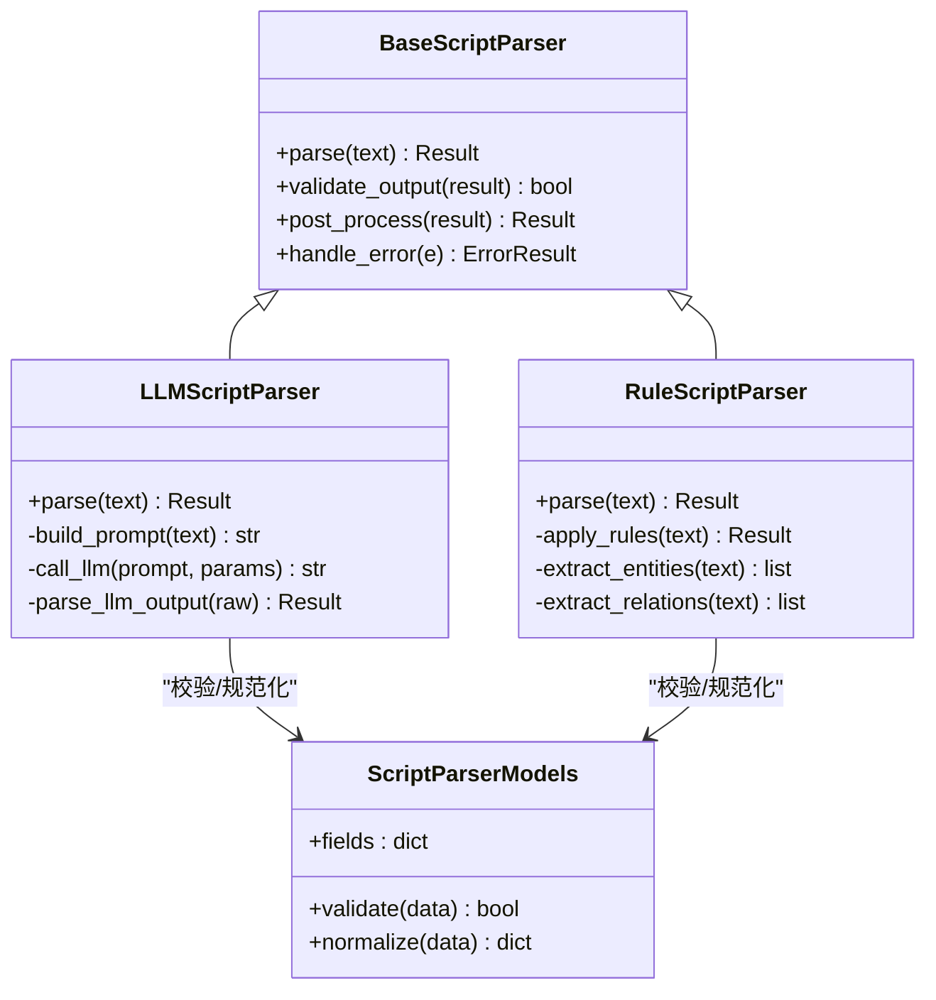
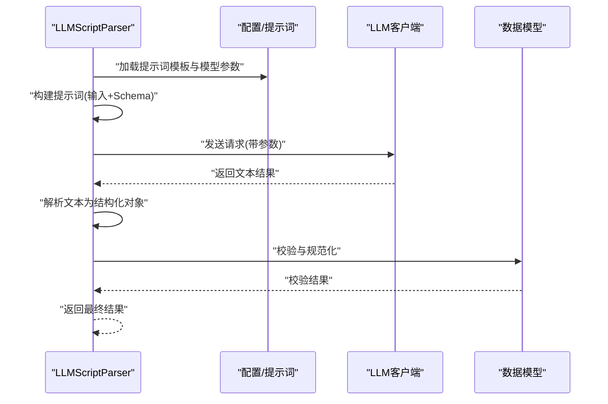
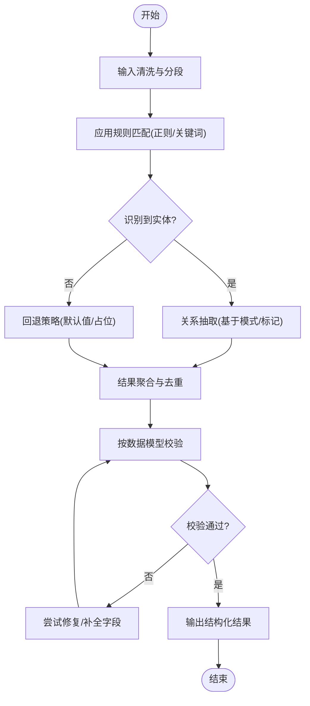
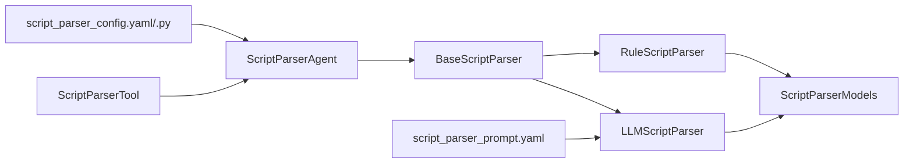

# 脚本解析器

<cite>
**本文引用的文件**   
- [base_script_parser.py](file://src/penshot/neopen/agent/script_parser/base_script_parser.py)
- [llm_script_parser.py](file://src/penshot/neopen/agent/script_parser/llm_script_parser.py)
- [rule_script_parser.py](file://src/penshot/neopen/agent/script_parser/rule_script_parser.py)
- [script_parser_models.py](file://src/penshot/neopen/agent/script_parser/script_parser_models.py)
- [__init__.py](file://src/penshot/neopen/agent/script_parser/__init__.py)
- [script_parser_agent.py](file://src/penshot/neopen/agent/script_parser_agent.py)
- [script_parser_config.yaml](file://src/penshot/neopen/config/zh/script_parser_config.yaml)
- [script_parser_config.py](file://src/penshot/neopen/config/script_parser_config.py)
- [script_parser_prompt.yaml](file://src/penshot/neopen/prompts/v1.x/zh/script_parser_prompt.yaml)
- [script_parser_tool.py](file://src/penshot/neopen/tools/script_parser_tool.py)
- [test_script_parser.py](file://tests/test_script_parser.py)
</cite>

## 目录
1. [简介](#简介)
2. [项目结构](#项目结构)
3. [核心组件](#核心组件)
4. [架构总览](#架构总览)
5. [详细组件分析](#详细组件分析)
6. [依赖关系分析](#依赖关系分析)
7. [性能考虑](#性能考虑)
8. [故障排查指南](#故障排查指南)
9. [结论](#结论)
10. [附录](#附录)

## 简介
本文件面向“脚本解析器”子系统，聚焦于LLM驱动与规则引擎两种实现路径的统一抽象、选择策略、配置方式以及从自然语言到结构化数据的转换流程。文档重点包括：
- BaseScriptParser抽象类的设计模式与扩展点
- LLM脚本解析器与规则脚本解析器的差异、适用场景与切换方法
- 自然语言到结构化数据的处理链路（实体识别、关系提取、格式验证）
- 自定义解析器的开发指南（接口定义与实现要点）
- 使用案例与输出格式说明
- 性能优化技巧与错误处理机制

## 项目结构
脚本解析器位于neopen/agent/script_parser模块中，采用“抽象基类 + 多实现 + 工厂/代理”的分层组织方式，便于在LLM与规则之间灵活切换，同时保持上层调用一致。

图表来源
- [base_script_parser.py](file://src/penshot/neopen/agent/script_parser/base_script_parser.py)
- [llm_script_parser.py](file://src/penshot/neopen/agent/script_parser/llm_script_parser.py)
- [rule_script_parser.py](file://src/penshot/neopen/agent/script_parser/rule_script_parser.py)
- [script_parser_models.py](file://src/penshot/neopen/agent/script_parser/script_parser_models.py)
- [__init__.py](file://src/penshot/neopen/agent/script_parser/__init__.py)
- [script_parser_agent.py](file://src/penshot/neopen/agent/script_parser_agent.py)
- [script_parser_tool.py](file://src/penshot/neopen/tools/script_parser_tool.py)
- [script_parser_config.yaml](file://src/penshot/neopen/config/zh/script_parser_config.yaml)
- [script_parser_config.py](file://src/penshot/neopen/config/script_parser_config.py)
- [script_parser_prompt.yaml](file://src/penshot/neopen/prompts/v1.x/zh/script_parser_prompt.yaml)

章节来源
- [base_script_parser.py](file://src/penshot/neopen/agent/script_parser/base_script_parser.py)
- [llm_script_parser.py](file://src/penshot/neopen/agent/script_parser/llm_script_parser.py)
- [rule_script_parser.py](file://src/penshot/neopen/agent/script_parser/rule_script_parser.py)
- [script_parser_models.py](file://src/penshot/neopen/agent/script_parser/script_parser_models.py)
- [__init__.py](file://src/penshot/neopen/agent/script_parser/__init__.py)
- [script_parser_agent.py](file://src/penshot/neopen/agent/script_parser_agent.py)
- [script_parser_tool.py](file://src/penshot/neopen/tools/script_parser_tool.py)
- [script_parser_config.yaml](file://src/penshot/neopen/config/zh/script_parser_config.yaml)
- [script_parser_config.py](file://src/penshot/neopen/config/script_parser_config.py)
- [script_parser_prompt.yaml](file://src/penshot/neopen/prompts/v1.x/zh/script_parser_prompt.yaml)

## 核心组件
- BaseScriptParser抽象基类
  - 职责：定义统一的解析接口、输入校验、结果规范化与错误处理钩子；为不同实现提供一致的契约。
  - 关键设计点：
    - 统一入口方法：接收自然语言文本，返回结构化对象
    - 标准化输出：基于数据模型进行类型约束与字段校验
    - 可扩展点：预留提示词组装、后处理、重试与降级策略的钩子
- LLMScriptParser（LLM驱动）
  - 职责：通过大模型将自然语言脚本转换为结构化数据，支持提示词模板、模型参数与缓存策略
  - 特点：对复杂语义、隐含关系与长上下文具备更强理解能力
- RuleScriptParser（规则引擎）
  - 职责：基于正则、关键词、语法树或轻量规则集进行解析
  - 特点：低延迟、可解释性强、适合稳定且边界清晰的脚本格式
- ScriptParserModels（数据模型）
  - 职责：定义解析结果的Schema，包含字段名、类型、必填性、取值范围等
  - 作用：作为所有实现的统一输出契约，保障下游消费的一致性
- 配置与提示词
  - script_parser_config.yaml：控制LLM/规则的选择、模型参数、阈值、重试次数等
  - script_parser_prompt.yaml：LLM驱动的提示词模板，指导实体识别、关系抽取与输出格式
- 上层集成
  - ScriptParserAgent：编排解析流程，负责上下文注入、工具调用、错误恢复与日志记录
  - ScriptParserTool：对外暴露的可调用工具，供工作流或其他服务调用

章节来源
- [base_script_parser.py](file://src/penshot/neopen/agent/script_parser/base_script_parser.py)
- [llm_script_parser.py](file://src/penshot/neopen/agent/script_parser/llm_script_parser.py)
- [rule_script_parser.py](file://src/penshot/neopen/agent/script_parser/rule_script_parser.py)
- [script_parser_models.py](file://src/penshot/neopen/agent/script_parser/script_parser_models.py)
- [script_parser_config.yaml](file://src/penshot/neopen/config/zh/script_parser_config.yaml)
- [script_parser_config.py](file://src/penshot/neopen/config/script_parser_config.py)
- [script_parser_prompt.yaml](file://src/penshot/neopen/prompts/v1.x/zh/script_parser_prompt.yaml)
- [script_parser_agent.py](file://src/penshot/neopen/agent/script_parser_agent.py)
- [script_parser_tool.py](file://src/penshot/neopen/tools/script_parser_tool.py)

## 架构总览
下图展示了从用户输入到结构化输出的端到端流程，涵盖LLM与规则两条路径的选择与执行。

图表来源
- [script_parser_tool.py](file://src/penshot/neopen/tools/script_parser_tool.py)
- [script_parser_agent.py](file://src/penshot/neopen/agent/script_parser_agent.py)
- [base_script_parser.py](file://src/penshot/neopen/agent/script_parser/base_script_parser.py)
- [llm_script_parser.py](file://src/penshot/neopen/agent/script_parser/llm_script_parser.py)
- [rule_script_parser.py](file://src/penshot/neopen/agent/script_parser/rule_script_parser.py)
- [script_parser_config.yaml](file://src/penshot/neopen/config/zh/script_parser_config.yaml)
- [script_parser_prompt.yaml](file://src/penshot/neopen/prompts/v1.x/zh/script_parser_prompt.yaml)
- [script_parser_models.py](file://src/penshot/neopen/agent/script_parser/script_parser_models.py)

## 详细组件分析

### BaseScriptParser抽象类
- 设计目标
  - 统一解析接口：屏蔽LLM与规则差异，向上提供一致的方法签名与返回类型
  - 标准化输出：强制遵循数据模型的字段与类型约束
  - 可扩展点：提示词组装、后处理、重试与降级策略
- 关键职责
  - 输入预处理：清洗、分块、去噪
  - 解析调度：根据配置选择具体实现
  - 结果校验：基于数据模型进行强类型校验
  - 错误处理：捕获异常并转换为标准错误响应
- 扩展建议
  - 新增解析器时仅需继承抽象类并实现核心解析逻辑
  - 可在后处理阶段加入领域特定的修正与增强

章节来源
- [base_script_parser.py](file://src/penshot/neopen/agent/script_parser/base_script_parser.py)
- [script_parser_models.py](file://src/penshot/neopen/agent/script_parser/script_parser_models.py)

#### 类图（代码级）

图表来源
- [base_script_parser.py](file://src/penshot/neopen/agent/script_parser/base_script_parser.py)
- [llm_script_parser.py](file://src/penshot/neopen/agent/script_parser/llm_script_parser.py)
- [rule_script_parser.py](file://src/penshot/neopen/agent/script_parser/rule_script_parser.py)
- [script_parser_models.py](file://src/penshot/neopen/agent/script_parser/script_parser_models.py)

### LLMScriptParser（LLM驱动）
- 工作原理
  - 提示词组装：结合脚本内容、任务描述与输出Schema生成提示词
  - 模型调用：携带模型参数（温度、最大长度、重试等）发起请求
  - 结果解析：将模型返回的文本解析为结构化对象，并进行二次校验
- 优势与适用场景
  - 适合复杂语义、隐含关系、跨句依赖与自然表达
  - 需要较高准确性与灵活性，能容忍一定延迟
- 配置要点
  - 模型选择、温度、最大生成长度、重试次数、超时时间
  - 提示词模板版本与语言包选择
- 注意事项
  - 需关注模型输出稳定性与一致性
  - 建议在调用前做输入裁剪与上下文压缩

章节来源
- [llm_script_parser.py](file://src/penshot/neopen/agent/script_parser/llm_script_parser.py)
- [script_parser_prompt.yaml](file://src/penshot/neopen/prompts/v1.x/zh/script_parser_prompt.yaml)
- [script_parser_config.yaml](file://src/penshot/neopen/config/zh/script_parser_config.yaml)

#### 序列图（LLM解析流程）

图表来源
- [llm_script_parser.py](file://src/penshot/neopen/agent/script_parser/llm_script_parser.py)
- [script_parser_prompt.yaml](file://src/penshot/neopen/prompts/v1.x/zh/script_parser_prompt.yaml)
- [script_parser_config.yaml](file://src/penshot/neopen/config/zh/script_parser_config.yaml)
- [script_parser_models.py](file://src/penshot/neopen/agent/script_parser/script_parser_models.py)

### RuleScriptParser（规则引擎）
- 工作原理
  - 规则匹配：基于正则表达式、关键词词典、简单语法树进行片段切分与字段抽取
  - 实体识别：依据预定义模式识别角色、动作、场景等实体
  - 关系提取：根据固定句式或标记符建立实体间关系
  - 结果聚合：合并局部结果，形成完整结构化对象
- 优势与适用场景
  - 低延迟、高可解释性、资源占用小
  - 适合格式相对稳定的脚本或特定领域的半结构化文本
- 维护要点
  - 规则库需随业务演进持续迭代
  - 建议引入单元测试覆盖典型用例与边界条件

章节来源
- [rule_script_parser.py](file://src/penshot/neopen/agent/script_parser/rule_script_parser.py)
- [script_parser_models.py](file://src/penshot/neopen/agent/script_parser/script_parser_models.py)

#### 流程图（规则解析算法）

图表来源
- [rule_script_parser.py](file://src/penshot/neopen/agent/script_parser/rule_script_parser.py)
- [script_parser_models.py](file://src/penshot/neopen/agent/script_parser/script_parser_models.py)

### 数据模型与格式验证
- 数据模型职责
  - 定义字段名称、类型、是否必填、取值范围与默认值
  - 提供校验与规范化方法，确保输出一致性
- 验证流程
  - 类型检查：字符串、数字、布尔、枚举、列表、字典嵌套
  - 约束检查：非空、最小/最大长度、正则匹配、枚举值域
  - 规范化：大小写统一、单位换算、时间格式化、ID归一化
- 错误反馈
  - 明确标注缺失字段、类型不匹配、越界值等错误信息
  - 提供修复建议与自动补全策略（如默认值）

章节来源
- [script_parser_models.py](file://src/penshot/neopen/agent/script_parser/script_parser_models.py)

### 配置与提示词管理
- 配置项（示例维度）
  - 解析器选择：LLM或规则
  - LLM参数：模型名称、温度、最大长度、重试次数、超时
  - 规则参数：阈值、关键词权重、正则优先级
  - 输出选项：是否包含元数据、置信度、中间过程
- 提示词模板
  - 版本化管理：v1.x/zh下的中文模板
  - 动态变量：输入文本、Schema、示例、约束条件
  - 语言适配：中英文模板分离，便于本地化

章节来源
- [script_parser_config.yaml](file://src/penshot/neopen/config/zh/script_parser_config.yaml)
- [script_parser_config.py](file://src/penshot/neopen/config/script_parser_config.py)
- [script_parser_prompt.yaml](file://src/penshot/neopen/prompts/v1.x/zh/script_parser_prompt.yaml)

### 上层集成与工具封装
- ScriptParserAgent
  - 负责编排：加载配置、选择解析器、调用实现、错误恢复、日志记录
  - 上下文注入：将任务上下文、历史结果、知识库检索结果注入提示词
- ScriptParserTool
  - 对外暴露：以工具形式被工作流或其他服务调用
  - 输入输出：接受自然语言脚本，返回结构化JSON/对象

章节来源
- [script_parser_agent.py](file://src/penshot/neopen/agent/script_parser_agent.py)
- [script_parser_tool.py](file://src/penshot/neopen/tools/script_parser_tool.py)

### 自定义解析器开发指南
- 步骤概览
  - 继承BaseScriptParser，实现核心解析方法
  - 遵循ScriptParserModels定义的输出Schema
  - 在配置中注册新解析器类型，并在选择策略中启用
- 接口约定
  - 输入：纯文本或结构化片段
  - 输出：符合数据模型的字典/对象
  - 错误：抛出标准异常或返回错误对象
- 最佳实践
  - 先实现规则解析器，再逐步引入LLM增强
  - 增加单元测试覆盖典型用例与边界条件
  - 提供可配置的阈值与开关，便于灰度发布

章节来源
- [base_script_parser.py](file://src/penshot/neopen/agent/script_parser/base_script_parser.py)
- [script_parser_models.py](file://src/penshot/neopen/agent/script_parser/script_parser_models.py)
- [__init__.py](file://src/penshot/neopen/agent/script_parser/__init__.py)

### 使用案例与输出格式
- 典型用例
  - 将自然语言脚本转换为镜头/场景/对话/动作的结构化表示
  - 批量处理脚本文件，输出统一JSON
- 输出格式
  - 顶层字段：脚本标题、版本、元数据
  - 主体字段：场景列表、镜头列表、对话条目、动作条目
  - 每个条目包含：ID、类型、时间戳、实体、关系、置信度
- 参考样例
  - 示例结果文件可用于对照字段结构与取值范围

章节来源
- [test_script_parser.py](file://tests/test_script_parser.py)
- [script_parser_models.py](file://src/penshot/neopen/agent/script_parser/script_parser_models.py)

## 依赖关系分析
- 内部依赖
  - 抽象基类与实现：BaseScriptParser -> LLMScriptParser / RuleScriptParser
  - 数据模型：所有实现均依赖ScriptParserModels进行校验与规范化
  - 配置与提示词：解析器在运行时加载配置与模板
  - 上层集成：Agent与Tool组合调用解析器
- 外部依赖
  - LLM客户端：由上层LLM客户端模块提供（不在本小节展开）
  - 配置加载：YAML与Python配置类协同工作

图表来源
- [base_script_parser.py](file://src/penshot/neopen/agent/script_parser/base_script_parser.py)
- [llm_script_parser.py](file://src/penshot/neopen/agent/script_parser/llm_script_parser.py)
- [rule_script_parser.py](file://src/penshot/neopen/agent/script_parser/rule_script_parser.py)
- [script_parser_models.py](file://src/penshot/neopen/agent/script_parser/script_parser_models.py)
- [script_parser_agent.py](file://src/penshot/neopen/agent/script_parser_agent.py)
- [script_parser_tool.py](file://src/penshot/neopen/tools/script_parser_tool.py)
- [script_parser_config.yaml](file://src/penshot/neopen/config/zh/script_parser_config.yaml)
- [script_parser_config.py](file://src/penshot/neopen/config/script_parser_config.py)
- [script_parser_prompt.yaml](file://src/penshot/neopen/prompts/v1.x/zh/script_parser_prompt.yaml)

章节来源
- [base_script_parser.py](file://src/penshot/neopen/agent/script_parser/base_script_parser.py)
- [llm_script_parser.py](file://src/penshot/neopen/agent/script_parser/llm_script_parser.py)
- [rule_script_parser.py](file://src/penshot/neopen/agent/script_parser/rule_script_parser.py)
- [script_parser_models.py](file://src/penshot/neopen/agent/script_parser/script_parser_models.py)
- [script_parser_agent.py](file://src/penshot/neopen/agent/script_parser_agent.py)
- [script_parser_tool.py](file://src/penshot/neopen/tools/script_parser_tool.py)
- [script_parser_config.yaml](file://src/penshot/neopen/config/zh/script_parser_config.yaml)
- [script_parser_config.py](file://src/penshot/neopen/config/script_parser_config.py)
- [script_parser_prompt.yaml](file://src/penshot/neopen/prompts/v1.x/zh/script_parser_prompt.yaml)

## 性能考虑
- 解析器选择策略
  - 优先规则解析器用于稳定格式与高频短文本，降低延迟与成本
  - 对复杂语义或长上下文使用LLM解析器，必要时开启缓存与批处理
- 提示词与输入优化
  - 输入裁剪：仅保留必要上下文，减少token消耗
  - 模板精简：去除冗余指令，提高模型响应速度
- 并发与缓存
  - 并行调用：对独立脚本进行并发解析
  - 结果缓存：相同输入命中缓存，避免重复计算
- 重试与超时
  - 合理设置重试次数与退避策略，避免雪崩
  - 超时保护：防止长时间阻塞影响整体吞吐
- 监控与度量
  - 记录解析耗时、成功率、错误分布
  - 针对慢查询与失败热点进行专项优化

[本节为通用性能建议，无需列出具体文件来源]

## 故障排查指南
- 常见问题定位
  - 配置错误：检查解析器选择、模型参数、提示词版本
  - 提示词问题：确认模板变量替换正确、Schema一致
  - 模型调用失败：检查网络、鉴权、配额与限流
  - 规则失效：核对正则与关键词更新、优先级冲突
- 错误处理机制
  - 统一异常包装：将底层异常转换为标准错误对象
  - 降级策略：LLM失败回退至规则解析或默认值
  - 重试与熔断：限制重试次数，快速失败避免级联故障
- 调试建议
  - 开启详细日志：记录输入、提示词、模型响应与中间结果
  - 单元测试：覆盖典型用例与边界条件
  - 回归测试：变更规则或提示词后进行全量回归

章节来源
- [script_parser_agent.py](file://src/penshot/neopen/agent/script_parser_agent.py)
- [script_parser_tool.py](file://src/penshot/neopen/tools/script_parser_tool.py)
- [script_parser_config.yaml](file://src/penshot/neopen/config/zh/script_parser_config.yaml)
- [script_parser_prompt.yaml](file://src/penshot/neopen/prompts/v1.x/zh/script_parser_prompt.yaml)
- [test_script_parser.py](file://tests/test_script_parser.py)

## 结论
脚本解析器通过抽象基类统一了LLM与规则两种实现路径，提供了清晰的数据模型与配置体系，使上层调用保持一致性与可维护性。在实际工程中，建议优先采用规则解析器保证性能与可解释性，在复杂场景下引入LLM增强，并通过配置与提示词管理实现灵活切换与持续优化。

[本节为总结性内容，无需列出具体文件来源]

## 附录
- 术语表
  - 实体识别：从文本中抽取角色、动作、场景等关键元素
  - 关系提取：建立实体之间的关联关系
  - 格式验证：依据数据模型对输出进行强类型校验
- 参考样例
  - 示例结果文件可作为字段结构与取值范围的参考

章节来源
- [script_parser_models.py](file://src/penshot/neopen/agent/script_parser/script_parser_models.py)
- [test_script_parser.py](file://tests/test_script_parser.py)