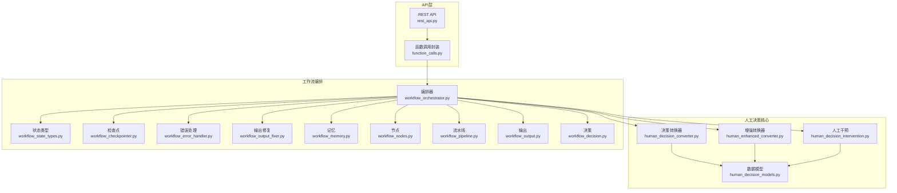
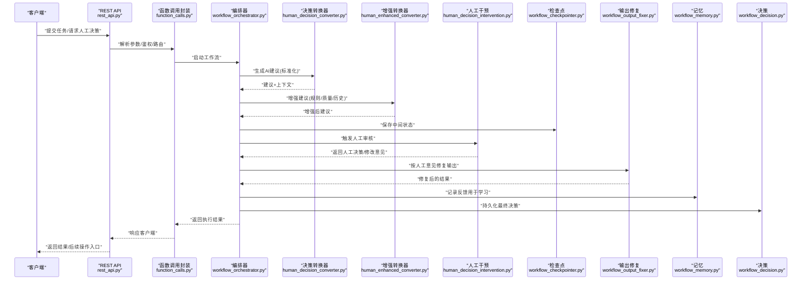
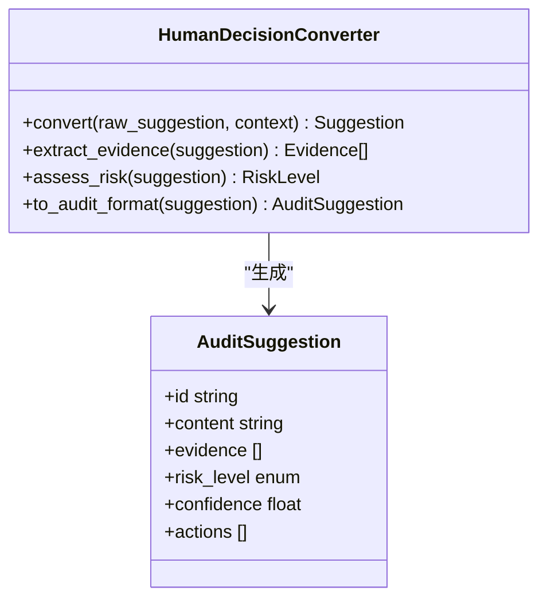
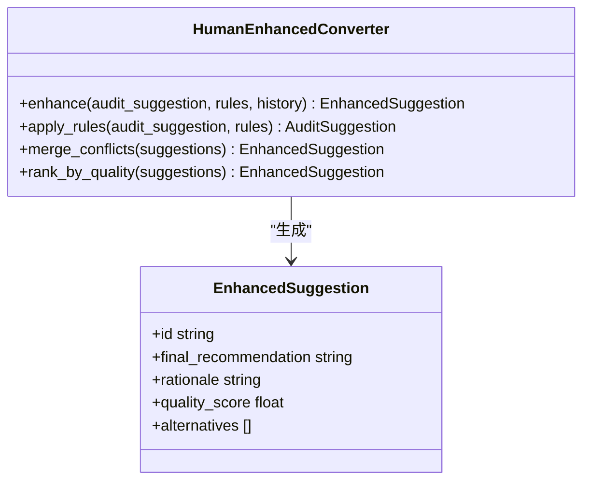
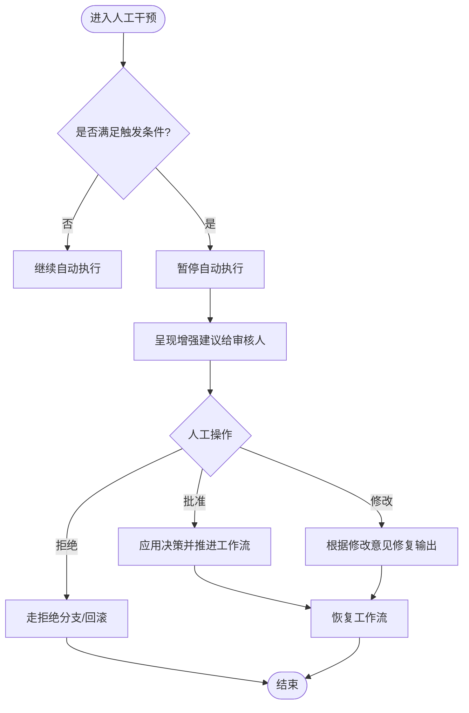
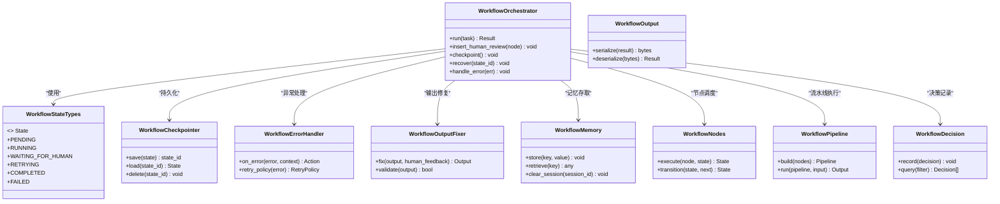
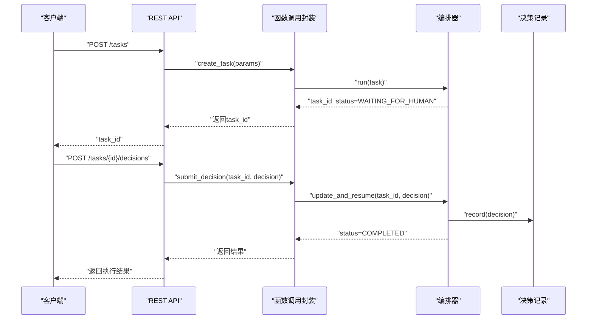
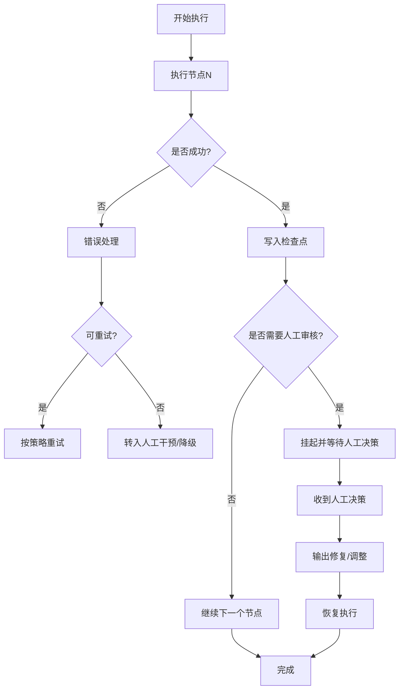
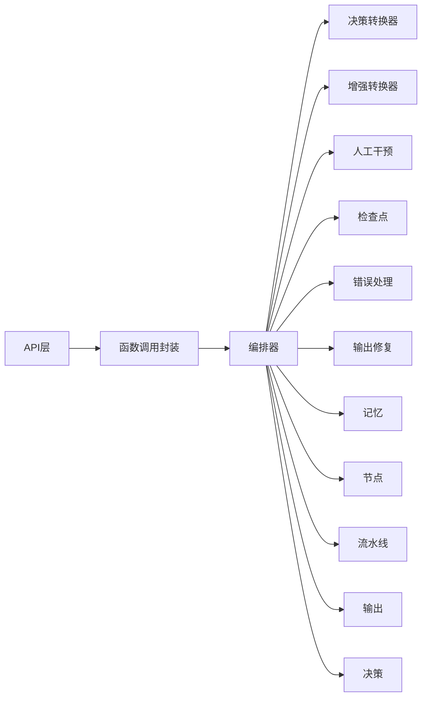

# 人工决策支持

<cite>
**本文引用的文件**   
- [human_decision_converter.py](file://src/penshot/neopen/agent/human_decision/human_decision_converter.py)
- [human_enhanced_converter.py](file://src/penshot/neopen/agent/human_decision/human_enhanced_converter.py)
- [human_decision_intervention.py](file://src/penshot/neopen/agent/human_decision/human_decision_intervention.py)
- [human_decision_models.py](file://src/penshot/neopen/agent/human_decision/human_decision_models.py)
- [workflow_orchestrator.py](file://src/penshot/neopen/agent/workflow/workflow_orchestrator.py)
- [workflow_state_types.py](file://src/penshot/neopen/agent/workflow/workflow_state_types.py)
- [workflow_checkpointer.py](file://src/penshot/neopen/agent/workflow/workflow_checkpointer.py)
- [workflow_error_handler.py](file://src/penshot/neopen/agent/workflow/workflow_error_handler.py)
- [workflow_output_fixer.py](file://src/penshot/neopen/agent/workflow/workflow_output_fixer.py)
- [workflow_memory.py](file://src/penshot/neopen/agent/workflow/workflow_memory.py)
- [workflow_nodes.py](file://src/penshot/neopen/agent/workflow/workflow_nodes.py)
- [workflow_pipeline.py](file://src/penshot/neopen/agent/workflow/workflow_pipeline.py)
- [workflow_output.py](file://src/penshot/neopen/agent/workflow/workflow_output.py)
- [workflow_decision.py](file://src/penshot/neopen/agent/workflow/workflow_decision.py)
- [rest_api.py](file://src/penshot/api/rest_api.py)
- [function_calls.py](file://src/penshot/api/function_calls.py)
</cite>

## 目录
1. [简介](#简介)
2. [项目结构](#项目结构)
3. [核心组件](#核心组件)
4. [架构总览](#架构总览)
5. [详细组件分析](#详细组件分析)
6. [依赖关系分析](#依赖关系分析)
7. [性能考量](#性能考量)
8. [故障排查指南](#故障排查指南)
9. [结论](#结论)
10. [附录](#附录)

## 简介
本文件面向“人工决策支持系统”的设计与实现，聚焦人机协作工作流：AI建议生成、人工审核确认、决策反馈学习；明确人工干预的触发条件与处理方式；解释“决策转换器”和“增强转换器”的实现原理；提供人工决策接口的集成方法；并给出工作流中断与恢复策略以及高效的人机协作界面与流程设计建议。

## 项目结构
围绕人工决策支持的相关代码主要位于以下模块：
- 人工决策核心：human_decision_*（转换器、干预、模型）
- 工作流编排：workflow_*（编排器、状态、检查点、错误处理、输出修复、记忆、节点、流水线、输出、决策）
- API 层：rest_api.py、function_calls.py（对外暴露人工决策接口）

图表来源
- [rest_api.py](file://src/penshot/api/rest_api.py)
- [function_calls.py](file://src/penshot/api/function_calls.py)
- [human_decision_converter.py](file://src/penshot/neopen/agent/human_decision/human_decision_converter.py)
- [human_enhanced_converter.py](file://src/penshot/neopen/agent/human_decision/human_enhanced_converter.py)
- [human_decision_intervention.py](file://src/penshot/neopen/agent/human_decision/human_decision_intervention.py)
- [human_decision_models.py](file://src/penshot/neopen/agent/human_decision/human_decision_models.py)
- [workflow_orchestrator.py](file://src/penshot/neopen/agent/workflow/workflow_orchestrator.py)
- [workflow_state_types.py](file://src/penshot/neopen/agent/workflow/workflow_state_types.py)
- [workflow_checkpointer.py](file://src/penshot/neopen/agent/workflow/workflow_checkpointer.py)
- [workflow_error_handler.py](file://src/penshot/neopen/agent/workflow/workflow_error_handler.py)
- [workflow_output_fixer.py](file://src/penshot/neopen/agent/workflow/workflow_output_fixer.py)
- [workflow_memory.py](file://src/penshot/neopen/agent/workflow/workflow_memory.py)
- [workflow_nodes.py](file://src/penshot/neopen/agent/workflow/workflow_nodes.py)
- [workflow_pipeline.py](file://src/penshot/neopen/agent/workflow/workflow_pipeline.py)
- [workflow_output.py](file://src/penshot/neopen/agent/workflow/workflow_output.py)
- [workflow_decision.py](file://src/penshot/neopen/agent/workflow/workflow_decision.py)

章节来源
- [rest_api.py](file://src/penshot/api/rest_api.py)
- [function_calls.py](file://src/penshot/api/function_calls.py)
- [human_decision_converter.py](file://src/penshot/neopen/agent/human_decision/human_decision_converter.py)
- [human_enhanced_converter.py](file://src/penshot/neopen/agent/human_decision/human_enhanced_converter.py)
- [human_decision_intervention.py](file://src/penshot/neopen/agent/human_decision/human_decision_intervention.py)
- [human_decision_models.py](file://src/penshot/neopen/agent/human_decision/human_decision_models.py)
- [workflow_orchestrator.py](file://src/penshot/neopen/agent/workflow/workflow_orchestrator.py)
- [workflow_state_types.py](file://src/penshot/neopen/agent/workflow/workflow_state_types.py)
- [workflow_checkpointer.py](file://src/penshot/neopen/agent/workflow/workflow_checkpointer.py)
- [workflow_error_handler.py](file://src/penshot/neopen/agent/workflow/workflow_error_handler.py)
- [workflow_output_fixer.py](file://src/penshot/neopen/agent/workflow/workflow_output_fixer.py)
- [workflow_memory.py](file://src/penshot/neopen/agent/workflow/workflow_memory.py)
- [workflow_nodes.py](file://src/penshot/neopen/agent/workflow/workflow_nodes.py)
- [workflow_pipeline.py](file://src/penshot/neopen/agent/workflow/workflow_pipeline.py)
- [workflow_output.py](file://src/penshot/neopen/agent/workflow/workflow_output.py)
- [workflow_decision.py](file://src/penshot/neopen/agent/workflow/workflow_decision.py)

## 核心组件
- 决策转换器：负责将上游任务或模型的原始建议转换为标准化的人工可审格式，并提供必要的上下文与证据摘要，便于人类快速判断。
- 增强转换器：在决策转换器的基础上，结合历史经验、规则校验、质量审计等能力对建议进行二次增强，提升可审性与采纳率。
- 人工干预：定义人工介入的触发条件、交互协议与回写机制，确保人工决策能够无缝融入自动化流水线。
- 数据模型：统一描述建议、人工决策、干预事件、反馈信号等数据结构，贯穿API、转换器与工作流。
- 工作流编排：以编排器为核心，串联节点、状态、检查点、错误处理、输出修复、记忆与决策，支撑“AI建议→人工审核→执行/修正→反馈学习”的闭环。

章节来源
- [human_decision_converter.py](file://src/penshot/neopen/agent/human_decision/human_decision_converter.py)
- [human_enhanced_converter.py](file://src/penshot/neopen/agent/human_decision/human_enhanced_converter.py)
- [human_decision_intervention.py](file://src/penshot/neopen/agent/human_decision/human_decision_intervention.py)
- [human_decision_models.py](file://src/penshot/neopen/agent/human_decision/human_decision_models.py)
- [workflow_orchestrator.py](file://src/penshot/neopen/agent/workflow/workflow_orchestrator.py)
- [workflow_state_types.py](file://src/penshot/neopen/agent/workflow/workflow_state_types.py)
- [workflow_checkpointer.py](file://src/penshot/neopen/agent/workflow/workflow_checkpointer.py)
- [workflow_error_handler.py](file://src/penshot/neopen/agent/workflow/workflow_error_handler.py)
- [workflow_output_fixer.py](file://src/penshot/neopen/agent/workflow/workflow_output_fixer.py)
- [workflow_memory.py](file://src/penshot/neopen/agent/workflow/workflow_memory.py)
- [workflow_nodes.py](file://src/penshot/neopen/agent/workflow/workflow_nodes.py)
- [workflow_pipeline.py](file://src/penshot/neopen/agent/workflow/workflow_pipeline.py)
- [workflow_output.py](file://src/penshot/neopen/agent/workflow/workflow_output.py)
- [workflow_decision.py](file://src/penshot/neopen/agent/workflow/workflow_decision.py)

## 架构总览
下图展示了从API到人工决策再到工作流执行的端到端流程，包括AI建议生成、人工审核、决策落盘与反馈学习。

图表来源
- [rest_api.py](file://src/penshot/api/rest_api.py)
- [function_calls.py](file://src/penshot/api/function_calls.py)
- [workflow_orchestrator.py](file://src/penshot/neopen/agent/workflow/workflow_orchestrator.py)
- [human_decision_converter.py](file://src/penshot/neopen/agent/human_decision/human_decision_converter.py)
- [human_enhanced_converter.py](file://src/penshot/neopen/agent/human_decision/human_enhanced_converter.py)
- [human_decision_intervention.py](file://src/penshot/neopen/agent/human_decision/human_decision_intervention.py)
- [workflow_checkpointer.py](file://src/penshot/neopen/agent/workflow/workflow_checkpointer.py)
- [workflow_output_fixer.py](file://src/penshot/neopen/agent/workflow/workflow_output_fixer.py)
- [workflow_memory.py](file://src/penshot/neopen/agent/workflow/workflow_memory.py)
- [workflow_decision.py](file://src/penshot/neopen/agent/workflow/workflow_decision.py)

## 详细组件分析

### 决策转换器（Human Decision Converter）
职责
- 将上游任务或模型的原始建议转换为统一的“可审建议”结构，包含建议内容、依据、风险等级、影响范围、可选动作等。
- 为人工审核提供最小必要上下文与关键证据摘要，降低认知负荷。
- 与数据模型对齐，保证序列化/反序列化的稳定性。

关键流程
- 输入：上游建议、上下文、约束
- 处理：规范化字段、抽取证据、标注置信度与风险
- 输出：标准建议对象，供增强转换器与人工审核使用

图表来源
- [human_decision_converter.py](file://src/penshot/neopen/agent/human_decision/human_decision_converter.py)
- [human_decision_models.py](file://src/penshot/neopen/agent/human_decision/human_decision_models.py)

章节来源
- [human_decision_converter.py](file://src/penshot/neopen/agent/human_decision/human_decision_converter.py)
- [human_decision_models.py](file://src/penshot/neopen/agent/human_decision/human_decision_models.py)

### 增强转换器（Human Enhanced Converter）
职责
- 在决策转换器的基础上，引入规则校验、质量审计、历史经验匹配等能力，对建议进行二次增强。
- 合并冲突建议、去重、优先级排序，形成更稳健的“增强建议”。
- 为人工审核提供更丰富的对比信息与推荐动作。

关键流程
- 输入：标准建议、规则集、质量审计结果、历史案例
- 处理：规则匹配、冲突消解、相似度检索、评分排序
- 输出：增强建议对象，附带增强原因与差异说明

图表来源
- [human_enhanced_converter.py](file://src/penshot/neopen/agent/human_decision/human_enhanced_converter.py)
- [human_decision_models.py](file://src/penshot/neopen/agent/human_decision/human_decision_models.py)

章节来源
- [human_enhanced_converter.py](file://src/penshot/neopen/agent/human_decision/human_enhanced_converter.py)
- [human_decision_models.py](file://src/penshot/neopen/agent/human_decision/human_decision_models.py)

### 人工干预（Human Decision Intervention）
职责
- 定义人工介入的触发条件（如高风险、低置信度、规则不通过、业务阈值）。
- 管理人工审核会话、交互协议、超时与重试。
- 将人工决策与修改意见回写到工作流状态，驱动后续执行或修复。

触发条件与处理
- 触发条件：风险等级高于阈值、置信度低于阈值、规则校验失败、用户显式要求人工审核。
- 处理方式：挂起自动执行、推送待审建议、等待人工确认/修改、记录干预日志。
- 超时与重试：设置审核时限，超时可降级策略或转交下一审核人。

图表来源
- [human_decision_intervention.py](file://src/penshot/neopen/agent/human_decision/human_decision_intervention.py)
- [workflow_orchestrator.py](file://src/penshot/neopen/agent/workflow/workflow_orchestrator.py)
- [workflow_state_types.py](file://src/penshot/neopen/agent/workflow/workflow_state_types.py)

章节来源
- [human_decision_intervention.py](file://src/penshot/neopen/agent/human_decision/human_decision_intervention.py)
- [workflow_orchestrator.py](file://src/penshot/neopen/agent/workflow/workflow_orchestrator.py)
- [workflow_state_types.py](file://src/penshot/neopen/agent/workflow/workflow_state_types.py)

### 工作流编排与状态
编排器负责串联各节点、维护状态、协调检查点与错误处理，并在需要时插入人工干预。

图表来源
- [workflow_orchestrator.py](file://src/penshot/neopen/agent/workflow/workflow_orchestrator.py)
- [workflow_state_types.py](file://src/penshot/neopen/agent/workflow/workflow_state_types.py)
- [workflow_checkpointer.py](file://src/penshot/neopen/agent/workflow/workflow_checkpointer.py)
- [workflow_error_handler.py](file://src/penshot/neopen/agent/workflow/workflow_error_handler.py)
- [workflow_output_fixer.py](file://src/penshot/neopen/agent/workflow/workflow_output_fixer.py)
- [workflow_memory.py](file://src/penshot/neopen/agent/workflow/workflow_memory.py)
- [workflow_nodes.py](file://src/penshot/neopen/agent/workflow/workflow_nodes.py)
- [workflow_pipeline.py](file://src/penshot/neopen/agent/workflow/workflow_pipeline.py)
- [workflow_output.py](file://src/penshot/neopen/agent/workflow/workflow_output.py)
- [workflow_decision.py](file://src/penshot/neopen/agent/workflow/workflow_decision.py)

章节来源
- [workflow_orchestrator.py](file://src/penshot/neopen/agent/workflow/workflow_orchestrator.py)
- [workflow_state_types.py](file://src/penshot/neopen/agent/workflow/workflow_state_types.py)
- [workflow_checkpointer.py](file://src/penshot/neopen/agent/workflow/workflow_checkpointer.py)
- [workflow_error_handler.py](file://src/penshot/neopen/agent/workflow/workflow_error_handler.py)
- [workflow_output_fixer.py](file://src/penshot/neopen/agent/workflow/workflow_output_fixer.py)
- [workflow_memory.py](file://src/penshot/neopen/agent/workflow/workflow_memory.py)
- [workflow_nodes.py](file://src/penshot/neopen/agent/workflow/workflow_nodes.py)
- [workflow_pipeline.py](file://src/penshot/neopen/agent/workflow/workflow_pipeline.py)
- [workflow_output.py](file://src/penshot/neopen/agent/workflow/workflow_output.py)
- [workflow_decision.py](file://src/penshot/neopen/agent/workflow/workflow_decision.py)

### 人工决策接口集成
- REST API：提供创建任务、查询建议、提交人工决策、获取执行结果等端点。
- 函数调用封装：统一参数校验、鉴权、路由与响应格式化，简化上层调用。

集成步骤
- 初始化编排器与相关组件（检查点、错误处理、输出修复、记忆、决策）。
- 通过函数调用封装发起任务，编排器自动生成建议并进入人工审核阶段。
- 客户端调用REST API提交人工决策，编排器更新状态并继续执行。
- 查询执行结果与决策记录，完成闭环。

图表来源
- [rest_api.py](file://src/penshot/api/rest_api.py)
- [function_calls.py](file://src/penshot/api/function_calls.py)
- [workflow_orchestrator.py](file://src/penshot/neopen/agent/workflow/workflow_orchestrator.py)
- [workflow_decision.py](file://src/penshot/neopen/agent/workflow/workflow_decision.py)

章节来源
- [rest_api.py](file://src/penshot/api/rest_api.py)
- [function_calls.py](file://src/penshot/api/function_calls.py)
- [workflow_orchestrator.py](file://src/penshot/neopen/agent/workflow/workflow_orchestrator.py)
- [workflow_decision.py](file://src/penshot/neopen/agent/workflow/workflow_decision.py)

### 工作流中断与恢复策略
- 中断点：在人工审核前、输出修复前、外部依赖调用前后设置检查点。
- 恢复方式：基于检查点ID加载状态，重新执行未完成的节点，保持幂等性。
- 容错策略：错误分类、重试策略、降级路径、人工兜底。

图表来源
- [workflow_checkpointer.py](file://src/penshot/neopen/agent/workflow/workflow_checkpointer.py)
- [workflow_error_handler.py](file://src/penshot/neopen/agent/workflow/workflow_error_handler.py)
- [workflow_output_fixer.py](file://src/penshot/neopen/agent/workflow/workflow_output_fixer.py)
- [workflow_orchestrator.py](file://src/penshot/neopen/agent/workflow/workflow_orchestrator.py)

章节来源
- [workflow_checkpointer.py](file://src/penshot/neopen/agent/workflow/workflow_checkpointer.py)
- [workflow_error_handler.py](file://src/penshot/neopen/agent/workflow/workflow_error_handler.py)
- [workflow_output_fixer.py](file://src/penshot/neopen/agent/workflow/workflow_output_fixer.py)
- [workflow_orchestrator.py](file://src/penshot/neopen/agent/workflow/workflow_orchestrator.py)

### 高效人机协作界面与流程设计
- 信息分层：首屏展示关键建议与风险等级，详情展开证据与替代方案。
- 快捷操作：一键批准/拒绝/微调，支持批量审核与模板化修改。
- 实时反馈：显示审核进度、剩余待审数量、平均耗时与通过率。
- 可追溯：每条决策关联任务ID、时间戳、变更差异与影响评估。
- 防误触：高风险操作需二次确认，支持撤销与回滚。
- 多角色协同：审核人、复核人、管理员权限分离，支持会签与升级。

[本节为概念性指导，无需源码引用]

## 依赖关系分析
- 松耦合：转换器与编排器通过标准数据模型交互，降低耦合度。
- 内聚性：人工决策核心模块内部高内聚，便于独立演进与测试。
- 外部依赖：API层与编排器之间通过函数调用封装隔离，便于替换实现。
- 循环依赖：避免直接双向导入，采用接口/模型作为契约。

图表来源
- [rest_api.py](file://src/penshot/api/rest_api.py)
- [function_calls.py](file://src/penshot/api/function_calls.py)
- [workflow_orchestrator.py](file://src/penshot/neopen/agent/workflow/workflow_orchestrator.py)
- [human_decision_converter.py](file://src/penshot/neopen/agent/human_decision/human_decision_converter.py)
- [human_enhanced_converter.py](file://src/penshot/neopen/agent/human_decision/human_enhanced_converter.py)
- [human_decision_intervention.py](file://src/penshot/neopen/agent/human_decision/human_decision_intervention.py)
- [workflow_checkpointer.py](file://src/penshot/neopen/agent/workflow/workflow_checkpointer.py)
- [workflow_error_handler.py](file://src/penshot/neopen/agent/workflow/workflow_error_handler.py)
- [workflow_output_fixer.py](file://src/penshot/neopen/agent/workflow/workflow_output_fixer.py)
- [workflow_memory.py](file://src/penshot/neopen/agent/workflow/workflow_memory.py)
- [workflow_nodes.py](file://src/penshot/neopen/agent/workflow/workflow_nodes.py)
- [workflow_pipeline.py](file://src/penshot/neopen/agent/workflow/workflow_pipeline.py)
- [workflow_output.py](file://src/penshot/neopen/agent/workflow/workflow_output.py)
- [workflow_decision.py](file://src/penshot/neopen/agent/workflow/workflow_decision.py)

章节来源
- [rest_api.py](file://src/penshot/api/rest_api.py)
- [function_calls.py](file://src/penshot/api/function_calls.py)
- [workflow_orchestrator.py](file://src/penshot/neopen/agent/workflow/workflow_orchestrator.py)
- [human_decision_converter.py](file://src/penshot/neopen/agent/human_decision/human_decision_converter.py)
- [human_enhanced_converter.py](file://src/penshot/neopen/agent/human_decision/human_enhanced_converter.py)
- [human_decision_intervention.py](file://src/penshot/neopen/agent/human_decision/human_decision_intervention.py)
- [workflow_checkpointer.py](file://src/penshot/neopen/agent/workflow/workflow_checkpointer.py)
- [workflow_error_handler.py](file://src/penshot/neopen/agent/workflow/workflow_error_handler.py)
- [workflow_output_fixer.py](file://src/penshot/neopen/agent/workflow/workflow_output_fixer.py)
- [workflow_memory.py](file://src/penshot/neopen/agent/workflow/workflow_memory.py)
- [workflow_nodes.py](file://src/penshot/neopen/agent/workflow/workflow_nodes.py)
- [workflow_pipeline.py](file://src/penshot/neopen/agent/workflow/workflow_pipeline.py)
- [workflow_output.py](file://src/penshot/neopen/agent/workflow/workflow_output.py)
- [workflow_decision.py](file://src/penshot/neopen/agent/workflow/workflow_decision.py)

## 性能考量
- 批处理与分页：大批量建议应分批呈现与审核，避免单页过大导致卡顿。
- 缓存与复用：对重复建议与规则匹配结果进行缓存，减少计算开销。
- 异步与并发：非阻塞地生成建议与渲染UI，提升用户体验。
- 增量更新：仅展示差异与新增信息，减少冗余传输。
- 资源限制：对高风险操作增加限流与配额控制，防止滥用。

[本节为通用性能建议，无需源码引用]

## 故障排查指南
- 常见问题
  - 人工审核未触发：检查触发条件配置与阈值设置。
  - 状态卡住：查看检查点是否存在、状态是否处于WAITING_FOR_HUMAN。
  - 输出不一致：核对输出修复逻辑与人工修改意见是否被正确应用。
  - 决策未记录：确认决策记录接口是否被调用且无异常。
- 定位手段
  - 启用详细日志，关注编排器与各子模块的关键事件。
  - 导出检查点快照，对比前后状态差异。
  - 复现问题并回放工作流，观察节点执行顺序与返回值。
- 恢复措施
  - 使用检查点ID恢复状态，必要时清理无效会话。
  - 对可重试错误按策略重试，不可重试则转入人工兜底。

章节来源
- [workflow_checkpointer.py](file://src/penshot/neopen/agent/workflow/workflow_checkpointer.py)
- [workflow_error_handler.py](file://src/penshot/neopen/agent/workflow/workflow_error_handler.py)
- [workflow_output_fixer.py](file://src/penshot/neopen/agent/workflow/workflow_output_fixer.py)
- [workflow_orchestrator.py](file://src/penshot/neopen/agent/workflow/workflow_orchestrator.py)

## 结论
本系统通过“决策转换器+增强转换器+人工干预”的组合，构建了稳定可靠的人机协作闭环。借助工作流编排、检查点与错误处理机制，实现了可中断、可恢复、可追溯的决策流程。配合清晰的API与函数调用封装，便于集成与扩展。未来可在规则库、质量审计与记忆学习上持续优化，进一步提升建议质量与审核效率。

[本节为总结性内容，无需源码引用]

## 附录
- 术语表
  - 建议：由AI生成的初步决策或行动项。
  - 增强建议：经过规则、质量与历史经验增强的建议。
  - 人工干预：人类审核者对建议的批准、修改或拒绝。
  - 检查点：工作流执行过程中的状态快照。
  - 决策记录：最终决策及其上下文的持久化存储。

[本节为概念性附录，无需源码引用]