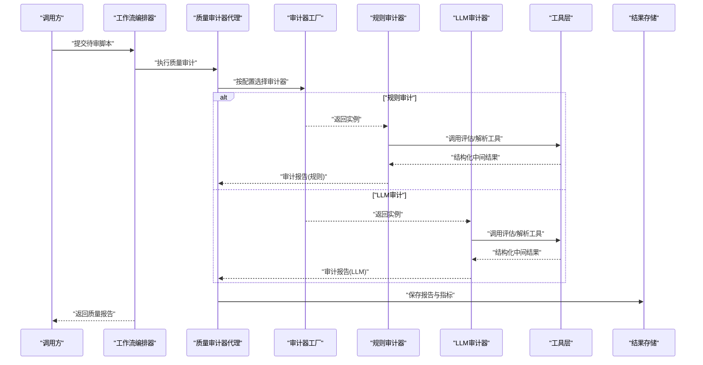
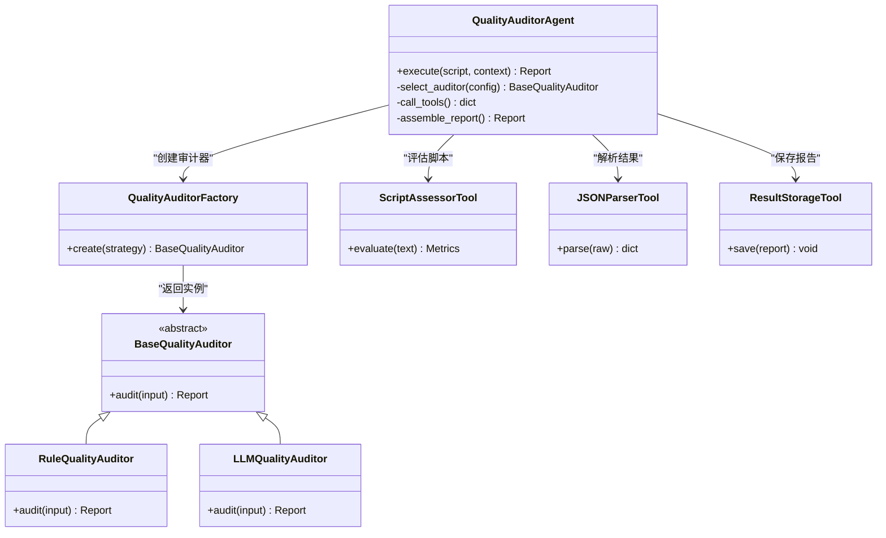
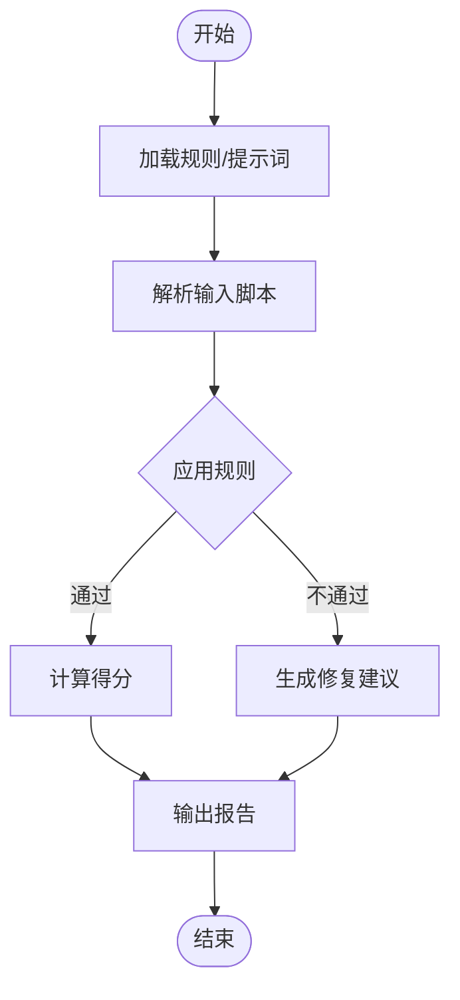
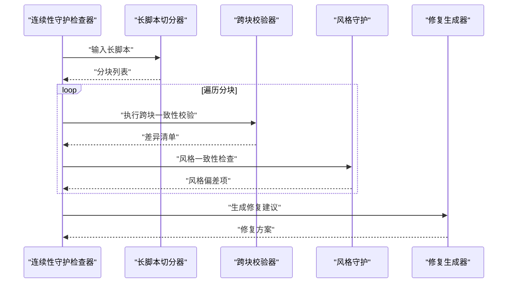
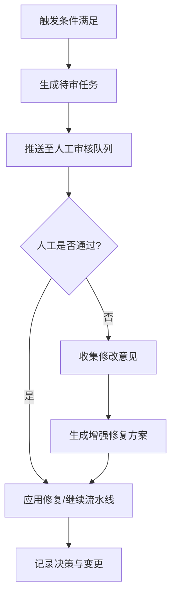
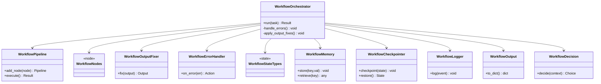
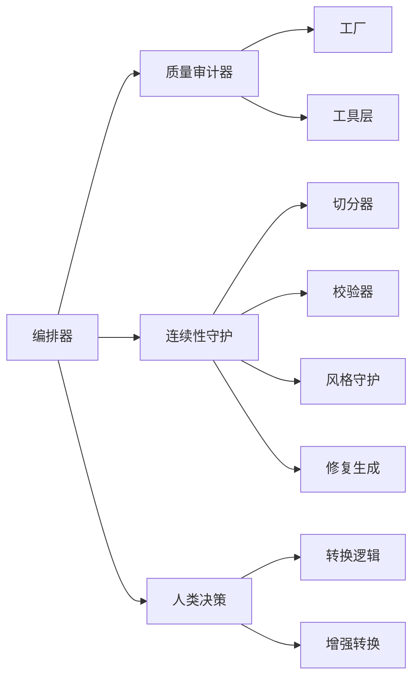

# 质量保证系统

<cite>
**本文引用的文件**   
- [quality_auditor_agent.py](file://src/penshot/neopen/agent/quality_auditor_agent.py)
- [base_quality_auditor.py](file://src/penshot/neopen/agent/quality_auditor/base_quality_auditor.py)
- [llm_quality_auditor.py](file://src/penshot/neopen/agent/quality_auditor/llm_quality_auditor.py)
- [rule_quality_auditor.py](file://src/penshot/neopen/agent/quality_auditor/rule_quality_auditor.py)
- [quality_auditor_factory.py](file://src/penshot/neopen/agent/quality_auditor/quality_auditor_factory.py)
- [quality_auditor_models.py](file://src/penshot/neopen/agent/quality_auditor/quality_auditor_models.py)
- [quality_auditor_enum.py](file://src/penshot/neopen/agent/quality_auditor/quality_auditor_enum.py)
- [continuity_guardian_checker.py](file://src/penshot/neopen/agent/continuity_guardian/continuity_guardian_checker.py)
- [consistency_contract.py](file://src/penshot/neopen/agent/continuity_guardian/consistency_contract.py)
- [cross_chunk_validator.py](file://src/penshot/neopen/agent/continuity_guardian/cross_chunk_validator.py)
- [long_script_chunker.py](file://src/penshot/neopen/agent/continuity_guardian/long_script_chunker.py)
- [prompt_style_guardian.py](file://src/penshot/neopen/agent/continuity_guardian/prompt_style_guardian.py)
- [continuity_repair_generator.py](file://src/penshot/neopen/agent/continuity_guardian/continuity_repair_generator.py)
- [human_decision_intervention.py](file://src/penshot/neopen/agent/human_decision/human_decision_intervention.py)
- [human_decision_converter.py](file://src/penshot/neopen/agent/human_decision/human_decision_converter.py)
- [human_enhanced_converter.py](file://src/penshot/neopen/agent/human_decision/human_enhanced_converter.py)
- [workflow_orchestrator.py](file://src/penshot/neopen/agent/workflow/workflow_orchestrator.py)
- [workflow_output_fixer.py](file://src/penshot/neopen/agent/workflow/workflow_output_fixer.py)
- [workflow_error_handler.py](file://src/penshot/neopen/agent/workflow/workflow_error_handler.py)
- [workflow_state_types.py](file://src/penshot/neopen/agent/workflow/workflow_state_types.py)
- [workflow_pipeline.py](file://src/penshot/neopen/agent/workflow/workflow_pipeline.py)
- [workflow_nodes.py](file://src/penshot/neopen/agent/workflow/workflow_nodes.py)
- [workflow_memory.py](file://src/penshot/neopen/agent/workflow/workflow_memory.py)
- [workflow_checkpointer.py](file://src/penshot/neopen/agent/workflow/workflow_checkpointer.py)
- [workflow_logger.py](file://src/penshot/neopen/agent/workflow/workflow_logger.py)
- [workflow_output.py](file://src/penshot/neopen/agent/workflow/workflow_output.py)
- [workflow_decision.py](file://src/penshot/neopen/agent/workflow/workflow_decision.py)
- [script_assessor_tool.py](file://src/penshot/neopen/tools/script_assessor_tool.py)
- [json_parser_tool.py](file://src/penshot/neopen/tools/json_parser_tool.py)
- [result_storage_tool.py](file://src/penshot/neopen/tools/result_storage_tool.py)
- [config_loader.py](file://src/penshot/config/config_loader.py)
- [settings.yaml](file://src/penshot/config/settings.yaml)
- [development.yaml](file://src/penshot/config/env/development.yaml)
- [production.yaml](file://src/penshot/config/env/production.yaml)
- [quality_auditor_prompt.yaml](file://src/penshot/prompts/v1.x/zh/quality_auditor_prompt.yaml)
- [quality_auditor_result.json](file://examples/json_demo/quality_auditor_result.json)
</cite>

## 目录
1. [简介](#简介)
2. [项目结构](#项目结构)
3. [核心组件](#核心组件)
4. [架构总览](#架构总览)
5. [详细组件分析](#详细组件分析)
6. [依赖关系分析](#依赖关系分析)
7. [性能考量](#性能考量)
8. [故障排查指南](#故障排查指南)
9. [结论](#结论)
10. [附录](#附录)

## 简介
本文件面向“视频片段代理”项目中的质量保证子系统，系统性阐述多维度质量评估机制、自动修复策略与人工干预流程、质量审计规则与指标、报告生成与分析方法、问题诊断与解决方案，以及质量改进的最佳实践与监控策略。文档以代码级事实为依据，结合流程图与时序图帮助读者快速理解并落地使用。

## 项目结构
质量保证相关能力主要分布在以下模块：
- 质量审计器（Quality Auditor）：提供基于规则与大模型的评估能力，输出结构化结果与评分。
- 连续性守护（Continuity Guardian）：跨分块一致性校验、风格守护与长脚本切分保障。
- 人类决策介入（Human Decision）：在关键节点引入人工确认或修正。
- 工作流编排（Workflow Orchestrator）：串联各阶段任务，驱动检查、修复与回滚。
- 工具层（Tools）：脚本评估、JSON解析、结果存储等辅助能力。
- 配置与提示词（Config & Prompts）：环境配置、审计提示模板与示例输出。

```mermaid
graph TB
subgraph "质量审计"
QA_Agent["质量审计器代理<br/>quality_auditor_agent.py"]
QA_Base["基类<br/>base_quality_auditor.py"]
QA_LLM["LLM审计器<br/>llm_quality_auditor.py"]
QA_Rule["规则审计器<br/>rule_quality_auditor.py"]
QA_Factory["工厂<br/>quality_auditor_factory.py"]
QA_Models["模型定义<br/>quality_auditor_models.py"]
QA_Enum["枚举<br/>quality_auditor_enum.py"]
end
subgraph "连续性守护"
CG_Checker["守护检查器<br/>continuity_guardian_checker.py"]
CG_Contract["一致性契约<br/>consistency_contract.py"]
CG_Cross["跨块校验<br/>cross_chunk_validator.py"]
CG_Chunker["长脚本切分<br/>long_script_chunker.py"]
CG_Style["风格守护<br/>prompt_style_guardian.py"]
CG_Repair["修复生成<br/>continuity_repair_generator.py"]
end
subgraph "人类决策"
HD_Intervene["介入流程<br/>human_decision_intervention.py"]
HD_Converter["转换逻辑<br/>human_decision_converter.py"]
HD_Enhanced["增强转换<br/>human_enhanced_converter.py"]
end
subgraph "工作流编排"
WF_Orchestrator["编排器<br/>workflow_orchestrator.py"]
WF_Pipeline["流水线<br/>workflow_pipeline.py"]
WF_Nodes["节点定义<br/>workflow_nodes.py"]
WF_OutputFixer["输出修复器<br/>workflow_output_fixer.py"]
WF_ErrorHandler["错误处理<br/>workflow_error_handler.py"]
WF_State["状态类型<br/>workflow_state_types.py"]
WF_Memory["记忆<br/>workflow_memory.py"]
WF_Checkpointer["检查点<br/>workflow_checkpointer.py"]
WF_Logger["日志<br/>workflow_logger.py"]
WF_Output["输出封装<br/>workflow_output.py"]
WF_Decision["决策<br/>workflow_decision.py"]
end
subgraph "工具"
Tool_Assess["脚本评估工具<br/>script_assessor_tool.py"]
Tool_JSON["JSON解析工具<br/>json_parser_tool.py"]
Tool_Store["结果存储工具<br/>result_storage_tool.py"]
end
subgraph "配置与提示"
CFG_Loader["配置加载器<br/>config_loader.py"]
CFG_Settings["设置<br/>settings.yaml"]
CFG_Dev["开发环境<br/>development.yaml"]
CFG_Prod["生产环境<br/>production.yaml"]
Prompt_QA["审计提示词<br/>quality_auditor_prompt.yaml"]
Example_Result["示例结果<br/>quality_auditor_result.json"]
end
QA_Agent --> QA_Factory
QA_Factory --> QA_Base
QA_Factory --> QA_LLM
QA_Factory --> QA_Rule
QA_Agent --> QA_Models
QA_Agent --> QA_Enum
WF_Orchestrator --> WF_Pipeline
WF_Orchestrator --> WF_Nodes
WF_Orchestrator --> WF_ErrorHandler
WF_Orchestrator --> WF_OutputFixer
WF_Orchestrator --> WF_State
WF_Orchestrator --> WF_Memory
WF_Orchestrator --> WF_Checkpointer
WF_Orchestrator --> WF_Logger
WF_Orchestrator --> WF_Output
WF_Orchestrator --> WF_Decision
WF_Orchestrator --> QA_Agent
WF_Orchestrator --> CG_Checker
WF_Orchestrator --> HD_Intervene
QA_Agent --> Tool_Assess
QA_Agent --> Tool_JSON
QA_Agent --> Tool_Store
QA_Agent --> Prompt_QA
QA_Agent --> CFG_Loader
CFG_Loader --> CFG_Settings
CFG_Loader --> CFG_Dev
CFG_Loader --> CFG_Prod
CG_Checker --> CG_Contract
CG_Checker --> CG_Cross
CG_Checker --> CG_Chunker
CG_Checker --> CG_Style
CG_Checker --> CG_Repair
```

图表来源
- [quality_auditor_agent.py:1-200](file://src/penshot/neopen/agent/quality_auditor_agent.py#L1-L200)
- [base_quality_auditor.py:1-200](file://src/penshot/neopen/agent/quality_auditor/base_quality_auditor.py#L1-L200)
- [llm_quality_auditor.py:1-200](file://src/penshot/neopen/agent/quality_auditor/llm_quality_auditor.py#L1-L200)
- [rule_quality_auditor.py:1-200](file://src/penshot/neopen/agent/quality_auditor/rule_quality_auditor.py#L1-L200)
- [quality_auditor_factory.py:1-200](file://src/penshot/neopen/agent/quality_auditor/quality_auditor_factory.py#L1-L200)
- [quality_auditor_models.py:1-200](file://src/penshot/neopen/agent/quality_auditor/quality_auditor_models.py#L1-L200)
- [quality_auditor_enum.py:1-200](file://src/penshot/neopen/agent/quality_auditor/quality_auditor_enum.py#L1-L200)
- [continuity_guardian_checker.py:1-200](file://src/penshot/neopen/agent/continuity_guardian/continuity_guardian_checker.py#L1-L200)
- [consistency_contract.py:1-200](file://src/penshot/neopen/agent/continuity_guardian/consistency_contract.py#L1-L200)
- [cross_chunk_validator.py:1-200](file://src/penshot/neopen/agent/continuity_guardian/cross_chunk_validator.py#L1-L200)
- [long_script_chunker.py:1-200](file://src/penshot/neopen/agent/continuity_guardian/long_script_chunker.py#L1-L200)
- [prompt_style_guardian.py:1-200](file://src/penshot/neopen/agent/continuity_guardian/prompt_style_guardian.py#L1-L200)
- [continuity_repair_generator.py:1-200](file://src/penshot/neopen/agent/continuity_guardian/continuity_repair_generator.py#L1-L200)
- [human_decision_intervention.py:1-200](file://src/penshot/neopen/agent/human_decision/human_decision_intervention.py#L1-L200)
- [human_decision_converter.py:1-200](file://src/penshot/neopen/agent/human_decision/human_decision_converter.py#L1-L200)
- [human_enhanced_converter.py:1-200](file://src/penshot/neopen/agent/human_decision/human_enhanced_converter.py#L1-L200)
- [workflow_orchestrator.py:1-200](file://src/penshot/neopen/agent/workflow/workflow_orchestrator.py#L1-L200)
- [workflow_pipeline.py:1-200](file://src/penshot/neopen/agent/workflow/workflow_pipeline.py#L1-L200)
- [workflow_nodes.py:1-200](file://src/penshot/neopen/agent/workflow/workflow_nodes.py#L1-L200)
- [workflow_output_fixer.py:1-200](file://src/penshot/neopen/agent/workflow/workflow_output_fixer.py#L1-L200)
- [workflow_error_handler.py:1-200](file://src/penshot/neopen/agent/workflow/workflow_error_handler.py#L1-L200)
- [workflow_state_types.py:1-200](file://src/penshot/neopen/agent/workflow/workflow_state_types.py#L1-L200)
- [workflow_memory.py:1-200](file://src/penshot/neopen/agent/workflow/workflow_memory.py#L1-L200)
- [workflow_checkpointer.py:1-200](file://src/penshot/neopen/agent/workflow/workflow_checkpointer.py#L1-L200)
- [workflow_logger.py:1-200](file://src/penshot/neopen/agent/workflow/workflow_logger.py#L1-L200)
- [workflow_output.py:1-200](file://src/penshot/neopen/agent/workflow/workflow_output.py#L1-L200)
- [workflow_decision.py:1-200](file://src/penshot/neopen/agent/workflow/workflow_decision.py#L1-L200)
- [script_assessor_tool.py:1-200](file://src/penshot/neopen/tools/script_assessor_tool.py#L1-L200)
- [json_parser_tool.py:1-200](file://src/penshot/neopen/tools/json_parser_tool.py#L1-L200)
- [result_storage_tool.py:1-200](file://src/penshot/neopen/tools/result_storage_tool.py#L1-L200)
- [config_loader.py:1-200](file://src/penshot/config/config_loader.py#L1-L200)
- [settings.yaml:1-200](file://src/penshot/config/settings.yaml#L1-L200)
- [development.yaml:1-200](file://src/penshot/config/env/development.yaml#L1-L200)
- [production.yaml:1-200](file://src/penshot/config/env/production.yaml#L1-L200)
- [quality_auditor_prompt.yaml:1-200](file://src/penshot/prompts/v1.x/zh/quality_auditor_prompt.yaml#L1-L200)
- [quality_auditor_result.json:1-200](file://examples/json_demo/quality_auditor_result.json#L1-L200)

章节来源
- [quality_auditor_agent.py:1-200](file://src/penshot/neopen/agent/quality_auditor_agent.py#L1-L200)
- [workflow_orchestrator.py:1-200](file://src/penshot/neopen/agent/workflow/workflow_orchestrator.py#L1-L200)
- [config_loader.py:1-200](file://src/penshot/config/config_loader.py#L1-L200)

## 核心组件
- 质量审计器代理：统一入口，负责调度具体审计器（规则/LLM），组装上下文，调用工具，产出标准化审计报告。
- 规则审计器：基于预置规则进行内容质量检查与一致性验证，适合稳定、可解释的强约束场景。
- LLM审计器：借助大模型进行语义层面的质量评估与修复建议生成，适合复杂文本与风格一致性判断。
- 工厂模式：根据配置动态选择审计器实现，支持扩展新策略。
- 连续性守护：对长脚本进行切分与跨块校验，维护叙事、术语、时间线等一致性；必要时生成修复方案。
- 人类决策介入：在低置信度或高风险分支触发人工审核与修正，确保最终交付质量。
- 工作流编排：将上述能力串成端到端流水线，包含错误处理、输出修复、记忆与检查点、日志与决策。

章节来源
- [quality_auditor_agent.py:1-200](file://src/penshot/neopen/agent/quality_auditor_agent.py#L1-L200)
- [rule_quality_auditor.py:1-200](file://src/penshot/neopen/agent/quality_auditor/rule_quality_auditor.py#L1-L200)
- [llm_quality_auditor.py:1-200](file://src/penshot/neopen/agent/quality_auditor/llm_quality_auditor.py#L1-L200)
- [quality_auditor_factory.py:1-200](file://src/penshot/neopen/agent/quality_auditor/quality_auditor_factory.py#L1-L200)
- [continuity_guardian_checker.py:1-200](file://src/penshot/neopen/agent/continuity_guardian/continuity_guardian_checker.py#L1-L200)
- [human_decision_intervention.py:1-200](file://src/penshot/neopen/agent/human_decision/human_decision_intervention.py#L1-L200)
- [workflow_orchestrator.py:1-200](file://src/penshot/neopen/agent/workflow/workflow_orchestrator.py#L1-L200)

## 架构总览
质量子系统采用“编排+插件”的架构：工作流编排器作为中枢，按需装配质量审计器、连续性守护与人类决策节点，并通过工具层完成数据读取、解析与持久化。配置与提示词驱动行为，保证在不同环境下的一致性与可观测性。

图表来源
- [workflow_orchestrator.py:1-200](file://src/penshot/neopen/agent/workflow/workflow_orchestrator.py#L1-L200)
- [quality_auditor_agent.py:1-200](file://src/penshot/neopen/agent/quality_auditor_agent.py#L1-L200)
- [quality_auditor_factory.py:1-200](file://src/penshot/neopen/agent/quality_auditor/quality_auditor_factory.py#L1-L200)
- [rule_quality_auditor.py:1-200](file://src/penshot/neopen/agent/quality_auditor/rule_quality_auditor.py#L1-L200)
- [llm_quality_auditor.py:1-200](file://src/penshot/neopen/agent/quality_auditor/llm_quality_auditor.py#L1-L200)
- [script_assessor_tool.py:1-200](file://src/penshot/neopen/tools/script_assessor_tool.py#L1-L200)
- [json_parser_tool.py:1-200](file://src/penshot/neopen/tools/json_parser_tool.py#L1-L200)
- [result_storage_tool.py:1-200](file://src/penshot/neopen/tools/result_storage_tool.py#L1-L200)

## 详细组件分析

### 质量审计器代理
职责
- 接收输入脚本与上下文，组装提示词与参数。
- 通过工厂选择规则或LLM审计器。
- 调用工具完成数据准备与结果持久化。
- 汇总并返回标准化审计报告。

关键交互
- 与工厂协作，依据配置决定审计策略。
- 与工具层协作，完成脚本评估、JSON解析与结果存储。
- 与工作流编排器协作，参与整体流水线控制。

图表来源
- [quality_auditor_agent.py:1-200](file://src/penshot/neopen/agent/quality_auditor_agent.py#L1-L200)
- [base_quality_auditor.py:1-200](file://src/penshot/neopen/agent/quality_auditor/base_quality_auditor.py#L1-L200)
- [rule_quality_auditor.py:1-200](file://src/penshot/neopen/agent/quality_auditor/rule_quality_auditor.py#L1-L200)
- [llm_quality_auditor.py:1-200](file://src/penshot/neopen/agent/quality_auditor/llm_quality_auditor.py#L1-L200)
- [quality_auditor_factory.py:1-200](file://src/penshot/neopen/agent/quality_auditor/quality_auditor_factory.py#L1-L200)
- [script_assessor_tool.py:1-200](file://src/penshot/neopen/tools/script_assessor_tool.py#L1-L200)
- [json_parser_tool.py:1-200](file://src/penshot/neopen/tools/json_parser_tool.py#L1-L200)
- [result_storage_tool.py:1-200](file://src/penshot/neopen/tools/result_storage_tool.py#L1-L200)

章节来源
- [quality_auditor_agent.py:1-200](file://src/penshot/neopen/agent/quality_auditor_agent.py#L1-L200)
- [quality_auditor_models.py:1-200](file://src/penshot/neopen/agent/quality_auditor/quality_auditor_models.py#L1-L200)
- [quality_auditor_enum.py:1-200](file://src/penshot/neopen/agent/quality_auditor/quality_auditor_enum.py#L1-L200)

### 规则审计器与LLM审计器
- 规则审计器：通过预置规则集对内容进行逐项检查，输出明确的通过/失败项与建议，适合强一致性与合规性要求高的场景。
- LLM审计器：利用大模型进行语义理解、风格匹配与修复建议生成，适合复杂表达与创意内容的质量把控。

图表来源
- [rule_quality_auditor.py:1-200](file://src/penshot/neopen/agent/quality_auditor/rule_quality_auditor.py#L1-L200)
- [llm_quality_auditor.py:1-200](file://src/penshot/neopen/agent/quality_auditor/llm_quality_auditor.py#L1-L200)
- [quality_auditor_prompt.yaml:1-200](file://src/penshot/prompts/v1.x/zh/quality_auditor_prompt.yaml#L1-L200)

章节来源
- [rule_quality_auditor.py:1-200](file://src/penshot/neopen/agent/quality_auditor/rule_quality_auditor.py#L1-L200)
- [llm_quality_auditor.py:1-200](file://src/penshot/neopen/agent/quality_auditor/llm_quality_auditor.py#L1-L200)
- [quality_auditor_prompt.yaml:1-200](file://src/penshot/prompts/v1.x/zh/quality_auditor_prompt.yaml#L1-L200)

### 连续性守护
职责
- 长脚本切分：将超长脚本合理分段，避免信息丢失与上下文断裂。
- 跨块校验：检测不同分块间的时间线、人物、术语、风格一致性。
- 风格守护：确保语言风格、叙述视角、节奏等保持一致。
- 修复生成：针对不一致项自动生成修复建议或补丁。

图表来源
- [continuity_guardian_checker.py:1-200](file://src/penshot/neopen/agent/continuity_guardian/continuity_guardian_checker.py#L1-L200)
- [long_script_chunker.py:1-200](file://src/penshot/neopen/agent/continuity_guardian/long_script_chunker.py#L1-L200)
- [cross_chunk_validator.py:1-200](file://src/penshot/neopen/agent/continuity_guardian/cross_chunk_validator.py#L1-L200)
- [prompt_style_guardian.py:1-200](file://src/penshot/neopen/agent/continuity_guardian/prompt_style_guardian.py#L1-L200)
- [continuity_repair_generator.py:1-200](file://src/penshot/neopen/agent/continuity_guardian/continuity_repair_generator.py#L1-L200)
- [consistency_contract.py:1-200](file://src/penshot/neopen/agent/continuity_guardian/consistency_contract.py#L1-L200)

章节来源
- [continuity_guardian_checker.py:1-200](file://src/penshot/neopen/agent/continuity_guardian/continuity_guardian_checker.py#L1-L200)
- [consistency_contract.py:1-200](file://src/penshot/neopen/agent/continuity_guardian/consistency_contract.py#L1-L200)
- [cross_chunk_validator.py:1-200](file://src/penshot/neopen/agent/continuity_guardian/cross_chunk_validator.py#L1-L200)
- [long_script_chunker.py:1-200](file://src/penshot/neopen/agent/continuity_guardian/long_script_chunker.py#L1-L200)
- [prompt_style_guardian.py:1-200](file://src/penshot/neopen/agent/continuity_guardian/prompt_style_guardian.py#L1-L200)
- [continuity_repair_generator.py:1-200](file://src/penshot/neopen/agent/continuity_guardian/continuity_repair_generator.py#L1-L200)

### 人类决策介入
职责
- 在质量阈值未达标或风险较高时，暂停自动化流程，转交人工审核。
- 提供结构化界面供人工修正，并将修正结果回写至流水线。
- 支持增强转换逻辑，将人工意见转化为可执行的修复动作。

图表来源
- [human_decision_intervention.py:1-200](file://src/penshot/neopen/agent/human_decision/human_decision_intervention.py#L1-L200)
- [human_decision_converter.py:1-200](file://src/penshot/neopen/agent/human_decision/human_decision_converter.py#L1-L200)
- [human_enhanced_converter.py:1-200](file://src/penshot/neopen/agent/human_decision/human_enhanced_converter.py#L1-L200)

章节来源
- [human_decision_intervention.py:1-200](file://src/penshot/neopen/agent/human_decision/human_decision_intervention.py#L1-L200)
- [human_decision_converter.py:1-200](file://src/penshot/neopen/agent/human_decision/human_decision_converter.py#L1-L200)
- [human_enhanced_converter.py:1-200](file://src/penshot/neopen/agent/human_decision/human_enhanced_converter.py#L1-L200)

### 工作流编排与输出修复
职责
- 编排质量审计、连续性守护与人类决策节点，形成端到端流水线。
- 提供错误处理、输出修复、记忆与检查点、日志与决策支持。
- 统一输出封装，便于下游消费与可视化展示。

图表来源
- [workflow_orchestrator.py:1-200](file://src/penshot/neopen/agent/workflow/workflow_orchestrator.py#L1-L200)
- [workflow_pipeline.py:1-200](file://src/penshot/neopen/agent/workflow/workflow_pipeline.py#L1-L200)
- [workflow_nodes.py:1-200](file://src/penshot/neopen/agent/workflow/workflow_nodes.py#L1-L200)
- [workflow_output_fixer.py:1-200](file://src/penshot/neopen/agent/workflow/workflow_output_fixer.py#L1-L200)
- [workflow_error_handler.py:1-200](file://src/penshot/neopen/agent/workflow/workflow_error_handler.py#L1-L200)
- [workflow_state_types.py:1-200](file://src/penshot/neopen/agent/workflow/workflow_state_types.py#L1-L200)
- [workflow_memory.py:1-200](file://src/penshot/neopen/agent/workflow/workflow_memory.py#L1-L200)
- [workflow_checkpointer.py:1-200](file://src/penshot/neopen/agent/workflow/workflow_checkpointer.py#L1-L200)
- [workflow_logger.py:1-200](file://src/penshot/neopen/agent/workflow/workflow_logger.py#L1-L200)
- [workflow_output.py:1-200](file://src/penshot/neopen/agent/workflow/workflow_output.py#L1-L200)
- [workflow_decision.py:1-200](file://src/penshot/neopen/agent/workflow/workflow_decision.py#L1-L200)

章节来源
- [workflow_orchestrator.py:1-200](file://src/penshot/neopen/agent/workflow/workflow_orchestrator.py#L1-L200)
- [workflow_output_fixer.py:1-200](file://src/penshot/neopen/agent/workflow/workflow_output_fixer.py#L1-L200)
- [workflow_error_handler.py:1-200](file://src/penshot/neopen/agent/workflow/workflow_error_handler.py#L1-L200)
- [workflow_state_types.py:1-200](file://src/penshot/neopen/agent/workflow/workflow_state_types.py#L1-L200)
- [workflow_memory.py:1-200](file://src/penshot/neopen/agent/workflow/workflow_memory.py#L1-L200)
- [workflow_checkpointer.py:1-200](file://src/penshot/neopen/agent/workflow/workflow_checkpointer.py#L1-L200)
- [workflow_logger.py:1-200](file://src/penshot/neopen/agent/workflow/workflow_logger.py#L1-L200)
- [workflow_output.py:1-200](file://src/penshot/neopen/agent/workflow/workflow_output.py#L1-L200)
- [workflow_decision.py:1-200](file://src/penshot/neopen/agent/workflow/workflow_decision.py#L1-L200)

### 配置与提示词
- 配置加载器：从设置与环境文件中加载审计策略、阈值、存储路径等。
- 提示词模板：为LLM审计器提供统一的中文提示词，确保评估维度与输出格式一致。
- 示例结果：提供标准输出样例，便于对接下游系统与可视化。

章节来源
- [config_loader.py:1-200](file://src/penshot/config/config_loader.py#L1-L200)
- [settings.yaml:1-200](file://src/penshot/config/settings.yaml#L1-L200)
- [development.yaml:1-200](file://src/penshot/config/env/development.yaml#L1-L200)
- [production.yaml:1-200](file://src/penshot/config/env/production.yaml#L1-L200)
- [quality_auditor_prompt.yaml:1-200](file://src/penshot/prompts/v1.x/zh/quality_auditor_prompt.yaml#L1-L200)
- [quality_auditor_result.json:1-200](file://examples/json_demo/quality_auditor_result.json#L1-L200)

## 依赖关系分析
- 松耦合设计：审计器通过工厂抽象，便于替换与扩展；工作流编排器通过接口组合各组件，降低直接依赖。
- 外部依赖：工具层提供脚本评估、JSON解析与结果存储；配置与提示词驱动行为；示例结果用于验收与回归。
- 潜在循环依赖：通过分层与接口隔离避免；若新增组件，应优先注入到编排器而非反向引用。

图表来源
- [workflow_orchestrator.py:1-200](file://src/penshot/neopen/agent/workflow/workflow_orchestrator.py#L1-L200)
- [quality_auditor_factory.py:1-200](file://src/penshot/neopen/agent/quality_auditor/quality_auditor_factory.py#L1-L200)
- [continuity_guardian_checker.py:1-200](file://src/penshot/neopen/agent/continuity_guardian/continuity_guardian_checker.py#L1-L200)
- [human_decision_converter.py:1-200](file://src/penshot/neopen/agent/human_decision/human_decision_converter.py#L1-L200)
- [human_enhanced_converter.py:1-200](file://src/penshot/neopen/agent/human_decision/human_enhanced_converter.py#L1-L200)

章节来源
- [workflow_orchestrator.py:1-200](file://src/penshot/neopen/agent/workflow/workflow_orchestrator.py#L1-L200)
- [quality_auditor_factory.py:1-200](file://src/penshot/neopen/agent/quality_auditor/quality_auditor_factory.py#L1-L200)
- [continuity_guardian_checker.py:1-200](file://src/penshot/neopen/agent/continuity_guardian/continuity_guardian_checker.py#L1-L200)

## 性能考量
- 批量处理与缓存：对重复脚本或相似片段启用缓存，减少重复计算与LLM调用。
- 规则优先：对高确定性场景优先使用规则审计器，降低延迟与成本。
- 异步与并行：在流水线中并行执行独立节点（如多块校验），提升吞吐。
- 资源限制：对LLM调用设置超时与重试上限，避免雪崩。
- 输出压缩：对大型报告进行摘要与分页，降低传输与渲染开销。

[本节为通用指导，无需特定文件来源]

## 故障排查指南
常见问题与定位步骤
- 审计结果为空或格式异常
  - 检查提示词模板是否正确加载与渲染。
  - 验证JSON解析工具的输出是否符合预期。
  - 查看工作流日志与错误处理器捕获的异常栈。
- 连续性守护频繁触发修复
  - 审查长脚本切分策略与跨块校验阈值。
  - 核对风格守护规则与一致性契约定义。
- 人类决策阻塞流水线
  - 确认触发条件与阈值配置是否过于严格。
  - 检查人类决策转换逻辑与增强转换是否生效。
- 结果无法持久化
  - 检查结果存储工具的配置与权限。
  - 确认工作流输出封装与序列化正确。

章节来源
- [workflow_error_handler.py:1-200](file://src/penshot/neopen/agent/workflow/workflow_error_handler.py#L1-L200)
- [workflow_logger.py:1-200](file://src/penshot/neopen/agent/workflow/workflow_logger.py#L1-L200)
- [json_parser_tool.py:1-200](file://src/penshot/neopen/tools/json_parser_tool.py#L1-L200)
- [result_storage_tool.py:1-200](file://src/penshot/neopen/tools/result_storage_tool.py#L1-L200)
- [human_decision_intervention.py:1-200](file://src/penshot/neopen/agent/human_decision/human_decision_intervention.py#L1-L200)
- [continuity_guardian_checker.py:1-200](file://src/penshot/neopen/agent/continuity_guardian/continuity_guardian_checker.py#L1-L200)

## 结论
本质量保证系统以“规则+LLM”的双轨评估为核心，辅以连续性守护与人类决策介入，配合工作流编排与工具层支撑，形成可观测、可修复、可扩展的质量闭环。通过合理的配置与提示词管理，可在不同环境中稳定运行，并提供高质量的结构化报告与指标，支撑持续改进与监控。

[本节为总结性内容，无需特定文件来源]

## 附录
- 质量报告字段说明
  - 基础信息：任务ID、时间戳、版本、环境。
  - 评估维度：内容完整性、术语一致性、风格一致性、时间线连贯性、可读性等。
  - 指标与评分：各维度得分、加权总分、置信度。
  - 问题清单：问题描述、严重等级、位置定位、修复建议。
  - 修复记录：自动修复尝试、人工修正、回滚标记。
  - 审计轨迹：使用的审计器、提示词版本、工具调用链。
- 最佳实践
  - 先规则后LLM：先用规则过滤明显问题，再用LLM进行深度评估。
  - 渐进式修复：优先自动修复低风险项，高风险项转入人工审核。
  - 持续迭代：定期回顾问题清单与修复效果，优化规则与提示词。
  - 监控告警：对关键指标（通过率、修复成功率、人工介入率）设置阈值与告警。
- 监控策略
  - 指标采集：在编排器与工具层埋点，记录耗时、错误率与资源消耗。
  - 可视化看板：聚合质量报告与趋势，支持按项目、版本、环境筛选。
  - 回归测试：使用示例结果与基准用例，确保升级不降级。

[本节为补充说明，无需特定文件来源]