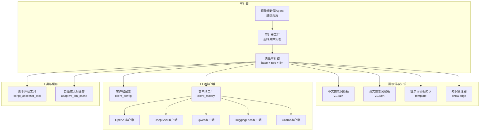
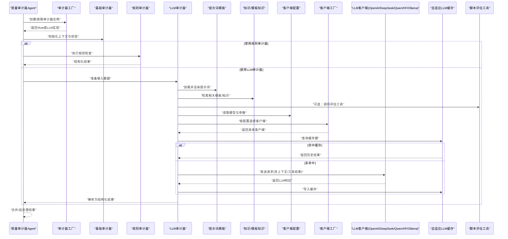
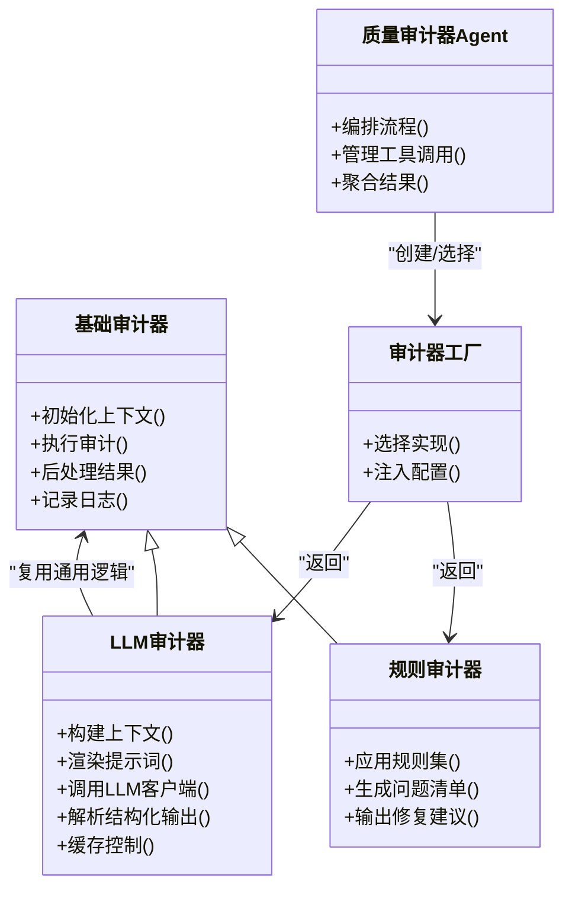
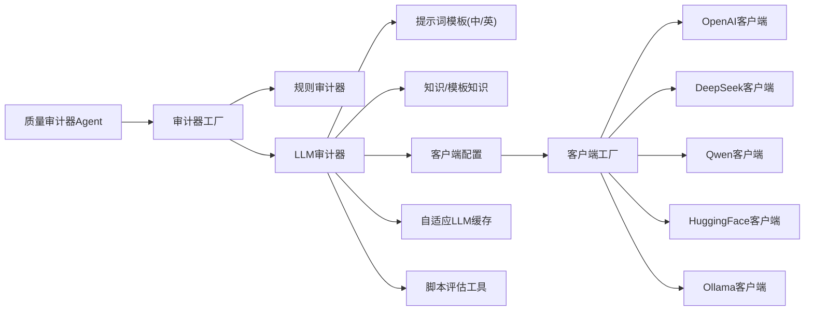

# LLM审计器

<cite>
**本文引用的文件**   
- [src/penshot/neopen/agent/quality_auditor/llm_quality_auditor.py](file://src/penshot/neopen/agent/quality_auditor/llm_quality_auditor.py)
- [src/penshot/neopen/agent/quality_auditor/base_quality_auditor.py](file://src/penshot/neopen/agent/quality_auditor/base_quality_auditor.py)
- [src/penshot/neopen/agent/quality_auditor/quality_auditor_factory.py](file://src/penshot/neopen/agent/quality_auditor/quality_auditor_factory.py)
- [src/penshot/neopen/agent/quality_auditor/quality_auditor_models.py](file://src/penshot/neopen/agent/quality_auditor/quality_auditor_models.py)
- [src/penshot/neopen/agent/quality_auditor/quality_auditor_enum.py](file://src/penshot/neopen/agent/quality_auditor/quality_auditor_enum.py)
- [src/penshot/neopen/agent/quality_auditor/rule_quality_auditor.py](file://src/penshot/neopen/agent/quality_auditor/rule_quality_auditor.py)
- [src/penshot/neopen/agent/quality_auditor_agent.py](file://src/penshot/neopen/agent/quality_auditor_agent.py)
- [src/penshot/neopen/prompts/v1.x/zh/quality_auditor_prompt.yaml](file://src/penshot/neopen/prompts/v1.x/zh/quality_auditor_prompt.yaml)
- [src/penshot/neopen/prompts/v1.x/en/quality_auditor_prompt.yaml](file://src/penshot/neopen/prompts/v1.x/en/quality_auditor_prompt.yaml)
- [src/penshot/neopen/client/client_config.py](file://src/penshot/neopen/client/client_config.py)
- [src/penshot/neopen/client/client_factory.py](file://src/penshot/neopen/client/client_factory.py)
- [src/penshot/neopen/client/openai_client.py](file://src/penshot/neopen/client/openai_client.py)
- [src/penshot/neopen/client/deepseek_client.py](file://src/penshot/neopen/client/deepseek_client.py)
- [src/penshot/neopen/client/qwen_client.py](file://src/penshot/neopen/client/qwen_client.py)
- [src/penshot/neopen/client/huggingface_client.py](file://src/penshot/neopen/client/huggingface_client.py)
- [src/penshot/neopen/client/ollama_client.py](file://src/penshot/neopen/client/ollama_client.py)
- [src/penshot/neopen/cache/adaptive_llm_cache.py](file://src/penshot/neopen/cache/adaptive_llm_cache.py)
- [src/penshot/neopen/knowledge/template/prompt_template_knowledge.py](file://src/penshot/neopen/knowledge/template/prompt_template_knowledge.py)
- [src/penshot/neopen/knowledge/knowledge_manager.py](file://src/penshot/neopen/knowledge/knowledge_manager.py)
- [src/penshot/neopen/tools/script_assessor_tool.py](file://src/penshot/neopen/tools/script_assessor_tool.py)
- [examples/json_demo/quality_auditor_result.json](file://examples/json_demo/quality_auditor_result.json)
</cite>

## 目录
1. [简介](#简介)
2. [项目结构](#项目结构)
3. [核心组件](#核心组件)
4. [架构总览](#架构总览)
5. [详细组件分析](#详细组件分析)
6. [依赖关系分析](#依赖关系分析)
7. [性能与成本优化](#性能与成本优化)
8. [故障排查指南](#故障排查指南)
9. [结论](#结论)
10. [附录](#附录)

## 简介
本文件围绕“基于大语言模型的审计器”展开，聚焦以下目标：
- 深入解析LLM驱动的语义理解与质量评估机制
- 说明提示词工程设计与上下文构建策略
- 解释多模态内容分析能力与智能判断逻辑
- 提供LLM参数调优与成本控制方法
- 给出不同模型的选择建议与性能对比思路
- 展示复杂语义场景下的审计效果与优化技巧

该审计器以“规则+LLM”的混合模式运行，既保证可解释性与稳定性，又具备对复杂语义、跨片段一致性的深度理解能力。

## 项目结构
与LLM审计器直接相关的代码主要分布在如下模块：
- 审计器实现与工厂：quality_auditor 子包
- 审计器Agent编排：quality_auditor_agent.py
- 提示词模板：prompts/v1.x/*/quality_auditor_prompt.yaml
- LLM客户端与配置：client/*
- 缓存与知识：cache/, knowledge/
- 工具集成：tools/script_assessor_tool.py
- 示例输出：examples/json_demo/quality_auditor_result.json

图表来源
- [src/penshot/neopen/agent/quality_auditor/llm_quality_auditor.py](file://src/penshot/neopen/agent/quality_auditor/llm_quality_auditor.py)
- [src/penshot/neopen/agent/quality_auditor/base_quality_auditor.py](file://src/penshot/neopen/agent/quality_auditor/base_quality_auditor.py)
- [src/penshot/neopen/agent/quality_auditor/quality_auditor_factory.py](file://src/penshot/neopen/agent/quality_auditor/quality_auditor_factory.py)
- [src/penshot/neopen/agent/quality_auditor_agent.py](file://src/penshot/neopen/agent/quality_auditor_agent.py)
- [src/penshot/neopen/prompts/v1.x/zh/quality_auditor_prompt.yaml](file://src/penshot/neopen/prompts/v1.x/zh/quality_auditor_prompt.yaml)
- [src/penshot/neopen/prompts/v1.x/en/quality_auditor_prompt.yaml](file://src/penshot/neopen/prompts/v1.x/en/quality_auditor_prompt.yaml)
- [src/penshot/neopen/client/client_config.py](file://src/penshot/neopen/client/client_config.py)
- [src/penshot/neopen/client/client_factory.py](file://src/penshot/neopen/client/client_factory.py)
- [src/penshot/neopen/client/openai_client.py](file://src/penshot/neopen/client/openai_client.py)
- [src/penshot/neopen/client/deepseek_client.py](file://src/penshot/neopen/client/deepseek_client.py)
- [src/penshot/neopen/client/qwen_client.py](file://src/penshot/neopen/client/qwen_client.py)
- [src/penshot/neopen/client/huggingface_client.py](file://src/penshot/neopen/client/huggingface_client.py)
- [src/penshot/neopen/client/ollama_client.py](file://src/penshot/neopen/client/ollama_client.py)
- [src/penshot/neopen/cache/adaptive_llm_cache.py](file://src/penshot/neopen/cache/adaptive_llm_cache.py)
- [src/penshot/neopen/knowledge/template/prompt_template_knowledge.py](file://src/penshot/neopen/knowledge/template/prompt_template_knowledge.py)
- [src/penshot/neopen/knowledge/knowledge_manager.py](file://src/penshot/neopen/knowledge/knowledge_manager.py)
- [src/penshot/neopen/tools/script_assessor_tool.py](file://src/penshot/neopen/tools/script_assessor_tool.py)

章节来源
- [src/penshot/neopen/agent/quality_auditor/llm_quality_auditor.py](file://src/penshot/neopen/agent/quality_auditor/llm_quality_auditor.py)
- [src/penshot/neopen/agent/quality_auditor/base_quality_auditor.py](file://src/penshot/neopen/agent/quality_auditor/base_quality_auditor.py)
- [src/penshot/neopen/agent/quality_auditor/quality_auditor_factory.py](file://src/penshot/neopen/agent/quality_auditor/quality_auditor_factory.py)
- [src/penshot/neopen/agent/quality_auditor_agent.py](file://src/penshot/neopen/agent/quality_auditor_agent.py)
- [src/penshot/neopen/prompts/v1.x/zh/quality_auditor_prompt.yaml](file://src/penshot/neopen/prompts/v1.x/zh/quality_auditor_prompt.yaml)
- [src/penshot/neopen/prompts/v1.x/en/quality_auditor_prompt.yaml](file://src/penshot/neopen/prompts/v1.x/en/quality_auditor_prompt.yaml)
- [src/penshot/neopen/client/client_config.py](file://src/penshot/neopen/client/client_config.py)
- [src/penshot/neopen/client/client_factory.py](file://src/penshot/neopen/client/client_factory.py)
- [src/penshot/neopen/client/openai_client.py](file://src/penshot/neopen/client/openai_client.py)
- [src/penshot/neopen/client/deepseek_client.py](file://src/penshot/ne /neopen/client/deepseek_client.py)
- [src/penshot/neopen/client/qwen_client.py](file://src/penshot/neopen/client/qwen_client.py)
- [src/penshot/neopen/client/huggingface_client.py](file://src/penshot/neopen/client/huggingface_client.py)
- [src/penshot/neopen/client/ollama_client.py](file://src/penshot/neopen/client/ollama_client.py)
- [src/penshot/neopen/cache/adaptive_llm_cache.py](file://src/penshot/neopen/cache/adaptive_llm_cache.py)
- [src/penshot/neopen/knowledge/template/prompt_template_knowledge.py](file://src/penshot/neopen/knowledge/template/prompt_template_knowledge.py)
- [src/penshot/neopen/knowledge/knowledge_manager.py](file://src/penshot/neopen/knowledge/knowledge_manager.py)
- [src/penshot/neopen/tools/script_assessor_tool.py](file://src/penshot/neopen/tools/script_assessor_tool.py)

## 核心组件
- 基础抽象与枚举
  - 基础审计器接口定义统一输入输出契约与生命周期钩子
  - 审计结果模型与枚举类型规范了评分维度、判定等级与结构化字段
- 规则审计器
  - 基于预定义规则的快速初筛，覆盖语法、格式、关键要素完整性等
- LLM审计器
  - 在规则基础上引入LLM进行深层语义理解、一致性校验、风险识别与改进建议生成
- 审计器工厂
  - 根据配置动态选择规则或LLM实现，支持组合式流水线
- 审计器Agent
  - 负责将审计器嵌入工作流，管理上下文、工具调用、缓存与重试

章节来源
- [src/penshot/neopen/agent/quality_auditor/base_quality_auditor.py](file://src/penshot/neopen/agent/quality_auditor/base_quality_auditor.py)
- [src/penshot/neopen/agent/quality_auditor/quality_auditor_models.py](file://src/penshot/neopen/agent/quality_auditor/quality_auditor_models.py)
- [src/penshot/neopen/agent/quality_auditor/quality_auditor_enum.py](file://src/penshot/neopen/agent/quality_auditor/quality_auditor_enum.py)
- [src/penshot/neopen/agent/quality_auditor/rule_quality_auditor.py](file://src/penshot/neopen/agent/quality_auditor/rule_quality_auditor.py)
- [src/penshot/neopen/agent/quality_auditor/llm_quality_auditor.py](file://src/penshot/neopen/agent/quality_auditor/llm_quality_auditor.py)
- [src/penshot/neopen/agent/quality_auditor/quality_auditor_factory.py](file://src/penshot/neopen/agent/quality_auditor/quality_auditor_factory.py)
- [src/penshot/neopen/agent/quality_auditor_agent.py](file://src/penshot/neopen/agent/quality_auditor_agent.py)

## 架构总览
下图展示了从Agent到LLM客户端的端到端调用路径，以及提示词、知识与缓存的参与方式。

图表来源
- [src/penshot/neopen/agent/quality_auditor_agent.py](file://src/penshot/neopen/agent/quality_auditor_agent.py)
- [src/penshot/neopen/agent/quality_auditor/quality_auditor_factory.py](file://src/penshot/neopen/agent/quality_auditor/quality_auditor_factory.py)
- [src/penshot/neopen/agent/quality_auditor/base_quality_auditor.py](file://src/penshot/neopen/agent/quality_auditor/base_quality_auditor.py)
- [src/penshot/neopen/agent/quality_auditor/rule_quality_auditor.py](file://src/penshot/neopen/agent/quality_auditor/rule_quality_auditor.py)
- [src/penshot/neopen/agent/quality_auditor/llm_quality_auditor.py](file://src/penshot/neopen/agent/quality_auditor/llm_quality_auditor.py)
- [src/penshot/neopen/prompts/v1.x/zh/quality_auditor_prompt.yaml](file://src/penshot/neopen/prompts/v1.x/zh/quality_auditor_prompt.yaml)
- [src/penshot/neopen/prompts/v1.x/en/quality_auditor_prompt.yaml](file://src/penshot/neopen/prompts/v1.x/en/quality_auditor_prompt.yaml)
- [src/penshot/neopen/knowledge/template/prompt_template_knowledge.py](file://src/penshot/neopen/knowledge/template/prompt_template_knowledge.py)
- [src/penshot/neopen/client/client_config.py](file://src/penshot/neopen/client/client_config.py)
- [src/penshot/neopen/client/client_factory.py](file://src/penshot/neopen/client/client_factory.py)
- [src/penshot/neopen/client/openai_client.py](file://src/penshot/neopen/client/openai_client.py)
- [src/penshot/neopen/client/deepseek_client.py](file://src/penshot/neopen/client/deepseek_client.py)
- [src/penshot/neopen/client/qwen_client.py](file://src/penshot/neopen/client/qwen_client.py)
- [src/penshot/neopen/client/huggingface_client.py](file://src/penshot/neopen/client/huggingface_client.py)
- [src/penshot/neopen/client/ollama_client.py](file://src/penshot/neopen/client/ollama_client.py)
- [src/penshot/neopen/cache/adaptive_llm_cache.py](file://src/penshot/neopen/cache/adaptive_llm_cache.py)
- [src/penshot/neopen/tools/script_assessor_tool.py](file://src/penshot/neopen/tools/script_assessor_tool.py)

## 详细组件分析

### 类与继承关系（代码级）

图表来源
- [src/penshot/neopen/agent/quality_auditor/base_quality_auditor.py](file://src/penshot/neopen/agent/quality_auditor/base_quality_auditor.py)
- [src/penshot/neopen/agent/quality_auditor/rule_quality_auditor.py](file://src/penshot/neopen/agent/quality_auditor/rule_quality_auditor.py)
- [src/penshot/neopen/agent/quality_auditor/llm_quality_auditor.py](file://src/penshot/neopen/agent/quality_auditor/llm_quality_auditor.py)
- [src/penshot/neopen/agent/quality_auditor/quality_auditor_factory.py](file://src/penshot/neopen/agent/quality_auditor/quality_auditor_factory.py)
- [src/penshot/neopen/agent/quality_auditor_agent.py](file://src/penshot/neopen/agent/quality_auditor_agent.py)

章节来源
- [src/penshot/neopen/agent/quality_auditor/base_quality_auditor.py](file://src/penshot/neopen/agent/quality_auditor/base_quality_auditor.py)
- [src/penshot/neopen/agent/quality_auditor/rule_quality_auditor.py](file://src/penshot/neopen/agent/quality_auditor/rule_quality_auditor.py)
- [src/penshot/neopen/agent/quality_auditor/llm_quality_auditor.py](file://src/penshot/neopen/agent/quality_auditor/llm_quality_auditor.py)
- [src/penshot/neopen/agent/quality_auditor/quality_auditor_factory.py](file://src/penshot/neopen/agent/quality_auditor/quality_auditor_factory.py)
- [src/penshot/neopen/agent/quality_auditor_agent.py](file://src/penshot/neopen/agent/quality_auditor_agent.py)

### 提示词工程与上下文构建
- 提示词模板
  - 提供中英文两套模板，分别适配不同语言环境的表达习惯与评估维度
  - 模板包含：任务目标、输入结构、评分维度、输出JSON Schema、约束条件与示例
- 上下文构建策略
  - 从上游节点抽取必要信息（如脚本片段、镜头描述、时间线、角色设定等）
  - 结合知识库中的模板与最佳实践，动态拼装提示词
  - 通过工具调用补充外部信号（如脚本评估指标、时长估计等）
- 多模态内容分析
  - 当输入包含图像/视频帧时，优先使用支持视觉输入的客户端；否则回退为文本摘要+元数据
  - 对视觉敏感的质量点（如画面连贯性、字幕对齐）采用“视觉+文本”联合判断

章节来源
- [src/penshot/neopen/prompts/v1.x/zh/quality_auditor_prompt.yaml](file://src/penshot/neopen/prompts/v1.x/zh/quality_auditor_prompt.yaml)
- [src/penshot/neopen/prompts/v1.x/en/quality_auditor_prompt.yaml](file://src/penshot/neopen/prompts/v1.x/en/quality_auditor_prompt.yaml)
- [src/penshot/neopen/knowledge/template/prompt_template_knowledge.py](file://src/penshot/neopen/knowledge/template/prompt_template_knowledge.py)
- [src/penshot/neopen/knowledge/knowledge_manager.py](file://src/penshot/neopen/knowledge/knowledge_manager.py)
- [src/penshot/neopen/tools/script_assessor_tool.py](file://src/penshot/neopen/tools/script_assessor_tool.py)

### 智能判断逻辑与多阶段评估

```mermaid
flowchart TD
Start(["开始"]) --> Prep["准备输入与上下文"]
Prep --> RuleCheck["规则审计器初筛"]
RuleCheck --> RulePass{"是否通过规则?"}
RulePass --> |否| FixSuggest["生成修复建议并返回"]
RulePass --> |是| LLMFlow["进入LLM深度评估"]
LLMFlow --> BuildPrompt["渲染提示词+组装上下文"]
BuildPrompt --> CallLLM["调用LLM客户端"]
CallLLM --> Parse["解析结构化输出"]
Parse --> Score["计算综合评分/风险等级"]
Score --> Output["输出审计报告"]
Output --> End(["结束"])
```

图表来源
- [src/penshot/neopen/agent/quality_auditor/rule_quality_auditor.py](file://src/penshot/neopen/agent/quality_auditor/rule_quality_auditor.py)
- [src/penshot/neopen/agent/quality_auditor/llm_quality_auditor.py](file://src/penshot/neopen/agent/quality_auditor/llm_quality_auditor.py)
- [src/penshot/neopen/agent/quality_auditor/quality_auditor_models.py](file://src/penshot/neopen/agent/quality_auditor/quality_auditor_models.py)
- [src/penshot/neopen/agent/quality_auditor/quality_auditor_enum.py](file://src/penshot/neopen/agent/quality_auditor/quality_auditor_enum.py)

章节来源
- [src/penshot/neopen/agent/quality_auditor/rule_quality_auditor.py](file://src/penshot/neopen/agent/quality_auditor/rule_quality_auditor.py)
- [src/penshot/neopen/agent/quality_auditor/llm_quality_auditor.py](file://src/penshot/neopen/agent/quality_auditor/llm_quality_auditor.py)
- [src/penshot/neopen/agent/quality_auditor/quality_auditor_models.py](file://src/penshot/neopen/agent/quality_auditor/quality_auditor_models.py)
- [src/penshot/neopen/agent/quality_auditor/quality_auditor_enum.py](file://src/penshot/neopen/agent/quality_auditor/quality_auditor_enum.py)

### 客户端与模型选择
- 客户端工厂
  - 依据配置选择OpenAI、DeepSeek、Qwen、HuggingFace或Ollama等后端
- 客户端能力差异
  - 部分客户端支持视觉输入，适合需要画面/字幕对齐等多模态判断的场景
  - 本地化部署（如Ollama）适合隐私与成本敏感环境
- 配置项要点
  - 模型名称、温度、最大生成长度、超时、重试次数、并发限制等

章节来源
- [src/penshot/neopen/client/client_config.py](file://src/penshot/neopen/client/client_config.py)
- [src/penshot/neopen/client/client_factory.py](file://src/penshot/neopen/client/client_factory.py)
- [src/penshot/neopen/client/openai_client.py](file://src/penshot/neopen/client/openai_client.py)
- [src/penshot/neopen/client/deepseek_client.py](file://src/penshot/neopen/client/deepseek_client.py)
- [src/penshot/neopen/client/qwen_client.py](file://src/penshot/neopen/client/qwen_client.py)
- [src/penshot/neopen/client/huggingface_client.py](file://src/penshot/neopen/client/huggingface_client.py)
- [src/penshot/neopen/client/ollama_client.py](file://src/penshot/neopen/client/ollama_client.py)

### 缓存与成本控制
- 自适应缓存
  - 基于输入指纹与提示词哈希命中缓存，减少重复推理
  - 支持TTL与容量上限，避免内存膨胀
- 成本控制策略
  - 规则前置过滤，仅对高风险或不确定样本走LLM
  - 小模型做粗筛，大模型做精判的分层策略
  - 合理设置温度与最大长度，降低无效输出

章节来源
- [src/penshot/neopen/cache/adaptive_llm_cache.py](file://src/penshot/neopen/cache/adaptive_llm_cache.py)
- [src/penshot/neopen/agent/quality_auditor/rule_quality_auditor.py](file://src/penshot/neopen/agent/quality_auditor/rule_quality_auditor.py)
- [src/penshot/neopen/agent/quality_auditor/llm_quality_auditor.py](file://src/penshot/neopen/agent/quality_auditor/llm_quality_auditor.py)

### 示例输出结构
- 示例JSON展示了审计结果的典型字段：评分、风险等级、问题清单、修复建议、置信度等
- 便于下游系统对接与可视化呈现

章节来源
- [examples/json_demo/quality_auditor_result.json](file://examples/json_demo/quality_auditor_result.json)

## 依赖关系分析

图表来源
- [src/penshot/neopen/agent/quality_auditor_agent.py](file://src/penshot/neopen/agent/quality_auditor_agent.py)
- [src/penshot/neopen/agent/quality_auditor/quality_auditor_factory.py](file://src/penshot/neopen/agent/quality_auditor/quality_auditor_factory.py)
- [src/penshot/neopen/agent/quality_auditor/rule_quality_auditor.py](file://src/penshot/neopen/agent/quality_auditor/rule_quality_auditor.py)
- [src/penshot/neopen/agent/quality_auditor/llm_quality_auditor.py](file://src/penshot/neopen/agent/quality_auditor/llm_quality_auditor.py)
- [src/penshot/neopen/prompts/v1.x/zh/quality_auditor_prompt.yaml](file://src/penshot/neopen/prompts/v1.x/zh/quality_auditor_prompt.yaml)
- [src/penshot/neopen/prompts/v1.x/en/quality_auditor_prompt.yaml](file://src/penshot/neopen/prompts/v1.x/en/quality_auditor_prompt.yaml)
- [src/penshot/neopen/knowledge/template/prompt_template_knowledge.py](file://src/penshot/neopen/knowledge/template/prompt_template_knowledge.py)
- [src/penshot/neopen/client/client_config.py](file://src/penshot/neopen/client/client_config.py)
- [src/penshot/neopen/client/client_factory.py](file://src/penshot/neopen/client/client_factory.py)
- [src/penshot/neopen/client/openai_client.py](file://src/penshot/neopen/client/openai_client.py)
- [src/penshot/neopen/client/deepseek_client.py](file://src/penshot/neopen/client/deepseek_client.py)
- [src/penshot/neopen/client/qwen_client.py](file://src/penshot/neopen/client/qwen_client.py)
- [src/penshot/neopen/client/huggingface_client.py](file://src/penshot/neopen/client/huggingface_client.py)
- [src/penshot/neopen/client/ollama_client.py](file://src/penshot/neopen/client/ollama_client.py)
- [src/penshot/neopen/cache/adaptive_llm_cache.py](file://src/penshot/neopen/cache/adaptive_llm_cache.py)
- [src/penshot/neopen/tools/script_assessor_tool.py](file://src/penshot/neopen/tools/script_assessor_tool.py)

## 性能与成本优化
- 分层评估
  - 规则先行，LLM后置；对低风险样本快速放行，集中算力于疑难案例
- 提示词瘦身
  - 按需裁剪上下文，仅保留与当前评估维度强相关的信息
  - 使用更明确的JSON Schema约束，减少解析失败与重试
- 模型路由
  - 简单任务用小模型，复杂语义用大模型；必要时引入重排序或二次校验
- 缓存命中率
  - 规范化输入与提示词哈希键，提升缓存命中率
- 并发与限流
  - 合理设置并发与超时，避免雪崩；对高延迟模型增加退避重试
- 多模态取舍
  - 仅在必要时启用视觉输入；否则以文本摘要+元数据替代

[本节为通用指导，不直接分析具体文件]

## 故障排查指南
- 常见问题定位
  - 提示词渲染失败：检查模板变量与上下文字段是否齐全
  - JSON解析异常：确认LLM输出严格遵循Schema，必要时增加容错与修正流程
  - 客户端错误：核对密钥、配额、网络连通性与模型可用性
  - 缓存污染：清理过期键或调整TTL策略
- 诊断手段
  - 开启详细日志，记录输入指纹、提示词快照、响应体与耗时
  - 对失败用例构造最小复现样本，逐步隔离问题域

章节来源
- [src/penshot/neopen/agent/quality_auditor/llm_quality_auditor.py](file://src/penshot/neopen/agent/quality_auditor/llm_quality_auditor.py)
- [src/penshot/neopen/cache/adaptive_llm_cache.py](file://src/penshot/neopen/cache/adaptive_llm_cache.py)
- [src/penshot/neopen/client/client_config.py](file://src/penshot/neopen/client/client_config.py)

## 结论
本审计器通过“规则+LLM”的双轨机制，在保证稳定性的同时获得强大的语义理解能力。借助完善的提示词工程、上下文构建、多模态支持与缓存策略，可在复杂场景中实现高质量、可解释且可控成本的审计输出。建议在生产环境中持续迭代提示词与评估维度，并结合业务反馈建立回归评测集，以保障长期稳定性与一致性。

[本节为总结性内容，不直接分析具体文件]

## 附录
- 术语
  - 规则审计器：基于预定义规则进行快速检查
  - LLM审计器：基于大语言模型进行深度语义评估
  - 提示词模板：用于驱动LLM的结构化指令与约束
  - 自适应缓存：基于输入指纹与提示词哈希的LLM响应缓存
- 参考示例
  - 审计结果样例见示例JSON文件，可作为对接与验收基线

章节来源
- [examples/json_demo/quality_auditor_result.json](file://examples/json_demo/quality_auditor_result.json)