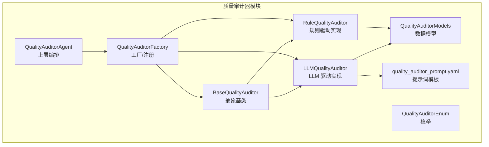
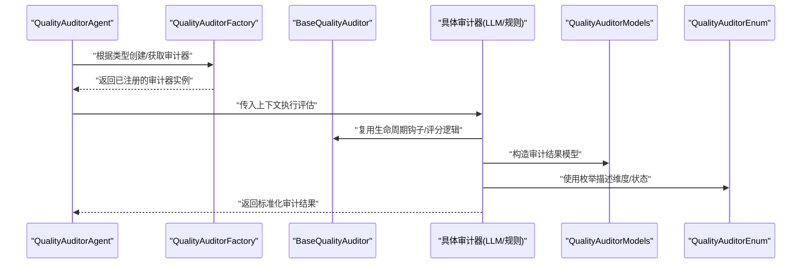
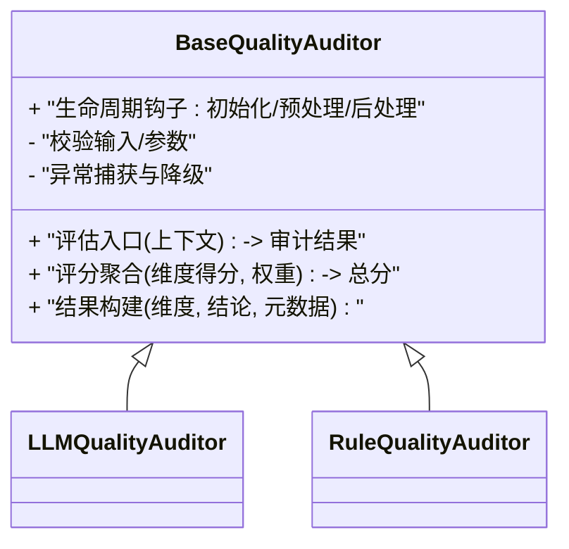
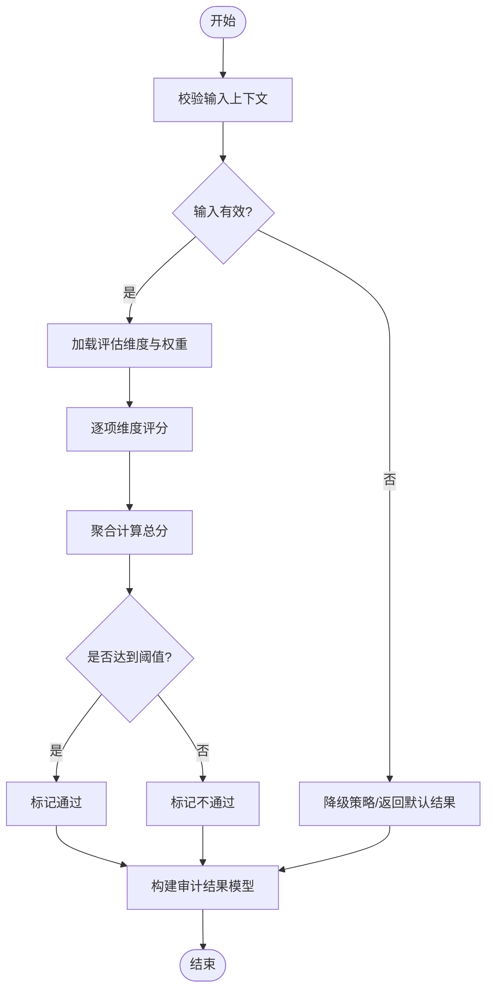
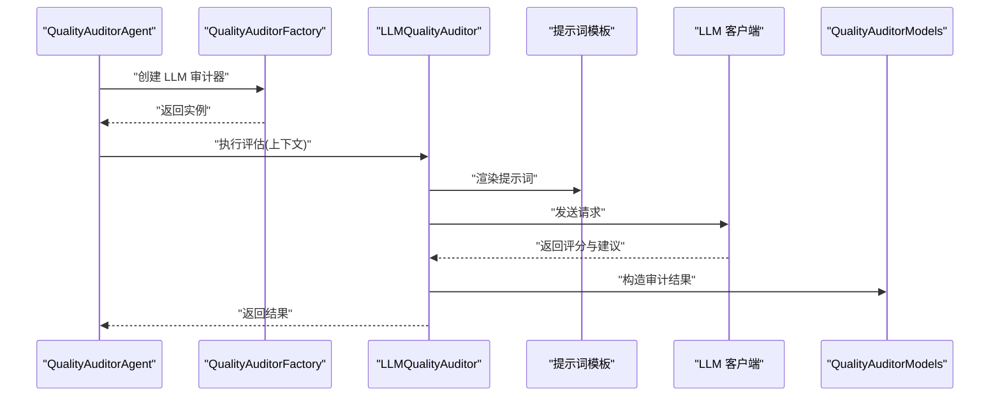
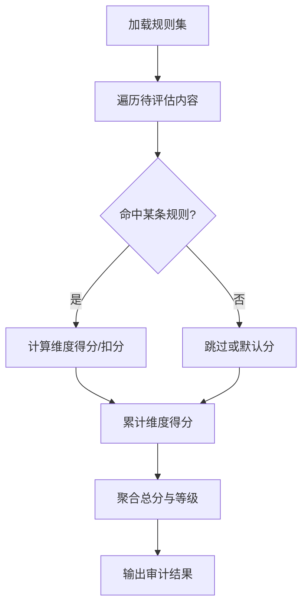
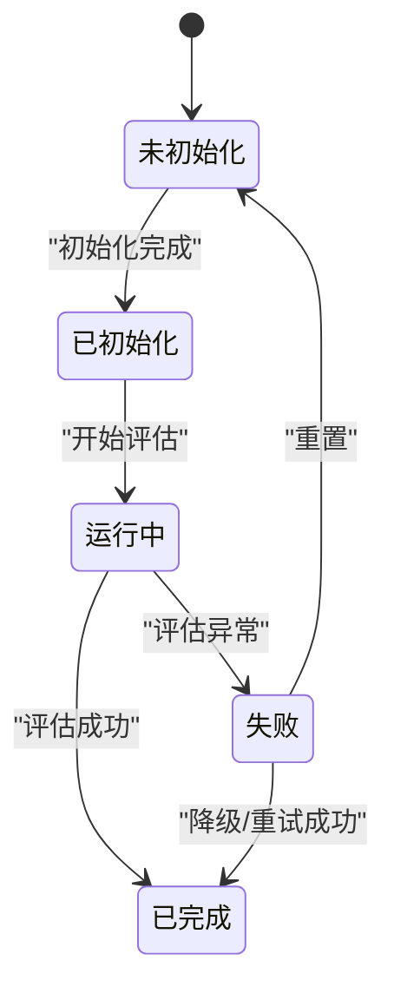
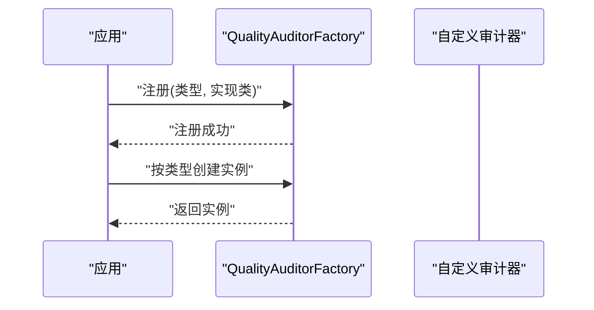
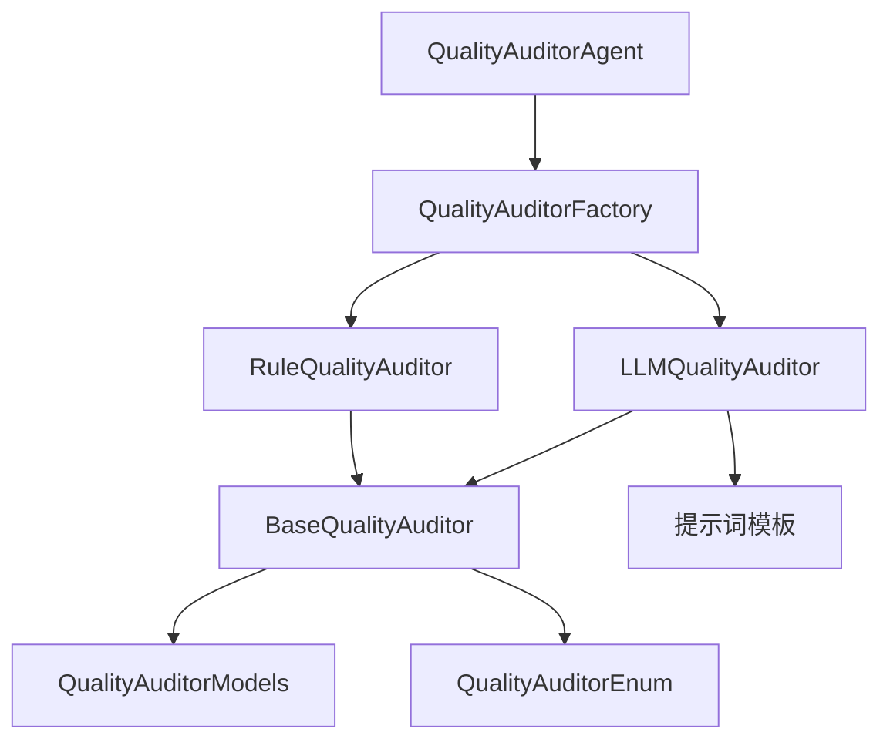

# 基础审计器架构

<cite>
**本文引用的文件**   
- [base_quality_auditor.py](file://src/penshot/neopen/agent/quality_auditor/base_quality_auditor.py)
- [llm_quality_auditor.py](file://src/penshot/neopen/agent/quality_auditor/llm_quality_auditor.py)
- [rule_quality_auditor.py](file://src/penshot/neopen/agent/quality_auditor/rule_quality_auditor.py)
- [quality_auditor_models.py](file://src/penshot/neopen/agent/quality_auditor/quality_auditor_models.py)
- [quality_auditor_enum.py](file://src/penshot/neopen/agent/quality_auditor/quality_auditor_enum.py)
- [quality_auditor_factory.py](file://src/penshot/neopen/agent/quality_auditor/quality_auditor_factory.py)
- [quality_auditor_agent.py](file://src/penshot/neopen/agent/quality_auditor_agent.py)
- [quality_auditor_prompt.yaml](file://src/penshot/prompts/v1.x/zh/quality_auditor_prompt.yaml)
</cite>

## 目录
1. [简介](#简介)
2. [项目结构](#项目结构)
3. [核心组件](#核心组件)
4. [架构总览](#架构总览)
5. [详细组件分析](#详细组件分析)
6. [依赖分析](#依赖分析)
7. [性能考虑](#性能考虑)
8. [故障排查指南](#故障排查指南)
9. [结论](#结论)
10. [附录](#附录)

## 简介
本文件围绕质量审计器基础架构展开，重点解析 BaseQualityAuditor 抽象类的设计模式与核心接口定义，阐述质量评估的通用流程、审计结果模型与评分机制，说明审计器的生命周期管理与状态转换，并提供自定义审计器的开发模板与最佳实践。同时覆盖审计器注册机制与配置管理，并展示如何扩展新的质量评估维度。

## 项目结构
质量审计器相关代码位于 neopen.agent.quality_auditor 包内，包含抽象基类、具体实现（LLM 驱动与规则驱动）、数据模型、枚举、工厂以及上层 Agent 编排入口。提示词模板位于 prompts/v1.x/zh 下。

图表来源
- [base_quality_auditor.py](file://src/penshot/neopen/agent/quality_auditor/base_quality_auditor.py)
- [llm_quality_auditor.py](file://src/penshot/neopen/agent/quality_auditor/llm_quality_auditor.py)
- [rule_quality_auditor.py](file://src/penshot/neopen/agent/quality_auditor/rule_quality_auditor.py)
- [quality_auditor_models.py](file://src/penshot/neopen/agent/quality_auditor/quality_auditor_models.py)
- [quality_auditor_enum.py](file://src/penshot/neopen/agent/quality_auditor/quality_auditor_enum.py)
- [quality_auditor_factory.py](file://src/penshot/neopen/agent/quality_auditor/quality_auditor_factory.py)
- [quality_auditor_agent.py](file://src/penshot/neopen/agent/quality_auditor_agent.py)
- [quality_auditor_prompt.yaml](file://src/penshot/prompts/v1.x/zh/quality_auditor_prompt.yaml)

章节来源
- [base_quality_auditor.py](file://src/penshot/neopen/agent/quality_auditor/base_quality_auditor.py)
- [quality_auditor_models.py](file://src/penshot/neopen/agent/quality_auditor/quality_auditor_models.py)
- [quality_auditor_enum.py](file://src/penshot/neopen/agent/quality_auditor/quality_auditor_enum.py)
- [quality_auditor_factory.py](file://src/penshot/neopen/agent/quality_auditor/quality_auditor_factory.py)
- [quality_auditor_agent.py](file://src/penshot/neopen/agent/quality_auditor_agent.py)
- [quality_auditor_prompt.yaml](file://src/penshot/prompts/v1.x/zh/quality_auditor_prompt.yaml)

## 核心组件
- 抽象基类 BaseQualityAuditor：定义统一的质量评估接口、生命周期钩子、评分计算与结果封装规范，供所有具体审计器继承实现。
- 具体实现
  - LLMQualityAuditor：基于大语言模型的语义级质量评估，结合提示词模板进行推理打分。
  - RuleQualityAuditor：基于可配置规则的确定性评估，适用于快速、稳定的指标校验。
- 数据模型 QualityAuditorModels：定义输入上下文、评估维度、评分与结论等结构化数据。
- 枚举 QualityAuditorEnum：定义审计器类型、评估维度、状态码等常量。
- 工厂 QualityAuditorFactory：负责审计器的注册、查找与实例化，屏蔽具体实现差异。
- 上层编排 QualityAuditorAgent：在任务流中调用工厂获取审计器，组织输入上下文并汇总结果。

章节来源
- [base_quality_auditor.py](file://src/penshot/neopen/agent/quality_auditor/base_quality_auditor.py)
- [llm_quality_auditor.py](file://src/penshot/neopen/agent/quality_auditor/llm_quality_auditor.py)
- [rule_quality_auditor.py](file://src/penshot/neopen/agent/quality_auditor/rule_quality_auditor.py)
- [quality_auditor_models.py](file://src/penshot/neopen/agent/quality_auditor/quality_auditor_models.py)
- [quality_auditor_enum.py](file://src/penshot/neopen/agent/quality_auditor/quality_auditor_enum.py)
- [quality_auditor_factory.py](file://src/penshot/neopen/agent/quality_auditor/quality_auditor_factory.py)
- [quality_auditor_agent.py](file://src/penshot/neopen/agent/quality_auditor_agent.py)

## 架构总览
下图展示了从上层 Agent 到具体审计器实现的端到端调用关系，以及工厂的注册与发现过程。

图表来源
- [quality_auditor_agent.py](file://src/penshot/neopen/agent/quality_auditor_agent.py)
- [quality_auditor_factory.py](file://src/penshot/neopen/agent/quality_auditor/quality_auditor_factory.py)
- [base_quality_auditor.py](file://src/penshot/neopen/agent/quality_auditor/base_quality_auditor.py)
- [llm_quality_auditor.py](file://src/penshot/neopen/agent/quality_auditor/llm_quality_auditor.py)
- [rule_quality_auditor.py](file://src/penshot/neopen/agent/quality_auditor/rule_quality_auditor.py)
- [quality_auditor_models.py](file://src/penshot/neopen/agent/quality_auditor/quality_auditor_models.py)
- [quality_auditor_enum.py](file://src/penshot/neopen/agent/quality_auditor/quality_auditor_enum.py)

## 详细组件分析

### 抽象基类 BaseQualityAuditor 设计
- 职责边界
  - 定义统一的评估入口方法，确保不同实现具备一致的调用契约。
  - 提供生命周期钩子（如初始化、预处理、后处理），便于注入日志、缓存、监控等横切关注点。
  - 封装评分聚合与阈值判定逻辑，保证评分口径一致。
  - 输出标准化的审计结果模型，包含总体评分、各维度得分、建议与元数据。
- 关键接口约定
  - 评估入口：接收上下文对象，返回审计结果模型。
  - 维度评估：按维度逐项评估，支持权重配置与异常回退策略。
  - 结果构建：将维度得分与结论组装为统一模型。
- 错误与边界
  - 对缺失输入或非法参数进行前置校验。
  - 对下游异常进行捕获与降级，保证整体流程稳定。

图表来源
- [base_quality_auditor.py](file://src/penshot/neopen/agent/quality_auditor/base_quality_auditor.py)
- [llm_quality_auditor.py](file://src/penshot/neopen/agent/quality_auditor/llm_quality_auditor.py)
- [rule_quality_auditor.py](file://src/penshot/neopen/agent/quality_auditor/rule_quality_auditor.py)

章节来源
- [base_quality_auditor.py](file://src/penshot/neopen/agent/quality_auditor/base_quality_auditor.py)

### 数据模型与评分机制
- 输入上下文
  - 包含待评估内容、业务上下文、可选的历史评估结果与外部参考信息。
- 评估维度
  - 通过枚举定义标准维度集合，支持扩展新维度。
- 评分机制
  - 维度得分：每个维度给出 0~1 或百分制分数，并可附带置信度。
  - 权重配置：维度权重由配置或默认策略决定。
  - 总分计算：加权平均或可配置的聚合函数；支持阈值判定与等级映射。
- 审计结果
  - 包含总体评分、等级、维度明细、改进建议、审计元数据（耗时、版本、追踪ID）。

图表来源
- [quality_auditor_models.py](file://src/penshot/neopen/agent/quality_auditor/quality_auditor_models.py)
- [quality_auditor_enum.py](file://src/penshot/neopen/agent/quality_auditor/quality_auditor_enum.py)
- [base_quality_auditor.py](file://src/penshot/neopen/agent/quality_auditor/base_quality_auditor.py)

章节来源
- [quality_auditor_models.py](file://src/penshot/neopen/agent/quality_auditor/quality_auditor_models.py)
- [quality_auditor_enum.py](file://src/penshot/neopen/agent/quality_auditor/quality_auditor_enum.py)
- [base_quality_auditor.py](file://src/penshot/neopen/agent/quality_auditor/base_quality_auditor.py)

### LLM 驱动审计器
- 特点
  - 利用大模型进行语义理解与综合判断，适合复杂、非结构化的质量评估场景。
  - 通过提示词模板控制评估维度、评分标准与建议生成。
- 关键流程
  - 渲染提示词模板，注入上下文与维度要求。
  - 调用 LLM 客户端，解析返回的结构化评分与建议。
  - 将结果映射为标准模型，补充元数据。
- 配置项
  - 模型选择、温度、最大长度、重试次数、超时等。

图表来源
- [llm_quality_auditor.py](file://src/penshot/neopen/agent/quality_auditor/llm_quality_auditor.py)
- [quality_auditor_prompt.yaml](file://src/penshot/prompts/v1.x/zh/quality_auditor_prompt.yaml)
- [quality_auditor_models.py](file://src/penshot/neopen/agent/quality_auditor/quality_auditor_models.py)
- [quality_auditor_factory.py](file://src/penshot/neopen/agent/quality_auditor/quality_auditor_factory.py)
- [quality_auditor_agent.py](file://src/penshot/neopen/agent/quality_auditor_agent.py)

章节来源
- [llm_quality_auditor.py](file://src/penshot/neopen/agent/quality_auditor/llm_quality_auditor.py)
- [quality_auditor_prompt.yaml](file://src/penshot/prompts/v1.x/zh/quality_auditor_prompt.yaml)

### 规则驱动审计器
- 特点
  - 基于可配置规则进行确定性评估，速度快、稳定性高，适合硬性指标校验。
- 关键流程
  - 加载规则集（如关键词、长度、格式、时间线约束等）。
  - 逐项匹配与打分，支持规则优先级与冲突消解。
  - 输出维度明细与改进建议。
- 适用场景
  - 合规性检查、格式校验、阈值限制等。

图表来源
- [rule_quality_auditor.py](file://src/penshot/neopen/agent/quality_auditor/rule_quality_auditor.py)
- [quality_auditor_models.py](file://src/penshot/neopen/agent/quality_auditor/quality_auditor_models.py)

章节来源
- [rule_quality_auditor.py](file://src/penshot/neopen/agent/quality_auditor/rule_quality_auditor.py)

### 审计器生命周期与状态转换
- 生命周期阶段
  - 初始化：加载配置、预热资源、校验环境。
  - 预处理：清洗输入、准备提示词或规则上下文。
  - 评估：执行维度评分与聚合。
  - 后处理：记录日志、上报指标、缓存中间结果。
- 状态机
  - 未初始化 → 已初始化 → 运行中 → 已完成/失败
  - 失败态可通过重试或降级恢复至已完成。

图表来源
- [base_quality_auditor.py](file://src/penshot/neopen/agent/quality_auditor/base_quality_auditor.py)

章节来源
- [base_quality_auditor.py](file://src/penshot/neopen/agent/quality_auditor/base_quality_auditor.py)

### 审计器注册机制与配置管理
- 注册机制
  - 工厂维护一个“类型→实现类”的映射表，支持动态注册与覆盖。
  - 提供便捷 API 用于新增自定义审计器类型。
- 配置管理
  - 支持全局配置与实例级配置，优先采用实例配置。
  - 常见配置项：权重、阈值、提示词路径、模型参数、规则集路径等。
- 典型用法
  - 在应用启动时注册内置审计器；在运行时按需注册自定义审计器。

图表来源
- [quality_auditor_factory.py](file://src/penshot/neopen/agent/quality_auditor/quality_auditor_factory.py)

章节来源
- [quality_auditor_factory.py](file://src/penshot/neopen/agent/quality_auditor/quality_auditor_factory.py)

### 自定义审计器开发模板与最佳实践
- 开发步骤
  - 新建实现类，继承 BaseQualityAuditor。
  - 实现评估入口与维度评分逻辑，遵循统一结果模型。
  - 在工厂中注册新类型，提供默认配置。
  - 编写单元测试，覆盖正常、异常与边界用例。
- 最佳实践
  - 保持幂等与可观测性：记录关键指标与追踪 ID。
  - 合理设置超时与重试，避免长尾延迟影响整体吞吐。
  - 将易变策略（阈值、权重、提示词）外置为配置。
  - 对 LLM 调用增加缓存与降级策略，提升稳定性。
  - 对规则审计器提供规则版本化管理与灰度发布能力。

章节来源
- [base_quality_auditor.py](file://src/penshot/neopen/agent/quality_auditor/base_quality_auditor.py)
- [quality_auditor_factory.py](file://src/penshot/neopen/agent/quality_auditor/quality_auditor_factory.py)
- [quality_auditor_models.py](file://src/penshot/neopen/agent/quality_auditor/quality_auditor_models.py)

### 扩展新的质量评估维度
- 步骤
  - 在枚举中新增维度标识与描述。
  - 在模型中扩展维度字段与评分范围。
  - 在具体审计器中实现该维度的评分逻辑。
  - 更新提示词模板或规则集以纳入新维度。
  - 调整权重与阈值配置，验证端到端效果。
- 注意事项
  - 确保向后兼容：旧结果仍能被正确解析。
  - 增量引入：先以低权重试运行，逐步提升权重。

章节来源
- [quality_auditor_enum.py](file://src/penshot/neopen/agent/quality_auditor/quality_auditor_enum.py)
- [quality_auditor_models.py](file://src/penshot/neopen/agent/quality_auditor/quality_auditor_models.py)
- [quality_auditor_prompt.yaml](file://src/penshot/prompts/v1.x/zh/quality_auditor_prompt.yaml)

## 依赖分析
- 内部依赖
  - 具体审计器依赖抽象基类与数据模型。
  - LLM 审计器依赖提示词模板与 LLM 客户端。
  - 工厂依赖所有实现类的注册表。
  - 上层 Agent 依赖工厂与结果模型。
- 外部依赖
  - LLM 客户端（OpenAI、Ollama、Qwen 等）。
  - 配置文件与提示词模板。

图表来源
- [base_quality_auditor.py](file://src/penshot/neopen/agent/quality_auditor/base_quality_auditor.py)
- [llm_quality_auditor.py](file://src/penshot/neopen/agent/quality_auditor/llm_quality_auditor.py)
- [rule_quality_auditor.py](file://src/penshot/neopen/agent/quality_auditor/rule_quality_auditor.py)
- [quality_auditor_models.py](file://src/penshot/neopen/agent/quality_auditor/quality_auditor_models.py)
- [quality_auditor_enum.py](file://src/penshot/neopen/agent/quality_auditor/quality_auditor_enum.py)
- [quality_auditor_factory.py](file://src/penshot/neopen/agent/quality_auditor/quality_auditor_factory.py)
- [quality_auditor_agent.py](file://src/penshot/neopen/agent/quality_auditor_agent.py)
- [quality_auditor_prompt.yaml](file://src/penshot/prompts/v1.x/zh/quality_auditor_prompt.yaml)

章节来源
- [base_quality_auditor.py](file://src/penshot/neopen/agent/quality_auditor/base_quality_auditor.py)
- [quality_auditor_factory.py](file://src/penshot/neopen/agent/quality_auditor/quality_auditor_factory.py)
- [quality_auditor_agent.py](file://src/penshot/neopen/agent/quality_auditor_agent.py)

## 性能考虑
- 批处理与并行
  - 对多片段内容采用批量评估与并发调用，注意限流与熔断。
- 缓存与去重
  - 对相同输入与配置的结果进行缓存，减少重复计算。
- 超时与重试
  - 为 LLM 调用设置合理的超时与指数退避重试。
- 资源隔离
  - 对不同审计器实例使用独立的线程池或进程池，避免相互阻塞。
- 指标与观测
  - 记录耗时分布、错误率与评分分布，辅助容量规划与问题定位。

[本节为通用指导，无需源码引用]

## 故障排查指南
- 常见问题
  - 审计器未注册：检查工厂注册表与类型名称拼写。
  - 提示词渲染失败：确认模板路径与变量占位符。
  - LLM 调用超时：检查网络、配额与重试策略。
  - 规则匹配异常：核对规则版本与输入格式。
- 定位手段
  - 开启详细日志，关注审计器生命周期事件与异常堆栈。
  - 打印中间结果（维度得分、权重、阈值）辅助诊断。
  - 使用最小复现用例与固定随机种子，提高可重复性。

章节来源
- [base_quality_auditor.py](file://src/penshot/neopen/agent/quality_auditor/base_quality_auditor.py)
- [quality_auditor_factory.py](file://src/penshot/neopen/agent/quality_auditor/quality_auditor_factory.py)
- [llm_quality_auditor.py](file://src/penshot/neopen/agent/quality_auditor/llm_quality_auditor.py)
- [rule_quality_auditor.py](file://src/penshot/neopen/agent/quality_auditor/rule_quality_auditor.py)

## 结论
BaseQualityAuditor 抽象类为质量审计体系提供了统一契约与可扩展骨架，配合工厂注册与配置管理，能够快速集成多种评估策略。通过标准化的结果模型与评分机制，系统具备良好的可观测性与可维护性。建议在持续演进中完善维度库、优化提示词与规则集，并加强观测与容错能力，以提升整体质量保障水平。

[本节为总结性内容，无需源码引用]

## 附录
- 术语
  - 审计器：执行质量评估的组件，可为 LLM 驱动或规则驱动。
  - 维度：质量评估的具体方面，如连贯性、完整性、可读性等。
  - 权重：各维度在总分计算中的重要性系数。
  - 阈值：判定通过与否的临界值。
- 参考文件
  - 抽象基类与实现：见“本文引用的文件”列表。
  - 提示词模板：见 quality_auditor_prompt.yaml。

[本节为附录，无需源码引用]