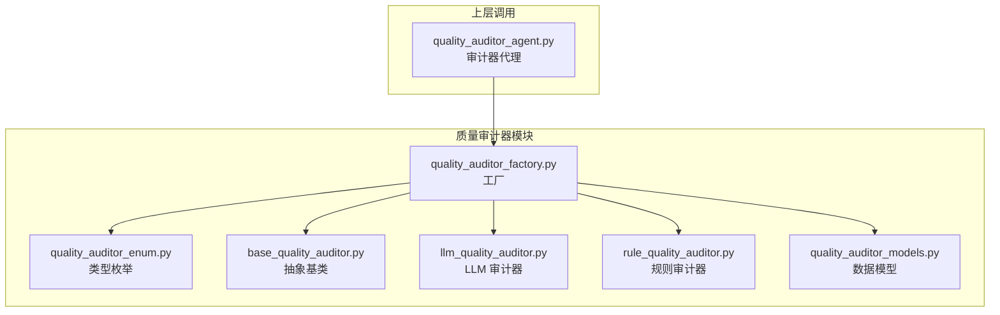
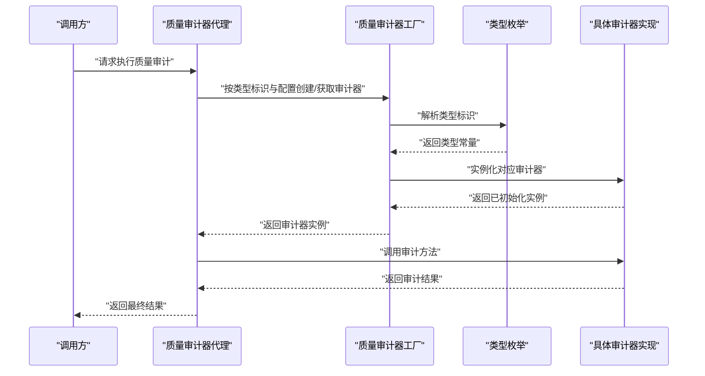
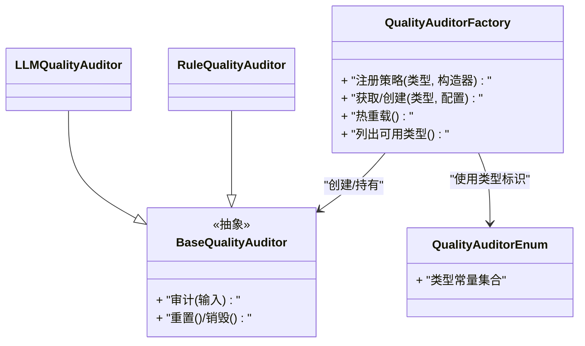
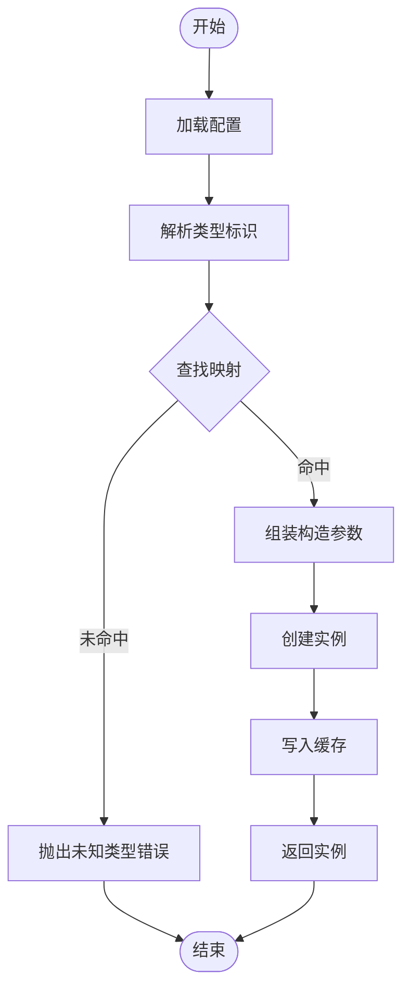
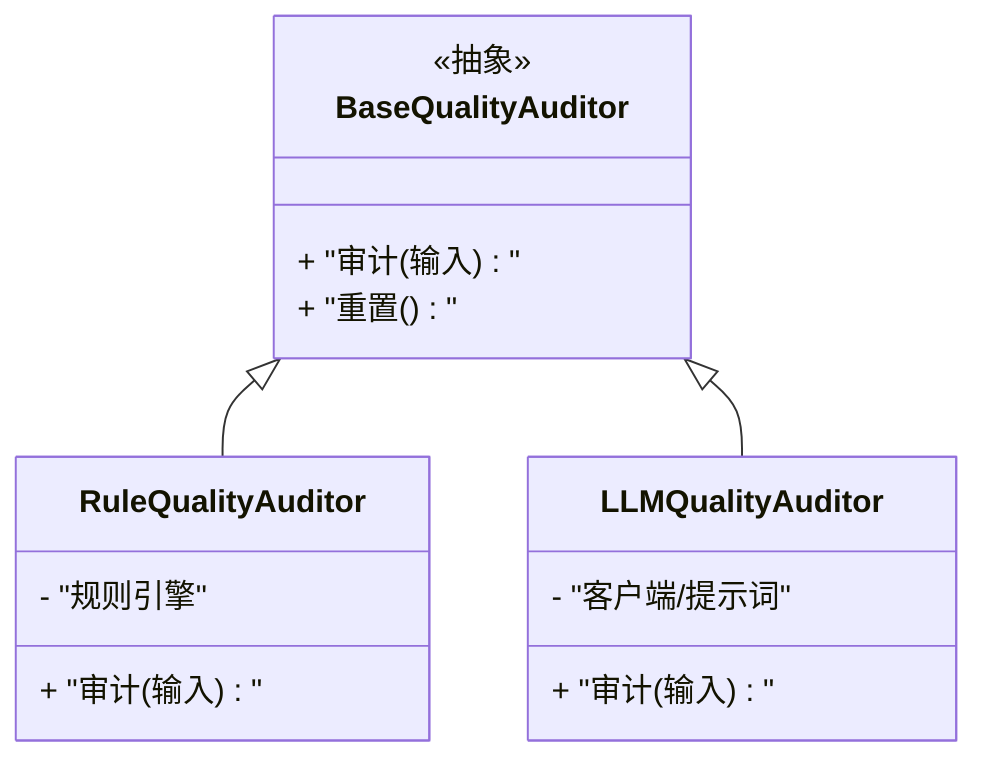
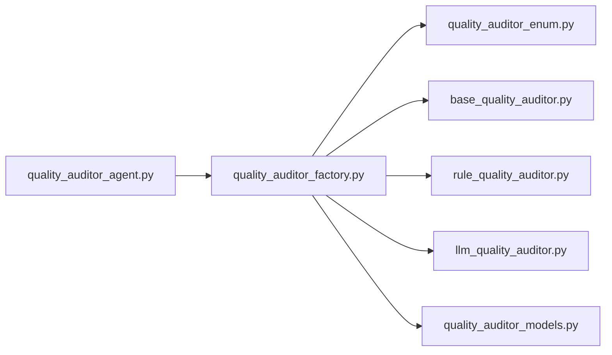

# 审计器工厂

<cite>
**本文引用的文件**   
- [quality_auditor_factory.py](file://src/penshot/neopen/agent/quality_auditor/quality_auditor_factory.py)
- [quality_auditor_enum.py](file://src/penshot/neopen/agent/quality_auditor/quality_auditor_enum.py)
- [base_quality_auditor.py](file://src/penshot/neopen/agent/quality_auditor/base_quality_auditor.py)
- [llm_quality_auditor.py](file://src/penshot/neopen/agent/quality_auditor/llm_quality_auditor.py)
- [rule_quality_auditor.py](file://src/penshot/neopen/agent/quality_auditor/rule_quality_auditor.py)
- [quality_auditor_models.py](file://src/penshot/neopen/agent/quality_auditor/quality_auditor_models.py)
- [quality_auditor_agent.py](file://src/penshot/neopen/agent/quality_auditor_agent.py)
</cite>

## 目录
1. [简介](#简介)
2. [项目结构](#项目结构)
3. [核心组件](#核心组件)
4. [架构总览](#架构总览)
5. [详细组件分析](#详细组件分析)
6. [依赖分析](#依赖分析)
7. [性能考虑](#性能考虑)
8. [故障排查指南](#故障排查指南)
9. [结论](#结论)
10. [附录](#附录) 

## 简介
本文件围绕“质量审计器工厂”进行系统化文档化，重点覆盖以下目标：
- 工厂模式的实现与审计器动态创建机制
- 审计器类型枚举与配置映射关系
- 多策略模式在审计器选择中的应用
- 审计器注册与发现机制的使用指南
- 运行时审计器切换与热重载能力
- 复杂业务场景下的审计器组合策略

该模块位于 neopen 代理子系统中，服务于脚本解析、分镜分割、视频切分等上游环节的质量保障。通过统一的工厂入口，系统可按配置或运行时策略动态装配不同的审计器（如基于规则、基于大模型），并支持扩展新的审计策略。

## 项目结构
质量审计器相关代码集中在 quality_auditor 包内，采用“基类 + 具体实现 + 工厂 + 枚举 + 数据模型”的分层组织方式；上层由 quality_auditor_agent 作为统一调用入口。

图表来源
- [quality_auditor_factory.py](file://src/penshot/neopen/agent/quality_auditor/quality_auditor_factory.py)
- [quality_auditor_enum.py](file://src/penshot/neopen/agent/quality_auditor/quality_auditor_enum.py)
- [base_quality_auditor.py](file://src/penshot/neopen/agent/quality_auditor/base_quality_auditor.py)
- [llm_quality_auditor.py](file://src/penshot/neopen/agent/quality_auditor/llm_quality_auditor.py)
- [rule_quality_auditor.py](file://src/penshot/neopen/agent/quality_auditor/rule_quality_auditor.py)
- [quality_auditor_models.py](file://src/penshot/neopen/agent/quality_auditor/quality_auditor_models.py)
- [quality_auditor_agent.py](file://src/penshot/neopen/agent/quality_auditor_agent.py)

章节来源
- [quality_auditor_factory.py](file://src/penshot/neopen/agent/quality_auditor/quality_auditor_factory.py)
- [quality_auditor_enum.py](file://src/penshot/neopen/agent/quality_auditor/quality_auditor_enum.py)
- [base_quality_auditor.py](file://src/penshot/neopen/agent/quality_auditor/base_quality_auditor.py)
- [llm_quality_auditor.py](file://src/penshot/neopen/agent/quality_auditor/llm_quality_auditor.py)
- [rule_quality_auditor.py](file://src/penshot/neopen/agent/quality_auditor/rule_quality_auditor.py)
- [quality_auditor_models.py](file://src/penshot/neopen/agent/quality_auditor/quality_auditor_models.py)
- [quality_auditor_agent.py](file://src/penshot/neopen/agent/quality_auditor_agent.py)

## 核心组件
- 抽象基类：定义审计器的统一接口与通用能力，确保不同策略具备一致的输入输出契约。
- 具体审计器：
  - 规则审计器：基于可配置的规则集执行检查，适合快速、确定性的校验。
  - LLM 审计器：借助大语言模型进行语义级质量评估，适合复杂、开放域的判断。
- 工厂：根据类型标识与配置动态创建对应审计器实例，并提供注册、发现、缓存与热重载能力。
- 枚举：集中管理所有支持的审计器类型标识，避免硬编码字符串。
- 数据模型：规范审计器输入、输出及中间状态的数据结构。
- 上层代理：对外暴露统一的审计服务接口，内部委托工厂完成实例获取与调度。

章节来源
- [base_quality_auditor.py](file://src/penshot/neopen/agent/quality_auditor/base_quality_auditor.py)
- [rule_quality_auditor.py](file://src/penshot/neopen/agent/quality_auditor/rule_quality_auditor.py)
- [llm_quality_auditor.py](file://src/penshot/neopen/agent/quality_auditor/llm_quality_auditor.py)
- [quality_auditor_factory.py](file://src/penshot/neopen/agent/quality_auditor/quality_auditor_factory.py)
- [quality_auditor_enum.py](file://src/penshot/neopen/agent/quality_auditor/quality_auditor_enum.py)
- [quality_auditor_models.py](file://src/penshot/neopen/agent/quality_auditor/quality_auditor_models.py)
- [quality_auditor_agent.py](file://src/penshot/neopen/agent/quality_auditor_agent.py)

## 架构总览
下图展示了从上层代理到工厂再到具体审计器的调用链路与职责分工。

图表来源
- [quality_auditor_agent.py](file://src/penshot/neopen/agent/quality_auditor_agent.py)
- [quality_auditor_factory.py](file://src/penshot/neopen/agent/quality_auditor/quality_auditor_factory.py)
- [quality_auditor_enum.py](file://src/penshot/neopen/agent/quality_auditor/quality_auditor_enum.py)
- [base_quality_auditor.py](file://src/penshot/neopen/agent/quality_auditor/base_quality_auditor.py)
- [llm_quality_auditor.py](file://src/penshot/neopen/agent/quality_auditor/llm_quality_auditor.py)
- [rule_quality_auditor.py](file://src/penshot/neopen/agent/quality_auditor/rule_quality_auditor.py)

## 详细组件分析

### 工厂与多策略模式
- 工厂职责
  - 接收“类型标识 + 配置”，定位并实例化对应审计器
  - 维护注册表与缓存，避免重复创建
  - 提供注册新策略的扩展点
  - 支持运行时切换与热重载（重新加载配置后重建实例）
- 多策略模式应用
  - 以枚举为键，将策略实现与类型标识解耦
  - 新增策略只需注册映射，无需修改现有流程
  - 工厂负责策略选择与生命周期管理

图表来源
- [quality_auditor_factory.py](file://src/penshot/neopen/agent/quality_auditor/quality_auditor_factory.py)
- [base_quality_auditor.py](file://src/penshot/neopen/agent/quality_auditor/base_quality_auditor.py)
- [rule_quality_auditor.py](file://src/penshot/neopen/agent/quality_auditor/rule_quality_auditor.py)
- [llm_quality_auditor.py](file://src/penshot/neopen/agent/quality_auditor/llm_quality_auditor.py)
- [quality_auditor_enum.py](file://src/penshot/neopen/agent/quality_auditor/quality_auditor_enum.py)

章节来源
- [quality_auditor_factory.py](file://src/penshot/neopen/agent/quality_auditor/quality_auditor_factory.py)
- [quality_auditor_enum.py](file://src/penshot/neopen/agent/quality_auditor/quality_auditor_enum.py)
- [base_quality_auditor.py](file://src/penshot/neopen/agent/quality_auditor/base_quality_auditor.py)
- [rule_quality_auditor.py](file://src/penshot/neopen/agent/quality_auditor/rule_quality_auditor.py)
- [llm_quality_auditor.py](file://src/penshot/neopen/agent/quality_auditor/llm_quality_auditor.py)

### 类型枚举与配置映射
- 类型枚举
  - 集中声明所有支持的审计器类型标识，供工厂与上层逻辑使用
  - 避免魔法字符串，提升可维护性与可读性
- 配置映射
  - 工厂内部维护“类型 -> 构造器/参数模板”的映射
  - 支持从外部配置源注入默认参数，减少硬编码
  - 当配置变更时，可通过热重载刷新映射并重建实例

图表来源
- [quality_auditor_factory.py](file://src/penshot/neopen/agent/quality_auditor/quality_auditor_factory.py)
- [quality_auditor_enum.py](file://src/penshot/neopen/agent/quality_auditor/quality_auditor_enum.py)

章节来源
- [quality_auditor_enum.py](file://src/penshot/neopen/agent/quality_auditor/quality_auditor_enum.py)
- [quality_auditor_factory.py](file://src/penshot/neopen/agent/quality_auditor/quality_auditor_factory.py)

### 审计器基类与具体实现
- 基类约定
  - 定义统一的审计接口与通用行为（如日志、指标、资源清理）
  - 约束输入输出数据结构，保证上下游一致性
- 规则审计器
  - 优点：确定性高、延迟低、易测试
  - 适用：格式校验、字段完整性、阈值判断等
- LLM 审计器
  - 优点：语义理解强、灵活度高
  - 适用：风格一致性、内容合理性、跨段落连贯性等

图表来源
- [base_quality_auditor.py](file://src/penshot/neopen/agent/quality_auditor/base_quality_auditor.py)
- [rule_quality_auditor.py](file://src/penshot/neopen/agent/quality_auditor/rule_quality_auditor.py)
- [llm_quality_auditor.py](file://src/penshot/neopen/agent/quality_auditor/llm_quality_auditor.py)

章节来源
- [base_quality_auditor.py](file://src/penshot/neopen/agent/quality_auditor/base_quality_auditor.py)
- [rule_quality_auditor.py](file://src/penshot/neopen/agent/quality_auditor/rule_quality_auditor.py)
- [llm_quality_auditor.py](file://src/penshot/neopen/agent/quality_auditor/llm_quality_auditor.py)

### 数据模型
- 输入模型：描述待审计的原始数据、上下文与可选参数
- 输出模型：描述审计结论、问题清单、修复建议与置信度
- 中间状态：用于流水线串联与重试时的恢复信息

章节来源
- [quality_auditor_models.py](file://src/penshot/neopen/agent/quality_auditor/quality_auditor_models.py)

### 上层代理与集成
- 代理职责
  - 封装工厂调用细节，向上提供简洁 API
  - 处理异常、重试、降级与结果标准化
- 典型用法
  - 在脚本解析、分镜生成、视频切分等环节插入质量门禁
  - 结合工作流编排，形成“先审后改”或“边审边改”的闭环

章节来源
- [quality_auditor_agent.py](file://src/penshot/neopen/agent/quality_auditor_agent.py)

## 依赖分析
- 内部依赖
  - 工厂依赖枚举与具体实现，并通过基类保持松耦合
  - 代理仅依赖工厂与模型，屏蔽底层策略差异
- 外部依赖
  - LLM 审计器可能依赖外部大模型客户端（不在本小节展开）
- 潜在循环依赖
  - 当前分层清晰，未见循环引用风险

图表来源
- [quality_auditor_agent.py](file://src/penshot/neopen/agent/quality_auditor_agent.py)
- [quality_auditor_factory.py](file://src/penshot/neopen/agent/quality_auditor/quality_auditor_factory.py)
- [quality_auditor_enum.py](file://src/penshot/neopen/agent/quality_auditor/quality_auditor_enum.py)
- [base_quality_auditor.py](file://src/penshot/neopen/agent/quality_auditor/base_quality_auditor.py)
- [rule_quality_auditor.py](file://src/penshot/neopen/agent/quality_auditor/rule_quality_auditor.py)
- [llm_quality_auditor.py](file://src/penshot/neopen/agent/quality_auditor/llm_quality_auditor.py)
- [quality_auditor_models.py](file://src/penshot/neopen/agent/quality_auditor/quality_auditor_models.py)

章节来源
- [quality_auditor_factory.py](file://src/penshot/neopen/agent/quality_auditor/quality_auditor_factory.py)
- [quality_auditor_agent.py](file://src/penshot/neopen/agent/quality_auditor_agent.py)

## 性能考虑
- 实例缓存：对相同类型与参数的审计器进行复用，避免重复初始化
- 懒加载：按需创建实例，降低冷启动开销
- 并发安全：工厂需保证多线程/协程环境下的注册与创建原子性
- 资源释放：审计器持有外部资源（如连接池）时应提供显式关闭或自动回收
- 降级策略：当 LLM 不可用时，可回退至规则审计器以保证可用性

[本节为通用指导，不直接分析具体文件]

## 故障排查指南
- 常见错误
  - 未知类型：检查枚举是否包含该类型，以及工厂映射是否正确注册
  - 配置缺失：确认构造参数模板完整，必填项齐全
  - 资源泄漏：确保审计器生命周期结束时释放外部资源
- 诊断步骤
  - 打印工厂注册表与缓存状态
  - 对比运行期配置与期望配置
  - 隔离验证单一策略的实现正确性
- 恢复手段
  - 触发热重载以刷新映射与缓存
  - 重启进程作为兜底方案

章节来源
- [quality_auditor_factory.py](file://src/penshot/neopen/agent/quality_auditor/quality_auditor_factory.py)
- [quality_auditor_agent.py](file://src/penshot/neopen/agent/quality_auditor_agent.py)

## 结论
质量审计器工厂通过“枚举 + 工厂 + 多策略”的组合，实现了审计能力的可扩展、可配置与可替换。配合上层代理与数据模型，可在复杂业务流程中灵活组合多种审计策略，并在运行时进行切换与热重载，满足生产环境的稳定性与演进需求。

[本节为总结性内容，不直接分析具体文件]

## 附录

### 使用指南：注册与发现
- 注册新策略
  - 在工厂中注册“类型标识 -> 构造器/参数模板”的映射
  - 确保类型标识来自枚举，避免硬编码
- 发现可用类型
  - 通过工厂提供的查询接口列出已注册类型
- 动态创建
  - 传入类型标识与配置，工厂返回已初始化的审计器实例
- 示例路径
  - 参考工厂与代理的公开接口进行调用

章节来源
- [quality_auditor_factory.py](file://src/penshot/neopen/agent/quality_auditor/quality_auditor_factory.py)
- [quality_auditor_agent.py](file://src/penshot/neopen/agent/quality_auditor_agent.py)

### 运行时切换与热重载
- 运行时切换
  - 在请求级别指定类型标识，实现 A/B 测试或灰度发布
- 热重载
  - 监听配置变更事件，刷新工厂映射并重建缓存实例
  - 注意并发安全与旧实例的优雅回收

章节来源
- [quality_auditor_factory.py](file://src/penshot/neopen/agent/quality_auditor/quality_auditor_factory.py)

### 复杂业务场景的组合策略
- 串行组合
  - 规则审计先行，快速拦截明显问题；LLM 审计随后进行深度评估
- 并行组合
  - 多策略并行执行，聚合结果并按权重决策
- 条件路由
  - 根据输入特征（如文本长度、领域标签）选择最优策略
- 容错与降级
  - 某策略失败时自动降级至备选策略，保证整体可用性

章节来源
- [quality_auditor_factory.py](file://src/penshot/neopen/agent/quality_auditor/quality_auditor_factory.py)
- [quality_auditor_agent.py](file://src/penshot/neopen/agent/quality_auditor_agent.py)