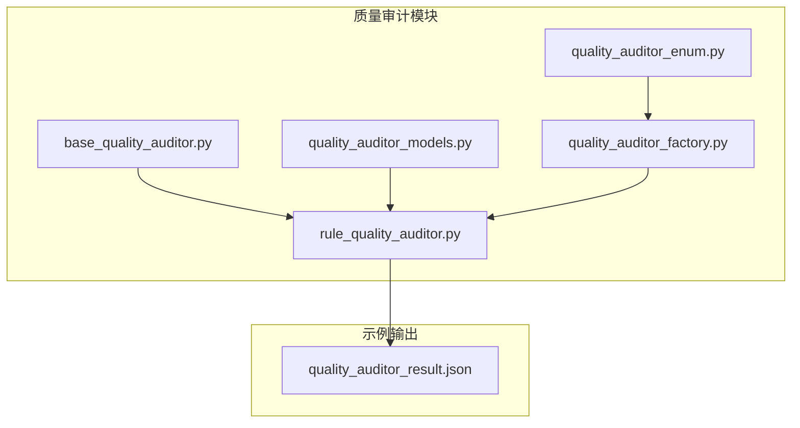
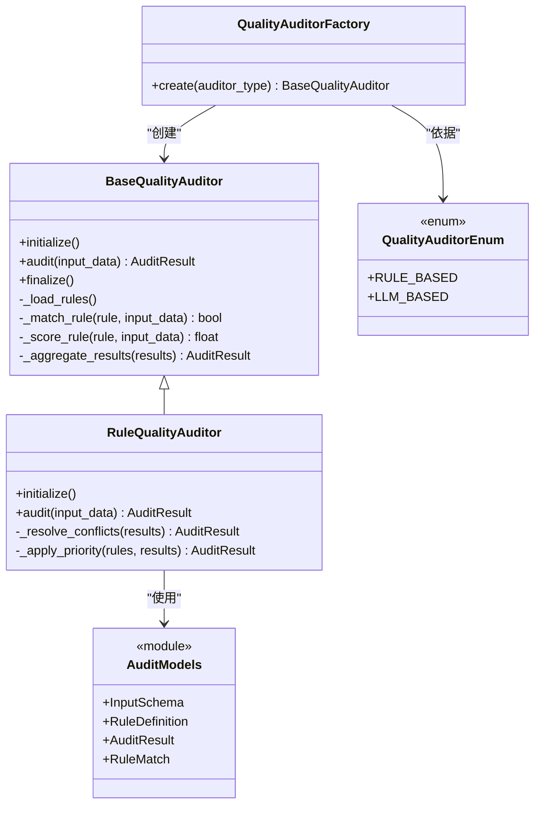
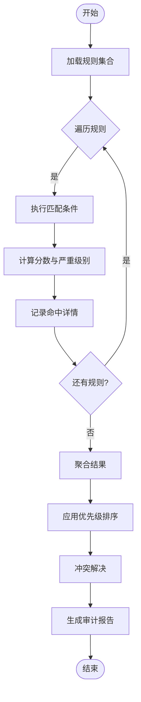
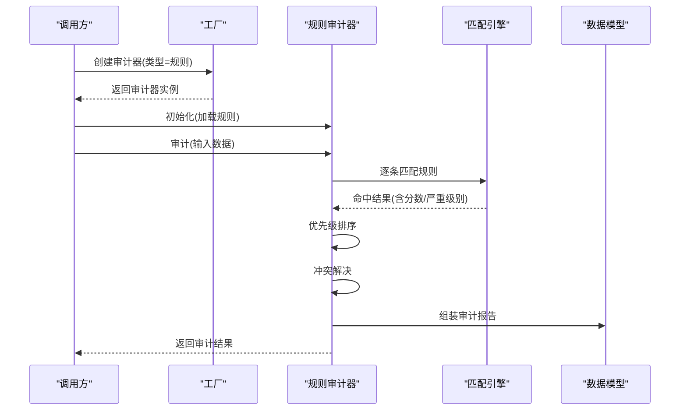
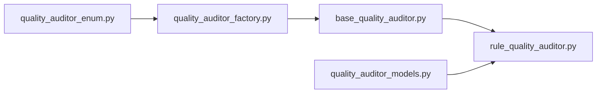

# 规则审计器

<cite>
**本文引用的文件**   
- [src/penshot/neopen/agent/quality_auditor/rule_quality_auditor.py](file://src/penshot/neopen/agent/quality_auditor/rule_quality_auditor.py)
- [src/penshot/neopen/agent/quality_auditor/base_quality_auditor.py](file://src/penshot/neopen/agent/quality_auditor/base_quality_auditor.py)
- [src/penshot/neopen/agent/quality_auditor/quality_auditor_models.py](file://src/penshot/neopen/agent/quality_auditor/quality_auditor_models.py)
- [src/penshot/neopen/agent/quality_auditor/quality_auditor_factory.py](file://src/penshot/neopen/agent/quality_auditor/quality_auditor_factory.py)
- [src/penshot/neopen/agent/quality_auditor/quality_auditor_enum.py](file://src/penshot/neopen/agent/quality_auditor/quality_auditor_enum.py)
- [examples/json_demo/quality_auditor_result.json](file://examples/json_demo/quality_auditor_result.json)
</cite>

## 目录
1. [简介](#简介)
2. [项目结构](#项目结构)
3. [核心组件](#核心组件)
4. [架构总览](#架构总览)
5. [详细组件分析](#详细组件分析)
6. [依赖分析](#依赖分析)
7. [性能考虑](#性能考虑)
8. [故障排查指南](#故障排查指南)
9. [结论](#结论)
10. [附录](#附录)

## 简介
本文件面向“基于规则的审计器”（Rule-based Quality Auditor），聚焦规则引擎的实现原理、匹配算法、预定义质量检查规则集（格式验证、内容完整性检查、逻辑一致性验证）、优先级与冲突解决机制，并提供自定义规则开发指南、测试方法、配置示例与性能优化建议。同时给出复杂业务场景下的规则组合策略，帮助读者快速落地并扩展规则审计能力。

## 项目结构
围绕规则审计器的关键代码位于 neopen/agent/quality_auditor 目录下，包含抽象基类、模型定义、工厂枚举以及规则审计器实现；示例输出位于 examples/json_demo 下，便于对照理解结果结构。

图表来源
- [src/penshot/neopen/agent/quality_auditor/base_quality_auditor.py](file://src/penshot/neopen/agent/quality_auditor/base_quality_auditor.py)
- [src/penshot/neopen/agent/quality_auditor/rule_quality_auditor.py](file://src/penshot/neopen/agent/quality_auditor/rule_quality_auditor.py)
- [src/penshot/neopen/agent/quality_auditor/quality_auditor_models.py](file://src/penshot/neopen/agent/quality_auditor/quality_auditor_models.py)
- [src/penshot/neopen/agent/quality_auditor/quality_auditor_factory.py](file://src/penshot/neopen/agent/quality_auditor/quality_auditor_factory.py)
- [src/penshot/neopen/agent/quality_auditor/quality_auditor_enum.py](file://src/penshot/neopen/agent/quality_auditor/quality_auditor_enum.py)
- [examples/json_demo/quality_auditor_result.json](file://examples/json_demo/quality_auditor_result.json)

章节来源
- [src/penshot/neopen/agent/quality_auditor/rule_quality_auditor.py](file://src/penshot/neopen/agent/quality_auditor/rule_quality_auditor.py)
- [src/penshot/neopen/agent/quality_auditor/base_quality_auditor.py](file://src/penshot/neopen/agent/quality_auditor/base_quality_auditor.py)
- [src/penshot/neopen/agent/quality_auditor/quality_auditor_models.py](file://src/penshot/neopen/agent/quality_auditor/quality_auditor_models.py)
- [src/penshot/neopen/agent/quality_auditor/quality_auditor_factory.py](file://src/penshot/neopen/agent/quality_auditor/quality_auditor_factory.py)
- [src/penshot/neopen/agent/quality_auditor/quality_auditor_enum.py](file://src/penshot/neopen/agent/quality_auditor/quality_auditor_enum.py)
- [examples/json_demo/quality_auditor_result.json](file://examples/json_demo/quality_auditor_result.json)

## 核心组件
- 抽象基类：定义审计器通用接口与生命周期钩子，供具体审计器（包括规则审计器）继承实现。
- 规则审计器：实现基于规则的匹配与评估流程，负责加载规则、执行匹配、聚合结果与生成审计报告。
- 数据模型：统一输入/输出数据结构，确保规则匹配结果可序列化、可观测、可回放。
- 工厂与枚举：提供按类型选择审计器实例的能力，并约束可用审计器种类。

章节来源
- [src/penshot/neopen/agent/quality_auditor/base_quality_auditor.py](file://src/penshot/neopen/agent/quality_auditor/base_quality_auditor.py)
- [src/penshot/neopen/agent/quality_auditor/rule_quality_auditor.py](file://src/penshot/neopen/agent/quality_auditor/rule_quality_auditor.py)
- [src/penshot/neopen/agent/quality_auditor/quality_auditor_models.py](file://src/penshot/neopen/agent/quality_auditor/quality_auditor_models.py)
- [src/penshot/neopen/agent/quality_auditor/quality_auditor_factory.py](file://src/penshot/neopen/agent/quality_auditor/quality_auditor_factory.py)
- [src/penshot/neopen/agent/quality_auditor/quality_auditor_enum.py](file://src/penshot/neopen/agent/quality_auditor/quality_auditor_enum.py)

## 架构总览
规则审计器采用“规则即数据 + 匹配引擎 + 结果聚合”的分层设计。输入对象经规则解析后进入匹配阶段，逐条规则进行条件判定与评分，最终汇总为结构化报告。

图表来源
- [src/penshot/neopen/agent/quality_auditor/base_quality_auditor.py](file://src/penshot/neopen/agent/quality_auditor/base_quality_auditor.py)
- [src/penshot/neopen/agent/quality_auditor/rule_quality_auditor.py](file://src/penshot/neopen/agent/quality_auditor/rule_quality_auditor.py)
- [src/penshot/neopen/agent/quality_auditor/quality_auditor_models.py](file://src/penshot/neopen/agent/quality_auditor/quality_auditor_models.py)
- [src/penshot/neopen/agent/quality_auditor/quality_auditor_factory.py](file://src/penshot/neopen/agent/quality_auditor/quality_auditor_factory.py)
- [src/penshot/neopen/agent/quality_auditor/quality_auditor_enum.py](file://src/penshot/neopen/agent/quality_auditor/quality_auditor_enum.py)

## 详细组件分析

### 规则引擎与匹配算法
- 规则加载：从配置或注册表读取规则集合，构建可遍历的规则列表。
- 匹配流程：对每条规则执行条件判断，支持字段存在性、类型校验、范围/模式匹配、跨字段一致性等。
- 评分与标记：根据命中情况计算分数与严重级别，记录命中详情以便回溯。
- 结果聚合：汇总所有规则命中，应用优先级与冲突解决策略，生成最终审计报告。

图表来源
- [src/penshot/neopen/agent/quality_auditor/rule_quality_auditor.py](file://src/penshot/neopen/agent/quality_auditor/rule_quality_auditor.py)
- [src/penshot/neopen/agent/quality_auditor/base_quality_auditor.py](file://src/penshot/neopen/agent/quality_auditor/base_quality_auditor.py)

章节来源
- [src/penshot/neopen/agent/quality_auditor/rule_quality_auditor.py](file://src/penshot/neopen/agent/quality_auditor/rule_quality_auditor.py)
- [src/penshot/neopen/agent/quality_auditor/base_quality_auditor.py](file://src/penshot/neopen/agent/quality_auditor/base_quality_auditor.py)

### 预定义质量检查规则集
- 格式验证：检查输入结构的键存在性、数据类型、必填项、枚举值、长度/范围限制等。
- 内容完整性检查：确保关键字段非空、关联对象完整、时间戳顺序合理、引用关系一致等。
- 逻辑一致性验证：跨字段/跨对象的一致性约束，如状态机转换合法、数值上下界自洽、业务阈值达标等。

说明：上述规则类别通过规则定义模型表达，可在配置中声明式启用/禁用与调整参数。

章节来源
- [src/penshot/neopen/agent/quality_auditor/quality_auditor_models.py](file://src/penshot/neopen/agent/quality_auditor/quality_auditor_models.py)
- [examples/json_demo/quality_auditor_result.json](file://examples/json_demo/quality_auditor_result.json)

### 优先级排序与冲突解决机制
- 优先级排序：规则具备优先级权重，高优先级规则先执行或在冲突时覆盖低优先级结果。
- 冲突解决：当多条规则对同一目标产生矛盾结论时，依据优先级、严重级别、最近修改时间等策略裁决。
- 结果合并：将冲突裁决后的规则命中合并为最终审计结果，保留明细以供诊断。

图表来源
- [src/penshot/neopen/agent/quality_auditor/quality_auditor_factory.py](file://src/penshot/neopen/agent/quality_auditor/quality_auditor_factory.py)
- [src/penshot/neopen/agent/quality_auditor/rule_quality_auditor.py](file://src/penshot/neopen/agent/quality_auditor/rule_quality_auditor.py)
- [src/penshot/neopen/agent/quality_auditor/quality_auditor_models.py](file://src/penshot/neopen/agent/quality_auditor/quality_auditor_models.py)

章节来源
- [src/penshot/neopen/agent/quality_auditor/rule_quality_auditor.py](file://src/penshot/neopen/agent/quality_auditor/rule_quality_auditor.py)
- [src/penshot/neopen/agent/quality_auditor/quality_auditor_models.py](file://src/penshot/neopen/agent/quality_auditor/quality_auditor_models.py)

### 自定义规则开发指南
- 步骤概览：
  1) 在规则定义模型中新增或复用规则类型。
  2) 在规则审计器中扩展匹配逻辑，支持新条件的解析与判定。
  3) 在配置中声明规则条目（名称、条件、优先级、严重级别）。
  4) 编写单元测试，覆盖正常路径、边界条件与异常路径。
  5) 集成端到端用例，验证与其他规则的组合效果。
- 最佳实践：
  - 保持规则原子化，单一职责，避免隐式耦合。
  - 明确输入契约，使用数据模型进行强校验。
  - 为每条规则提供可追溯的命中详情（字段、期望值、实际值）。
  - 通过优先级与严重级别控制影响面，避免误伤。

章节来源
- [src/penshot/neopen/agent/quality_auditor/quality_auditor_models.py](file://src/penshot/neopen/agent/quality_auditor/quality_auditor_models.py)
- [src/penshot/neopen/agent/quality_auditor/rule_quality_auditor.py](file://src/penshot/neopen/agent/quality_auditor/rule_quality_auditor.py)

### 测试方法与示例
- 单元测试：针对单条规则的匹配与评分逻辑，构造最小输入，断言命中与否及分数。
- 集成测试：组合多条规则，验证优先级与冲突解决是否符合预期。
- 回归测试：基于历史样本与已知问题用例，确保规则变更不引入退化。
- 示例参考：查看示例输出以了解审计结果的字段结构与语义。

章节来源
- [examples/json_demo/quality_auditor_result.json](file://examples/json_demo/quality_auditor_result.json)

### 规则配置示例
- 配置要点：
  - 规则清单：名称、类型、条件表达式、优先级、严重级别、是否启用。
  - 全局策略：默认优先级、冲突解决策略、超时与重试。
  - 环境差异：不同环境（开发/生产）启用不同的规则子集。
- 建议：
  - 将规则与业务配置分离，便于独立评审与灰度发布。
  - 使用版本化的规则集，配合变更日志与回滚策略。

章节来源
- [src/penshot/neopen/agent/quality_auditor/quality_auditor_models.py](file://src/penshot/neopen/agent/quality_auditor/quality_auditor_models.py)
- [src/penshot/neopen/agent/quality_auditor/rule_quality_auditor.py](file://src/penshot/neopen/agent/quality_auditor/rule_quality_auditor.py)

### 复杂业务场景下的规则组合策略
- 分层策略：基础格式层 → 内容完整性层 → 逻辑一致性层，逐层过滤与增强。
- 分组策略：按业务域划分规则组，按需启用，降低无关规则干扰。
- 动态策略：根据上下文（如用户等级、渠道、地区）动态调整规则集与阈值。
- 降级策略：在高峰期或资源紧张时，优先运行高价值规则，其余延后或采样执行。

[本节为概念性指导，无需源码引用]

## 依赖分析
规则审计器依赖数据模型与工厂枚举，并通过工厂按类型创建实例。整体耦合清晰，易于扩展新的审计器类型。

图表来源
- [src/penshot/neopen/agent/quality_auditor/quality_auditor_enum.py](file://src/penshot/neopen/agent/quality_auditor/quality_auditor_enum.py)
- [src/penshot/neopen/agent/quality_auditor/quality_auditor_factory.py](file://src/penshot/neopen/agent/quality_auditor/quality_auditor_factory.py)
- [src/penshot/neopen/agent/quality_auditor/base_quality_auditor.py](file://src/penshot/neopen/agent/quality_auditor/base_quality_auditor.py)
- [src/penshot/neopen/agent/quality_auditor/rule_quality_auditor.py](file://src/penshot/neopen/agent/quality_auditor/rule_quality_auditor.py)
- [src/penshot/neopen/agent/quality_auditor/quality_auditor_models.py](file://src/penshot/neopen/agent/quality_auditor/quality_auditor_models.py)

章节来源
- [src/penshot/neopen/agent/quality_auditor/quality_auditor_enum.py](file://src/penshot/neopen/agent/quality_auditor/quality_auditor_enum.py)
- [src/penshot/neopen/agent/quality_auditor/quality_auditor_factory.py](file://src/penshot/neopen/agent/quality_auditor/quality_auditor_factory.py)
- [src/penshot/neopen/agent/quality_auditor/base_quality_auditor.py](file://src/penshot/neopen/agent/quality_auditor/base_quality_auditor.py)
- [src/penshot/neopen/agent/quality_auditor/rule_quality_auditor.py](file://src/penshot/neopen/agent/quality_auditor/rule_quality_auditor.py)
- [src/penshot/neopen/agent/quality_auditor/quality_auditor_models.py](file://src/penshot/neopen/agent/quality_auditor/quality_auditor_models.py)

## 性能考虑
- 规则索引：对高频匹配字段建立索引，减少全量扫描。
- 短路评估：命中关键失败规则后立即短路，避免无谓计算。
- 并行执行：对相互独立的规则进行并发匹配，注意线程安全与资源上限。
- 缓存命中：对相同输入指纹的结果进行缓存，提升重复审计效率。
- 批量处理：合并多次审计请求，批量化执行规则以减少开销。
- 资源隔离：为不同租户或业务域设置配额与超时，防止长尾拖慢整体吞吐。

[本节为通用性能建议，无需源码引用]

## 故障排查指南
- 常见问题定位：
  - 规则未生效：检查规则是否启用、优先级是否过低、条件表达式是否正确。
  - 冲突误判：核对冲突解决策略与严重级别排序，确认是否存在等价冲突。
  - 性能退化：观察是否有规则导致全量扫描或递归依赖，必要时拆分或加索引。
- 诊断手段：
  - 启用详细命中日志，记录每条规则的输入片段与判定过程。
  - 导出审计结果样例，对比预期与实际的差异点。
  - 逐步关闭规则子集，二分定位问题规则。

章节来源
- [src/penshot/neopen/agent/quality_auditor/rule_quality_auditor.py](file://src/penshot/neopen/agent/quality_auditor/rule_quality_auditor.py)
- [examples/json_demo/quality_auditor_result.json](file://examples/json_demo/quality_auditor_result.json)

## 结论
规则审计器通过清晰的抽象与可扩展的匹配引擎，实现了稳定可控的质量保障能力。借助预定义的三类规则集、明确的优先级与冲突解决机制，以及完善的自定义开发与测试流程，能够在复杂业务场景中灵活组合与演进。结合性能优化与故障排查策略，可进一步提升系统的可靠性与可维护性。

[本节为总结性内容，无需源码引用]

## 附录
- 术语说明：
  - 规则：描述输入应满足的条件与后果（分数/严重级别）的可执行单元。
  - 优先级：决定规则执行顺序与冲突裁决的重要参数。
  - 严重级别：衡量违规影响的程度，用于风险分级与告警。
- 相关入口：
  - 工厂创建：通过工厂按枚举类型获取审计器实例。
  - 模型定义：输入/输出与规则定义的数据结构集中管理。

章节来源
- [src/penshot/neopen/agent/quality_auditor/quality_auditor_factory.py](file://src/penshot/neopen/agent/quality_auditor/quality_auditor_factory.py)
- [src/penshot/neopen/agent/quality_auditor/quality_auditor_models.py](file://src/penshot/neopen/agent/quality_auditor/quality_auditor_models.py)
- [src/penshot/neopen/agent/quality_auditor/quality_auditor_enum.py](file://src/penshot/neopen/agent/quality_auditor/quality_auditor_enum.py)