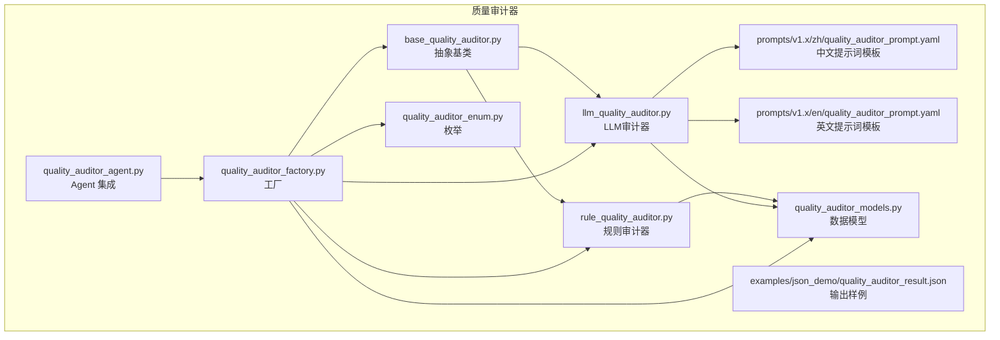
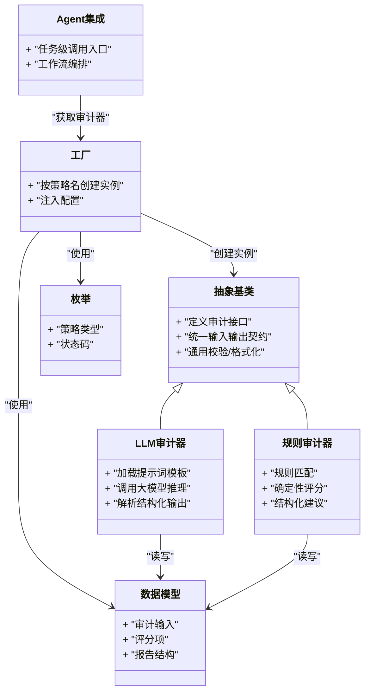
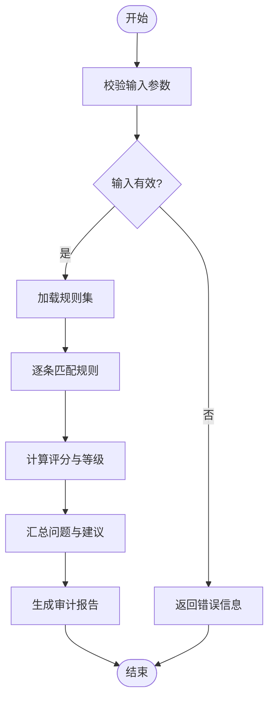
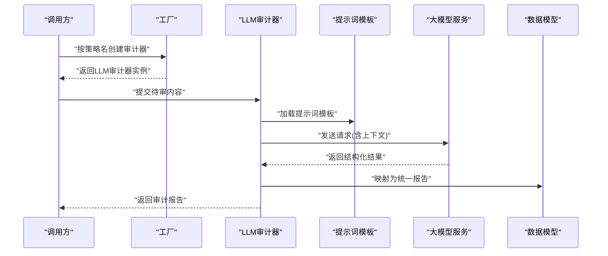
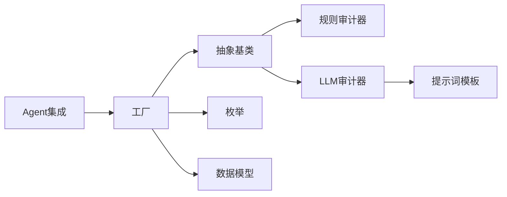

# 质量审计器

<cite>
**本文引用的文件**   
- [src/penshot/neopen/agent/quality_auditor/base_quality_auditor.py](file://src/penshot/neopen/agent/quality_auditor/base_quality_auditor.py)
- [src/penshot/neopen/agent/quality_auditor/rule_quality_auditor.py](file://src/penshot/neopen/agent/quality_auditor/rule_quality_auditor.py)
- [src/penshot/neopen/agent/quality_auditor/llm_quality_auditor.py](file://src/penshot/neopen/agent/quality_auditor/llm_quality_auditor.py)
- [src/penshot/neopen/agent/quality_auditor/quality_auditor_factory.py](file://src/penshot/neopen/agent/quality_auditor/quality_auditor_factory.py)
- [src/penshot/neopen/agent/quality_auditor/quality_auditor_models.py](file://src/penshot/neopen/agent/quality_auditor/quality_auditor_models.py)
- [src/penshot/neopen/agent/quality_auditor/quality_auditor_enum.py](file://src/penshot/neopen/agent/quality_auditor/quality_auditor_enum.py)
- [src/penshot/neopen/agent/quality_auditor_agent.py](file://src/penshot/neopen/agent/quality_auditor_agent.py)
- [examples/json_demo/quality_auditor_result.json](file://examples/json_demo/quality_auditor_result.json)
- [src/penshot/prompts/v1.x/zh/quality_auditor_prompt.yaml](file://src/penshot/prompts/v1.x/zh/quality_auditor_prompt.yaml)
- [src/penshot/prompts/v1.x/en/quality_auditor_prompt.yaml](file://src/penshot/prompts/v1.x/en/quality_auditor_prompt.yaml)
</cite>

## 目录
1. [简介](#简介)
2. [项目结构](#项目结构)
3. [核心组件](#核心组件)
4. [架构总览](#架构总览)
5. [详细组件分析](#详细组件分析)
6. [依赖分析](#依赖分析)
7. [性能考虑](#性能考虑)
8. [故障排查指南](#故障排查指南)
9. [结论](#结论)
10. [附录](#附录)

## 简介
本文件面向“质量审计器”子系统，系统性阐述多维度质量评估机制与实现。内容覆盖：
- 基于规则的审计器与基于大语言模型（LLM）的审计器
- 质量评估指标、评分标准与审计报告格式
- 不同审计策略的选择与配置方法
- 自定义审计规则的开发指南
- 质量检查示例与最佳实践
- 审计结果分析与改进建议

## 项目结构
质量审计器位于 agent 子模块中，采用“工厂 + 抽象基类 + 多策略实现”的组织方式，便于扩展新的审计策略与指标。

图表来源
- [src/penshot/neopen/agent/quality_auditor/base_quality_auditor.py](file://src/penshot/neopen/agent/quality_auditor/base_quality_auditor.py)
- [src/penshot/neopen/agent/quality_auditor/rule_quality_auditor.py](file://src/penshot/neopen/agent/quality_auditor/rule_quality_auditor.py)
- [src/penshot/neopen/agent/quality_auditor/llm_quality_auditor.py](file://src/penshot/neopen/agent/quality_auditor/llm_quality_auditor.py)
- [src/penshot/neopen/agent/quality_auditor/quality_auditor_factory.py](file://src/penshot/neopen/agent/quality_auditor/quality_auditor_factory.py)
- [src/penshot/neopen/agent/quality_auditor/quality_auditor_models.py](file://src/penshot/neopen/agent/quality_auditor/quality_auditor_models.py)
- [src/penshot/neopen/agent/quality_auditor/quality_auditor_enum.py](file://src/penshot/neopen/agent/quality_auditor/quality_auditor_enum.py)
- [src/penshot/neopen/agent/quality_auditor_agent.py](file://src/penshot/neopen/agent/quality_auditor_agent.py)
- [src/penshot/prompts/v1.x/zh/quality_auditor_prompt.yaml](file://src/penshot/prompts/v1.x/zh/quality_auditor_prompt.yaml)
- [src/penshot/prompts/v1.x/en/quality_auditor_prompt.yaml](file://src/penshot/prompts/v1.x/en/quality_auditor_prompt.yaml)
- [examples/json_demo/quality_auditor_result.json](file://examples/json_demo/quality_auditor_result.json)

章节来源
- [src/penshot/neopen/agent/quality_auditor/base_quality_auditor.py](file://src/penshot/neopen/agent/quality_auditor/base_quality_auditor.py)
- [src/penshot/neopen/agent/quality_auditor/rule_quality_auditor.py](file://src/penshot/neopen/agent/quality_auditor/rule_quality_auditor.py)
- [src/penshot/neopen/agent/quality_auditor/llm_quality_auditor.py](file://src/penshot/neopen/agent/quality_auditor/llm_quality_auditor.py)
- [src/penshot/neopen/agent/quality_auditor/quality_auditor_factory.py](file://src/penshot/neopen/agent/quality_auditor/quality_auditor_factory.py)
- [src/penshot/neopen/agent/quality_auditor/quality_auditor_models.py](file://src/penshot/neopen/agent/quality_auditor/quality_auditor_models.py)
- [src/penshot/neopen/agent/quality_auditor/quality_auditor_enum.py](file://src/penshot/neopen/agent/quality_auditor/quality_auditor_enum.py)
- [src/penshot/neopen/agent/quality_auditor_agent.py](file://src/penshot/neopen/agent/quality_auditor_agent.py)
- [src/penshot/prompts/v1.x/zh/quality_auditor_prompt.yaml](file://src/penshot/prompts/v1.x/zh/quality_auditor_prompt.yaml)
- [src/penshot/prompts/v1.x/en/quality_auditor_prompt.yaml](file://src/penshot/prompts/v1.x/en/quality_auditor_prompt.yaml)
- [examples/json_demo/quality_auditor_result.json](file://examples/json_demo/quality_auditor_result.json)

## 核心组件
- 抽象基类：定义统一的审计接口、输入输出契约与通用能力（如校验、格式化、日志等）。
- 规则审计器：通过可配置的规则集对输入进行确定性判定，产出结构化评分与建议。
- LLM 审计器：借助提示词模板与大模型推理，生成多维度的质量评估与改进建议。
- 工厂：根据策略名称或配置动态创建具体审计器实例。
- 数据模型与枚举：统一描述审计输入、评分项、报告结构与状态码。
- Agent 集成：将审计器嵌入工作流，提供任务级调用入口。

章节来源
- [src/penshot/neopen/agent/quality_auditor/base_quality_auditor.py](file://src/penshot/neopen/agent/quality_auditor/base_quality_auditor.py)
- [src/penshot/neopen/agent/quality_auditor/rule_quality_auditor.py](file://src/penshot/neopen/agent/quality_auditor/rule_quality_auditor.py)
- [src/penshot/neopen/agent/quality_auditor/llm_quality_auditor.py](file://src/penshot/neopen/agent/quality_auditor/llm_quality_auditor.py)
- [src/penshot/neopen/agent/quality_auditor/quality_auditor_factory.py](file://src/penshot/neopen/agent/quality_auditor/quality_auditor_factory.py)
- [src/penshot/neopen/agent/quality_auditor/quality_auditor_models.py](file://src/penshot/neopen/agent/quality_auditor/quality_auditor_models.py)
- [src/penshot/neopen/agent/quality_auditor/quality_auditor_enum.py](file://src/penshot/neopen/agent/quality_auditor/quality_auditor_enum.py)
- [src/penshot/neopen/agent/quality_auditor_agent.py](file://src/penshot/neopen/agent/quality_auditor_agent.py)

## 架构总览
质量审计器采用“策略模式 + 工厂”的架构，上层通过统一接口选择并执行不同审计策略；LLM 审计器通过加载提示词模板驱动评估；规则审计器通过规则引擎完成快速、稳定的判定。

图表来源
- [src/penshot/neopen/agent/quality_auditor/base_quality_auditor.py](file://src/penshot/neopen/agent/quality_auditor/base_quality_auditor.py)
- [src/penshot/neopen/agent/quality_auditor/rule_quality_auditor.py](file://src/penshot/neopen/agent/quality_auditor/rule_quality_auditor.py)
- [src/penshot/neopen/agent/quality_auditor/llm_quality_auditor.py](file://src/penshot/neopen/agent/quality_auditor/llm_quality_auditor.py)
- [src/penshot/neopen/agent/quality_auditor/quality_auditor_factory.py](file://src/penshot/neopen/agent/quality_auditor/quality_auditor_factory.py)
- [src/penshot/neopen/agent/quality_auditor/quality_auditor_models.py](file://src/penshot/neopen/agent/quality_auditor/quality_auditor_models.py)
- [src/penshot/neopen/agent/quality_auditor/quality_auditor_enum.py](file://src/penshot/neopen/agent/quality_auditor/quality_auditor_enum.py)
- [src/penshot/neopen/agent/quality_auditor_agent.py](file://src/penshot/neopen/agent/quality_auditor_agent.py)

## 详细组件分析

### 抽象基类
- 职责：定义审计器的统一接口、输入输出规范、通用校验与格式化逻辑。
- 关键点：
  - 输入参数校验与标准化
  - 输出结构的统一封装
  - 可扩展的钩子方法（用于子类定制）
- 适用场景：所有审计策略共享的基础能力。

章节来源
- [src/penshot/neopen/agent/quality_auditor/base_quality_auditor.py](file://src/penshot/neopen/agent/quality_auditor/base_quality_auditor.py)

### 规则审计器
- 职责：基于预定义规则集对输入进行快速、确定性的质量评估。
- 关键点：
  - 规则匹配与优先级处理
  - 评分计算与阈值判定
  - 结构化问题定位与修复建议
- 适用场景：对稳定性要求高、规则明确的场景（如格式校验、字段完整性、基础语义约束）。

章节来源
- [src/penshot/neopen/agent/quality_auditor/rule_quality_auditor.py](file://src/penshot/neopen/agent/quality_auditor/rule_quality_auditor.py)
- [src/penshot/neopen/agent/quality_auditor/quality_auditor_models.py](file://src/penshot/neopen/agent/quality_auditor/quality_auditor_models.py)

#### 规则审计流程图

图表来源
- [src/penshot/neopen/agent/quality_auditor/rule_quality_auditor.py](file://src/penshot/neopen/agent/quality_auditor/rule_quality_auditor.py)
- [src/penshot/neopen/agent/quality_auditor/quality_auditor_models.py](file://src/penshot/neopen/agent/quality_auditor/quality_auditor_models.py)

### LLM 审计器
- 职责：利用大模型推理能力进行多维度质量评估，生成更丰富的洞察与建议。
- 关键点：
  - 提示词模板管理（支持中英文）
  - 模型调用与响应解析
  - 结构化输出映射到统一报告模型
- 适用场景：需要深度语义理解、跨维度综合评估的场景。

章节来源
- [src/penshot/neopen/agent/quality_auditor/llm_quality_auditor.py](file://src/penshot/neopen/agent/quality_auditor/llm_quality_auditor.py)
- [src/penshot/prompts/v1.x/zh/quality_auditor_prompt.yaml](file://src/penshot/prompts/v1.x/zh/quality_auditor_prompt.yaml)
- [src/penshot/prompts/v1.x/en/quality_auditor_prompt.yaml](file://src/penshot/prompts/v1.x/en/quality_auditor_prompt.yaml)
- [src/penshot/neopen/agent/quality_auditor/quality_auditor_models.py](file://src/penshot/neopen/agent/quality_auditor/quality_auditor_models.py)

#### LLM 审计序列图

图表来源
- [src/penshot/neopen/agent/quality_auditor/llm_quality_auditor.py](file://src/penshot/neopen/agent/quality_auditor/llm_quality_auditor.py)
- [src/penshot/prompts/v1.x/zh/quality_auditor_prompt.yaml](file://src/penshot/prompts/v1.x/zh/quality_auditor_prompt.yaml)
- [src/penshot/prompts/v1.x/en/quality_auditor_prompt.yaml](file://src/penshot/prompts/v1.x/en/quality_auditor_prompt.yaml)
- [src/penshot/neopen/agent/quality_auditor/quality_auditor_models.py](file://src/penshot/neopen/agent/quality_auditor/quality_auditor_models.py)

### 工厂与枚举
- 工厂：根据策略名称或配置动态创建具体审计器实例，注入必要配置。
- 枚举：定义策略类型、状态码等常量，确保一致性与可读性。

章节来源
- [src/penshot/neopen/agent/quality_auditor/quality_auditor_factory.py](file://src/penshot/neopen/agent/quality_auditor/quality_auditor_factory.py)
- [src/penshot/neopen/agent/quality_auditor/quality_auditor_enum.py](file://src/penshot/neopen/agent/quality_auditor/quality_auditor_enum.py)

### Agent 集成
- 职责：在工作流中暴露任务级调用入口，协调上游任务与审计器之间的数据流转。
- 关键点：
  - 任务生命周期中的审计节点
  - 失败重试与降级策略
  - 审计结果持久化与追踪

章节来源
- [src/penshot/neopen/agent/quality_auditor_agent.py](file://src/penshot/neopen/agent/quality_auditor_agent.py)

## 依赖分析
- 内部依赖：
  - 规则审计器与 LLM 审计器均依赖抽象基类与数据模型
  - 工厂依赖枚举与数据模型以完成实例化与配置注入
  - Agent 集成依赖工厂与工作流上下文
- 外部依赖：
  - LLM 审计器依赖提示词模板与大模型服务
- 耦合与内聚：
  - 通过抽象基类降低耦合度，提升内聚性
  - 工厂集中管理实例化逻辑，避免散落的 new 操作

图表来源
- [src/penshot/neopen/agent/quality_auditor/base_quality_auditor.py](file://src/penshot/neopen/agent/quality_auditor/base_quality_auditor.py)
- [src/penshot/neopen/agent/quality_auditor/rule_quality_auditor.py](file://src/penshot/neopen/agent/quality_auditor/rule_quality_auditor.py)
- [src/penshot/neopen/agent/quality_auditor/llm_quality_auditor.py](file://src/penshot/neopen/agent/quality_auditor/llm_quality_auditor.py)
- [src/penshot/neopen/agent/quality_auditor/quality_auditor_factory.py](file://src/penshot/neopen/agent/quality_auditor/quality_auditor_factory.py)
- [src/penshot/neopen/agent/quality_auditor/quality_auditor_enum.py](file://src/penshot/neopen/agent/quality_auditor/quality_auditor_enum.py)
- [src/penshot/neopen/agent/quality_auditor/quality_auditor_models.py](file://src/penshot/neopen/agent/quality_auditor/quality_auditor_models.py)
- [src/penshot/prompts/v1.x/zh/quality_auditor_prompt.yaml](file://src/penshot/prompts/v1.x/zh/quality_auditor_prompt.yaml)
- [src/penshot/prompts/v1.x/en/quality_auditor_prompt.yaml](file://src/penshot/prompts/v1.x/en/quality_auditor_prompt.yaml)
- [src/penshot/neopen/agent/quality_auditor_agent.py](file://src/penshot/neopen/agent/quality_auditor_agent.py)

## 性能考虑
- 规则审计器：
  - 优点：低延迟、高吞吐、资源占用小
  - 优化点：规则索引与短路判断、批量处理
- LLM 审计器：
  - 优点：强语义理解、灵活扩展
  - 风险：网络延迟、成本较高、输出不稳定
  - 优化点：缓存常用提示词、限制上下文长度、并行调用、超时与重试策略
- 混合策略：
  - 先用规则过滤明显不合格项，再对剩余项启用 LLM 审计，平衡效率与质量

[本节为通用指导，不直接分析具体文件]

## 故障排查指南
- 常见问题
  - 输入参数缺失或类型不符：检查抽象基类的校验逻辑与数据模型定义
  - 规则未命中或误判：核对规则集与优先级设置
  - LLM 返回非结构化内容：确认提示词模板与解析逻辑
  - 工厂无法创建实例：检查策略名称与枚举值是否匹配
- 定位步骤
  - 查看审计报告的错误信息与问题清单
  - 对比示例输出，确认字段一致性
  - 在 Agent 层增加日志，跟踪调用链路与耗时

章节来源
- [src/penshot/neopen/agent/quality_auditor/base_quality_auditor.py](file://src/penshot/neopen/agent/quality_auditor/base_quality_auditor.py)
- [src/penshot/neopen/agent/quality_auditor/quality_auditor_models.py](file://src/penshot/neopen/agent/quality_auditor/quality_auditor_models.py)
- [src/penshot/neopen/agent/quality_auditor/quality_auditor_factory.py](file://src/penshot/neopen/agent/quality_auditor/quality_auditor_factory.py)
- [src/penshot/neopen/agent/quality_auditor/quality_auditor_enum.py](file://src/penshot/neopen/agent/quality_auditor/quality_auditor_enum.py)
- [src/penshot/neopen/agent/quality_auditor_agent.py](file://src/penshot/neopen/agent/quality_auditor_agent.py)

## 结论
质量审计器通过“规则 + LLM”的双轨策略，兼顾稳定性与灵活性。抽象基类与工厂模式使系统具备良好的扩展性与可维护性。建议在关键路径上优先使用规则审计，辅以 LLM 审计进行深度评估，形成高效且高质量的质量保障体系。

[本节为总结性内容，不直接分析具体文件]

## 附录

### 质量评估指标与评分标准
- 常见维度
  - 完整性：必填字段是否存在、结构是否完整
  - 正确性：语法与语义是否正确、是否符合领域约束
  - 一致性：前后文是否一致、术语是否统一
  - 可读性：表达是否清晰、结构是否合理
  - 合规性：是否满足业务规则与安全要求
- 评分方法
  - 规则审计：基于命中规则数量与权重计算
  - LLM 审计：由模型给出分项评分与总体等级
- 等级划分
  - 优秀/良好/一般/较差/不合格（可按业务调整）

章节来源
- [src/penshot/neopen/agent/quality_auditor/quality_auditor_models.py](file://src/penshot/neopen/agent/quality_auditor/quality_auditor_models.py)
- [src/penshot/neopen/agent/quality_auditor/quality_auditor_enum.py](file://src/penshot/neopen/agent/quality_auditor/quality_auditor_enum.py)

### 审计报告格式
- 报告结构
  - 元信息：审计时间、策略、版本
  - 总分与等级
  - 分项评分与说明
  - 问题清单与修复建议
  - 附加信息（如调试日志、引用片段）
- 参考样例
  - 参见示例输出文件，了解字段组织与层级关系

章节来源
- [examples/json_demo/quality_auditor_result.json](file://examples/json_demo/quality_auditor_result.json)
- [src/penshot/neopen/agent/quality_auditor/quality_auditor_models.py](file://src/penshot/neopen/agent/quality_auditor/quality_auditor_models.py)

### 审计策略选择与配置
- 选择原则
  - 明确性高、规则稳定：优先规则审计
  - 复杂语义、跨维度评估：使用 LLM 审计
  - 混合策略：先规则后 LLM，降低成本并提升覆盖率
- 配置要点
  - 策略名称与枚举值对应
  - 提示词模板语言与上下文长度
  - 超时、重试与降级策略

章节来源
- [src/penshot/neopen/agent/quality_auditor/quality_auditor_factory.py](file://src/penshot/neopen/agent/quality_auditor/quality_auditor_factory.py)
- [src/penshot/neopen/agent/quality_auditor/quality_auditor_enum.py](file://src/penshot/neopen/agent/quality_auditor/quality_auditor_enum.py)
- [src/penshot/prompts/v1.x/zh/quality_auditor_prompt.yaml](file://src/penshot/prompts/v1.x/zh/quality_auditor_prompt.yaml)
- [src/penshot/prompts/v1.x/en/quality_auditor_prompt.yaml](file://src/penshot/prompts/v1.x/en/quality_auditor_prompt.yaml)

### 自定义审计规则开发指南
- 步骤
  - 在规则审计器中新增规则条目，定义匹配条件与权重
  - 更新评分计算逻辑，确保新规则影响总分与等级
  - 编写单元测试，覆盖正常与异常分支
  - 在报告中展示问题与建议，便于用户修复
- 注意事项
  - 规则粒度适中，避免过细导致噪声过多
  - 保持向后兼容，新增规则不应破坏既有行为
  - 对易变规则优先使用 LLM 审计

章节来源
- [src/penshot/neopen/agent/quality_auditor/rule_quality_auditor.py](file://src/penshot/neopen/agent/quality_auditor/rule_quality_auditor.py)
- [src/penshot/neopen/agent/quality_auditor/quality_auditor_models.py](file://src/penshot/neopen/agent/quality_auditor/quality_auditor_models.py)

### 质量检查示例与最佳实践
- 示例
  - 使用工厂创建规则审计器，传入待审内容，获取结构化报告
  - 使用工厂创建 LLM 审计器，加载提示词模板，获得深度评估
- 最佳实践
  - 分层审计：先规则后 LLM
  - 缓存与复用：缓存提示词与中间结果
  - 监控与告警：记录审计耗时、错误率与分布
  - 持续迭代：定期回顾规则与提示词，结合反馈优化

章节来源
- [src/penshot/neopen/agent/quality_auditor/quality_auditor_factory.py](file://src/penshot/neopen/agent/quality_auditor/quality_auditor_factory.py)
- [src/penshot/neopen/agent/quality_auditor/llm_quality_auditor.py](file://src/penshot/neopen/agent/quality_auditor/llm_quality_auditor.py)
- [src/penshot/prompts/v1.x/zh/quality_auditor_prompt.yaml](file://src/penshot/prompts/v1.x/zh/quality_auditor_prompt.yaml)
- [src/penshot/prompts/v1.x/en/quality_auditor_prompt.yaml](file://src/penshot/prompts/v1.x/en/quality_auditor_prompt.yaml)

### 审计结果分析与改进建议
- 分析方法
  - 关注总分与等级变化趋势
  - 逐项分析得分偏低维度，定位具体问题
  - 统计高频问题，制定专项优化计划
- 改进建议
  - 针对规则问题：完善规则集与边界条件
  - 针对 LLM 问题：优化提示词与上下文组织
  - 针对流程问题：引入前置校验与后置复核

章节来源
- [examples/json_demo/quality_auditor_result.json](file://examples/json_demo/quality_auditor_result.json)
- [src/penshot/neopen/agent/quality_auditor/quality_auditor_models.py](file://src/penshot/neopen/agent/quality_auditor/quality_auditor_models.py)