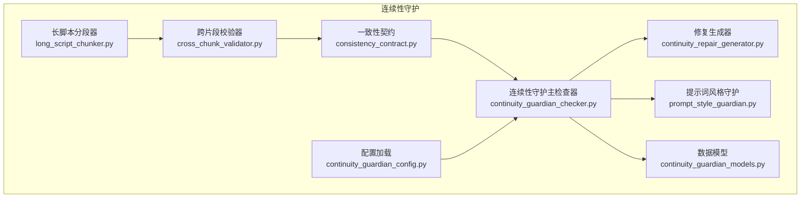
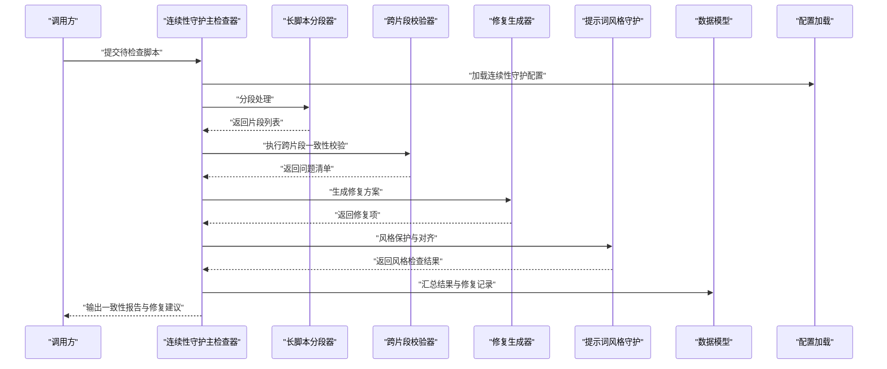
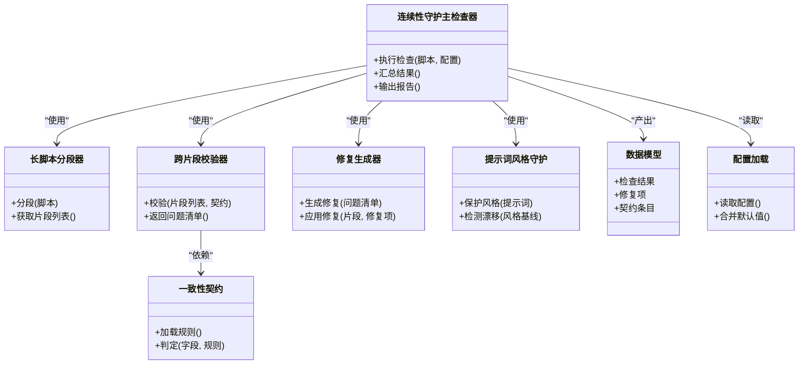

# 连续性守护

<cite>
**本文引用的文件**   
- [continuity_guardian_checker.py](file://src/penshot/neopen/agent/continuity_guardian/continuity_guardian_checker.py)
- [consistency_contract.py](file://src/penshot/neopen/agent/continuity_guardian/consistency_contract.py)
- [continuity_repair_generator.py](file://src/penshot/neopen/agent/continuity_guardian/continuity_repair_generator.py)
- [cross_chunk_validator.py](file://src/penshot/neopen/agent/continuity_guardian/cross_chunk_validator.py)
- [long_script_chunker.py](file://src/penshot/neopen/agent/continuity_guardian/long_script_chunker.py)
- [prompt_style_guardian.py](file://src/penshot/neopen/agent/continuity_guardian/prompt_style_guardian.py)
- [continuity_guardian_models.py](file://src/penshot/neopen/agent/continuity_guardian/continuity_guardian_models.py)
- [continuity_guardian_config.py](file://src/penshot/neopen/config/continuity_guardian_config.py)
- [test_continuity_guardian.py](file://tests/test_continuity_guardian.py)
</cite>

## 目录
1. [简介](#简介)
2. [项目结构](#项目结构)
3. [核心组件](#核心组件)
4. [架构总览](#架构总览)
5. [详细组件分析](#详细组件分析)
6. [依赖关系分析](#依赖关系分析)
7. [性能考量](#性能考量)
8. [故障排查指南](#故障排查指南)
9. [结论](#结论)
10. [附录](#附录)

## 简介
本文件面向“连续性守护”子系统，聚焦跨分镜一致性检查与修复能力。其目标是在长脚本分段处理过程中，保障场景、角色、时间线等关键要素的跨片段一致性，并通过一致性契约约束与提示词风格保护机制，确保输出稳定可控。文档涵盖：
- 跨分镜一致性检查机制（场景连续性、角色一致性、时间线验证）
- 长脚本分段处理策略与边界控制
- 提示词风格保护机制
- 一致性契约的定义与执行流程
- 连续性问题的检测与修复方法
- 实际案例与性能优化建议
- 规则配置与调整方式

## 项目结构
连续性守护子系统位于 agent/continuity_guardian 目录下，围绕“检查—修复—校验”的闭环设计，配合配置与模型定义，形成可插拔、可扩展的一致性保障体系。

图表来源
- [long_script_chunker.py](file://src/penshot/neopen/agent/continuity_guardian/long_script_chunker.py)
- [cross_chunk_validator.py](file://src/penshot/neopen/agent/continuity_guardian/cross_chunk_validator.py)
- [consistency_contract.py](file://src/penshot/neopen/agent/continuity_guardian/consistency_contract.py)
- [continuity_guardian_checker.py](file://src/penshot/neopen/agent/continuity_guardian/continuity_guardian_checker.py)
- [continuity_repair_generator.py](file://src/penshot/neopen/agent/continuity_guardian/continuity_repair_generator.py)
- [prompt_style_guardian.py](file://src/penshot/neopen/agent/continuity_guardian/prompt_style_guardian.py)
- [continuity_guardian_models.py](file://src/penshot/neopen/agent/continuity_guardian/continuity_guardian_models.py)
- [continuity_guardian_config.py](file://src/penshot/neopen/config/continuity_guardian_config.py)

章节来源
- [continuity_guardian_checker.py](file://src/penshot/neopen/agent/continuity_guardian/continuity_guardian_checker.py)
- [consistency_contract.py](file://src/penshot/neopen/agent/continuity_guardian/consistency_contract.py)
- [continuity_repair_generator.py](file://src/penshot/neopen/agent/continuity_guardian/continuity_repair_generator.py)
- [cross_chunk_validator.py](file://src/penshot/neopen/agent/continuity_guardian/cross_chunk_validator.py)
- [long_script_chunker.py](file://src/penshot/neopen/agent/continuity_guardian/long_script_chunker.py)
- [prompt_style_guardian.py](file://src/penshot/neopen/agent/continuity_guardian/prompt_style_guardian.py)
- [continuity_guardian_models.py](file://src/penshot/neopen/agent/continuity_guardian/continuity_guardian_models.py)
- [continuity_guardian_config.py](file://src/penshot/neopen/config/continuity_guardian_config.py)

## 核心组件
- 长脚本分段器：将超长脚本按语义或长度切分为多个片段，为后续跨片段校验提供输入单元。
- 跨片段校验器：在相邻或全局片段间进行一致性比对，识别场景、角色、时间线等维度的不一致。
- 一致性契约：定义一致性检查的规则集合与判定标准，作为检查与修复的依据。
- 连续性守护主检查器：编排分段、校验、修复与风格保护的完整流程，并汇总问题与修复结果。
- 修复生成器：针对发现的问题生成修复建议或自动修复内容，保持上下文连贯。
- 提示词风格守护：对提示词风格进行保护与对齐，避免风格漂移影响一致性。
- 数据模型：统一描述检查结果、修复项、契约条目等数据结构。
- 配置加载：提供连续性守护相关参数的集中管理与默认值。

章节来源
- [long_script_chunker.py](file://src/penshot/neopen/agent/continuity_guardian/long_script_chunker.py)
- [cross_chunk_validator.py](file://src/penshot/neopen/agent/continuity_guardian/cross_chunk_validator.py)
- [consistency_contract.py](file://src/penshot/neopen/agent/continuity_guardian/consistency_contract.py)
- [continuity_guardian_checker.py](file://src/penshot/neopen/agent/continuity_guardian/continuity_guardian_checker.py)
- [continuity_repair_generator.py](file://src/penshot/neopen/agent/continuity_guardian/continuity_repair_generator.py)
- [prompt_style_guardian.py](file://src/penshot/neopen/agent/continuity_guardian/prompt_style_guardian.py)
- [continuity_guardian_models.py](file://src/penshot/neopen/agent/continuity_guardian/continuity_guardian_models.py)
- [continuity_guardian_config.py](file://src/penshot/neopen/config/continuity_guardian_config.py)

## 架构总览
连续性守护采用“分段—校验—契约—修复—风格保护”的流水线式架构，主检查器负责协调各组件，确保长脚本在不同片段间保持一致性。

图表来源
- [continuity_guardian_checker.py](file://src/penshot/neopen/agent/continuity_guardian/continuity_guardian_checker.py)
- [long_script_chunker.py](file://src/penshot/neopen/agent/continuity_guardian/long_script_chunker.py)
- [cross_chunk_validator.py](file://src/penshot/neopen/agent/continuity_guardian/cross_chunk_validator.py)
- [continuity_repair_generator.py](file://src/penshot/neopen/agent/continuity_guardian/continuity_repair_generator.py)
- [prompt_style_guardian.py](file://src/penshot/neopen/agent/continuity_guardian/prompt_style_guardian.py)
- [continuity_guardian_models.py](file://src/penshot/neopen/agent/continuity_guardian/continuity_guardian_models.py)
- [continuity_guardian_config.py](file://src/penshot/neopen/config/continuity_guardian_config.py)

## 详细组件分析

### 长脚本分段器
- 职责：将长脚本按语义边界或固定长度切分为若干片段，保证每个片段具备相对完整的上下文。
- 关键点：
  - 分段阈值与重叠窗口：通过配置控制片段大小与重叠比例，减少边界信息丢失。
  - 语义断点识别：优先依据场景转换、对话切换等自然断点进行分割。
  - 元数据保留：为每个片段附加索引、前后文摘要等元信息，便于后续校验与修复。
- 复杂度与性能：
  - 线性扫描为主，结合启发式规则降低 LLM 调用次数。
  - 可通过缓存片段摘要提升重复处理的效率。

章节来源
- [long_script_chunker.py](file://src/penshot/neopen/agent/continuity_guardian/long_script_chunker.py)
- [continuity_guardian_config.py](file://src/penshot/neopen/config/continuity_guardian_config.py)

### 跨片段校验器
- 职责：在相邻或全局片段之间进行一致性比对，识别以下维度问题：
  - 场景连续性：场景元素（地点、氛围、道具）是否前后一致。
  - 角色一致性：角色名称、属性、行为逻辑是否前后一致。
  - 时间线验证：事件顺序、时长标注、因果链是否合理。
- 关键点：
  - 对比策略：基于契约定义的字段与规则进行逐项比对。
  - 相似度与阈值：对文本相似性与语义一致性设置阈值，避免误报。
  - 问题聚合：合并同类问题，减少冗余报告。
- 复杂度与性能：
  - 主要开销在片段间的特征提取与比对，可通过并行化与增量计算优化。

章节来源
- [cross_chunk_validator.py](file://src/penshot/neopen/agent/continuity_guardian/cross_chunk_validator.py)
- [consistency_contract.py](file://src/penshot/neopen/agent/continuity_guardian/consistency_contract.py)

### 一致性契约
- 职责：定义一致性检查的规则集合与判定标准，包括：
  - 字段规范：场景、角色、时间线等关键字段的类型与取值范围。
  - 规则约束：如“同一角色在不同片段中属性不可冲突”、“时间线不可回退”等。
  - 严重级别：区分警告、错误、致命等不同级别，指导修复优先级。
- 关键点：
  - 可配置化：支持通过配置文件动态加载与覆盖默认规则。
  - 版本兼容：契约变更需考虑向后兼容与迁移策略。
- 复杂度与性能：
  - 规则解析与匹配为轻量操作，整体开销受规则数量与片段规模影响。

章节来源
- [consistency_contract.py](file://src/penshot/neopen/agent/continuity_guardian/consistency_contract.py)
- [continuity_guardian_config.py](file://src/penshot/neopen/config/continuity_guardian_config.py)

### 连续性守护主检查器
- 职责：编排分段、校验、修复与风格保护的完整流程，汇总问题与修复结果，输出一致性报告。
- 关键点：
  - 流程编排：按顺序调用分段器、校验器、修复器与风格守护。
  - 异常处理：捕获并记录各阶段异常，保证流程健壮性。
  - 结果聚合：将问题清单、修复项与风格检查结果整合为统一输出。
- 复杂度与性能：
  - 整体耗时取决于分段数、校验规则数量与修复生成策略；可通过并发与缓存优化。

章节来源
- [continuity_guardian_checker.py](file://src/penshot/neopen/agent/continuity_guardian/continuity_guardian_checker.py)
- [continuity_guardian_models.py](file://src/penshot/neopen/agent/continuity_guardian/continuity_guardian_models.py)

### 修复生成器
- 职责：针对发现的问题生成修复建议或自动修复内容，保持上下文连贯。
- 关键点：
  - 修复策略：基于规则替换、上下文补全、风格对齐等方式生成修复项。
  - 可逆性：修复过程应保留原始信息与修改痕迹，便于回滚与审计。
  - 质量评估：对修复结果进行二次校验，防止引入新的不一致。
- 复杂度与性能：
  - 修复生成可能涉及 LLM 调用，需结合缓存与重试策略控制成本与时延。

章节来源
- [continuity_repair_generator.py](file://src/penshot/neopen/agent/continuity_guardian/continuity_repair_generator.py)
- [continuity_guardian_models.py](file://src/penshot/neopen/agent/continuity_guardian/continuity_guardian_models.py)

### 提示词风格守护
- 职责：对提示词风格进行保护与对齐，避免风格漂移影响一致性。
- 关键点：
  - 风格基线：维护风格模板与关键词库，用于比对与纠偏。
  - 漂移检测：识别风格偏离并触发修复或告警。
  - 最小改动：在保持原意的前提下进行风格微调，避免过度改写。
- 复杂度与性能：
  - 风格比对通常为轻量操作，但可能依赖外部模型或知识库，需关注延迟与可用性。

章节来源
- [prompt_style_guardian.py](file://src/penshot/neopen/agent/continuity_guardian/prompt_style_guardian.py)
- [continuity_guardian_config.py](file://src/penshot/neopen/config/continuity_guardian_config.py)

### 数据模型
- 职责：统一描述检查结果、修复项、契约条目等数据结构，确保各组件间的数据一致性。
- 关键点：
  - 结构化输出：明确字段类型、必填项与枚举值。
  - 扩展性：预留扩展字段以支持未来新增的检查维度。
  - 序列化：支持 JSON/YAML 等格式的输出与导入。

章节来源
- [continuity_guardian_models.py](file://src/penshot/neopen/agent/continuity_guardian/continuity_guardian_models.py)

## 依赖关系分析
连续性守护内部组件之间存在明确的依赖关系，主检查器作为编排中心，依赖其他组件完成具体任务。

图表来源
- [continuity_guardian_checker.py](file://src/penshot/neopen/agent/continuity_guardian/continuity_guardian_checker.py)
- [long_script_chunker.py](file://src/penshot/neopen/agent/continuity_guardian/long_script_chunker.py)
- [cross_chunk_validator.py](file://src/penshot/neopen/agent/continuity_guardian/cross_chunk_validator.py)
- [consistency_contract.py](file://src/penshot/neopen/agent/continuity_guardian/consistency_contract.py)
- [continuity_repair_generator.py](file://src/penshot/neopen/agent/continuity_guardian/continuity_repair_generator.py)
- [prompt_style_guardian.py](file://src/penshot/neopen/agent/continuity_guardian/prompt_style_guardian.py)
- [continuity_guardian_models.py](file://src/penshot/neopen/agent/continuity_guardian/continuity_guardian_models.py)
- [continuity_guardian_config.py](file://src/penshot/neopen/config/continuity_guardian_config.py)

章节来源
- [continuity_guardian_checker.py](file://src/penshot/neopen/agent/continuity_guardian/continuity_guardian_checker.py)
- [continuity_guardian_models.py](file://src/penshot/neopen/agent/continuity_guardian/continuity_guardian_models.py)

## 性能考量
- 分段策略优化：
  - 合理设置片段大小与重叠比例，平衡上下文完整性与计算开销。
  - 对高频片段进行摘要缓存，减少重复处理。
- 校验规则优化：
  - 优先执行高命中率的快速规则，再执行复杂语义规则。
  - 对相似度比对使用近似算法与阈值裁剪，降低计算量。
- 修复生成优化：
  - 对修复模板进行预编译与复用，减少运行时开销。
  - 结合缓存与幂等设计，避免重复修复。
- 并发与资源管理：
  - 对独立片段进行并行校验与修复，注意锁与资源竞争。
  - 限制并发度以避免资源耗尽。

[本节为通用性能讨论，不直接分析具体文件]

## 故障排查指南
- 常见问题定位：
  - 分段失败：检查分段阈值与语义断点识别逻辑，确认输入脚本格式。
  - 校验误报：调整相似度阈值与规则权重，复核契约定义。
  - 修复无效：检查修复策略与上下文依赖，确认修复项的可逆性。
  - 风格漂移：核对风格基线与关键词库，确认风格守护生效。
- 日志与诊断：
  - 启用详细日志，记录分段、校验、修复的关键步骤与中间状态。
  - 输出一致性报告与修复差异，便于人工复核。
- 回归测试：
  - 使用单元测试与端到端用例验证修复效果与性能指标。

章节来源
- [test_continuity_guardian.py](file://tests/test_continuity_guardian.py)

## 结论
连续性守护通过分段、校验、契约、修复与风格保护的协同工作，有效提升了长脚本在多片段场景下的一致性与稳定性。合理的配置与优化策略可显著改善性能与准确性。建议在生产环境中结合业务需求定制契约与规则，并持续监控与迭代。

[本节为总结性内容，不直接分析具体文件]

## 附录
- 配置与调整建议：
  - 分段参数：根据脚本长度与复杂度调整片段大小与重叠比例。
  - 校验阈值：依据业务容忍度设置相似度与严重级别阈值。
  - 修复策略：选择保守或激进的修复模式，权衡一致性与改动幅度。
  - 风格基线：定期更新风格模板与关键词库，保持风格一致性。
- 最佳实践：
  - 小步快跑：先在小样本上验证规则与修复策略，再逐步推广。
  - 灰度发布：在新旧版本并行运行，观察一致性指标变化。
  - 持续改进：收集反馈与案例，完善契约与规则库。

[本节为概念性内容，不直接分析具体文件]