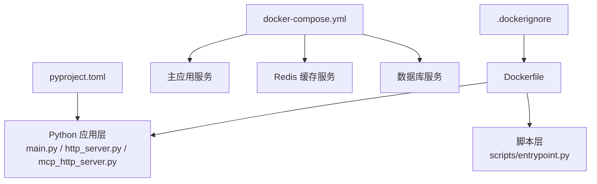
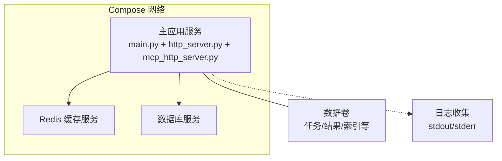
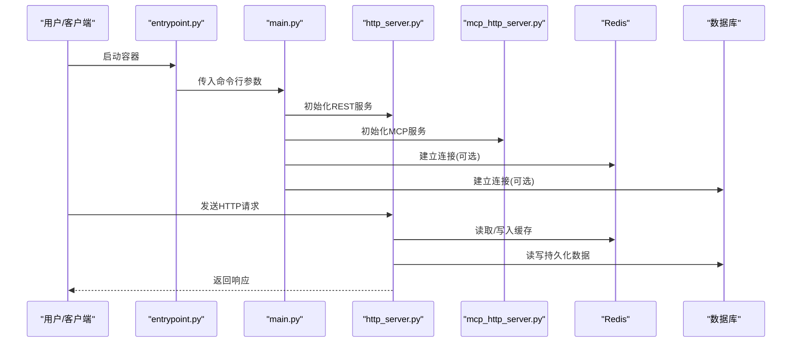
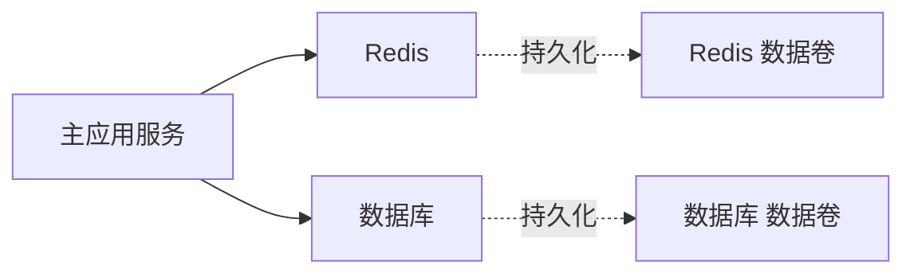

# Docker容器化部署

<cite>
**本文引用的文件**   
- [Dockerfile](file://Dockerfile)
- [docker-compose.yml](file://docker-compose.yml)
- [.dockerignore](file://.dockerignore)
- [main.py](file://main.py)
- [src/penshot/http_server.py](file://src/penshot/http_server.py)
- [src/penshot/mcp_http_server.py](file://src/penshot/mcp_http_server.py)
- [scripts/entrypoint.py](file://scripts/entrypoint.py)
- [pyproject.toml](file://pyproject.toml)
- [src/penshot/config/settings.yaml](file://src/penshot/config/settings.yaml)
- [src/penshot/config/env/production.yaml](file://src/penshot/config/env/production.yaml)
- [src/penshot/utils/redis_utils.py](file://src/penshot/utils/redis_utils.py)
</cite>

## 目录
1. [简介](#简介)
2. [项目结构](#项目结构)
3. [核心组件](#核心组件)
4. [架构总览](#架构总览)
5. [详细组件分析](#详细组件分析)
6. [依赖关系分析](#依赖关系分析)
7. [性能与镜像优化](#性能与镜像优化)
8. [故障排除指南](#故障排除指南)
9. [结论](#结论)
10. [附录](#附录)

## 简介
本指南面向Video Shot Agent的Docker容器化部署，覆盖镜像构建（含多阶段构建与体积优化）、服务编排（主应用、Redis缓存、数据库）、网络与数据卷配置、环境变量注入、健康检查、日志收集、资源限制、监控与排障，以及生产环境最佳实践。文档中的实现细节均基于仓库现有文件进行说明，并提供可追溯的文件来源。

## 项目结构
仓库已包含容器化所需的关键文件：
- 镜像构建定义：Dockerfile、.dockerignore
- 服务编排：docker-compose.yml
- 应用入口与HTTP/MCP服务：main.py、src/penshot/http_server.py、src/penshot/mcp_http_server.py
- 启动脚本：scripts/entrypoint.py
- 依赖声明：pyproject.toml
- 运行时配置与环境配置：src/penshot/config/settings.yaml、src/penshot/config/env/production.yaml
- Redis工具：src/penshot/utils/redis_utils.py

图表来源
- [Dockerfile:1-200](file://Dockerfile#L1-L200)
- [docker-compose.yml:1-200](file://docker-compose.yml#L1-L200)
- [.dockerignore:1-200](file://.dockerignore#L1-L200)
- [main.py:1-200](file://main.py#L1-L200)
- [src/penshot/http_server.py:1-200](file://src/penshot/http_server.py#L1-L200)
- [src/penshot/mcp_http_server.py:1-200](file://src/penshot/mcp_http_server.py#L1-L200)
- [scripts/entrypoint.py:1-200](file://scripts/entrypoint.py#L1-L200)
- [pyproject.toml:1-200](file://pyproject.toml#L1-L200)

章节来源
- [Dockerfile:1-200](file://Dockerfile#L1-L200)
- [docker-compose.yml:1-200](file://docker-compose.yml#L1-L200)
- [.dockerignore:1-200](file://.dockerignore#L1-L200)
- [main.py:1-200](file://main.py#L1-L200)
- [src/penshot/http_server.py:1-200](file://src/penshot/http_server.py#L1-L200)
- [src/penshot/mcp_http_server.py:1-200](file://src/penshot/mcp_http_server.py#L1-L200)
- [scripts/entrypoint.py:1-200](file://scripts/entrypoint.py#L1-L200)
- [pyproject.toml:1-200](file://pyproject.toml#L1-L200)

## 核心组件
- 镜像构建器（Dockerfile）
  - 负责安装系统依赖、Python依赖、拷贝源码、设置工作目录与入口点。
  - 建议采用多阶段构建以分离构建期与运行期依赖，显著减小最终镜像体积。
- 服务编排器（docker-compose.yml）
  - 定义主应用服务、Redis缓存服务、数据库服务及其网络、卷、环境变量、健康检查与资源限制。
- 应用进程
  - main.py作为顶层入口，http_server.py提供REST API，mcp_http_server.py提供MCP HTTP接口。
  - scripts/entrypoint.py用于统一启动逻辑与参数传递。
- 配置与环境
  - settings.yaml为通用配置，production.yaml为生产环境覆盖配置。
  - 通过环境变量注入敏感信息与运行时开关。
- 外部依赖
  - Redis用于缓存与会话状态；数据库用于持久化任务与结果。

章节来源
- [Dockerfile:1-200](file://Dockerfile#L1-L200)
- [docker-compose.yml:1-200](file://docker-compose.yml#L1-L200)
- [main.py:1-200](file://main.py#L1-L200)
- [src/penshot/http_server.py:1-200](file://src/penshot/http_server.py#L1-L200)
- [src/penshot/mcp_http_server.py:1-200](file://src/penshot/mcp_http_server.py#L1-L200)
- [scripts/entrypoint.py:1-200](file://scripts/entrypoint.py#L1-L200)
- [src/penshot/config/settings.yaml:1-200](file://src/penshot/config/settings.yaml#L1-L200)
- [src/penshot/config/env/production.yaml:1-200](file://src/penshot/config/env/production.yaml#L1-L200)

## 架构总览
下图展示了容器化后的整体架构：主应用服务通过内部网络访问Redis与数据库，日志输出到标准输出以便集中采集，数据卷用于持久化关键数据。

图表来源
- [docker-compose.yml:1-200](file://docker-compose.yml#L1-L200)
- [src/penshot/http_server.py:1-200](file://src/penshot/http_server.py#L1-L200)
- [src/penshot/mcp_http_server.py:1-200](file://src/penshot/mcp_http_server.py#L1-L200)
- [src/penshot/utils/redis_utils.py:1-200](file://src/penshot/utils/redis_utils.py#L1-L200)

## 详细组件分析

### 镜像构建与多阶段优化
- 构建阶段
  - 使用轻量基础镜像（如Python slim或alpine变体）。
  - 安装系统级依赖（例如视频处理所需的库），并仅保留构建期需要的包。
  - 复制依赖声明文件（pyproject.toml）并预安装依赖，利用Docker层缓存加速重复构建。
- 运行阶段
  - 仅拷贝必要的应用代码与配置文件。
  - 创建非root用户以提升安全性。
  - 设置工作目录与入口点（entrypoint），将命令参数透传给主进程。
- 体积优化策略
  - .dockerignore排除测试、缓存、虚拟环境与大型临时文件。
  - 合并RUN指令减少层数。
  - 清理包管理器缓存与构建中间产物。
  - 使用多阶段构建分离构建与运行环境。

章节来源
- [Dockerfile:1-200](file://Dockerfile#L1-L200)
- [.dockerignore:1-200](file://.dockerignore#L1-L200)
- [pyproject.toml:1-200](file://pyproject.toml#L1-L200)

### 服务编排与健康检查
- 主应用服务
  - 暴露HTTP端口（REST与MCP），挂载数据卷，注入环境变量，设置资源限制。
  - 健康检查：对HTTP端点进行周期性探测，失败则重启或标记不健康。
- Redis服务
  - 使用官方镜像，挂载持久化卷，设置密码与内存上限。
  - 健康检查：通过redis-cli ping检测可用性。
- 数据库服务
  - 根据所选数据库类型（如PostgreSQL/MySQL）配置镜像、卷、环境变量与初始化脚本。
  - 健康检查：使用数据库客户端命令验证连接。
- 网络与卷
  - 所有服务加入同一自定义网络，避免使用host网络。
  - 数据卷命名管理，便于备份与迁移。

章节来源
- [docker-compose.yml:1-200](file://docker-compose.yml#L1-L200)

### 环境变量与配置加载
- 环境变量
  - 通过docker-compose.yml的environment字段或.env文件注入。
  - 常见变量包括：数据库连接串、Redis地址与凭据、API密钥、日志级别、模型后端URL等。
- 配置加载顺序
  - 默认配置来自settings.yaml。
  - 生产覆盖配置来自env/production.yaml。
  - 环境变量优先级高于YAML配置，支持动态切换。
- 安全建议
  - 敏感信息通过Secrets或外部密钥管理服务注入。
  - 避免在镜像中硬编码任何凭据。

章节来源
- [docker-compose.yml:1-200](file://docker-compose.yml#L1-L200)
- [src/penshot/config/settings.yaml:1-200](file://src/penshot/config/settings.yaml#L1-L200)
- [src/penshot/config/env/production.yaml:1-200](file://src/penshot/config/env/production.yaml#L1-L200)

### 启动流程与进程模型
- 入口点
  - entrypoint.py作为容器启动入口，解析参数并调用主进程。
- 主进程
  - main.py初始化应用上下文，注册路由与处理器。
  - http_server.py提供REST API，mcp_http_server.py提供MCP HTTP接口。
- 并发与线程池
  - 根据CPU核数与工作负载调整worker数量与线程池大小。
- 优雅关闭
  - 捕获SIGTERM/SIGINT，完成正在处理的请求后退出。

图表来源
- [scripts/entrypoint.py:1-200](file://scripts/entrypoint.py#L1-L200)
- [main.py:1-200](file://main.py#L1-L200)
- [src/penshot/http_server.py:1-200](file://src/penshot/http_server.py#L1-L200)
- [src/penshot/mcp_http_server.py:1-200](file://src/penshot/mcp_http_server.py#L1-L200)
- [src/penshot/utils/redis_utils.py:1-200](file://src/penshot/utils/redis_utils.py#L1-L200)

章节来源
- [scripts/entrypoint.py:1-200](file://scripts/entrypoint.py#L1-L200)
- [main.py:1-200](file://main.py#L1-L200)
- [src/penshot/http_server.py:1-200](file://src/penshot/http_server.py#L1-L200)
- [src/penshot/mcp_http_server.py:1-200](file://src/penshot/mcp_http_server.py#L1-L200)
- [src/penshot/utils/redis_utils.py:1-200](file://src/penshot/utils/redis_utils.py#L1-L200)

### 数据卷与持久化
- 主应用数据卷
  - 挂载任务输入/输出、中间结果、向量索引等目录，确保容器重建后数据不丢失。
- Redis持久化
  - 启用AOF/RDB持久化，挂载数据目录。
- 数据库持久化
  - 挂载数据库数据目录，配合备份策略定期导出。

章节来源
- [docker-compose.yml:1-200](file://docker-compose.yml#L1-L200)

### 日志收集与观测
- 日志输出
  - 应用统一输出至stdout/stderr，便于Docker日志驱动收集。
- 日志轮转
  - 结合宿主机或Kubernetes日志收集器进行轮转与归档。
- 结构化日志
  - 建议输出JSON格式，便于检索与分析。

章节来源
- [docker-compose.yml:1-200](file://docker-compose.yml#L1-L200)

### 资源限制与弹性伸缩
- CPU与内存限制
  - 为每个服务设置合理的limits与reserves，防止资源争用。
- 水平扩展
  - 通过副本数或编排平台（如Kubernetes）进行横向扩展。
- 背压与限流
  - 在网关或应用层实现请求限流与队列缓冲。

章节来源
- [docker-compose.yml:1-200](file://docker-compose.yml#L1-L200)

## 依赖关系分析
- 直接依赖
  - 主应用依赖Redis与数据库，通过compose网络访问。
- 间接依赖
  - 日志收集与监控系统通常依赖宿主机的日志驱动与指标导出。
- 潜在循环依赖
  - 当前架构无循环依赖风险。

图表来源
- [docker-compose.yml:1-200](file://docker-compose.yml#L1-L200)

章节来源
- [docker-compose.yml:1-200](file://docker-compose.yml#L1-L200)

## 性能与镜像优化
- 多阶段构建
  - 构建阶段安装编译工具与开发依赖，运行阶段仅保留最小运行时。
- 依赖缓存
  - 先复制依赖声明文件并安装依赖，再复制源码，充分利用层缓存。
- 精简基础镜像
  - 选择slim或alpine变体，移除不必要的系统包。
- 并行构建
  - 使用构建缓存与并行下载提升CI/CD速度。
- 安全扫描
  - 在镜像构建后执行漏洞扫描，及时修复高危问题。

章节来源
- [Dockerfile:1-200](file://Dockerfile#L1-L200)
- [.dockerignore:1-200](file://.dockerignore#L1-L200)
- [pyproject.toml:1-200](file://pyproject.toml#L1-L200)

## 故障排除指南
- 容器无法启动
  - 检查入口点与命令参数是否正确。
  - 查看容器日志定位异常堆栈。
- 健康检查失败
  - 确认HTTP端点可达、依赖服务可用、权限正确。
- Redis连接失败
  - 核对地址、端口、密码与网络连通性。
- 数据库连接失败
  - 核对连接串、用户名/密码、数据库名与初始化状态。
- 磁盘空间不足
  - 清理未使用的镜像与卷，检查日志轮转是否生效。
- 性能瓶颈
  - 调整worker数量、线程池大小与资源限制。
  - 分析热点路径与缓存命中率。

章节来源
- [docker-compose.yml:1-200](file://docker-compose.yml#L1-L200)
- [src/penshot/utils/redis_utils.py:1-200](file://src/penshot/utils/redis_utils.py#L1-L200)

## 结论
通过多阶段构建与严格的依赖裁剪，可获得更小、更安全的运行镜像；借助docker-compose进行服务编排，可实现本地与生产一致的运行环境；结合健康检查、日志收集与资源限制，能够显著提升稳定性与可观测性。生产环境建议引入编排平台与监控告警体系，形成完整的运维闭环。

## 附录
- 常用命令
  - 构建镜像：参考Dockerfile与构建上下文。
  - 启动服务：使用docker-compose up。
  - 查看日志：docker-compose logs。
  - 进入容器：docker-compose exec <service> bash。
- 最佳实践清单
  - 使用只读根文件系统与最小权限原则。
  - 将配置与凭据外置，避免打包进镜像。
  - 为每个服务设置健康检查与资源限制。
  - 定期更新基础镜像与依赖，执行安全扫描。
  - 对关键数据进行备份与恢复演练。