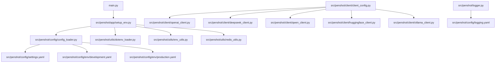
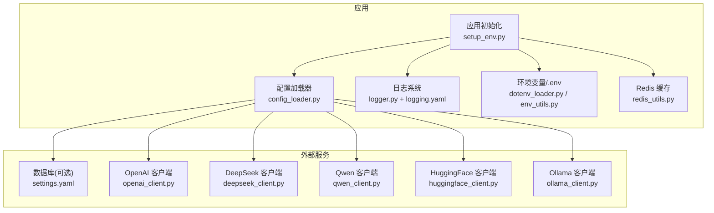
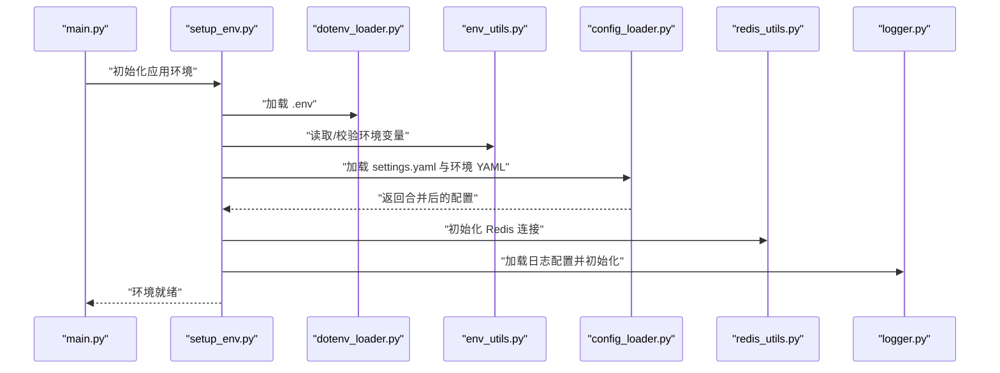
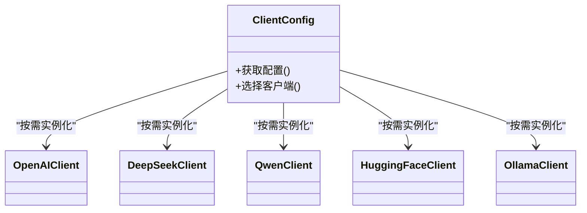
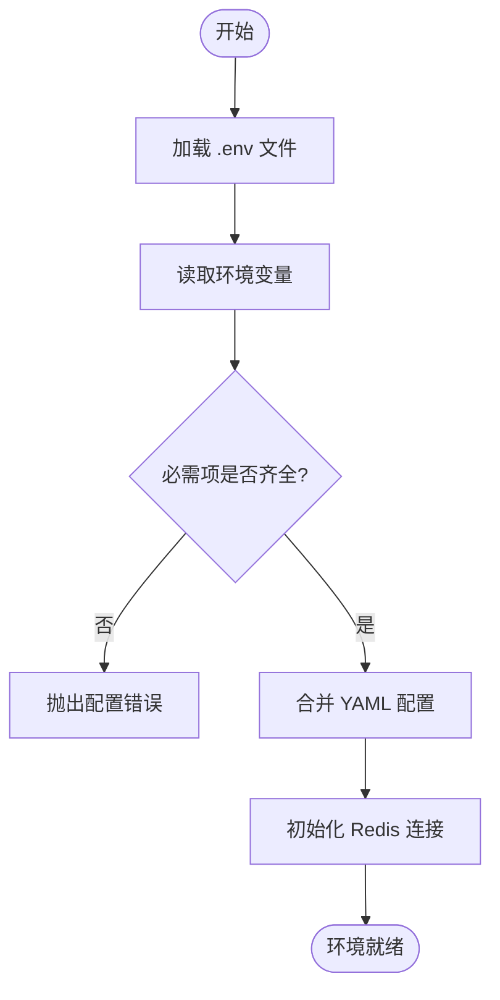
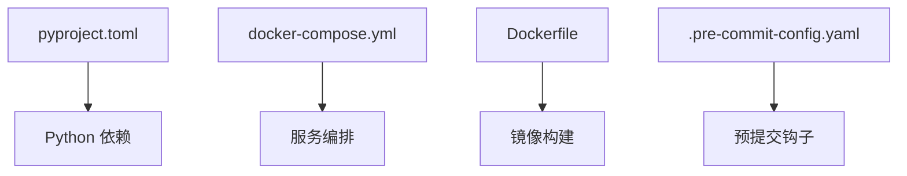

# 本地开发环境

<cite>
**本文引用的文件**   
- [pyproject.toml](file://pyproject.toml)
- [main.py](file://main.py)
- [src/penshot/app/setup_env.py](file://src/penshot/app/setup_env.py)
- [src/penshot/config/config_loader.py](file://src/penshot/config/config_loader.py)
- [src/penshot/config/settings.yaml](file://src/penshot/config/settings.yaml)
- [src/penshot/config/env/development.yaml](file://src/penshot/config/env/development.yaml)
- [src/penshot/config/env/production.yaml](file://src/penshot/config/env/production.yaml)
- [src/penshot/utils/dotenv_loader.py](file://src/penshot/utils/dotenv_loader.py)
- [src/penshot/utils/env_utils.py](file://src/penshot/utils/env_utils.py)
- [src/penshot/utils/redis_utils.py](file://src/penshot/utils/redis_utils.py)
- [src/penshot/client/client_config.py](file://src/penshot/client/client_config.py)
- [src/penshot/client/openai_client.py](file://src/penshot/client/openai_client.py)
- [src/penshot/client/deepseek_client.py](file://src/penshot/client/deepseek_client.py)
- [src/penshot/client/qwen_client.py](file://src/penshot/client/qwen_client.py)
- [src/penshot/client/huggingface_client.py](file://src/penshot/client/huggingface_client.py)
- [src/penshot/client/ollama_client.py](file://src/penshot/client/ollama_client.py)
- [src/penshot/logger.py](file://src/penshot/logger.py)
- [src/penshot/config/logging.yaml](file://src/penshot/config/logging.yaml)
- [docker-compose.yml](file://docker-compose.yml)
- [Dockerfile](file://Dockerfile)
- [.pre-commit-config.yaml](file://.pre-commit-config.yaml)
- [scripts/cli.py](file://scripts/cli.py)
- [examples/web_app.py](file://examples/web_app.py)
</cite>

## 目录
1. [简介](#简介)
2. [项目结构](#项目结构)
3. [核心组件](#核心组件)
4. [架构总览](#架构总览)
5. [详细组件分析](#详细组件分析)
6. [依赖分析](#依赖分析)
7. [性能考虑](#性能考虑)
8. [故障排查指南](#故障排查指南)
9. [结论](#结论)
10. [附录](#附录)

## 简介
本指南面向希望在本地搭建 Video Shot Agent 开发环境的开发者，覆盖 Python 环境要求、依赖安装、项目克隆与初始化、环境变量配置（LLM API 密钥、数据库连接、Redis 缓存）、IDE 与调试器设置、代码格式化规则、开发服务器启动与热重载、日志查看方法，以及常见问题与调试技巧。文档内容基于仓库中的配置文件与源码路径进行说明，便于快速定位实现细节。

## 项目结构
本项目采用分层与模块化组织方式：
- 顶层入口与打包配置：main.py、pyproject.toml、Dockerfile、docker-compose.yml
- 应用层：src/penshot/app/*（应用初始化与环境加载）
- 配置层：src/penshot/config/*（YAML 配置、日志配置、环境配置）
- 客户端层：src/penshot/client/*（多 LLM 客户端实现与统一配置）
- 工具层：src/penshot/utils/*（dotenv、环境变量、Redis、日志等）
- 示例与脚本：examples/*、scripts/*

图表来源
- [main.py:1-20](file://main.py#L1-L20)
- [src/penshot/app/setup_env.py:1-60](file://src/penshot/app/setup_env.py#L1-L60)
- [src/penshot/config/config_loader.py:1-80](file://src/penshot/config/config_loader.py#L1-L80)
- [src/penshot/config/settings.yaml:1-40](file://src/penshot/config/settings.yaml#L1-L40)
- [src/penshot/config/env/development.yaml:1-40](file://src/penshot/config/env/development.yaml#L1-L40)
- [src/penshot/config/env/production.yaml:1-40](file://src/penshot/config/env/production.yaml#L1-L40)
- [src/penshot/utils/dotenv_loader.py:1-40](file://src/penshot/utils/dotenv_loader.py#L1-L40)
- [src/penshot/utils/env_utils.py:1-40](file://src/pensshot/utils/env_utils.py#L1-L40)
- [src/penshot/utils/redis_utils.py:1-40](file://src/penshot/utils/redis_utils.py#L1-L40)
- [src/penshot/client/client_config.py:1-60](file://src/penshot/client/client_config.py#L1-L60)
- [src/penshot/client/openai_client.py:1-60](file://src/penshot/client/openai_client.py#L1-L60)
- [src/penshot/client/deepseek_client.py:1-60](file://src/penshot/client/deepseek_client.py#L1-L60)
- [src/penshot/client/qwen_client.py:1-60](file://src/penshot/client/qwen_client.py#L1-L60)
- [src/penshot/client/huggingface_client.py:1-60](file://src/penshot/client/huggingface_client.py#L1-L60)
- [src/penshot/client/ollama_client.py:1-60](file://src/penshot/client/ollama_client.py#L1-L60)
- [src/penshot/logger.py:1-40](file://src/penshot/logger.py#L1-L40)
- [src/penshot/config/logging.yaml:1-40](file://src/penshot/config/logging.yaml#L1-L40)

章节来源
- [pyproject.toml:1-60](file://pyproject.toml#L1-L60)
- [main.py:1-20](file://main.py#L1-L20)

## 核心组件
- 应用初始化与环境加载：负责加载 .env、合并 YAML 配置、初始化 Redis 与日志系统。
- 配置加载器：按优先级合并 settings.yaml 与 env/*.yaml，并暴露结构化配置对象。
- LLM 客户端配置与工厂：统一管理各 LLM 提供商的凭据与连接参数。
- 日志系统：通过 logging.yaml 控制输出级别与格式，支持控制台与文件输出。
- 环境变量与密钥管理：从 .env 与系统环境变量注入敏感信息。

章节来源
- [src/penshot/app/setup_env.py:1-60](file://src/penshot/app/setup_env.py#L1-L60)
- [src/penshot/config/config_loader.py:1-80](file://src/penshot/config/config_loader.py#L1-L80)
- [src/penshot/client/client_config.py:1-60](file://src/penshot/client/client_config.py#L1-L60)
- [src/penshot/logger.py:1-40](file://src/penshot/logger.py#L1-L40)
- [src/penshot/utils/dotenv_loader.py:1-40](file://src/penshot/utils/dotenv_loader.py#L1-L40)
- [src/penshot/utils/env_utils.py:1-40](file://src/pensshot/utils/env_utils.py#L1-L40)
- [src/penshot/utils/redis_utils.py:1-40](file://src/penshot/utils/redis_utils.py#L1-L40)

## 架构总览
下图展示了本地开发时关键模块的交互关系：入口程序加载环境与配置，配置加载器读取 YAML 与环境变量，Redis 用于缓存，日志系统记录运行信息，LLM 客户端根据配置选择具体服务。

图表来源
- [src/penshot/app/setup_env.py:1-60](file://src/penshot/app/setup_env.py#L1-L60)
- [src/penshot/config/config_loader.py:1-80](file://src/penshot/config/config_loader.py#L1-L80)
- [src/penshot/config/settings.yaml:1-40](file://src/penshot/config/settings.yaml#L1-L40)
- [src/penshot/utils/dotenv_loader.py:1-40](file://src/penshot/utils/dotenv_loader.py#L1-L40)
- [src/penshot/utils/env_utils.py:1-40](file://src/pensshot/utils/env_utils.py#L1-L40)
- [src/penshot/utils/redis_utils.py:1-40](file://src/penshot/utils/redis_utils.py#L1-L40)
- [src/penshot/logger.py:1-40](file://src/penshot/logger.py#L1-L40)
- [src/penshot/config/logging.yaml:1-40](file://src/penshot/config/logging.yaml#L1-L40)
- [src/penshot/client/client_config.py:1-60](file://src/penshot/client/client_config.py#L1-L60)
- [src/penshot/client/openai_client.py:1-60](file://src/penshot/client/openai_client.py#L1-L60)
- [src/penshot/client/deepseek_client.py:1-60](file://src/penshot/client/deepseek_client.py#L1-L60)
- [src/penshot/client/qwen_client.py:1-60](file://src/penshot/client/qwen_client.py#L1-L60)
- [src/penshot/client/huggingface_client.py:1-60](file://src/penshot/client/huggingface_client.py#L1-L60)
- [src/penshot/client/ollama_client.py:1-60](file://src/penshot/client/ollama_client.py#L1-L60)

## 详细组件分析

### 环境加载与配置合并流程
- 入口 main.py 调用应用初始化，触发 setup_env.py 的环境加载逻辑。
- dotenv_loader.py 加载 .env 文件；env_utils.py 提供环境变量读取与校验。
- config_loader.py 读取 settings.yaml 与当前环境 YAML（development.yaml 或 production.yaml），合并为最终配置。
- redis_utils.py 根据配置初始化 Redis 连接，供缓存使用。
- logger.py 加载 logging.yaml，完成日志系统初始化。

图表来源
- [main.py:1-20](file://main.py#L1-L20)
- [src/penshot/app/setup_env.py:1-60](file://src/penshot/app/setup_env.py#L1-L60)
- [src/penshot/utils/dotenv_loader.py:1-40](file://src/penshot/utils/dotenv_loader.py#L1-L40)
- [src/penshot/utils/env_utils.py:1-40](file://src/pensshot/utils/env_utils.py#L1-L40)
- [src/penshot/config/config_loader.py:1-80](file://src/penshot/config/config_loader.py#L1-L80)
- [src/penshot/utils/redis_utils.py:1-40](file://src/penshot/utils/redis_utils.py#L1-L40)
- [src/penshot/logger.py:1-40](file://src/penshot/logger.py#L1-L40)
- [src/penshot/config/logging.yaml:1-40](file://src/penshot/config/logging.yaml#L1-L40)

章节来源
- [src/penshot/app/setup_env.py:1-60](file://src/penshot/app/setup_env.py#L1-L60)
- [src/penshot/config/config_loader.py:1-80](file://src/penshot/config/config_loader.py#L1-L80)
- [src/penshot/utils/dotenv_loader.py:1-40](file://src/penshot/utils/dotenv_loader.py#L1-L40)
- [src/penshot/utils/env_utils.py:1-40](file://src/pensshot/utils/env_utils.py#L1-L40)
- [src/penshot/utils/redis_utils.py:1-40](file://src/penshot/utils/redis_utils.py#L1-L40)
- [src/penshot/logger.py:1-40](file://src/penshot/logger.py#L1-L40)
- [src/penshot/config/logging.yaml:1-40](file://src/penshot/config/logging.yaml#L1-L40)

### LLM 客户端配置与选择
- client_config.py 提供统一的客户端配置模型与选择逻辑。
- 各客户端实现（openai_client.py、deepseek_client.py、qwen_client.py、huggingface_client.py、ollama_client.py）依据配置创建连接。
- 建议在 .env 中设置对应服务的 API Key 与基础 URL（如需要）。

图表来源
- [src/penshot/client/client_config.py:1-60](file://src/penshot/client/client_config.py#L1-L60)
- [src/penshot/client/openai_client.py:1-60](file://src/penshot/client/openai_client.py#L1-L60)
- [src/penshot/client/deepseek_client.py:1-60](file://src/penshot/client/deepseek_client.py#L1-L60)
- [src/penshot/client/qwen_client.py:1-60](file://src/penshot/client/qwen_client.py#L1-L60)
- [src/penshot/client/huggingface_client.py:1-60](file://src/penshot/client/huggingface_client.py#L1-L60)
- [src/penshot/client/ollama_client.py:1-60](file://src/penshot/client/ollama_client.py#L1-L60)

章节来源
- [src/penshot/client/client_config.py:1-60](file://src/penshot/client/client_config.py#L1-L60)
- [src/penshot/client/openai_client.py:1-60](file://src/penshot/client/openai_client.py#L1-L60)
- [src/penshot/client/deepseek_client.py:1-60](file://src/penshot/client/deepseek_client.py#L1-L60)
- [src/penshot/client/qwen_client.py:1-60](file://src/penshot/client/qwen_client.py#L1-L60)
- [src/penshot/client/huggingface_client.py:1-60](file://src/penshot/client/huggingface_client.py#L1-L60)
- [src/penshot/client/ollama_client.py:1-60](file://src/penshot/client/ollama_client.py#L1-L60)

### 环境变量与密钥管理
- .env 文件由 dotenv_loader.py 加载，env_utils.py 提供读取与校验能力。
- 建议将 LLM API Key、数据库连接串、Redis 地址等敏感信息放入 .env。
- settings.yaml 与 env/*.yaml 可存放非敏感配置，避免泄露风险。

图表来源
- [src/penshot/utils/dotenv_loader.py:1-40](file://src/penshot/utils/dotenv_loader.py#L1-L40)
- [src/penshot/utils/env_utils.py:1-40](file://src/pensshot/utils/env_utils.py#L1-L40)
- [src/penshot/config/config_loader.py:1-80](file://src/penshot/config/config_loader.py#L1-L80)
- [src/penshot/utils/redis_utils.py:1-40](file://src/penshot/utils/redis_utils.py#L1-L40)

章节来源
- [src/penshot/utils/dotenv_loader.py:1-40](file://src/penshot/utils/dotenv_loader.py#L1-L40)
- [src/penshot/utils/env_utils.py:1-40](file://src/pensshot/utils/env_utils.py#L1-L40)
- [src/penshot/config/config_loader.py:1-80](file://src/penshot/config/config_loader.py#L1-L80)
- [src/penshot/utils/redis_utils.py:1-40](file://src/penshot/utils/redis_utils.py#L1-L40)

### 日志系统
- logger.py 加载 logging.yaml，定义控制台与文件输出策略。
- 开发阶段建议开启 DEBUG 级别，生产阶段调整为 INFO/WARN。
- 可通过修改 logging.yaml 调整日志轮转与保留策略。

章节来源
- [src/penshot/logger.py:1-40](file://src/penshot/logger.py#L1-L40)
- [src/penshot/config/logging.yaml:1-40](file://src/penshot/config/logging.yaml#L1-L40)

## 依赖分析
- 依赖声明位于 pyproject.toml，包含运行时依赖与开发依赖。
- Docker 构建与编排分别由 Dockerfile 与 docker-compose.yml 管理，便于容器化开发与测试。
- 预提交钩子由 .pre-commit-config.yaml 管理，确保代码风格一致。

图表来源
- [pyproject.toml:1-60](file://pyproject.toml#L1-L60)
- [docker-compose.yml:1-60](file://docker-compose.yml#L1-L60)
- [Dockerfile:1-60](file://Dockerfile#L1-L60)
- [.pre-commit-config.yaml:1-40](file://.pre-commit-config.yaml#L1-L40)

章节来源
- [pyproject.toml:1-60](file://pyproject.toml#L1-L60)
- [docker-compose.yml:1-60](file://docker-compose.yml#L1-L60)
- [Dockerfile:1-60](file://Dockerfile#L1-L60)
- [.pre-commit-config.yaml:1-40](file://.pre-commit-config.yaml#L1-L40)

## 性能考虑
- 合理设置 Redis 连接池大小与超时时间，避免在高并发下阻塞。
- 对 LLM 客户端启用重试与退避策略，降低网络抖动影响。
- 日志级别在开发时设为 DEBUG，在生产时调整为 INFO 或更高，减少 IO 开销。
- 使用配置中心或环境变量集中管理参数，避免硬编码导致的重复初始化。

[本节为通用指导，不直接分析具体文件]

## 故障排查指南
- 环境变量缺失：检查 .env 是否加载成功，确认必要键值是否存在。
- Redis 连接失败：核对 redis_utils.py 的配置项与服务端口，确保 Redis 服务可用。
- LLM 调用异常：验证 client_config.py 选择的客户端与对应 API Key、Base URL 是否正确。
- 日志无输出：检查 logger.py 与 logging.yaml 的路径与权限，确认日志目录存在且可写。
- 配置未生效：确认 config_loader.py 的合并顺序与环境 YAML 是否匹配。

章节来源
- [src/penshot/utils/dotenv_loader.py:1-40](file://src/penshot/utils/dotenv_loader.py#L1-L40)
- [src/penshot/utils/env_utils.py:1-40](file://src/pensshot/utils/env_utils.py#L1-L40)
- [src/penshot/utils/redis_utils.py:1-40](file://src/penshot/utils/redis_utils.py#L1-L40)
- [src/penshot/client/client_config.py:1-60](file://src/penshot/client/client_config.py#L1-L60)
- [src/penshot/logger.py:1-40](file://src/penshot/logger.py#L1-L40)
- [src/penshot/config/logging.yaml:1-40](file://src/penshot/config/logging.yaml#L1-L40)
- [src/penshot/config/config_loader.py:1-80](file://src/penshot/config/config_loader.py#L1-L80)

## 结论
通过遵循本指南，您可以在本地快速搭建 Video Shot Agent 的开发环境，正确配置环境变量与依赖，启动开发服务器并进行调试。结合日志系统与预提交钩子，可有效提升开发效率与代码质量。

[本节为总结性内容，不直接分析具体文件]

## 附录

### 环境准备与依赖安装
- Python 版本：建议使用与 pyproject.toml 一致的版本范围。
- 虚拟环境：推荐使用 venv 或 conda 创建独立环境。
- 依赖安装：在项目根目录执行依赖安装命令（参考 pyproject.toml 的依赖声明）。
- 可选：使用 Docker Compose 一键拉起 Redis 等服务（参考 docker-compose.yml）。

章节来源
- [pyproject.toml:1-60](file://pyproject.toml#L1-L60)
- [docker-compose.yml:1-60](file://docker-compose.yml#L1-L60)

### 项目克隆与初始化
- 克隆仓库到本地。
- 复制 .env 模板（如有）并填写必要变量。
- 安装依赖后，运行入口脚本以初始化环境。

章节来源
- [main.py:1-20](file://main.py#L1-L20)
- [src/penshot/app/setup_env.py:1-60](file://src/penshot/app/setup_env.py#L1-L60)

### IDE 与调试器设置
- 解释器：指向已激活的虚拟环境。
- 工作目录：设置为项目根目录。
- 运行配置：主模块选择 main.py，并在“环境变量”中指定 .env 路径（如需）。
- 断点调试：在关键初始化位置（如 setup_env.py、config_loader.py）设置断点，逐步验证配置加载。

章节来源
- [main.py:1-20](file://main.py#L1-L20)
- [src/penshot/app/setup_env.py:1-60](file://src/penshot/app/setup_env.py#L1-L60)

### 代码格式化与质量检查
- 预提交钩子：在 .pre-commit-config.yaml 中定义了格式化与检查规则。
- 手动运行：可在本地安装预提交钩子或在提交前手动执行相关命令。

章节来源
- [.pre-commit-config.yaml:1-40](file://.pre-commit-config.yaml#L1-L40)

### 环境变量配置清单
- LLM API 密钥：在 .env 中设置对应服务的 Key（例如 OpenAI、DeepSeek、Qwen、HuggingFace、Ollama）。
- 数据库连接：在 settings.yaml 或 env/*.yaml 中配置连接字符串与参数。
- Redis 缓存：在 settings.yaml 或 env/*.yaml 中配置 host、port、db 等。
- 日志级别：在 logging.yaml 中设置控制台与文件的输出级别。

章节来源
- [src/penshot/config/settings.yaml:1-40](file://src/penshot/config/settings.yaml#L1-L40)
- [src/penshot/config/env/development.yaml:1-40](file://src/penshot/config/env/development.yaml#L1-L40)
- [src/penshot/config/env/production.yaml:1-40](file://src/penshot/config/env/production.yaml#L1-L40)
- [src/penshot/config/logging.yaml:1-40](file://src/penshot/config/logging.yaml#L1-L40)
- [src/penshot/utils/dotenv_loader.py:1-40](file://src/penshot/utils/dotenv_loader.py#L1-L40)
- [src/penshot/utils/env_utils.py:1-40](file://src/pensshot/utils/env_utils.py#L1-L40)

### 开发服务器启动与热重载
- 启动方式：
  - 直接运行入口脚本 main.py。
  - 使用 CLI 脚本 scripts/cli.py 提供的命令。
  - 使用示例 Web 应用 examples/web_app.py 进行快速验证。
- 热重载：
  - 在 IDE 中启用自动重载（如 VS Code 的 Live Server 扩展或 uvicorn --reload）。
  - 或使用脚本包装器实现自动重启。

章节来源
- [main.py:1-20](file://main.py#L1-L20)
- [scripts/cli.py:1-60](file://scripts/cli.py#L1-L60)
- [examples/web_app.py:1-60](file://examples/web_app.py#L1-L60)

### 日志查看方法
- 控制台输出：根据 logging.yaml 的设置，直接在终端查看。
- 文件输出：检查日志文件路径与权限，确保写入成功。
- 过滤与搜索：使用 grep 或 IDE 的日志面板进行关键词检索。

章节来源
- [src/penshot/logger.py:1-40](file://src/penshot/logger.py#L1-L40)
- [src/penshot/config/logging.yaml:1-40](file://src/penshot/config/logging.yaml#L1-L40)