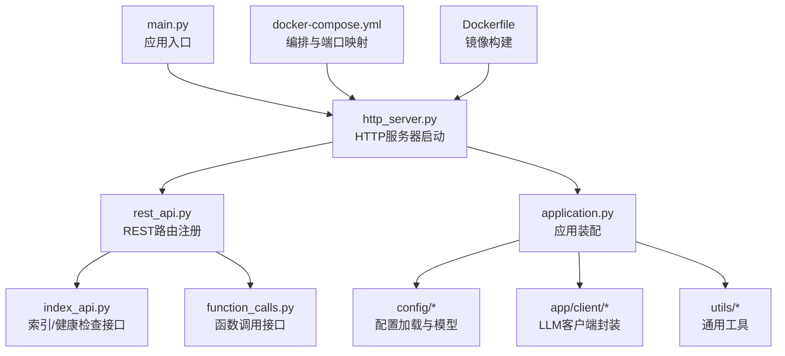
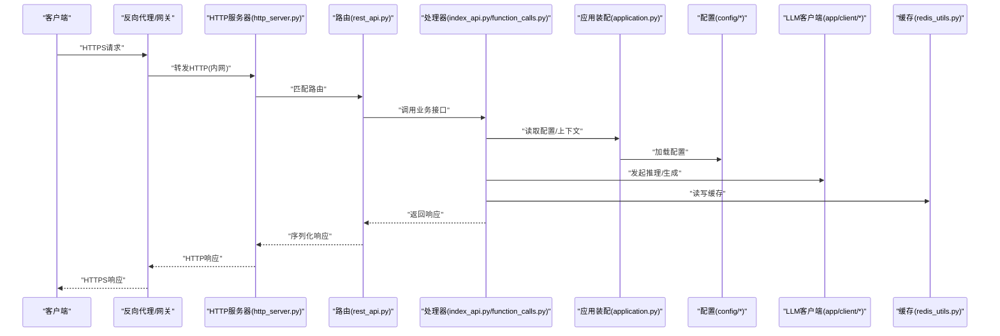
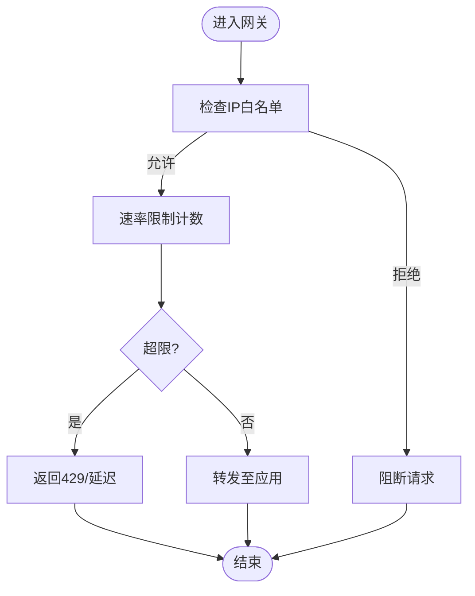
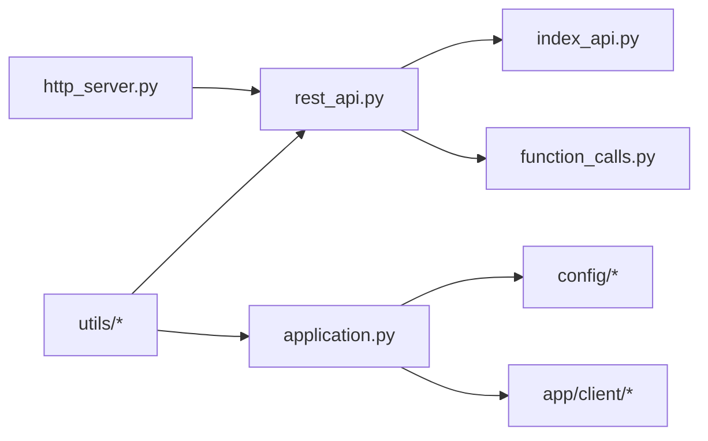

# 安全加固

<cite>
**本文引用的文件**   
- [main.py](file://main.py)
- [http_server.py](file://src/penshot/http_server.py)
- [rest_api.py](file://src/penshot/api/rest_api.py)
- [index_api.py](file://src/penshot/api/index_api.py)
- [function_calls.py](file://src/penshot/api/function_calls.py)
- [application.py](file://src/penshot/app/application.py)
- [setup_env.py](file://src/penshot/app/setup_env.py)
- [config.py](file://src/penshot/config/config.py)
- [config_loader.py](file://src/penshot/config/config_loader.py)
- [config_models.py](file://src/penshot/config/config_models.py)
- [settings.yaml](file://src/penshot/config/settings.yaml)
- [development.yaml](file://src/penshot/config/env/development.yaml)
- [production.yaml](file://src/penshot/config/env/production.yaml)
- [logging.yaml](file://src/penshot/config/logging.yaml)
- [client_config.py](file://src/penshot/app/client/client_config.py)
- [base_client.py](file://src/penshot/app/client/base_client.py)
- [openai_client.py](file://src/penshot/app/client/openai_client.py)
- [deepseek_client.py](file://src/penshot/app/client/deepseek_client.py)
- [huggingface_client.py](file://src/penshot/app/client/huggingface_client.py)
- [ollama_client.py](file://src/penshot/app/client/ollama_client.py)
- [qwen_client.py](file://src/penshot/app/client/qwen_client.py)
- [api_utils.py](file://src/penshot/utils/api_utils.py)
- [env_utils.py](file://src/penshot/utils/env_utils.py)
- [dotenv_loader.py](file://src/penshot/utils/dotenv_loader.py)
- [redis_utils.py](file://src/penshot/utils/redis_utils.py)
- [logger.py](file://src/penshot/logger.py)
- [docker-compose.yml](file://docker-compose.yml)
- [Dockerfile](file://Dockerfile)
- [pyproject.toml](file://pyproject.toml)
- [SECURITY.md](file://SECURITY.md)
</cite>

## 目录
1. [简介](#简介)
2. [项目结构](#项目结构)
3. [核心组件](#核心组件)
4. [架构总览](#架构总览)
5. [详细组件分析](#详细组件分析)
6. [依赖分析](#依赖分析)
7. [性能考虑](#性能考虑)
8. [故障排查指南](#故障排查指南)
9. [结论](#结论)
10. [附录](#附录)

## 简介
本指南面向Video Shot Agent的安全加固与合规部署，覆盖以下关键领域：
- HTTPS证书配置与Let's Encrypt自动化管理
- API访问控制（JWT认证、OAuth2集成、API密钥管理）
- 输入验证与SQL注入防护、XSS防护
- 网络安全（防火墙规则、DDoS防护、速率限制）
- 敏感信息管理（环境变量加密、配置文件权限控制）
- 安全审计日志与漏洞扫描集成

本指南基于仓库现有实现进行梳理，并给出可操作的加固建议与最佳实践。

## 项目结构
本项目采用分层组织方式：
- 应用入口与HTTP服务：main.py、http_server.py
- API路由与处理器：api/*
- 应用初始化与环境加载：app/*
- 配置中心：config/*（含多环境YAML与模型定义）
- LLM客户端封装：app/client/*
- 工具库：utils/*
- 容器化与编排：Dockerfile、docker-compose.yml、pyproject.toml

图表来源
- [main.py:1-200](file://main.py#L1-L200)
- [http_server.py:1-200](file://src/penshot/http_server.py#L1-L200)
- [rest_api.py:1-200](file://src/penshot/api/rest_api.py#L1-L200)
- [index_api.py:1-200](file://src/penshot/api/index_api.py#L1-L200)
- [function_calls.py:1-200](file://src/penshot/api/function_calls.py#L1-L200)
- [application.py:1-200](file://src/penshot/app/application.py#L1-L200)
- [docker-compose.yml:1-200](file://docker-compose.yml#L1-L200)
- [Dockerfile:1-200](file://Dockerfile#L1-L200)

章节来源
- [main.py:1-200](file://main.py#L1-L200)
- [http_server.py:1-200](file://src/penshot/http_server.py#L1-L200)
- [rest_api.py:1-200](file://src/penshot/api/rest_api.py#L1-L200)
- [index_api.py:1-200](file://src/penshot/api/index_api.py#L1-L200)
- [function_calls.py:1-200](file://src/penshot/api/function_calls.py#L1-L200)
- [application.py:1-200](file://src/penshot/app/application.py#L1-L200)
- [docker-compose.yml:1-200](file://docker-compose.yml#L1-L200)
- [Dockerfile:1-200](file://Dockerfile#L1-L200)

## 核心组件
- HTTP服务与路由层
  - http_server.py负责HTTP服务器启动与中间件挂载
  - rest_api.py集中注册REST路由
  - index_api.py提供索引与健康检查等基础接口
  - function_calls.py暴露函数调用相关接口
- 应用装配与环境加载
  - application.py完成应用级装配
  - setup_env.py负责运行期环境准备
  - config/*提供配置加载、模型校验与多环境切换
- LLM客户端封装
  - client_config.py统一客户端配置
  - base_client.py定义通用能力
  - openai_client.py、deepseek_client.py、huggingface_client.py、ollama_client.py、qwen_client.py分别对接不同厂商
- 工具与基础设施
  - api_utils.py提供API通用工具
  - env_utils.py、dotenv_loader.py用于环境变量与.env加载
  - redis_utils.py提供Redis连接与缓存操作
  - logger.py与config/logging.yaml提供日志配置

章节来源
- [http_server.py:1-200](file://src/penshot/http_server.py#L1-L200)
- [rest_api.py:1-200](file://src/penshot/api/rest_api.py#L1-L200)
- [index_api.py:1-200](file://src/penshot/api/index_api.py#L1-L200)
- [function_calls.py:1-200](file://src/penshot/api/function_calls.py#L1-L200)
- [application.py:1-200](file://src/penshot/app/application.py#L1-L200)
- [setup_env.py:1-200](file://src/penshot/app/setup_env.py#L1-L200)
- [config.py:1-200](file://src/penshot/config/config.py#L1-L200)
- [config_loader.py:1-200](file://src/penshot/config/config_loader.py#L1-L200)
- [config_models.py:1-200](file://src/penshot/config/config_models.py#L1-L200)
- [client_config.py:1-200](file://src/penshot/app/client/client_config.py#L1-L200)
- [base_client.py:1-200](file://src/penshot/app/client/base_client.py#L1-L200)
- [openai_client.py:1-200](file://src/penshot/app/client/openai_client.py#L1-L200)
- [deepseek_client.py:1-200](file://src/penshot/app/client/deepseek_client.py#L1-L200)
- [huggingface_client.py:1-200](file://src/penshot/app/client/huggingface_client.py#L1-L200)
- [ollama_client.py:1-200](file://src/penshot/app/client/ollama_client.py#L1-L200)
- [qwen_client.py:1-200](file://src/penshot/app/client/qwen_client.py#L1-L200)
- [api_utils.py:1-200](file://src/penshot/utils/api_utils.py#L1-L200)
- [env_utils.py:1-200](file://src/penshot/utils/env_utils.py#L1-L200)
- [dotenv_loader.py:1-200](file://src/penshot/utils/dotenv_loader.py#L1-L200)
- [redis_utils.py:1-200](file://src/penshot/utils/redis_utils.py#L1-L200)
- [logger.py:1-200](file://src/penshot/logger.py#L1-L200)

## 架构总览
下图展示从外部请求到内部处理的关键路径与安全边界：

图表来源
- [http_server.py:1-200](file://src/penshot/http_server.py#L1-L200)
- [rest_api.py:1-200](file://src/penshot/api/rest_api.py#L1-L200)
- [index_api.py:1-200](file://src/penshot/api/index_api.py#L1-L200)
- [function_calls.py:1-200](file://src/penshot/api/function_calls.py#L1-L200)
- [application.py:1-200](file://src/penshot/app/application.py#L1-L200)
- [config.py:1-200](file://src/penshot/config/config.py#L1-L200)
- [client_config.py:1-200](file://src/penshot/app/client/client_config.py#L1-L200)
- [redis_utils.py:1-200](file://src/penshot/utils/redis_utils.py#L1-L200)

## 详细组件分析

### HTTPS与TLS证书配置（含Let's Encrypt自动化）
- 推荐部署模式
  - 使用反向代理（如Nginx/Traefik/Caddy）终止TLS，将内网流量以HTTP转发至应用
  - 通过docker-compose.yml对外暴露443端口，并在容器中或宿主机上安装证书
- Let's Encrypt自动化
  - 在反向代理侧启用自动续期（ACME协议），避免在Python进程内直接管理证书
  - 若必须内嵌TLS，请确保私钥仅由受信任进程持有，并通过环境变量注入证书路径
- 最小权限与隔离
  - 证书文件仅对运行用户可读；容器中以只读卷挂载
  - 禁止将私钥写入日志或错误堆栈

章节来源
- [docker-compose.yml:1-200](file://docker-compose.yml#L1-L200)
- [Dockerfile:1-200](file://Dockerfile#L1-L200)
- [http_server.py:1-200](file://src/penshot/http_server.py#L1-L200)

### API访问控制（JWT、OAuth2、API密钥）
- JWT认证
  - 在路由层增加鉴权中间件，校验Authorization头中的Bearer Token
  - 使用固定密钥或KMS托管的公钥/私钥对，设置合理的过期时间
- OAuth2集成
  - 支持授权码流程或客户端凭证流程，将令牌校验委托给上游网关或独立鉴权服务
- API密钥管理
  - 为每个调用方分配唯一密钥，通过请求头或查询参数传递（优先请求头）
  - 结合IP白名单与租户标识做二次校验
- 实施位置建议
  - 在rest_api.py中集中注册鉴权中间件
  - 在index_api.py与function_calls.py中按资源粒度控制访问

章节来源
- [rest_api.py:1-200](file://src/penshot/api/rest_api.py#L1-L200)
- [index_api.py:1-200](file://src/penshot/api/index_api.py#L1-L200)
- [function_calls.py:1-200](file://src/penshot/api/function_calls.py#L1-L200)

### 输入验证与SQL注入防护、XSS防护
- 输入验证
  - 对所有入参进行类型、长度、格式校验；拒绝非法字符与异常大小负载
  - 使用配置模型（config_models.py）对结构化配置进行强校验
- SQL注入防护
  - 避免拼接SQL；使用参数化查询或ORM
  - 对动态表名/字段名进行白名单校验
- XSS防护
  - 输出前进行HTML转义；前端渲染时启用CSP策略
  - 对富文本输入进行清洗与白名单过滤
- 参考实现位置
  - utils/api_utils.py可用于统一校验与错误包装
  - config/config_models.py用于配置项强类型校验

章节来源
- [api_utils.py:1-200](file://src/penshot/utils/api_utils.py#L1-L200)
- [config_models.py:1-200](file://src/penshot/config/config_models.py#L1-L200)

### 网络安全（防火墙、DDoS防护、速率限制）
- 防火墙规则
  - 仅开放必要端口（如443/80），限制源IP范围
  - 容器网络默认拒绝入站，显式发布所需端口
- DDoS防护
  - 在边缘层启用限流与连接数限制
  - 对大体积上传与长耗时接口设置超时与熔断
- 速率限制
  - 基于IP/租户/用户维度进行QPS与并发限制
  - 使用Redis作为分布式计数器（redis_utils.py）

图表来源
- [redis_utils.py:1-200](file://src/penshot/utils/redis_utils.py#L1-L200)
- [docker-compose.yml:1-200](file://docker-compose.yml#L1-L200)

### 敏感信息管理（环境变量加密、配置文件权限）
- 环境变量
  - 通过.env与env_utils.py、dotenv_loader.py加载，避免硬编码
  - 生产环境使用平台密钥管理服务注入敏感值
- 配置文件权限
  - settings.yaml、development.yaml、production.yaml仅对运行用户可读
  - 容器中以只读卷挂载，禁止写回镜像层
- 日志脱敏
  - 在logger.py与logging.yaml中屏蔽敏感字段（如Token、密钥）

章节来源
- [env_utils.py:1-200](file://src/penshot/utils/env_utils.py#L1-L200)
- [dotenv_loader.py:1-200](file://src/penshot/utils/dotenv_loader.py#L1-L200)
- [settings.yaml:1-200](file://src/penshot/config/settings.yaml#L1-200)
- [development.yaml:1-200](file://src/penshot/config/env/development.yaml#L1-200)
- [production.yaml:1-200](file://src/penshot/config/env/production.yaml#L1-200)
- [logging.yaml:1-200](file://src/penshot/config/logging.yaml#L1-200)
- [logger.py:1-200](file://src/penshot/logger.py#L1-200)

### 安全审计日志与漏洞扫描集成
- 审计日志
  - 记录请求ID、来源IP、用户标识、动作、结果与耗时
  - 将敏感字段脱敏后落盘，并开启轮转与保留策略
- 漏洞扫描
  - 在CI中集成静态扫描（依赖与代码）、镜像扫描
  - 定期执行运行时扫描与渗透测试，修复高危问题

章节来源
- [logger.py:1-200](file://src/penshot/logger.py#L1-200)
- [logging.yaml:1-200](file://src/penshot/config/logging.yaml#L1-200)
- [pyproject.toml:1-200](file://pyproject.toml#L1-200)

## 依赖分析
- 外部依赖
  - Redis：用于缓存与分布式限流
  - LLM提供商SDK：OpenAI、DeepSeek、HuggingFace、Ollama、Qwen等
- 内部耦合
  - http_server.py依赖rest_api.py的路由注册
  - application.py聚合配置与客户端工厂
  - utils/*被各层复用

图表来源
- [http_server.py:1-200](file://src/penshot/http_server.py#L1-L200)
- [rest_api.py:1-200](file://src/penshot/api/rest_api.py#L1-L200)
- [index_api.py:1-200](file://src/penshot/api/index_api.py#L1-L200)
- [function_calls.py:1-200](file://src/penshot/api/function_calls.py#L1-L200)
- [application.py:1-200](file://src/penshot/app/application.py#L1-L200)
- [config.py:1-200](file://src/penshot/config/config.py#L1-L200)
- [client_config.py:1-200](file://src/penshot/app/client/client_config.py#L1-L200)
- [base_client.py:1-200](file://src/penshot/app/client/base_client.py#L1-L200)
- [openai_client.py:1-200](file://src/penshot/app/client/openai_client.py#L1-L200)
- [deepseek_client.py:1-200](file://src/penshot/app/client/deepseek_client.py#L1-L200)
- [huggingface_client.py:1-200](file://src/penshot/app/client/huggingface_client.py#L1-L200)
- [ollama_client.py:1-200](file://src/penshot/app/client/ollama_client.py#L1-L200)
- [qwen_client.py:1-200](file://src/penshot/app/client/qwen_client.py#L1-L200)

章节来源
- [http_server.py:1-200](file://src/penshot/http_server.py#L1-L200)
- [rest_api.py:1-200](file://src/penshot/api/rest_api.py#L1-L200)
- [application.py:1-200](file://src/penshot/app/application.py#L1-L200)
- [config.py:1-200](file://src/penshot/config/config.py#L1-L200)
- [client_config.py:1-200](file://src/penshot/app/client/client_config.py#L1-L200)
- [base_client.py:1-200](file://src/penshot/app/client/base_client.py#L1-L200)
- [openai_client.py:1-200](file://src/penshot/app/client/openai_client.py#L1-L200)
- [deepseek_client.py:1-200](file://src/penshot/app/client/deepseek_client.py#L1-L200)
- [huggingface_client.py:1-200](file://src/penshot/app/client/huggingface_client.py#L1-L200)
- [ollama_client.py:1-200](file://src/penshot/app/client/ollama_client.py#L1-L200)
- [qwen_client.py:1-200](file://src/penshot/app/client/qwen_client.py#L1-L200)

## 性能考虑
- 合理设置连接池与超时，避免下游LLM服务阻塞
- 使用Redis缓存热点数据，降低重复计算
- 对大请求体与长任务启用异步处理与分页返回
- 在网关层启用压缩与连接复用

[本节为通用指导，不直接分析具体文件]

## 故障排查指南
- 常见问题定位
  - 证书与TLS：检查反向代理证书链与域名解析
  - 鉴权失败：核对JWT签名算法、密钥与过期时间
  - 速率限制：查看Redis计数器与阈值配置
  - 日志缺失：确认logger配置与磁盘空间
- 诊断步骤
  - 打开调试日志级别，捕获完整请求链路
  - 使用健康检查接口验证服务可用性
  - 对关键路径添加追踪ID以便跨服务关联

章节来源
- [logger.py:1-200](file://src/penshot/logger.py#L1-L200)
- [logging.yaml:1-200](file://src/penshot/config/logging.yaml#L1-200)
- [index_api.py:1-200](file://src/penshot/api/index_api.py#L1-L200)

## 结论
通过在网络边界终止TLS、集中鉴权、严格输入校验、细粒度速率限制与完善的审计日志，可显著提升Video Shot Agent的安全性。配合CI/CD中的漏洞扫描与最小权限原则，可有效降低攻击面与运维风险。

[本节为总结性内容，不直接分析具体文件]

## 附录
- 参考文档
  - SECURITY.md：安全政策与报告渠道
- 快速清单
  - 启用HTTPS与自动续期
  - 配置JWT/OAuth2/API密钥
  - 开启输入校验与输出转义
  - 部署速率限制与防火墙规则
  - 脱敏日志与权限收敛
  - 集成漏洞扫描与告警

章节来源
- [SECURITY.md:1-200](file://SECURITY.md#L1-200)