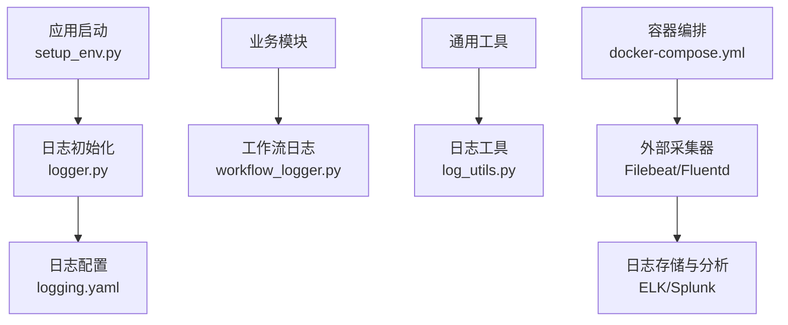
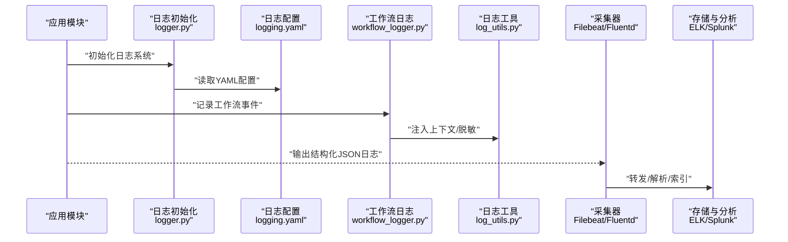
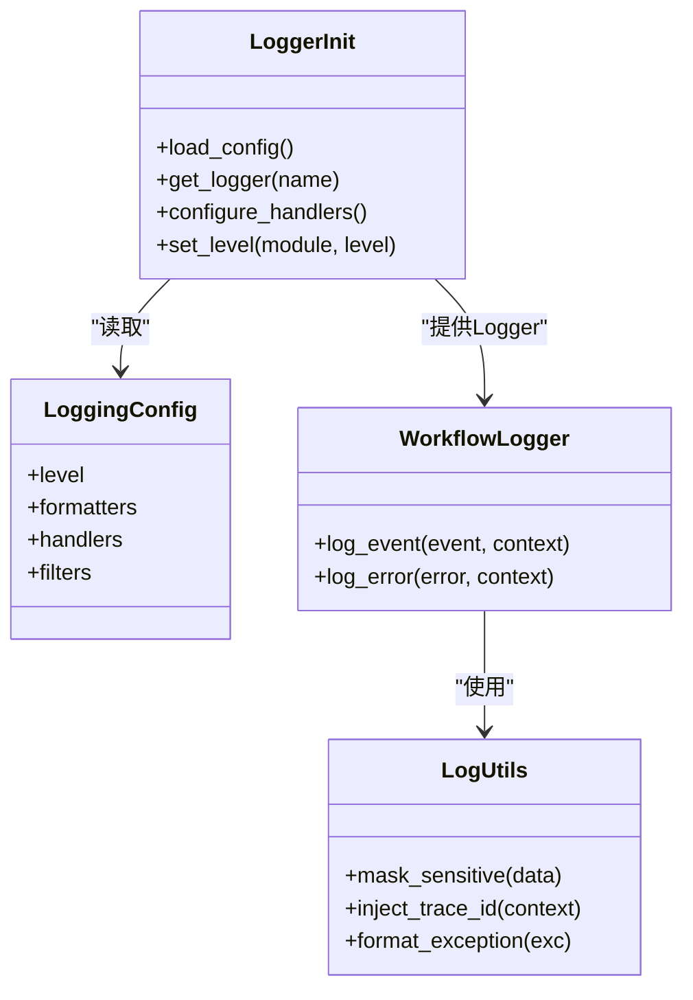
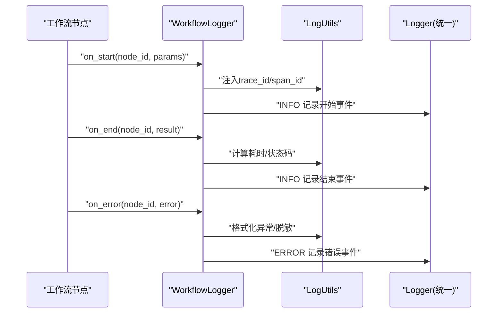
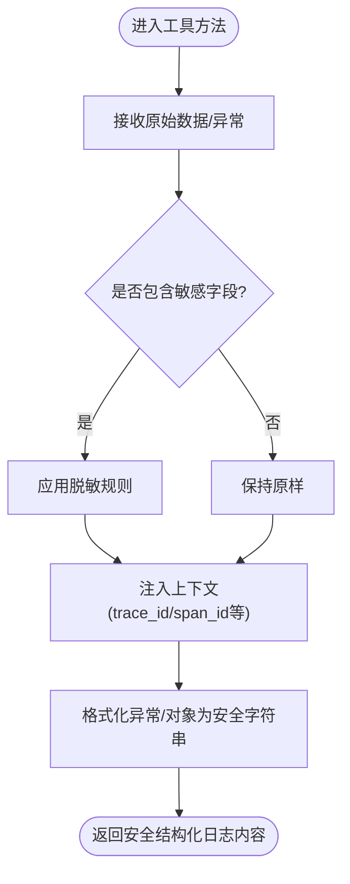
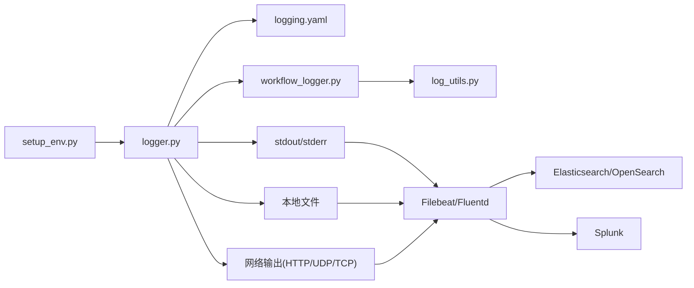

# 日志管理

<cite>
**本文引用的文件**   
- [src/penshot/logger.py](file://src/penshot/logger.py)
- [src/penshot/config/logging.yaml](file://src/penshot/config/logging.yaml)
- [src/penshot/utils/log_utils.py](file://src/penshot/utils/log_utils.py)
- [src/penshot/app/setup_env.py](file://src/penshot/app/setup_env.py)
- [src/penshot/neopen/agent/workflow/workflow_logger.py](file://src/penshot/neopen/agent/workflow/workflow_logger.py)
- [src/penshot/config/settings.yaml](file://src/penshot/config/settings.yaml)
- [docker-compose.yml](file://docker-compose.yml)
</cite>

## 目录
1. [简介](#简介)
2. [项目结构](#项目结构)
3. [核心组件](#核心组件)
4. [架构总览](#架构总览)
5. [详细组件分析](#详细组件分析)
6. [依赖关系分析](#依赖关系分析)
7. [性能考虑](#性能考虑)
8. [故障排查指南](#故障排查指南)
9. [结论](#结论)
10. [附录](#附录)

## 简介
本指南面向Video Shot Agent的日志管理系统，目标是帮助读者完成从结构化日志格式设计、日志收集器部署（Fluentd/Filebeat）、日志存储与轮转、到日志分析工具集成（ELK/Splunk）的全链路配置。文档同时提供查询优化与安全合规建议，确保在生产环境中获得稳定、可观测且安全的日志能力。

## 项目结构
本项目在应用层提供了统一的日志初始化入口、基于YAML的日志配置以及工作流专用的日志记录模块；同时在工具层封装了通用日志辅助方法。关键路径如下：
- 应用启动与环境设置：[src/penshot/app/setup_env.py](file://src/penshot/app/setup_env.py)
- 日志配置（YAML）：[src/penshot/config/logging.yaml](file://src/penshot/config/logging.yaml)
- 日志初始化与根Logger获取：[src/penshot/logger.py](file://src/penshot/logger.py)
- 工作流专用日志记录：[src/penshot/neopen/agent/workflow/workflow_logger.py](file://src/penshot/neopen/agent/workflow/workflow_logger.py)
- 通用日志工具：[src/penshot/utils/log_utils.py](file://src/penshot/utils/log_utils.py)
- 全局设置（含可能包含的日志相关项）：[src/penshot/config/settings.yaml](file://src/penshot/config/settings.yaml)
- 容器编排（便于集成Filebeat/Fluentd等采集器）：[docker-compose.yml](file://docker-compose.yml)

图表来源
- [src/penshot/app/setup_env.py](file://src/penshot/app/setup_env.py)
- [src/penshot/logger.py](file://src/penshot/logger.py)
- [src/penshot/config/logging.yaml](file://src/penshot/config/logging.yaml)
- [src/penshot/neopen/agent/workflow/workflow_logger.py](file://src/penshot/neopen/agent/workflow/workflow_logger.py)
- [src/penshot/utils/log_utils.py](file://src/penshot/utils/log_utils.py)
- [docker-compose.yml](file://docker-compose.yml)

章节来源
- [src/penshot/app/setup_env.py](file://src/penshot/app/setup_env.py)
- [src/penshot/logger.py](file://src/penshot/logger.py)
- [src/penshot/config/logging.yaml](file://src/penshot/config/logging.yaml)
- [src/penshot/neopen/agent/workflow/workflow_logger.py](file://src/penshot/neopen/agent/workflow/workflow_logger.py)
- [src/penshot/utils/log_utils.py](file://src/penshot/utils/log_utils.py)
- [docker-compose.yml](file://docker-compose.yml)

## 核心组件
本节聚焦于日志系统的核心实现与扩展点，包括统一初始化、YAML配置驱动、工作流日志与通用工具。

- 统一日志初始化与根Logger暴露
  - 负责加载日志配置并返回标准Python Logger实例，供各模块使用。
  - 典型用法：在应用启动阶段调用初始化函数，随后通过模块级Logger进行记录。
  - 参考路径：[src/penshot/logger.py](file://src/penshot/logger.py)

- YAML驱动的日志配置
  - 以YAML形式定义日志级别、输出目标（控制台/文件/网络）、格式化模板、轮转策略等。
  - 支持按环境切换不同配置（例如开发/生产）。
  - 参考路径：[src/penshot/config/logging.yaml](file://src/penshot/config/logging.yaml)

- 工作流专用日志记录
  - 为Agent工作流节点提供标准化上下文字段（如任务ID、节点名、耗时、状态码等），便于端到端追踪。
  - 参考路径：[src/penshot/neopen/agent/workflow/workflow_logger.py](file://src/penshot/neopen/agent/workflow/workflow_logger.py)

- 通用日志工具
  - 提供便捷方法用于敏感信息脱敏、结构化字段注入、异常堆栈处理等。
  - 参考路径：[src/penshot/utils/log_utils.py](file://src/penshot/utils/log_utils.py)

- 应用启动与环境设置
  - 在应用启动时加载配置、初始化日志系统，确保后续所有模块均可用。
  - 参考路径：[src/penshot/app/setup_env.py](file://src/penshot/app/setup_env.py)

章节来源
- [src/penshot/logger.py](file://src/penshot/logger.py)
- [src/penshot/config/logging.yaml](file://src/penshot/config/logging.yaml)
- [src/penshot/neopen/agent/workflow/workflow_logger.py](file://src/penshot/neopen/agent/workflow/workflow_logger.py)
- [src/penshot/utils/log_utils.py](file://src/penshot/utils/log_utils.py)
- [src/penshot/app/setup_env.py](file://src/penshot/app/setup_env.py)

## 架构总览
下图展示了Video Shot Agent的日志数据流：应用模块产生结构化日志，经由统一Logger写入本地或远程目标；外部采集器（Filebeat/Fluentd）将日志转发至集中式存储与分析平台（ELK/Splunk）。

图表来源
- [src/penshot/logger.py](file://src/penshot/logger.py)
- [src/penshot/config/logging.yaml](file://src/penshot/config/logging.yaml)
- [src/penshot/neopen/agent/workflow/workflow_logger.py](file://src/penshot/neopen/agent/workflow/workflow_logger.py)
- [src/penshot/utils/log_utils.py](file://src/penshot/utils/log_utils.py)
- [docker-compose.yml](file://docker-compose.yml)

## 详细组件分析

### 组件A：日志初始化与配置加载
- 职责
  - 根据YAML配置创建并配置根Logger及各级处理器（控制台、文件、网络等）。
  - 暴露统一的Logger获取接口，保证全应用一致的结构化输出。
- 关键点
  - 配置优先级：环境变量 > YAML默认值 > 运行时覆盖。
  - 支持多目标输出（stdout/stderr、文件、HTTP/UDP/TCP等）。
  - 支持按模块名动态调整日志级别。
- 参考路径
  - [src/penshot/logger.py](file://src/penshot/logger.py)
  - [src/penshot/config/logging.yaml](file://src/penshot/config/logging.yaml)

图表来源
- [src/penshot/logger.py](file://src/penshot/logger.py)
- [src/penshot/config/logging.yaml](file://src/penshot/config/logging.yaml)
- [src/penshot/neopen/agent/workflow/workflow_logger.py](file://src/penshot/neopen/agent/workflow/workflow_logger.py)
- [src/penshot/utils/log_utils.py](file://src/penshot/utils/log_utils.py)

章节来源
- [src/penshot/logger.py](file://src/penshot/logger.py)
- [src/penshot/config/logging.yaml](file://src/penshot/config/logging.yaml)

### 组件B：工作流日志记录
- 职责
  - 在工作流节点执行前后记录关键事件（开始、结束、错误、重试等）。
  - 自动注入trace_id、span_id、节点名称、耗时、状态码等上下文字段。
- 关键点
  - 与统一Logger集成，遵循相同的JSON结构与字段规范。
  - 支持异步批量写入以降低对主流程的影响。
- 参考路径
  - [src/penshot/neopen/agent/workflow/workflow_logger.py](file://src/penshot/neopen/agent/workflow/workflow_logger.py)

图表来源
- [src/penshot/neopen/agent/workflow/workflow_logger.py](file://src/penshot/neopen/agent/workflow/workflow_logger.py)
- [src/penshot/utils/log_utils.py](file://src/penshot/utils/log_utils.py)
- [src/penshot/logger.py](file://src/penshot/logger.py)

章节来源
- [src/penshot/neopen/agent/workflow/workflow_logger.py](file://src/penshot/neopen/agent/workflow/workflow_logger.py)
- [src/penshot/utils/log_utils.py](file://src/penshot/utils/log_utils.py)

### 组件C：通用日志工具
- 职责
  - 提供敏感信息脱敏、结构化字段注入、异常信息格式化等工具方法。
- 关键点
  - 脱敏规则可配置（如密码、令牌、手机号、邮箱等）。
  - 支持递归遍历复杂对象，避免遗漏嵌套字段。
- 参考路径
  - [src/penshot/utils/log_utils.py](file://src/penshot/utils/log_utils.py)

图表来源
- [src/penshot/utils/log_utils.py](file://src/penshot/utils/log_utils.py)

章节来源
- [src/penshot/utils/log_utils.py](file://src/penshot/utils/log_utils.py)

### 组件D：应用启动与环境设置
- 职责
  - 在应用启动阶段加载配置、初始化日志系统，确保后续模块可直接使用Logger。
- 关键点
  - 支持通过环境变量覆盖日志级别、输出目标等。
  - 在容器环境下优先输出到stdout/stderr，便于采集器抓取。
- 参考路径
  - [src/penshot/app/setup_env.py](file://src/penshot/app/setup_env.py)

章节来源
- [src/penshot/app/setup_env.py](file://src/penshot/app/setup_env.py)

## 依赖关系分析
- 内部依赖
  - setup_env.py 依赖 logger.py 完成日志初始化。
  - workflow_logger.py 依赖 log_utils.py 进行上下文注入与脱敏。
  - logger.py 依赖 logging.yaml 完成处理器与格式化器配置。
- 外部依赖
  - 采集器（Filebeat/Fluentd）通过文件系统或网络协议消费日志。
  - 存储与分析平台（Elasticsearch/OpenSearch、Splunk）接收并索引日志。

图表来源
- [src/penshot/app/setup_env.py](file://src/penshot/app/setup_env.py)
- [src/penshot/logger.py](file://src/penshot/logger.py)
- [src/penshot/config/logging.yaml](file://src/penshot/config/logging.yaml)
- [src/penshot/neopen/agent/workflow/workflow_logger.py](file://src/penshot/neopen/agent/workflow/workflow_logger.py)
- [src/penshot/utils/log_utils.py](file://src/penshot/utils/log_utils.py)
- [docker-compose.yml](file://docker-compose.yml)

章节来源
- [src/penshot/app/setup_env.py](file://src/penshot/app/setup_env.py)
- [src/penshot/logger.py](file://src/penshot/logger.py)
- [src/penshot/config/logging.yaml](file://src/penshot/config/logging.yaml)
- [src/penshot/neopen/agent/workflow/workflow_logger.py](file://src/penshot/neopen/agent/workflow/workflow_logger.py)
- [src/penshot/utils/log_utils.py](file://src/penshot/utils/log_utils.py)
- [docker-compose.yml](file://docker-compose.yml)

## 性能考虑
- 日志级别控制
  - 生产环境建议使用INFO及以上级别，DEBUG仅在问题定位时临时开启。
- 异步写入
  - 在高吞吐场景下，采用异步队列或批量写入降低主线程阻塞。
- 结构化输出
  - 使用JSON格式减少解析成本，便于下游采集器直接提取字段。
- 采样与限流
  - 对高频事件（如心跳、健康检查）启用采样或限流，避免日志风暴。
- 磁盘I/O优化
  - 合理设置文件轮转大小与数量，避免频繁I/O；必要时使用独立磁盘挂载。

## 故障排查指南
- 常见问题
  - 日志未输出：检查应用启动是否调用了日志初始化；确认YAML配置中的处理器已启用。
  - 字段缺失：确认工作流日志是否正确注入trace_id/span_id；检查工具层的上下文注入逻辑。
  - 敏感信息泄露：验证脱敏规则是否生效，必要时增加正则表达式匹配。
  - 采集器无数据：确认容器stdout/stderr映射或文件路径正确；检查网络端口与权限。
- 快速定位
  - 通过trace_id跨服务串联请求链路。
  - 使用关键字过滤（如“ERROR”、“timeout”、“retry”）快速缩小范围。
  - 结合时间窗口与节点名称定位具体工作流步骤。

章节来源
- [src/penshot/logger.py](file://src/penshot/logger.py)
- [src/penshot/neopen/agent/workflow/workflow_logger.py](file://src/penshot/neopen/agent/workflow/workflow_logger.py)
- [src/penshot/utils/log_utils.py](file://src/penshot/utils/log_utils.py)

## 结论
通过统一的日志初始化、YAML配置驱动、工作流专用日志与通用工具封装，Video Shot Agent实现了高内聚、低耦合的日志体系。配合外部采集器与集中式存储分析平台，可在生产环境获得稳定、可观测且安全的日志能力。建议在上线前完成字段规范、脱敏策略与轮转策略的评审与压测，确保满足性能与合规要求。

## 附录

### 结构化日志格式设计（JSON规范）
- 基础字段
  - timestamp：ISO8601时间戳（UTC）
  - level：日志级别（DEBUG/INFO/WARNING/ERROR/CRITICAL）
  - logger：模块名或类名
  - message：人类可读消息
  - trace_id：请求链路标识
  - span_id：节点/操作标识
  - service：服务名（video-shot-agent）
  - host：主机名或容器ID
  - pid：进程ID
  - env：运行环境（development/production）
- 业务字段（示例）
  - task_id：任务ID
  - node_name：工作流节点名
  - status：状态码（success/failure/retry）
  - duration_ms：耗时（毫秒）
  - error_code：错误码
  - error_message：错误消息（经脱敏）
- 注意事项
  - 所有数值型字段应为数字类型，避免字符串化。
  - 避免在message中重复包含结构化字段。
  - 对敏感字段统一走脱敏工具，禁止明文输出。

### 日志级别定义
- DEBUG：详细调试信息，仅开发/测试环境启用。
- INFO：一般业务流程信息，生产默认级别。
- WARNING：潜在问题提示，需关注但不影响主流程。
- ERROR：错误事件，需要人工介入或自动告警。
- CRITICAL：严重错误，可能导致服务不可用。

### 日志收集器配置（Filebeat/Fluentd）
- Filebeat
  - 输入：读取容器stdout/stderr或指定日志文件路径。
  - 输出：转发至Elasticsearch/OpenSearch或Logstash。
  - 字段映射：保留trace_id/span_id以便链路追踪。
- Fluentd
  - 插件：tail（文件）、forward（网络）、http（REST）。
  - 过滤器：json_filter、record_transformer（添加元数据）、grep（过滤）。
  - 输出：elasticsearch、splunkhec、kafka等。
- 容器编排
  - 在docker-compose中声明采集器服务，挂载共享卷或连接stdout/stderr。
  - 参考路径：[docker-compose.yml](file://docker-compose.yml)

### 日志存储方案
- 本地磁盘轮转
  - 按文件大小与时间双维度轮转，保留N天或M个文件。
  - 压缩归档旧文件，释放磁盘空间。
- 远程日志服务器
  - 使用TCP/UDP/HTTP直连远端日志服务，适合微服务架构。
  - 失败重试与背压机制，避免丢日志。

### 日志分析工具集成（ELK/Splunk）
- ELK栈
  - Elasticsearch：索引策略（按日期分片、字段映射、副本数）。
  - Logstash：解析JSON、清洗字段、路由到不同索引。
  - Kibana：可视化面板、告警规则、链路追踪视图。
- Splunk
  - 数据源：HTTP Event Collector或Syslog。
  - 索引与字段提取：基于JSON字段建立索引，提升查询性能。
  - 仪表盘与告警：基于trace_id与服务名构建监控看板。

### 日志查询与优化技巧
- 索引策略
  - 按service+date分片，常用字段（trace_id、node_name、status）建立索引。
  - 冷热分层：近期数据热索引，历史数据冷归档。
- 查询优化
  - 使用精确匹配替代模糊匹配。
  - 限定时间窗口与必要字段，减少扫描量。
  - 预聚合指标（QPS、错误率、P95/P99延迟）。

### 日志安全与合规性
- 敏感信息脱敏
  - 密码、令牌、手机号、邮箱、身份证号等必须脱敏。
  - 使用统一工具层进行递归脱敏，避免遗漏。
- 保留策略
  - 依据法规与业务需求设定保留期（如90天/180天）。
  - 定期清理过期日志，审计删除操作。
- 访问控制
  - 限制日志查看权限，审计日志访问行为。
  - 传输加密（TLS）与存储加密（AES）保障数据安全。