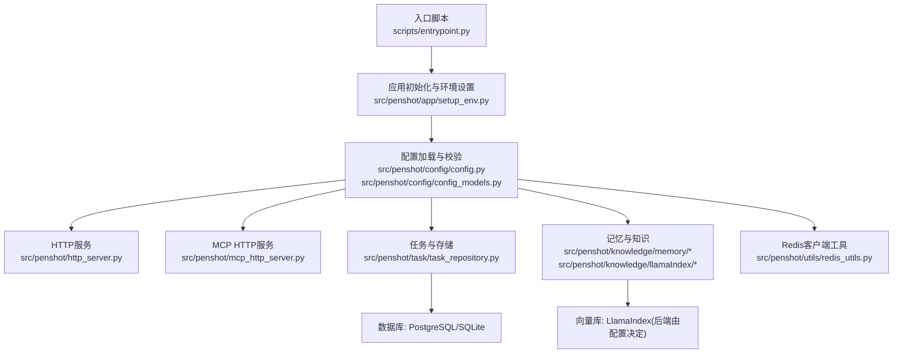
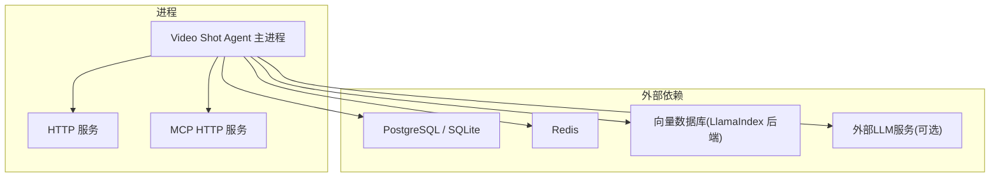
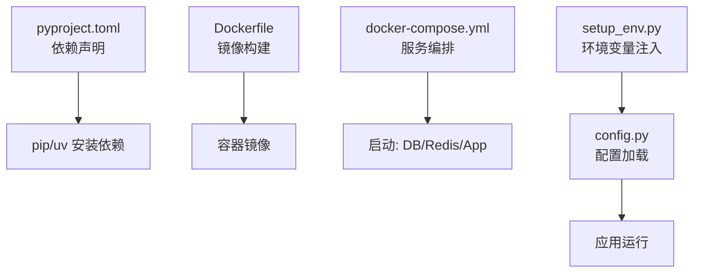

# 生产环境要求

<cite>
**本文引用的文件**   
- [pyproject.toml](file://pyproject.toml)
- [Dockerfile](file://Dockerfile)
- [docker-compose.yml](file://docker-compose.yml)
- [src/penshot/config/settings.yaml](file://src/penshot/config/settings.yaml)
- [src/penshot/config/env/production.yaml](file://src/penshot/config/env/production.yaml)
- [src/penshot/config/config.py](file://src/penshot/config/config.py)
- [src/penshot/app/setup_env.py](file://src/penshot/app/setup_env.py)
- [src/penshot/utils/redis_utils.py](file://src/penshot/utils/redis_utils.py)
- [src/penshot/task/task_repository.py](file://src/penshot/task/task_repository.py)
- [src/penshot/knowledge/memory/long_term_memory.py](file://src/penshot/knowledge/memory/long_term_memory.py)
- [src/penshot/knowledge/memory/medium_term_memory.py](file://src/penshot/knowledge/memory/medium_term_memory.py)
- [src/penshot/knowledge/memory/short_term_memory.py](file://src/penshot/knowledge/memory/short_term_memory.py)
- [src/penshot/knowledge/memory/memory_manager.py](file://src/penshot/knowledge/memory/memory_manager.py)
- [src/penshot/knowledge/llamaIndex/llama_index_knowledge.py](file://src/penshot/knowledge/llamaIndex/llama_index_knowledge.py)
- [src/penshot/http_server.py](file://src/penshot/http_server.py)
- [src/penshot/mcp_http_server.py](file://src/penshot/mcp_http_server.py)
- [scripts/entrypoint.py](file://scripts/entrypoint.py)
- [README_zh.md](file://README_zh.md)
</cite>

## 目录
1. [简介](#简介)
2. [项目结构](#项目结构)
3. [核心组件](#核心组件)
4. [架构总览](#架构总览)
5. [详细组件分析](#详细组件分析)
6. [依赖分析](#依赖分析)
7. [性能考虑](#性能考虑)
8. [故障排查指南](#故障排查指南)
9. [结论](#结论)
10. [附录](#附录)

## 简介
本文件面向Video Shot Agent的生产部署，给出硬件与软件要求、操作系统与Python版本兼容性、数据库与缓存/消息队列依赖、网络端口与防火墙建议、以及性能基准与容量规划方法。内容基于仓库中的配置、入口脚本与运行时依赖进行归纳，确保可落地执行。

## 项目结构
从运行视角看，关键路径包括：
- 应用启动与配置加载：入口脚本与配置模型
- 外部依赖：PostgreSQL/SQLite、Redis、向量知识库（LlamaIndex）
- Web服务：HTTP/MCP HTTP服务器
- 任务与工作流：持久化、记忆与索引

图表来源
- [scripts/entrypoint.py](file://scripts/entrypoint.py)
- [src/penshot/app/setup_env.py](file://src/penshot/app/setup_env.py)
- [src/penshot/config/config.py](file://src/penshot/config/config.py)
- [src/penshot/http_server.py](file://src/penshot/http_server.py)
- [src/penshot/mcp_http_server.py](file://src/penshot/mcp_http_server.py)
- [src/penshot/task/task_repository.py](file://src/penshot/task/task_repository.py)
- [src/penshot/knowledge/memory/long_term_memory.py](file://src/penshot/knowledge/memory/long_term_memory.py)
- [src/penshot/knowledge/memory/medium_term_memory.py](file://src/penshot/knowledge/memory/medium_term_memory.py)
- [src/penshot/knowledge/memory/short_term_memory.py](file://src/penshot/knowledge/memory/short_term_memory.py)
- [src/penshot/knowledge/memory/memory_manager.py](file://src/penshot/knowledge/memory/memory_manager.py)
- [src/penshot/knowledge/llamaIndex/llama_index_knowledge.py](file://src/penshot/knowledge/llamaIndex/llama_index_knowledge.py)
- [src/penshot/utils/redis_utils.py](file://src/penshot/utils/redis_utils.py)

章节来源
- [scripts/entrypoint.py](file://scripts/entrypoint.py)
- [src/penshot/app/setup_env.py](file://src/penshot/app/setup_env.py)
- [src/penshot/config/config.py](file://src/penshot/config/config.py)

## 核心组件
- 配置系统：集中管理环境变量与YAML配置，提供默认值与类型校验，支持按环境切换（development/production）。
- 数据层：任务持久化使用SQL数据库（PostgreSQL或SQLite），记忆模块与检索增强通过LlamaIndex对接向量库。
- 缓存与中间件：Redis用于会话/缓存/任务队列等能力（具体用途由配置驱动）。
- 服务暴露：HTTP API与MCP HTTP服务分别监听不同端口。

章节来源
- [src/penshot/config/config.py](file://src/penshot/config/config.py)
- [src/penshot/config/config_models.py](file://src/penshot/config/config_models.py)
- [src/penshot/config/env/production.yaml](file://src/penshot/config/env/production.yaml)
- [src/penshot/task/task_repository.py](file://src/penshot/task/task_repository.py)
- [src/penshot/knowledge/llamaIndex/llama_index_knowledge.py](file://src/penshot/knowledge/llamaIndex/llama_index_knowledge.py)
- [src/penshot/utils/redis_utils.py](file://src/penshot/utils/redis_utils.py)
- [src/penshot/http_server.py](file://src/penshot/http_server.py)
- [src/penshot/mcp_http_server.py](file://src/penshot/mcp_http_server.py)

## 架构总览
下图展示生产环境的关键外部依赖与服务边界：

图表来源
- [src/penshot/http_server.py](file://src/penshot/http_server.py)
- [src/penshot/mcp_http_server.py](file://src/penshot/mcp_http_server.py)
- [src/penshot/task/task_repository.py](file://src/penshot/task/task_repository.py)
- [src/penshot/knowledge/llamaIndex/llama_index_knowledge.py](file://src/penshot/knowledge/llamaIndex/llama_index_knowledge.py)
- [src/penshot/utils/redis_utils.py](file://src/penshot/utils/redis_utils.py)

## 详细组件分析

### 操作系统与Python版本
- 操作系统
  - 官方容器镜像基于Linux发行版构建，推荐在主流Linux发行版上运行（如Ubuntu/CentOS/Rocky/Debian等）。
  - 若使用容器化部署，需具备兼容的容器运行时（Docker/Podman）。
- Python版本
  - 以工程依赖声明为准，请确保运行环境与pyproject中指定的Python版本一致。
- 容器镜像
  - Dockerfile定义了基础镜像与安装步骤，可作为宿主机环境的参考基线。

章节来源
- [Dockerfile](file://Dockerfile)
- [pyproject.toml](file://pyproject.toml)

### 数据库要求（PostgreSQL/SQLite）
- 支持的数据库类型
  - 通过配置选择PostgreSQL或SQLite。生产环境建议使用PostgreSQL以获得更好的并发与可靠性。
- 连接参数
  - 典型参数包括主机、端口、用户名、密码、数据库名；SQLite则指定本地文件路径。
- 表结构与迁移
  - 任务与相关实体的持久化逻辑位于任务仓储模块，首次启动应确保数据库可用并完成必要的初始化。
- 备份与恢复
  - 仓库提供数据备份脚本，可用于定期导出与恢复。

章节来源
- [src/penshot/task/task_repository.py](file://src/penshot/task/task_repository.py)
- [src/penshot/config/config.py](file://src/penshot/config/config.py)
- [scripts/backup_data.py](file://scripts/backup_data.py)

### Redis要求
- 作用
  - 作为缓存/会话/任务中间件的载体（具体用途由配置项控制）。
- 版本与特性
  - 建议使用较新稳定版，确保支持列表、集合、哈希等常用数据结构。
- 连接与安全
  - 配置主机、端口、认证信息；生产环境建议启用TLS与访问控制。

章节来源
- [src/penshot/utils/redis_utils.py](file://src/penshot/utils/redis_utils.py)
- [src/penshot/config/config.py](file://src/penshot/config/config.py)

### 向量知识库（LlamaIndex）
- 角色
  - 负责长短期记忆与检索增强，底层向量库由配置决定（例如Chroma、Milvus、Elastic等，取决于LlamaIndex后端）。
- 容量与索引
  - 文档规模、分块策略与索引重建会影响磁盘与内存占用，需结合业务量评估。

章节来源
- [src/penshot/knowledge/llamaIndex/llama_index_knowledge.py](file://src/penshot/knowledge/llamaIndex/llama_index_knowledge.py)
- [src/penshot/knowledge/memory/long_term_memory.py](file://src/penshot/knowledge/memory/long_term_memory.py)
- [src/penshot/knowledge/memory/medium_term_memory.py](file://src/penshot/knowledge/memory/medium_term_memory.py)
- [src/penshot/knowledge/memory/short_term_memory.py](file://src/penshot/knowledge/memory/short_term_memory.py)
- [src/penshot/knowledge/memory/memory_manager.py](file://src/penshot/knowledge/memory/memory_manager.py)

### 消息队列依赖
- 说明
  - 当前代码未显式引入独立的消息队列中间件；任务调度与状态流转主要依赖数据库与内存/缓存。
- 扩展建议
  - 如需异步解耦与水平扩展，可在上层引入消息队列（如RabbitMQ/Kafka），并通过适配器接入现有工作流。

章节来源
- [src/penshot/task/task_repository.py](file://src/penshot/task/task_repository.py)
- [src/penshot/config/config.py](file://src/penshot/config/config.py)

### 网络端口与防火墙
- HTTP服务
  - 默认监听一个HTTP端口（可通过配置修改），对外暴露REST接口。
- MCP HTTP服务
  - 单独监听另一个HTTP端口，用于MCP协议通信。
- 防火墙建议
  - 仅开放必要端口至可信网段；对公网暴露时建议前置反向代理并启用HTTPS。

章节来源
- [src/penshot/http_server.py](file://src/penshot/http_server.py)
- [src/penshot/mcp_http_server.py](file://src/penshot/mcp_http_server.py)
- [src/penshot/config/config.py](file://src/penshot/config/config.py)

## 依赖分析
- 语言与包管理
  - 依赖声明集中于pyproject.toml，包含Web框架、数据库驱动、Redis客户端、向量库与工具链。
- 容器化
  - Dockerfile定义基础镜像、依赖安装与入口命令；docker-compose用于编排多服务（数据库、缓存、应用）。
- 配置与环境
  - settings.yaml与env/*.yaml提供默认与生产环境覆盖；setup_env负责环境变量注入与初始化。

图表来源
- [pyproject.toml](file://pyproject.toml)
- [Dockerfile](file://Dockerfile)
- [docker-compose.yml](file://docker-compose.yml)
- [src/penshot/app/setup_env.py](file://src/penshot/app/setup_env.py)
- [src/penshot/config/config.py](file://src/penshot/config/config.py)

章节来源
- [pyproject.toml](file://pyproject.toml)
- [Dockerfile](file://Dockerfile)
- [docker-compose.yml](file://docker-compose.yml)
- [src/penshot/app/setup_env.py](file://src/penshot/app/setup_env.py)
- [src/penshot/config/config.py](file://src/penshot/config/config.py)

## 性能考虑
- CPU
  - 视频处理与提示词转换可能涉及CPU密集型任务。建议至少4核起步，高并发场景建议8核及以上。
- 内存
  - 向量索引与LLM上下文会消耗较多内存。建议最低8GB，推荐16GB或以上。
- 存储
  - 数据库文件、向量索引与日志增长较快。建议SSD，初始预留数十GB并按月扩容。
- 网络
  - 对外API与MCP服务需要低延迟网络；跨机房调用LLM时需关注带宽与时延。
- 基准测试建议
  - 使用仓库示例与测试套件构造代表性负载，逐步压测QPS、P95延迟与资源占用，据此调整资源配置。
- 容量规划
  - 根据日处理视频时长、片段数量、知识库规模与并发目标，估算CPU/内存/IO需求，并预留30%-50%冗余。

[本节为通用指导，不直接分析具体文件]

## 故障排查指南
- 启动失败
  - 检查环境变量与配置文件是否完整；确认数据库与Redis可达。
- 数据库连接错误
  - 核对连接串、权限与白名单；必要时查看数据库日志。
- Redis不可用
  - 检查网络连通性、认证信息与最大连接数限制。
- 端口冲突
  - 确认HTTP与MCP端口未被占用，必要时修改配置。
- 日志定位
  - 开启更详细的日志级别，结合时间戳与请求ID追踪问题链路。

章节来源
- [src/penshot/app/setup_env.py](file://src/penshot/app/setup_env.py)
- [src/penshot/config/config.py](file://src/penshot/config/config.py)
- [src/penshot/logger.py](file://src/penshot/logger.py)

## 结论
生产环境应以“稳定优先”为原则：选用受支持的Linux发行版与匹配的Python版本；数据库首选PostgreSQL并配合Redis缓存；合理划分HTTP与MCP端口并做好网络安全；依据业务规模进行容量规划与压测验证，持续监控与调优。

[本节为总结性内容，不直接分析具体文件]

## 附录

### 硬件与软件清单（建议）
- 操作系统
  - Linux发行版（Ubuntu/CentOS/Rocky/Debian等）
- Python
  - 与pyproject.toml声明一致的版本
- 数据库
  - PostgreSQL（推荐）或SQLite（开发/轻量）
- 缓存
  - Redis（建议较新稳定版）
- 向量库
  - 由LlamaIndex后端决定（按需选型）
- 容器
  - Docker/Podman（可选）

章节来源
- [Dockerfile](file://Dockerfile)
- [pyproject.toml](file://pyproject.toml)
- [src/penshot/config/config.py](file://src/penshot/config/config.py)
- [src/penshot/knowledge/llamaIndex/llama_index_knowledge.py](file://src/penshot/knowledge/llamaIndex/llama_index_knowledge.py)

### 配置要点速查
- 数据库连接：主机/端口/用户/密码/库名或SQLite路径
- Redis连接：主机/端口/认证
- 服务端口：HTTP与MCP各自端口
- 日志级别：生产建议info/warning
- 环境切换：通过settings与env/production.yaml覆盖

章节来源
- [src/penshot/config/settings.yaml](file://src/penshot/config/settings.yaml)
- [src/penshot/config/env/production.yaml](file://src/penshot/config/env/production.yaml)
- [src/penshot/config/config.py](file://src/penshot/config/config.py)

### 快速参考
- 官方中文说明与概览
  - 参见README_zh.md获取项目背景与使用说明。

章节来源
- [README_zh.md](file://README_zh.md)